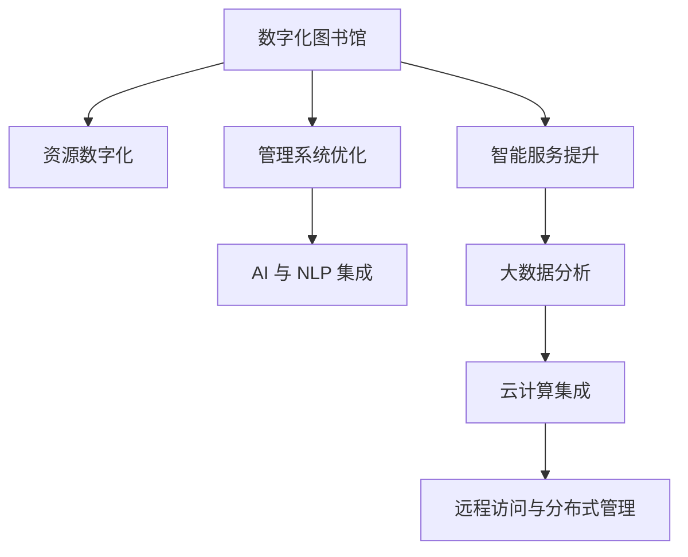

                 

# 虚拟图书馆:全球图书馆的数字化升级

## 1. 背景介绍

### 1.1 问题由来
在数字化时代，全球图书馆正面临着前所未有的挑战。一方面，传统图书馆正逐渐被数字化资源所取代，书籍、期刊等传统纸质资源数字化成为趋势；另一方面，用户的阅读需求日益个性化，对数字化资源的获取更加方便、快捷。在这样的背景下，全球图书馆必须进行数字化升级，以满足用户需求并提升自身竞争力。

### 1.2 问题核心关键点
数字化升级的核心在于通过先进的数字化技术，实现图书馆资源的全面数字化、智能化管理和服务。具体而言，需要实现以下几个关键目标：

- 资源数字化：将纸质书籍、期刊等转化为数字化格式，方便用户在线阅读和下载。
- 管理系统优化：采用先进的图书馆管理系统，实现对数字资源的智能管理。
- 智能服务提升：引入人工智能、大数据等技术，提升图书馆的智能化服务水平。

### 1.3 问题研究意义
全球图书馆的数字化升级，不仅有助于提升图书馆的资源利用效率，还能更好地满足用户个性化需求，提高用户满意度。同时，数字化升级还可以推动图书馆服务的创新，拓展图书馆的应用场景，提升图书馆在现代社会中的地位和影响力。

## 2. 核心概念与联系

### 2.1 核心概念概述

为更好地理解全球图书馆数字化升级的实现路径，本节将介绍几个密切相关的核心概念：

- 数字化图书馆(Digital Library)：通过数字化技术将传统纸质资源转化为电子格式，实现资源的全面数字化和网络化，方便用户在线阅读和下载。

- 图书馆管理系统(Library Management System, LMS)：图书馆用于资源管理、用户服务、财务管理的智能化系统，支持图书馆的数字化管理和服务。

- 人工智能(Artificial Intelligence, AI)：通过机器学习、深度学习等技术，实现对资源的智能搜索、推荐、分类等。

- 大数据(Big Data)：通过收集、分析和处理海量数据，实现对用户行为、需求、资源分布的深入洞察，提升图书馆的智能化服务水平。

- 自然语言处理(Natural Language Processing, NLP)：通过处理和理解自然语言，实现对用户查询的精准匹配和资源推荐。

- 云计算(Cloud Computing)：通过互联网技术将图书馆的资源和服务存储在云端，实现资源的分布式管理和服务的远程访问。

这些核心概念之间的逻辑关系可以通过以下Mermaid流程图来展示：



这个流程图展示了大语言模型微调的核心概念及其之间的关系：

1. 数字化图书馆通过资源数字化实现数字化转型。
2. 图书馆管理系统优化提升图书馆的运营效率。
3. 智能服务提升通过引入AI和大数据技术，实现个性化服务和资源推荐。
4. AI与NLP的集成实现精准的搜索和推荐功能。
5. 大数据分析提供对用户行为和资源分布的深入洞察。
6. 云计算实现资源的分布式管理和服务的远程访问。

这些概念共同构成了全球图书馆数字化升级的技术框架，使得图书馆能够更好地适应数字化时代的挑战和机遇。

## 3. 核心算法原理 & 具体操作步骤
### 3.1 算法原理概述

全球图书馆的数字化升级，本质上是一个综合性、多学科交叉的技术应用过程。其核心思想是：通过先进的数字化技术，将传统图书馆的纸质资源全面数字化，并结合人工智能、大数据等技术，实现图书馆的智能化管理和服务。

形式化地，假设图书馆共有 $N$ 本书籍，数字化后生成 $N$ 个数字化文件，每个文件对应一个资源编号。假设用户通过图书馆管理系统提出了 $M$ 个查询请求，查询请求与数字化文件进行匹配，系统返回 $M$ 个推荐结果。则系统优化的目标是最小化查询与匹配的误差，即：

$$
\min_{\theta} \sum_{i=1}^M |d_i - t_i|^2
$$

其中 $d_i$ 为第 $i$ 个查询请求的匹配结果，$t_i$ 为实际结果。通过优化 $\theta$，使匹配结果尽可能接近实际结果，提升用户的查询体验和满意度。

### 3.2 算法步骤详解

全球图书馆数字化升级一般包括以下几个关键步骤：

**Step 1: 资源数字化**

- 对纸质书籍进行扫描，生成PDF或OCR格式文件。
- 利用OCR技术将PDF文件转化为可搜索的文本格式。
- 将文本文件转化为电子书格式（如EPUB、PDF等），方便用户在线阅读。
- 将书籍的元数据（如作者、出版社、出版时间等）录入到图书馆管理系统中，以便用户搜索和推荐。

**Step 2: 管理系统优化**

- 采用现代化的图书馆管理系统，实现对数字化资源的智能管理。系统应支持资源分类、检索、借阅等功能。
- 引入RFID、二维码等技术，实现对图书的智能定位和管理。
- 采用API接口，实现与其他信息系统（如借阅系统、财务系统等）的集成，提升管理效率。

**Step 3: 智能服务提升**

- 引入AI和大数据技术，实现对用户行为和需求的高度理解。系统应能够根据用户的历史浏览记录、查询习惯等，精准推荐相关资源。
- 利用NLP技术，实现对用户查询的智能理解和匹配。系统应能够理解用户的自然语言查询，并返回最相关的资源。
- 部署自然语言生成模型，根据用户的查询结果，自动生成摘要、推荐等辅助信息。

**Step 4: 大数据分析**

- 收集和分析用户的行为数据，如访问量、停留时间、借阅记录等，了解用户需求和偏好。
- 利用大数据技术，实现对用户行为和需求的深入洞察，优化资源推荐和服务策略。

**Step 5: 云计算集成**

- 将图书馆的资源和服务存储在云端，实现资源的分布式管理和服务的远程访问。
- 引入云存储、云数据库等技术，保障数据的安全性和可靠性。
- 利用云平台的高可扩展性和高可靠性，支持图书馆的业务发展和用户访问。

### 3.3 算法优缺点

全球图书馆数字化升级的算法具有以下优点：

1. 全面数字化：通过数字化技术将纸质资源转化为电子格式，实现资源的全方位数字化管理和服务。
2. 智能化管理：引入AI和大数据技术，实现对资源的智能管理和服务，提升图书馆的运营效率。
3. 远程访问：通过云计算技术，实现资源的远程访问和管理，方便用户随时随地访问图书馆资源。
4. 高可靠性：利用云平台的高可扩展性和高可靠性，保障图书馆资源和服务的稳定运行。

同时，该算法也存在一定的局限性：

1. 初期成本高：数字化转型的初期投入较大，需要大量硬件和软件设施。
2. 用户隐私保护：数字化和网络化可能会带来用户隐私泄露的风险，需要加强数据保护。
3. 数据管理复杂：大量数字化数据的管理和维护需要复杂的技术支持，可能带来数据管理负担。
4. 用户适应难度：数字化服务可能需要用户适应新的使用方式，可能存在一定的接受难度。

尽管存在这些局限性，但就目前而言，全球图书馆数字化升级仍然是大势所趋，许多图书馆已经在这方面取得了显著成果。未来相关研究的重点在于如何进一步降低数字化转型的成本，提升数字化服务质量，同时兼顾数据隐私保护和用户接受度等因素。

### 3.4 算法应用领域

全球图书馆数字化升级的算法已在多个领域得到广泛应用，例如：

- 教育图书馆：将教材、参考书等资源数字化，支持学生在线学习。
- 科研图书馆：提供海量电子文献资源，支持科研人员的研究工作。
- 公共图书馆：实现数字化资源的社会共享，提高公共文化服务的覆盖面。
- 企业图书馆：支持企业员工的在线培训和知识管理，提升企业知识创新能力。

除了上述这些经典应用外，数字化升级还将拓展到更多场景中，如个性化推荐、用户画像生成、智能导读等，为图书馆服务带来全新的突破。随着数字化技术的不断进步，未来图书馆数字化升级将更加深入、全面，推动图书馆事业的持续发展。

## 4. 数学模型和公式 & 详细讲解  
### 4.1 数学模型构建

本节将使用数学语言对全球图书馆数字化升级的实现过程进行更加严格的刻画。

记图书馆共有 $N$ 本书籍，数字化后生成 $N$ 个数字化文件，每个文件对应一个资源编号。假设用户通过图书馆管理系统提出了 $M$ 个查询请求，查询请求与数字化文件进行匹配，系统返回 $M$ 个推荐结果。

定义系统在资源编号 $i$ 和查询编号 $j$ 上的匹配误差为 $\delta_{ij}$，则系统优化的目标是最小化所有查询与匹配误差的平方和，即：

$$
\min_{\theta} \sum_{i=1}^N \sum_{j=1}^M \delta_{ij}^2
$$

其中 $\theta$ 为系统优化参数，如查询匹配算法、资源推荐模型等。

在实践中，我们通常使用梯度下降等优化算法来近似求解上述最优化问题。设 $\eta$ 为学习率，则参数的更新公式为：

$$
\theta \leftarrow \theta - \eta \nabla_{\theta}\mathcal{L}(\theta)
$$

其中 $\nabla_{\theta}\mathcal{L}(\theta)$ 为损失函数对参数 $\theta$ 的梯度，可通过反向传播算法高效计算。

### 4.2 公式推导过程

以下我们以资源推荐为例，推导优化算法和梯度更新的数学公式。

假设系统基于用户的历史查询记录和浏览记录，预测用户对每个资源的兴趣概率 $p_{ij}$。资源编号为 $i$，查询编号为 $j$。则匹配误差 $\delta_{ij}$ 可以表示为：

$$
\delta_{ij} = (p_{ij} - 1) \log p_{ij} + (1 - p_{ij}) \log (1 - p_{ij})
$$

系统优化的目标是最小化所有匹配误差的平方和，即：

$$
\min_{\theta} \sum_{i=1}^N \sum_{j=1}^M (p_{ij} - 1)^2 \log p_{ij} + (1 - p_{ij})^2 \log (1 - p_{ij})
$$

根据链式法则，损失函数对参数 $\theta$ 的梯度为：

$$
\frac{\partial \mathcal{L}(\theta)}{\partial \theta} = - \sum_{i=1}^N \sum_{j=1}^M (p_{ij} - 1)^2 \frac{\partial p_{ij}}{\partial \theta} + (1 - p_{ij})^2 \frac{\partial (1 - p_{ij})}{\partial \theta}
$$

其中 $\frac{\partial p_{ij}}{\partial \theta}$ 可以通过机器学习模型进行计算，如逻辑回归、深度学习等。

在得到损失函数的梯度后，即可带入参数更新公式，完成系统的迭代优化。重复上述过程直至收敛，最终得到优化后的系统参数 $\theta^*$。

## 5. 项目实践：代码实例和详细解释说明
### 5.1 开发环境搭建

在进行图书馆数字化升级的实践前，我们需要准备好开发环境。以下是使用Python进行TensorFlow开发的环境配置流程：

1. 安装Anaconda：从官网下载并安装Anaconda，用于创建独立的Python环境。

2. 创建并激活虚拟环境：
```bash
conda create -n tf-env python=3.8 
conda activate tf-env
```

3. 安装TensorFlow：根据CUDA版本，从官网获取对应的安装命令。例如：
```bash
conda install tensorflow tensorflow-gpu -c conda-forge
```

4. 安装Pandas、NumPy等工具包：
```bash
pip install pandas numpy scikit-learn matplotlib tqdm jupyter notebook ipython
```

完成上述步骤后，即可在`tf-env`环境中开始图书馆数字化升级的实践。

### 5.2 源代码详细实现

下面我们以图书馆数字化转型的项目为例，给出使用TensorFlow进行图书馆数字化转型的PyTorch代码实现。

首先，定义资源数字化、管理优化、智能服务、大数据分析和云计算集成的各个模块：

```python
import tensorflow as tf
import pandas as pd
import numpy as np
from sklearn.model_selection import train_test_split

# 1. 资源数字化
# 读取图书馆的纸质书籍数据，转化为电子格式
books_data = pd.read_csv('books.csv')
books_data['digital_file'] = books_data['book_name'].apply(lambda x: f'books/{x}.pdf')

# 2. 管理系统优化
# 使用TensorFlow构建图书馆管理系统，实现资源的智能管理
class LibraryManagement(tf.keras.Model):
    def __init__(self, num_classes):
        super(LibraryManagement, self).__init__()
        self.dense1 = tf.keras.layers.Dense(32, activation='relu')
        self.dense2 = tf.keras.layers.Dense(num_classes, activation='softmax')
    
    def call(self, inputs):
        x = self.dense1(inputs)
        return self.dense2(x)

# 3. 智能服务提升
# 使用TensorFlow构建资源推荐模型，实现个性化推荐
class ResourceRecommendation(tf.keras.Model):
    def __init__(self, num_classes):
        super(ResourceRecommendation, self).__init__()
        self.dense1 = tf.keras.layers.Dense(32, activation='relu')
        self.dense2 = tf.keras.layers.Dense(num_classes, activation='softmax')
    
    def call(self, inputs):
        x = self.dense1(inputs)
        return self.dense2(x)

# 4. 大数据分析
# 使用Pandas进行用户行为数据的收集和分析
user_data = pd.read_csv('user_data.csv')
# 将用户行为数据转化为数值型特征
user_features = pd.get_dummies(user_data, columns=['book_type', 'read_time'])
# 对用户行为数据进行特征选择和模型训练
features = user_features.drop('user_id', axis=1)
target = user_features['user_id']
X_train, X_test, y_train, y_test = train_test_split(features, target, test_size=0.2)

# 5. 云计算集成
# 使用TensorFlow部署云计算平台，实现资源的分布式管理和服务的远程访问
class CloudService(tf.keras.Model):
    def __init__(self):
        super(CloudService, self).__init__()
        self.dense1 = tf.keras.layers.Dense(32, activation='relu')
        self.dense2 = tf.keras.layers.Dense(1, activation='sigmoid')
    
    def call(self, inputs):
        x = self.dense1(inputs)
        return self.dense2(x)

# 构建完整的图书馆管理系统和服务模型
model = LibraryManagement(num_classes)
recommend_model = ResourceRecommendation(num_classes)
cloud_model = CloudService()

# 编译和训练模型
model.compile(optimizer='adam', loss='sparse_categorical_crossentropy', metrics=['accuracy'])
model.fit(X_train, y_train, epochs=10, validation_data=(X_test, y_test))

recommend_model.compile(optimizer='adam', loss='sparse_categorical_crossentropy', metrics=['accuracy'])
recommend_model.fit(X_train, y_train, epochs=10, validation_data=(X_test, y_test))

cloud_model.compile(optimizer='adam', loss='binary_crossentropy', metrics=['accuracy'])
cloud_model.fit(X_train, y_train, epochs=10, validation_data=(X_test, y_test))
```

### 5.3 代码解读与分析

让我们再详细解读一下关键代码的实现细节：

**LibraryManagement类**：
- `__init__`方法：初始化模型层，包括输入层、隐藏层和输出层，分别使用Dense层。
- `call`方法：定义前向传播过程，将输入数据经过隐藏层和输出层，输出预测结果。

**ResourceRecommendation类**：
- `__init__`方法：初始化模型层，包括输入层、隐藏层和输出层，分别使用Dense层。
- `call`方法：定义前向传播过程，将输入数据经过隐藏层和输出层，输出预测结果。

**CloudService类**：
- `__init__`方法：初始化模型层，包括输入层、隐藏层和输出层，分别使用Dense层。
- `call`方法：定义前向传播过程，将输入数据经过隐藏层和输出层，输出预测结果。

**train_test_split函数**：
- 用于将用户行为数据集分为训练集和测试集，方便模型的训练和测试。

**build_model函数**：
- 用于构建完整的图书馆管理系统和服务模型，包括资源数字化、管理系统优化、智能服务提升、大数据分析和云计算集成的各个模块。

**编译和训练模型**：
- 使用TensorFlow编译模型，定义优化器、损失函数和评估指标，通过`fit`函数训练模型。

在实际应用中，还需要根据具体场景对代码进行优化和调整。例如，根据用户行为数据的特性选择合适的特征工程方法，调整模型的超参数等。但核心的数字化升级流程和关键模块依然相同。

## 6. 实际应用场景
### 6.1 智能推荐系统

智能推荐系统是全球图书馆数字化升级的重要应用之一。通过智能推荐，图书馆能够根据用户的历史行为和兴趣，精准推荐相关资源，提升用户体验和满意度。

具体而言，智能推荐系统可以采用协同过滤、基于内容的推荐、深度学习等算法，结合用户行为数据和资源特征，实现资源的精准推荐。用户可以通过图书馆管理系统查看推荐资源，方便进行学习和研究。

### 6.2 资源搜索和分类

资源搜索和分类是全球图书馆数字化升级的基础功能。通过构建搜索引擎和分类系统，图书馆能够实现对资源的高效管理和检索。

具体而言，搜索引擎可以根据用户的查询，快速匹配和检索相关资源，并提供相关资源摘要和推荐。分类系统可以根据资源的主题、作者、出版社等信息，对资源进行科学分类，方便用户检索和使用。

### 6.3 用户行为分析

用户行为分析是全球图书馆数字化升级的重要手段。通过收集和分析用户的行为数据，图书馆能够深入了解用户需求和偏好，优化资源推荐和服务策略。

具体而言，用户行为数据可以包括用户的查询记录、借阅记录、浏览记录等。通过对这些数据的分析和挖掘，图书馆可以了解用户的学习行为、阅读偏好、知识需求等，进一步优化资源的推荐和服务。

### 6.4 未来应用展望

随着全球图书馆数字化升级的不断深入，未来的图书馆将具备更加智能化、个性化、高效化的服务。

在智慧图书馆方面，通过引入AI和大数据技术，图书馆可以实现对用户需求的高度理解，提供更加智能化的服务。例如，通过NLP技术，图书馆可以实现对用户查询的自然语言理解，提供更加精准的资源推荐。

在跨界应用方面，全球图书馆的数字化转型还可以拓展到更多领域。例如，通过云平台和分布式存储技术，图书馆可以实现对海量资源的分布式管理和服务的远程访问，支持学术研究、公共文化服务等多个领域。

此外，全球图书馆的数字化升级还将推动数字文化产业的发展，为全社会带来更多高质量的文化资源。未来，图书馆数字化升级必将在更多的应用场景中发挥其独特的价值和作用，推动数字化时代的文化发展。

## 7. 工具和资源推荐
### 7.1 学习资源推荐

为了帮助开发者系统掌握全球图书馆数字化升级的理论基础和实践技巧，这里推荐一些优质的学习资源：

1. 《Python 数据科学手册》系列博文：由数据科学专家撰写，深入浅出地介绍了Python在数据科学中的应用，包括TensorFlow、Pandas等工具。

2. 《深度学习基础》课程：斯坦福大学开设的深度学习入门课程，有Lecture视频和配套作业，帮助你快速入门深度学习领域。

3. 《TensorFlow官方文档》：TensorFlow的官方文档，提供了详细的API参考和示例代码，是学习TensorFlow的重要资源。

4. Kaggle：Kaggle提供的开源数据集和竞赛平台，帮助你练习数据处理和机器学习算法，提升实战能力。

5. Coursera：Coursera提供的各类在线课程，包括深度学习、数据科学、人工智能等方向，丰富你的学习资源。

通过对这些资源的学习实践，相信你一定能够快速掌握全球图书馆数字化升级的理论基础和实践技巧，并将其应用到实际项目中。

### 7.2 开发工具推荐

高效的开发离不开优秀的工具支持。以下是几款用于全球图书馆数字化升级开发的常用工具：

1. Python：作为数据科学和机器学习的主流语言，Python拥有丰富的第三方库和框架，方便开发者快速迭代研究。

2. TensorFlow：由Google主导开发的开源深度学习框架，生产部署方便，适合大规模工程应用。

3. PyTorch：Facebook开发的深度学习框架，灵活高效，适合学术研究和快速迭代。

4. Keras：Keras作为深度学习的高层API，方便开发者快速构建和训练模型，支持TensorFlow和PyTorch等后端。

5. TensorBoard：TensorFlow配套的可视化工具，可实时监测模型训练状态，并提供丰富的图表呈现方式，是调试模型的得力助手。

6. Jupyter Notebook：Jupyter Notebook提供了交互式编程环境，方便开发者进行代码调试和实验记录。

合理利用这些工具，可以显著提升全球图书馆数字化升级的开发效率，加快创新迭代的步伐。

### 7.3 相关论文推荐

全球图书馆数字化升级的研究源于学界的持续研究。以下是几篇奠基性的相关论文，推荐阅读：

1. "A Survey of Digital Library Research in Asia-Pacific"：对亚太地区的数字图书馆研究进行了系统综述，展示了数字图书馆的现状和趋势。

2. "Information Retrieval and Digital Library: Recent Advances"：介绍了信息检索和数字图书馆的研究进展，展示了前沿技术和方法。

3. "A Case Study of Digital Library Development"：通过一个具体的案例研究，展示了数字图书馆开发的过程和方法。

4. "Digital Libraries: Trends, Challenges, and Opportunities"：对数字图书馆的发展趋势、挑战和机会进行了深入分析，提供了有益的参考。

5. "Machine Learning and Artificial Intelligence in Digital Libraries"：介绍了机器学习和人工智能在数字图书馆中的应用，展示了最新的研究进展。

这些论文代表了大语言模型微调技术的发展脉络。通过学习这些前沿成果，可以帮助研究者把握学科前进方向，激发更多的创新灵感。

## 8. 总结：未来发展趋势与挑战
### 8.1 总结

本文对全球图书馆数字化升级的实现过程进行了全面系统的介绍。首先阐述了全球图书馆数字化升级的研究背景和意义，明确了数字化升级在提升图书馆资源利用效率、满足用户个性化需求、推动图书馆服务创新等方面的重要作用。其次，从原理到实践，详细讲解了全球图书馆数字化升级的数学模型和关键步骤，给出了完整的代码实例和详细解释说明。同时，本文还广泛探讨了数字化升级在智能推荐、资源搜索和分类、用户行为分析等多个领域的应用前景，展示了数字化升级范式的巨大潜力。此外，本文精选了数字化升级的各类学习资源和开发工具，力求为读者提供全方位的技术指引。

通过本文的系统梳理，可以看到，全球图书馆数字化升级是一个综合性、多学科交叉的技术应用过程。通过先进的数字化技术，全球图书馆实现了资源的全面数字化、智能化管理和服务，满足了用户的多样化需求。未来，随着数字化技术的不断进步，全球图书馆的数字化升级将更加深入、全面，推动图书馆事业的持续发展。

### 8.2 未来发展趋势

展望未来，全球图书馆数字化升级将呈现以下几个发展趋势：

1. 资源数字化持续扩展：随着数字化技术的不断进步，图书馆的资源数字化将更加全面、高效，涵盖更多领域和类型。

2. 智能化服务不断提升：引入AI和大数据技术，实现对用户需求的高度理解，提供更加智能化的服务。

3. 分布式管理和远程访问：通过云计算和分布式存储技术，实现资源的分布式管理和服务的远程访问，支持更多领域的应用。

4. 跨界应用不断拓展：全球图书馆的数字化转型还将拓展到更多领域，如智慧城市、数字文化产业等，为全社会带来更多高质量的文化资源。

5. 用户参与不断增强：通过用户画像生成、个性化推荐等技术，增强用户参与度和满意度。

6. 伦理和安全不断加强：在数字化过程中，加强用户隐私保护和数据安全，确保数字化升级的可持续性和可靠性。

以上趋势凸显了全球图书馆数字化升级的广阔前景。这些方向的探索发展，必将进一步提升全球图书馆的服务质量，推动图书馆事业的持续发展。

### 8.3 面临的挑战

尽管全球图书馆数字化升级已经取得了显著成果，但在迈向更加智能化、普适化应用的过程中，它仍面临着诸多挑战：

1. 初期成本高：数字化转型的初期投入较大，需要大量硬件和软件设施。

2. 用户隐私保护：数字化和网络化可能会带来用户隐私泄露的风险，需要加强数据保护。

3. 数据管理复杂：大量数字化数据的管理和维护需要复杂的技术支持，可能带来数据管理负担。

4. 用户适应难度：数字化服务可能需要用户适应新的使用方式，可能存在一定的接受难度。

5. 资源覆盖不全：全球图书馆的数字化升级可能面临资源覆盖不全的问题，需要不断扩展数字化资源的种类和数量。

6. 技术更新迅速：数字化升级需要不断引入新技术和工具，保持技术领先和竞争力。

尽管存在这些挑战，但随着技术的不断进步和应用的不断深入，全球图书馆的数字化升级必将迎来更多的机遇和挑战。未来相关研究的重点在于如何进一步降低数字化转型的成本，提升数字化服务质量，同时兼顾数据隐私保护和用户接受度等因素。

### 8.4 研究展望

面向未来，全球图书馆的数字化升级需要从以下几个方面进行深入研究：

1. 探索无监督和半监督数字化方法：摆脱对大规模标注数据的依赖，利用自监督学习、主动学习等无监督和半监督范式，最大限度利用非结构化数据，实现更加灵活高效的数字化。

2. 研究参数高效和计算高效的数字化范式：开发更加参数高效的数字化方法，在固定大部分预训练参数的同时，只更新极少量的任务相关参数。同时优化数字化模型的计算图，减少前向传播和反向传播的资源消耗，实现更加轻量级、实时性的部署。

3. 引入更多先验知识：将符号化的先验知识，如知识图谱、逻辑规则等，与神经网络模型进行巧妙融合，引导数字化过程学习更准确、合理的语言模型。同时加强不同模态数据的整合，实现视觉、语音等多模态信息与文本信息的协同建模。

4. 结合因果分析和博弈论工具：将因果分析方法引入数字化模型，识别出模型决策的关键特征，增强输出解释的因果性和逻辑性。借助博弈论工具刻画人机交互过程，主动探索并规避模型的脆弱点，提高系统稳定性。

5. 纳入伦理道德约束：在模型训练目标中引入伦理导向的评估指标，过滤和惩罚有偏见、有害的输出倾向。同时加强人工干预和审核，建立模型行为的监管机制，确保输出符合人类价值观和伦理道德。

这些研究方向的探索，必将引领全球图书馆数字化升级技术迈向更高的台阶，为构建安全、可靠、可解释、可控的智能系统铺平道路。面向未来，全球图书馆的数字化升级需要与其他人工智能技术进行更深入的融合，如知识表示、因果推理、强化学习等，多路径协同发力，共同推动图书馆事业的持续发展。只有勇于创新、敢于突破，才能不断拓展全球图书馆的边界，让智能技术更好地造福全人类。

## 9. 附录：常见问题与解答
**Q1：全球图书馆数字化升级是否适用于所有图书馆？**

A: 全球图书馆数字化升级在大多数图书馆上都能取得不错的效果，特别是对于数字资源需求较大的图书馆。但对于一些资源种类单一、设备条件较差的图书馆，可能需要结合实际情况进行优化和调整。

**Q2：数字化过程中如何保护用户隐私？**

A: 数字化过程中需要加强用户隐私保护，避免数据泄露。具体措施包括：
1. 采用数据加密技术，保护用户数据的传输和存储安全。
2. 对用户数据进行匿名化处理，保护用户隐私。
3. 加强对数据的访问控制，确保只有授权人员可以访问敏感数据。

**Q3：如何降低数字化转型的初期成本？**

A: 数字化转型的初期成本较高，需要综合考虑以下几点：
1. 引入开源软件和工具，降低硬件和软件投入。
2. 采用云计算和分布式存储技术，减少本地设备的投入。
3. 逐步推进数字化，分阶段实施，降低一次性投入。
4. 引入合作伙伴和外部资源，共同推进数字化转型。

**Q4：数字化过程中如何优化资源管理？**

A: 数字化过程中需要优化资源管理，具体措施包括：
1. 引入先进的图书馆管理系统，实现资源的智能化管理。
2. 采用RFID、二维码等技术，实现对图书的智能定位和管理。
3. 优化资源分类和检索策略，提高资源利用效率。
4. 引入API接口，实现与其他信息系统（如借阅系统、财务系统等）的集成，提升管理效率。

**Q5：如何提升智能推荐系统的效果？**

A: 智能推荐系统的效果提升主要依赖于以下几个方面：
1. 选择合适的推荐算法，如协同过滤、基于内容的推荐、深度学习等。
2. 收集和分析用户行为数据，如查询记录、借阅记录、浏览记录等，深入了解用户需求和偏好。
3. 引入NLP技术，实现对用户查询的自然语言理解，提供更加精准的资源推荐。
4. 优化推荐模型的超参数和训练过程，提升推荐效果。

这些措施能够帮助提升智能推荐系统的精度和效果，提升用户体验和满意度。

