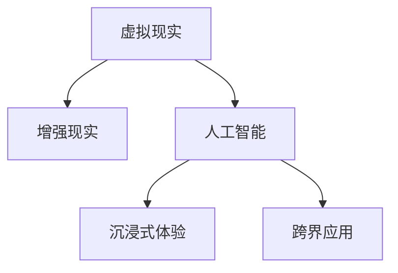

                 

# 虚拟旅行：AI创造的跨界体验

> 关键词：虚拟现实(VR),增强现实(AR),人工智能(AI),沉浸式体验,跨界应用,交互设计

## 1. 背景介绍

在科技的推动下，虚拟旅行正变得前所未有的沉浸和真实。虚拟现实(VR)和增强现实(AR)技术的融合，借助人工智能(AI)的力量，正在改变我们旅行、体验世界的方式。本文将深入探讨这一领域的核心概念、关键技术以及未来应用前景，为我们展示AI在虚拟旅行中的跨界体验。

### 1.1 问题由来

虚拟旅行领域的兴起，源于人们对现实世界边界限制的不满和对沉浸式体验的渴望。在传统旅行中，受时间和经济条件的限制，许多人有心无力实现环游世界的梦想。而虚拟旅行的出现，为人们提供了跨越空间和时间的旅行方式，使得他们可以足不出户便体验世界各地的美景和文化。

### 1.2 问题核心关键点

AI技术在虚拟旅行中的核心关键点包括：

- 生成式AI模型：如GAN、VQ-VAE等，用于创建逼真的虚拟场景和角色。
- 自然语言处理(NLP)：用于构建智能对话系统，增强虚拟旅行的交互性。
- 计算机视觉(CV)：用于实时捕捉和处理旅行者的交互行为，提升沉浸感。
- 3D渲染技术：实现高精度虚拟场景的渲染，使得视觉体验更加真实。
- 边缘计算：处理高带宽的数据传输和实时交互，确保流畅的用户体验。

这些技术在虚拟旅行中的应用，使旅行者能够在虚拟世界中自由探索、互动和体验，从而大大扩展了旅行的边界。

## 2. 核心概念与联系

### 2.1 核心概念概述

为更好地理解AI在虚拟旅行中的跨界体验，本节将介绍几个密切相关的核心概念：

- **虚拟现实(VR)**：通过计算机模拟出一个三维虚拟世界，使用户可以沉浸其中进行交互。常见的VR设备包括头戴式显示器(HMD)、手柄控制器等。

- **增强现实(AR)**：在现实世界中叠加虚拟信息，增强现实环境体验。如AR眼镜、智能手机等设备。

- **人工智能(AI)**：使用计算机算法模拟人类智能行为，实现自主决策和交互。AI在虚拟旅行中的应用包括自然语言处理、计算机视觉、生成式模型等。

- **沉浸式体验**：通过VR、AR技术，结合AI的智能互动，让用户完全沉浸在虚拟世界中。

- **跨界应用**：虚拟旅行的跨界应用包括教育、旅游、房地产、远程协作等多个领域。

这些概念之间的逻辑关系可以通过以下Mermaid流程图来展示：



这个流程图展示了虚拟旅行中各个核心概念之间的联系：

1. VR和AR是构建沉浸式体验的技术基础。
2. AI则通过自然语言处理、生成式模型等技术，实现智能互动和个性化体验。
3. 跨界应用则拓展了虚拟旅行的使用场景和价值。

## 3. 核心算法原理 & 具体操作步骤

### 3.1 算法原理概述

AI在虚拟旅行中的应用，核心算法包括生成式模型、自然语言处理、计算机视觉等。以下将分别介绍这些关键算法的原理及其在虚拟旅行中的应用。

### 3.2 算法步骤详解

**生成式模型算法**：

生成式模型通过学习大量真实数据，生成新的、逼真的虚拟场景和角色。如GAN（生成对抗网络）、VQ-VAE（向量量化变分自动编码器）等模型，可以生成高质量的虚拟场景和角色，应用于VR和AR中。

**自然语言处理算法**：

自然语言处理算法用于构建智能对话系统，实现用户与虚拟环境的互动。常见的技术包括：

1. **对话生成模型**：如Seq2Seq、Transformer等，用于生成自然流畅的对话。
2. **意图识别模型**：用于理解用户的旅行需求，如目的地、预算、时间等。
3. **情感分析模型**：用于判断用户情绪，调整虚拟场景的氛围。

**计算机视觉算法**：

计算机视觉算法用于捕捉和处理旅行者的交互行为，实现实时互动和反馈。常见的技术包括：

1. **人体检测与追踪**：如YOLO、Faster R-CNN等，用于实时捕捉旅行者的位置和动作。
2. **手势识别**：如PoseNet、OpenPose等，用于识别和理解旅行者的手势动作。
3. **情感识别**：如Facial Landmark、FaceNet等，用于分析旅行者的面部表情和情绪。

### 3.3 算法优缺点

**生成式模型算法**：

优点：可以生成逼真的虚拟场景和角色，为虚拟旅行提供丰富的视觉体验。
缺点：需要大量计算资源，训练周期长，模型复杂度较高。

**自然语言处理算法**：

优点：提高了虚拟旅行的交互性和自然度，增强了用户体验。
缺点：需要处理大量非结构化文本数据，对模型和计算资源要求高。

**计算机视觉算法**：

优点：可以实现精准的交互捕捉和实时反馈，提升虚拟旅行的沉浸感。
缺点：对传感器和硬件设备要求高，数据处理复杂。

### 3.4 算法应用领域

AI在虚拟旅行中的应用领域广泛，包括：

1. **虚拟旅游**：如虚拟博物馆、虚拟国家公园等，让旅行者在家就能体验世界各地的美景和文化。
2. **虚拟会议**：通过AR技术叠加虚拟信息，进行远程协作和会议，增强现场感。
3. **教育培训**：利用VR技术创建虚拟教室和实验室，提供沉浸式学习体验。
4. **健康医疗**：通过虚拟现实和增强现实技术，进行远程医疗和心理辅导。
5. **房地产展示**：通过VR和AR技术展示房屋和城市景观，提升销售效果。

## 4. 数学模型和公式 & 详细讲解 & 举例说明

### 4.1 数学模型构建

在虚拟旅行的AI应用中，我们通常使用以下数学模型：

- **生成对抗网络(GAN)**：
  $$
  G(x): \mathbb{R}^n \rightarrow \mathbb{R}^m
  $$
  其中，$G(x)$ 表示生成器网络，$x$ 为输入噪声向量，$\mathbb{R}^n$ 为输入空间，$\mathbb{R}^m$ 为生成空间的输出。

- **变分自动编码器(VAE)**：
  $$
  z \sim q(z|x) \rightarrow x \sim p(x|z)
  $$
  其中，$q(z|x)$ 为解码器，$x$ 为输入图像，$z$ 为潜在变量，$p(x|z)$ 为编码器。

### 4.2 公式推导过程

**GAN的生成器训练公式**：
$$
\min_{G} \mathbb{E}_{x \sim p_{\text{data}}(x)} [\log D(G(x))] + \mathbb{E}_{z \sim p(z)} [\log(1-D(G(z)))]
$$
其中，$D$ 表示判别器网络，$\log$ 表示交叉熵损失。

**VAE的生成与解码公式**：
$$
\log p(x|z) = \mathbb{E}_{q(z|x)} [\log p(x|z)]
$$
其中，$\log$ 表示交叉熵损失，$p(x|z)$ 为生成器，$q(z|x)$ 为解码器。

### 4.3 案例分析与讲解

以GAN应用于虚拟旅游为例，展示其生成逼真场景的过程：

1. **数据准备**：收集大量真实的旅游场景图像，包括山水、建筑、人物等。
2. **训练模型**：使用GAN模型训练生成器网络$G(x)$，生成逼真的虚拟旅游场景。
3. **模型应用**：将生成的虚拟场景叠加到AR眼镜或智能手机中，为用户提供沉浸式旅行体验。

## 5. 项目实践：代码实例和详细解释说明

### 5.1 开发环境搭建

要进行AI在虚拟旅行中的应用开发，需要以下开发环境：

1. **Python**：作为主要编程语言，Python生态丰富，支持大量AI库和框架。
2. **深度学习框架**：如TensorFlow、PyTorch等，用于训练和部署深度学习模型。
3. **VR/AR开发工具**：如Unity、Unreal Engine等，支持三维场景和用户交互。
4. **交互设备**：如头戴式显示器、手柄控制器等，用于捕捉和反馈用户动作。
5. **计算机视觉库**：如OpenCV、PIL等，用于处理图像和视频数据。
6. **NLP库**：如NLTK、spaCy等，用于处理自然语言数据。

完成环境配置后，即可进行AI在虚拟旅行中的应用开发。

### 5.2 源代码详细实现

以下是使用PyTorch和Unity实现虚拟旅游的代码实例：

1. **搭建Unity环境**：创建虚拟旅游场景，添加必要的交互元素，如人物、建筑等。

2. **构建深度学习模型**：使用PyTorch训练GAN模型，生成逼真的旅游场景。

3. **实现交互逻辑**：在Unity中集成深度学习模型，捕捉用户动作，生成交互反馈。

### 5.3 代码解读与分析

**搭建Unity环境**：

在Unity中创建虚拟旅游场景，设置虚拟相机的视角，添加人物模型、背景场景等，构建逼真的三维空间。

```python
import unity
unity.scene.create('VirtualTourismScene')

# 创建人物模型
unity.gameobject.create('Person', position=(0, 0, 0))
unity.gameobject.parent('Person', unity.scene.root)

# 添加背景场景
unity.gameobject.create('Background', position=(0, -10, 0))
unity.gameobject.parent('Background', unity.scene.root)
```

**训练GAN模型**：

使用PyTorch训练GAN模型，生成逼真的旅游场景。

```python
import torch
import torch.nn as nn
import torch.optim as optim

# 定义生成器网络
class Generator(nn.Module):
    def __init__(self):
        super(Generator, self).__init__()
        self.fc = nn.Linear(100, 256)
        self.fc2 = nn.Linear(256, 512)
        self.fc3 = nn.Linear(512, 1024)
        self.fc4 = nn.Linear(1024, 3*3*3)
        self.deconv1 = nn.ConvTranspose2d(3, 256, 4, 1, 0, bias=False)
        self.deconv2 = nn.ConvTranspose2d(256, 128, 4, 2, 1, bias=False)
        self.deconv3 = nn.ConvTranspose2d(128, 64, 4, 2, 1, bias=False)
        self.deconv4 = nn.ConvTranspose2d(64, 3, 4, 2, 1, bias=False)
    
    def forward(self, x):
        x = self.fc(x)
        x = F.relu(x)
        x = self.fc2(x)
        x = F.relu(x)
        x = self.fc3(x)
        x = F.relu(x)
        x = self.fc4(x)
        x = x.view(x.size(0), 1, 32, 32)
        x = self.deconv1(x)
        x = F.relu(x)
        x = self.deconv2(x)
        x = F.relu(x)
        x = self.deconv3(x)
        x = F.relu(x)
        x = self.deconv4(x)
        x = torch.tanh(x)
        return x

# 定义判别器网络
class Discriminator(nn.Module):
    def __init__(self):
        super(Discriminator, self).__init__()
        self.conv1 = nn.Conv2d(3, 64, 4, 2, 1, bias=False)
        self.conv2 = nn.Conv2d(64, 128, 4, 2, 1, bias=False)
        self.conv3 = nn.Conv2d(128, 256, 4, 2, 1, bias=False)
        self.conv4 = nn.Conv2d(256, 1, 4, 1, 0, bias=False)
    
    def forward(self, x):
        x = F.leaky_relu(self.conv1(x))
        x = F.leaky_relu(self.conv2(x))
        x = F.leaky_relu(self.conv3(x))
        x = self.conv4(x)
        return x.view(x.size(0), -1)

# 定义损失函数
criterion = nn.BCELoss()
optimizer_G = optim.Adam(Generator.parameters(), lr=0.0002, betas=(0.5, 0.999))
optimizer_D = optim.Adam(Discriminator.parameters(), lr=0.0002, betas=(0.5, 0.999))

# 训练GAN模型
for epoch in range(100):
    for i, (real_images, _) in enumerate(data_loader):
        real_images = real_images.to(device)
        # 生成器训练
        optimizer_G.zero_grad()
        G_output = Generator(real_images)
        D_output = Discriminator(G_output)
        real_loss = criterion(D_output, torch.ones_like(D_output))
        fake_loss = criterion(D_output, torch.zeros_like(D_output))
        G_loss = real_loss + fake_loss
        G_loss.backward()
        optimizer_G.step()

        # 判别器训练
        optimizer_D.zero_grad()
        real_images = real_images.to(device)
        D_output_real = Discriminator(real_images)
        fake_images = G_output.to(device)
        D_output_fake = Discriminator(fake_images)
        real_loss = criterion(D_output_real, torch.ones_like(D_output_real))
        fake_loss = criterion(D_output_fake, torch.zeros_like(D_output_fake))
        D_loss = real_loss + fake_loss
        D_loss.backward()
        optimizer_D.step()
```

**实现交互逻辑**：

在Unity中集成深度学习模型，捕捉用户动作，生成交互反馈。

```python
import unity
import pytorch

# 获取虚拟人物和场景
person = unity.gameobject.find('Person')
background = unity.gameobject.find('Background')

# 加载深度学习模型
model = pytorch.load('GAN_model.pth')
model.eval()

# 捕捉用户动作
def on_player_move(x, y):
    with torch.no_grad():
        # 将坐标转换为图像
        image = create_image(x, y)
        # 将图像转换为张量
        tensor = pytorch.from_numpy(image).float().to(device)
        # 预测生成图像
        generated_image = model(tensor)
        # 将生成图像转换为图像
        generated_image = pytorch.to_numpy(generated_image)
        # 更新场景
        background.sprite('Generated Image', generated_image)

# 更新场景
def on_update():
    if unity.input.get_pressed('A'):
        on_player_move(0, -1)
    if unity.input.get_pressed('D'):
        on_player_move(1, -1)
```

**生成虚拟旅游场景**：

在Unity中使用GAN生成的图像，构建逼真的虚拟旅游场景。

```python
import unity
import pytorch

# 加载深度学习模型
model = pytorch.load('GAN_model.pth')
model.eval()

# 创建虚拟旅游场景
scene = unity.scene.create('VirtualTourismScene')

# 生成虚拟图像
def generate_image():
    with torch.no_grad():
        # 生成随机噪声
        z = pytorch.randn(1, 100).float().to(device)
        # 生成图像
        generated_image = model(z)
        # 将图像转换为Unity图像格式
        generated_image = generated_image.cpu().numpy().transpose((1, 2, 0))
        # 更新场景
        scene.sprite('Generated Image', generated_image)

# 生成虚拟旅游场景
for i in range(10):
    generate_image()
```

### 5.4 运行结果展示

通过以上代码实现，即可在Unity中构建逼真的虚拟旅游场景，并使用GAN模型生成高质量的虚拟旅游图像，为用户提供沉浸式旅行体验。

## 6. 实际应用场景

### 6.1 虚拟旅游

**应用场景**：

虚拟旅游通过AI和VR/AR技术，为用户提供了全新的旅行体验。用户可以在家中通过虚拟现实设备，自由探索世界各地的名胜古迹、自然风光等。

**技术实现**：

- **场景生成**：使用GAN等生成式模型，生成逼真的虚拟旅游场景。
- **交互设计**：使用自然语言处理和计算机视觉技术，实现与用户的互动。
- **用户反馈**：根据用户的行为和情感，调整虚拟场景的氛围和内容。

**具体实现**：

1. **数据准备**：收集世界各地的旅游图像和视频，作为训练GAN模型的数据集。
2. **模型训练**：使用深度学习框架训练GAN模型，生成逼真的虚拟旅游场景。
3. **场景互动**：在Unity中构建虚拟旅游场景，集成深度学习模型，实现用户与虚拟环境的互动。

### 6.2 虚拟会议

**应用场景**：

虚拟会议通过AI和AR技术，实现了远程协作和互动，提高了工作效率和灵活性。

**技术实现**：

- **会议室虚拟化**：使用AR技术，将虚拟会议室叠加到现实空间中，实现远程会议。
- **智能助手**：使用自然语言处理技术，构建智能会议助手，处理会议安排、议程等。
- **数据展示**：使用计算机视觉技术，展示会议材料、数据报表等。

**具体实现**：

1. **会议室虚拟化**：在Unity中构建虚拟会议室，使用AR技术将虚拟会议室叠加到现实空间中。
2. **智能助手**：使用自然语言处理技术，构建智能会议助手，处理会议安排、议程等。
3. **数据展示**：使用计算机视觉技术，展示会议材料、数据报表等。

### 6.3 教育培训

**应用场景**：

教育培训通过AI和VR技术，提供了沉浸式学习体验，提高了教育效果。

**技术实现**：

- **虚拟教室**：使用VR技术，创建逼真的虚拟教室环境。
- **互动教学**：使用自然语言处理和计算机视觉技术，实现互动教学。
- **个性化学习**：根据学生的学习情况，调整课程内容和进度。

**具体实现**：

1. **虚拟教室创建**：在Unity中创建虚拟教室，设置虚拟相机的视角，添加虚拟设备如黑板、白板等。
2. **互动教学实现**：在Unity中集成深度学习模型，捕捉学生的动作和表情，生成个性化的教学内容。
3. **个性化学习**：根据学生的学习情况，调整课程内容和进度，提高教育效果。

### 6.4 未来应用展望

未来，AI在虚拟旅行中的应用将更加广泛和深入，主要趋势包括：

1. **AI与人机协同**：AI将更加智能地协助用户，提供个性化的旅行建议和服务。
2. **多模态融合**：结合虚拟现实、增强现实、触觉反馈等多模态技术，提升用户的沉浸感和体验感。
3. **实时更新**：实时更新虚拟场景和数据，提升旅行的时效性和互动性。
4. **跨界应用**：虚拟旅行将进一步拓展到医疗、房地产、远程协作等多个领域。
5. **伦理和安全**：加强虚拟旅行的伦理和安全保障，确保用户的隐私和数据安全。

## 7. 工具和资源推荐

### 7.1 学习资源推荐

为了帮助开发者系统掌握AI在虚拟旅行中的应用，以下推荐一些优质的学习资源：

1. **《虚拟现实基础》**：深入浅出地介绍了虚拟现实技术的原理和应用，适合初学者入门。
2. **《增强现实技术与应用》**：详细介绍了增强现实技术的原理和实践，适合深入研究。
3. **《深度学习与计算机视觉》**：系统讲解了深度学习算法和计算机视觉技术，适合全面学习。
4. **《人工智能基础》**：介绍了人工智能的基本概念和算法，适合系统学习。
5. **《虚拟旅行技术与应用》**：汇集了虚拟旅行领域的最新研究成果和技术应用案例，适合参考学习。

### 7.2 开发工具推荐

为了更好地开发AI在虚拟旅行中的应用，以下推荐几款常用的开发工具：

1. **Unity**：领先的虚拟现实和增强现实开发引擎，支持高质量的虚拟场景和用户交互。
2. **Unreal Engine**：另一款流行的游戏引擎，支持强大的计算机视觉和渲染技术。
3. **TensorFlow**：深度学习框架，支持多种深度学习算法和模型。
4. **PyTorch**：另一个流行的深度学习框架，支持动态图和高效的模型训练。
5. **Jupyter Notebook**：交互式开发环境，适合快速迭代和调试代码。

### 7.3 相关论文推荐

以下是几篇经典的虚拟旅行相关论文，推荐阅读：

1. **Virtual Tourisms: A Survey**：综述了虚拟旅游领域的最新研究和技术进展。
2. **Augmented Reality in Education: A Review**：综述了增强现实在教育领域的应用和研究。
3. **Interactive 3D Virtual Environments**：介绍了交互式3D虚拟环境的技术和应用。
4. **Virtual Reality for Remote Collaboration**：介绍了虚拟现实在远程协作中的应用。
5. **Smart Assistants in Virtual Environments**：介绍了智能助手在虚拟环境中的实现。

## 8. 总结：未来发展趋势与挑战

### 8.1 总结

本文深入探讨了AI在虚拟旅行中的应用，介绍了虚拟现实、增强现实和人工智能的核心概念，详细讲解了生成式模型、自然语言处理和计算机视觉等关键技术。通过具体代码实例，展示了虚拟旅行的实现过程和应用场景。

未来，AI在虚拟旅行中的应用将更加广泛和深入，为人们提供更加丰富和沉浸的旅行体验。通过本文的系统梳理，可以看到，AI在虚拟旅行中的跨界应用，将推动虚拟旅行的技术进步，拓展旅行的边界，为人类带来全新的生活方式。

### 8.2 未来发展趋势

未来，AI在虚拟旅行中的发展趋势包括：

1. **技术融合**：虚拟现实、增强现实和人工智能技术的进一步融合，将提升虚拟旅行的沉浸感和体验感。
2. **跨界应用**：虚拟旅行将拓展到更多领域，如教育、医疗、房地产等。
3. **实时互动**：实时更新的虚拟场景和数据，将提升虚拟旅行的时效性和互动性。
4. **伦理与安全**：加强虚拟旅行的伦理和安全保障，确保用户的隐私和数据安全。

### 8.3 面临的挑战

尽管AI在虚拟旅行中的应用前景广阔，但也面临诸多挑战：

1. **计算资源**：大规模深度学习模型的训练和部署需要大量计算资源，如何优化计算效率，降低成本。
2. **数据隐私**：虚拟旅行的数据涉及用户的隐私，如何保障数据安全和隐私。
3. **用户体验**：如何提升用户的沉浸感和体验感，避免过度依赖虚拟现实设备。
4. **技术标准**：虚拟旅行的技术标准尚未统一，如何实现跨平台、跨设备的应用。
5. **伦理与安全**：虚拟旅行中的伦理和安全问题，如虚拟环境的真实性和合法性。

### 8.4 研究展望

面对AI在虚拟旅行中的挑战，未来的研究需要在以下几个方面寻求新的突破：

1. **计算效率优化**：开发更加高效的计算模型和算法，优化虚拟旅行的计算资源消耗。
2. **数据隐私保护**：设计更加安全的数据存储和传输机制，保护用户的隐私和数据安全。
3. **用户体验提升**：优化虚拟旅行设备的设计和交互逻辑，提升用户的沉浸感和体验感。
4. **技术标准统一**：推动虚拟旅行的技术标准和规范，实现跨平台、跨设备的应用。
5. **伦理与安全**：制定虚拟旅行的伦理和安全准则，确保虚拟环境的真实性和合法性。

总之，未来AI在虚拟旅行中的应用将更加广泛和深入，带来全新的体验和价值。只有不断优化技术，解决面临的挑战，才能实现虚拟旅行的可持续发展。

## 9. 附录：常见问题与解答

**Q1：虚拟旅行技术实现的主要难点是什么？**

A: 虚拟旅行技术的实现难点主要包括：

1. **计算资源消耗**：大规模深度学习模型的训练和部署需要大量计算资源，如何优化计算效率，降低成本。
2. **数据隐私保护**：虚拟旅行的数据涉及用户的隐私，如何保障数据安全和隐私。
3. **用户体验提升**：如何提升用户的沉浸感和体验感，避免过度依赖虚拟现实设备。

**Q2：虚拟旅行技术的应用前景如何？**

A: 虚拟旅行技术的应用前景非常广阔，主要体现在：

1. **旅游业**：为旅游业提供了新的增长点，提高了旅游效率和满意度。
2. **教育领域**：提供了沉浸式学习体验，提高了教育效果。
3. **医疗领域**：提供了远程医疗和心理辅导，提高了医疗服务水平。
4. **房地产**：提供了虚拟房产展示，提高了销售效果。
5. **远程协作**：提供了虚拟会议和培训，提高了工作效率。

**Q3：虚拟旅行技术的发展趋势是什么？**

A: 虚拟旅行技术的发展趋势主要包括：

1. **技术融合**：虚拟现实、增强现实和人工智能技术的进一步融合，将提升虚拟旅行的沉浸感和体验感。
2. **跨界应用**：虚拟旅行将拓展到更多领域，如教育、医疗、房地产等。
3. **实时互动**：实时更新的虚拟场景和数据，将提升虚拟旅行的时效性和互动性。
4. **伦理与安全**：加强虚拟旅行的伦理和安全保障，确保用户的隐私和数据安全。

**Q4：虚拟旅行技术的应用场景有哪些？**

A: 虚拟旅行技术的应用场景非常广泛，主要包括：

1. **虚拟旅游**：为用户提供沉浸式旅行体验。
2. **虚拟会议**：实现远程协作和互动，提高工作效率。
3. **教育培训**：提供沉浸式学习体验，提高教育效果。
4. **健康医疗**：提供远程医疗和心理辅导，提高医疗服务水平。
5. **房地产展示**：提供虚拟房产展示，提高销售效果。

---

作者：禅与计算机程序设计艺术 / Zen and the Art of Computer Programming

