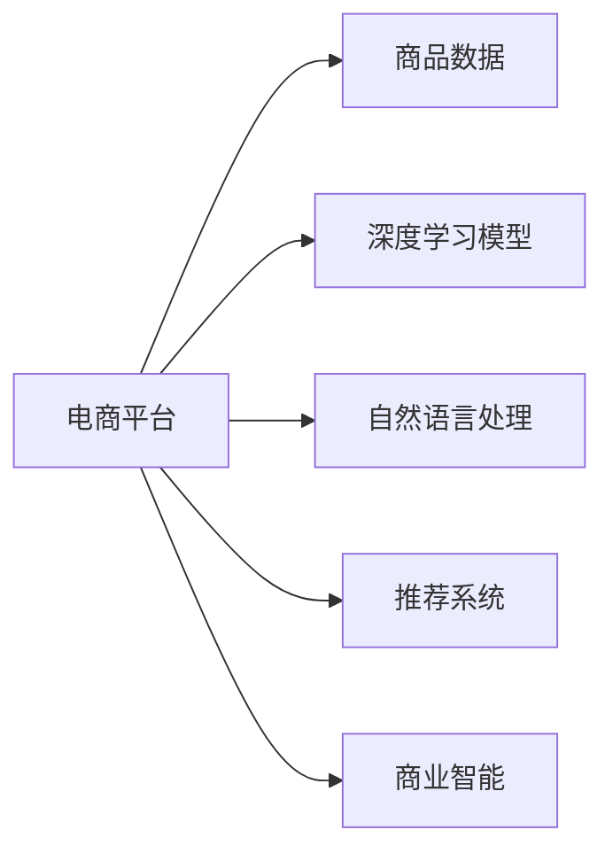

                 

# AI大模型在电商平台商品分类优化中的应用

> 关键词：
1. 电商平台
2. 商品分类
3. 大模型
4. 深度学习
5. 自然语言处理
6. 推荐系统
7. 商业智能

## 1. 背景介绍

### 1.1 问题由来

电商平台商品分类是一个复杂且关键的难题，直接关系到用户的购物体验和平台运营效率。传统的商品分类依赖于人工标注，不仅成本高，而且容易出错，难以适应海量商品和高频更新的特点。而随着深度学习和大模型的兴起，利用AI技术进行自动化商品分类成为可能，大大提升了分类的效率和准确度。

在大数据和AI技术的基础上，电商平台可以利用深度学习模型，结合自然语言处理和推荐系统技术，自动实现商品分类，为消费者提供个性化推荐，同时为商家提供精准的市场分析，提升整体运营效益。本文将系统介绍如何利用大模型实现电商平台的商品分类优化。

### 1.2 问题核心关键点

当前电商平台的商品分类问题主要包含以下几个方面：

1. **海量数据处理**：电商平台商品数量巨大，数据处理复杂。
2. **多样性**：商品种类繁多，存在多种属性和描述。
3. **实时更新**：商品种类频繁更新，分类模型需要实时适应新商品。
4. **多模态数据**：商品信息不仅包括文本描述，还包括图片、视频等多模态数据。
5. **高性能要求**：实时响应用户查询，需要高性能模型。

## 2. 核心概念与联系

### 2.1 核心概念概述

为了更好地理解AI大模型在电商平台商品分类中的应用，本节将介绍几个关键概念及其联系：

- **深度学习模型**：如卷积神经网络(CNN)、循环神经网络(RNN)和Transformer等，这些模型通过多层次特征提取和表示学习，实现对复杂数据结构的建模。
- **自然语言处理(NLP)**：涉及文本表示、语义理解、语言生成等任务，在商品分类中主要用于文本描述的语义分析和处理。
- **推荐系统**：通过分析用户行为数据，为用户推荐感兴趣的商品，在商品分类中用于个性化推荐。
- **商业智能(BI)**：结合数据挖掘、数据分析和可视化等技术，为电商平台提供市场分析和决策支持，帮助商家优化商品策略。

这些概念通过深度学习模型有机结合，形成了电商平台的智能商品分类体系，能够实现对海量商品数据的高效处理和实时响应。

### 2.2 核心概念原理和架构的 Mermaid 流程图(Mermaid 流程节点中不要有括号、逗号等特殊字符)



这个流程图展示了核心概念之间的关系：

1. 电商平台收集商品数据，进入深度学习模型、自然语言处理、推荐系统和商业智能等系统。
2. 深度学习模型负责提取商品特征，包括文本、图像等多模态信息。
3. 自然语言处理系统用于处理商品描述文本，提取语义信息。
4. 推荐系统根据用户行为数据，生成个性化推荐。
5. 商业智能系统提供市场分析支持，优化商品策略。

这些系统相互协作，构成了电商平台的智能商品分类体系，能够高效地处理海量商品数据，实现实时响应。

## 3. 核心算法原理 & 具体操作步骤

### 3.1 算法原理概述

利用大模型进行电商平台商品分类的核心算法原理是深度学习模型和自然语言处理的结合。具体步骤如下：

1. **数据准备**：收集商品数据，包括文本描述、图片、视频等。
2. **特征提取**：使用深度学习模型提取商品特征，通过多层次的特征表示，生成商品向量。
3. **语义分析**：利用自然语言处理技术，对商品描述文本进行语义分析，提取关键信息。
4. **分类优化**：结合推荐系统和商业智能技术，对商品进行分类，生成个性化推荐和市场分析报告。

### 3.2 算法步骤详解

下面详细介绍基于大模型的电商平台商品分类算法步骤：

**Step 1: 数据预处理**

电商平台的商品数据往往包含多种模态，如图片、文本和视频。需要将这些数据转换成统一的格式，方便模型处理。

1. **图片处理**：使用深度学习模型（如CNN）进行特征提取，将图片数据转换为高维向量表示。
2. **文本处理**：使用自然语言处理技术（如BERT）进行文本向量化，将文本描述转换为语义表示。
3. **视频处理**：利用视频特征提取技术，提取关键帧信息，转换为图像或文本表示。

**Step 2: 特征融合**

多模态数据往往包含不同信息，需要进行特征融合。

1. **特征拼接**：将不同模态的特征向量拼接在一起，形成多模态特征向量。
2. **特征加权**：根据数据重要性，对不同模态的特征向量进行加权，生成综合特征向量。

**Step 3: 模型训练**

利用深度学习模型进行训练，生成商品分类模型。

1. **模型选择**：选择适当的深度学习模型，如CNN、RNN和Transformer等。
2. **模型训练**：使用商品数据进行训练，调整模型参数，使其能够准确分类。
3. **模型评估**：在验证集上评估模型性能，选择合适的超参数。

**Step 4: 分类预测**

使用训练好的模型对新商品进行分类预测。

1. **输入处理**：将新商品的特征向量输入模型，生成分类预测结果。
2. **结果输出**：根据分类结果，生成商品分类标签，进行个性化推荐和市场分析。

### 3.3 算法优缺点

利用大模型进行电商平台商品分类的算法具有以下优点：

1. **高效处理**：大模型具有强大的特征提取能力，能够高效处理海量商品数据。
2. **准确度高**：大模型经过预训练，具有丰富的语言知识和常识，能够准确分类商品。
3. **可扩展性强**：大模型可以轻松适应新商品，具有很好的可扩展性。

但同时，该算法也存在一些缺点：

1. **计算资源消耗大**：大模型需要较大的计算资源，训练和推理时间较长。
2. **数据依赖性强**：大模型依赖于高质量的数据，数据偏差可能导致分类结果不准确。
3. **模型复杂度高**：大模型结构复杂，调试和维护难度较大。

### 3.4 算法应用领域

利用大模型进行电商平台商品分类的算法在多个领域都有广泛应用，如：

1. **个性化推荐**：根据用户历史行为，生成个性化推荐，提升用户体验。
2. **市场分析**：通过商品分类数据，生成市场分析报告，帮助商家优化商品策略。
3. **搜索引擎**：根据商品分类信息，实现高效搜索，提升用户查询效率。
4. **内容推荐**：根据商品分类信息，生成内容推荐，提高平台用户活跃度。
5. **库存管理**：通过商品分类信息，优化库存管理，减少商品积压和缺货。

## 4. 数学模型和公式 & 详细讲解 & 举例说明

### 4.1 数学模型构建

在本节中，我们将详细介绍如何构建商品分类的数学模型。

假设电商平台的商品数量为 $N$，每个商品有 $D$ 个特征。利用深度学习模型 $M$ 进行商品分类，设 $M$ 的参数为 $\theta$。商品分类的目标函数为：

$$
L(\theta) = -\sum_{i=1}^N \log P(y_i|x_i; \theta)
$$

其中，$x_i$ 表示第 $i$ 个商品的特征向量，$y_i$ 表示商品的分类标签，$P(y_i|x_i; \theta)$ 表示模型在特征 $x_i$ 下预测 $y_i$ 的概率。

### 4.2 公式推导过程

接下来，我们将详细推导模型预测的概率分布 $P(y_i|x_i; \theta)$。

1. **特征提取**：使用深度学习模型 $M$ 提取商品的特征表示 $z_i$。
2. **分类预测**：将特征表示 $z_i$ 输入分类器 $S$，得到商品的分类概率分布 $P(y_i|z_i; \theta_S)$。
3. **模型训练**：使用训练数据 $\{(x_i, y_i)\}_{i=1}^N$ 进行训练，最小化交叉熵损失函数：

$$
L(\theta) = -\sum_{i=1}^N \log P(y_i|x_i; \theta)
$$

4. **模型评估**：在验证集上评估模型性能，选择超参数。

### 4.3 案例分析与讲解

以电商平台中的鞋子商品分类为例，展示如何利用大模型进行商品分类。

1. **数据准备**：收集鞋子商品的描述、图片和用户评论等数据。
2. **特征提取**：使用BERT模型对鞋子描述进行文本向量化，使用CNN模型对鞋子图片进行特征提取。
3. **特征融合**：将文本向量和图像特征拼接在一起，进行加权融合，生成综合特征向量。
4. **模型训练**：使用鞋子的训练数据进行模型训练，调整BERT和CNN的参数。
5. **分类预测**：将新鞋子的特征向量输入模型，生成分类预测结果。

## 5. 项目实践：代码实例和详细解释说明

### 5.1 开发环境搭建

在进行商品分类项目开发前，我们需要准备好开发环境。以下是使用Python进行TensorFlow开发的环境配置流程：

1. 安装Anaconda：从官网下载并安装Anaconda，用于创建独立的Python环境。
2. 创建并激活虚拟环境：
```bash
conda create -n tf-env python=3.8 
conda activate tf-env
```
3. 安装TensorFlow：根据CUDA版本，从官网获取对应的安装命令。例如：
```bash
conda install tensorflow -c pytorch -c conda-forge
```
4. 安装相关工具包：
```bash
pip install numpy pandas scikit-learn matplotlib tqdm jupyter notebook ipython
```
5. 安装PyTorch：
```bash
pip install torch torchvision torchaudio
```

完成上述步骤后，即可在`tf-env`环境中开始商品分类项目的开发。

### 5.2 源代码详细实现

下面我们将通过一个具体的代码实现，展示如何使用TensorFlow进行电商平台商品分类。

首先，定义数据处理函数：

```python
import tensorflow as tf
import numpy as np
from tensorflow.keras.preprocessing.text import Tokenizer
from tensorflow.keras.preprocessing.sequence import pad_sequences

# 定义数据处理函数
def process_data(data_path):
    with open(data_path, 'r') as f:
        data = f.readlines()
    # 将数据按行分割成文本和标签
    texts, labels = [], []
    for line in data:
        text, label = line.strip().split('\t')
        texts.append(text)
        labels.append(int(label))
    # 文本向量化
    tokenizer = Tokenizer()
    tokenizer.fit_on_texts(texts)
    sequences = tokenizer.texts_to_sequences(texts)
    padded_sequences = pad_sequences(sequences, maxlen=50, padding='post')
    # 将标签转换为独热编码
    labels = np.eye(10)[labels]
    return padded_sequences, labels
```

然后，定义模型结构和训练函数：

```python
from tensorflow.keras import models, layers

# 定义模型结构
def build_model(input_shape):
    inputs = layers.Input(shape=input_shape)
    x = layers.Embedding(input_dim=len(tokenizer.word_index)+1, output_dim=100)(inputs)
    x = layers.Bidirectional(layers.LSTM(100))(x)
    x = layers.Dense(10, activation='softmax')(x)
    model = models.Model(inputs=inputs, outputs=x)
    return model

# 定义训练函数
def train_model(model, train_data, valid_data, batch_size=32, epochs=10):
    model.compile(loss='categorical_crossentropy', optimizer='adam', metrics=['accuracy'])
    model.fit(train_data, epochs=epochs, batch_size=batch_size, validation_data=valid_data)
    return model
```

最后，启动训练流程并在测试集上评估：

```python
# 读取数据
train_path = 'train.txt'
valid_path = 'valid.txt'
test_path = 'test.txt'
train_sequences, train_labels = process_data(train_path)
valid_sequences, valid_labels = process_data(valid_path)
test_sequences, test_labels = process_data(test_path)

# 模型训练和评估
model = build_model(train_sequences.shape[1:])
model = train_model(model, (train_sequences, train_labels), (valid_sequences, valid_labels))

# 测试集评估
test_sequences, test_labels = process_data(test_path)
test_labels = test_labels.tolist()
predictions = model.predict(test_sequences)
accuracy = np.mean(np.argmax(predictions, axis=1) == test_labels)
print('Accuracy:', accuracy)
```

以上就是使用TensorFlow进行电商平台商品分类的完整代码实现。可以看到，TensorFlow提供了强大的工具支持，使得模型构建和训练变得简洁高效。

### 5.3 代码解读与分析

让我们再详细解读一下关键代码的实现细节：

**process_data函数**：
- 定义了数据处理函数，用于将文本数据转换为模型所需的格式。
- 将文本数据按行分割成文本和标签，并使用Tokenizer进行文本向量化。
- 使用pad_sequences对文本向量进行填充，使其长度一致。
- 将标签转换为独热编码，方便模型训练。

**build_model函数**：
- 定义了商品分类模型的结构。
- 使用Embedding层对文本进行嵌入，生成100维的向量表示。
- 使用Bidirectional LSTM层对特征进行提取和表示。
- 使用Dense层进行分类，输出10个类别的概率分布。

**train_model函数**：
- 定义了训练函数，用于编译模型、训练模型和评估模型。
- 使用交叉熵损失函数和Adam优化器进行训练。
- 在训练过程中记录模型损失和准确率，并在验证集上评估模型性能。

**训练流程**：
- 读取训练数据、验证数据和测试数据，并进行预处理。
- 构建模型并编译，设置训练参数。
- 使用训练数据进行模型训练，记录损失和准确率。
- 在测试集上评估模型性能，输出准确率。

可以看到，TensorFlow的API设计使得模型构建和训练变得简单直观，开发者可以专注于算法和业务逻辑。

## 6. 实际应用场景

### 6.1 智能推荐系统

基于大模型的电商平台商品分类模型，可以用于智能推荐系统的构建。智能推荐系统通过分析用户行为数据，为用户推荐感兴趣的商品，提升用户体验和平台流量。

在技术实现上，可以使用商品分类模型生成商品标签，结合用户行为数据进行推荐。例如，某用户近期浏览了多款运动鞋，模型可以预测该用户对运动鞋的兴趣程度，生成推荐列表。这样，用户可以更容易地发现感兴趣的商品，提升平台转化率。

### 6.2 市场分析

电商平台可以利用商品分类模型进行市场分析和决策支持。通过统计不同类别的商品销量和用户偏好，生成市场报告，帮助商家优化商品策略。

例如，某电商平台发现运动鞋销量远高于其他商品，可以分析运动鞋受欢迎的原因，优化库存管理，提升商品销售。同时，平台还可以利用用户购买记录，生成用户画像，了解不同用户群体的需求，指导商家进行商品策略调整。

### 6.3 搜索引擎

电商平台利用商品分类模型进行搜索引擎优化，提升用户查询效率。例如，用户输入关键词“运动鞋”，模型可以预测用户感兴趣的商品类别，优先展示相关商品。这样，用户可以更快地找到所需商品，提高平台的用户体验。

## 7. 工具和资源推荐

### 7.1 学习资源推荐

为了帮助开发者系统掌握大模型在电商平台商品分类中的应用，这里推荐一些优质的学习资源：

1. TensorFlow官方文档：官方提供的详细文档和教程，涵盖TensorFlow的各个方面，是初学者必读。
2. 《深度学习与自然语言处理》书籍：介绍深度学习模型和自然语言处理技术，结合电商平台的实际应用场景，详细讲解了商品分类的原理和方法。
3. Kaggle竞赛：参加Kaggle的商品分类竞赛，学习先进的商品分类模型和优化方法，提升技术水平。
4. PyTorch官方文档：PyTorch的官方文档和教程，介绍深度学习模型的构建和训练方法，适合TensorFlow的学习者。
5. Coursera课程：Coursera的深度学习和自然语言处理课程，提供系统的理论学习和实战训练。

通过对这些资源的学习实践，相信你一定能够快速掌握大模型在电商平台商品分类中的应用，并用于解决实际的电商问题。

### 7.2 开发工具推荐

高效的开发离不开优秀的工具支持。以下是几款用于电商平台商品分类开发的常用工具：

1. TensorFlow：基于Python的开源深度学习框架，灵活的计算图，适合快速迭代研究。
2. PyTorch：灵活的动态计算图，适合深度学习模型的研究和应用。
3. Weights & Biases：模型训练的实验跟踪工具，记录和可视化模型训练过程中的各项指标。
4. TensorBoard：TensorFlow配套的可视化工具，实时监测模型训练状态，提供丰富的图表呈现方式。
5. Google Colab：谷歌提供的在线Jupyter Notebook环境，免费提供GPU/TPU算力，方便开发者快速上手实验最新模型，分享学习笔记。

合理利用这些工具，可以显著提升电商平台商品分类项目的开发效率，加快创新迭代的步伐。

### 7.3 相关论文推荐

大模型在电商平台商品分类中的应用源于学界的持续研究。以下是几篇奠基性的相关论文，推荐阅读：

1. Attention is All You Need：提出Transformer结构，开启了NLP领域的预训练大模型时代。
2. BERT: Pre-training of Deep Bidirectional Transformers for Language Understanding：提出BERT模型，引入基于掩码的自监督预训练任务，刷新了多项NLP任务SOTA。
3. Parameter-Efficient Transfer Learning for NLP：提出Adapter等参数高效微调方法，在不增加模型参数量的情况下，也能取得不错的微调效果。
4. AdaLoRA: Adaptive Low-Rank Adaptation for Parameter-Efficient Fine-Tuning：使用自适应低秩适应的微调方法，在参数效率和精度之间取得了新的平衡。
5. Large-Scale Zero-Shot Multimodal Learning without Supervision：利用大模型的多模态学习能力，实现零样本和少样本学习，适用于电商平台中的多模态商品数据。

这些论文代表了大模型在电商平台商品分类中的应用发展脉络。通过学习这些前沿成果，可以帮助研究者把握学科前进方向，激发更多的创新灵感。

## 8. 总结：未来发展趋势与挑战

### 8.1 总结

本文对大模型在电商平台商品分类中的应用进行了全面系统的介绍。首先阐述了商品分类问题的背景和难点，明确了利用AI技术进行自动化分类的优势。其次，从原理到实践，详细讲解了大模型在电商平台中的应用方法，给出了商品分类的完整代码实例。同时，本文还广泛探讨了商品分类模型在智能推荐、市场分析和搜索引擎等领域的实际应用，展示了大模型的广泛应用前景。此外，本文精选了相关的学习资源和开发工具，力求为读者提供全方位的技术指引。

通过本文的系统梳理，可以看到，利用大模型进行电商平台商品分类，可以显著提升分类的效率和准确度，为电商平台的运营带来革命性变化。未来，伴随大模型的不断演进，商品分类技术将进一步优化和扩展，为电商平台提供更全面、精准的服务。

### 8.2 未来发展趋势

展望未来，大模型在电商平台商品分类领域的发展趋势主要体现在以下几个方面：

1. **多模态数据融合**：随着商品数据的多样化，多模态融合技术将成为商品分类的重要方向。通过融合文本、图片、视频等数据，提升分类模型的准确度和泛化能力。
2. **个性化推荐**：基于商品分类结果，生成个性化推荐，提升用户体验和平台流量。
3. **实时响应**：通过流式数据处理技术，实现商品分类的实时更新和响应，满足高频更新的需求。
4. **可解释性**：利用可解释性技术，提高模型输出的可解释性和可信度，减少用户对模型的不信任感。
5. **隐私保护**：在商品分类过程中，加强隐私保护，避免用户数据的泄露和滥用。

以上趋势凸显了大模型在电商平台商品分类领域的广阔前景。这些方向的探索发展，将进一步提升商品分类模型的性能和应用范围，为电商平台带来更大的商业价值。

### 8.3 面临的挑战

尽管大模型在电商平台商品分类领域取得了显著成效，但仍面临诸多挑战：

1. **计算资源消耗大**：大模型的训练和推理需要大量的计算资源，成本较高。
2. **数据依赖性强**：模型依赖于高质量的数据，数据偏差可能导致分类结果不准确。
3. **模型复杂度高**：大模型结构复杂，调试和维护难度较大。
4. **模型鲁棒性不足**：模型面对未知商品和新数据时，泛化性能可能下降。
5. **安全性和隐私性问题**：商品分类模型可能面临数据泄露、滥用等风险，需要加强安全保护。

### 8.4 研究展望

面对大模型在电商平台商品分类领域所面临的挑战，未来的研究需要在以下几个方面寻求新的突破：

1. **优化模型结构和算法**：开发更加高效、轻量级的商品分类模型，提高训练和推理效率。
2. **多模态数据融合技术**：探索更有效的多模态融合方法，提升模型的泛化能力和准确度。
3. **可解释性和隐私保护**：利用可解释性技术，提高模型输出的可解释性和可信度，同时加强隐私保护，保障用户数据安全。
4. **实时处理技术**：开发流式数据处理技术，实现商品分类的实时更新和响应。

只有积极应对并解决这些挑战，才能将大模型在电商平台商品分类中的潜力充分发挥出来，构建更加智能化、高效化的电商平台。总之，大模型在电商平台商品分类领域的应用前景广阔，需要学界和业界共同努力，不断探索和创新，才能迈向更加成熟的商业应用。

## 9. 附录：常见问题与解答

**Q1：电商平台商品分类与传统的分类方法有何不同？**

A: 传统的电商平台商品分类依赖于人工标注，成本高且容易出错，难以适应海量商品和高频更新的特点。而利用大模型进行自动化分类，可以显著提升分类的效率和准确度。此外，大模型具有更强的泛化能力和适应性，能够处理多种类型和属性的商品。

**Q2：如何选择适合的商品分类模型？**

A: 选择合适的商品分类模型需要考虑商品的多样性和复杂度。对于简单商品分类任务，可以使用CNN或RNN等传统模型；对于复杂商品分类任务，可以使用Transformer或BERT等大模型。同时，需要根据商品数据的多模态特征选择合适的模型。

**Q3：商品分类模型的训练时间是否过长？**

A: 大模型通常具有较高的计算复杂度，训练时间较长。可以通过并行计算、分布式训练等技术优化训练过程，缩短训练时间。同时，可以使用数据增强、迁移学习等技术，提升模型的泛化能力和适应性，缩短训练时间。

**Q4：商品分类模型的输出结果如何解释？**

A: 商品分类模型的输出结果通常是一个概率分布，表示不同类别的概率。可以利用可解释性技术，如LIME、SHAP等，对模型输出的解释，提高模型输出的可信度和用户信任感。

**Q5：商品分类模型的隐私保护措施有哪些？**

A: 商品分类模型在训练和应用过程中，需要加强隐私保护。可以通过差分隐私、联邦学习等技术，保护用户数据的隐私。同时，在模型输出时，可以采用数据脱敏等技术，防止敏感信息泄露。

---

作者：禅与计算机程序设计艺术 / Zen and the Art of Computer Programming

