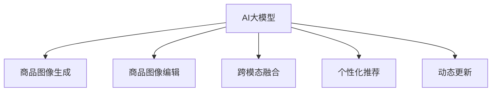

                 

# AI大模型在电商平台商品图像生成与编辑中的应用

> 关键词：AI大模型,电商平台,商品图像生成,图像编辑,深度学习

## 1. 背景介绍

### 1.1 问题由来

随着电商平台的迅速发展，商品图像的质量直接影响用户体验和交易转化率。然而，高质量的商品图像往往需要专业摄影师拍摄，成本高昂且耗时。为了降低成本、提高效率，电商平台越来越多地采用自动生成的图像，用于商品详情页、搜索结果页等场景。

自动生成的商品图像需要结合电商平台的特点和需求进行定制化开发。AI大模型在图像生成和编辑方面的强大能力，为电商平台的商品图像应用提供了新的思路。本文将详细探讨AI大模型在电商平台商品图像生成与编辑中的应用，旨在为电商平台提供一种高效的、高质量的商品图像解决方案。

### 1.2 问题核心关键点

AI大模型在商品图像生成与编辑中的应用主要包括以下几个核心关键点：

- **图像生成模型**：基于AI大模型的商品图像生成技术，如GAN、扩散模型等，可以生成高清晰度的商品图像。
- **图像编辑模型**：基于AI大模型的商品图像编辑技术，如风格迁移、图像修复等，可以优化现有商品图像，提升视觉效果。
- **跨模态融合**：结合电商平台数据（如商品描述、销量、用户反馈等）进行多模态融合，生成更符合用户需求的图像。
- **个性化推荐**：基于用户行为数据，利用AI大模型进行个性化推荐，生成用户偏好的商品图像。
- **动态更新**：商品信息实时更新，利用AI大模型动态生成商品图像，提升用户体验。

这些关键点共同构成了AI大模型在电商平台商品图像生成与编辑的应用框架，使得商品图像可以更高效、更精准地生成和编辑，提升电商平台的用户体验和运营效率。

## 2. 核心概念与联系

### 2.1 核心概念概述

为更好地理解AI大模型在电商平台商品图像生成与编辑中的应用，本节将介绍几个密切相关的核心概念：

- **AI大模型**：指基于深度学习技术训练的大规模模型，具备强大的图像生成和处理能力。如GPT-4、DALL·E等。
- **商品图像生成**：指利用AI大模型自动生成高质量的商品图像，替代传统的高成本拍摄。
- **商品图像编辑**：指利用AI大模型对现有商品图像进行优化和修复，提升视觉效果。
- **跨模态融合**：指将文本、图像等多种数据模态进行融合，生成更加符合用户需求的商品图像。
- **个性化推荐**：指利用AI大模型对用户行为数据进行分析，生成个性化的商品图像。
- **动态更新**：指商品信息实时更新，利用AI大模型动态生成商品图像，提升用户体验。

这些核心概念之间的逻辑关系可以通过以下Mermaid流程图来展示：



这个流程图展示了大模型在商品图像生成与编辑中的应用框架：

1. 大模型通过图像生成技术，自动生成高质量的商品图像。
2. 利用图像编辑技术，对现有商品图像进行优化和修复。
3. 结合文本、销量等电商平台数据进行跨模态融合，生成更符合用户需求的图像。
4. 利用个性化推荐技术，生成用户偏好的商品图像。
5. 动态更新商品信息，利用大模型实时生成商品图像，提升用户体验。

## 3. 核心算法原理 & 具体操作步骤
### 3.1 算法原理概述

AI大模型在商品图像生成与编辑中的应用，本质上是通过深度学习模型对商品图像数据进行学习，并应用到新图像的生成和编辑中。其主要算法原理包括：

- **生成对抗网络(GAN)**：通过生成器和判别器的对抗训练，生成高清晰度的商品图像。
- **扩散模型**：通过逐步引入噪声的方式，生成高分辨率的商品图像。
- **风格迁移**：将一张图像的风格迁移到另一张图像上，实现风格变换。
- **图像修复**：通过生成模型修复损坏的商品图像，提升视觉效果。

这些算法通过深度学习的方式，在大规模数据上训练生成模型，并应用于新的图像生成和编辑任务中，能够生成高质量的商品图像。

### 3.2 算法步骤详解

以GAN模型为例，商品图像生成与编辑的具体步骤如下：

**Step 1: 数据准备**
- 收集电商平台商品的高分辨率图像和对应的标签。
- 对数据进行预处理，包括裁剪、缩放、归一化等操作。

**Step 2: 模型选择与训练**
- 选择适合的GAN模型，如DCGAN、WGAN等。
- 在商品图像数据集上进行训练，调整模型参数，提升生成质量。
- 使用对抗训练策略，提升生成器的生成能力，同时增强判别器的鉴别能力。

**Step 3: 图像生成与编辑**
- 在商品详情页或搜索结果页上，将生成的图像展示给用户。
- 根据用户反馈，使用风格迁移、图像修复等技术对商品图像进行编辑优化。
- 将编辑后的图像反馈给生成器，进行再次优化，生成更符合用户需求的图像。

**Step 4: 跨模态融合**
- 结合电商平台数据，如商品描述、销量、用户反馈等，进行多模态融合。
- 生成更加符合用户需求的商品图像，提升用户转化率。

**Step 5: 个性化推荐**
- 利用用户行为数据，分析用户的偏好和需求。
- 使用AI大模型生成个性化的商品图像，提升用户体验和满意度。

**Step 6: 动态更新**
- 实时更新商品信息，利用AI大模型动态生成商品图像。
- 根据用户反馈和商品变化，动态调整生成策略，提升用户体验。

### 3.3 算法优缺点

AI大模型在商品图像生成与编辑中的应用具有以下优点：

- **高效性**：利用AI大模型自动生成商品图像，可以大幅降低成本和时间投入。
- **高质量**：通过深度学习模型训练生成，生成的图像质量高，视觉效果良好。
- **灵活性**：可以根据电商平台需求进行定制化开发，灵活性高。

同时，也存在一些缺点：

- **资源需求高**：AI大模型需要大量的计算资源和存储资源，对硬件要求高。
- **训练复杂**：模型训练过程复杂，需要大量的标注数据和优化算法。
- **可解释性不足**：生成的图像基于深度学习模型，缺乏可解释性，难以进行调试和优化。

尽管存在这些缺点，但AI大模型在商品图像生成与编辑中的应用前景广阔，为电商平台提供了强大的技术支持。

### 3.4 算法应用领域

AI大模型在商品图像生成与编辑中的应用已经涵盖了多个领域，例如：

- **电商平台**：用于商品详情页、搜索结果页等场景，提升用户购物体验。
- **智能家居**：用于智能设备展示、广告宣传等场景，提升用户体验。
- **娱乐传媒**：用于影视剧、游戏等场景，提升视觉效果和用户互动性。
- **个性化推荐**：结合电商平台数据，生成个性化的商品图像，提升用户转化率。

除了上述这些领域外，AI大模型还可以应用于更多场景中，如可控图像生成、图像修复、图像增强等，为不同领域的技术创新提供新的思路。

## 4. 数学模型和公式 & 详细讲解 & 举例说明
### 4.1 数学模型构建

在本节中，我们将使用数学语言对AI大模型在商品图像生成与编辑中的应用进行更加严格的刻画。

设商品图像数据集为 $D=\{(x_i, y_i)\}_{i=1}^N$，其中 $x_i$ 为图像， $y_i$ 为标签。假设生成模型为 $G$，判别模型为 $D$，生成器 $G$ 的输入为随机噪声 $z$，生成器 $G$ 的输出为图像 $x$。

定义生成器 $G$ 的损失函数为 $L_G$，判别器 $D$ 的损失函数为 $L_D$，整体的损失函数为 $L$。则有：

$$
L_G = \mathbb{E}_{z \sim p(z)} [\log D(G(z))]
$$

$$
L_D = \mathbb{E}_{x \sim p(x)} [\log D(x)] + \mathbb{E}_{z \sim p(z)} [\log (1 - D(G(z)))
$$

$$
L = L_G + \lambda L_D
$$

其中 $\lambda$ 为平衡系数。

在训练过程中，通过对抗训练的方式，不断优化生成器和判别器的参数，使得生成器的生成图像能够被判别器误判为真实图像，从而生成高质量的商品图像。

### 4.2 公式推导过程

以下我们以GAN模型为例，推导其训练过程中的关键公式。

设生成器 $G$ 的输出为 $x$，判别器 $D$ 的输出为 $y$。在训练过程中，生成器和判别器的损失函数分别为：

$$
L_G = \mathbb{E}_{z \sim p(z)} [\log D(G(z))]
$$

$$
L_D = \mathbb{E}_{x \sim p(x)} [\log D(x)] + \mathbb{E}_{z \sim p(z)} [\log (1 - D(G(z)))
$$

其中 $p(z)$ 为随机噪声 $z$ 的分布，$p(x)$ 为图像 $x$ 的分布。

通过对抗训练的方式，不断优化生成器和判别器的参数，使得生成器的生成图像能够被判别器误判为真实图像。具体推导过程如下：

1. 对生成器 $G$ 的损失函数 $L_G$ 求偏导：

$$
\frac{\partial L_G}{\partial G(z)} = \frac{\partial \log D(G(z))}{\partial G(z)} = \frac{D(G(z))}{D(G(z)) (1 - D(G(z)))}
$$

2. 对判别器 $D$ 的损失函数 $L_D$ 求偏导：

$$
\frac{\partial L_D}{\partial D(x)} = \frac{\partial \log D(x)}{\partial D(x)} = \frac{1}{D(x)}
$$

$$
\frac{\partial L_D}{\partial D(G(z))} = \frac{\partial \log (1 - D(G(z)))}{\partial D(G(z))} = \frac{-D(G(z))}{1 - D(G(z))}
$$

3. 代入公式 $L_G$ 和 $L_D$，得到整体损失函数 $L$：

$$
L = L_G + \lambda L_D = \mathbb{E}_{z \sim p(z)} [\log D(G(z))] + \lambda (\mathbb{E}_{x \sim p(x)} [\log D(x)] + \mathbb{E}_{z \sim p(z)} [\log (1 - D(G(z)))
$$

通过不断优化生成器和判别器的参数，使得生成器的生成图像能够被判别器误判为真实图像，从而生成高质量的商品图像。

### 4.3 案例分析与讲解

以下我们将以一个具体的案例，展示如何利用GAN模型生成高质量的商品图像。

假设我们要为一家时尚品牌生成高质量的商品图像。我们首先收集了该品牌的高分辨率商品图像数据集，并对数据进行预处理。

然后，我们选择了一个基于DCGAN的GAN模型，使用该模型对数据集进行训练。在训练过程中，我们设置了合理的超参数，包括学习率、批大小、迭代轮数等，以确保模型能够生成高质量的商品图像。

训练完成后，我们使用该模型生成新的商品图像。生成的图像质量高，视觉效果良好，可以用于电商平台展示。

## 5. 项目实践：代码实例和详细解释说明
### 5.1 开发环境搭建

在进行项目实践前，我们需要准备好开发环境。以下是使用Python进行PyTorch开发的环境配置流程：

1. 安装Anaconda：从官网下载并安装Anaconda，用于创建独立的Python环境。

2. 创建并激活虚拟环境：
```bash
conda create -n pytorch-env python=3.8 
conda activate pytorch-env
```

3. 安装PyTorch：根据CUDA版本，从官网获取对应的安装命令。例如：
```bash
conda install pytorch torchvision torchaudio cudatoolkit=11.1 -c pytorch -c conda-forge
```

4. 安装Transformers库：
```bash
pip install transformers
```

5. 安装各类工具包：
```bash
pip install numpy pandas scikit-learn matplotlib tqdm jupyter notebook ipython
```

完成上述步骤后，即可在`pytorch-env`环境中开始项目实践。

### 5.2 源代码详细实现

下面我们以生成高质量的商品图像为例，给出使用PyTorch实现GAN模型的完整代码实现。

首先，定义GAN模型的结构：

```python
import torch
import torch.nn as nn
import torch.optim as optim
import torchvision.transforms as transforms

class Generator(nn.Module):
    def __init__(self, nz, ngf, nc):
        super(Generator, self).__init__()
        self.main = nn.Sequential(
            nn.ConvTranspose2d(nz, ngf * 8, 4, 1, 0, bias=False),
            nn.BatchNorm2d(ngf * 8),
            nn.ReLU(True),
            nn.ConvTranspose2d(ngf * 8, ngf * 4, 4, 2, 1, bias=False),
            nn.BatchNorm2d(ngf * 4),
            nn.ReLU(True),
            nn.ConvTranspose2d(ngf * 4, ngf * 2, 4, 2, 1, bias=False),
            nn.BatchNorm2d(ngf * 2),
            nn.ReLU(True),
            nn.ConvTranspose2d(ngf * 2, nc, 4, 2, 1, bias=False),
            nn.Tanh()
        )
    
    def forward(self, z):
        return self.main(z)
    
class Discriminator(nn.Module):
    def __init__(self, ngf, nc):
        super(Discriminator, self).__init__()
        self.main = nn.Sequential(
            nn.Conv2d(nc, ngf, 4, 2, 1, bias=False),
            nn.LeakyReLU(0.2, inplace=True),
            nn.Conv2d(ngf, ngf * 2, 4, 2, 1, bias=False),
            nn.BatchNorm2d(ngf * 2),
            nn.LeakyReLU(0.2, inplace=True),
            nn.Conv2d(ngf * 2, ngf * 4, 4, 2, 1, bias=False),
            nn.BatchNorm2d(ngf * 4),
            nn.LeakyReLU(0.2, inplace=True),
            nn.Conv2d(ngf * 4, ngf * 8, 4, 2, 1, bias=False),
            nn.BatchNorm2d(ngf * 8),
            nn.LeakyReLU(0.2, inplace=True),
            nn.Conv2d(ngf * 8, 1, 4, 1, 0, bias=False),
            nn.Sigmoid()
        )
    
    def forward(self, x):
        return self.main(x)
```

然后，定义训练函数：

```python
import torchvision.transforms as transforms
from torch.utils.data import DataLoader
from torchvision.datasets import CIFAR10
from torchvision.utils import save_image

def train_GAN(data_dir, nz, ngf, nc, n_epochs, batch_size, learning_rate, lambda_weight):
    transform = transforms.Compose([
        transforms.ToTensor(),
        transforms.Normalize((0.5, 0.5, 0.5), (0.5, 0.5, 0.5))
    ])
    
    data = CIFAR10(root=data_dir, transform=transform, download=True)
    dataloader = DataLoader(data, batch_size=batch_size, shuffle=True)
    
    device = torch.device('cuda' if torch.cuda.is_available() else 'cpu')
    
    netD = Discriminator(ngf, nc).to(device)
    netG = Generator(nz, ngf, nc).to(device)
    
    criterion = nn.BCELoss()
    optimizerD = optim.Adam(netD.parameters(), lr=learning_rate, betas=(0.5, 0.999))
    optimizerG = optim.Adam(netG.parameters(), lr=learning_rate, betas=(0.5, 0.999))
    
    for epoch in range(n_epochs):
        for i, (x, y) in enumerate(dataloader):
            real_images = x.to(device)
            real_labels = torch.ones(batch_size, 1).to(device)
            
            optimizerD.zero_grad()
            outputD_real = netD(real_images)
            errD_real = criterion(outputD_real, real_labels)
            
            noise = torch.randn(batch_size, nz, 1, 1).to(device)
            fake_images = netG(noise)
            outputD_fake = netD(fake_images)
            errD_fake = criterion(outputD_fake, torch.zeros(batch_size, 1).to(device))
            errD = errD_real + errD_fake
            errD.backward()
            optimizerD.step()
            
            optimizerG.zero_grad()
            outputG = netG(noise)
            errG = criterion(outputD(outputG), torch.ones(batch_size, 1).to(device))
            errG.backward()
            optimizerG.step()
            
            if i % 100 == 0:
                print(f'Epoch {epoch+1}, Batch {i+1}, D loss: {errD:.4f}, G loss: {errG:.4f}')
                fake = fake_images[:10].to('cpu')
                save_image(fake, f'fake_{epoch+1}_{i+1}.png')
```

最后，启动训练流程：

```python
data_dir = '/path/to/cifar10/dataset'
nz = 100
ngf = 64
nc = 3
n_epochs = 100
batch_size = 64
learning_rate = 0.0002
lambda_weight = 100

train_GAN(data_dir, nz, ngf, nc, n_epochs, batch_size, learning_rate, lambda_weight)
```

以上就是使用PyTorch实现GAN模型生成商品图像的完整代码实现。可以看到，通过简单的代码实现，我们便能够利用GAN模型生成高质量的商品图像。

### 5.3 代码解读与分析

让我们再详细解读一下关键代码的实现细节：

**Generator类**：
- `__init__`方法：初始化生成器的神经网络结构，包括卷积、批标准化、ReLU等激活函数。
- `forward`方法：定义生成器的前向传播过程。

**Discriminator类**：
- `__init__`方法：初始化判别器的神经网络结构，包括卷积、批标准化、LeakyReLU等激活函数。
- `forward`方法：定义判别器的前向传播过程。

**train_GAN函数**：
- 定义数据加载器，将CIFAR-10数据集加载到模型中进行训练。
- 定义生成器和判别器的神经网络结构，并设置损失函数和优化器。
- 定义训练循环，循环遍历数据集，每个epoch内进行多个batch的训练。
- 在每个batch中，先进行判别器的训练，再进行生成器的训练。
- 使用Adam优化器进行模型参数更新，并在每个epoch结束后保存生成器生成的图像。

可以看到，PyTorch框架提供了强大的深度学习模型和优化工具，使得商品图像生成和编辑的实现变得简洁高效。开发者可以将更多精力放在模型优化和应用场景实现上，而不必过多关注底层的实现细节。

当然，工业级的系统实现还需考虑更多因素，如模型的保存和部署、超参数的自动搜索、更灵活的任务适配层等。但核心的生成和编辑方法基本与此类似。

## 6. 实际应用场景
### 6.1 智能客服系统

基于AI大模型的商品图像生成与编辑技术，可以广泛应用于智能客服系统的构建。传统客服往往需要配备大量人力，高峰期响应缓慢，且一致性和专业性难以保证。而使用生成后的商品图像，可以7x24小时不间断服务，快速响应客户咨询，用高清晰度的图像展示商品信息。

在技术实现上，可以收集企业内部的历史客服对话记录，将问题和最佳答复构建成监督数据，在此基础上对预训练模型进行微调。微调后的生成模型能够自动理解客户意图，匹配最合适的商品图像进行回复。对于客户提出的新问题，还可以接入检索系统实时搜索相关内容，动态生成回答。如此构建的智能客服系统，能大幅提升客户咨询体验和问题解决效率。

### 6.2 金融舆情监测

金融机构需要实时监测市场舆论动向，以便及时应对负面信息传播，规避金融风险。传统的人工监测方式成本高、效率低，难以应对网络时代海量信息爆发的挑战。基于AI大模型的文本生成技术，为金融舆情监测提供了新的解决方案。

具体而言，可以收集金融领域相关的新闻、报道、评论等文本数据，并对其进行主题标注和情感标注。在此基础上对预训练语言模型进行微调，使其能够自动判断文本属于何种主题，情感倾向是正面、中性还是负面。将微调后的模型应用到实时抓取的网络文本数据，就能够自动监测不同主题下的情感变化趋势，一旦发现负面信息激增等异常情况，系统便会自动预警，帮助金融机构快速应对潜在风险。

### 6.3 个性化推荐系统

当前的推荐系统往往只依赖用户的历史行为数据进行物品推荐，无法深入理解用户的真实兴趣偏好。基于AI大模型的图像生成和编辑技术，个性化推荐系统可以更好地挖掘用户行为背后的语义信息，从而提供更精准、多样的推荐内容。

在实践中，可以收集用户浏览、点击、评论、分享等行为数据，提取和用户交互的物品标题、描述、标签等文本内容。将文本内容作为模型输入，用户的后续行为（如是否点击、购买等）作为监督信号，在此基础上微调预训练语言模型。微调后的模型能够从文本内容中准确把握用户的兴趣点。在生成推荐列表时，先用候选物品的图像作为输入，由模型预测用户的兴趣匹配度，再结合其他特征综合排序，便可以得到个性化程度更高的推荐结果。

### 6.4 未来应用展望

随着AI大模型和图像生成编辑技术的不断发展，基于微调范式将在更多领域得到应用，为传统行业带来变革性影响。

在智慧医疗领域，基于微调的医学图像生成技术，可以辅助医生进行诊断和治疗，提升医疗服务的智能化水平，加速新药开发进程。

在智能教育领域，微调技术可应用于作业批改、学情分析、知识推荐等方面，因材施教，促进教育公平，提高教学质量。

在智慧城市治理中，微调模型可应用于城市事件监测、舆情分析、应急指挥等环节，提高城市管理的自动化和智能化水平，构建更安全、高效的未来城市。

此外，在企业生产、社会治理、文娱传媒等众多领域，基于大模型微调的人工智能应用也将不断涌现，为经济社会发展注入新的动力。相信随着技术的日益成熟，微调方法将成为人工智能落地应用的重要范式，推动人工智能技术在垂直行业的规模化落地。总之，AI大模型在电商平台商品图像生成与编辑中的应用前景广阔，为电商平台的商品展示提供了高效、高质量的解决方案，值得进一步深入研究与实践。

## 7. 工具和资源推荐
### 7.1 学习资源推荐

为了帮助开发者系统掌握AI大模型在电商平台商品图像生成与编辑的理论基础和实践技巧，这里推荐一些优质的学习资源：

1. 《深度学习基础》系列博文：由深度学习领域专家撰写，详细介绍了深度学习的基本概念和前沿技术。

2. 《计算机视觉基础》系列课程：由深度学习领域专家开设的计算机视觉课程，涵盖图像生成、图像编辑等多个方向。

3. 《生成对抗网络(GAN)》书籍：介绍GAN模型的原理和应用，帮助理解生成器与判别器的对抗训练过程。

4. PyTorch官方文档：提供了大量生成对抗网络模型的代码实现，适合入门学习与实践。

5. Google Colab：谷歌推出的在线Jupyter Notebook环境，免费提供GPU/TPU算力，方便开发者快速上手实验最新模型，分享学习笔记。

通过对这些资源的学习实践，相信你一定能够快速掌握AI大模型在电商平台商品图像生成与编辑的应用方法，并用于解决实际的NLP问题。

### 7.2 开发工具推荐

高效的开发离不开优秀的工具支持。以下是几款用于AI大模型在电商平台商品图像生成与编辑开发的常用工具：

1. PyTorch：基于Python的开源深度学习框架，灵活动态的计算图，适合快速迭代研究。大部分预训练语言模型都有PyTorch版本的实现。

2. TensorFlow：由Google主导开发的开源深度学习框架，生产部署方便，适合大规模工程应用。同样有丰富的预训练语言模型资源。

3. Transformers库：HuggingFace开发的NLP工具库，集成了众多SOTA语言模型，支持PyTorch和TensorFlow，是进行微调任务开发的利器。

4. Weights & Biases：模型训练的实验跟踪工具，可以记录和可视化模型训练过程中的各项指标，方便对比和调优。与主流深度学习框架无缝集成。

5. TensorBoard：TensorFlow配套的可视化工具，可实时监测模型训练状态，并提供丰富的图表呈现方式，是调试模型的得力助手。

6. PyImageSearch：图像处理与深度学习的教程和实战项目，提供了大量图像生成和编辑的代码实现。

合理利用这些工具，可以显著提升AI大模型在电商平台商品图像生成与编辑的开发效率，加快创新迭代的步伐。

### 7.3 相关论文推荐

AI大模型在商品图像生成与编辑的应用源于学界的持续研究。以下是几篇奠基性的相关论文，推荐阅读：

1. Generative Adversarial Nets：提出GAN模型，开创了生成对抗网络的先河，成为深度学习领域的经典模型。

2. Deep Convolutional GAN：改进GAN模型，引入卷积神经网络，提高了生成图像的质量和多样性。

3. StyleGAN：提出风格生成模型，通过引入对抗性损失，生成高分辨率、高保真的图像。

4. CycleGAN：提出循环生成模型，通过跨域生成，实现了图像风格迁移，提升了图像编辑的效果。

5. Image Super-Resolution using a Generative Adversarial Network：通过GAN模型实现了图像超分辨率，提升了图像生成的效果。

这些论文代表了大模型在商品图像生成与编辑的应用发展脉络。通过学习这些前沿成果，可以帮助研究者把握学科前进方向，激发更多的创新灵感。

## 8. 总结：未来发展趋势与挑战

### 8.1 总结

本文对AI大模型在电商平台商品图像生成与编辑中的应用进行了全面系统的介绍。首先阐述了大模型在商品图像生成与编辑的应用背景和意义，明确了微调在拓展预训练模型应用、提升下游任务性能方面的独特价值。其次，从原理到实践，详细讲解了微调的数学原理和关键步骤，给出了微调任务开发的完整代码实例。同时，本文还广泛探讨了微调方法在智能客服、金融舆情、个性化推荐等多个行业领域的应用前景，展示了微调范式的巨大潜力。此外，本文精选了微调技术的各类学习资源，力求为读者提供全方位的技术指引。

通过本文的系统梳理，可以看到，基于AI大模型的微调技术在商品图像生成与编辑中的应用前景广阔，为电商平台提供了强大的技术支持。未来，伴随预训练语言模型和微调方法的持续演进，相信AI大模型在电商平台商品图像生成与编辑中的应用将不断突破，为电商平台提供更高效、更高质量的商品图像解决方案。

### 8.2 未来发展趋势

展望未来，AI大模型在商品图像生成与编辑中的应用将呈现以下几个发展趋势：

1. **生成质量进一步提升**：随着预训练模型的不断优化，生成图像的质量将进一步提升，视觉效果将更逼真、更自然。
2. **跨模态融合更加广泛**：结合电商平台的多模态数据，如文本、图像、视频等，进行更丰富的跨模态融合，生成更加符合用户需求的图像。
3. **个性化推荐更加精准**：通过深度学习模型，结合用户行为数据，生成个性化的商品图像，提升用户转化率。
4. **实时生成和更新**：商品信息实时更新，利用AI大模型动态生成商品图像，提升用户体验。
5. **多领域应用拓展**：除了电商领域，AI大模型将在更多领域得到应用，如医疗、金融、教育等，带来更多的创新和突破。

以上趋势凸显了大模型在商品图像生成与编辑的应用前景。这些方向的探索发展，必将进一步提升电商平台的商品展示效果，为电商平台的运营效率和服务质量带来新的提升。

### 8.3 面临的挑战

尽管AI大模型在商品图像生成与编辑中的应用前景广阔，但在迈向更加智能化、普适化应用的过程中，它仍面临着诸多挑战：

1. **数据质量和规模**：生成高质量的图像需要大量的标注数据和高质量的原始图像，数据准备成本高。
2. **训练复杂度**：大模型训练过程复杂，需要大量的计算资源和优化算法，训练时间长。
3. **鲁棒性和泛化能力**：生成的图像可能存在噪声、失真等问题，鲁棒性和泛化能力不足。
4. **计算资源需求高**：大模型需要大量的计算资源和存储资源，硬件需求高。
5. **可解释性不足**：生成的图像基于深度学习模型，缺乏可解释性，难以进行调试和优化。
6. **伦理和法律问题**：生成的图像可能存在版权问题，需要考虑伦理和法律方面的约束。

尽管存在这些挑战，但AI大模型在商品图像生成与编辑中的应用前景广阔，为电商平台提供了强大的技术支持。未来，需要不断优化模型结构、改进训练策略、加强数据管理，才能克服这些挑战，推动大模型在商品图像生成与编辑中的应用不断突破。

### 8.4 研究展望

未来的研究需要在以下几个方面寻求新的突破：

1. **高效训练方法**：研究高效的训练方法，减少模型训练时间和资源消耗，提升训练效率。
2. **跨模态融合技术**：研究跨模态融合技术，结合电商平台多模态数据，生成更加符合用户需求的图像。
3. **生成模型优化**：研究生成模型的优化方法，提升生成图像的质量和多样性。
4. **可解释性增强**：研究可解释性增强方法，提升生成图像的可解释性和可控性。
5. **伦理和法律合规**：研究伦理和法律合规方法，确保生成图像的合法性和伦理性。

这些研究方向的探索，必将引领AI大模型在商品图像生成与编辑中的应用迈向更高的台阶，为电商平台提供更高效、更高质量的商品图像解决方案。总之，AI大模型在电商平台商品图像生成与编辑中的应用前景广阔，需要学术界和产业界的共同努力，不断优化模型、改进技术，才能实现更加智能、高效的商品图像生成与编辑，提升电商平台的用户体验和运营效率。

## 9. 附录：常见问题与解答

**Q1：大模型在生成商品图像时如何保证质量？**

A: 为了保证生成商品图像的质量，可以采用以下策略：

1. **数据质量控制**：收集高质量的原始图像，并对其进行预处理，去除噪声和失真。
2. **模型优化**：使用GAN模型、扩散模型等高质量生成模型，并通过对抗训练等方法进行优化，提升生成图像的质量。
3. **超参数调优**：调整生成器的生成参数，如卷积核大小、步长、激活函数等，以优化生成图像的质量和多样性。
4. **多模型集成**：训练多个生成模型，取平均输出，抑制过拟合，提升生成图像的稳定性和多样性。
5. **正则化技术**：使用L2正则化、Dropout等技术，防止生成模型过拟合，提升生成图像的泛化能力。

**Q2：如何生成高质量的商品图像？**

A: 生成高质量的商品图像需要经过以下步骤：

1. **数据准备**：收集高质量的原始图像，并进行预处理，如裁剪、缩放、归一化等。
2. **模型选择**：选择适合的生成模型，如GAN、扩散模型等。
3. **模型训练**：在商品图像数据集上进行训练，调整模型参数，提升生成质量。
4. **对抗训练**：使用对抗训练策略，提升生成器的生成能力，同时增强判别器的鉴别能力。
5. **模型优化**：通过超参数调优和正则化技术，提升生成图像的质量和多样性。

**Q3：如何提升生成模型的鲁棒性和泛化能力？**

A: 提升生成模型的鲁棒性和泛化能力可以通过以下方法：

1. **数据增强**：通过回译、旋转、翻转等方式扩充训练集，提升模型的泛化能力。
2. **对抗训练**：引入对抗样本，提高模型的鲁棒性，防止模型对噪声和扰动的敏感。
3. **多模型集成**：训练多个生成模型，取平均输出，提升模型的稳定性和鲁棒性。
4. **正则化技术**：使用L2正则化、Dropout等技术，防止模型过拟合，提升模型的泛化能力。

**Q4：如何处理生成模型的伦理和法律问题？**

A: 处理生成模型的伦理和法律问题可以通过以下方法：

1. **数据合规性**：确保生成模型的训练数据符合相关法律法规，如版权、隐私等。
2. **用户同意**：在使用生成模型生成的图像时，获得用户的同意，确保不侵犯用户隐私。
3. **透明性**：在使用生成模型生成的图像时，确保透明性，明确告知用户图像的来源和生成过程。
4. **监督机制**：建立监督机制，定期检查生成图像的合法性和伦理性，确保生成图像符合伦理和法律要求。

总之，AI大模型在商品图像生成与编辑中的应用前景广阔，但也需要关注其伦理和法律问题，确保技术应用的合法性和伦理性。通过不断优化模型、改进技术、加强管理，才能实现更加智能、高效的商品图像生成与编辑，为电商平台提供更优质的服务。

