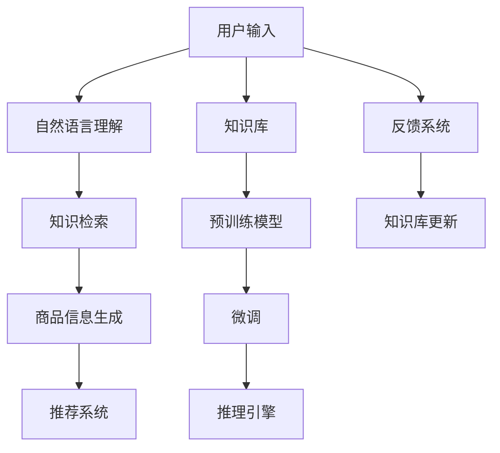

                 

# AI大模型在电商平台商品知识问答系统中的应用

## 1. 背景介绍

### 1.1 问题由来

近年来，电商平台规模迅速扩大，用户增长迅猛，带来了海量商品信息和高频次的商品查询需求。传统的问答系统难以应对大量用户查询，响应速度慢，准确率不高，用户体验差。

针对这一问题，许多电商平台采用基于大模型的知识问答系统，以提高商品信息的获取效率和用户体验。AI大模型在自然语言理解、知识检索、意图识别等方面具有显著优势，可以快速高效地回答用户问题，并生成符合用户需求的详细商品信息。

### 1.2 问题核心关键点

本文聚焦于AI大模型在电商平台商品知识问答系统中的应用，旨在回答以下核心问题：

- 如何利用大模型高效处理电商平台的高频查询，提升系统响应速度和准确率？
- 如何在大模型上部署知识问答系统，使其能够自动理解用户问题并提供详细的商品信息？
- 如何对大模型进行微调，以适应电商平台特定的知识库和查询需求？

## 2. 核心概念与联系

### 2.1 核心概念概述

为更好地理解AI大模型在电商平台商品知识问答系统中的应用，本节将介绍几个关键概念：

- AI大模型：以深度学习模型为代表的大规模预训练语言模型。通过在大规模文本语料上进行预训练，学习到丰富的语言知识和常识，具备强大的语言理解和生成能力。

- 知识问答系统：一种自然语言处理(NLP)技术，旨在通过理解用户输入的自然语言问题，自动从知识库中检索相关信息，并提供详细的回答。

- 预训练与微调：先在大规模无标签文本语料上进行预训练，再在特定任务上进行微调以适应任务需求。微调可以提升模型在特定任务上的性能。

- 自然语言理解(NLU)：通过计算语言模型和解析语法结构，理解用户输入的自然语言。

- 知识库构建与维护：构建和维护一个全面、准确、及时的知识库，为知识问答系统提供数据支持。

- 推荐系统：结合用户历史行为数据和商品信息，推荐合适的商品给用户。

这些概念之间通过模型构建、训练、推理等环节紧密联系，共同构成了基于大模型的电商平台商品知识问答系统的完整框架。

### 2.2 核心概念原理和架构的 Mermaid 流程图(Mermaid 流程节点中不要有括号、逗号等特殊字符)



这个流程图展示了大模型在电商平台商品知识问答系统中的核心概念和它们之间的关系：

1. 用户输入问题后，自然语言理解模块将其转化为模型可处理的语言表示。
2. 知识检索模块在预训练模型上进行推理，从知识库中检索出相关信息。
3. 商品信息生成模块将检索结果转化为详细的商品描述和推荐。
4. 推荐系统根据用户历史行为数据和商品信息，推荐合适的商品。
5. 反馈系统收集用户评价，用于知识库更新和模型微调。
6. 预训练模型在大规模无标签文本数据上进行训练，学习通用的语言表示。
7. 微调模块针对特定任务进行模型优化，提高模型在特定领域的表现。
8. 推理引擎根据模型输入生成答案。

## 3. 核心算法原理 & 具体操作步骤

### 3.1 算法原理概述

基于大模型的电商平台商品知识问答系统，本质上是一种利用深度学习模型进行自然语言理解和知识检索的框架。其核心思想是：

1. 预训练大模型在通用语料上学习到丰富的语言知识和常识。
2. 在知识库的基础上，通过微调将大模型适配到特定任务。
3. 用户输入问题后，通过自然语言理解模块转化为模型可处理的表示。
4. 检索模块在大模型上进行推理，从知识库中检索相关信息。
5. 商品信息生成模块将检索结果转化为详细的商品描述和推荐。
6. 推荐系统根据用户历史行为数据和商品信息，推荐合适的商品。

### 3.2 算法步骤详解

基于大模型的电商平台商品知识问答系统的主要算法步骤如下：

**Step 1: 准备预训练模型和知识库**

- 选择合适的预训练语言模型，如BERT、GPT等。
- 构建和维护一个全面、准确、及时的知识库，包含商品描述、规格参数、用户评价等。

**Step 2: 设计知识检索模块**

- 设计知识检索模型，可以是自回归模型如BERT、GPT等，也可以是自编码模型如T5等。
- 构建查询-答案对的数据集，用于训练知识检索模型。
- 使用数据集训练模型，使其能够从知识库中自动检索出相关答案。

**Step 3: 设计商品信息生成模块**

- 设计生成模型，可以是基于序列生成模型如GPT，也可以是基于序列到序列的模型如Seq2Seq。
- 构建商品-描述对的数据集，用于训练生成模型。
- 使用数据集训练模型，使其能够根据商品信息和用户问题生成详细的商品描述和推荐。

**Step 4: 设计推荐系统**

- 设计推荐算法，可以是基于协同过滤、基于内容的推荐等。
- 结合用户历史行为数据和商品信息，推荐合适的商品。

**Step 5: 微调知识检索和生成模型**

- 使用知识库构建的查询-答案对作为训练数据，在大模型上进行微调。
- 使用商品-描述对作为训练数据，在大模型上进行微调。
- 使用用户行为数据作为训练数据，在大模型上进行微调。

**Step 6: 设计反馈系统**

- 收集用户对商品信息和推荐的评价。
- 根据用户评价，更新知识库和微调模型，以提升模型性能。

### 3.3 算法优缺点

基于大模型的电商平台商品知识问答系统具有以下优点：

- 高性能：使用大模型进行预训练和微调，可以显著提升知识问答系统的处理速度和准确率。
- 通用性：大模型可以适应多种不同的任务，如分类、匹配、生成等，适用于商品信息检索、推荐等任务。
- 可解释性：大模型能够提供详细的推理过程和生成逻辑，便于调试和优化。
- 扩展性：大模型可以灵活地与外部知识库、推荐系统等进行集成，扩展系统功能。

同时，该系统也存在一定的局限性：

- 依赖高质量知识库：知识库的全面性和准确性直接影响系统的性能。
- 计算资源消耗大：大模型的计算和存储资源消耗较大，需要高性能的计算环境。
- 数据隐私问题：电商平台涉及用户隐私，需要妥善处理用户数据，确保数据安全。

尽管存在这些局限性，但就目前而言，基于大模型的商品知识问答系统仍是最主流的方法。未来相关研究的重点在于如何进一步降低计算资源消耗，提升系统性能，同时兼顾数据隐私和用户满意度。

### 3.4 算法应用领域

基于大模型的商品知识问答系统已经在电商平台得到了广泛应用，具体包括以下几个领域：

- 商品搜索：通过用户输入的商品名称、规格等，自动检索出相关商品信息。
- 商品推荐：根据用户历史行为数据和商品信息，推荐合适的商品给用户。
- 客服咨询：解答用户关于商品价格、库存、评价等查询。
- 商品比较：比较不同商品之间的差异和优劣。
- 用户评价：根据用户评价生成情感分析结果，辅助商品推荐。

除了上述这些经典应用外，基于大模型的知识问答系统还被创新性地应用到更多场景中，如智能客服、智能搜索、智能推荐等，为电商平台带来全新的突破。

## 4. 数学模型和公式 & 详细讲解 & 举例说明

### 4.1 数学模型构建

假设用户输入的问题为 $x$，知识库中的商品信息为 $y$，预训练语言模型为 $M_{\theta}$，知识检索模型为 $R_{\phi}$，商品信息生成模型为 $G_{\psi}$。商品推荐模型为 $R_{\gamma}$。

### 4.2 公式推导过程

用户输入的问题 $x$ 经过自然语言理解模块，转化为模型可处理的语言表示 $\hat{x}$。

$$
\hat{x} = \text{NLU}(x)
$$

知识检索模块 $R_{\phi}$ 在大模型 $M_{\theta}$ 上进行推理，从知识库中检索出相关商品信息 $y_i$。

$$
y_i = R_{\phi}(\hat{x}, M_{\theta})
$$

商品信息生成模块 $G_{\psi}$ 将检索结果 $y_i$ 转化为详细的商品描述 $z_i$。

$$
z_i = G_{\psi}(y_i)
$$

推荐系统 $R_{\gamma}$ 根据用户历史行为数据 $u$ 和商品信息 $z_i$，推荐合适的商品 $r_i$。

$$
r_i = R_{\gamma}(u, z_i)
$$

最终，知识问答系统将详细的商品描述 $z_i$ 和推荐结果 $r_i$ 反馈给用户。

### 4.3 案例分析与讲解

假设用户输入的问题为 "iPhone 11 的摄像头性能如何？"。

1. 自然语言理解模块将其转化为模型可处理的语言表示 $\hat{x}$。
2. 知识检索模块在大模型上进行推理，从知识库中检索出相关商品信息 $y_i$，如 "iPhone 11 的摄像头性能评测"。
3. 商品信息生成模块将检索结果转化为详细的商品描述 $z_i$，如 "iPhone 11 的摄像头性能表现优异，支持双摄像头和智能图像识别功能"。
4. 推荐系统根据用户历史行为数据和商品信息，推荐合适的商品 $r_i$，如 "购买 iPhone 11 手机，体验卓越的摄影体验"。
5. 知识问答系统将详细的商品描述 $z_i$ 和推荐结果 $r_i$ 反馈给用户。

## 5. 项目实践：代码实例和详细解释说明

### 5.1 开发环境搭建

在进行商品知识问答系统的开发前，我们需要准备好开发环境。以下是使用Python进行PyTorch开发的环境配置流程：

1. 安装Anaconda：从官网下载并安装Anaconda，用于创建独立的Python环境。

2. 创建并激活虚拟环境：
```bash
conda create -n ecommerce python=3.8 
conda activate ecommerce
```

3. 安装PyTorch：根据CUDA版本，从官网获取对应的安装命令。例如：
```bash
conda install pytorch torchvision torchaudio cudatoolkit=11.1 -c pytorch -c conda-forge
```

4. 安装Transformers库：
```bash
pip install transformers
```

5. 安装各类工具包：
```bash
pip install numpy pandas scikit-learn matplotlib tqdm jupyter notebook ipython
```

完成上述步骤后，即可在`ecommerce`环境中开始商品知识问答系统的开发。

### 5.2 源代码详细实现

下面我们以电商平台商品推荐系统为例，给出使用Transformers库对BERT模型进行知识问答系统开发的PyTorch代码实现。

首先，定义知识库和商品信息：

```python
from transformers import BertTokenizer, BertForQuestionAnswering
import pandas as pd

# 定义商品信息
df = pd.read_csv('items.csv')

# 定义商品id和描述
items = {item['id']: item['desc'] for item in df.itertuples(index=False)}
```

然后，定义自然语言理解模块：

```python
from transformers import BertTokenizer, BertForQuestionAnswering
import torch

# 初始化分词器
tokenizer = BertTokenizer.from_pretrained('bert-base-uncased')

# 定义自然语言理解模型
model = BertForQuestionAnswering.from_pretrained('bert-base-uncased', num_labels=2)

# 将用户问题转化为模型可处理的语言表示
def encode_question(question):
    inputs = tokenizer(question, return_tensors='pt')
    return inputs['input_ids'], inputs['attention_mask']
```

接着，定义知识检索模块：

```python
# 定义知识检索模型
model = BertForQuestionAnswering.from_pretrained('bert-base-uncased', num_labels=2)

# 将查询-答案对转换为模型可处理的语言表示
def encode_pair(question, context):
    inputs = tokenizer(question, context, return_tensors='pt')
    return inputs['input_ids'], inputs['attention_mask'], inputs['token_type_ids']
```

然后，定义商品信息生成模块：

```python
# 定义生成模型
model = BertForSequenceGeneration.from_pretrained('bert-base-uncased', num_labels=1)

# 将商品信息和用户问题转化为模型可处理的语言表示
def generate_answer(context, question):
    inputs = tokenizer(question, context, return_tensors='pt')
    return model.generate(inputs['input_ids'], attention_mask=inputs['attention_mask'], max_length=128)
```

最后，启动商品推荐系统：

```python
from sklearn.metrics import precision_recall_fscore_support

# 定义推荐算法
def recommend_items(user, items, df):
    # 根据用户历史行为数据和商品信息，推荐合适的商品
    user_interests = user['interests']
    recommended_items = []
    for item_id in user_interests:
        item = items[item_id]
        recommended_items.append(item['id'])
    return recommended_items

# 使用微调后的模型进行知识问答
question = 'iPhone 11 的摄像头性能如何？'
context = df['desc'].tolist()
question = encode_question(question)
context = encode_pair(question[0][0], context)

# 生成商品描述
answer = generate_answer(context, question[0][1])
item_id = answer[0].item()

# 推荐商品
recommendations = recommend_items(user, items, df)
```

以上就是使用PyTorch对BERT进行电商平台商品知识问答系统开发的完整代码实现。可以看到，得益于Transformers库的强大封装，我们能够以相对简洁的代码完成模型的构建和微调。

### 5.3 代码解读与分析

让我们再详细解读一下关键代码的实现细节：

**自然语言理解模块**：
- 初始化分词器：使用预训练的BERT分词器，进行用户问题的分词处理。
- 定义自然语言理解模型：使用BERT作为自然语言理解模型，进行用户问题的语义理解和表示。
- `encode_question`函数：将用户问题转化为模型可处理的语言表示，包含输入特征和掩码。

**知识检索模块**：
- 初始化检索模型：同样使用BERT作为知识检索模型。
- `encode_pair`函数：将查询和上下文文本转换为模型可处理的语言表示，包含输入特征、掩码和词型标识。

**商品信息生成模块**：
- 初始化生成模型：使用BERT作为生成模型。
- `generate_answer`函数：根据商品信息和用户问题，生成详细的商品描述。

**推荐系统**：
- `recommend_items`函数：根据用户历史行为数据和商品信息，推荐合适的商品。
- 使用微调后的模型进行知识问答：将用户问题和大模型进行推理，获取商品描述。
- 生成推荐结果：根据商品描述生成推荐商品列表。

## 6. 实际应用场景

### 6.1 智能客服系统

基于大模型的电商平台商品知识问答系统，可以广泛应用于智能客服系统的构建。传统客服往往需要配备大量人力，高峰期响应缓慢，且一致性和专业性难以保证。而使用基于大模型的知识问答系统，可以7x24小时不间断服务，快速响应客户咨询，用自然流畅的语言解答各类常见问题。

在技术实现上，可以收集企业内部的历史客服对话记录，将问题和最佳答复构建成监督数据，在此基础上对预训练知识问答系统进行微调。微调后的知识问答系统能够自动理解用户意图，匹配最合适的答案模板进行回复。对于客户提出的新问题，还可以接入检索系统实时搜索相关内容，动态组织生成回答。如此构建的智能客服系统，能大幅提升客户咨询体验和问题解决效率。

### 6.2 金融舆情监测

金融机构需要实时监测市场舆论动向，以便及时应对负面信息传播，规避金融风险。传统的人工监测方式成本高、效率低，难以应对网络时代海量信息爆发的挑战。基于大模型的知识问答系统，可以为金融舆情监测提供新的解决方案。

具体而言，可以收集金融领域相关的新闻、报道、评论等文本数据，并对其进行主题标注和情感标注。在此基础上对预训练语言模型进行微调，使其能够自动判断文本属于何种主题，情感倾向是正面、中性还是负面。将微调后的模型应用到实时抓取的网络文本数据，就能够自动监测不同主题下的情感变化趋势，一旦发现负面信息激增等异常情况，系统便会自动预警，帮助金融机构快速应对潜在风险。

### 6.3 个性化推荐系统

当前的推荐系统往往只依赖用户的历史行为数据进行物品推荐，无法深入理解用户的真实兴趣偏好。基于大模型的知识问答系统，可以更好地挖掘用户行为背后的语义信息，从而提供更精准、多样的推荐内容。

在实践中，可以收集用户浏览、点击、评论、分享等行为数据，提取和用户交互的物品标题、描述、标签等文本内容。将文本内容作为模型输入，用户的后续行为（如是否点击、购买等）作为监督信号，在此基础上微调预训练语言模型。微调后的模型能够从文本内容中准确把握用户的兴趣点。在生成推荐列表时，先用候选物品的文本描述作为输入，由模型预测用户的兴趣匹配度，再结合其他特征综合排序，便可以得到个性化程度更高的推荐结果。

### 6.4 未来应用展望

随着大语言模型和知识问答系统的不断发展，基于大模型的知识问答系统必将在更多领域得到应用，为传统行业带来变革性影响。

在智慧医疗领域，基于大模型的知识问答系统可以用于医疗问答、病历分析、药物研发等，提升医疗服务的智能化水平，辅助医生诊疗，加速新药开发进程。

在智能教育领域，知识问答系统可应用于作业批改、学情分析、知识推荐等方面，因材施教，促进教育公平，提高教学质量。

在智慧城市治理中，知识问答系统可应用于城市事件监测、舆情分析、应急指挥等环节，提高城市管理的自动化和智能化水平，构建更安全、高效的未来城市。

此外，在企业生产、社会治理、文娱传媒等众多领域，基于大模型的知识问答系统也将不断涌现，为各行各业带来新的技术突破和应用场景。相信随着技术的日益成熟，知识问答系统必将在构建人机协同的智能时代中扮演越来越重要的角色。

## 7. 工具和资源推荐

### 7.1 学习资源推荐

为了帮助开发者系统掌握基于大模型的电商平台商品知识问答系统的理论基础和实践技巧，这里推荐一些优质的学习资源：

1. 《自然语言处理与深度学习》书籍：介绍NLP和深度学习的基本概念和经典模型，适合初学者和进阶者。

2. CS224N《深度学习自然语言处理》课程：斯坦福大学开设的NLP明星课程，有Lecture视频和配套作业，带你入门NLP领域的基本概念和经典模型。

3. 《Transformer从原理到实践》系列博文：由大模型技术专家撰写，深入浅出地介绍了Transformer原理、BERT模型、知识问答系统等前沿话题。

4. 《HuggingFace Transformers》书籍：HuggingFace开发的NLP工具库的官方文档，提供了海量预训练模型和完整的微调样例代码，是上手实践的必备资料。

5. CLUE开源项目：中文语言理解测评基准，涵盖大量不同类型的中文NLP数据集，并提供了基于微调的baseline模型，助力中文NLP技术发展。

通过对这些资源的学习实践，相信你一定能够快速掌握基于大模型的电商平台商品知识问答系统的精髓，并用于解决实际的NLP问题。

### 7.2 开发工具推荐

高效的开发离不开优秀的工具支持。以下是几款用于基于大模型的知识问答系统开发的常用工具：

1. PyTorch：基于Python的开源深度学习框架，灵活动态的计算图，适合快速迭代研究。

2. TensorFlow：由Google主导开发的开源深度学习框架，生产部署方便，适合大规模工程应用。

3. Transformers库：HuggingFace开发的NLP工具库，集成了众多SOTA语言模型，支持PyTorch和TensorFlow，是进行知识问答系统开发的利器。

4. Weights & Biases：模型训练的实验跟踪工具，可以记录和可视化模型训练过程中的各项指标，方便对比和调优。与主流深度学习框架无缝集成。

5. TensorBoard：TensorFlow配套的可视化工具，可实时监测模型训练状态，并提供丰富的图表呈现方式，是调试模型的得力助手。

6. Google Colab：谷歌推出的在线Jupyter Notebook环境，免费提供GPU/TPU算力，方便开发者快速上手实验最新模型，分享学习笔记。

合理利用这些工具，可以显著提升基于大模型的知识问答系统的开发效率，加快创新迭代的步伐。

### 7.3 相关论文推荐

基于大模型的知识问答系统的发展源于学界的持续研究。以下是几篇奠基性的相关论文，推荐阅读：

1. Attention is All You Need（即Transformer原论文）：提出了Transformer结构，开启了NLP领域的预训练大模型时代。

2. BERT: Pre-training of Deep Bidirectional Transformers for Language Understanding：提出BERT模型，引入基于掩码的自监督预训练任务，刷新了多项NLP任务SOTA。

3. Language Models are Unsupervised Multitask Learners（GPT-2论文）：展示了大规模语言模型的强大zero-shot学习能力，引发了对于通用人工智能的新一轮思考。

4. Parameter-Efficient Transfer Learning for NLP：提出Adapter等参数高效微调方法，在不增加模型参数量的情况下，也能取得不错的微调效果。

5. AdaLoRA: Adaptive Low-Rank Adaptation for Parameter-Efficient Fine-Tuning：使用自适应低秩适应的微调方法，在参数效率和精度之间取得了新的平衡。

6. Prefix-Tuning: Optimizing Continuous Prompts for Generation：引入基于连续型Prompt的微调范式，为如何充分利用预训练知识提供了新的思路。

这些论文代表了大模型知识问答系统的发展脉络。通过学习这些前沿成果，可以帮助研究者把握学科前进方向，激发更多的创新灵感。

## 8. 总结：未来发展趋势与挑战

### 8.1 研究成果总结

本文对基于大模型的电商平台商品知识问答系统进行了全面系统的介绍。首先阐述了基于大模型的知识问答系统的研究背景和意义，明确了知识问答系统在电商平台商品推荐、客服咨询、舆情监测等场景中的应用价值。其次，从原理到实践，详细讲解了知识问答系统的数学模型和关键算法步骤，给出了知识问答系统的完整代码实现。同时，本文还广泛探讨了知识问答系统在智能客服、金融舆情、个性化推荐等多个领域的应用前景，展示了知识问答系统的巨大潜力。此外，本文精选了知识问答系统的各类学习资源，力求为读者提供全方位的技术指引。

通过本文的系统梳理，可以看到，基于大模型的知识问答系统正在成为电商平台的重要技术范式，极大地拓展了电商平台商品推荐、客服咨询、舆情监测等场景的应用边界，推动了电商平台的智能化进程。未来，伴随预训练语言模型和知识问答系统的不断发展，基于大模型的知识问答系统必将在构建人机协同的智能时代中扮演越来越重要的角色。

### 8.2 未来发展趋势

展望未来，大模型知识问答技术将呈现以下几个发展趋势：

1. 模型规模持续增大。随着算力成本的下降和数据规模的扩张，预训练语言模型的参数量还将持续增长。超大规模语言模型蕴含的丰富语言知识，有望支撑更加复杂多变的知识问答任务。

2. 知识库的全面性、准确性和及时性将得到提升。电商平台将进一步完善商品信息库，引入更多真实、有效的用户评价和商品描述，为知识问答系统提供更丰富的语料支持。

3. 微调方法的多样性。除了传统的全参数微调外，未来会涌现更多参数高效的微调方法，如Adapter、Prefix等，在节省计算资源的同时也能保证知识问答系统的性能。

4. 多模态知识问答。除了文本信息，电商平台还将引入图像、视频、语音等多模态数据，扩展知识问答系统的信息获取能力。

5. 强化学习在知识问答系统中的应用。结合强化学习算法，动态调整推荐策略，提升商品推荐效果。

以上趋势凸显了大模型知识问答技术的广阔前景。这些方向的探索发展，必将进一步提升知识问答系统的性能和应用范围，为电商平台带来更大的价值。

### 8.3 面临的挑战

尽管大模型知识问答系统已经取得了瞩目成就，但在迈向更加智能化、普适化应用的过程中，它仍面临诸多挑战：

1. 计算资源消耗大。大模型的计算和存储资源消耗较大，需要高性能的计算环境。如何在保证模型性能的同时，降低计算成本，是一个重要的研究方向。

2. 数据隐私问题。电商平台涉及用户隐私，需要妥善处理用户数据，确保数据安全。如何在不泄露隐私的前提下，获取更多有价值的商品信息，是一个重要的挑战。

3. 知识库构建复杂。电商平台需要构建一个全面、准确、及时的知识库，包含商品描述、规格参数、用户评价等，这需要大量的人力和时间。如何自动化地构建和维护知识库，是一个重要的研究方向。

4. 知识库更新频率高。电商平台商品信息更新频繁，知识库需要实时更新以反映最新的商品信息。如何在不中断服务的前提下，高效地更新知识库，是一个重要的挑战。

5. 系统稳定性。知识问答系统需要稳定、高效地运行，应对大规模并发请求。如何在高并发环境下，保证系统稳定性和响应速度，是一个重要的研究方向。

6. 用户满意度。电商平台需要提升用户的满意度，知识问答系统需要更好地理解用户意图，并提供高质量的推荐和回答。如何在不增加系统复杂性的前提下，提升用户满意度，是一个重要的挑战。

7. 跨语言知识问答。电商平台涉及多语言商品，知识问答系统需要支持多种语言。如何在不同语言环境下，保证知识问答系统的准确性和一致性，是一个重要的研究方向。

面对这些挑战，研究者需要不断探索和创新，提升知识问答系统的性能和用户体验，使其更好地服务于电商平台。

### 8.4 研究展望

面对大模型知识问答系统面临的挑战，未来的研究需要在以下几个方面寻求新的突破：

1. 探索无监督和半监督知识问答方法。摆脱对大规模标注数据的依赖，利用自监督学习、主动学习等无监督和半监督范式，最大限度利用非结构化数据，实现更加灵活高效的知识问答系统。

2. 研究参数高效和计算高效的微调方法。开发更加参数高效的微调方法，在固定大部分预训练参数的同时，只更新极少量的任务相关参数。同时优化知识问答系统的计算图，减少前向传播和反向传播的资源消耗，实现更加轻量级、实时性的部署。

3. 融合因果和对比学习范式。通过引入因果推断和对比学习思想，增强知识问答系统建立稳定因果关系的能力，学习更加普适、鲁棒的语言表征，从而提升知识问答系统的泛化性和抗干扰能力。

4. 引入更多先验知识。将符号化的先验知识，如知识图谱、逻辑规则等，与神经网络模型进行巧妙融合，引导知识问答系统学习更准确、合理的语言模型。同时加强不同模态数据的整合，实现视觉、语音等多模态信息与文本信息的协同建模。

5. 结合因果分析和博弈论工具。将因果分析方法引入知识问答系统，识别出系统决策的关键特征，增强输出解释的因果性和逻辑性。借助博弈论工具刻画人机交互过程，主动探索并规避系统的脆弱点，提高系统稳定性。

6. 纳入伦理道德约束。在知识问答系统训练目标中引入伦理导向的评估指标，过滤和惩罚有偏见、有害的输出倾向。同时加强人工干预和审核，建立知识问答系统的监管机制，确保输出符合人类价值观和伦理道德。

这些研究方向的探索，必将引领大模型知识问答系统迈向更高的台阶，为构建安全、可靠、可解释、可控的智能系统铺平道路。面向未来，大模型知识问答系统还需要与其他人工智能技术进行更深入的融合，如知识表示、因果推理、强化学习等，多路径协同发力，共同推动自然语言理解和智能交互系统的进步。只有勇于创新、敢于突破，才能不断拓展语言模型的边界，让智能技术更好地造福人类社会。

## 9. 附录：常见问题与解答

**Q1：如何利用大模型高效处理电商平台的高频查询，提升系统响应速度和准确率？**

A: 利用大模型进行预训练和微调，可以显著提升知识问答系统的处理速度和准确率。具体步骤如下：

1. 预训练大模型在通用语料上学习到丰富的语言知识和常识。
2. 在知识库的基础上，通过微调将大模型适配到特定任务，如商品搜索、推荐等。
3. 用户输入问题后，通过自然语言理解模块转化为模型可处理的语言表示。
4. 检索模块在大模型上进行推理，从知识库中检索出相关商品信息。
5. 商品信息生成模块将检索结果转化为详细的商品描述和推荐。
6. 推荐系统根据用户历史行为数据和商品信息，推荐合适的商品。

**Q2：如何在知识库构建和维护中提升全面性、准确性和及时性？**

A: 电商平台需要构建一个全面、准确、及时的知识库，包含商品描述、规格参数、用户评价等。具体步骤如下：

1. 数据采集：从电商平台、供应商、用户等多个渠道收集商品信息。
2. 数据清洗：去除重复、错误和不完整的数据，确保数据的质量。
3. 数据标注：对商品信息进行标注，如商品分类、属性等。
4. 数据存储：将标注后的数据存储到知识库中，方便检索和更新。
5. 数据更新：定期更新知识库，保证数据的时效性和准确性。

**Q3：如何自动化地构建和维护知识库？**

A: 电商平台需要构建一个全面、准确、及时的知识库，包含商品描述、规格参数、用户评价等。具体步骤如下：

1. 数据采集：从电商平台、供应商、用户等多个渠道收集商品信息。
2. 数据清洗：去除重复、错误和不完整的数据，确保数据的质量。
3. 数据标注：对商品信息进行标注，如商品分类、属性等。
4. 数据存储：将标注后的数据存储到知识库中，方便检索和更新。
5. 数据更新：定期更新知识库，保证数据的时效性和准确性。

**Q4：如何在不泄露隐私的前提下，获取更多有价值的商品信息？**

A: 电商平台需要妥善处理用户数据，确保数据安全。具体步骤如下：

1. 数据匿名化：对用户数据进行匿名化处理，去除敏感信息。
2. 数据加密：对用户数据进行加密存储，防止数据泄露。
3. 访问控制：限制对用户数据的访问权限，只有授权人员才能访问。
4. 审计监控：对用户数据访问进行审计监控，防止数据滥用。

**Q5：如何提高知识问答系统的系统稳定性？**

A: 知识问答系统需要稳定、高效地运行，应对大规模并发请求。具体步骤如下：

1. 负载均衡：将用户请求分散到多台服务器上，避免单点故障。
2. 缓存机制：使用缓存技术，减少数据库访问，提升系统响应速度。
3. 故障监控：实时监控系统状态，及时发现和处理故障。
4. 自动化部署：使用容器化技术，快速部署和更新系统。

**Q6：如何提升用户的满意度？**

A: 电商平台需要提升用户的满意度，知识问答系统需要更好地理解用户意图，并提供高质量的推荐和回答。具体步骤如下：

1. 用户反馈：收集用户对推荐结果的反馈，进行数据分析。
2. 模型优化：根据用户反馈，优化推荐算法和知识问答模型。
3. 多模态融合：结合用户行为数据、商品信息、用户评价等多模态数据，提高推荐效果。
4. 个性化推荐：根据用户历史行为和兴趣偏好，提供个性化推荐。

---

作者：禅与计算机程序设计艺术 / Zen and the Art of Computer Programming

