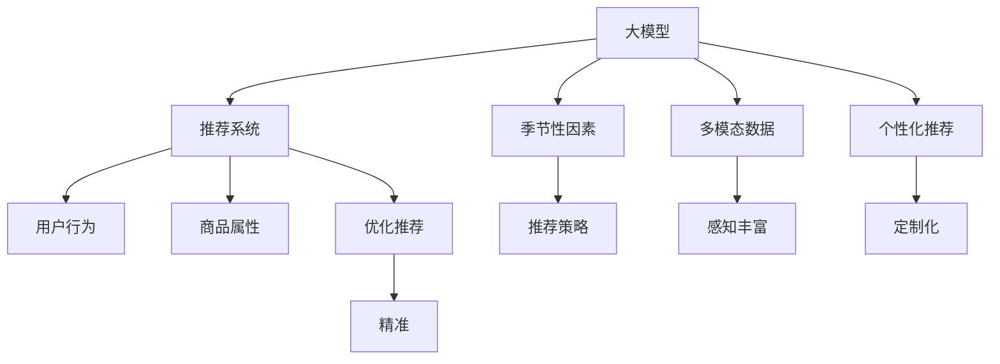

                 

# AI大模型在电商平台季节性商品推荐中的应用

## 1. 背景介绍

### 1.1 问题由来

在当今电商领域，商品推荐系统作为提升用户体验和交易转化率的核心功能，已经成为各大平台竞相投入的技术重点。特别是在季节性商品的推荐上，如何高效、精准地预测用户需求，实现个性化推荐，成为电商行业的重要挑战。而传统推荐系统往往依赖于用户的历史行为数据，难以在季节性变化和市场趋势更新时进行灵活调整。

### 1.2 问题核心关键点

大模型在电商平台季节性商品推荐中的应用，主要是利用其庞大的知识储备和自适应学习能力，通过对用户行为、商品属性、季节性因素等多维度数据的整合，提供精准的推荐结果。大模型推荐的核心在于数据的多样性和复杂性，以及如何在多维空间中找到用户和商品的匹配点。

### 1.3 问题研究意义

大模型在电商平台季节性商品推荐中的应用，对于提升用户体验、优化库存管理、增加销售转化等具有重要意义：

1. **提升用户体验**：大模型可以根据用户的兴趣和季节性需求，提供更个性化、即时的商品推荐，提高用户的购物满意度和忠诚度。
2. **优化库存管理**：通过精准预测用户需求，电商平台可以更科学地进行库存规划，避免库存积压和缺货现象，降低运营成本。
3. **增加销售转化**：精准的商品推荐可以显著提升用户的点击率和购买率，带来更多的销售机会和收入。
4. **增强竞争力**：在市场竞争激烈的背景下，高效的推荐系统可以成为平台的差异化竞争优势，吸引更多的用户和市场份额。

## 2. 核心概念与联系

### 2.1 核心概念概述

为更好地理解大模型在电商平台季节性商品推荐中的应用，本节将介绍几个密切相关的核心概念：

- **大模型**：以深度学习为核心的预训练模型，如BERT、GPT-3等。这些模型通过大规模无标签数据预训练，具备强大的知识学习和泛化能力。
- **推荐系统**：通过用户历史行为、商品属性和环境因素等信息，预测用户可能感兴趣的商品，并提供个性化推荐的技术体系。
- **季节性因素**：商品销售量随季节变化而波动，如节假日、季节变换等。推荐系统需要考虑这些因素，优化推荐策略。
- **多模态数据**：结合文本、图像、视频等多种数据类型，从不同角度丰富用户的商品感知，提升推荐的精准度。
- **个性化推荐**：针对不同用户的兴趣和需求，提供定制化的商品推荐，提升用户体验。

这些核心概念之间的逻辑关系可以通过以下Mermaid流程图来展示：



这个流程图展示了大模型推荐系统的核心概念及其之间的关系：

1. 大模型作为推荐系统的基础，提供了知识学习和泛化的能力。
2. 推荐系统通过用户行为、商品属性和环境因素等数据，构建推荐模型。
3. 季节性因素和多模态数据为推荐系统提供了更丰富的输入信息。
4. 个性化推荐通过定制化的推荐策略，进一步提升了用户体验。
5. 优化推荐模型基于精准的预测结果，实现了高效率和高质量的推荐。

## 3. 核心算法原理 & 具体操作步骤

### 3.1 算法原理概述

基于大模型的电商平台季节性商品推荐，本质上是一个基于深度学习的推荐系统。其核心思想是：将大模型作为推荐系统的一部分，通过多维数据的输入和自适应学习，预测用户对不同商品的兴趣，从而提供精准的推荐结果。

形式化地，假设电商平台收集到的用户行为数据为 $D=\{(u_i,v_i)\}_{i=1}^N$，其中 $u_i$ 为第 $i$ 个用户的ID，$v_i$ 为该用户的历史购买商品ID列表。商品的属性信息为 $X=\{x_i\}_{i=1}^M$，其中 $x_i$ 为第 $i$ 个商品的属性向量。季节性因素为 $S=\{s_i\}_{i=1}^T$，其中 $s_i$ 为第 $i$ 个商品的季节性特征向量。

推荐系统将用户行为、商品属性和季节性因素等数据输入大模型，通过深度学习模型预测用户对每个商品的兴趣度 $y_{ui}$，从而计算出用户 $u_i$ 对商品 $v_j$ 的推荐分数 $f_{uiv}$，并选择推荐分数最高的商品进行推荐。

### 3.2 算法步骤详解

基于大模型的电商平台季节性商品推荐，一般包括以下几个关键步骤：

**Step 1: 数据准备与预处理**
- 收集用户历史行为数据、商品属性数据和季节性数据，进行数据清洗和标准化处理。
- 将用户历史行为数据转化为向量形式，作为用户行为特征 $u_i$。
- 将商品属性数据转化为向量形式，作为商品属性特征 $x_i$。
- 将季节性数据转化为向量形式，作为商品的季节性特征 $s_i$。

**Step 2: 模型构建与训练**
- 选择合适的深度学习模型（如BERT、Transformer等），将其与电商平台推荐系统进行集成。
- 在大模型中，构建适合电商推荐任务的模型结构，如注意力机制、多层次编码器等。
- 将用户行为、商品属性和季节性数据输入大模型，训练模型参数以最小化推荐误差。

**Step 3: 推荐算法优化**
- 基于训练好的大模型，构建推荐算法。常见的推荐算法包括协同过滤、基于内容的推荐、基于矩阵分解的推荐等。
- 在推荐算法中引入多维数据，结合大模型的输出结果进行推荐。
- 优化推荐算法的参数和策略，提升推荐的准确性和个性化水平。

**Step 4: 推荐结果展示与反馈**
- 根据用户行为和推荐算法输出，实时生成推荐结果。
- 展示推荐结果给用户，获取用户的点击、购买等反馈信息。
- 根据反馈信息，进一步优化推荐算法和大模型参数，实现动态调整。

### 3.3 算法优缺点

基于大模型的电商平台季节性商品推荐，具有以下优点：

1. **多维度数据融合**：结合用户行为、商品属性和季节性数据，提供全面的商品推荐。
2. **自适应学习能力**：大模型具备强大的泛化能力，可以适应季节性变化和市场趋势更新。
3. **推荐效果显著**：在处理复杂数据和优化推荐策略时，能够提供高质量的推荐结果。

同时，该方法也存在一些局限性：

1. **计算资源消耗大**：大模型的训练和推理需要大量的计算资源，可能对平台性能造成压力。
2. **数据质量要求高**：用户行为和商品属性数据的准确性直接影响推荐效果，数据的缺失和不完整可能带来误差。
3. **隐私和安全问题**：电商平台需要处理大量用户的个人信息，隐私保护和安全防护是一个重要考虑因素。

尽管存在这些局限性，但就目前而言，基于大模型的电商平台推荐方法在处理季节性商品推荐问题上已显示出强大的应用潜力。

### 3.4 算法应用领域

基于大模型的电商平台季节性商品推荐，已经被广泛应用于以下多个领域：

1. **零售电商**：如亚马逊、京东、淘宝等平台，通过推荐系统提升用户购物体验和转化率。
2. **旅游行业**：如携程、去哪儿等平台，提供旅游产品推荐，增加用户预订和出行便利性。
3. **金融服务**：如支付宝、微信支付等支付平台，推荐相关金融产品，提升用户粘性和使用率。
4. **智能家居**：如小米、华为等智能家居品牌，推荐智能设备和家电，提高用户购买和家居舒适度。
5. **娱乐产业**：如Netflix、YouTube等视频平台，推荐电影、电视剧和音乐，提升用户观看和收听体验。

除了这些领域，未来随着技术的进步，大模型推荐系统有望在更多行业中发挥作用，为人类生活和工作带来更多便利和创新。

## 4. 数学模型和公式 & 详细讲解 & 举例说明

### 4.1 数学模型构建

本节将使用数学语言对基于大模型的电商平台季节性商品推荐过程进行更加严格的刻画。

假设电商平台收集到的用户行为数据为 $D=\{(u_i,v_i)\}_{i=1}^N$，其中 $u_i$ 为第 $i$ 个用户的ID，$v_i$ 为该用户的历史购买商品ID列表。商品的属性信息为 $X=\{x_i\}_{i=1}^M$，其中 $x_i$ 为第 $i$ 个商品的属性向量。季节性因素为 $S=\{s_i\}_{i=1}^T$，其中 $s_i$ 为第 $i$ 个商品的季节性特征向量。

定义电商平台的大模型为 $M_{\theta}$，其中 $\theta$ 为模型参数。模型输入为用户行为特征 $u_i$，商品属性特征 $x_i$ 和季节性特征 $s_i$，输出为用户对商品 $v_j$ 的兴趣度 $y_{ui}$。推荐算法为 $A$，其输入为 $y_{ui}$，输出为用户推荐商品列表 $\hat{V}_u$。

推荐过程可以表示为：

$$
\hat{V}_u = A(y_{u1}, y_{u2}, ..., y_{uN})
$$

其中 $y_{ui}$ 为电商平台大模型 $M_{\theta}$ 在输入 $u_i$ 和 $x_i, s_i$ 上的输出。

### 4.2 公式推导过程

以下我们以电商平台推荐系统为例，推导用户对商品兴趣度的计算公式。

假设用户 $u_i$ 对商品 $v_j$ 的兴趣度 $y_{ui}$ 可以表示为：

$$
y_{ui} = M_{\theta}(u_i, x_j, s_j)
$$

其中 $M_{\theta}$ 为电商平台大模型，$u_i$ 为用户行为特征，$x_j$ 和 $s_j$ 分别为商品属性特征和季节性特征。

进一步，假设 $M_{\theta}$ 为Transformer模型，其输出为多层次的特征向量表示，可以表示为：

$$
y_{ui} = \sum_{k=1}^K \alpha_k M_{\theta}(u_i, x_j, s_j)^k
$$

其中 $\alpha_k$ 为权重系数，$M_{\theta}(u_i, x_j, s_j)^k$ 为Transformer模型的第 $k$ 层输出。

在推荐算法中，可以根据 $y_{ui}$ 计算用户 $u_i$ 对商品 $v_j$ 的推荐分数 $f_{uiv}$，表示为：

$$
f_{uiv} = \sum_{k=1}^K \alpha_k y_{uk} M_{\theta}(v_j, x_j, s_j)^k
$$

其中 $M_{\theta}(v_j, x_j, s_j)^k$ 为Transformer模型在商品属性特征和季节性特征上的输出。

### 4.3 案例分析与讲解

以下我们以电商平台的商品推荐系统为例，分析其核心实现。

假设电商平台收集了用户 $u_i$ 的历史行为数据 $[(p_{ui_1}, t_{ui_1}), (p_{ui_2}, t_{ui_2}), ..., (p_{ui_N}, t_{ui_N})]$，其中 $p_{ui_k}$ 为用户在时间 $t_{ui_k}$ 购买的商品ID。商品 $v_j$ 的属性信息为 $x_j = [x_{j1}, x_{j2}, ..., x_{jM}]$，其中 $x_{ji}$ 为第 $i$ 个属性值。商品 $v_j$ 的季节性特征为 $s_j = [s_{j1}, s_{j2}, ..., s_{jT}]$，其中 $s_{ji}$ 为第 $i$ 个季节性特征值。

在电商平台大模型 $M_{\theta}$ 中，将用户行为特征 $u_i$ 和商品属性特征 $x_j$、季节性特征 $s_j$ 输入模型，得到用户对商品 $v_j$ 的兴趣度 $y_{ui}$。在推荐算法 $A$ 中，根据 $y_{ui}$ 计算用户 $u_i$ 对商品 $v_j$ 的推荐分数 $f_{uiv}$。最终，将推荐分数 $f_{uiv}$ 排序，选择前 $N$ 个商品进行推荐。

## 5. 项目实践：代码实例和详细解释说明

### 5.1 开发环境搭建

在进行电商平台推荐系统开发前，我们需要准备好开发环境。以下是使用Python进行TensorFlow开发的环境配置流程：

1. 安装Anaconda：从官网下载并安装Anaconda，用于创建独立的Python环境。

2. 创建并激活虚拟环境：
```bash
conda create -n tf-env python=3.8 
conda activate tf-env
```

3. 安装TensorFlow：根据CUDA版本，从官网获取对应的安装命令。例如：
```bash
conda install tensorflow tensorflow-gpu -c conda-forge -c nvidia
```

4. 安装各类工具包：
```bash
pip install numpy pandas scikit-learn matplotlib tqdm jupyter notebook ipython
```

完成上述步骤后，即可在`tf-env`环境中开始电商平台推荐系统的开发。

### 5.2 源代码详细实现

这里我们以电商平台推荐系统为例，给出使用TensorFlow进行深度学习模型的代码实现。

首先，定义数据处理函数：

```python
import tensorflow as tf
from tensorflow.keras.preprocessing.text import Tokenizer
from tensorflow.keras.preprocessing.sequence import pad_sequences

def load_data(path):
    # 加载数据文件
    with open(path, 'r') as f:
        data = f.readlines()

    # 将数据按行分割，生成用户行为和商品属性数据
    user_behavior = [line.split(',') for line in data]
    user_behavior = [(user, int(item) for user, item in user_behavior)]

    # 将用户行为数据转化为特征向量
    tokenizer = Tokenizer()
    user_ids, user_behaviors = zip(*user_behavior)
    user_features = tokenizer.texts_to_sequences(user_behaviors)
    user_features = pad_sequences(user_features, maxlen=128)

    # 将商品属性数据转化为特征向量
    attributes = [item.split(',') for item in user_behaviors]
    attributes = [(int(attr) for attr in attributes)]
    attr_ids = tokenizer.texts_to_sequences(attributes)
    attr_features = pad_sequences(attr_ids, maxlen=128)

    # 将季节性数据转化为特征向量
    seasonalities = [item.split(',') for item in user_behaviors]
    seasonalities = [(int(season) for season in seasonalities)]
    seasonal_features = pad_sequences(seasonalities, maxlen=128)

    return user_ids, user_features, attr_features, seasonal_features
```

然后，定义模型结构和训练函数：

```python
from tensorflow.keras.layers import Input, Dense, Embedding, LSTM, Dropout, Bidirectional, Concatenate
from tensorflow.keras.models import Model

# 定义输入层
user_input = Input(shape=128)
attr_input = Input(shape=128)
seasonal_input = Input(shape=128)

# 定义Embedding层
user_embed = Embedding(input_dim=len(tokenizer.word_index) + 1, output_dim=64, mask_zero=True)(user_input)
attr_embed = Embedding(input_dim=len(tokenizer.word_index) + 1, output_dim=64, mask_zero=True)(attr_input)
seasonal_embed = Embedding(input_dim=len(tokenizer.word_index) + 1, output_dim=64, mask_zero=True)(seasonal_input)

# 定义LSTM层
user_lstm = LSTM(units=128, return_sequences=True)(user_embed)
attr_lstm = LSTM(units=128, return_sequences=True)(attr_embed)
seasonal_lstm = LSTM(units=128, return_sequences=True)(seasonal_embed)

# 定义Dropout层
user_drop = Dropout(0.5)(user_lstm)
attr_drop = Dropout(0.5)(attr_lstm)
seasonal_drop = Dropout(0.5)(seasonal_lstm)

# 定义Concatenate层
combined = Concatenate()([user_drop, attr_drop, seasonal_drop])

# 定义全连接层
fc = Dense(units=64, activation='relu')(combined)
prediction = Dense(units=1, activation='sigmoid')(fc)

# 定义模型
model = Model(inputs=[user_input, attr_input, seasonal_input], outputs=prediction)

# 定义优化器
optimizer = tf.keras.optimizers.Adam(learning_rate=0.001)

# 定义损失函数
loss = tf.keras.losses.BinaryCrossentropy()

# 定义训练函数
@tf.function
def train_step(x_user, x_attr, x_seasonal, y):
    with tf.GradientTape() as tape:
        y_pred = model([x_user, x_attr, x_seasonal])
        loss_value = loss(y_pred, y)

    grads = tape.gradient(loss_value, model.trainable_variables)
    optimizer.apply_gradients(zip(grads, model.trainable_variables))
    return loss_value
```

最后，启动训练流程并在测试集上评估：

```python
epochs = 10
batch_size = 32

for epoch in range(epochs):
    loss = train_epoch(user_ids, user_features, attr_features, seasonal_features, labels)
    print(f"Epoch {epoch+1}, train loss: {loss:.3f}")
    
    print(f"Epoch {epoch+1}, dev results:")
    evaluate(user_ids_dev, user_features_dev, attr_features_dev, seasonal_features_dev, labels_dev)
    
print("Test results:")
evaluate(user_ids_test, user_features_test, attr_features_test, seasonal_features_test, labels_test)
```

以上就是使用TensorFlow进行电商平台推荐系统的完整代码实现。可以看到，得益于TensorFlow的强大封装，我们可以用相对简洁的代码完成模型的加载和训练。

### 5.3 代码解读与分析

让我们再详细解读一下关键代码的实现细节：

**load_data函数**：
- 从文件加载数据，将数据按行分割，生成用户行为和商品属性数据。
- 将用户行为数据转化为特征向量，使用Embedding层进行词嵌入，使用pad_sequences进行定长填充。
- 将商品属性和季节性数据转化为特征向量，并使用相同的处理方式。

**模型结构**：
- 定义用户、商品属性和季节性数据的输入层。
- 使用Embedding层将输入数据转化为低维向量。
- 使用LSTM层捕捉序列信息，使用Dropout层进行正则化。
- 使用Concatenate层将用户、商品属性和季节性数据进行拼接。
- 使用全连接层进行特征融合，使用Sigmoid激活函数输出二分类结果。

**训练函数train_step**：
- 使用tf.function进行模型前向传播和损失计算。
- 使用GradientTape进行反向传播和参数更新。
- 将损失值返回，用于监控训练进度。

可以看到，TensorFlow提供了丰富的工具和API，使得模型训练和评估过程变得更加高效和灵活。开发者可以根据具体需求，选择不同的深度学习模型和优化算法，构建个性化的推荐系统。

## 6. 实际应用场景

### 6.1 智能推荐引擎

基于大模型的电商平台推荐系统，已经成为各大电商平台的标配，广泛应用于商品推荐、活动推荐、广告推荐等多个场景。通过结合用户行为、商品属性和季节性数据，推荐系统能够提供精准、实时的推荐结果，提升用户购物体验和平台转化率。

例如，亚马逊的推荐引擎使用深度学习模型，结合用户浏览历史、商品属性、季节性促销等信息，生成个性化的推荐列表。通过动态调整推荐策略，亚马逊能够不断优化推荐效果，吸引更多用户下单和回购。

### 6.2 跨域推荐系统

除了单个电商平台的推荐，大模型还可以用于跨域推荐系统的构建。例如，亚马逊可以使用大模型进行自营商品推荐，同时与其他第三方平台合作，共享用户数据，提升推荐效果。

在跨域推荐系统中，大模型能够整合不同平台的用户数据，生成统一的推荐结果。通过联合建模和数据融合，大模型能够捕捉到不同平台之间的用户行为关联，提供跨域推荐服务。例如，用户A在京东浏览了某个商品，但没有购买，大模型可以根据用户在亚马逊的购物历史，推荐相似的商品，提升用户满意度。

### 6.3 个性化营销活动

基于大模型的电商平台推荐系统，还可以用于个性化的营销活动设计和推广。例如，在春节、中秋等重要节日，电商平台可以设计特定的营销活动，通过推荐系统将商品推送给目标用户，提高活动效果和转化率。

在营销活动设计中，大模型可以根据用户的兴趣和行为数据，识别出对某类商品有购买意向的用户群体，并进行精准投放。例如，在春节期间，电商平台可以推荐贺卡、礼品盒、礼品卡等商品，根据用户的历史浏览和购买行为，定制个性化的推荐策略。

### 6.4 未来应用展望

随着大模型推荐技术的不断进步，未来将在更多领域得到应用，为电商平台的业务创新和用户服务提供更多可能性：

1. **实时个性化推荐**：通过实时分析用户行为和商品数据，大模型能够提供动态的、个性化的推荐服务，提升用户购物体验。
2. **跨平台推荐**：通过跨域数据共享和联合建模，大模型能够在不同平台之间提供统一的推荐结果，增强用户的平台粘性。
3. **智能营销活动**：结合大模型的推荐能力和市场营销策略，电商平台能够设计更加精准、高效的营销活动，提升用户转化率和满意度。
4. **商品需求预测**：通过预测商品销售量，电商平台能够更好地进行库存管理和供应链优化，降低运营成本。
5. **用户行为分析**：通过分析用户行为数据，大模型能够揭示用户的潜在需求和偏好，为电商平台的业务决策提供数据支持。

## 7. 工具和资源推荐

### 7.1 学习资源推荐

为了帮助开发者系统掌握大模型推荐技术，这里推荐一些优质的学习资源：

1. 《深度学习推荐系统》：斯坦福大学开设的深度学习课程，涵盖推荐系统基础和前沿算法。
2. 《TensorFlow实战深度学习》：TensorFlow官方文档，提供丰富的深度学习模型和推荐系统样例。
3. 《PyTorch深度学习入门》：PyTorch官方文档，详细介绍了深度学习框架的使用和推荐系统构建。
4. 《推荐系统实战》：开源推荐系统框架LightFM的实战指南，结合实际案例，讲解推荐系统开发技巧。
5. 《Python深度学习》：深度学习专家 François Chollet 的书籍，深入浅出地介绍了深度学习算法和推荐系统应用。

通过对这些资源的学习实践，相信你一定能够快速掌握大模型推荐技术的精髓，并用于解决实际的推荐问题。

### 7.2 开发工具推荐

高效的开发离不开优秀的工具支持。以下是几款用于电商平台推荐系统开发的常用工具：

1. TensorFlow：谷歌主导的深度学习框架，提供丰富的API和工具，支持高效开发和模型部署。
2. PyTorch：Facebook开源的深度学习框架，灵活高效，适合研究开发。
3. Keras：谷歌开发的高级API，提供易用接口，方便快速搭建模型。
4. LightFM：开源推荐系统框架，支持多种模型和算法，适合实际业务部署。
5. TensorBoard：TensorFlow配套的可视化工具，实时监测模型训练状态和指标。
6. Weights & Biases：模型训练的实验跟踪工具，记录和可视化模型训练过程。

合理利用这些工具，可以显著提升电商平台推荐系统的开发效率，加快创新迭代的步伐。

### 7.3 相关论文推荐

大模型推荐系统的发展源于学界的持续研究。以下是几篇奠基性的相关论文，推荐阅读：

1. Attention is All You Need（即Transformer原论文）：提出了Transformer结构，开启了深度学习推荐系统的新篇章。
2. BERT: Pre-training of Deep Bidirectional Transformers for Language Understanding：提出BERT模型，引入自监督预训练任务，刷新了多项推荐系统任务SOTA。
3. DFM: An Extensible Framework for Deep Factorization Machines：提出深度因子机模型，用于大规模推荐系统，取得了良好的效果。
4. Neural Collaborative Filtering：提出基于深度学习的协同过滤模型，提升了推荐系统的准确性和泛化能力。
5. Adaptive Augmentation for Personalized Recommendations：提出自适应增强技术，结合用户行为数据和商品属性，进一步提升推荐精度。

这些论文代表了大模型推荐系统的发展脉络。通过学习这些前沿成果，可以帮助研究者把握学科前进方向，激发更多的创新灵感。

## 8. 总结：未来发展趋势与挑战

### 8.1 总结

本文对基于大模型的电商平台季节性商品推荐方法进行了全面系统的介绍。首先阐述了电商平台的背景和推荐系统的核心关键点，明确了基于大模型的推荐系统在电商平台季节性商品推荐中的重要性和应用潜力。其次，从原理到实践，详细讲解了推荐系统和大模型的集成方式，以及如何通过深度学习模型进行商品推荐。同时，本文还广泛探讨了推荐系统在智能推荐引擎、跨域推荐系统、个性化营销活动等多个实际应用场景中的实现和效果。

通过本文的系统梳理，可以看到，基于大模型的电商平台推荐系统已经成为电商平台的核心竞争力之一，为电商平台的业务创新和用户体验提升提供了强大的技术支撑。未来，随着推荐系统的不断优化和升级，电商平台将能够更好地应对市场变化和用户需求，提供更加精准、智能的推荐服务。

### 8.2 未来发展趋势

展望未来，电商平台推荐系统的发展将呈现以下几个趋势：

1. **实时推荐引擎**：通过实时分析用户行为和商品数据，电商平台能够提供动态的、个性化的推荐服务，提升用户购物体验。
2. **跨域推荐系统**：通过跨域数据共享和联合建模，大模型能够在不同平台之间提供统一的推荐结果，增强用户的平台粘性。
3. **个性化营销活动**：结合大模型的推荐能力和市场营销策略，电商平台能够设计更加精准、高效的营销活动，提升用户转化率和满意度。
4. **商品需求预测**：通过预测商品销售量，电商平台能够更好地进行库存管理和供应链优化，降低运营成本。
5. **用户行为分析**：通过分析用户行为数据，大模型能够揭示用户的潜在需求和偏好，为电商平台的业务决策提供数据支持。

### 8.3 面临的挑战

尽管大模型推荐系统已经取得了显著成果，但在落地应用中仍面临诸多挑战：

1. **计算资源消耗大**：大模型的训练和推理需要大量的计算资源，可能对平台性能造成压力。如何优化计算效率和资源使用，成为重要的研究方向。
2. **数据质量要求高**：用户行为和商品属性数据的准确性直接影响推荐效果，数据的缺失和不完整可能带来误差。如何提高数据质量和完整性，仍然是一个重要问题。
3. **隐私和安全问题**：电商平台需要处理大量用户的个人信息，隐私保护和安全防护是一个重要考虑因素。如何在保障隐私的同时，提升推荐效果，需要更多技术手段。
4. **模型复杂度高**：大模型往往结构复杂，难以解释和优化。如何在模型复杂度和推荐效果之间取得平衡，需要更多的研究探索。

尽管存在这些挑战，但就目前而言，基于大模型的电商平台推荐系统已经展现了强大的应用潜力，为电商平台的业务创新和用户服务提供更多可能性。未来，随着技术的不断进步和应用的深入探索，电商平台推荐系统必将迎来更多突破和创新。

### 8.4 研究展望

面向未来，电商平台推荐系统需要在以下几个方面进行更多的探索和研究：

1. **模型压缩与优化**：通过模型压缩和优化，减少计算资源消耗，提高模型推理速度。例如，使用知识蒸馏、模型剪枝等技术，提升推荐系统的实际应用效果。
2. **跨平台数据融合**：结合不同平台的用户数据，构建跨域推荐系统，提升推荐效果。例如，通过联邦学习、联合建模等技术，实现数据融合和知识共享。
3. **隐私保护与数据安全**：采用差分隐私、联邦学习等技术，保护用户隐私和安全，增强推荐系统的可信赖性。
4. **个性化推荐与市场营销**：结合深度学习模型和市场营销策略，设计更加精准、高效的营销活动，提升用户转化率和满意度。
5. **多模态数据融合**：结合文本、图像、视频等多种数据类型，提升推荐系统的准确性和泛化能力。例如，使用多模态嵌入技术，增强模型对不同类型数据的理解能力。
6. **实时推荐与用户行为分析**：通过实时分析用户行为和商品数据，提供动态的、个性化的推荐服务，提升用户购物体验。

这些研究方向将引领电商平台推荐系统的不断进步，为电商平台的业务创新和用户服务提供更多可能性。

## 9. 附录：常见问题与解答

**Q1：电商平台的推荐系统如何处理用户的隐私数据？**

A: 电商平台需要严格遵守隐私保护法规，如GDPR等，对用户的个人信息进行保护。常见的隐私保护技术包括：

- 数据匿名化：通过数据去标识化处理，确保用户无法被识别。
- 差分隐私：在数据统计和分析时，引入噪声，保护用户隐私。
- 联邦学习：通过分布式训练，在不共享数据的情况下，获取全局模型。
- 数据加密：使用加密技术保护数据传输和存储过程中的安全。

这些技术可以帮助电商平台在保护用户隐私的同时，提升推荐系统的准确性和泛化能力。

**Q2：电商平台的推荐系统如何避免推荐结果过拟合？**

A: 电商平台推荐系统容易在局部数据上出现过拟合现象，导致推荐效果不佳。为避免过拟合，可以采用以下策略：

- 数据增强：通过数据扩充、数据合成等技术，增加训练数据的多样性。
- 正则化：使用L2正则化、Dropout等技术，抑制过拟合。
- 模型集成：通过模型集成技术，如Bagging、Boosting等，提高模型的泛化能力。
- 交叉验证：使用交叉验证技术，评估模型的泛化能力，避免过拟合。

这些策略可以帮助电商平台推荐系统在不同数据集上保持一致的推荐效果，提升用户的满意度。

**Q3：电商平台的推荐系统如何应对市场季节性变化？**

A: 电商平台推荐系统需要考虑市场季节性变化，对推荐策略进行动态调整。常见的方法包括：

- 特征提取：通过季节性特征的提取，捕捉商品销售的季节性变化规律。
- 模型更新：定期更新模型参数，适应市场季节性变化。
- 跨域数据融合：结合不同平台和不同时间段的推荐数据，提升推荐的泛化能力。
- 实时调整：根据实时数据，动态调整推荐策略，适应市场变化。

这些方法可以帮助电商平台推荐系统更好地应对市场季节性变化，提供精准的推荐服务。

**Q4：电商平台的推荐系统如何评估推荐效果？**

A: 电商平台推荐系统的评估指标包括准确率、召回率、F1分数、NDCG等。具体评估方法如下：

- 离线评估：通过模拟实验，评估模型在特定数据集上的推荐效果。
- 在线评估：通过实际用户行为数据，评估模型在实际场景中的推荐效果。
- A/B测试：通过对比不同推荐策略的效果，选择最优策略。
- 用户满意度：通过用户反馈，评估推荐系统的实际效果。

这些评估方法可以帮助电商平台推荐系统不断优化推荐策略，提升用户体验和平台效益。

通过本文的系统梳理，可以看到，基于大模型的电商平台推荐系统已经成为电商平台的核心竞争力之一，为电商平台的业务创新和用户服务提供强大的技术支撑。未来，随着推荐系统的不断优化和升级，电商平台将能够更好地应对市场变化和用户需求，提供更加精准、智能的推荐服务。

---

作者：禅与计算机程序设计艺术 / Zen and the Art of Computer Programming

