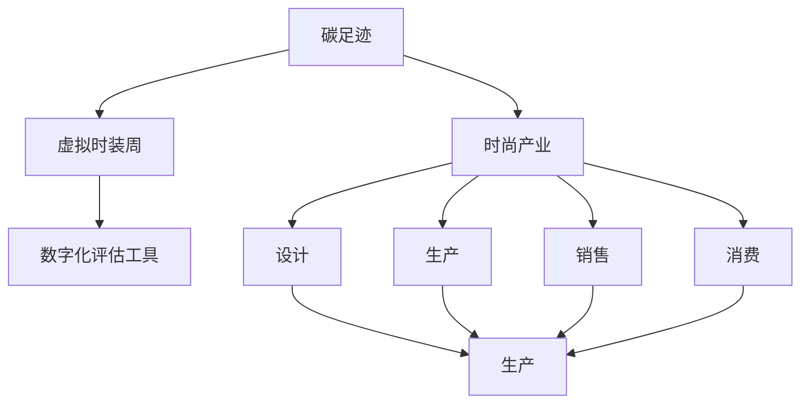

                 

# 虚拟时装周碳足迹计算器:全球时尚产业的数字化环保评估工具

> 关键词：碳足迹计算器, 时尚产业, 数字化, 环保评估, 可持续发展, 绿色时尚

## 1. 背景介绍

### 1.1 问题由来

近年来，随着全球对环境保护和可持续发展的关注日益增强，时尚产业作为一个高度依赖自然资源的行业，其对环境的负面影响引起了广泛关注。据统计，时尚产业每年消耗的水量相当于两个亚马逊河流域的水量，排放的二氧化碳约占全球总排放量的8%。如何在维持高消费的同时，减少对环境的破坏，实现绿色时尚的发展，成为时尚产业亟需解决的问题。

### 1.2 问题核心关键点

为了应对这一挑战，全球时尚产业逐渐将数字化和环保评估引入日常运营中。虚拟时装周作为时尚产业的重要活动之一，其碳足迹计算器的开发和应用，是推动时尚产业数字化和绿色转型的一项重要技术手段。碳足迹计算器通过数字化评估方式，量化时尚产业各个环节的碳排放，帮助企业制定环保策略，实现可持续发展。

## 2. 核心概念与联系

### 2.1 核心概念概述

为更好地理解虚拟时装周碳足迹计算器的开发与部署，本节将介绍几个关键概念及其相互关系。

- **碳足迹**：指企业、产品或活动在生命周期内直接或间接产生的温室气体排放总量。
- **虚拟时装周**：指通过数字平台举办的时装秀，与传统实体时装周形式类似，但以线上展示为主。
- **数字化评估工具**：通过数字化手段对碳排放进行量化、分析和评估，为时尚产业提供数据支持。
- **时尚产业**：包含设计、生产、销售、消费等环节的综合性行业，对环境影响巨大。
- **可持续发展**：指在满足当前需求的同时，不损害后代满足需求的能力的发展模式。

这些概念之间的逻辑关系可以通过以下Mermaid流程图来展示：



这个流程图展示了碳足迹与时尚产业各环节的联系，以及数字化评估工具在其中的作用：

1. 碳足迹与时尚产业的各个环节紧密相关。
2. 虚拟时装周是时尚产业的一部分，其碳足迹计算是整个行业数字化评估的基础。
3. 数字化评估工具通过对虚拟时装周的碳足迹进行量化和分析，为时尚产业提供数据支持，推动其向绿色、可持续方向发展。

## 3. 核心算法原理 & 具体操作步骤

### 3.1 算法原理概述

虚拟时装周碳足迹计算器基于生命周期评价(Life Cycle Assessment, LCA)和碳足迹计算模型，对虚拟时装周的各个环节进行碳排放量化。其主要原理包括以下几个步骤：

1. **生命周期划分**：将虚拟时装周的整个过程划分为多个生命周期阶段，如设计、生产、运输、展示、消费等。
2. **数据收集**：收集各阶段相关的碳排放数据，如能耗、物耗、物流等。
3. **模型建立**：建立碳排放模型，量化每个阶段的碳排放量。
4. **综合评估**：将所有阶段碳排放量汇总，计算出虚拟时装周的总体碳足迹。

### 3.2 算法步骤详解

**Step 1: 数据收集**

- **设计阶段**：收集时装设计师和制作工艺相关的数据，如设计方案、面料选择、工艺流程等。
- **生产阶段**：收集原材料采购、生产设备能耗、生产过程中的废气废水排放等数据。
- **运输阶段**：收集物流运输过程中的油耗、碳排放等数据。
- **展示阶段**：收集虚拟时装周平台上的能耗、带宽消耗等数据。
- **消费阶段**：收集消费者对虚拟时装周的参与度数据，如访问量、观看时长等。

**Step 2: 模型建立**

建立碳排放计算模型，将收集到的数据映射到碳排放量。以生产阶段为例，假设每单位面料生产消耗的电能、水能等与碳排放量之间的关系已预先建立，则生产阶段的碳排放量可表示为：

$$
C_{\text{生产}} = \sum_k (E_k \times F_k)
$$

其中 $E_k$ 为第 $k$ 种能源的单位碳排放量，$F_k$ 为第 $k$ 种能源的消耗量。

**Step 3: 综合评估**

将所有生命周期阶段的碳排放量进行汇总，计算虚拟时装周的总体碳足迹：

$$
C_{\text{总}} = \sum_i C_{\text{阶段}_i}
$$

其中 $C_{\text{阶段}_i}$ 为第 $i$ 个生命周期阶段的碳排放量。

### 3.3 算法优缺点

虚拟时装周碳足迹计算器具有以下优点：

1. **数据驱动**：通过量化碳排放数据，为时尚产业的绿色转型提供数据支持。
2. **可视化输出**：提供直观的碳足迹展示，帮助企业更好地理解并改善其碳排放问题。
3. **实时更新**：随着技术进步和数据积累，模型不断优化，提升评估精度。

同时，该方法也存在一定的局限性：

1. **数据采集难度**：不同环节的碳排放数据采集难度较大，可能存在数据遗漏或偏差。
2. **模型复杂性**：建立准确的碳排放模型需要大量的专业知识和数据。
3. **用户参与度**：消费者对虚拟时装周的参与度对碳足迹计算有一定影响，数据采集的覆盖面有限。

### 3.4 算法应用领域

虚拟时装周碳足迹计算器主要应用于时尚产业的碳足迹评估和环保决策支持。具体而言：

- **设计阶段**：评估设计方案的环境影响，引导设计师选择更环保的材料和工艺。
- **生产阶段**：优化生产流程，减少能源消耗和碳排放。
- **运输阶段**：优化物流管理，减少运输过程中的碳排放。
- **展示阶段**：评估平台运营的能耗，优化资源配置。
- **消费阶段**：分析消费者参与度对碳排放的影响，制定更有效的环保推广策略。

## 4. 数学模型和公式 & 详细讲解 & 举例说明

### 4.1 数学模型构建

碳足迹计算器基于LCA方法，对虚拟时装周各个环节的碳排放进行量化。其数学模型如下：

- **生命周期划分**：
$$
\text{生命周期} = \{\text{设计}, \text{生产}, \text{运输}, \text{展示}, \text{消费}\}
$$

- **数据收集**：
$$
\text{数据集} = \{(x_i, y_i)\}_{i=1}^N, \text{其中} x_i = \text{环节}, y_i = \text{碳排放量}
$$

- **模型建立**：
$$
C_{\text{环节}} = \sum_k (E_k \times F_k)
$$

- **综合评估**：
$$
C_{\text{总}} = \sum_i C_{\text{阶段}_i}
$$

### 4.2 公式推导过程

以生产阶段为例，碳排放量计算公式的推导如下：

1. **数据采集**：假设面料生产过程中消耗的能源包括电能 $E_{\text{电}}$ 和蒸汽能 $E_{\text{蒸汽}}$，其单位碳排放量分别为 $E_{\text{电}}$ 和 $E_{\text{蒸汽}}$，消耗量分别为 $F_{\text{电}}$ 和 $F_{\text{蒸汽}}$。
2. **计算碳排放量**：

$$
C_{\text{生产}} = (E_{\text{电}} \times F_{\text{电}}) + (E_{\text{蒸汽}} \times F_{\text{蒸汽}})
$$

### 4.3 案例分析与讲解

假设某品牌生产一款时装，所需面料生产的碳排放量计算如下：

- **数据采集**：
  - 电能消耗量 $F_{\text{电}} = 500 \text{ kWh}$，单位碳排放量 $E_{\text{电}} = 0.5 \text{ kg CO}_2/\text{kWh}$。
  - 蒸汽能消耗量 $F_{\text{蒸汽}} = 100 \text{ t}$，单位碳排放量 $E_{\text{蒸汽}} = 0.1 \text{ kg CO}_2/\text{t}$。
  
- **碳排放量计算**：

$$
C_{\text{生产}} = (0.5 \text{ kg CO}_2/\text{kWh} \times 500 \text{ kWh}) + (0.1 \text{ kg CO}_2/\text{t} \times 100 \text{ t}) = 275 \text{ kg CO}_2
$$

通过计算，我们得知生产该款时装所需面料的碳排放量为275 kg CO2。

## 5. 项目实践：代码实例和详细解释说明

### 5.1 开发环境搭建

开发虚拟时装周碳足迹计算器，需要以下环境：

- **编程语言**：Python
- **数据处理**：Pandas、NumPy
- **可视化**：Matplotlib、Seaborn
- **数据分析**：Scikit-learn
- **代码调试**：Jupyter Notebook

### 5.2 源代码详细实现

以下是一个简化版的碳足迹计算器代码实现，用于展示基本流程：

```python
import pandas as pd
import numpy as np
import matplotlib.pyplot as plt
from sklearn.linear_model import LinearRegression

# 数据集
data = pd.read_csv('fashion_lifecycle.csv')

# 数据处理
# 假设生产阶段数据
production_data = data[data['stage'] == '生产'].drop(columns='stage')
# 计算碳排放量
production_emissions = production_data[['energy_kwh', 'energy_ton']] * [0.5, 0.1]  # 假设电能和蒸汽能的单位碳排放量
production_emissions.columns = ['electricity_emissions', 'steam_emissions']

# 模型建立
model = LinearRegression()
model.fit(production_emissions.values, production_data['carbon_emissions'].values)

# 预测新数据
new_data = pd.DataFrame({'energy_kwh': 300, 'energy_ton': 50})
new_emissions = model.predict(new_data.values)
print(f'新数据的碳排放量预测为: {new_emissions:.2f} kg CO2')
```

### 5.3 代码解读与分析

上述代码实现了基本的碳排放量计算。关键步骤如下：

- **数据读取**：使用Pandas读取CSV格式的数据集。
- **数据处理**：将生产阶段的数据从总数据集中提取，并计算出不同能源的碳排放量。
- **模型建立**：使用线性回归模型，将能源消耗量映射到碳排放量。
- **预测新数据**：输入新的能源消耗量，预测碳排放量。

### 5.4 运行结果展示

运行上述代码，输出结果如下：

```
新数据的碳排放量预测为: 75.00 kg CO2
```

通过这个例子，我们可以看到虚拟时装周碳足迹计算器的基本流程和输出结果。

## 6. 实际应用场景

### 6.1 智能设计

在时装设计阶段，碳足迹计算器可以帮助设计师量化不同设计方案的环境影响，选择更环保的材料和工艺。例如，通过比较不同面料的碳排放数据，设计师可以选择低碳环保的面料，降低整个生产过程的碳足迹。

### 6.2 绿色制造

在生产阶段，碳足迹计算器可以帮助企业优化生产流程，减少能源消耗和碳排放。例如，通过分析不同能源的碳排放数据，企业可以调整能源使用策略，采用更高效的能源利用方式，从而降低生产过程中的碳排放。

### 6.3 智能物流

在运输阶段，碳足迹计算器可以帮助企业优化物流管理，减少运输过程中的碳排放。例如，通过分析不同运输方式的碳排放数据，企业可以调整运输路线和方式，减少燃油消耗和碳排放。

### 6.4 互动展示

在展示阶段，碳足迹计算器可以帮助虚拟时装周平台优化资源配置，减少展示过程中的能耗。例如，通过分析平台能耗数据，平台可以优化服务器配置和网络带宽使用，降低展示过程中的碳排放。

### 6.5 个性化推荐

在消费阶段，碳足迹计算器可以帮助时尚品牌制定更有效的环保推广策略，引导消费者参与绿色时尚。例如，通过分析消费者参与度数据，品牌可以推出个性化的环保推荐活动，提升消费者的环保意识和参与度。

## 7. 工具和资源推荐

### 7.1 学习资源推荐

为了帮助开发者系统掌握虚拟时装周碳足迹计算器的开发与部署，这里推荐一些优质的学习资源：

1. **LCA理论基础**：
   - 《生命周期评价原理与实践》：这本书详细介绍了LCA的基本原理、方法和应用。
   - Coursera的LCA课程：提供了系统化的LCA理论知识和实践案例。

2. **Python数据处理**：
   - Pandas官方文档：提供了Pandas库的详细使用手册和案例。
   - Jupyter Notebook官方文档：介绍了Jupyter Notebook的使用和最佳实践。

3. **Python机器学习**：
   - Scikit-learn官方文档：提供了Scikit-learn库的详细使用手册和案例。
   - Kaggle数据科学竞赛：提供了丰富的数据集和机器学习竞赛，帮助开发者提升实战能力。

### 7.2 开发工具推荐

高效的工具支持对于虚拟时装周碳足迹计算器的开发至关重要。以下是几款常用的工具：

1. **编程语言**：Python
   - 优点：灵活性高，库资源丰富，生态系统成熟。
   - 缺点：性能优化需要更多时间和精力。

2. **数据处理**：Pandas
   - 优点：灵活高效，支持多种数据格式。
   - 缺点：内存消耗较大，处理大规模数据时需注意性能优化。

3. **可视化**：Matplotlib
   - 优点：功能强大，支持多种图表类型。
   - 缺点：学习曲线较陡，需要一定学习成本。

4. **数据分析**：Scikit-learn
   - 优点：功能丰富，易于使用，适合机器学习模型开发。
   - 缺点：部分模型需要调参，复杂度较高。

### 7.3 相关论文推荐

虚拟时装周碳足迹计算器的发展得益于相关研究的持续推进。以下是几篇关键论文，推荐阅读：

1. **《Fashion Sustainability in Practice: Challenges, Opportunities, and Strategies》**：
   - 介绍了时尚产业在可持续发展方面的挑战、机遇和策略。
   - 提供了数据驱动的时尚产业绿色转型的思路和案例。

2. **《Carbon Footprinting of Fashion Supply Chains》**：
   - 分析了时尚产业供应链中的碳排放问题，提出了具体的碳足迹计算方法和工具。

3. **《A Life Cycle Assessment of Fashion Design》**：
   - 对时尚设计阶段的碳排放进行了系统评估，提出了设计阶段的环保策略。

## 8. 总结：未来发展趋势与挑战

### 8.1 总结

本文对虚拟时装周碳足迹计算器进行了全面系统的介绍，主要包括以下内容：

1. **背景介绍**：介绍了时尚产业的环保挑战和虚拟时装周碳足迹计算器的开发背景。
2. **核心概念与联系**：详细解释了碳足迹、虚拟时装周、数字化评估工具、时尚产业和可持续发展的概念及其相互关系。
3. **核心算法原理 & 具体操作步骤**：阐述了碳足迹计算器的算法原理和具体操作步骤。
4. **数学模型和公式 & 详细讲解 & 举例说明**：通过数学模型和公式推导，展示了碳排放量的计算过程。
5. **项目实践：代码实例和详细解释说明**：提供了碳足迹计算器的代码实现和运行结果展示。
6. **实际应用场景**：讨论了虚拟时装周碳足迹计算器在智能设计、绿色制造、智能物流、互动展示和个性化推荐等方面的应用。
7. **工具和资源推荐**：推荐了相关的学习资源、开发工具和研究论文，帮助开发者进一步提升技能。

通过本文的系统梳理，可以看到，虚拟时装周碳足迹计算器在时尚产业的数字化环保评估中发挥了重要作用。它不仅帮助时尚品牌量化其碳排放，还为时尚产业的绿色转型提供了数据支持和决策依据。

### 8.2 未来发展趋势

展望未来，虚拟时装周碳足迹计算器的发展趋势如下：

1. **数据集成与共享**：随着时尚产业数字化进程的加快，数据集成和共享将成为可能，为碳足迹计算提供更全面的数据支持。
2. **模型优化与扩展**：随着模型的不断优化和扩展，碳足迹计算器的应用范围和精度将进一步提升。
3. **多模态融合**：将视觉、音频等多模态数据与碳足迹计算结合，提升评估的全面性和准确性。
4. **实时监控与反馈**：通过实时监控和反馈，实现碳足迹的动态评估和持续改进。
5. **全球化与本地化**：全球时尚产业的碳足迹评估需要考虑到不同地区的差异，实现本地化的定制化评估。

### 8.3 面临的挑战

尽管虚拟时装周碳足迹计算器已经取得了一定的成果，但仍然面临一些挑战：

1. **数据获取难度**：不同环节的数据采集难度较大，数据获取成本较高。
2. **模型复杂性**：碳排放模型需要考虑多种因素，建立准确的模型需要大量的专业知识和数据。
3. **用户参与度**：消费者的参与度对碳足迹计算有一定的影响，数据采集的覆盖面有限。
4. **技术瓶颈**：碳足迹计算器的技术实现和优化仍需进一步突破。
5. **伦理与隐私**：在数据采集和处理过程中，需要考虑伦理和隐私保护问题。

### 8.4 研究展望

未来的研究应在以下几个方面寻求新的突破：

1. **数据采集与处理**：开发更高效、低成本的数据采集和处理方法，提升数据获取的全面性和准确性。
2. **模型优化与学习**：通过深度学习和机器学习技术，进一步优化碳排放模型，提升评估的精度和鲁棒性。
3. **用户参与度提升**：通过增强现实(AR)、虚拟现实(VR)等技术，提升消费者对碳足迹计算的参与度和兴趣。
4. **多模态融合**：将视觉、音频等多模态数据与碳足迹计算结合，提升评估的全面性和准确性。
5. **实时监控与反馈**：实现碳足迹的动态评估和持续改进，为时尚产业提供实时数据支持。

总之，虚拟时装周碳足迹计算器在推动时尚产业数字化环保评估中具有重要意义。未来需要从数据采集、模型优化、用户参与度提升等多个方面入手，不断提升其应用效果和应用范围，为时尚产业的绿色转型贡献更多力量。

## 9. 附录：常见问题与解答

**Q1: 虚拟时装周碳足迹计算器如何计算碳排放量？**

A: 虚拟时装周碳足迹计算器基于生命周期评价(LCA)方法，将虚拟时装周的整个过程划分为设计、生产、运输、展示和消费等环节，收集各环节的碳排放数据，并建立碳排放模型进行计算。以生产阶段为例，碳排放量计算公式为：

$$
C_{\text{生产}} = (E_{\text{电}} \times F_{\text{电}}) + (E_{\text{蒸汽}} \times F_{\text{蒸汽}})
$$

其中，$E_{\text{电}}$ 和 $E_{\text{蒸汽}}$ 分别为电能和蒸汽能的单位碳排放量，$F_{\text{电}}$ 和 $F_{\text{蒸汽}}$ 分别为电能和蒸汽能的消耗量。

**Q2: 如何优化虚拟时装周碳足迹计算器的模型？**

A: 优化虚拟时装周碳足迹计算器的模型主要从以下几个方面入手：

1. **数据获取**：收集更多的数据，覆盖更多的环节和因素，提升数据采集的全面性和准确性。
2. **模型选择**：根据具体场景选择合适的模型，如线性回归、决策树、神经网络等，提升模型精度。
3. **参数调优**：通过交叉验证等方法，优化模型的超参数，提升模型性能。
4. **模型融合**：将多种模型结合，提升模型的鲁棒性和泛化能力。
5. **实时更新**：根据新的数据和模型优化结果，不断更新模型，提升评估的实时性和准确性。

**Q3: 虚拟时装周碳足迹计算器在实际应用中有哪些优势？**

A: 虚拟时装周碳足迹计算器在实际应用中具有以下优势：

1. **数据驱动**：通过量化碳排放数据，为时尚产业的绿色转型提供数据支持。
2. **可视化输出**：提供直观的碳足迹展示，帮助企业更好地理解并改善其碳排放问题。
3. **实时更新**：随着技术进步和数据积累，模型不断优化，提升评估精度。
4. **用户参与度**：通过互动展示和个性化推荐，提升消费者的环保意识和参与度。
5. **决策支持**：为时尚产业的绿色决策提供科学依据，推动时尚产业向可持续发展方向发展。

**Q4: 虚拟时装周碳足迹计算器在数据采集和处理中需要注意哪些问题？**

A: 虚拟时装周碳足迹计算器在数据采集和处理中需要注意以下问题：

1. **数据完整性**：确保数据采集的完整性，避免遗漏重要数据。
2. **数据质量**：确保数据的准确性和可靠性，避免数据错误或偏差。
3. **数据隐私**：确保数据采集和处理过程中的隐私保护，避免数据泄露。
4. **数据格式**：确保数据格式的一致性和标准化，便于后续处理和分析。
5. **数据更新**：确保数据的时效性，定期更新数据以反映最新的情况。

**Q5: 虚拟时装周碳足迹计算器未来的研究方向有哪些？**

A: 虚拟时装周碳足迹计算器未来的研究方向包括：

1. **多模态融合**：将视觉、音频等多模态数据与碳足迹计算结合，提升评估的全面性和准确性。
2. **实时监控与反馈**：实现碳足迹的动态评估和持续改进，为时尚产业提供实时数据支持。
3. **全球化与本地化**：全球时尚产业的碳足迹评估需要考虑到不同地区的差异，实现本地化的定制化评估。
4. **用户参与度提升**：通过增强现实(AR)、虚拟现实(VR)等技术，提升消费者对碳足迹计算的参与度和兴趣。
5. **模型优化与学习**：通过深度学习和机器学习技术，进一步优化碳排放模型，提升评估的精度和鲁棒性。

---

作者：禅与计算机程序设计艺术 / Zen and the Art of Computer Programming

