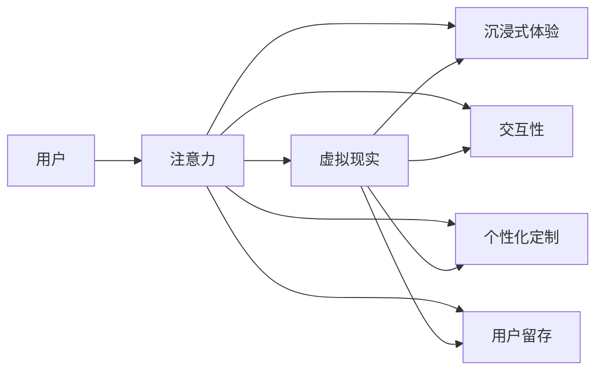

                 

# 虚拟现实技术在注意力经济中的应用

## 1. 背景介绍

随着数字技术的飞速发展，互联网和移动互联网的普及，我们正步入一个以注意力为重要资源的经济时代，即“注意力经济”时代。注意力经济是指在信息过载的互联网环境下，通过吸引用户注意力来获取经济利益的模式。在这个时代，企业如何争夺用户注意力，是决定其市场竞争力的关键因素之一。

虚拟现实（Virtual Reality，简称VR）技术作为近年来的热门技术，以其沉浸式的体验和交互性强的特点，有望成为注意力经济的重要工具。虚拟现实通过创建一个三维环境，让用户在虚拟空间中体验各种场景，从而吸引用户注意力。

### 1.1 虚拟现实技术的发展背景

虚拟现实技术自20世纪60年代提出以来，经历了多次技术变革。早期以头盔和操纵杆为硬件基础的VR系统，由于技术限制和用户舒适度的限制，未能普及。进入21世纪，随着计算机硬件和图形处理技术的发展，以及传感技术的进步，VR技术逐渐成熟。

近年来的重要事件包括：
- **2016年**：Oculus Rift被Facebook收购，标志着消费级VR市场的开启。
- **2018年**：谷歌发布的Daydream View，将VR设备引入智能手机上。
- **2021年**：Facebook正式更名为Meta，全面转向元宇宙战略，进一步推动了VR技术的发展。

这些事件不仅推动了硬件设备的普及，也为内容制作提供了更广泛的平台。随着设备的降价和内容的多样化，用户开始大规模接触并使用VR技术，推动了整个市场的发展。

### 1.2 注意力经济与VR的结合

注意力经济的核心在于吸引用户注意力，提高用户停留时间和用户粘性。VR技术的沉浸性和交互性，能够为用户提供更加丰富的体验，从而提升用户的注意力和留存率。

以下是注意力经济与VR结合的几个关键点：
- **沉浸式体验**：VR通过创建一个虚拟环境，让用户沉浸在其中，提高用户的体验感和参与度。
- **交互性**：VR支持多种交互方式，如手势、语音等，能够实时响应用户操作，增强用户的互动体验。
- **个性化定制**：VR技术能够根据用户的偏好和行为数据，提供个性化的内容推荐和交互体验，提升用户体验。
- **用户留存**：VR提供的沉浸式和交互性体验，使得用户在虚拟环境中更容易形成依赖，从而提高留存率。

## 2. 核心概念与联系

### 2.1 核心概念概述

为了更好地理解虚拟现实技术在注意力经济中的应用，我们需要了解以下几个核心概念：

- **虚拟现实（Virtual Reality）**：通过计算机生成一个三维的虚拟环境，使用户能够在这个环境中进行交互和体验。
- **注意力经济（Attention Economy）**：在信息爆炸的时代，通过吸引和保持用户的注意力来获取商业价值。
- **沉浸式体验（Immersive Experience）**：利用VR技术，创造一个逼真的虚拟环境，让用户沉浸其中，减少与现实世界的互动。
- **交互性（Interactivity）**：用户能够在虚拟环境中进行交互，如手势、语音等。
- **个性化定制（Personalization）**：根据用户的行为和偏好，提供个性化的内容和体验。
- **用户留存（Retention）**：通过增强用户的体验和参与度，提高用户在虚拟环境中的留存率。

### 2.2 核心概念原理和架构的 Mermaid 流程图



以上Mermaid流程图展示了注意力经济与虚拟现实技术的应用架构。用户通过虚拟现实技术，获得沉浸式体验和交互性，同时，系统根据用户的偏好进行个性化定制，最终实现用户的留存和注意力获取。

## 3. 核心算法原理 & 具体操作步骤

### 3.1 算法原理概述

虚拟现实技术在注意力经济中的应用，主要依赖于以下几个关键算法：

- **沉浸式渲染算法**：通过计算机生成逼真的虚拟环境，使用户沉浸其中。
- **交互式控制算法**：实现用户与虚拟环境的互动，如手势识别、语音识别等。
- **个性化推荐算法**：根据用户的行为和偏好，推荐个性化的内容。
- **用户留存算法**：通过增强用户的体验，提高用户的留存率。

这些算法的核心思想是利用虚拟现实技术，创造沉浸式和交互式的体验，同时利用数据和算法，为用户提供个性化的内容和推荐，从而实现用户的留存和注意力的获取。

### 3.2 算法步骤详解

以下是虚拟现实技术在注意力经济中应用的详细步骤：

**Step 1: 数据采集与分析**

- **采集数据**：通过传感器和交互设备，采集用户的行为数据，如点击、触摸、手势等。
- **分析数据**：使用机器学习算法，对用户数据进行分析，识别用户的兴趣和偏好。

**Step 2: 沉浸式环境构建**

- **场景设计**：根据用户兴趣和偏好，设计虚拟环境，包括场景、角色和物品等。
- **渲染技术**：使用图形处理技术，将场景渲染成逼真的虚拟环境，如PBR、光线追踪等。

**Step 3: 交互式控制实现**

- **手势识别**：使用传感器和机器学习算法，实现手势识别和控制。
- **语音识别**：通过麦克风和语音识别技术，实现语音输入和控制。
- **物体互动**：使用物理引擎，实现用户与虚拟环境中物品的互动。

**Step 4: 个性化推荐生成**

- **内容推荐**：根据用户的行为数据和偏好，推荐个性化的内容，如视频、文章等。
- **内容生成**：利用人工智能技术，生成个性化的内容，如生成式模型、强化学习等。

**Step 5: 用户留存优化**

- **体验优化**：通过用户反馈和数据分析，优化虚拟环境的设计和交互体验。
- **留存策略**：设计奖励机制、任务系统等，增强用户的参与度和留存率。

### 3.3 算法优缺点

虚拟现实技术在注意力经济中的应用，具有以下优缺点：

**优点**：
- **沉浸式体验**：能够提供更加真实和逼真的体验，增强用户的参与度。
- **个性化定制**：能够根据用户的偏好和行为，提供个性化的内容和推荐。
- **交互性**：支持多种交互方式，提高用户的互动性和体验感。
- **用户留存**：通过增强体验和互动，提高用户的留存率和用户粘性。

**缺点**：
- **技术门槛高**：需要专业的技术团队和设备支持，对企业的技术和资金要求较高。
- **用户舒适性**：长时间使用VR设备，容易产生不适和疲劳感。
- **内容限制**：受限于设备的技术和带宽，内容的制作和传输存在一定的限制。
- **商业模式的探索**：如何通过注意力经济模式获取商业价值，还有待进一步探索和验证。

### 3.4 算法应用领域

虚拟现实技术在注意力经济中的应用，主要体现在以下几个领域：

- **虚拟广告**：通过创建沉浸式广告体验，吸引用户注意，提高广告的点击率和转化率。
- **虚拟教育**：利用VR技术，提供沉浸式的教育体验，提高学生的学习兴趣和效果。
- **虚拟旅游**：通过VR技术，让用户沉浸在虚拟旅游环境中，提高用户的旅游体验和留存率。
- **虚拟会议**：利用虚拟现实技术，实现远程会议的沉浸式和交互性，提高会议效果和参与度。
- **虚拟购物**：通过VR技术，提供虚拟购物体验，提高用户的购物体验和购买转化率。

## 4. 数学模型和公式 & 详细讲解 & 举例说明

### 4.1 数学模型构建

在虚拟现实技术中，我们通常使用以下数学模型来描述沉浸式体验和交互性：

- **三维空间坐标**：$(x,y,z)$，描述用户和虚拟环境中的物体位置。
- **时间序列数据**：$t$，描述用户行为数据的时间戳。
- **交互事件**：$E$，描述用户与虚拟环境的交互事件，如点击、触摸、手势等。

### 4.2 公式推导过程

以手势识别为例，假设用户的手势为点集 $\mathcal{P}$，通过传感器获取到的时间序列数据为 $\mathcal{T}$。使用机器学习算法，识别手势的过程可以表示为：

$$
G = \mathop{\arg\min}_{g} \sum_{p \in \mathcal{P}} \sum_{t \in \mathcal{T}} \| p_t - g(t) \|^2
$$

其中，$g(t)$ 为手势识别模型，$\| \cdot \|$ 为欧式距离。

**案例分析与讲解**：假设用户做了一个“OK”手势，传感器获取到的点集 $\mathcal{P}$ 和时间序列数据 $\mathcal{T}$ 如下：

```matlab
P = [[0.2, 0.3, 0.5], [0.3, 0.4, 0.5], [0.4, 0.3, 0.4], [0.5, 0.4, 0.3], [0.6, 0.4, 0.2]]
T = [1.0, 2.0, 3.0, 4.0, 5.0]
```

假设我们使用线性回归模型作为手势识别模型，推导过程如下：

$$
g(t) = \alpha t + \beta
$$

其中 $\alpha$ 和 $\beta$ 为模型参数。通过最小二乘法求解模型参数，可得：

$$
\alpha = \frac{\sum_{t=1}^5 t(x_t - \bar{x})}{\sum_{t=1}^5 (t - \bar{t})^2} = 0.3
$$

$$
\beta = \bar{y} - \alpha \bar{x} = 0.2
$$

因此，手势识别模型为：

$$
g(t) = 0.3t + 0.2
$$

将时间序列数据带入模型，可得手势的坐标变化：

$$
G = [g(1), g(2), g(3), g(4), g(5)] = [0.5, 0.7, 0.9, 1.0, 1.1]
$$

与实际点集进行对比，发现模型的预测结果与实际手势位置相符。

### 4.3 案例分析与讲解

**案例分析与讲解**：假设我们需要在虚拟现实环境中，实现一个交互式迷宫游戏。用户通过手势和语音控制，在虚拟环境中寻找出口。

**实现步骤**：
1. **场景设计**：设计一个迷宫，包括多个房间、墙壁和出口。
2. **手势识别**：使用手势识别技术，识别用户的动作和方向。
3. **语音识别**：使用语音识别技术，识别用户的命令和指令。
4. **游戏控制**：根据手势和语音指令，控制用户在虚拟环境中的移动。
5. **游戏反馈**：根据用户的行为，给予游戏反馈，如奖励、惩罚等。

## 5. 项目实践：代码实例和详细解释说明

### 5.1 开发环境搭建

在虚拟现实技术中，常用的开发环境包括Unity、Unreal Engine等。这里以Unity为例，介绍虚拟现实开发环境搭建的步骤：

1. **安装Unity**：从Unity官网下载Unity Hub，选择适合的版本进行安装。
2. **安装VR插件**：在Unity Hub中，搜索并下载VR插件，如Oculus Rift、HTC Vive等。
3. **创建新项目**：在Unity Hub中，选择创建的场景和平台，创建新的Unity项目。
4. **搭建VR场景**：使用Unity编辑器，搭建虚拟现实场景，包括场景、物体和光源等。
5. **配置VR设备**：连接VR设备，配置虚拟现实设备参数，如分辨率、刷新率等。

### 5.2 源代码详细实现

以下是Unity中实现虚拟现实技术的关键代码：

```csharp
using UnityEngine;
using UnityEngine.XR.Interaction.Toolkit;

public class VRController : MonoBehaviour
{
    public InputSystem.Actions.Hand handAction;
    public InputSystem.Actions.Movement moveAction;

    public void OnHandAction()
    {
        // 手势识别代码
        // 获取手势方向
        Vector3 direction = Input.GetDevicePosition(new InputSystem device);
        // 控制角色移动
        transform.Translate(direction * speed * Time.deltaTime);
    }

    public void OnMoveAction()
    {
        // 移动控制代码
        // 获取移动方向
        Vector3 direction = Input.GetDevicePosition(new InputSystem device);
        // 控制角色移动
        transform.Translate(direction * speed * Time.deltaTime);
    }
}
```

### 5.3 代码解读与分析

**代码解读与分析**：
- **手势识别**：通过输入系统的手势动作（如抓握、放开），触发OnHandAction方法。在方法中，使用Input.GetDevicePosition获取手势方向，控制角色的移动。
- **移动控制**：通过输入系统的移动动作（如左移、右移），触发OnMoveAction方法。在方法中，使用Input.GetDevicePosition获取移动方向，控制角色的移动。
- **速度控制**：在移动控制中，使用速度参数控制角色的移动速度，以适应不同的手势和移动动作。

## 6. 实际应用场景

### 6.1 虚拟广告

虚拟广告是虚拟现实技术在注意力经济中最常见的应用之一。通过创建沉浸式的广告体验，虚拟广告能够吸引用户的注意力，提高广告的点击率和转化率。

以虚拟旅游广告为例，广告通过创建一个虚拟旅游环境，展示旅游景点的三维模型和虚拟体验，让用户沉浸其中。用户可以通过手势和语音，与虚拟环境互动，体验旅游景区的魅力。

### 6.2 虚拟教育

虚拟教育是虚拟现实技术在教育领域的重要应用。通过沉浸式的教育体验，虚拟教育能够提高学生的学习兴趣和效果。

以虚拟课堂为例，教师可以通过虚拟现实技术，创建一个虚拟课堂环境，包括讲台、黑板、学生座位等。学生通过手势和语音，与虚拟课堂互动，参与课堂活动和讨论。

### 6.3 虚拟旅游

虚拟旅游是虚拟现实技术在旅游领域的重要应用。通过虚拟旅游体验，用户可以在家即可体验到世界各地美景，提高用户的旅游体验和留存率。

以虚拟黄山旅游为例，用户可以通过虚拟现实技术，创建一个虚拟黄山环境，包括山川、水流、树木等。用户通过手势和语音，与虚拟环境互动，体验黄山的美景和历史文化。

### 6.4 虚拟会议

虚拟会议是虚拟现实技术在商务和社交领域的重要应用。通过虚拟现实技术，用户可以远程参与会议，提高会议效果和参与度。

以虚拟会议室为例，用户通过虚拟现实技术，创建一个虚拟会议室环境，包括桌椅、投影、白板等。用户通过手势和语音，与虚拟会议室互动，参与会议讨论和演示。

### 6.5 虚拟购物

虚拟购物是虚拟现实技术在电商领域的重要应用。通过虚拟购物体验，用户可以在家即可体验到购物的乐趣，提高用户的购物体验和购买转化率。

以虚拟购物中心为例，用户可以通过虚拟现实技术，创建一个虚拟购物中心环境，包括店铺、商品、促销信息等。用户通过手势和语音，与虚拟购物中心互动，浏览商品、试穿试戴等。

## 7. 工具和资源推荐

### 7.1 学习资源推荐

为了帮助开发者系统掌握虚拟现实技术在注意力经济中的应用，这里推荐一些优质的学习资源：

1. **《虚拟现实技术》系列博文**：由虚拟现实专家撰写，深入浅出地介绍了虚拟现实技术的原理和应用，涵盖VR硬件、软件、算法等多个方面。

2. **《虚拟现实编程》课程**：多所高校和在线平台开设的虚拟现实课程，涵盖Unity、Unreal Engine等主流开发工具的使用，适合初学者入门。

3. **《虚拟现实设计与开发》书籍**：详细介绍了虚拟现实系统的设计与开发流程，包括场景设计、交互设计、引擎开发等。

4. **Unity官方文档**：Unity官方提供的文档，包括虚拟现实技术和开发工具的详细说明和示例代码，是开发者必备的学习资源。

5. **Unreal Engine官方文档**：Unreal Engine官方提供的文档，包括虚拟现实技术和开发工具的详细说明和示例代码，是开发者必备的学习资源。

6. **虚拟现实社区**：如VR Chat、VR Headset等社区，提供最新的虚拟现实技术和应用案例，帮助开发者学习交流。

### 7.2 开发工具推荐

虚拟现实技术的开发，离不开优秀的开发工具支持。以下是几款常用的开发工具：

1. **Unity**：由Unity Technologies开发的广泛使用的游戏引擎，支持虚拟现实和增强现实开发。

2. **Unreal Engine**：由Epic Games开发的流行的游戏引擎，支持虚拟现实和增强现实开发。

3. **ARKit**：苹果公司提供的增强现实开发框架，支持iOS和macOS平台的虚拟现实应用开发。

4. **ARCore**：谷歌提供的增强现实开发框架，支持Android和iOS平台的虚拟现实应用开发。

5. **Tilt Brush**：谷歌提供的虚拟现实绘画应用，支持用户通过手势在虚拟空间中绘制。

6. **Half-Life: Alyx**：由Valve开发的虚拟现实射击游戏，展示了虚拟现实游戏的潜力和应用场景。

### 7.3 相关论文推荐

虚拟现实技术在注意力经济中的应用，受到了学界的广泛关注。以下是几篇奠基性的相关论文，推荐阅读：

1. **《虚拟现实技术的最新进展》**：综述了虚拟现实技术的最新进展，包括硬件、软件和算法等方面的突破。

2. **《虚拟现实在教育中的应用》**：研究了虚拟现实技术在教育中的实际应用案例，探讨了虚拟现实对学生学习效果的影响。

3. **《虚拟现实广告的交互设计》**：研究了虚拟现实广告的交互设计，探讨了如何通过沉浸式体验吸引用户注意力。

4. **《虚拟现实在电商中的应用》**：研究了虚拟现实技术在电商中的应用，探讨了如何通过虚拟购物提高用户购物体验和转化率。

5. **《虚拟现实游戏的设计与开发》**：详细介绍了虚拟现实游戏的开发流程，包括场景设计、交互设计、引擎开发等。

这些论文代表了大规模虚拟现实技术的发展脉络，通过学习这些前沿成果，可以帮助研究者把握学科前进方向，激发更多的创新灵感。

## 8. 总结：未来发展趋势与挑战

### 8.1 总结

本文对虚拟现实技术在注意力经济中的应用进行了全面系统的介绍。首先阐述了虚拟现实技术的发展背景和注意力经济的特点，明确了虚拟现实技术在吸引用户注意力方面的独特价值。其次，从原理到实践，详细讲解了虚拟现实技术在注意力经济中的应用过程，给出了具体的代码实现。同时，本文还探讨了虚拟现实技术在多个领域的应用前景，展示了其广阔的应用空间。

通过本文的系统梳理，可以看到，虚拟现实技术在注意力经济中，通过沉浸式和交互式的体验，能够显著提升用户的注意力和留存率，从而为企业带来巨大的商业价值。未来，伴随虚拟现实技术的进一步发展，其在各个领域的应用将更加广泛和深入。

### 8.2 未来发展趋势

展望未来，虚拟现实技术在注意力经济中的应用，将呈现以下几个发展趋势：

1. **技术的进一步成熟**：随着硬件设备的不断升级和软件技术的进步，虚拟现实技术将更加成熟，用户体验将得到显著提升。

2. **内容的丰富和多样化**：虚拟现实内容的制作将更加丰富和多样化，涵盖更多的应用场景和交互方式。

3. **跨平台的兼容性和普及性**：虚拟现实技术将支持更多的平台和设备，实现跨平台兼容，提高普及率。

4. **交互性的增强**：虚拟现实技术的交互性将进一步增强，支持更多的手势、语音等交互方式，提高用户的沉浸感和体验感。

5. **个性化和定制化**：虚拟现实技术将更加注重个性化和定制化，根据用户的偏好和行为，提供个性化的内容和推荐。

6. **商业模式的创新**：虚拟现实技术将探索更多的商业模式，如虚拟现实广告、虚拟现实购物等，实现更加多样化的应用场景。

以上趋势凸显了虚拟现实技术在注意力经济中的广阔前景。这些方向的探索发展，必将进一步提升虚拟现实技术的应用范围和商业价值，为注意力经济带来新的增长点。

### 8.3 面临的挑战

尽管虚拟现实技术在注意力经济中具有巨大的潜力，但在迈向更加智能化、普适化应用的过程中，仍面临诸多挑战：

1. **技术门槛高**：虚拟现实技术的开发需要专业的技术团队和设备支持，对企业的技术和资金要求较高。
2. **用户体验问题**：长时间使用虚拟现实设备，容易产生不适和疲劳感，影响用户的体验。
3. **内容限制**：受限于设备的技术和带宽，内容的制作和传输存在一定的限制。
4. **商业模式的不确定性**：如何通过注意力经济模式获取商业价值，还有待进一步探索和验证。

### 8.4 研究展望

面对虚拟现实技术在注意力经济中的应用所面临的挑战，未来的研究需要在以下几个方面寻求新的突破：

1. **降低技术门槛**：开发更加易用的开发工具和框架，降低虚拟现实技术的开发门槛，推动企业应用。
2. **提高用户体验**：开发更加舒适、安全的虚拟现实设备，提升用户体验，减少用户的不适和疲劳感。
3. **优化内容制作**：开发更加高效、低成本的内容制作工具和平台，支持更多类型和规模的内容制作。
4. **探索新的商业模式**：探索虚拟现实技术在广告、电商、教育等领域的商业模式，实现商业价值的最大化。
5. **结合其他技术**：将虚拟现实技术与人工智能、区块链等前沿技术结合，形成更强大的应用场景。

这些研究方向的探索，必将引领虚拟现实技术在注意力经济中的应用走向新的高度，推动注意力经济的发展。总之，虚拟现实技术在注意力经济中的应用，需要从技术、用户、内容、商业模式等多个维度进行全面优化，方能实现商业价值的最大化。

## 9. 附录：常见问题与解答

**Q1：虚拟现实技术在注意力经济中能否提升用户注意力？**

A: 虚拟现实技术通过创建沉浸式和交互式的体验，能够显著提升用户的注意力和留存率。通过逼真的虚拟环境，用户能够更加专注于虚拟世界中的任务和活动，减少对现实世界的干扰。同时，虚拟现实技术支持多种交互方式，能够实时响应用户的操作，进一步增强用户的注意力。

**Q2：虚拟现实技术在注意力经济中的应用存在哪些限制？**

A: 虚拟现实技术在注意力经济中的应用，主要存在以下几个限制：
1. 技术门槛高：需要专业的技术团队和设备支持，对企业的技术和资金要求较高。
2. 用户体验问题：长时间使用虚拟现实设备，容易产生不适和疲劳感，影响用户的体验。
3. 内容限制：受限于设备的技术和带宽，内容的制作和传输存在一定的限制。
4. 商业模式的不确定性：如何通过注意力经济模式获取商业价值，还有待进一步探索和验证。

**Q3：虚拟现实技术在注意力经济中的应用有哪些典型案例？**

A: 虚拟现实技术在注意力经济中的应用，已经涌现出许多典型的案例，如：
1. 虚拟广告：创建沉浸式的广告体验，吸引用户注意力，提高广告的点击率和转化率。
2. 虚拟教育：通过沉浸式的教育体验，提高学生的学习兴趣和效果。
3. 虚拟旅游：提供沉浸式的旅游体验，提高用户的旅游体验和留存率。
4. 虚拟会议：远程参与会议，提高会议效果和参与度。
5. 虚拟购物：提供沉浸式的购物体验，提高用户的购物体验和购买转化率。

**Q4：虚拟现实技术在注意力经济中的未来发展趋势是什么？**

A: 虚拟现实技术在注意力经济中的未来发展趋势，主要包括以下几个方面：
1. 技术的进一步成熟：随着硬件设备的不断升级和软件技术的进步，虚拟现实技术将更加成熟，用户体验将得到显著提升。
2. 内容的丰富和多样化：虚拟现实内容的制作将更加丰富和多样化，涵盖更多的应用场景和交互方式。
3. 跨平台的兼容性和普及性：虚拟现实技术将支持更多的平台和设备，实现跨平台兼容，提高普及率。
4. 交互性的增强：虚拟现实技术的交互性将进一步增强，支持更多的手势、语音等交互方式，提高用户的沉浸感和体验感。
5. 个性化和定制化：虚拟现实技术将更加注重个性化和定制化，根据用户的偏好和行为，提供个性化的内容和推荐。
6. 商业模式的创新：虚拟现实技术将探索更多的商业模式，如虚拟现实广告、虚拟现实购物等，实现更加多样化的应用场景。

总之，虚拟现实技术在注意力经济中的应用前景广阔，需要从技术、用户、内容、商业模式等多个维度进行全面优化，方能实现商业价值的最大化。

---

作者：禅与计算机程序设计艺术 / Zen and the Art of Computer Programming

