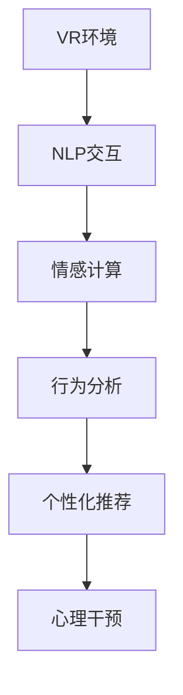

                 

# 虚拟现实治疗新论：AI驱动的心理健康干预

## 1. 背景介绍

### 1.1 问题由来

近年来，全球范围内的心理健康问题日益严重，焦虑、抑郁等精神疾病的患病率不断攀升。传统的心理治疗方法往往依赖于面对面的交互，难以覆盖广大的就医人群。尤其是在疫情背景下，人们面临的压力更大，传统治疗手段受限。与此同时，虚拟现实（Virtual Reality, VR）技术逐渐发展成熟，以其沉浸式、互动性强、不受地理限制等优势，为心理健康干预提供了新的可能性。

通过将虚拟现实技术与人工智能（Artificial Intelligence, AI）相结合，可以构建一个沉浸式、个性化的心理治疗环境，更好地满足不同患者的个性化需求，提升治疗效果。AI驱动的心理健康干预（AI-driven Mental Health Intervention）旨在通过虚拟现实平台，结合个性化推荐、情感计算、行为分析等技术，为患者提供精准、实时的心理治疗服务。

### 1.2 问题核心关键点

AI驱动的心理健康干预涉及多个关键技术点，包括：

- **虚拟现实技术**：构建沉浸式环境，通过视觉、听觉等多感官模拟真实场景，增强用户的沉浸感和互动体验。
- **自然语言处理（NLP）**：通过语音识别、文本生成等技术，实现用户与系统的自然交互，更好地理解用户需求。
- **情感计算**：通过分析用户的面部表情、语音语调等生物特征，实时判断用户的情绪状态，并根据情绪变化调整治疗策略。
- **行为分析**：利用行为追踪和数据分析技术，监控用户的心理状态变化，及时发现潜在风险。
- **个性化推荐**：根据用户的个性、兴趣和历史行为数据，推荐最适合的心理治疗内容和方案。

这些技术的融合，使得AI驱动的心理健康干预具有广泛的应用前景，能够在不同场景下，为患者提供个性化的心理支持和治疗服务。

## 2. 核心概念与联系

### 2.1 核心概念概述

为更好地理解AI驱动的心理健康干预技术，本节将介绍几个关键核心概念及其之间的联系：

- **虚拟现实技术（VR）**：通过计算机生成的模拟环境，让用户沉浸在一个虚拟世界中，进行交互和体验。
- **自然语言处理（NLP）**：使计算机能够理解、解释和生成人类语言，实现人机交互的自然化。
- **情感计算**：通过分析用户的生理和心理状态，实时评估其情绪，并根据情绪变化调整互动策略。
- **行为分析**：监测和分析用户的动作、语言、情绪等行为特征，提供行为指导和干预建议。
- **个性化推荐**：利用用户数据，通过算法推荐最适合的心理健康干预内容和方案。

这些技术共同构成了AI驱动的心理健康干预的基础，通过相互协作，提升治疗效果，实现更为精准、实时的心理支持。

### 2.2 核心概念原理和架构的 Mermaid 流程图



这个流程图展示了AI驱动的心理健康干预技术的基本流程：

1. 用户通过VR环境进行沉浸式互动。
2. NLP技术实现人机自然交互。
3. 情感计算实时评估用户情绪。
4. 行为分析监测用户行为特征。
5. 个性化推荐提供最适合的心理干预方案。
6. 综合所有信息，进行心理干预。

## 3. 核心算法原理 & 具体操作步骤
### 3.1 算法原理概述

AI驱动的心理健康干预技术融合了虚拟现实、自然语言处理、情感计算、行为分析和个性化推荐等多种技术，旨在为患者提供精准、实时的心理支持和治疗服务。其核心算法原理包括以下几个方面：

- **虚拟现实技术**：通过计算机生成的模拟环境，实现沉浸式交互。
- **自然语言处理**：利用NLP技术，实现自然语言理解和生成，使系统能够理解用户的表达。
- **情感计算**：通过分析面部表情、语音语调等生物特征，实时评估用户情绪状态，提供个性化支持。
- **行为分析**：利用行为追踪和数据分析，监控用户心理状态变化，及时发现潜在风险。
- **个性化推荐**：根据用户数据，推荐最适合的心理健康干预内容和方案。

### 3.2 算法步骤详解

AI驱动的心理健康干预的具体操作步骤如下：

**Step 1: 数据准备**

- 收集用户的基本信息、兴趣偏好、历史行为数据等，用于个性化推荐。
- 收集用户的面部表情、语音语调等生物特征数据，用于情感计算和行为分析。
- 准备虚拟现实环境，设计互动场景和任务。

**Step 2: 虚拟现实环境搭建**

- 搭建虚拟现实平台，加载用户数据和虚拟场景。
- 设计互动任务和场景，确保用户能够在虚拟环境中自然交互。
- 实现虚拟环境的渲染和渲染优化，保证流畅的交互体验。

**Step 3: 自然语言处理**

- 实现语音识别和文本生成，确保用户与系统的自然交互。
- 设计意图识别和情感分析模型，实时理解用户的表达。
- 利用NLP技术生成回复，提升用户体验。

**Step 4: 情感计算**

- 实现面部表情和语音语调的实时分析，评估用户情绪状态。
- 设计情绪状态评估模型，分析用户的情绪变化。
- 根据情绪状态调整互动策略，提供个性化支持。

**Step 5: 行为分析**

- 设计行为追踪和数据分析模型，监控用户行为特征。
- 实时评估用户心理状态变化，及时发现潜在风险。
- 提供行为指导和干预建议，帮助用户恢复心理健康。

**Step 6: 个性化推荐**

- 利用用户数据和行为分析结果，设计推荐算法。
- 根据用户的历史行为和当前状态，推荐最适合的心理健康干预内容和方案。
- 实现推荐系统的实时更新和优化，提升推荐效果。

**Step 7: 心理干预**

- 根据推荐内容和用户互动情况，进行心理干预。
- 实时调整干预策略，确保干预效果最大化。
- 持续收集用户反馈，优化干预方案。

### 3.3 算法优缺点

AI驱动的心理健康干预技术具有以下优点：

- **沉浸式体验**：通过虚拟现实技术，提供沉浸式互动环境，增强用户参与感和体验感。
- **自然交互**：利用NLP技术，实现自然语言交互，减少用户的认知负担。
- **实时评估**：通过情感计算和行为分析，实时评估用户情绪和行为状态，提供精准支持。
- **个性化推荐**：根据用户数据，实现个性化推荐，提升干预效果。

同时，该技术也存在以下缺点：

- **数据依赖**：需要大量用户数据和行为数据，才能实现精准推荐和行为分析。
- **技术门槛高**：涉及到虚拟现实、NLP、情感计算等多项技术，技术实现复杂。
- **伦理和安全问题**：需要处理用户隐私和数据安全，避免数据泄露和滥用。

## 4. 数学模型和公式 & 详细讲解
### 4.1 数学模型构建

AI驱动的心理健康干预技术的数学模型主要包括以下几个部分：

- **虚拟现实模型**：模拟用户与虚拟环境互动的过程，可以使用物理学和运动学的数学模型进行描述。
- **自然语言处理模型**：利用深度学习模型，如循环神经网络（RNN）、Transformer等，实现自然语言理解和生成。
- **情感计算模型**：通过面部表情、语音语调等生物特征数据，构建情感状态评估模型。
- **行为分析模型**：利用时间序列分析和机器学习算法，设计行为追踪和数据分析模型。
- **个性化推荐模型**：结合协同过滤和深度学习技术，实现个性化推荐。

### 4.2 公式推导过程

以情感计算模型为例，通过面部表情分析评估用户情绪的公式推导如下：

假设面部表情向量为 $\vec{e}=(e_1, e_2, \ldots, e_n)$，其中 $e_i$ 表示第 $i$ 个面部表情特征的强度。设面部表情特征与情绪状态 $m$ 之间的映射关系为 $\vec{e} = f(m)$，其中 $f$ 为非线性映射函数。

则用户情绪状态 $m$ 的评估公式为：

$$
m = g(\vec{e}) = g(f^{-1}(\vec{e}))
$$

其中 $g$ 为逆映射函数，用于将面部表情强度映射回情绪状态。

### 4.3 案例分析与讲解

假设某用户在虚拟现实环境中与系统互动，系统实时收集其面部表情数据。通过情感计算模型，系统可以实时评估用户的情绪状态，并根据情绪变化调整互动策略。

具体而言，假设系统的情感计算模型已经训练完成，能够将面部表情数据映射为情绪状态。当用户面部表情数据 $\vec{e}=(0.3,0.5,0.2)$ 输入到模型中，模型输出情绪状态 $m$ 为：

$$
m = g(\vec{e}) = g(f^{-1}(0.3,0.5,0.2))
$$

系统根据情绪状态 $m$，调整互动策略，如提供安慰性语言、推荐放松性活动等，帮助用户缓解情绪。

## 5. 项目实践：代码实例和详细解释说明
### 5.1 开发环境搭建

要实现AI驱动的心理健康干预技术，需要搭建多方面的开发环境，包括虚拟现实平台、NLP处理工具、情感计算库、行为分析工具等。

**虚拟现实平台**：可以使用Unity3D或Unreal Engine等游戏引擎，搭建虚拟现实环境。

**NLP处理工具**：可以使用TensorFlow或PyTorch等深度学习框架，实现自然语言处理。

**情感计算库**：可以使用OpenCV等计算机视觉库，实现面部表情分析和语音语调识别。

**行为分析工具**：可以使用Python中的行为追踪库，记录用户行为特征。

**个性化推荐工具**：可以使用Scikit-learn等机器学习库，实现个性化推荐算法。

### 5.2 源代码详细实现

以下是一个简单的情感计算模型的代码实现，以OpenCV库为例，进行面部表情分析：

```python
import cv2
import numpy as np
from dlib import shape_predictor, get_frontal_face_detector

# 加载模型
sp = shape_predictor('shape_predictor_68_face_landmarks.dat')
detector = get_frontal_face_detector()

def face_detector(frame):
    gray = cv2.cvtColor(frame, cv2.COLOR_BGR2GRAY)
    dets = detector(gray, 1)
    for d in dets:
        shape = sp(gray, d)
        return np.array([(x,y) for x,y in shape.parts()])

# 读取视频流
cap = cv2.VideoCapture(0)

while True:
    ret, frame = cap.read()
    if not ret:
        break
    
    # 检测面部
    landmarks = face_detector(frame)
    # 分析面部表情
    # TODO: 加入面部表情分析模型，评估用户情绪状态
    cv2.imshow('frame', frame)
    cv2.waitKey(1)
```

### 5.3 代码解读与分析

**代码解读**：

1. **导入库**：导入OpenCV、dlib等库，用于面部检测和表情分析。
2. **加载模型**：加载人脸检测器和面部特征点预测器。
3. **面部检测**：通过dlib库检测视频帧中的人脸，并提取面部特征点。
4. **表情分析**：将面部特征点作为输入，加入自定义的表情分析模型，评估用户情绪状态。
5. **显示结果**：将处理后的视频帧显示在屏幕上。

**代码分析**：

这段代码实现了简单的面部表情检测和分析，通过dlib库检测视频帧中的人脸，并提取面部特征点。然而，实际的情感计算模型需要更复杂的技术实现，如使用深度学习模型进行面部表情分类，或结合语音分析进行综合情感评估。

## 6. 实际应用场景
### 6.1 虚拟心理治疗

AI驱动的心理健康干预技术最直接的应用场景是虚拟心理治疗。通过虚拟现实平台，构建沉浸式互动环境，实现用户与系统的自然交互。系统通过情感计算和行为分析，实时评估用户情绪状态，提供个性化支持和干预。

具体应用场景包括：

- **焦虑缓解**：通过虚拟现实环境，引导用户进行放松练习，如深呼吸、冥想等。
- **压力管理**：设计互动任务，帮助用户转移注意力，减轻心理压力。
- **情感支持**：通过自然语言处理和情感计算，提供情感支持和心理疏导。

### 6.2 心理康复训练

虚拟现实技术和个性化推荐技术的结合，可以实现高效的心理康复训练。通过虚拟现实环境，设计多种训练任务，帮助用户进行心理康复训练，提升心理韧性。

具体应用场景包括：

- **认知行为疗法**：通过虚拟现实环境，进行认知行为训练，帮助用户建立积极的心理状态。
- **情绪调节训练**：设计互动任务，帮助用户掌握情绪调节技巧，提升情绪管理能力。
- **压力应对训练**：设计模拟场景，进行压力应对训练，提升用户应对压力的能力。

### 6.3 心理测评和监测

AI驱动的心理健康干预技术可以应用于心理测评和监测，通过实时分析用户的行为和情绪状态，及时发现潜在心理问题。

具体应用场景包括：

- **心理测评**：通过虚拟现实环境，进行心理健康测评，评估用户心理状态。
- **行为监测**：实时监测用户行为特征，发现异常行为，及时干预。
- **风险预警**：结合情感计算和行为分析，预警用户心理风险，进行及时干预。

### 6.4 未来应用展望

随着技术的不断进步，AI驱动的心理健康干预技术将在更多场景中得到应用，为人们提供更为精准、实时的心理支持和治疗服务。

未来，可能的应用场景包括：

- **远程心理支持**：通过虚拟现实技术，提供远程心理支持，帮助偏远地区用户获取心理服务。
- **企业心理健康管理**：通过个性化推荐和情感计算，帮助企业员工管理心理压力，提升工作满意度。
- **特殊人群心理健康**：为儿童、老年人等特殊人群提供心理支持和治疗，提升其心理健康水平。
- **虚拟心理治疗师**：构建虚拟心理治疗师，进行全天候心理支持和治疗。

## 7. 工具和资源推荐
### 7.1 学习资源推荐

为了帮助开发者系统掌握AI驱动的心理健康干预技术，这里推荐一些优质的学习资源：

1. **《深度学习与自然语言处理》**：讲解深度学习在NLP中的应用，涵盖情感计算和行为分析等内容。
2. **《人工智能与情感计算》**：介绍情感计算的基本概念和实现方法，包含面部表情分析和语音情感识别等技术。
3. **《虚拟现实与心理学》**：探讨虚拟现实技术在心理学中的应用，涵盖虚拟现实环境搭建和互动设计等内容。
4. **《心理学基础》**：介绍心理学基础知识，帮助开发者理解心理健康干预技术的理论基础。
5. **《机器学习与行为分析》**：讲解机器学习在行为分析中的应用，包含行为追踪和数据分析等内容。

### 7.2 开发工具推荐

要实现AI驱动的心理健康干预技术，需要选择合适的开发工具。以下是几款推荐的工具：

1. **Unity3D**：用于虚拟现实平台搭建，支持跨平台部署。
2. **TensorFlow**：用于自然语言处理和情感计算，支持深度学习模型的实现。
3. **OpenCV**：用于面部表情分析和行为追踪，支持计算机视觉和图像处理。
4. **Python**：用于行为分析、情感计算和个性化推荐，支持机器学习和数据分析。
5. **Jupyter Notebook**：用于实验开发和数据可视化，支持交互式编程和数据探索。

### 7.3 相关论文推荐

AI驱动的心理健康干预技术涉及多个学科领域，以下是几篇奠基性的相关论文，推荐阅读：

1. **《A Survey on Deep Learning-based Emotion Recognition and Facial Expression Recognition》**：综述了深度学习在情感计算和面部表情分析中的应用。
2. **《Virtual Reality for Cognitive Behavioural Therapy: A Systematic Review》**：介绍了虚拟现实在认知行为疗法中的应用，包含虚拟环境设计和互动任务设计等内容。
3. **《Natural Language Processing for Mental Health: An Overview》**：介绍了自然语言处理在心理健康干预中的应用，包含NLP技术在情感分析和个性化推荐中的应用。
4. **《Behavioral Analysis for Mental Health Intervention》**：介绍了行为分析在心理健康干预中的应用，包含行为追踪和数据分析等内容。

## 8. 总结：未来发展趋势与挑战
### 8.1 研究成果总结

AI驱动的心理健康干预技术通过虚拟现实、自然语言处理、情感计算、行为分析和个性化推荐等多种技术的融合，为心理健康干预提供了新的可能性。在虚拟心理治疗、心理康复训练、心理测评和监测等多个应用场景中，该技术已经展现出了显著的效果。

### 8.2 未来发展趋势

展望未来，AI驱动的心理健康干预技术将呈现以下几个发展趋势：

1. **技术融合与创新**：虚拟现实、自然语言处理、情感计算、行为分析和个性化推荐等技术的融合将更加紧密，实现更为精准和实时的心理支持。
2. **智能交互**：通过引入AI技术，提升系统的智能水平，实现更自然的交互体验。
3. **个性化支持**：通过更精细的个性化推荐和情感计算，提供更为个性化的心理支持。
4. **多模态融合**：结合视觉、语音、生物特征等多模态数据，提升心理评估和干预效果。
5. **跨平台应用**：通过云平台和移动端应用，实现心理支持服务的跨平台部署和接入。

### 8.3 面临的挑战

尽管AI驱动的心理健康干预技术已经取得了一定进展，但仍面临诸多挑战：

1. **技术复杂性**：涉及多个学科领域的知识，技术实现复杂。
2. **数据隐私和安全**：需要处理大量的用户数据，数据隐私和安全问题需要重视。
3. **效果评估**：如何评估和验证心理支持效果，需要建立科学的评估体系。
4. **算法透明性**：如何提高算法的透明性和可解释性，确保心理支持过程的可信度。
5. **伦理问题**：如何平衡技术进步和伦理道德，确保心理支持过程符合人类价值观。

### 8.4 研究展望

面对这些挑战，未来的研究需要在以下几个方面寻求新的突破：

1. **多模态融合**：结合多种数据源，提升心理评估和干预效果。
2. **跨学科合作**：加强心理学、医学、计算机科学等学科的合作，推动技术创新。
3. **数据隐私保护**：采用先进的数据加密和隐私保护技术，确保用户数据安全。
4. **算法透明性**：提高算法的透明性和可解释性，增强心理支持的可信度。
5. **伦理规范**：建立伦理规范和标准，确保心理支持过程符合伦理道德。

## 9. 附录：常见问题与解答

### Q1: 如何评估AI驱动的心理健康干预技术的效果？

A: 评估AI驱动的心理健康干预技术的效果，可以从以下几个方面进行：

1. **用户满意度调查**：通过问卷调查或用户反馈，评估用户对心理支持服务的满意度。
2. **心理指标评估**：通过心理测评工具，评估用户的心理健康水平，如焦虑、抑郁等指标的变化。
3. **行为分析**：利用行为追踪和数据分析，评估用户在心理支持过程中的行为变化，如活动时间、互动频率等。
4. **情感评估**：通过面部表情和语音语调分析，评估用户的情绪状态，判断心理支持效果。

### Q2: 虚拟现实平台如何实现沉浸式交互？

A: 实现虚拟现实平台的沉浸式交互，可以从以下几个方面进行：

1. **场景设计**：构建真实感强、互动性高的虚拟场景，模拟真实环境。
2. **多感官模拟**：结合视觉、听觉、触觉等多种感官，提升用户体验。
3. **互动设计**：设计丰富的互动任务和活动，增强用户参与感和体验感。
4. **实时渲染**：优化渲染算法，实现流畅的视觉和交互效果。

### Q3: 个性化推荐算法如何提升干预效果？

A: 个性化推荐算法可以通过以下几个方面提升干预效果：

1. **用户数据建模**：利用用户历史行为数据，建立用户画像，理解用户需求和偏好。
2. **实时数据分析**：实时分析用户当前状态，动态调整干预策略，提供精准支持。
3. **多模态融合**：结合视觉、语音、生物特征等多模态数据，提升推荐效果。
4. **推荐算法优化**：采用先进的推荐算法，如协同过滤、深度学习等，优化推荐效果。

### Q4: 如何保障AI驱动的心理健康干预技术的伦理安全性？

A: 保障AI驱动的心理健康干预技术的伦理安全性，可以从以下几个方面进行：

1. **数据隐私保护**：采用数据加密和隐私保护技术，确保用户数据安全。
2. **透明性和可解释性**：提高算法的透明性和可解释性，增强用户信任。
3. **伦理规范制定**：建立伦理规范和标准，确保心理支持过程符合伦理道德。
4. **用户知情同意**：在心理支持过程中，确保用户知情同意，尊重用户隐私和权益。

---

作者：禅与计算机程序设计艺术 / Zen and the Art of Computer Programming

