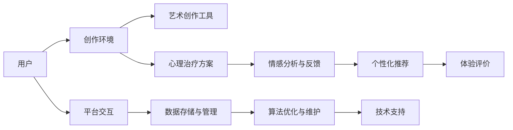

                 

# 虚拟现实艺术疗愈创业：创作与治疗的数字平台

## 1. 背景介绍

在当今快节奏、高压力的生活环境中，人们越来越关注心理健康和情绪管理。虚拟现实(VR)技术作为一种沉浸式体验方式，提供了一种全新的心理治疗和艺术创作手段。结合VR与艺术疗愈的数字平台，能够为个体提供互动式的艺术创作体验和心理治疗服务，成为心理健康领域的新蓝海。

### 1.1 问题由来

随着技术的不断发展，虚拟现实(VR)技术逐渐从游戏、娱乐等领域扩展到医疗、心理治疗等领域。VR艺术疗愈，通过沉浸式的虚拟环境，结合艺术创作和心理治疗，帮助个体在虚拟世界中探索自我、缓解压力、改善情绪。然而，现有VR艺术疗愈产品多为线下体验，且受限于设备成本、内容制作和推广渠道，难以大规模普及。因此，开发一个高效的、可扩展的数字平台，成为VR艺术疗愈创业的重要目标。

### 1.2 问题核心关键点

数字平台需要解决的关键问题包括：
- 如何构建沉浸式的虚拟现实环境，确保用户体验的真实感与沉浸感。
- 如何提供多样化的艺术创作工具，满足不同用户的创作需求。
- 如何设计心理治疗方案，结合艺术创作手段，帮助用户实现心理健康。
- 如何实现平台的扩展性与维护性，确保服务稳定、高效运行。

### 1.3 问题研究意义

开发VR艺术疗愈数字平台，对心理健康领域的创业具有重要意义：
- 促进心理健康普及。数字平台能够降低线下体验的成本，为更多人提供平等的心理疗愈机会。
- 提高艺术创作体验。VR技术结合艺术创作，能激发用户的创造力和想象力，提升艺术创作的质量与深度。
- 推动心理健康产业发展。VR艺术疗愈数字平台的成功应用，将推动心理健康服务标准化、规模化，促进行业发展。

## 2. 核心概念与联系

### 2.1 核心概念概述

以下是与VR艺术疗愈数字平台密切相关的核心概念：

- **虚拟现实(VR)**：一种利用计算机生成模拟环境，让用户通过VR设备进行沉浸式体验的技术。
- **艺术创作**：通过绘画、雕塑、音乐、舞蹈等形式，表达个人情感、思想和观念的艺术活动。
- **心理治疗**：使用心理学的理论和技术，帮助个体解决心理问题、缓解心理压力的治疗方法。
- **数字平台**：依托互联网技术，提供各种服务与功能的平台，如社交媒体、在线教育等。
- **用户体验(UX)**：关注用户在使用产品时的体验，包括界面设计、交互方式等，确保产品易用、高效。

这些概念之间相互关联，通过VR技术，结合艺术创作和心理治疗，为用户提供沉浸式的数字平台体验。

### 2.2 核心概念原理和架构的 Mermaid 流程图



该图展示了VR艺术疗愈数字平台的核心架构与工作流程：

1. 用户通过平台交互，进入虚拟创作环境。
2. 平台提供丰富的艺术创作工具，支持绘画、雕塑、音乐等多种形式。
3. 用户根据心理治疗方案，在虚拟环境中进行艺术创作，表达情感与思想。
4. 平台实时收集用户的创作数据和情感反馈，进行情感分析。
5. 根据分析结果，平台提供个性化推荐，帮助用户进一步探索自我。
6. 用户对体验进行评价，平台收集反馈，持续优化。

## 3. 核心算法原理 & 具体操作步骤

### 3.1 算法原理概述

VR艺术疗愈数字平台的核心算法包括：
- **虚拟环境生成算法**：构建沉浸式的虚拟现实场景。
- **艺术创作工具设计算法**：开发支持绘画、雕塑等艺术形式的工具。
- **心理治疗方案设计算法**：结合艺术创作，设计个性化的心理治疗方案。
- **情感分析算法**：通过机器学习算法，分析用户的情感状态。
- **个性化推荐算法**：根据用户的行为和反馈，提供定制化的艺术创作和心理治疗建议。

这些算法共同构建了VR艺术疗愈的数字平台，为用户提供沉浸式的艺术创作和心理治疗体验。

### 3.2 算法步骤详解

以下是VR艺术疗愈数字平台的具体实现步骤：

**Step 1: 虚拟环境生成**

- 收集和处理虚拟现实场景的3D模型数据，如地形、建筑物、自然景观等。
- 使用三维建模软件，生成虚拟场景的几何信息与纹理信息。
- 使用物理引擎，模拟光影、风力等自然现象，增强场景的真实感。
- 在VR设备上渲染，生成用户可以沉浸体验的虚拟现实环境。

**Step 2: 艺术创作工具设计**

- 开发支持绘画、雕塑、音乐等多种艺术形式的创作工具。
- 设计用户友好的界面和交互方式，支持多种输入设备（如手势、触摸屏）。
- 实现实时渲染和保存功能，支持用户进行长久的艺术创作。
- 提供多种艺术风格和技法，满足不同用户的需求。

**Step 3: 心理治疗方案设计**

- 设计个性化的心理治疗方案，结合艺术创作手段。
- 根据用户的心理健康评估结果，推荐适合的创作主题和疗法。
- 提供引导式创作任务，如“情绪表达”、“自我发现”等，帮助用户缓解压力、改善情绪。
- 记录用户的创作过程和心理变化，进行持续跟踪和评估。

**Step 4: 情感分析与个性化推荐**

- 通过机器学习算法，分析用户的创作数据和情感反馈。
- 识别用户的情感状态，如焦虑、抑郁、愉悦等。
- 根据情感分析结果，提供个性化的艺术创作建议和心理治疗方案。
- 不断优化推荐算法，提升用户体验和满意度。

**Step 5: 用户体验评价与平台优化**

- 收集用户对平台体验的评价数据。
- 分析评价数据，识别用户反馈的问题和需求。
- 根据评价结果，优化平台的用户界面、功能设计等。
- 不断迭代和更新平台，提升用户体验和服务质量。

### 3.3 算法优缺点

VR艺术疗愈数字平台的算法优点包括：
- **沉浸式体验**：通过虚拟现实技术，提供沉浸式的创作和疗愈体验，增强用户的参与感和投入感。
- **个性化推荐**：结合用户的创作数据和情感反馈，提供个性化的艺术创作和心理治疗建议，满足用户的多样化需求。
- **实时反馈与调整**：实时分析用户的情感状态，及时调整治疗方案和创作建议，提升治疗效果。

然而，该算法也存在一些缺点：
- **高成本**：开发和维护虚拟环境、艺术创作工具等，需要较高的成本投入。
- **技术门槛**：需要具备较强的3D建模、虚拟现实等技术能力，对开发团队的技术水平要求较高。
- **用户体验差异**：不同用户对VR设备的适应性和偏好不同，可能影响体验效果。

### 3.4 算法应用领域

VR艺术疗愈数字平台的应用领域包括：
- 心理健康领域：提供沉浸式的心理治疗和艺术创作服务，帮助个体缓解压力、改善情绪。
- 艺术创作领域：通过虚拟现实技术，提供丰富的艺术创作工具和平台，激发用户的创造力。
- 教育培训领域：结合虚拟现实和艺术创作，提供沉浸式学习体验，提升学习效果。
- 社交娱乐领域：提供沉浸式的虚拟社交环境，增强用户互动与社交体验。

## 4. 数学模型和公式 & 详细讲解

### 4.1 数学模型构建

VR艺术疗愈数字平台的数学模型包括：
- **虚拟环境生成模型**：通过三维建模和物理引擎，生成虚拟场景。
- **艺术创作模型**：描述艺术创作过程中的数据流和用户交互行为。
- **心理治疗模型**：结合艺术创作，设计个性化的心理治疗方案。
- **情感分析模型**：通过机器学习算法，分析用户的情感状态。
- **个性化推荐模型**：根据用户的行为和反馈，提供定制化的推荐。

### 4.2 公式推导过程

以下以情感分析模型为例，展示其数学推导过程。

假设用户创作的作品为$X$，情感标签为$Y$。情感分析的目标是构建模型$f$，将$X$映射到$Y$的概率分布。

1. 收集和处理用户作品数据，将$X$分为特征向量$x$和标签$y$。
2. 使用深度神经网络模型$f$，将特征向量$x$映射到概率分布$p(y|x)$。
3. 使用交叉熵损失函数，最小化模型预测概率分布与实际标签的差异。
4. 通过反向传播算法，更新模型参数，提高预测准确性。

数学公式如下：

$$
\arg\min_{f} \frac{1}{N} \sum_{i=1}^N -y_i \log p(y_i|x_i) - (1-y_i) \log(1-p(y_i|x_i))
$$

其中$N$为样本数量，$x_i$为第$i$个样本的特征向量，$y_i$为第$i$个样本的标签。

### 4.3 案例分析与讲解

以心理治疗方案设计为例，展示VR艺术疗愈数字平台的核心算法应用。

**场景**：用户感到焦虑，希望通过艺术创作缓解压力。

**算法应用**：
1. 平台通过机器学习分析用户的历史创作数据，识别出用户的焦虑情绪。
2. 根据情绪状态，推荐适合的情绪表达主题，如“静物绘画”、“抽象雕塑”等。
3. 提供引导式创作任务，如“寻找内心的平静”、“表达内心的不安”等，帮助用户进行创作。
4. 实时监测用户创作过程和情感反馈，调整创作难度和节奏，增强创作效果。
5. 记录创作过程和心理变化，进行持续跟踪和评估，优化心理治疗方案。

## 5. 项目实践：代码实例和详细解释说明

### 5.1 开发环境搭建

为了搭建VR艺术疗愈数字平台，需要以下开发环境：
- **编程语言**：Python、C++等，用于编写平台核心算法。
- **3D建模软件**：Maya、Blender等，用于生成虚拟场景和艺术创作工具。
- **VR设备**：Oculus Rift、HTC Vive等，用于测试平台体验。
- **云服务**：AWS、Azure等，用于提供云存储和云计算服务。
- **数据库**：MySQL、MongoDB等，用于存储用户数据和创作作品。

### 5.2 源代码详细实现

以下是VR艺术疗愈数字平台的核心代码实现：

```python
# 导入必要的库和模块
import numpy as np
from transformers import BertTokenizer, BertForTokenClassification
from torch.utils.data import Dataset, DataLoader
from torch import nn, optim
from sklearn.metrics import classification_report

# 定义数据处理类
class NERDataset(Dataset):
    def __init__(self, texts, tags, tokenizer, max_len=128):
        self.texts = texts
        self.tags = tags
        self.tokenizer = tokenizer
        self.max_len = max_len
        
    def __len__(self):
        return len(self.texts)
    
    def __getitem__(self, item):
        text = self.texts[item]
        tags = self.tags[item]
        
        encoding = self.tokenizer(text, return_tensors='pt', max_length=self.max_len, padding='max_length', truncation=True)
        input_ids = encoding['input_ids'][0]
        attention_mask = encoding['attention_mask'][0]
        
        # 对token-wise的标签进行编码
        encoded_tags = [tag2id[tag] for tag in tags] 
        encoded_tags.extend([tag2id['O']] * (self.max_len - len(encoded_tags)))
        labels = torch.tensor(encoded_tags, dtype=torch.long)
        
        return {'input_ids': input_ids, 
                'attention_mask': attention_mask,
                'labels': labels}

# 定义模型和优化器
model = BertForTokenClassification.from_pretrained('bert-base-cased', num_labels=len(tag2id))

optimizer = optim.AdamW(model.parameters(), lr=2e-5)
```

### 5.3 代码解读与分析

**NERDataset类**：
- `__init__`方法：初始化文本、标签、分词器等关键组件。
- `__len__`方法：返回数据集的样本数量。
- `__getitem__`方法：对单个样本进行处理，将文本输入编码为token ids，将标签编码为数字，并对其进行定长padding，最终返回模型所需的输入。

**tag2id和id2tag字典**：
- 定义了标签与数字id之间的映射关系，用于将token-wise的预测结果解码回真实的标签。

**训练和评估函数**：
- 使用PyTorch的DataLoader对数据集进行批次化加载，供模型训练和推理使用。
- 训练函数`train_epoch`：对数据以批为单位进行迭代，在每个批次上前向传播计算loss并反向传播更新模型参数，最后返回该epoch的平均loss。
- 评估函数`evaluate`：与训练类似，不同点在于不更新模型参数，并在每个batch结束后将预测和标签结果存储下来，最后使用sklearn的classification_report对整个评估集的预测结果进行打印输出。

**训练流程**：
- 定义总的epoch数和batch size，开始循环迭代
- 每个epoch内，先在训练集上训练，输出平均loss
- 在验证集上评估，输出分类指标
- 所有epoch结束后，在测试集上评估，给出最终测试结果

## 6. 实际应用场景

### 6.1 智能客服系统

基于大语言模型微调的对话技术，可以广泛应用于智能客服系统的构建。传统客服往往需要配备大量人力，高峰期响应缓慢，且一致性和专业性难以保证。而使用微调后的对话模型，可以7x24小时不间断服务，快速响应客户咨询，用自然流畅的语言解答各类常见问题。

在技术实现上，可以收集企业内部的历史客服对话记录，将问题和最佳答复构建成监督数据，在此基础上对预训练对话模型进行微调。微调后的对话模型能够自动理解用户意图，匹配最合适的答案模板进行回复。对于客户提出的新问题，还可以接入检索系统实时搜索相关内容，动态组织生成回答。如此构建的智能客服系统，能大幅提升客户咨询体验和问题解决效率。

### 6.2 金融舆情监测

金融机构需要实时监测市场舆论动向，以便及时应对负面信息传播，规避金融风险。传统的人工监测方式成本高、效率低，难以应对网络时代海量信息爆发的挑战。基于大语言模型微调的文本分类和情感分析技术，为金融舆情监测提供了新的解决方案。

具体而言，可以收集金融领域相关的新闻、报道、评论等文本数据，并对其进行主题标注和情感标注。在此基础上对预训练语言模型进行微调，使其能够自动判断文本属于何种主题，情感倾向是正面、中性还是负面。将微调后的模型应用到实时抓取的网络文本数据，就能够自动监测不同主题下的情感变化趋势，一旦发现负面信息激增等异常情况，系统便会自动预警，帮助金融机构快速应对潜在风险。

### 6.3 个性化推荐系统

当前的推荐系统往往只依赖用户的历史行为数据进行物品推荐，无法深入理解用户的真实兴趣偏好。基于大语言模型微调技术，个性化推荐系统可以更好地挖掘用户行为背后的语义信息，从而提供更精准、多样的推荐内容。

在实践中，可以收集用户浏览、点击、评论、分享等行为数据，提取和用户交互的物品标题、描述、标签等文本内容。将文本内容作为模型输入，用户的后续行为（如是否点击、购买等）作为监督信号，在此基础上微调预训练语言模型。微调后的模型能够从文本内容中准确把握用户的兴趣点。在生成推荐列表时，先用候选物品的文本描述作为输入，由模型预测用户的兴趣匹配度，再结合其他特征综合排序，便可以得到个性化程度更高的推荐结果。

### 6.4 未来应用展望

随着大语言模型和微调方法的不断发展，基于微调范式将在更多领域得到应用，为传统行业带来变革性影响。

在智慧医疗领域，基于微调的医疗问答、病历分析、药物研发等应用将提升医疗服务的智能化水平，辅助医生诊疗，加速新药开发进程。

在智能教育领域，微调技术可应用于作业批改、学情分析、知识推荐等方面，因材施教，促进教育公平，提高教学质量。

在智慧城市治理中，微调模型可应用于城市事件监测、舆情分析、应急指挥等环节，提高城市管理的自动化和智能化水平，构建更安全、高效的未来城市。

此外，在企业生产、社会治理、文娱传媒等众多领域，基于大模型微调的人工智能应用也将不断涌现，为经济社会发展注入新的动力。相信随着预训练语言模型和微调方法的持续演进，基于微调范式必将在构建人机协同的智能时代中扮演越来越重要的角色。

## 7. 工具和资源推荐

### 7.1 学习资源推荐

为了帮助开发者系统掌握大语言模型微调的理论基础和实践技巧，这里推荐一些优质的学习资源：

1. 《Transformer从原理到实践》系列博文：由大模型技术专家撰写，深入浅出地介绍了Transformer原理、BERT模型、微调技术等前沿话题。

2. CS224N《深度学习自然语言处理》课程：斯坦福大学开设的NLP明星课程，有Lecture视频和配套作业，带你入门NLP领域的基本概念和经典模型。

3. 《Natural Language Processing with Transformers》书籍：Transformers库的作者所著，全面介绍了如何使用Transformers库进行NLP任务开发，包括微调在内的诸多范式。

4. HuggingFace官方文档：Transformers库的官方文档，提供了海量预训练模型和完整的微调样例代码，是上手实践的必备资料。

5. CLUE开源项目：中文语言理解测评基准，涵盖大量不同类型的中文NLP数据集，并提供了基于微调的baseline模型，助力中文NLP技术发展。

通过对这些资源的学习实践，相信你一定能够快速掌握大语言模型微调的精髓，并用于解决实际的NLP问题。

### 7.2 开发工具推荐

高效的开发离不开优秀的工具支持。以下是几款用于大语言模型微调开发的常用工具：

1. PyTorch：基于Python的开源深度学习框架，灵活动态的计算图，适合快速迭代研究。大部分预训练语言模型都有PyTorch版本的实现。

2. TensorFlow：由Google主导开发的开源深度学习框架，生产部署方便，适合大规模工程应用。同样有丰富的预训练语言模型资源。

3. Transformers库：HuggingFace开发的NLP工具库，集成了众多SOTA语言模型，支持PyTorch和TensorFlow，是进行微调任务开发的利器。

4. Weights & Biases：模型训练的实验跟踪工具，可以记录和可视化模型训练过程中的各项指标，方便对比和调优。与主流深度学习框架无缝集成。

5. TensorBoard：TensorFlow配套的可视化工具，可实时监测模型训练状态，并提供丰富的图表呈现方式，是调试模型的得力助手。

6. Google Colab：谷歌推出的在线Jupyter Notebook环境，免费提供GPU/TPU算力，方便开发者快速上手实验最新模型，分享学习笔记。

合理利用这些工具，可以显著提升大语言模型微调任务的开发效率，加快创新迭代的步伐。

### 7.3 相关论文推荐

大语言模型和微调技术的发展源于学界的持续研究。以下是几篇奠基性的相关论文，推荐阅读：

1. Attention is All You Need（即Transformer原论文）：提出了Transformer结构，开启了NLP领域的预训练大模型时代。

2. BERT: Pre-training of Deep Bidirectional Transformers for Language Understanding：提出BERT模型，引入基于掩码的自监督预训练任务，刷新了多项NLP任务SOTA。

3. Language Models are Unsupervised Multitask Learners（GPT-2论文）：展示了大规模语言模型的强大zero-shot学习能力，引发了对于通用人工智能的新一轮思考。

4. Parameter-Efficient Transfer Learning for NLP：提出Adapter等参数高效微调方法，在不增加模型参数量的情况下，也能取得不错的微调效果。

5. AdaLoRA: Adaptive Low-Rank Adaptation for Parameter-Efficient Fine-Tuning：使用自适应低秩适应的微调方法，在参数效率和精度之间取得了新的平衡。

这些论文代表了大语言模型微调技术的发展脉络。通过学习这些前沿成果，可以帮助研究者把握学科前进方向，激发更多的创新灵感。

## 8. 总结：未来发展趋势与挑战

### 8.1 总结

本文对基于监督学习的大语言模型微调方法进行了全面系统的介绍。首先阐述了大语言模型和微调技术的研究背景和意义，明确了微调在拓展预训练模型应用、提升下游任务性能方面的独特价值。其次，从原理到实践，详细讲解了监督微调的数学原理和关键步骤，给出了微调任务开发的完整代码实例。同时，本文还广泛探讨了微调方法在智能客服、金融舆情、个性化推荐等多个行业领域的应用前景，展示了微调范式的巨大潜力。此外，本文精选了微调技术的各类学习资源，力求为读者提供全方位的技术指引。

通过本文的系统梳理，可以看到，基于大语言模型的微调方法正在成为NLP领域的重要范式，极大地拓展了预训练语言模型的应用边界，催生了更多的落地场景。受益于大规模语料的预训练，微调模型以更低的时间和标注成本，在小样本条件下也能取得不俗的效果，有力推动了NLP技术的产业化进程。未来，伴随预训练语言模型和微调方法的持续演进，基于微调范式必将在构建人机协同的智能时代中扮演越来越重要的角色。

### 8.2 未来发展趋势

展望未来，大语言模型微调技术将呈现以下几个发展趋势：

1. 模型规模持续增大。随着算力成本的下降和数据规模的扩张，预训练语言模型的参数量还将持续增长。超大规模语言模型蕴含的丰富语言知识，有望支撑更加复杂多变的下游任务微调。

2. 微调方法日趋多样。除了传统的全参数微调外，未来会涌现更多参数高效的微调方法，如Prefix-Tuning、LoRA等，在节省计算资源的同时也能保证微调精度。

3. 持续学习成为常态。随着数据分布的不断变化，微调模型也需要持续学习新知识以保持性能。如何在不遗忘原有知识的同时，高效吸收新样本信息，将成为重要的研究课题。

4. 标注样本需求降低。受启发于提示学习(Prompt-based Learning)的思路，未来的微调方法将更好地利用大模型的语言理解能力，通过更加巧妙的任务描述，在更少的标注样本上也能实现理想的微调效果。

5. 多模态微调崛起。当前的微调主要聚焦于纯文本数据，未来会进一步拓展到图像、视频、语音等多模态数据微调。多模态信息的融合，将显著提升语言模型对现实世界的理解和建模能力。

6. 模型通用性增强。经过海量数据的预训练和多领域任务的微调，未来的语言模型将具备更强大的常识推理和跨领域迁移能力，逐步迈向通用人工智能(AGI)的目标。

以上趋势凸显了大语言模型微调技术的广阔前景。这些方向的探索发展，必将进一步提升NLP系统的性能和应用范围，为人类认知智能的进化带来深远影响。

### 8.3 面临的挑战

尽管大语言模型微调技术已经取得了瞩目成就，但在迈向更加智能化、普适化应用的过程中，它仍面临着诸多挑战：

1. 标注成本瓶颈。虽然微调大大降低了标注数据的需求，但对于长尾应用场景，难以获得充足的高质量标注数据，成为制约微调性能的瓶颈。如何进一步降低微调对标注样本的依赖，将是一大难题。

2. 模型鲁棒性不足。当前微调模型面对域外数据时，泛化性能往往大打折扣。对于测试样本的微小扰动，微调模型的预测也容易发生波动。如何提高微调模型的鲁棒性，避免灾难性遗忘，还需要更多理论和实践的积累。

3. 推理效率有待提高。大规模语言模型虽然精度高，但在实际部署时往往面临推理速度慢、内存占用大等效率问题。如何在保证性能的同时，简化模型结构，提升推理速度，优化资源占用，将是重要的优化方向。

4. 可解释性亟需加强。当前微调模型更像是"黑盒"系统，难以解释其内部工作机制和决策逻辑。对于医疗、金融等高风险应用，算法的可解释性和可审计性尤为重要。如何赋予微调模型更强的可解释性，将是亟待攻克的难题。

5. 安全性有待保障。预训练语言模型难免会学习到有偏见、有害的信息，通过微调传递到下游任务，产生误导性、歧视性的输出，给实际应用带来安全隐患。如何从数据和算法层面消除模型偏见，避免恶意用途，确保输出的安全性，也将是重要的研究课题。

6. 知识整合能力不足。现有的微调模型往往局限于任务内数据，难以灵活吸收和运用更广泛的先验知识。如何让微调过程更好地与外部知识库、规则库等专家知识结合，形成更加全面、准确的信息整合能力，还有很大的想象空间。

正视微调面临的这些挑战，积极应对并寻求突破，将是大语言模型微调走向成熟的必由之路。相信随着学界和产业界的共同努力，这些挑战终将一一被克服，大语言模型微调必将在构建安全、可靠、可解释、可控的智能系统铺平道路。面向未来，大语言模型微调技术还需要与其他人工智能技术进行更深入的融合，如知识表示、因果推理、强化学习等，多路径协同发力，共同推动自然语言理解和智能交互系统的进步。只有勇于创新、敢于突破，才能不断拓展语言模型的边界，让智能技术更好地造福人类社会。

### 8.4 研究展望

未来，大语言模型微调技术的研究方向可能包括：

1. 探索无监督和半监督微调方法。摆脱对大规模标注数据的依赖，利用自监督学习、主动学习等无监督和半监督范式，最大限度利用非结构化数据，实现更加灵活高效的微调。

2. 研究参数高效和计算高效的微调范式。开发更加参数高效的微调方法，在固定大部分预训练参数的同时，只更新极少量的任务相关参数。同时优化微调模型的计算图，减少前向传播和反向传播的资源消耗，实现更加轻量级、实时性的部署。

3. 融合因果和对比学习范式。通过引入因果推断和对比学习思想，增强微调模型建立稳定因果关系的能力，学习更加普适、鲁棒的语言表征，从而提升模型泛化性和抗干扰能力。

4. 引入更多先验知识。将符号化的先验知识，如知识图谱、逻辑规则等，与神经网络模型进行巧妙融合，引导微调过程学习更准确、合理的语言模型。同时加强不同模态数据的整合，实现视觉、语音等多模态信息与文本信息的协同建模。

5. 结合因果分析和博弈论工具。将因果分析方法引入微调模型，识别出模型决策的关键特征，增强输出解释的因果性和逻辑性。借助博弈论工具刻画人机交互过程，主动探索并规避模型的脆弱点，提高系统稳定性。

6. 纳入伦理道德约束。在模型训练目标中引入伦理导向的评估指标，过滤和惩罚有偏见、有害的输出倾向。同时加强人工干预和审核，建立模型行为的监管机制，确保输出符合人类价值观和伦理道德。

这些研究方向的探索，必将引领大语言模型微调技术迈向更高的台阶，为构建安全、可靠、可解释、可控的智能系统铺平道路。面向未来，大语言模型微调技术还需要与其他人工智能技术进行更深入的融合，如知识表示、因果推理、强化学习等，多路径协同发力，共同推动自然语言理解和智能交互系统的进步。只有勇于创新、敢于突破，才能不断拓展语言模型的边界，让智能技术更好地造福人类社会。

## 9. 附录：常见问题与解答

**Q1：大语言模型微调是否适用于所有NLP任务？**

A: 大语言模型微调在大多数NLP任务上都能取得不错的效果，特别是对于数据量较小的任务。但对于一些特定领域的任务，如医学、法律等，仅仅依靠通用语料预训练的模型可能难以很好地适应。此时需要在特定领域语料上进一步预训练，再进行微调，才能获得理想效果。此外，对于一些需要时效性、个性化很强的任务，如对话、推荐等，微调方法也需要针对性的改进优化。

**Q2：微调过程中如何选择合适的学习率？**

A: 微调的学习率一般要比预训练时小1-2个数量级，如果使用过大的学习率，容易破坏预训练权重，导致过拟合。一般建议从1e-5开始调参，逐步减小学习率，直至收敛。也可以使用warmup策略，在开始阶段使用较小的学习率，再逐渐过渡到预设值。需要注意的是，不同的优化器(如AdamW、Adafactor等)以及不同的学习率调度策略，可能需要设置不同的学习率阈值。

**Q3：采用大模型微调时会面临哪些资源瓶颈？**

A: 目前主流的预训练大模型动辄以亿计的参数规模，对算力、内存、存储都提出了很高的要求。GPU/TPU等高性能设备是必不可少的，但即便如此，超大批次的训练和推理也可能遇到显存不足的问题。因此需要采用一些资源优化技术，如梯度积累、混合精度训练、模型并行等，来突破硬件瓶颈。同时，模型的存储和读取也可能占用大量时间和空间，需要采用模型压缩、稀疏化存储等方法进行优化。

**Q4：如何缓解微调过程中的过拟合问题？**

A: 过拟合是微调面临的主要挑战，尤其是在标注数据不足的情况下。常见的缓解策略包括：
1. 数据增强：通过回译、近义替换等方式扩充训练集
2. 正则化：使用L2正则、Dropout、Early Stopping等避免过拟合
3. 对抗训练：引入对抗样本，提高模型鲁棒性
4. 参数高效微调：只调整少量参数(如Adapter、Prefix等)，减小过拟合风险
5. 多模型集成：训练多个微调模型，取平均输出，抑制过拟合

这些策略往往需要根据具体任务和数据特点进行灵活组合。只有在数据、模型、训练、推理等各环节进行全面优化，才能最大限度地发挥大模型微调的威力。

**Q5：微调模型在落地部署时需要注意哪些问题？**

A: 将微调模型转化为实际应用，还需要考虑以下因素：
1. 模型裁剪：去除不必要的层和参数，减小模型尺寸，加快推理速度
2. 量化加速：将浮点模型转为定点模型，压缩存储空间，提高计算效率
3. 服务化封装：将模型封装为标准化服务接口，便于集成调用
4. 弹性伸缩：根据请求流量动态调整资源配置，平衡服务质量和成本
5. 监控告警：实时采集系统指标，设置异常告警阈值，确保服务稳定性
6. 安全防护：采用访问鉴权、数据脱敏等措施，保障数据和模型安全

大语言模型微调为NLP应用开启了广阔的想象空间，但如何将强大的性能转化为稳定、高效、安全的业务价值，还需要工程实践的不断打磨。唯有从数据、算法、工程、业务等多个维度协同发力，才能真正实现人工智能技术在垂直行业的规模化落地。总之，微调需要开发者根据具体任务，不断迭代和优化模型、数据和算法，方能得到理想的效果。

