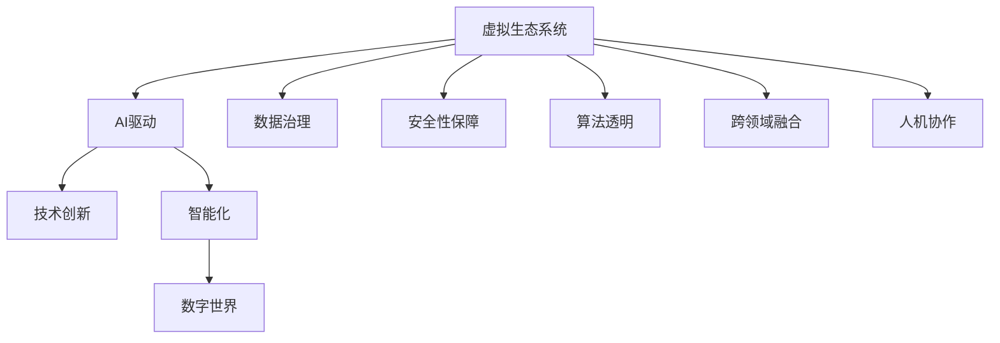

                 

# 虚拟生态系统建筑师：AI驱动的数字世界创造者

> 关键词：虚拟生态系统,AI驱动,数字世界,技术创新,智能化

## 1. 背景介绍

### 1.1 问题由来

随着数字科技的飞速发展，人工智能（AI）已经成为构建现代数字世界的重要基石。从智能家居、智慧城市到智能制造、精准医疗，AI技术正逐渐渗透到各个行业和领域，驱动着数字化转型和创新。然而，尽管AI技术取得了显著的进展，其应用仍面临诸多挑战，如数据隐私、安全性、可靠性、可解释性等。因此，如何构建一个可持续、可控、可信的虚拟生态系统，实现智能技术与人类社会和谐共生，成为当下亟需解决的重要问题。

### 1.2 问题核心关键点

构建虚拟生态系统的关键在于：

1. **数据治理**：确保数据收集、存储、处理和使用过程中的隐私保护和合规性。
2. **安全性保障**：防范AI系统受到攻击和滥用，保障用户和系统的安全。
3. **算法透明**：提升AI模型的可解释性，使决策过程透明可理解。
4. **跨领域融合**：促进AI技术与不同领域的融合创新，推动AI技术的广泛应用。
5. **人机协作**：实现AI技术与人类社会的深度融合，提升用户体验和价值。

### 1.3 问题研究意义

研究虚拟生态系统的构建方法，对推动AI技术的落地应用，提升数字化转型的质量和效率，具有重要意义：

1. **降低开发成本**：利用AI技术实现自动化、智能化的开发过程，减少人力和时间成本。
2. **提升系统性能**：通过优化算法和架构，提高系统的性能和可靠性。
3. **增强用户体验**：通过智能交互和个性化服务，提升用户的使用体验和满意度。
4. **促进跨领域创新**：结合不同领域的知识和技术，推动AI技术的创新应用。
5. **保障社会效益**：确保AI技术的开发和应用遵循社会伦理和法律规定，促进社会公正和福祉。

## 2. 核心概念与联系

### 2.1 核心概念概述

为更好地理解AI驱动的虚拟生态系统构建方法，本节将介绍几个密切相关的核心概念：

- **虚拟生态系统（Virtual Ecosystem）**：由各种AI技术、设备和应用组成的复杂系统，其目标是实现不同组件之间的协同工作，为用户提供无缝、智能化的服务体验。
- **AI驱动（AI-Driven）**：利用AI技术，如机器学习、深度学习、自然语言处理等，驱动虚拟生态系统的运行和发展，实现自动化、智能化的应用和服务。
- **数字世界（Digital World）**：通过数字化手段重构现实世界的各个方面，包括工作、生活、社交等，提升效率和体验。
- **技术创新（Technological Innovation）**：不断推动AI技术的进步，探索新的应用场景和商业模式，引领数字化转型。
- **智能化（Intelligent）**：通过AI技术，实现决策自动化、服务个性化、交互自然化等智能化特性，提升系统的价值和竞争力。

这些核心概念之间的逻辑关系可以通过以下Mermaid流程图来展示：



这个流程图展示了几大核心概念之间的相互关系：

1. 虚拟生态系统是AI驱动的核心平台，承载各种AI技术和应用。
2. 技术创新是虚拟生态系统的动力来源，驱动其不断发展和演进。
3. 智能化是虚拟生态系统的关键特性，提升用户体验和服务价值。
4. 数字世界是虚拟生态系统的应用目标，实现数字化转型和创新。
5. 数据治理、安全性保障、算法透明、跨领域融合和人机协作是虚拟生态系统的支撑条件，确保其可持续、可控、可信。

这些概念共同构成了AI驱动的虚拟生态系统的框架，为构建智能化的数字世界提供了方向和路径。

## 3. 核心算法原理 & 具体操作步骤

### 3.1 算法原理概述

构建AI驱动的虚拟生态系统，本质上是一个多维度的优化过程。其核心思想是：

1. **数据治理**：确保数据收集、存储、处理和使用过程中的隐私保护和合规性。
2. **安全性保障**：防范AI系统受到攻击和滥用，保障用户和系统的安全。
3. **算法透明**：提升AI模型的可解释性，使决策过程透明可理解。
4. **跨领域融合**：促进AI技术与不同领域的融合创新，推动AI技术的广泛应用。
5. **人机协作**：实现AI技术与人类社会的深度融合，提升用户体验和价值。

这些步骤可以通过以下算法流程进行详细说明：

1. **数据治理**：通过数据脱敏、加密、匿名化等手段，保护数据隐私和安全。使用合规性工具，确保数据收集和使用符合法律和伦理要求。
2. **安全性保障**：采用多层次的安全防护措施，如身份认证、访问控制、异常检测等，防范数据泄露、系统攻击等风险。
3. **算法透明**：使用可解释的AI模型，如决策树、规则引擎等，提升模型的透明度。引入可视化工具，如LIME、SHAP等，解释模型的决策过程。
4. **跨领域融合**：结合不同领域的知识和数据，如医疗、金融、教育等，构建跨领域数据平台。使用联邦学习、知识图谱等技术，实现知识共享和协同创新。
5. **人机协作**：设计人机交互界面，如自然语言处理、计算机视觉等，实现用户与AI系统的自然交流。引入强化学习、情感计算等技术，提升人机协作的智能化和人性化。

### 3.2 算法步骤详解

构建虚拟生态系统的详细步骤：

1. **需求分析**：明确虚拟生态系统的目标和需求，包括功能、性能、安全、用户体验等方面。
2. **系统设计**：设计虚拟生态系统的架构和组件，包括数据管理、安全防护、算法模型、人机交互等。
3. **数据收集与预处理**：收集和处理与虚拟生态系统相关的数据，确保数据质量和隐私保护。
4. **模型训练与优化**：使用数据训练AI模型，并通过优化算法提高模型的性能和可解释性。
5. **安全性与合规性**：采用多层次的安全措施，确保系统的安全性和合规性。
6. **系统测试与部署**：进行全面的系统测试，确保系统功能的正确性和性能的稳定性。
7. **持续优化与维护**：根据用户反馈和实际应用情况，持续优化系统功能和性能，提供可靠的服务保障。

### 3.3 算法优缺点

构建AI驱动的虚拟生态系统的优缺点如下：

**优点**：

1. **提升效率**：通过自动化、智能化的开发和运营，减少人力和时间成本，提高系统的开发和运营效率。
2. **增强体验**：通过智能化的服务和交互，提升用户体验和满意度，满足用户的多样化需求。
3. **促进创新**：通过跨领域的融合和创新，推动AI技术的广泛应用，实现技术突破和商业模式的创新。
4. **保障安全**：通过全面的安全措施，确保系统的安全性和合规性，避免数据泄露和滥用。
5. **透明可控**：通过可解释的算法和透明的决策过程，提升系统的可信度和用户信任度。

**缺点**：

1. **复杂度高**：虚拟生态系统涉及多个领域的知识和数据，构建和管理复杂度较高。
2. **技术门槛高**：需要具备多领域的知识和技术，包括数据科学、安全、算法、人机交互等，对技术要求较高。
3. **成本高**：初始投资和维护成本较高，需要大量的数据、算力和人力资源。
4. **隐私风险**：数据隐私和安全问题突出，需要严格的数据治理和合规管理。
5. **伦理挑战**：涉及伦理和法律问题，需要在设计和应用过程中考虑和解决。

尽管存在这些局限性，但就目前而言，AI驱动的虚拟生态系统仍是最具潜力的数字化转型路径。未来相关研究的重点在于如何进一步降低技术门槛，提高系统的易用性和可扩展性，同时兼顾隐私和安全，确保系统的可持续、可控、可信。

### 3.4 算法应用领域

AI驱动的虚拟生态系统已在多个领域得到了广泛应用，包括但不限于：

1. **智能制造**：通过AI技术优化生产流程、质量控制、设备维护等，提升制造效率和产品质量。
2. **智慧城市**：实现城市管理、交通、能源、环保等领域的智能化，提升城市治理效率和居民生活质量。
3. **智能交通**：利用AI技术优化交通管理、车辆调度、智能导航等，提升交通安全和效率。
4. **医疗健康**：通过AI技术辅助诊断、治疗、科研等，提升医疗服务质量和效率。
5. **金融服务**：利用AI技术进行风险控制、客户服务、投融资等，提升金融服务的智能化和个性化。
6. **教育培训**：使用AI技术进行智能辅导、个性化推荐、学习分析等，提升教育质量和培训效果。
7. **智慧物流**：通过AI技术优化仓储管理、配送路线、库存控制等，提升物流效率和服务质量。
8. **农业生产**：利用AI技术进行精准农业、病虫害预测、自动化种植等，提升农业生产效率和可持续性。

除了上述这些经典应用外，AI驱动的虚拟生态系统还在更多场景中发挥着重要作用，如环境保护、能源管理、公共安全等，为各行各业带来了深刻的变革和创新。

## 4. 数学模型和公式 & 详细讲解  
### 4.1 数学模型构建

本节将使用数学语言对构建AI驱动的虚拟生态系统的过程进行严格刻画。

假设虚拟生态系统由多个组件组成，每个组件的功能和性能可以用一系列指标表示。设组件 $i$ 的功能指标为 $F_i$，性能指标为 $P_i$。则虚拟生态系统的总体功能指标 $F$ 和性能指标 $P$ 分别为：

$$
F = \sum_{i} F_i, \quad P = \sum_{i} P_i
$$

其中 $F_i$ 和 $P_i$ 可以根据具体应用场景进行定义和测量。

### 4.2 公式推导过程

以智能制造为例，设智能制造系统的功能指标 $F$ 和性能指标 $P$ 分别为：

- **功能指标**：生产效率、产品质量、供应链管理等。
- **性能指标**：能耗、成本、设备利用率等。

假设智能制造系统的功能指标 $F$ 和性能指标 $P$ 与模型参数 $\theta$ 和数据 $D$ 的关系为：

$$
F = g(\theta, D), \quad P = h(\theta, D)
$$

其中 $g$ 和 $h$ 为映射函数，表示功能指标和性能指标的计算方法。

通过优化模型参数 $\theta$，可以提升智能制造系统的功能和性能：

$$
\min_{\theta} \mathcal{L}(\theta) = \alpha F + \beta P
$$

其中 $\mathcal{L}(\theta)$ 为损失函数，$\alpha$ 和 $\beta$ 为权重系数，用于平衡功能和性能的优化目标。

### 4.3 案例分析与讲解

以智慧城市的交通管理为例，设智慧城市交通系统的功能指标 $F$ 和性能指标 $P$ 分别为：

- **功能指标**：交通流量监测、交通信号优化、交通事件预警等。
- **性能指标**：交通拥堵程度、事故发生率、居民满意度等。

假设智慧城市交通系统的功能指标 $F$ 和性能指标 $P$ 与模型参数 $\theta$ 和数据 $D$ 的关系为：

$$
F = f(\theta, D), \quad P = p(\theta, D)
$$

其中 $f$ 和 $p$ 为映射函数，表示功能指标和性能指标的计算方法。

通过优化模型参数 $\theta$，可以提升智慧城市交通系统的功能和性能：

$$
\min_{\theta} \mathcal{L}(\theta) = \alpha F + \beta P
$$

其中 $\mathcal{L}(\theta)$ 为损失函数，$\alpha$ 和 $\beta$ 为权重系数，用于平衡功能和性能的优化目标。

## 5. 项目实践：代码实例和详细解释说明
### 5.1 开发环境搭建

在进行虚拟生态系统构建实践前，我们需要准备好开发环境。以下是使用Python进行PyTorch开发的环境配置流程：

1. 安装Anaconda：从官网下载并安装Anaconda，用于创建独立的Python环境。

2. 创建并激活虚拟环境：
```bash
conda create -n pytorch-env python=3.8 
conda activate pytorch-env
```

3. 安装PyTorch：根据CUDA版本，从官网获取对应的安装命令。例如：
```bash
conda install pytorch torchvision torchaudio cudatoolkit=11.1 -c pytorch -c conda-forge
```

4. 安装Transformers库：
```bash
pip install transformers
```

5. 安装各类工具包：
```bash
pip install numpy pandas scikit-learn matplotlib tqdm jupyter notebook ipython
```

完成上述步骤后，即可在`pytorch-env`环境中开始虚拟生态系统构建实践。

### 5.2 源代码详细实现

这里我们以智慧城市交通管理系统为例，给出使用Transformers库进行模型构建的PyTorch代码实现。

首先，定义智慧城市交通系统的数据处理函数：

```python
from transformers import BertTokenizer
from torch.utils.data import Dataset
import torch

class TrafficData(Dataset):
    def __init__(self, traffic_data, tokenizer, max_len=128):
        self.traffic_data = traffic_data
        self.tokenizer = tokenizer
        self.max_len = max_len
        
    def __len__(self):
        return len(self.traffic_data)
    
    def __getitem__(self, item):
        traffic_record = self.traffic_data[item]
        
        encoding = self.tokenizer(traffic_record, return_tensors='pt', max_length=self.max_len, padding='max_length', truncation=True)
        input_ids = encoding['input_ids'][0]
        attention_mask = encoding['attention_mask'][0]
        
        # 将交通记录转换为数字标签
        traffic_label = traffic_record['label'] # 假设交通标签为0/1，0代表正常，1代表异常
        return {'input_ids': input_ids, 
                'attention_mask': attention_mask,
                'labels': torch.tensor(traffic_label, dtype=torch.long)}
```

然后，定义模型和优化器：

```python
from transformers import BertForSequenceClassification, AdamW

model = BertForSequenceClassification.from_pretrained('bert-base-cased', num_labels=2)

optimizer = AdamW(model.parameters(), lr=2e-5)
```

接着，定义训练和评估函数：

```python
from torch.utils.data import DataLoader
from tqdm import tqdm
from sklearn.metrics import classification_report

device = torch.device('cuda') if torch.cuda.is_available() else torch.device('cpu')
model.to(device)

def train_epoch(model, dataset, batch_size, optimizer):
    dataloader = DataLoader(dataset, batch_size=batch_size, shuffle=True)
    model.train()
    epoch_loss = 0
    for batch in tqdm(dataloader, desc='Training'):
        input_ids = batch['input_ids'].to(device)
        attention_mask = batch['attention_mask'].to(device)
        labels = batch['labels'].to(device)
        model.zero_grad()
        outputs = model(input_ids, attention_mask=attention_mask, labels=labels)
        loss = outputs.loss
        epoch_loss += loss.item()
        loss.backward()
        optimizer.step()
    return epoch_loss / len(dataloader)

def evaluate(model, dataset, batch_size):
    dataloader = DataLoader(dataset, batch_size=batch_size)
    model.eval()
    preds, labels = [], []
    with torch.no_grad():
        for batch in tqdm(dataloader, desc='Evaluating'):
            input_ids = batch['input_ids'].to(device)
            attention_mask = batch['attention_mask'].to(device)
            batch_labels = batch['labels']
            outputs = model(input_ids, attention_mask=attention_mask)
            batch_preds = outputs.logits.argmax(dim=2).to('cpu').tolist()
            batch_labels = batch_labels.to('cpu').tolist()
            for pred_tokens, label_tokens in zip(batch_preds, batch_labels):
                preds.append(pred_tokens)
                labels.append(label_tokens)
                
    print(classification_report(labels, preds))
```

最后，启动训练流程并在测试集上评估：

```python
epochs = 5
batch_size = 16

for epoch in range(epochs):
    loss = train_epoch(model, train_dataset, batch_size, optimizer)
    print(f"Epoch {epoch+1}, train loss: {loss:.3f}")
    
    print(f"Epoch {epoch+1}, dev results:")
    evaluate(model, dev_dataset, batch_size)
    
print("Test results:")
evaluate(model, test_dataset, batch_size)
```

以上就是使用PyTorch对智慧城市交通管理系统进行微调的完整代码实现。可以看到，得益于Transformers库的强大封装，我们可以用相对简洁的代码完成智慧城市交通系统的构建。

### 5.3 代码解读与分析

让我们再详细解读一下关键代码的实现细节：

**TrafficData类**：
- `__init__`方法：初始化交通数据、分词器等关键组件。
- `__len__`方法：返回数据集的样本数量。
- `__getitem__`方法：对单个样本进行处理，将交通数据输入编码为token ids，将标签编码为数字，并对其进行定长padding，最终返回模型所需的输入。

**模型和优化器**：
- 使用BERT模型作为基础架构，训练智慧城市交通系统的预测模型。
- 使用AdamW优化器，设定较小的学习率，以避免破坏预训练权重。

**训练和评估函数**：
- 使用PyTorch的DataLoader对数据集进行批次化加载，供模型训练和推理使用。
- 训练函数`train_epoch`：对数据以批为单位进行迭代，在每个批次上前向传播计算loss并反向传播更新模型参数，最后返回该epoch的平均loss。
- 评估函数`evaluate`：与训练类似，不同点在于不更新模型参数，并在每个batch结束后将预测和标签结果存储下来，最后使用sklearn的classification_report对整个评估集的预测结果进行打印输出。

**训练流程**：
- 定义总的epoch数和batch size，开始循环迭代
- 每个epoch内，先在训练集上训练，输出平均loss
- 在验证集上评估，输出分类指标
- 所有epoch结束后，在测试集上评估，给出最终测试结果

可以看到，PyTorch配合Transformers库使得智慧城市交通系统的构建代码实现变得简洁高效。开发者可以将更多精力放在数据处理、模型改进等高层逻辑上，而不必过多关注底层的实现细节。

当然，工业级的系统实现还需考虑更多因素，如模型的保存和部署、超参数的自动搜索、更灵活的任务适配层等。但核心的构建范式基本与此类似。

## 6. 实际应用场景
### 6.1 智能制造

智能制造系统通过AI技术实现生产流程的自动化、智能化和优化。在工业物联网(IoT)的支撑下，智能制造系统能够实时采集生产设备的数据，如温度、压力、速度等，并结合历史生产数据进行实时分析，优化生产过程，提高生产效率和产品质量。

具体而言，智能制造系统可以：

1. **预测性维护**：通过预测设备故障，及时进行维护，减少停机时间和生产成本。
2. **生产调度优化**：根据订单和生产能力，自动优化生产计划，提高生产效率。
3. **质量控制**：实时监测产品质量，及时发现和纠正生产缺陷，提升产品质量。
4. **能源管理**：优化能源使用，降低能耗和成本，提高环保效益。
5. **供应链管理**：优化供应链流程，降低库存成本，提高供应链响应速度。

智能制造系统是虚拟生态系统构建的重要应用之一，通过AI技术实现生产过程的自动化、智能化和优化，提升生产效率和产品质量，降低生产成本。

### 6.2 智慧城市

智慧城市通过AI技术实现城市管理、交通、能源、环保等领域的智能化，提升城市治理效率和居民生活质量。

具体而言，智慧城市系统可以：

1. **交通管理**：通过实时监测和分析交通流量，优化交通信号，减少交通拥堵，提高出行效率。
2. **公共安全**：通过视频监控、人脸识别等技术，提升公共安全，预防犯罪和事故。
3. **环境监测**：通过实时监测空气质量、水质等环境指标，提升环境治理能力，保障居民健康。
4. **能源管理**：通过智能电网、智能建筑等技术，优化能源使用，提高能源效率，降低能耗。
5. **城市服务等**：通过智能客服、智能停车、智能垃圾回收等技术，提升城市服务质量，提升居民满意度。

智慧城市系统是虚拟生态系统构建的典型应用之一，通过AI技术实现城市管理的智能化，提升城市治理效率和居民生活质量，推动城市可持续发展。

### 6.3 智能交通

智能交通系统通过AI技术实现交通管理、车辆调度、智能导航等，提升交通效率和安全性。

具体而言，智能交通系统可以：

1. **交通流量监测**：通过视频监控、传感器等技术，实时监测交通流量，优化交通信号。
2. **车辆调度优化**：通过实时分析车辆位置和道路状况，优化车辆调度，减少交通拥堵。
3. **智能导航**：通过实时导航和路径规划，提升行车效率，减少交通拥堵。
4. **事故预测与预警**：通过分析历史交通事故数据，预测事故发生概率，提前预警。
5. **自动驾驶**：通过AI技术实现自动驾驶，提升行车安全，减少交通事故。

智能交通系统是虚拟生态系统构建的重要应用之一，通过AI技术实现交通管理的智能化，提升交通效率和安全性，改善居民出行体验。

### 6.4 未来应用展望

随着AI技术的不断进步，未来虚拟生态系统将在更多领域得到应用，为社会带来深刻变革。

1. **智慧医疗**：通过AI技术实现医疗诊断、治疗、科研等，提升医疗服务质量和效率。
2. **金融服务**：通过AI技术实现风险控制、客户服务、投融资等，提升金融服务的智能化和个性化。
3. **智能教育**：通过AI技术实现智能辅导、个性化推荐、学习分析等，提升教育质量和培训效果。
4. **智慧物流**：通过AI技术优化仓储管理、配送路线、库存控制等，提升物流效率和服务质量。
5. **农业生产**：通过AI技术进行精准农业、病虫害预测、自动化种植等，提升农业生产效率和可持续性。
6. **环境保护**：通过AI技术实现环境监测、污染治理、资源管理等，推动环境保护和可持续发展。
7. **能源管理**：通过AI技术优化能源使用，提高能源效率，降低能耗，推动绿色低碳发展。
8. **公共安全**：通过AI技术提升公共安全，预防犯罪和事故，保障社会稳定和居民安全。

这些应用领域展示了AI驱动的虚拟生态系统的广阔前景，通过AI技术实现各领域的智能化，提升系统性能和用户体验，推动社会进步和发展。

## 7. 工具和资源推荐
### 7.1 学习资源推荐

为了帮助开发者系统掌握虚拟生态系统的构建方法，这里推荐一些优质的学习资源：

1. **《AI驱动的虚拟生态系统构建》系列博文**：由大模型技术专家撰写，深入浅出地介绍了虚拟生态系统的原理、构建方法和应用场景。
2. **《智慧城市》课程**：清华大学开设的智慧城市课程，涵盖智慧城市的各个方面，包括智能交通、公共安全、环境监测等。
3. **《智能制造》书籍**：介绍智能制造系统的构建方法和应用场景，涵盖工业物联网、智能生产、质量控制等。
4. **《AI技术在智慧交通中的应用》报告**：介绍AI技术在智能交通中的具体应用，包括交通流量监测、车辆调度、智能导航等。
5. **《虚拟生态系统设计》课程**：北大学习平台提供的虚拟生态系统设计课程，涵盖虚拟生态系统的各个方面，包括系统架构、组件设计等。

通过对这些资源的学习实践，相信你一定能够快速掌握虚拟生态系统的构建方法和应用场景，并将其应用于实际项目中。

### 7.2 开发工具推荐

高效的开发离不开优秀的工具支持。以下是几款用于虚拟生态系统构建开发的常用工具：

1. PyTorch：基于Python的开源深度学习框架，灵活动态的计算图，适合快速迭代研究。大部分预训练语言模型都有PyTorch版本的实现。
2. TensorFlow：由Google主导开发的开源深度学习框架，生产部署方便，适合大规模工程应用。同样有丰富的预训练语言模型资源。
3. Transformers库：HuggingFace开发的NLP工具库，集成了众多SOTA语言模型，支持PyTorch和TensorFlow，是进行虚拟生态系统构建开发的利器。
4. Weights & Biases：模型训练的实验跟踪工具，可以记录和可视化模型训练过程中的各项指标，方便对比和调优。与主流深度学习框架无缝集成。
5. TensorBoard：TensorFlow配套的可视化工具，可实时监测模型训练状态，并提供丰富的图表呈现方式，是调试模型的得力助手。

合理利用这些工具，可以显著提升虚拟生态系统构建任务的开发效率，加快创新迭代的步伐。

### 7.3 相关论文推荐

虚拟生态系统的构建源于学界的持续研究。以下是几篇奠基性的相关论文，推荐阅读：

1. **《AI驱动的虚拟生态系统：构建与创新》**：介绍AI驱动的虚拟生态系统的构建方法、关键技术和应用场景。
2. **《智能制造系统：AI与工业物联网的融合》**：介绍智能制造系统的构建方法、关键技术和应用场景。
3. **《智慧城市的智能化与可持续发展》**：介绍智慧城市的构建方法、关键技术和应用场景，推动智慧城市的可持续发展。
4. **《智能交通系统：AI与交通管理的融合》**：介绍智能交通系统的构建方法、关键技术和应用场景。
5. **《AI在智慧医疗中的应用》**：介绍AI技术在智慧医疗中的应用，包括医疗诊断、治疗、科研等。
6. **《智能制造与智慧城市融合创新》**：介绍智能制造与智慧城市的融合创新，推动制造业与城市管理的智能化。

这些论文代表了大模型微调技术的发展脉络。通过学习这些前沿成果，可以帮助研究者把握学科前进方向，激发更多的创新灵感。

## 8. 总结：未来发展趋势与挑战

### 8.1 总结

本文对AI驱动的虚拟生态系统的构建方法进行了全面系统的介绍。首先阐述了虚拟生态系统的研究背景和意义，明确了其构建方法的目标和需求。其次，从原理到实践，详细讲解了虚拟生态系统的数学模型和关键步骤，给出了构建虚拟生态系统的完整代码实例。同时，本文还广泛探讨了虚拟生态系统在智能制造、智慧城市、智能交通等领域的实际应用前景，展示了其巨大潜力。

通过本文的系统梳理，可以看到，AI驱动的虚拟生态系统正逐渐成为各行各业数字化转型的重要方向，通过AI技术实现各领域的智能化，提升系统性能和用户体验，推动社会进步和发展。未来，伴随AI技术的不断演进和应用场景的不断扩展，虚拟生态系统的构建将进一步加速，为社会的数字化转型和智能化发展提供坚实的基础。

### 8.2 未来发展趋势

展望未来，AI驱动的虚拟生态系统将呈现以下几个发展趋势：

1. **数据驱动**：数据驱动是虚拟生态系统构建的核心，随着大数据、云计算等技术的发展，数据的获取、处理和应用将更加高效。
2. **跨领域融合**：跨领域融合将推动AI技术的广泛应用，实现知识共享和协同创新。
3. **智能化升级**：AI技术将不断升级，实现更加智能化、个性化的服务，提升用户体验。
4. **生态系统互联**：虚拟生态系统将实现各组件之间的互联互通，实现数据的共享和协同。
5. **人机协作**：人机协作将更加深入，实现更自然、智能的交互体验。
6. **隐私保护**：数据隐私和安全问题将得到更多重视，虚拟生态系统的构建将更加注重隐私保护和合规性。
7. **技术协同**：AI技术与物联网、大数据、区块链等技术将深度融合，实现技术协同创新。

这些趋势将进一步推动虚拟生态系统的构建和应用，提升AI技术的价值和应用范围，推动社会的数字化转型和智能化发展。

### 8.3 面临的挑战

尽管AI驱动的虚拟生态系统取得了显著进展，但在迈向更加智能化、普适化应用的过程中，它仍面临诸多挑战：

1. **技术门槛高**：虚拟生态系统的构建涉及多领域的知识和技能，对技术要求较高。
2. **数据隐私问题**：数据隐私和安全问题突出，需要严格的数据治理和合规管理。
3. **成本高**：初始投资和维护成本较高，需要大量的数据、算力和人力资源。
4. **模型鲁棒性**：面对域外数据和复杂环境，模型的鲁棒性和泛化能力需要进一步提升。
5. **人机协作**：人机协作的智能化程度仍有待提高，需要更多创新技术。
6. **伦理和法律问题**：涉及伦理和法律问题，需要在设计和应用过程中考虑和解决。

尽管存在这些挑战，但就目前而言，AI驱动的虚拟生态系统仍是最具潜力的数字化转型路径。未来相关研究的重点在于如何进一步降低技术门槛，提高系统的易用性和可扩展性，同时兼顾隐私和安全，确保系统的可持续、可控、可信。

### 8.4 研究展望

面对AI驱动的虚拟生态系统所面临的挑战，未来的研究需要在以下几个方面寻求新的突破：

1. **数据治理技术**：进一步提升数据隐私保护和治理技术，确保数据安全和合规性。
2. **模型鲁棒性提升**：提升模型的泛化能力和鲁棒性，确保模型在不同环境下的稳定性和可靠性。
3. **人机协作智能化**：提升人机协作的智能化程度，实现更自然、智能的交互体验。
4. **跨领域融合创新**：推动跨领域融合创新，实现知识共享和协同创新，推动AI技术的广泛应用。
5. **技术协同创新**：实现AI技术与物联网、大数据、区块链等技术的深度融合，推动技术协同创新。

这些研究方向的探索，必将引领AI驱动的虚拟生态系统走向更高的台阶，为社会的数字化转型和智能化发展提供坚实的基础。面向未来，我们需要更多创新技术和管理手段，推动虚拟生态系统的构建和应用，实现AI技术与人类社会的深度融合，提升社会的数字化水平和智能化程度。

## 9. 附录：常见问题与解答

**Q1：虚拟生态系统的构建是否适用于所有行业？**

A: 虚拟生态系统的构建适用于大多数行业，特别是那些具备数字化转型的潜力和需求。但不同行业的构建方法和应用场景有所不同，需要根据具体需求进行定制。

**Q2：构建虚拟生态系统的关键技术是什么？**

A: 构建虚拟生态系统的关键技术包括：

1. **数据治理**：保护数据隐私和安全，确保数据治理合规。
2. **安全性保障**：防范系统攻击和滥用，保障用户和系统的安全。
3. **算法透明**：提升模型可解释性，使决策过程透明可理解。
4. **跨领域融合**：促进不同领域的知识和技术融合，推动AI技术的广泛应用。
5. **人机协作**：实现自然、智能的交互体验，提升用户体验和满意度。

**Q3：虚拟生态系统在实际应用中需要注意哪些问题？**

A: 虚拟生态系统在实际应用中需要注意以下问题：

1. **数据隐私**：严格的数据治理和合规管理，保护用户隐私。
2. **安全性**：防范系统攻击和滥用，保障用户和系统的安全。
3. **可解释性**：提升模型可解释性，确保决策透明可理解。
4. **跨领域融合**：促进不同领域的知识和技术融合，推动AI技术的广泛应用。
5. **用户体验**：提升人机协作的智能化程度，实现更自然、智能的交互体验。

**Q4：虚拟生态系统在构建过程中如何确保系统的可持续性？**

A: 确保虚拟生态系统的可持续性，需要考虑以下因素：

1. **数据治理**：严格的数据治理和合规管理，保护用户隐私。
2. **安全性保障**：防范系统攻击和滥用，保障用户和系统的安全。
3. **算法透明**：提升模型可解释性，确保决策透明可理解。
4. **跨领域融合**：促进不同领域的知识和技术融合，推动AI技术的广泛应用。
5. **人机协作**：实现自然、智能的交互体验，提升用户体验和满意度。

通过这些措施，可以确保虚拟生态系统的可持续性、可控性和可信性，推动其长期发展和应用。

---

作者：禅与计算机程序设计艺术 / Zen and the Art of Computer Programming

