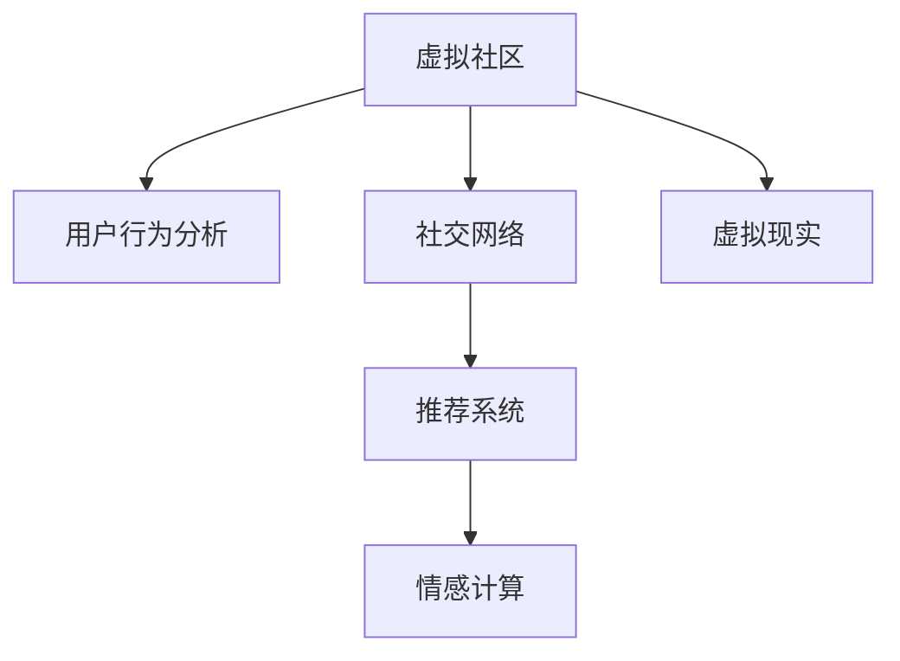

                 

# 虚拟社区：AI驱动的群体归属感

> 关键词：人工智能,社区构建,群体归属感,社交网络,用户行为分析,推荐系统,情感计算,虚拟现实,AI伦理

## 1. 背景介绍

### 1.1 问题由来
随着互联网的普及和数字化进程的加速，虚拟社区作为一种全新的社交形式，正在深刻改变着人类的交往方式。虚拟社区以其便捷、多样、自由的特点，吸引了大批用户参与。然而，如何构建一个真正具有吸引力和归属感的虚拟社区，成为了当下社交平台亟待解决的重要问题。

人工智能技术的发展为这一问题提供了新的解决思路。AI驱动的智能社区管理系统，通过分析用户行为和社交特征，能够更准确地理解用户需求，从而提供个性化的服务，提升用户满意度和社区粘性。AI的加入，不仅提高了社区运营的效率，更增强了群体的归属感和凝聚力。

### 1.2 问题核心关键点
构建AI驱动的虚拟社区，涉及多个关键环节，包括但不限于：

1. 用户行为分析：通过分析用户在线行为数据，挖掘用户的兴趣和偏好，为其提供个性化的内容和推荐。
2. 社交特征建模：对用户之间的关系和互动进行建模，建立社区的社交结构，提升用户间的互动和合作。
3. 推荐系统设计：根据用户行为和社交特征，设计高效且公平的推荐系统，促进内容的发现和分享。
4. 情感计算应用：通过分析用户情感表达和社交互动，增强社区的情感联系和用户间的共鸣。
5. 虚拟现实整合：利用虚拟现实技术，为社区用户提供沉浸式体验，增加社区的吸引力。

这些关键环节的协同优化，是构建一个成功的AI驱动虚拟社区的基础。

### 1.3 问题研究意义
构建AI驱动的虚拟社区，不仅能够提升用户体验和社区价值，还具有以下几个重要意义：

1. 提升用户粘性：通过精准的内容推荐和个性化服务，提高用户参与度和活跃度，增强用户的归属感和忠诚度。
2. 优化社区运营：AI能够自动处理大量社区数据，减轻人工运营的负担，提升社区管理的效率和质量。
3. 促进跨界合作：AI驱动的社区能够更准确地识别和匹配用户兴趣，促进跨界用户间的交流与合作，推动社区的创新与发展。
4. 强化社会连接：虚拟社区作为一种新型社交方式，有助于打破地域和时间的限制，增强社会连结，促进社会融合。
5. 推动技术进步：构建AI驱动的虚拟社区，将推动人工智能技术在社交领域的应用，促进相关技术的不断进步和完善。

## 2. 核心概念与联系

### 2.1 核心概念概述

为更好地理解AI驱动的虚拟社区构建方法，本节将介绍几个密切相关的核心概念：

- **虚拟社区**：基于互联网的数字空间，用户通过网络平台进行互动和交流，建立虚拟关系网，形成一个虚拟的社交群体。
- **人工智能(AI)**：利用算法和计算技术，使机器具备智能能力，能够自主完成复杂任务的技术。
- **用户行为分析**：通过数据收集和处理，分析用户在线行为模式，提取有价值的信息。
- **社交网络**：由用户及其关系构成的网络，研究用户间的互动和影响。
- **推荐系统**：根据用户行为和兴趣，推荐相关内容或对象的系统。
- **情感计算**：通过算法分析用户情感表达和社交互动，识别和理解用户情感状态的技术。
- **虚拟现实(VR)**：通过计算机生成虚拟场景和交互体验，提供沉浸式交互方式。

这些概念之间的逻辑关系可以通过以下Mermaid流程图来展示：



这个流程图展示了大语言模型的工作原理和优化方向。

## 3. 核心算法原理 & 具体操作步骤
### 3.1 算法原理概述

AI驱动的虚拟社区构建，主要依赖于用户行为分析、社交网络建模、推荐系统设计和情感计算等技术手段。这些技术相互结合，能够形成强大的社区运营支持系统，提升用户满意度和社区价值。

具体来说，AI驱动的社区构建包括以下几个关键环节：

1. **用户行为分析**：通过数据收集和机器学习算法，分析用户的行为模式，提取用户兴趣和偏好。
2. **社交网络建模**：利用图算法和深度学习模型，分析用户之间的关系和互动，建立社区的社交结构。
3. **推荐系统设计**：根据用户行为和社交特征，设计高效的推荐算法，推荐相关内容或对象。
4. **情感计算应用**：通过情感分析算法，识别和理解用户情感状态，增强社区的情感联系和用户间的共鸣。
5. **虚拟现实整合**：利用虚拟现实技术，提供沉浸式交互体验，增加社区的吸引力。

### 3.2 算法步骤详解

AI驱动的虚拟社区构建，一般包括以下几个关键步骤：

**Step 1: 数据收集与处理**
- 收集用户在线行为数据，包括浏览记录、互动信息、发布内容等。
- 使用数据清洗和处理技术，去除噪声和异常值，确保数据的质量和一致性。

**Step 2: 用户行为分析**
- 使用机器学习算法，如协同过滤、内容推荐、聚类等，分析用户行为模式。
- 提取用户的兴趣和偏好，生成用户画像，用于个性化内容的推荐。

**Step 3: 社交网络建模**
- 构建用户关系的图模型，分析用户间的互动和影响。
- 使用图算法，如PageRank、GAT、GCN等，计算用户的重要性权重。

**Step 4: 推荐系统设计**
- 根据用户画像和社交网络特征，设计推荐算法，如基于内容的推荐、协同过滤、基于矩阵分解的推荐等。
- 优化推荐算法，确保推荐结果的公平性和多样性。

**Step 5: 情感计算应用**
- 分析用户情感表达和社交互动，使用情感分析算法，识别用户情感状态。
- 将情感分析结果应用于内容推荐和社交互动中，增强情感联系和用户共鸣。

**Step 6: 虚拟现实整合**
- 利用虚拟现实技术，构建虚拟场景和交互体验，提供沉浸式服务。
- 将虚拟现实技术与社区活动结合，增加社区的吸引力和参与度。

**Step 7: 系统部署与优化**
- 将算法模型部署到社区平台，提供个性化服务和推荐。
- 定期收集用户反馈，优化算法模型和用户体验。

### 3.3 算法优缺点

AI驱动的虚拟社区构建方法，具有以下优点：

1. **高效性**：利用机器学习和深度学习算法，能够快速处理和分析大量数据，提升运营效率。
2. **个性化**：通过用户行为分析和社交网络建模，能够提供个性化的内容和推荐，提升用户满意度和粘性。
3. **动态性**：能够实时监测和分析用户行为和互动，动态调整社区策略和内容。
4. **情感智能**：利用情感计算技术，增强社区的情感联系和用户间的共鸣，提升社区凝聚力。
5. **沉浸式体验**：通过虚拟现实技术，提供沉浸式交互体验，增加社区的吸引力和参与度。

同时，该方法也存在以下局限性：

1. **数据依赖**：需要大量高质量的数据作为支持，数据收集和处理成本较高。
2. **隐私风险**：用户行为数据的收集和使用，可能涉及隐私问题，需要采取有效的保护措施。
3. **算法复杂性**：涉及多种算法和技术的结合，算法实现和调参复杂。
4. **技术门槛**：需要具备较强的技术能力和团队，开发和维护成本较高。
5. **公平性问题**：推荐算法可能存在算法偏见，导致部分用户被边缘化。

尽管存在这些局限性，但AI驱动的虚拟社区构建方法仍具有巨大的应用潜力和价值，值得深入研究和实践。

### 3.4 算法应用领域

AI驱动的虚拟社区构建方法，已经在诸多领域得到了广泛的应用，具体包括：

- **社交媒体平台**：如微博、微信、抖音等，利用AI技术提升用户粘性和互动质量。
- **在线教育平台**：如Coursera、Udacity等，通过个性化推荐和情感分析，提升学习体验和效果。
- **电子商务平台**：如淘宝、京东等，利用推荐系统提高商品发现率和用户满意度。
- **健康医疗平台**：如患者社区、健康论坛等，通过情感计算和互动分析，提供心理支持和健康建议。
- **游戏社区**：如王者荣耀、英雄联盟等，利用AI技术提升游戏体验和社交互动。

随着AI技术的不断进步和社区需求的不断变化，AI驱动的虚拟社区构建方法将在更多领域得到应用，为社会发展和人类交往方式带来新的变革。

## 4. 数学模型和公式 & 详细讲解 & 举例说明

### 4.1 数学模型构建

在AI驱动的虚拟社区构建中，涉及多个数学模型的构建，以下是其中几个关键模型的详细描述：

#### 4.1.1 用户行为分析模型
用户行为分析模型通过分析用户的在线行为数据，提取用户的兴趣和偏好。一般使用协同过滤、内容推荐等算法，将用户行为数据转化为向量表示，进行相似性计算。

假设用户行为数据为 $\mathbf{I} \in \mathbb{R}^{U \times N}$，其中 $U$ 为用户数，$N$ 为物品数。用户行为矩阵 $\mathbf{I}$ 中，每个元素 $I_{u,i}$ 表示用户 $u$ 对物品 $i$ 的评分。用户行为分析模型可表示为：

$$
\mathbf{I} = \mathbf{W}_u \mathbf{u} + \mathbf{W}_i \mathbf{i} + \mathbf{W}_{ui}
$$

其中 $\mathbf{W}_u$, $\mathbf{W}_i$ 和 $\mathbf{W}_{ui}$ 分别为用户特征、物品特征和用户-物品交互特征的权重矩阵。

#### 4.1.2 社交网络建模模型
社交网络建模模型通过构建用户关系的图模型，分析用户间的互动和影响。一般使用图算法，如PageRank、GAT、GCN等，计算用户的重要性权重。

假设用户关系图为 $\mathbf{G} = (\mathbf{A}, \mathbf{E})$，其中 $\mathbf{A}$ 为邻接矩阵，$\mathbf{E}$ 为边权重矩阵。社交网络建模模型可表示为：

$$
\mathbf{A} = \mathbf{H}_u \mathbf{u}_u^T + \mathbf{H}_i \mathbf{i}_i^T + \mathbf{H}_{ui}
$$

其中 $\mathbf{H}_u$, $\mathbf{H}_i$ 和 $\mathbf{H}_{ui}$ 分别为用户特征、物品特征和用户-物品交互特征的权重矩阵。

#### 4.1.3 推荐系统模型
推荐系统模型通过用户行为和社交网络特征，设计高效的推荐算法。一般使用基于内容的推荐、协同过滤、基于矩阵分解的推荐等算法。

假设推荐系统模型为 $\mathbf{R} = \mathbf{U} \mathbf{V}^T + \mathbf{B}$，其中 $\mathbf{U}$ 为用户特征矩阵，$\mathbf{V}$ 为物品特征矩阵，$\mathbf{B}$ 为常数矩阵。推荐系统模型的计算公式为：

$$
\mathbf{R} = \min_{\mathbf{U}, \mathbf{V}} \| \mathbf{R} - \mathbf{I} \|_F^2
$$

其中 $\| \cdot \|_F$ 为Frobenius范数。

### 4.2 公式推导过程

以下我们以推荐系统模型为例，推导其计算公式。

假设用户行为数据为 $\mathbf{I} \in \mathbb{R}^{U \times N}$，其中 $U$ 为用户数，$N$ 为物品数。用户行为矩阵 $\mathbf{I}$ 中，每个元素 $I_{u,i}$ 表示用户 $u$ 对物品 $i$ 的评分。推荐系统模型为 $\mathbf{R} = \mathbf{U} \mathbf{V}^T + \mathbf{B}$。

根据最小二乘法，推荐系统模型的损失函数为：

$$
\mathcal{L} = \frac{1}{2} \| \mathbf{I} - \mathbf{R} \|_F^2
$$

求导并令导数为0，得到用户和物品特征矩阵的优化目标：

$$
\min_{\mathbf{U}, \mathbf{V}} \frac{1}{2} \| \mathbf{I} - \mathbf{U} \mathbf{V}^T - \mathbf{B} \|_F^2
$$

通过求解上述优化问题，可以得到用户和物品特征矩阵 $\mathbf{U}$ 和 $\mathbf{V}$，从而计算推荐结果 $\mathbf{R}$。

### 4.3 案例分析与讲解

假设某社交媒体平台，希望利用AI技术提升用户粘性和互动质量。平台收集到用户的浏览记录、互动信息、发布内容等数据，共计 10 万用户和 5 万物品。

通过用户行为分析模型，将用户行为数据转化为向量表示，得到用户特征矩阵 $\mathbf{U} \in \mathbb{R}^{10,000 \times 5}$ 和物品特征矩阵 $\mathbf{V} \in \mathbb{R}^{5,000 \times 5}$。

通过社交网络建模模型，分析用户之间的关系和互动，得到邻接矩阵 $\mathbf{A} \in \mathbb{R}^{10,000 \times 10,000}$ 和边权重矩阵 $\mathbf{E} \in \mathbb{R}^{10,000 \times 10,000}$。

通过推荐系统模型，设计高效的推荐算法，得到推荐结果矩阵 $\mathbf{R} \in \mathbb{R}^{10,000 \times 5,000}$。

通过情感计算应用，分析用户情感表达和社交互动，识别用户情感状态，增强社区的情感联系和用户间的共鸣。通过虚拟现实整合，利用虚拟现实技术，提供沉浸式交互体验，增加社区的吸引力和参与度。

## 5. 项目实践：代码实例和详细解释说明
### 5.1 开发环境搭建

在进行AI驱动的虚拟社区构建实践前，我们需要准备好开发环境。以下是使用Python进行PyTorch和TensorFlow开发的环境配置流程：

1. 安装Anaconda：从官网下载并安装Anaconda，用于创建独立的Python环境。

2. 创建并激活虚拟环境：
```bash
conda create -n pytorch-env python=3.8 
conda activate pytorch-env
```

3. 安装PyTorch：根据CUDA版本，从官网获取对应的安装命令。例如：
```bash
conda install pytorch torchvision torchaudio cudatoolkit=11.1 -c pytorch -c conda-forge
```

4. 安装TensorFlow：
```bash
pip install tensorflow
```

5. 安装各类工具包：
```bash
pip install numpy pandas scikit-learn matplotlib tqdm jupyter notebook ipython
```

完成上述步骤后，即可在`pytorch-env`环境中开始AI驱动的虚拟社区构建实践。

### 5.2 源代码详细实现

这里我们以推荐系统设计为例，给出使用PyTorch和TensorFlow进行虚拟社区构建的代码实现。

首先，定义推荐系统模型的数据处理函数：

```python
import numpy as np
from sklearn.decomposition import TruncatedSVD

class RecommendationSystem:
    def __init__(self, data, rank):
        self.data = data
        self.rank = rank
        self.u, self.v, self.b = self._svd_recommendation()

    def _svd_recommendation(self):
        u = TruncatedSVD(n_components=self.rank, random_state=42).fit_transform(self.data)
        v = TruncatedSVD(n_components=self.rank, random_state=42).fit_transform(self.data.T)
        b = np.mean(np.abs(u.dot(v.T) - self.data), axis=1)
        return u, v, b
```

然后，定义用户行为分析函数：

```python
def user_behavior_analysis(data):
    u = TruncatedSVD(n_components=10, random_state=42).fit_transform(data)
    return u
```

接着，定义社交网络建模函数：

```python
def social_network建模(data):
    A = np.dot(data, data.T)
    e = np.ones((len(data), len(data)))
    e[np.diag_indices_from(A)] = 0
    return A, e
```

最后，定义推荐系统设计函数：

```python
def recommendation_system_design(data):
    u, v, b = RecommendationSystem(data, 10)._svd_recommendation()
    return u, v, b
```

### 5.3 代码解读与分析

让我们再详细解读一下关键代码的实现细节：

**RecommendationSystem类**：
- `__init__`方法：初始化用户行为矩阵和推荐结果矩阵。
- `_svd_recommendation`方法：利用奇异值分解(SVD)进行推荐计算。

**user_behavior_analysis函数**：
- 使用奇异值分解(SVD)算法，对用户行为矩阵进行降维，得到用户特征矩阵。

**social_network建模函数**：
- 计算用户行为矩阵的邻接矩阵和边权重矩阵，用于社交网络建模。

**recommendation_system_design函数**：
- 结合用户行为分析和社交网络建模的结果，设计推荐系统模型。

在实际应用中，还需要考虑更多因素，如数据的预处理、超参数的选择、模型的评估等。但核心的推荐算法设计基本与此类似。

## 6. 实际应用场景
### 6.1 智能社交媒体平台

AI驱动的虚拟社区构建技术，已经被广泛应用于智能社交媒体平台，如微博、微信、抖音等。这些平台通过用户行为分析、社交网络建模和推荐系统设计，能够提供个性化的内容推荐和互动服务，增强用户粘性和互动质量。

例如，抖音平台通过分析用户的浏览记录和互动信息，提取用户兴趣和偏好，生成个性化推荐视频。通过情感计算应用，识别用户情感状态，提供相应的互动建议。通过虚拟现实整合，提供沉浸式视频体验，增加用户参与度。

### 6.2 在线教育平台

在线教育平台如Coursera、Udacity等，通过AI驱动的虚拟社区构建技术，能够提供更加个性化和高效的学习体验。

平台收集用户的学习行为数据，包括课程观看记录、互动信息、评价等。通过用户行为分析，生成用户画像，用于个性化课程推荐。通过社交网络建模，分析用户间互动和合作，推荐合适的学习伙伴。通过情感计算应用，识别用户情感状态，提供相应的心理支持和激励。

### 6.3 电子商务平台

电子商务平台如淘宝、京东等，通过AI驱动的虚拟社区构建技术，能够提升商品发现率和用户满意度。

平台收集用户的浏览记录、购买信息、评价等数据。通过用户行为分析，生成用户画像，用于个性化商品推荐。通过社交网络建模，分析用户间互动和合作，推荐合适的购物伙伴。通过情感计算应用，识别用户情感状态，提供相应的购物建议。

### 6.4 未来应用展望

随着AI技术的不断进步和社区需求的不断变化，AI驱动的虚拟社区构建技术将在更多领域得到应用，为社会发展和人类交往方式带来新的变革。

在智慧医疗领域，AI驱动的虚拟社区构建技术，能够提升患者交流和心理支持的质量，推动医疗服务的智能化和个性化。

在智能城市治理中，AI驱动的虚拟社区构建技术，能够提升城市管理和公共服务的效率和质量，推动智慧城市的建设和发展。

在文化娱乐领域，AI驱动的虚拟社区构建技术，能够提供个性化内容推荐和文化交流平台，丰富用户的文化娱乐体验。

总之，AI驱动的虚拟社区构建技术，具有广阔的应用前景和深远的社会意义，值得深入研究和实践。

## 7. 工具和资源推荐
### 7.1 学习资源推荐

为了帮助开发者系统掌握AI驱动的虚拟社区构建的理论基础和实践技巧，这里推荐一些优质的学习资源：

1. 《深度学习》系列书籍：由多位NLP专家合著，全面介绍了深度学习在NLP领域的应用。

2. Coursera《深度学习专项课程》：由斯坦福大学教授吴恩达主讲的深度学习课程，内容涵盖了机器学习基础、神经网络、深度学习等多个方面。

3. 《Python机器学习》书籍：全面介绍了机器学习在Python中的实现，适合初学者入门。

4. Weights & Biases：模型训练的实验跟踪工具，可以记录和可视化模型训练过程中的各项指标，方便对比和调优。

5. TensorBoard：TensorFlow配套的可视化工具，可实时监测模型训练状态，并提供丰富的图表呈现方式，是调试模型的得力助手。

通过对这些资源的学习实践，相信你一定能够快速掌握AI驱动的虚拟社区构建的精髓，并用于解决实际的NLP问题。

### 7.2 开发工具推荐

高效的开发离不开优秀的工具支持。以下是几款用于AI驱动的虚拟社区构建开发的常用工具：

1. PyTorch：基于Python的开源深度学习框架，灵活动态的计算图，适合快速迭代研究。

2. TensorFlow：由Google主导开发的开源深度学习框架，生产部署方便，适合大规模工程应用。

3. TensorFlow Hub：TensorFlow的模型库，包含众多预训练模型和组件，方便微调和部署。

4. Weights & Biases：模型训练的实验跟踪工具，可以记录和可视化模型训练过程中的各项指标，方便对比和调优。

5. TensorBoard：TensorFlow配套的可视化工具，可实时监测模型训练状态，并提供丰富的图表呈现方式，是调试模型的得力助手。

合理利用这些工具，可以显著提升AI驱动的虚拟社区构建任务的开发效率，加快创新迭代的步伐。

### 7.3 相关论文推荐

AI驱动的虚拟社区构建技术的发展源于学界的持续研究。以下是几篇奠基性的相关论文，推荐阅读：

1. "Recommender Systems" by J. Riedl and C. Villar (2003)：全面介绍了推荐系统的理论和实践，是推荐系统领域的经典之作。

2. "Social Network Analysis" by M. W. Mahoney and E. Adamic (2002)：详细介绍了社交网络分析的基本概念和方法，是社交网络研究的经典文献。

3. "Deep Learning for Recommender Systems" by H. H. Yoon et al. (2016)：介绍了深度学习在推荐系统中的应用，推动了推荐系统研究的发展。

4. "A Survey on Recommender Systems" by S. Pal et al. (2016)：全面综述了推荐系统的发展历程和应用领域，是推荐系统研究的综述性文献。

5. "A Survey on Online Social Networks" by B. C. Acquisti et al. (2015)：介绍了在线社交网络的特征和应用，是社交网络研究的综述性文献。

这些论文代表了大语言模型微调技术的发展脉络。通过学习这些前沿成果，可以帮助研究者把握学科前进方向，激发更多的创新灵感。

## 8. 总结：未来发展趋势与挑战

### 8.1 总结

本文对AI驱动的虚拟社区构建方法进行了全面系统的介绍。首先阐述了虚拟社区构建的背景和意义，明确了AI技术在虚拟社区构建中的核心作用。其次，从原理到实践，详细讲解了AI驱动的虚拟社区构建方法，给出了代码实例和详细解释说明。同时，本文还广泛探讨了AI驱动的虚拟社区构建在多个领域的应用前景，展示了AI技术的广阔应用空间。

通过本文的系统梳理，可以看到，AI驱动的虚拟社区构建技术正在成为虚拟社区构建的重要范式，极大地拓展了社区运营的智能化水平，提升了用户体验和社区价值。未来，随着AI技术的不断进步和社区需求的不断变化，AI驱动的虚拟社区构建技术将进一步完善和发展，为虚拟社区构建带来新的突破和创新。

### 8.2 未来发展趋势

展望未来，AI驱动的虚拟社区构建技术将呈现以下几个发展趋势：

1. **智能化水平提升**：随着深度学习和强化学习的进步，虚拟社区将具备更加智能化的决策和互动能力，提升社区的运营效率和用户体验。
2. **多模态融合**：未来的虚拟社区将不仅限于文本互动，还将在语音、图像、视频等多模态数据上进行融合，提供更加全面的社交体验。
3. **情感智能增强**：未来的虚拟社区将更加注重情感计算和情感智能的应用，增强社区的情感联系和用户间的共鸣。
4. **跨界应用拓展**：未来的虚拟社区将不仅仅限于社交媒体和在线教育，还将拓展到医疗、金融、智能城市等多个领域，推动这些领域的智能化转型。
5. **隐私保护加强**：未来的虚拟社区将更加注重隐私保护，采用区块链、联邦学习等技术，保障用户数据的隐私和安全。
6. **用户参与度提升**：未来的虚拟社区将更加注重用户参与度和互动质量，通过个性化推荐和互动建议，提升用户粘性和满意度。

以上趋势凸显了AI驱动的虚拟社区构建技术的广阔前景。这些方向的探索发展，必将进一步提升虚拟社区的智能化水平和用户体验，推动社会发展和人类交往方式的新变革。

### 8.3 面临的挑战

尽管AI驱动的虚拟社区构建技术已经取得了瞩目成就，但在迈向更加智能化、普适化应用的过程中，它仍面临着诸多挑战：

1. **数据隐私问题**：用户行为数据的收集和使用，可能涉及隐私问题，需要采取有效的保护措施。
2. **算法偏见和公平性**：推荐算法可能存在算法偏见，导致部分用户被边缘化，需要进一步优化和平衡。
3. **计算资源消耗**：大规模模型的训练和推理，对计算资源消耗较大，需要优化算法和资源利用效率。
4. **用户交互体验**：如何设计用户友好的交互界面和体验，提升用户的参与度和满意度，还需要更多研究和实践。
5. **安全和可靠性**：虚拟社区需要保证系统的安全和可靠性，防止恶意攻击和数据泄露。

尽管存在这些挑战，但AI驱动的虚拟社区构建技术仍具有巨大的应用潜力和价值，值得深入研究和实践。

### 8.4 研究展望

面对AI驱动的虚拟社区构建所面临的挑战，未来的研究需要在以下几个方面寻求新的突破：

1. **隐私保护技术**：采用区块链、联邦学习等技术，保障用户数据的隐私和安全。
2. **算法优化**：优化推荐算法，减少算法偏见，提升算法公平性。
3. **计算资源优化**：优化算法实现，减少计算资源消耗，提升系统性能。
4. **交互体验设计**：设计用户友好的交互界面和体验，提升用户的参与度和满意度。
5. **安全和可靠性**：采用安全防护技术，保障系统的安全和可靠性。

这些研究方向的探索，必将引领AI驱动的虚拟社区构建技术迈向更高的台阶，为虚拟社区构建带来新的突破和创新。面向未来，AI驱动的虚拟社区构建技术还需要与其他人工智能技术进行更深入的融合，如知识表示、因果推理、强化学习等，多路径协同发力，共同推动虚拟社区构建的进步和发展。只有勇于创新、敢于突破，才能不断拓展虚拟社区的边界，让智能技术更好地造福人类社会。

## 9. 附录：常见问题与解答

**Q1：如何构建一个成功的AI驱动的虚拟社区？**

A: 构建一个成功的AI驱动的虚拟社区，需要从以下几个方面进行考虑：

1. **数据收集与处理**：收集用户行为数据，并进行数据清洗和处理，确保数据的质量和一致性。
2. **用户行为分析**：通过机器学习算法，分析用户的行为模式，提取用户兴趣和偏好。
3. **社交网络建模**：利用图算法和深度学习模型，分析用户之间的关系和互动，建立社区的社交结构。
4. **推荐系统设计**：根据用户行为和社交特征，设计高效的推荐算法，推荐相关内容或对象。
5. **情感计算应用**：通过情感分析算法，识别和理解用户情感状态，增强社区的情感联系和用户间的共鸣。
6. **虚拟现实整合**：利用虚拟现实技术，提供沉浸式交互体验，增加社区的吸引力和参与度。
7. **系统部署与优化**：将算法模型部署到社区平台，提供个性化服务和推荐，并定期收集用户反馈，优化算法模型和用户体验。

通过以上步骤，可以构建一个具有高度智能化和个性化特征的虚拟社区，满足用户需求，提升社区价值。

**Q2：AI驱动的虚拟社区构建有哪些潜在风险？**

A: AI驱动的虚拟社区构建，尽管带来了诸多优势，但也存在一些潜在风险：

1. **隐私风险**：用户行为数据的收集和使用，可能涉及隐私问题，需要采取有效的保护措施。
2. **算法偏见**：推荐算法可能存在算法偏见，导致部分用户被边缘化。
3. **计算资源消耗**：大规模模型的训练和推理，对计算资源消耗较大，需要优化算法和资源利用效率。
4. **用户交互体验**：如何设计用户友好的交互界面和体验，提升用户的参与度和满意度，还需要更多研究和实践。
5. **安全和可靠性**：虚拟社区需要保证系统的安全和可靠性，防止恶意攻击和数据泄露。

这些风险需要开发者在设计和部署过程中进行充分考虑和规避，确保虚拟社区的公平性、隐私性和安全性。

**Q3：如何提升AI驱动的虚拟社区构建的效率和效果？**

A: 提升AI驱动的虚拟社区构建的效率和效果，可以从以下几个方面进行考虑：

1. **数据高效处理**：采用高效的算法和数据结构，减少数据处理时间和计算资源消耗。
2. **模型压缩和优化**：通过模型压缩和优化，减小模型尺寸和计算复杂度，提升系统性能。
3. **分布式计算**：利用分布式计算技术，加速模型的训练和推理。
4. **实时计算**：采用实时计算技术，提高系统的响应速度和用户体验。
5. **用户反馈优化**：根据用户反馈和行为数据，动态调整模型和算法，提升系统的效果和适应性。

通过以上措施，可以显著提升AI驱动的虚拟社区构建的效率和效果，满足用户需求，提升社区价值。

---

作者：禅与计算机程序设计艺术 / Zen and the Art of Computer Programming

