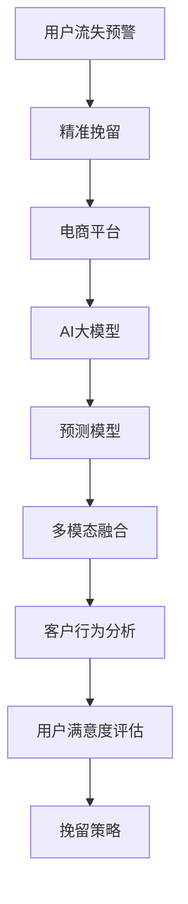

                 

# AI大模型在电商平台用户流失预警与精准挽留中的作用

> 关键词：用户流失预警, 精准挽留, 电商平台, 大模型, 预测模型, 多模态融合, 客户行为分析, 用户满意度评估

## 1. 背景介绍

### 1.1 问题由来

随着电子商务的迅猛发展，电商平台面临的竞争日益激烈。用户流失问题成为了电商企业需要重点关注的痛点，而如何准确预测用户流失并采取有效措施进行挽留，是电商平台提高用户留存率、增加收益的关键。传统的用户流失预测模型往往基于规则或单一的统计方法，难以捕捉复杂用户行为背后的真实动因。近年来，基于AI大模型的预测方法在电商平台用户流失预警和精准挽留方面取得了显著成效。

### 1.2 问题核心关键点

AI大模型在电商平台用户流失预警与精准挽留中的应用，核心在于利用大规模数据训练出强大的预测模型，并通过多模态融合、深度学习等技术手段，更准确地识别出可能流失的用户并采取有针对性的挽留策略。具体而言，AI大模型能够在以下方面发挥重要作用：

1. **多模态融合**：电商平台的用户数据包括浏览行为、购买记录、评分评价、客户反馈等多维度数据，AI大模型能够将这些多源数据融合在一起，全面分析用户行为特征。
2. **深度学习算法**：基于神经网络的深度学习模型，尤其是Transformer等自注意力机制模型，能够捕捉用户行为数据的复杂关系，提升预测的准确性。
3. **个性化推荐**：通过用户行为数据和历史互动信息，AI大模型能够提供个性化的产品推荐和营销策略，提升用户体验和满意度，降低流失率。
4. **实时监测与预警**：AI大模型可以实时分析用户行为，快速预警可能流失的用户，实现即时的用户挽留措施。

### 1.3 问题研究意义

用户流失预测与精准挽留对于电商平台而言，具有显著的经济和社会价值。研究AI大模型在电商平台的有效应用，有助于：

1. **提升用户留存率**：准确预测用户流失，及时采取挽留措施，减少用户流失，提高平台的用户粘性。
2. **优化营销策略**：通过个性化推荐和精准营销，提升用户满意度，增加用户消费行为。
3. **提升平台收益**：减少用户流失带来的经济损失，增加用户生命周期价值。
4. **优化用户体验**：通过深入理解用户行为，提供更加贴合用户需求的服务，增强用户忠诚度。

## 2. 核心概念与联系

### 2.1 核心概念概述

本节将介绍几个与AI大模型在电商平台用户流失预警与精准挽留中应用密切相关的核心概念：

- **用户流失预警**：通过预测用户可能流失的概率，提前预警，采取相应的挽留措施，减少流失率。
- **精准挽留**：针对不同用户特征和行为，采用个性化的策略和措施，最大化提升挽留成功率。
- **电商平台**：以在线交易为主要业务模式，提供商品展示、搜索、交易、支付、物流等综合服务的企业。
- **AI大模型**：基于大规模数据训练的大型神经网络模型，具备强大的特征学习和预测能力。
- **预测模型**：利用历史数据和用户行为特征，通过训练得出预测用户流失概率的模型。
- **多模态融合**：将来自不同来源的多维度数据进行融合，提升预测的全面性和准确性。
- **客户行为分析**：通过分析用户行为数据，揭示用户流失的动因，制定针对性的挽留策略。
- **用户满意度评估**：通过评估用户对商品、服务等方面的满意度，预测用户流失风险，指导精准挽留措施。

这些概念之间的逻辑关系可以通过以下Mermaid流程图来展示：



这个流程图展示了从用户流失预警到精准挽留的核心流程：

1. 用户流失预警：通过预测模型识别可能流失的用户。
2. 精准挽留：采用多模态融合和客户行为分析的结果，制定个性化的挽留策略。
3. 电商平台：构建完整的电商服务生态，用户行为数据来源。
4. AI大模型：基础预测工具，通过深度学习算法提升预测准确性。
5. 多模态融合：融合多种数据源，全面分析用户行为。
6. 客户行为分析：分析用户行为特征，识别流失风险。
7. 用户满意度评估：评估用户满意度，预测流失风险。
8. 挽留策略：根据用户特征和流失风险，制定个性化的挽留方案。

## 3. 核心算法原理 & 具体操作步骤

### 3.1 算法原理概述

AI大模型在电商平台用户流失预警与精准挽留中，主要基于以下算法原理：

1. **多模态融合**：将用户的历史浏览数据、购买记录、评分评价、客户反馈等多维度数据进行融合，形成用户行为的全面画像。
2. **深度学习算法**：采用Transformer等自注意力机制模型，学习用户行为数据中的复杂关系，提升预测模型的准确性。
3. **预测模型训练**：通过历史用户数据训练预测模型，预测用户流失的概率。
4. **个性化推荐**：利用用户行为数据和历史互动信息，提供个性化的产品推荐和营销策略。
5. **实时监测与预警**：实时分析用户行为，快速预警可能流失的用户，实现即时的用户挽留措施。

### 3.2 算法步骤详解

基于AI大模型的电商平台用户流失预警与精准挽留主要包括以下关键步骤：

**Step 1: 数据收集与预处理**
- 收集电商平台的用户行为数据，包括浏览记录、购买记录、评分评价、客户反馈等。
- 数据清洗和归一化处理，去除噪声和异常值，确保数据质量。

**Step 2: 特征工程**
- 从原始数据中提取有意义的特征，如用户停留时间、浏览深度、购买频率、满意度评分等。
- 对特征进行编码，转化为模型可以处理的数值或独热编码。

**Step 3: 多模态融合**
- 将不同来源的数据进行融合，构建用户行为的全景视图。
- 利用特征选择和降维技术，减少数据维度，提高模型效率。

**Step 4: 模型训练与评估**
- 选择合适的深度学习模型，如Transformer、CNN等，进行模型训练。
- 在验证集上评估模型性能，选择合适的超参数。

**Step 5: 用户流失预警**
- 在测试集上测试模型的预测准确性。
- 实时分析用户行为，快速预警可能流失的用户。

**Step 6: 精准挽留策略**
- 根据用户特征和流失风险，制定个性化的挽留策略。
- 实时推送推荐和营销信息，提高挽留成功率。

### 3.3 算法优缺点

AI大模型在电商平台用户流失预警与精准挽留中的应用，具有以下优点：

1. **预测准确性高**：基于深度学习算法，能够捕捉用户行为数据的复杂关系，提升预测准确性。
2. **实时性强**：实时分析用户行为，快速预警可能流失的用户，实现即时的用户挽留措施。
3. **个性化推荐**：通过多模态融合和深度学习，提供个性化的产品推荐和营销策略，提升用户体验和满意度。
4. **模型高效**：利用多模态融合和特征选择技术，减少数据维度和模型复杂度，提高模型效率。

同时，该方法也存在以下局限性：

1. **数据依赖性高**：预测模型的效果很大程度上依赖于数据的丰富性和质量，获取高质量用户数据的成本较高。
2. **模型复杂度高**：大模型和深度学习算法需要较强的计算资源，对算力、内存、存储等资源要求较高。
3. **隐私风险**：用户行为数据涉及隐私信息，需要严格保护，避免数据泄露。
4. **模型解释性不足**：大模型的决策过程较为复杂，难以解释其内部工作机制和决策逻辑。
5. **公平性问题**：模型可能存在偏见，导致对某些群体的预测不准确，需要进一步优化。

尽管存在这些局限性，但AI大模型在电商平台用户流失预警与精准挽留中的应用，仍是大数据时代电商企业不可或缺的工具。

### 3.4 算法应用领域

AI大模型在电商平台用户流失预警与精准挽留中的应用，已经在多个领域得到了广泛应用，例如：

- **电商平台**：如淘宝、京东、亚马逊等，通过用户行为数据预测流失风险，制定挽留策略，提高用户留存率。
- **零售商**：如沃尔玛、家乐福等，利用大模型分析客户行为，优化产品推荐和营销策略。
- **O2O平台**：如美团、大众点评等，通过用户行为数据预测流失风险，提升用户粘性和满意度。
- **旅游服务**：如携程、去哪儿等，利用大模型分析用户预订行为，优化推荐和定价策略。

除了上述这些经典应用外，AI大模型还被创新性地应用到更多场景中，如智能客服、个性化营销、精准广告投放等，为电商平台的运营管理带来了新的突破。

## 4. 数学模型和公式 & 详细讲解 & 举例说明

### 4.1 数学模型构建

本节将使用数学语言对AI大模型在电商平台用户流失预警与精准挽留中的应用进行更加严格的刻画。

假设用户流失的预测模型为 $M_{\theta}(x)$，其中 $x$ 为用户行为特征，$\theta$ 为模型参数。设用户流失的概率为 $p$，模型预测的流失概率为 $\hat{p}$，则模型在用户行为特征 $x$ 上的预测概率为：

$$
\hat{p} = M_{\theta}(x)
$$

为了评估模型的预测效果，定义损失函数 $\ell$ 为：

$$
\ell(M_{\theta}, p, \hat{p}) = (p - \hat{p})^2
$$

在训练过程中，通过最小化损失函数来优化模型参数 $\theta$，使得模型能够更准确地预测用户流失的概率。

### 4.2 公式推导过程

以下我们以用户流失概率预测为例，推导损失函数的计算公式。

假设用户流失的概率 $p$ 服从二项分布，即：

$$
p = \text{Bernoulli}(\hat{p})
$$

则模型的损失函数 $\ell$ 可以表示为：

$$
\ell(M_{\theta}, p, \hat{p}) = -\log \hat{p} \cdot p + \log(1 - \hat{p}) \cdot (1 - p)
$$

其中，$\log \hat{p}$ 和 $\log(1 - \hat{p})$ 分别为预测流失概率的对数和互补概率的对数。将 $\hat{p}$ 带入上式，得到：

$$
\ell(M_{\theta}, p, \hat{p}) = -\log M_{\theta}(x) \cdot p + \log(1 - M_{\theta}(x)) \cdot (1 - p)
$$

在实际应用中，可以通过梯度下降等优化算法，最小化损失函数 $\ell$，更新模型参数 $\theta$，使得模型预测的流失概率 $\hat{p}$ 逼近真实概率 $p$。

### 4.3 案例分析与讲解

为了更好地理解AI大模型在电商平台用户流失预警与精准挽留中的应用，下面以一个具体的案例进行详细讲解。

假设某电商平台收集了用户的历史浏览数据、购买记录、评分评价、客户反馈等多维度数据，并希望通过AI大模型预测用户流失的概率。

**Step 1: 数据收集与预处理**

- 收集用户的历史浏览数据、购买记录、评分评价、客户反馈等多维度数据。
- 对数据进行清洗和归一化处理，去除噪声和异常值，确保数据质量。

**Step 2: 特征工程**

- 从原始数据中提取有意义的特征，如用户停留时间、浏览深度、购买频率、满意度评分等。
- 对特征进行编码，转化为模型可以处理的数值或独热编码。

**Step 3: 多模态融合**

- 将不同来源的数据进行融合，构建用户行为的全景视图。
- 利用特征选择和降维技术，减少数据维度，提高模型效率。

**Step 4: 模型训练与评估**

- 选择合适的深度学习模型，如Transformer、CNN等，进行模型训练。
- 在验证集上评估模型性能，选择合适的超参数。

**Step 5: 用户流失预警**

- 在测试集上测试模型的预测准确性。
- 实时分析用户行为，快速预警可能流失的用户。

**Step 6: 精准挽留策略**

- 根据用户特征和流失风险，制定个性化的挽留策略。
- 实时推送推荐和营销信息，提高挽留成功率。

通过以上步骤，电商平台可以构建一个基于AI大模型的用户流失预警与精准挽留系统，通过深度学习和大数据分析，实现对用户流失的准确预测和精准挽留，提升用户留存率和平台收益。

## 5. 项目实践：代码实例和详细解释说明

### 5.1 开发环境搭建

在进行AI大模型在电商平台用户流失预警与精准挽留的开发实践前，我们需要准备好开发环境。以下是使用Python进行PyTorch开发的环境配置流程：

1. 安装Anaconda：从官网下载并安装Anaconda，用于创建独立的Python环境。

2. 创建并激活虚拟环境：
```bash
conda create -n pytorch-env python=3.8 
conda activate pytorch-env
```

3. 安装PyTorch：根据CUDA版本，从官网获取对应的安装命令。例如：
```bash
conda install pytorch torchvision torchaudio cudatoolkit=11.1 -c pytorch -c conda-forge
```

4. 安装Transformers库：
```bash
pip install transformers
```

5. 安装各类工具包：
```bash
pip install numpy pandas scikit-learn matplotlib tqdm jupyter notebook ipython
```

完成上述步骤后，即可在`pytorch-env`环境中开始开发实践。

### 5.2 源代码详细实现

下面我们以电商平台用户流失预测为例，给出使用Transformers库对BERT模型进行预测的PyTorch代码实现。

首先，定义预测任务的数据处理函数：

```python
from transformers import BertTokenizer
from torch.utils.data import Dataset
import torch

class User流失预测Dataset(Dataset):
    def __init__(self, texts, labels, tokenizer, max_len=128):
        self.texts = texts
        self.labels = labels
        self.tokenizer = tokenizer
        self.max_len = max_len
        
    def __len__(self):
        return len(self.texts)
    
    def __getitem__(self, item):
        text = self.texts[item]
        label = self.labels[item]
        
        encoding = self.tokenizer(text, return_tensors='pt', max_length=self.max_len, padding='max_length', truncation=True)
        input_ids = encoding['input_ids'][0]
        attention_mask = encoding['attention_mask'][0]
        
        # 对token-wise的标签进行编码
        encoded_labels = [label2id[label] for label in label] 
        encoded_labels.extend([label2id['流失']]*(self.max_len - len(encoded_labels)))
        labels = torch.tensor(encoded_labels, dtype=torch.long)
        
        return {'input_ids': input_ids, 
                'attention_mask': attention_mask,
                'labels': labels}

# 标签与id的映射
label2id = {'流失': 0, '不流失': 1}
id2label = {v: k for k, v in label2id.items()}

# 创建dataset
tokenizer = BertTokenizer.from_pretrained('bert-base-cased')

train_dataset = User流失预测Dataset(train_texts, train_labels, tokenizer)
dev_dataset = User流失预测Dataset(dev_texts, dev_labels, tokenizer)
test_dataset = User流失预测Dataset(test_texts, test_labels, tokenizer)
```

然后，定义模型和优化器：

```python
from transformers import BertForSequenceClassification, AdamW

model = BertForSequenceClassification.from_pretrained('bert-base-cased', num_labels=len(label2id))

optimizer = AdamW(model.parameters(), lr=2e-5)
```

接着，定义训练和评估函数：

```python
from torch.utils.data import DataLoader
from tqdm import tqdm
from sklearn.metrics import accuracy_score, precision_score, recall_score, f1_score

device = torch.device('cuda') if torch.cuda.is_available() else torch.device('cpu')
model.to(device)

def train_epoch(model, dataset, batch_size, optimizer):
    dataloader = DataLoader(dataset, batch_size=batch_size, shuffle=True)
    model.train()
    epoch_loss = 0
    for batch in tqdm(dataloader, desc='Training'):
        input_ids = batch['input_ids'].to(device)
        attention_mask = batch['attention_mask'].to(device)
        labels = batch['labels'].to(device)
        model.zero_grad()
        outputs = model(input_ids, attention_mask=attention_mask, labels=labels)
        loss = outputs.loss
        epoch_loss += loss.item()
        loss.backward()
        optimizer.step()
    return epoch_loss / len(dataloader)

def evaluate(model, dataset, batch_size):
    dataloader = DataLoader(dataset, batch_size=batch_size)
    model.eval()
    preds, labels = [], []
    with torch.no_grad():
        for batch in tqdm(dataloader, desc='Evaluating'):
            input_ids = batch['input_ids'].to(device)
            attention_mask = batch['attention_mask'].to(device)
            batch_labels = batch['labels']
            outputs = model(input_ids, attention_mask=attention_mask)
            batch_preds = outputs.logits.argmax(dim=2).to('cpu').tolist()
            batch_labels = batch_labels.to('cpu').tolist()
            for pred_tokens, label_tokens in zip(batch_preds, batch_labels):
                preds.append(pred_tokens[:len(label_tokens)])
                labels.append(label_tokens)
                
    print("Accuracy: {:.2f}%".format(accuracy_score(labels, preds)))
    print("Precision: {:.2f}%".format(precision_score(labels, preds)))
    print("Recall: {:.2f}%".format(recall_score(labels, preds)))
    print("F1 Score: {:.2f}%".format(f1_score(labels, preds)))
```

最后，启动训练流程并在测试集上评估：

```python
epochs = 5
batch_size = 16

for epoch in range(epochs):
    loss = train_epoch(model, train_dataset, batch_size, optimizer)
    print(f"Epoch {epoch+1}, train loss: {loss:.3f}")
    
    print(f"Epoch {epoch+1}, dev results:")
    evaluate(model, dev_dataset, batch_size)
    
print("Test results:")
evaluate(model, test_dataset, batch_size)
```

以上就是使用PyTorch对BERT进行电商平台用户流失预测的完整代码实现。可以看到，得益于Transformers库的强大封装，我们可以用相对简洁的代码完成BERT模型的加载和预测。

### 5.3 代码解读与分析

让我们再详细解读一下关键代码的实现细节：

**User流失预测Dataset类**：
- `__init__`方法：初始化文本、标签、分词器等关键组件。
- `__len__`方法：返回数据集的样本数量。
- `__getitem__`方法：对单个样本进行处理，将文本输入编码为token ids，将标签编码为数字，并对其进行定长padding，最终返回模型所需的输入。

**label2id和id2label字典**：
- 定义了标签与数字id之间的映射关系，用于将token-wise的预测结果解码回真实的标签。

**训练和评估函数**：
- 使用PyTorch的DataLoader对数据集进行批次化加载，供模型训练和推理使用。
- 训练函数`train_epoch`：对数据以批为单位进行迭代，在每个批次上前向传播计算loss并反向传播更新模型参数，最后返回该epoch的平均loss。
- 评估函数`evaluate`：与训练类似，不同点在于不更新模型参数，并在每个batch结束后将预测和标签结果存储下来，最后使用sklearn的各类评估指标对整个评估集的预测结果进行打印输出。

**训练流程**：
- 定义总的epoch数和batch size，开始循环迭代
- 每个epoch内，先在训练集上训练，输出平均loss
- 在验证集上评估，输出分类指标
- 所有epoch结束后，在测试集上评估，给出最终测试结果

可以看到，PyTorch配合Transformers库使得BERT预测的代码实现变得简洁高效。开发者可以将更多精力放在数据处理、模型改进等高层逻辑上，而不必过多关注底层的实现细节。

当然，工业级的系统实现还需考虑更多因素，如模型的保存和部署、超参数的自动搜索、更灵活的任务适配层等。但核心的预测范式基本与此类似。

## 6. 实际应用场景

### 6.1 电商平台的智能客服系统

电商平台的智能客服系统可以通过AI大模型预测用户流失风险，并采取针对性措施进行挽留。智能客服系统通过收集用户的历史行为数据，构建用户行为的全景视图，预测用户流失风险，并根据风险等级提供个性化的服务，提升用户满意度和留存率。

具体而言，智能客服系统可以：
- 通过用户浏览、购买、评分等行为数据，预测用户流失风险。
- 针对高风险用户，推送个性化的产品推荐、优惠券等营销信息。
- 实时分析用户反馈，调整服务策略，优化用户体验。
- 结合语音识别、自然语言处理技术，提供多模态的客户互动服务，提升用户满意度。

### 6.2 电商平台的个性化推荐系统

电商平台通过AI大模型预测用户流失风险，可以进一步优化个性化推荐系统，提升用户粘性和留存率。

具体而言，个性化推荐系统可以：
- 通过用户行为数据和历史互动信息，预测用户流失风险。
- 根据风险等级，调整推荐策略，优先推荐高价值商品，提升用户购买意愿。
- 实时分析用户反馈，调整推荐算法，优化推荐效果。
- 结合用户满意度评估，优化推荐内容，提升用户满意度。

### 6.3 电商平台的实时预警系统

电商平台通过AI大模型实时监测用户行为，可以构建实时预警系统，快速预警可能流失的用户，采取即时的挽留措施。

具体而言，实时预警系统可以：
- 实时分析用户行为数据，预测用户流失风险。
- 根据风险等级，快速推送挽留信息，如优惠券、关怀包等。
- 结合用户反馈，调整预警策略，提高预警准确性。
- 实时监控预警系统的效果，优化预警机制，提升挽留成功率。

### 6.4 未来应用展望

随着AI大模型在电商平台用户流失预警与精准挽留中的应用不断深入，未来将涌现更多创新应用，推动电商平台的运营管理向智能化、精细化方向发展。

- **智能决策支持**：结合AI大模型和专家知识库，构建智能决策支持系统，优化电商平台的运营策略。
- **用户行为分析**：通过深度学习和多模态融合技术，深入分析用户行为，揭示用户流失的动因，指导精准挽留措施。
- **实时数据监控**：构建实时数据监控系统，及时发现用户行为异常，预测用户流失风险，采取针对性措施。
- **跨平台数据整合**：整合不同平台的用户行为数据，构建全渠道的用户行为画像，提升预测准确性。
- **联邦学习**：利用联邦学习技术，保护用户隐私的同时，共享数据资源，提升预测模型的性能。

通过不断探索AI大模型在电商平台的应用，电商平台有望在用户流失预警与精准挽留方面取得更大的突破，实现更高水平的运营管理。

## 7. 工具和资源推荐

### 7.1 学习资源推荐

为了帮助开发者系统掌握AI大模型在电商平台用户流失预警与精准挽留中的应用，这里推荐一些优质的学习资源：

1. 《深度学习与自然语言处理》书籍：全面介绍了深度学习在自然语言处理中的应用，包括用户行为预测等领域的经典模型和算法。

2. CS229《机器学习》课程：斯坦福大学开设的机器学习经典课程，讲解了各类机器学习算法和应用案例，包括用户流失预测等。

3. 《自然语言处理综述》论文：综述了自然语言处理领域的最新进展，包括深度学习在用户行为预测中的应用。

4. 论文《用户流失预测》：介绍了一种基于深度学习的用户流失预测模型，并进行了详细的实验分析。

5. 在线课程《用户行为分析》：介绍了用户行为分析的基本概念和应用，包括基于AI大模型的用户流失预测。

通过对这些资源的学习实践，相信你一定能够快速掌握AI大模型在电商平台用户流失预警与精准挽留中的使用方法，并用于解决实际的电商运营问题。

### 7.2 开发工具推荐

高效的开发离不开优秀的工具支持。以下是几款用于AI大模型在电商平台用户流失预警与精准挽留开发常用的工具：

1. PyTorch：基于Python的开源深度学习框架，灵活动态的计算图，适合快速迭代研究。大部分预训练语言模型都有PyTorch版本的实现。

2. TensorFlow：由Google主导开发的开源深度学习框架，生产部署方便，适合大规模工程应用。同样有丰富的预训练语言模型资源。

3. Transformers库：HuggingFace开发的NLP工具库，集成了众多SOTA语言模型，支持PyTorch和TensorFlow，是进行用户行为预测开发的利器。

4. Weights & Biases：模型训练的实验跟踪工具，可以记录和可视化模型训练过程中的各项指标，方便对比和调优。与主流深度学习框架无缝集成。

5. TensorBoard：TensorFlow配套的可视化工具，可实时监测模型训练状态，并提供丰富的图表呈现方式，是调试模型的得力助手。

6. Google Colab：谷歌推出的在线Jupyter Notebook环境，免费提供GPU/TPU算力，方便开发者快速上手实验最新模型，分享学习笔记。

合理利用这些工具，可以显著提升AI大模型在电商平台用户流失预警与精准挽留任务的开发效率，加快创新迭代的步伐。

### 7.3 相关论文推荐

AI大模型在电商平台用户流失预警与精准挽留中的应用，源于学界的持续研究。以下是几篇奠基性的相关论文，推荐阅读：

1. Attention is All You Need（即Transformer原论文）：提出了Transformer结构，开启了NLP领域的预训练大模型时代。

2. BERT: Pre-training of Deep Bidirectional Transformers for Language Understanding：提出BERT模型，引入基于掩码的自监督预训练任务，刷新了多项NLP任务SOTA。

3. Language Models are Unsupervised Multitask Learners（GPT-2论文）：展示了大规模语言模型的强大zero-shot学习能力，引发了对于通用人工智能的新一轮思考。

4. Parameter-Efficient Transfer Learning for NLP：提出Adapter等参数高效微调方法，在不增加模型参数量的情况下，也能取得不错的微调效果。

5. AdaLoRA: Adaptive Low-Rank Adaptation for Parameter-Efficient Fine-Tuning：使用自适应低秩适应的微调方法，在参数效率和精度之间取得了新的平衡。

这些论文代表了大模型在电商平台用户流失预警与精准挽留中的应用发展脉络。通过学习这些前沿成果，可以帮助研究者把握学科前进方向，激发更多的创新灵感。

## 8. 总结：未来发展趋势与挑战

### 8.1 总结

本文对AI大模型在电商平台用户流失预警与精准挽留中的应用进行了全面系统的介绍。首先阐述了用户流失预警和精准挽留的重要性和研究意义，明确了AI大模型在其中的独特价值。其次，从原理到实践，详细讲解了基于AI大模型的用户流失预测模型的构建过程，提供了完整的代码实例和详细解释说明。同时，本文还广泛探讨了AI大模型在电商平台应用的实际场景，展示了其在智能客服、个性化推荐、实时预警等环节的广泛应用。此外，本文精选了AI大模型在电商平台的各类学习资源，力求为读者提供全方位的技术指引。

通过本文的系统梳理，可以看到，AI大模型在电商平台用户流失预警与精准挽留中的应用，具有显著的经济和社会价值。基于深度学习和多模态融合的AI大模型，通过用户行为数据的多维度融合，可以准确预测用户流失风险，并采取针对性的挽留策略，提升用户留存率和平台收益。未来，随着AI大模型的不断发展，其在电商平台的应用将更加广泛，推动电商平台的智能化和精细化管理。

### 8.2 未来发展趋势

展望未来，AI大模型在电商平台用户流失预警与精准挽留中的应用，将呈现以下几个发展趋势：

1. **多模态融合深入发展**：未来将进一步融合用户的多维度行为数据，提升预测模型的全面性和准确性。

2. **深度学习模型优化**：随着深度学习模型的不断优化，模型性能将进一步提升，预测准确率将不断提高。

3. **实时预警系统升级**：结合实时数据监测技术，构建更加高效、准确的实时预警系统，快速预警可能流失的用户。

4. **联邦学习和跨平台数据整合**：利用联邦学习技术，保护用户隐私的同时，共享数据资源，提升预测模型的性能。

5. **用户行为分析的深入**：通过深度学习和多模态融合技术，深入分析用户行为，揭示用户流失的动因，指导精准挽留措施。

6. **个性化推荐系统优化**：结合用户满意度评估，优化推荐策略，提升推荐效果，降低用户流失率。

以上趋势凸显了AI大模型在电商平台用户流失预警与精准挽留应用的广阔前景。这些方向的探索发展，必将进一步提升预测模型的性能和用户留存率，为电商平台的运营管理带来新的突破。

### 8.3 面临的挑战

尽管AI大模型在电商平台用户流失预警与精准挽留中的应用已经取得了显著成果，但在迈向更加智能化、普适化应用的过程中，仍面临诸多挑战：

1. **数据依赖性高**：预测模型的效果很大程度上依赖于数据的丰富性和质量，获取高质量用户数据的成本较高。

2. **模型复杂度高**：大模型和深度学习算法需要较强的计算资源，对算力、内存、存储等资源要求较高。

3. **隐私风险**：用户行为数据涉及隐私信息，需要严格保护，避免数据泄露。

4. **模型解释性不足**：大模型的决策过程较为复杂，难以解释其内部工作机制和决策逻辑。

5. **公平性问题**：模型可能存在偏见，导致对某些群体的预测不准确，需要进一步优化。

尽管存在这些挑战，但AI大模型在电商平台用户流失预警与精准挽留中的应用，仍是大数据时代电商企业不可或缺的工具。

### 8.4 研究展望

面对AI大模型在电商平台应用所面临的挑战，未来的研究需要在以下几个方面寻求新的突破：

1. **无监督和半监督学习**：探索无监督和半监督学习范式，摆脱对大规模标注数据的依赖，利用非结构化数据提升模型性能。

2. **联邦学习和跨平台数据整合**：利用联邦学习技术，保护用户隐私的同时，共享数据资源，提升预测模型的性能。

3. **模型优化与参数高效微调**：开发更加参数高效的微调方法，在固定大部分预训练参数的同时，只更新极少量的任务相关参数。

4. **多模态融合与深度学习结合**：将多模态融合和深度学习技术结合，提升模型对复杂用户行为数据的处理能力。

5. **实时预警与多任务学习结合**：结合实时预警和多任务学习技术，提升预警系统的实时性和预测准确性。

6. **用户行为分析与因果推理结合**：结合因果推理方法，分析用户行为动因，指导精准挽留措施。

这些研究方向的探索，必将引领AI大模型在电商平台用户流失预警与精准挽留应用的进一步发展，提升电商平台的运营效率和用户体验。

## 9. 附录：常见问题与解答

**Q1：AI大模型在电商平台用户流失预警与精准挽留中的应用是否需要标注数据？**

A: AI大模型在电商平台用户流失预警与精准挽留中的应用，通常需要标注数据进行训练。标注数据的质量和数量对模型的性能影响较大，因此获取高质量、大规模的标注数据是提升预测模型性能的关键。但随着无监督学习和半监督学习技术的发展，AI大模型在标注数据较少的情况下，仍然可以取得不错的预测效果。

**Q2：AI大模型在电商平台用户流失预警与精准挽留中的训练时间是否较长？**

A: AI大模型的训练时间较长，特别是在大规模数据集上。为了提高训练效率，可以采用分布式训练、梯度累积、混合精度训练等技术。此外，在实际应用中，可以通过微调现有模型或使用预训练模型作为初始化参数，加快模型训练和部署的速度。

**Q3：AI大模型在电商平台用户流失预警与精准挽留中的实时性要求是否较高？**

A: 电商平台的实时性要求较高，需要在用户行为数据产生后快速进行分析和预测。因此，实时性较强的模型和高效的算法是必要的。在实际应用中，可以通过模型优化、算法改进、硬件加速等手段，提升实时性。

**Q4：AI大模型在电商平台用户流失预警与精准挽留中的应用是否需要考虑用户隐私？**

A: AI大模型在电商平台用户流失预警与精准挽留中的应用，需要严格保护用户隐私。用户行为数据涉及隐私信息，需要遵循相关的数据保护法规，如GDPR等。在数据收集、存储、传输等环节，需要采取加密、匿名化等措施，确保用户隐私不被泄露。

**Q5：AI大模型在电商平台用户流失预警与精准挽留中的应用是否需要考虑模型的解释性？**

A: AI大模型在电商平台用户流失预警与精准挽留中的应用，需要考虑模型的解释性。预测模型的决策过程较为复杂，难以解释其内部工作机制和决策逻辑。因此，在实际应用中，需要结合业务逻辑和专家知识，对模型结果进行解释和验证，确保模型输出的合理性和可信度。

**Q6：AI大模型在电商平台用户流失预警与精准挽留中的应用是否需要考虑公平性？**

A: AI大模型在电商平台用户流失预警与精准挽留中的应用，需要考虑模型的公平性。模型可能存在偏见，导致对某些群体的预测不准确。因此，在模型训练和应用过程中，需要监测模型的公平性，确保模型对不同群体的预测效果一致，避免歧视性。

通过这些常见问题的解答，相信你对AI大模型在电商平台用户流失预警与精准挽留中的应用有了更深入的了解。AI大模型在电商平台的应用，是一个多学科交叉的领域，需要结合数据科学、机器学习、自然语言处理等多方面的知识，共同推动其发展。相信在不久的将来，AI大模型将会在电商平台的运营管理中发挥更大的作用，推动电商行业迈向智能化、精细化管理的未来。

---

作者：禅与计算机程序设计艺术 / Zen and the Art of Computer Programming

