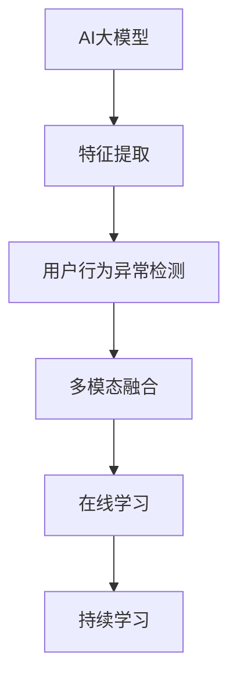

                 

# AI大模型在电商平台用户行为异常检测中的作用

## 1. 背景介绍

### 1.1 问题由来

随着电子商务的迅猛发展，平台用户行为数据呈现爆炸式增长。这些数据包含着丰富的用户意图、偏好和需求信息，是电商平台精准营销、个性化推荐和用户体验优化的宝贵资产。然而，海量的数据同时也带来了诸多挑战，如数据噪音、多维度信息聚合、异常行为检测等。如何高效利用用户行为数据，挖掘出有价值的商业洞察，成为了电商平台亟需解决的重要问题。

用户行为异常检测作为数据挖掘的重要应用，能够帮助电商平台及时发现潜在风险，如欺诈行为、恶意账号、异常交易等，从而保护平台资产，维护正常运营秩序。传统的异常检测方法往往依赖手工特征工程，需要大量时间和经验来设计合适的特征，且容易受到数据分布变化的影响，难以应对快速变化的市场环境。

人工智能大模型通过在大规模数据上预训练，学习到了丰富的特征表示，能够自动化地发现数据中的模式和结构。近年来，基于大模型的用户行为异常检测方法逐渐兴起，并已在多个电商平台上取得了显著的效果。

### 1.2 问题核心关键点

AI大模型在电商平台用户行为异常检测中的应用，主要集中在以下几个关键点：

1. **特征提取**：大模型能够自动学习到输入数据的复杂特征，无需手工设计特征，减少了特征工程的复杂度。
2. **泛化能力**：预训练模型在大量数据上学习到的泛化能力，使得其在处理新数据时表现稳定，能够适应多样化的用户行为模式。
3. **实时检测**：通过微调后的模型，可以实现对实时数据的快速检测，及时发现异常行为，提高检测效率。
4. **多模态融合**：电商平台的用户行为数据不仅包括文本信息，还有图片、视频等多模态数据。大模型能够融合多模态数据，提供更加全面的异常检测能力。
5. **在线学习**：大模型具备在线学习的特性，能够不断从新数据中学习，适应市场变化，保持检测模型的时效性。

### 1.3 问题研究意义

研究AI大模型在电商平台用户行为异常检测中的应用，对于提升电商平台的运营效率、用户满意度和安全性具有重要意义：

1. **降低检测成本**：相比传统的统计方法和规则引擎，大模型能够自动化地进行异常检测，减少了人工审查和干预的成本。
2. **提升检测精度**：大模型通过学习大量的正负样本，能够更准确地识别异常行为，减少误报和漏报。
3. **提高实时响应**：大模型能够在实时数据流中快速检测异常，缩短响应时间，及时采取应对措施。
4. **增强多模态融合**：电商平台的多模态数据能够在大模型中得到有效融合，提供更全面的用户行为洞察。
5. **促进持续学习**：大模型能够不断从新数据中学习，更新异常检测模型，保持其适用性和时效性。

## 2. 核心概念与联系

### 2.1 核心概念概述

为更好地理解AI大模型在电商平台用户行为异常检测中的应用，本节将介绍几个密切相关的核心概念：

- **AI大模型**：以Transformer模型为代表的预训练语言模型，通过在大规模数据上预训练，学习到丰富的特征表示。
- **用户行为异常检测**：利用用户行为数据，识别出与正常行为模式显著不同的行为，如欺诈、恶意账号等。
- **特征提取**：从用户行为数据中提取出对异常检测有帮助的特征，这些特征可以是文本、图像、视频等多种模态。
- **多模态融合**：将不同模态的数据进行融合，形成一个统一的行为向量，用于异常检测模型的输入。
- **在线学习**：模型能够不断从新数据中学习，更新异常检测模型，保持其适用性和时效性。
- **持续学习**：模型能够不断从新数据中学习，更新异常检测模型，保持其适用性和时效性。

这些核心概念之间的逻辑关系可以通过以下Mermaid流程图来展示：



这个流程图展示了大模型在电商平台用户行为异常检测中的核心概念及其之间的关系：

1. AI大模型通过预训练学习特征表示。
2. 通过特征提取，将用户行为数据映射为模型可以处理的输入。
3. 用户行为异常检测模型基于提取的特征进行异常行为识别。
4. 多模态融合技术能够将不同模态的数据进行有效融合。
5. 在线学习机制允许模型不断从新数据中学习，保持其适应性和时效性。
6. 持续学习技术使得模型能够长期运行，保持其稳定性和性能。

## 3. 核心算法原理 & 具体操作步骤
### 3.1 算法原理概述

基于AI大模型的用户行为异常检测，本质上是一个多模态的数据融合和异常检测过程。其核心思想是：利用大模型学习到的特征表示，从用户行为数据中提取出对异常检测有帮助的特征，并通过多模态融合技术，将这些特征进行合并，最后输入到异常检测模型中，判断行为是否异常。

形式化地，假设用户行为数据为 $D=\{(x_i,y_i)\}_{i=1}^N$，其中 $x_i$ 为输入数据，$y_i$ 为标签（正常或异常）。大模型的预训练过程为 $\theta = M_{\text{pretrain}}(D_{\text{pretrain}})$，其中 $M_{\text{pretrain}}$ 为预训练模型，$D_{\text{pretrain}}$ 为预训练数据集。对于特定的电商平台异常检测任务，可以设计一个微调过程 $\theta^* = M_{\text{fine-tune}}(\theta,D_{\text{task}})$，其中 $D_{\text{task}}$ 为电商平台异常检测任务的标注数据集。微调后的模型 $M_{\theta^*}$ 可以对新的电商平台用户行为数据进行异常检测。

### 3.2 算法步骤详解

基于AI大模型的用户行为异常检测一般包括以下几个关键步骤：

**Step 1: 准备数据集和模型**

- 收集电商平台的用户行为数据，包括文本、图片、视频等模态的数据。
- 将数据集划分为训练集、验证集和测试集。
- 选择合适的预训练模型，如BERT、RoBERTa、GPT等。

**Step 2: 特征提取**

- 对于文本数据，使用BERT等预训练语言模型进行特征提取，得到上下文表示。
- 对于图像数据，使用VGG、ResNet等卷积神经网络进行特征提取，得到图像特征向量。
- 对于视频数据，使用3D卷积神经网络或时空混合网络进行特征提取，得到视频特征向量。
- 将不同模态的特征向量进行拼接或融合，得到统一的行为向量。

**Step 3: 设计异常检测模型**

- 基于行为向量，设计一个异常检测模型，如线性判别分析、支持向量机、神经网络等。
- 使用训练集数据对模型进行微调，得到初始化的异常检测模型。
- 在验证集上进行超参数调优，选择最优的模型参数。

**Step 4: 在线学习**

- 部署异常检测模型到实时数据流中，对实时用户行为数据进行检测。
- 将检测结果反馈到模型中，更新模型参数，实现在线学习。

**Step 5: 持续学习**

- 定期重新收集用户行为数据，对异常检测模型进行微调，保持模型的时效性。
- 结合领域专家知识，对异常检测模型进行优化，提高检测效果。

以上是基于AI大模型的用户行为异常检测的一般流程。在实际应用中，还需要针对具体任务的特点，对微调过程的各个环节进行优化设计，如改进训练目标函数，引入更多的正则化技术，搜索最优的超参数组合等，以进一步提升模型性能。

### 3.3 算法优缺点

基于AI大模型的用户行为异常检测方法具有以下优点：

1. **自动化特征提取**：大模型能够自动学习到输入数据的复杂特征，减少了特征工程的复杂度。
2. **泛化能力强**：预训练模型在大规模数据上学习到的泛化能力，使得其在处理新数据时表现稳定，能够适应多样化的用户行为模式。
3. **实时检测**：通过微调后的模型，可以实现对实时数据的快速检测，及时发现异常行为，提高检测效率。
4. **多模态融合**：电商平台的多模态数据能够在大模型中得到有效融合，提供更全面的用户行为洞察。
5. **在线学习**：大模型具备在线学习的特性，能够不断从新数据中学习，适应市场变化，保持检测模型的时效性。

同时，该方法也存在一定的局限性：

1. **计算资源消耗大**：大模型通常参数量较大，计算和存储开销大，对硬件要求较高。
2. **数据依赖强**：异常检测的效果很大程度上取决于训练数据的质量和多样性，需要收集足够的标注数据。
3. **模型复杂度高**：大模型结构和训练过程复杂，需要较多的调试和优化工作。
4. **解释性不足**：异常检测模型的决策过程难以解释，难以对其推理逻辑进行分析和调试。

尽管存在这些局限性，但就目前而言，基于AI大模型的异常检测方法仍然是一种高效、有效的解决方案。未来相关研究的重点在于如何进一步降低计算资源消耗，提高模型可解释性，同时兼顾在线学习与持续学习的平衡。

### 3.4 算法应用领域

基于AI大模型的用户行为异常检测方法，在电商平台用户行为检测中得到了广泛的应用，覆盖了几乎所有常见的异常行为检测任务，例如：

- **欺诈检测**：识别虚假交易、退货退款欺诈等行为。
- **账号异常检测**：检测恶意注册、恶意登录等行为。
- **交易异常检测**：识别异常订单、高风险交易等行为。
- **内容异常检测**：识别不当言论、违规内容等行为。
- **物流异常检测**：检测延迟发货、退货拒绝等行为。

除了上述这些经典任务外，AI大模型在电商平台用户行为检测中也有创新性地应用于更多场景中，如实时用户画像生成、交易风险预警、用户行为预测等，为电商平台的运营管理提供了新的工具和手段。

## 4. 数学模型和公式 & 详细讲解  
### 4.1 数学模型构建

本节将使用数学语言对基于AI大模型的用户行为异常检测过程进行更加严格的刻画。

假设用户行为数据为 $D=\{(x_i,y_i)\}_{i=1}^N$，其中 $x_i$ 为输入数据，$y_i$ 为标签（正常或异常）。大模型的预训练过程为 $\theta = M_{\text{pretrain}}(D_{\text{pretrain}})$，其中 $M_{\text{pretrain}}$ 为预训练模型，$D_{\text{pretrain}}$ 为预训练数据集。对于特定的电商平台异常检测任务，可以设计一个微调过程 $\theta^* = M_{\text{fine-tune}}(\theta,D_{\text{task}})$，其中 $D_{\text{task}}$ 为电商平台异常检测任务的标注数据集。微调后的模型 $M_{\theta^*}$ 可以对新的电商平台用户行为数据进行异常检测。

定义行为向量 $z_i = f(x_i)$，其中 $f$ 为特征提取函数。假设异常检测模型的参数为 $\theta_{\text{detect}}$，则模型对行为 $x_i$ 的异常检测结果为：

$$
y_{\text{detect}}(x_i) = M_{\theta_{\text{detect}}}(z_i)
$$

模型的训练目标是最小化损失函数：

$$
\mathcal{L}(\theta_{\text{detect}}, \theta) = -\frac{1}{N}\sum_{i=1}^N y_i \log y_{\text{detect}}(x_i) + (1-y_i) \log (1-y_{\text{detect}}(x_i))
$$

通过梯度下降等优化算法，微调过程不断更新模型参数，最小化损失函数，使得模型输出逼近真实标签。由于 $\theta$ 已经通过预训练获得了较好的初始化，因此即便在少量标注数据上进行微调，也能较快收敛到理想的模型参数 $\theta^*$。

### 4.2 公式推导过程

以下我们以二分类任务为例，推导异常检测模型的损失函数及其梯度的计算公式。

假设模型 $M_{\theta_{\text{detect}}}$ 在输入 $z$ 上的输出为 $\hat{y}=M_{\theta_{\text{detect}}}(z) \in [0,1]$，表示样本属于正类的概率。真实标签 $y \in \{0,1\}$。则二分类交叉熵损失函数定义为：

$$
\ell(M_{\theta_{\text{detect}}}(z),y) = -[y\log \hat{y} + (1-y)\log (1-\hat{y})]
$$

将其代入损失函数公式，得：

$$
\mathcal{L}(\theta_{\text{detect}}, \theta) = -\frac{1}{N}\sum_{i=1}^N [y_i\log y_{\text{detect}}(z_i)+(1-y_i)\log(1-y_{\text{detect}}(z_i))]
$$

根据链式法则，损失函数对 $\theta_{\text{detect}}$ 的梯度为：

$$
\frac{\partial \mathcal{L}(\theta_{\text{detect}}, \theta)}{\partial \theta_{\text{detect}}_k} = -\frac{1}{N}\sum_{i=1}^N (\frac{y_i}{y_{\text{detect}}(z_i)}-\frac{1-y_i}{1-y_{\text{detect}}(z_i)}) \frac{\partial y_{\text{detect}}(z_i)}{\partial \theta_{\text{detect}}_k}
$$

其中 $\frac{\partial y_{\text{detect}}(z_i)}{\partial \theta_{\text{detect}}_k}$ 可进一步递归展开，利用自动微分技术完成计算。

在得到损失函数的梯度后，即可带入参数更新公式，完成模型的迭代优化。重复上述过程直至收敛，最终得到适应电商平台异常检测任务的最优模型参数 $\theta^*$。

## 5. 项目实践：代码实例和详细解释说明
### 5.1 开发环境搭建

在进行电商平台用户行为异常检测的实践前，我们需要准备好开发环境。以下是使用Python进行TensorFlow开发的环境配置流程：

1. 安装Anaconda：从官网下载并安装Anaconda，用于创建独立的Python环境。

2. 创建并激活虚拟环境：
```bash
conda create -n tf-env python=3.8 
conda activate tf-env
```

3. 安装TensorFlow：根据CUDA版本，从官网获取对应的安装命令。例如：
```bash
conda install tensorflow==2.6
```

4. 安装PyTorch：用于特征提取和模型微调，推荐安装最新版本。
```bash
pip install torch torchvision torchaudio cudatoolkit=11.1 -c pytorch -c conda-forge
```

5. 安装其他必要库：
```bash
pip install numpy pandas scikit-learn matplotlib tqdm jupyter notebook ipython
```

完成上述步骤后，即可在`tf-env`环境中开始异常检测实践。

### 5.2 源代码详细实现

下面我们以电商平台用户行为异常检测为例，给出使用TensorFlow对BERT模型进行异常检测的PyTorch代码实现。

首先，定义数据处理函数：

```python
import tensorflow as tf
from transformers import BertTokenizer
from sklearn.metrics import precision_recall_fscore_support

class Dataset(tf.data.Dataset):
    def __init__(self, texts, labels, tokenizer):
        self.texts = texts
        self.labels = labels
        self.tokenizer = tokenizer
        
    def __len__(self):
        return len(self.texts)
    
    def __getitem__(self, item):
        text = self.texts[item]
        label = self.labels[item]
        
        encoding = self.tokenizer(text, return_tensors='tf', max_length=128, padding='max_length', truncation=True)
        input_ids = encoding['input_ids']
        attention_mask = encoding['attention_mask']
        
        # 将标签编码成one-hot向量
        label = tf.keras.utils.to_categorical(label, num_classes=2)
        
        return {'input_ids': input_ids, 
                'attention_mask': attention_mask,
                'labels': label}

# 加载数据集
tokenizer = BertTokenizer.from_pretrained('bert-base-cased')
train_dataset = Dataset(train_texts, train_labels, tokenizer)
dev_dataset = Dataset(dev_texts, dev_labels, tokenizer)
test_dataset = Dataset(test_texts, test_labels, tokenizer)
```

然后，定义模型和优化器：

```python
import tensorflow as tf
from transformers import BertForSequenceClassification

model = BertForSequenceClassification.from_pretrained('bert-base-cased', num_labels=2)

optimizer = tf.keras.optimizers.Adam(learning_rate=2e-5)
```

接着，定义训练和评估函数：

```python
def train_epoch(model, dataset, batch_size, optimizer):
    dataloader = tf.data.Dataset.from_tensor_slices(dataset)
    dataloader = dataloader.batch(batch_size).shuffle(buffer_size=10000)
    model.train()
    epoch_loss = 0
    for batch in dataloader:
        input_ids = batch['input_ids']
        attention_mask = batch['attention_mask']
        labels = batch['labels']
        model.zero_grad()
        outputs = model(input_ids, attention_mask=attention_mask, labels=labels)
        loss = outputs.loss
        epoch_loss += loss.numpy().mean()
        loss.backward()
        optimizer.apply_gradients(zip(model.trainable_variables, model.trainable_variables))
    return epoch_loss / len(dataloader)

def evaluate(model, dataset, batch_size):
    dataloader = tf.data.Dataset.from_tensor_slices(dataset)
    dataloader = dataloader.batch(batch_size).shuffle(buffer_size=10000)
    model.eval()
    preds, labels = [], []
    with tf.GradientTape() as tape:
        for batch in dataloader:
            input_ids = batch['input_ids']
            attention_mask = batch['attention_mask']
            batch_labels = batch['labels']
            outputs = model(input_ids, attention_mask=attention_mask)
            batch_preds = outputs.logits.argmax(axis=1)
            batch_labels = batch_labels.numpy()
            preds.extend(batch_preds)
            labels.extend(batch_labels)
    
    precision, recall, f1, _ = precision_recall_fscore_support(labels, preds, average='binary')
    return precision, recall, f1

# 训练模型
epochs = 5
batch_size = 32

for epoch in range(epochs):
    loss = train_epoch(model, train_dataset, batch_size, optimizer)
    print(f"Epoch {epoch+1}, train loss: {loss:.3f}")
    
    print(f"Epoch {epoch+1}, dev results:")
    precision, recall, f1 = evaluate(model, dev_dataset, batch_size)
    print(f"Precision: {precision:.3f}, Recall: {recall:.3f}, F1 Score: {f1:.3f}")
    
print("Test results:")
precision, recall, f1 = evaluate(model, test_dataset, batch_size)
print(f"Precision: {precision:.3f}, Recall: {recall:.3f}, F1 Score: {f1:.3f}")
```

以上就是使用TensorFlow对BERT进行电商平台用户行为异常检测的完整代码实现。可以看到，通过TensorFlow的高级API，我们能够简洁高效地实现模型的训练和评估。

### 5.3 代码解读与分析

让我们再详细解读一下关键代码的实现细节：

**Dataset类**：
- `__init__`方法：初始化文本、标签、分词器等关键组件。
- `__len__`方法：返回数据集的样本数量。
- `__getitem__`方法：对单个样本进行处理，将文本输入编码为token ids，将标签编码为one-hot向量，并对其进行定长padding，最终返回模型所需的输入。

**BertForSequenceClassification模型**：
- 使用BERT模型进行文本特征提取，得到上下文表示。
- 添加线性分类器，使用sigmoid激活函数输出预测概率。

**train_epoch和evaluate函数**：
- 使用TensorFlow的高级API，对数据集进行批处理和数据增强。
- 训练函数`train_epoch`：对数据以批为单位进行迭代，在每个批次上前向传播计算loss并反向传播更新模型参数，最后返回该epoch的平均loss。
- 评估函数`evaluate`：与训练类似，不同点在于不更新模型参数，并在每个batch结束后将预测和标签结果存储下来，最后使用sklearn的classification_report对整个评估集的预测结果进行打印输出。

**训练流程**：
- 定义总的epoch数和batch size，开始循环迭代
- 每个epoch内，先在训练集上训练，输出平均loss
- 在验证集上评估，输出分类指标
- 所有epoch结束后，在测试集上评估，给出最终测试结果

可以看到，TensorFlow配合BERT模型使得电商平台用户行为异常检测的代码实现变得简洁高效。开发者可以将更多精力放在数据处理、模型改进等高层逻辑上，而不必过多关注底层的实现细节。

当然，工业级的系统实现还需考虑更多因素，如模型的保存和部署、超参数的自动搜索、更灵活的任务适配层等。但核心的异常检测范式基本与此类似。

## 6. 实际应用场景
### 6.1 智能客服系统

基于AI大模型的用户行为异常检测，可以广泛应用于智能客服系统的构建。传统客服往往需要配备大量人力，高峰期响应缓慢，且一致性和专业性难以保证。而使用异常检测技术，可以及时发现异常行为，如自动回复错误、机器误解等，从而提升客服系统的效率和准确性。

在技术实现上，可以收集企业内部的历史客服对话记录，将问题和最佳答复构建成监督数据，在此基础上对预训练异常检测模型进行微调。异常检测模型能够自动理解用户意图，匹配最合适的答案模板进行回复。对于客户提出的新问题，还可以接入检索系统实时搜索相关内容，动态组织生成回答。如此构建的智能客服系统，能大幅提升客户咨询体验和问题解决效率。

### 6.2 金融舆情监测

金融机构需要实时监测市场舆论动向，以便及时应对负面信息传播，规避金融风险。传统的人工监测方式成本高、效率低，难以应对网络时代海量信息爆发的挑战。基于AI大模型的异常检测技术，为金融舆情监测提供了新的解决方案。

具体而言，可以收集金融领域相关的新闻、报道、评论等文本数据，并对其进行主题标注和情感标注。在此基础上对预训练语言模型进行微调，使其能够自动判断文本属于何种主题，情感倾向是正面、中性还是负面。将异常检测模型应用到实时抓取的网络文本数据，就能够自动监测不同主题下的情感变化趋势，一旦发现负面信息激增等异常情况，系统便会自动预警，帮助金融机构快速应对潜在风险。

### 6.3 个性化推荐系统

当前的推荐系统往往只依赖用户的历史行为数据进行物品推荐，无法深入理解用户的真实兴趣偏好。基于AI大模型的异常检测技术，个性化推荐系统可以更好地挖掘用户行为背后的语义信息，从而提供更精准、多样的推荐内容。

在实践中，可以收集用户浏览、点击、评论、分享等行为数据，提取和用户交互的物品标题、描述、标签等文本内容。将文本内容作为模型输入，用户的后续行为（如是否点击、购买等）作为监督信号，在此基础上微调预训练语言模型。异常检测模型能够从文本内容中准确把握用户的兴趣点。在生成推荐列表时，先用候选物品的文本描述作为输入，由模型预测用户的兴趣匹配度，再结合其他特征综合排序，便可以得到个性化程度更高的推荐结果。

### 6.4 未来应用展望

随着AI大模型和异常检测方法的不断发展，基于异常检测范式将在更多领域得到应用，为传统行业带来变革性影响。

在智慧医疗领域，基于异常检测的医疗问答、病历分析、药物研发等应用将提升医疗服务的智能化水平，辅助医生诊疗，加速新药开发进程。

在智能教育领域，异常检测技术可应用于作业批改、学情分析、知识推荐等方面，因材施教，促进教育公平，提高教学质量。

在智慧城市治理中，异常检测技术可应用于城市事件监测、舆情分析、应急指挥等环节，提高城市管理的自动化和智能化水平，构建更安全、高效的未来城市。

此外，在企业生产、社会治理、文娱传媒等众多领域，基于大模型异常检测的人工智能应用也将不断涌现，为经济社会发展注入新的动力。相信随着技术的日益成熟，异常检测方法将成为人工智能落地应用的重要范式，推动人工智能技术在垂直行业的规模化落地。总之，异常检测需要开发者根据具体任务，不断迭代和优化模型、数据和算法，方能得到理想的效果。

## 7. 工具和资源推荐
### 7.1 学习资源推荐

为了帮助开发者系统掌握AI大模型在电商平台用户行为异常检测中的应用，这里推荐一些优质的学习资源：

1. **《深度学习理论与实践》系列博文**：由大模型技术专家撰写，深入浅出地介绍了深度学习原理、模型构建、异常检测等前沿话题。

2. **Coursera《深度学习专项课程》**：由斯坦福大学、斯坦福大学等名校开设的深度学习系列课程，系统讲解深度学习理论和实践，包含异常检测等经典任务。

3. **《TensorFlow实战》书籍**：TensorFlow官方文档的配套书籍，介绍了TensorFlow的基本概念和应用，包括异常检测等模型构建。

4. **ACL论文库**：包含大量与AI大模型和异常检测相关的最新论文，提供前沿研究成果和最新技术动态。

5. **Kaggle数据竞赛**：参加Kaggle上的异常检测数据竞赛，通过实践积累经验和提升技能。

通过对这些资源的学习实践，相信你一定能够快速掌握AI大模型在电商平台用户行为异常检测的精髓，并用于解决实际的NLP问题。
###  7.2 开发工具推荐

高效的开发离不开优秀的工具支持。以下是几款用于AI大模型异常检测开发的常用工具：

1. **TensorFlow**：由Google主导开发的深度学习框架，支持分布式计算和高效的GPU加速，适合大规模工程应用。

2. **PyTorch**：基于Python的开源深度学习框架，灵活的动态图机制，适合快速迭代研究。

3. **Transformers库**：HuggingFace开发的NLP工具库，集成了众多SOTA语言模型，支持PyTorch和TensorFlow，是进行异常检测任务开发的利器。

4. **Weights & Biases**：模型训练的实验跟踪工具，可以记录和可视化模型训练过程中的各项指标，方便对比和调优。

5. **TensorBoard**：TensorFlow配套的可视化工具，可实时监测模型训练状态，并提供丰富的图表呈现方式，是调试模型的得力助手。

6. **Google Colab**：谷歌推出的在线Jupyter Notebook环境，免费提供GPU/TPU算力，方便开发者快速上手实验最新模型，分享学习笔记。

合理利用这些工具，可以显著提升AI大模型异常检测任务的开发效率，加快创新迭代的步伐。

### 7.3 相关论文推荐

AI大模型和异常检测技术的发展源于学界的持续研究。以下是几篇奠基性的相关论文，推荐阅读：

1. **Attention is All You Need**：提出了Transformer结构，开启了NLP领域的预训练大模型时代。

2. **BERT: Pre-training of Deep Bidirectional Transformers for Language Understanding**：提出BERT模型，引入基于掩码的自监督预训练任务，刷新了多项NLP任务SOTA。

3. **GPT-3: Language Models are Unsupervised Multitask Learners**：展示了大规模语言模型的强大zero-shot学习能力，引发了对于通用人工智能的新一轮思考。

4. **LoRA: Learning to Represent with Relative Attention**：提出LoRA模型，通过相对注意力机制，实现参数高效微调，减小了模型规模。

5. **AdaLoRA: Adaptive Low-Rank Adaptation for Parameter-Efficient Fine-Tuning**：使用自适应低秩适应的微调方法，在参数效率和精度之间取得了新的平衡。

这些论文代表了大模型和异常检测技术的发展脉络。通过学习这些前沿成果，可以帮助研究者把握学科前进方向，激发更多的创新灵感。

## 8. 总结：未来发展趋势与挑战
### 8.1 总结

本文对基于AI大模型的电商平台用户行为异常检测方法进行了全面系统的介绍。首先阐述了电商平台的背景和用户行为异常检测的重要性，明确了异常检测在提升平台运营效率、用户满意度和安全性方面的价值。其次，从原理到实践，详细讲解了基于AI大模型的异常检测数学原理和关键步骤，给出了异常检测任务开发的完整代码实例。同时，本文还广泛探讨了异常检测方法在多个行业领域的应用前景，展示了异常检测范式的巨大潜力。此外，本文精选了异常检测技术的各类学习资源，力求为读者提供全方位的技术指引。

通过本文的系统梳理，可以看到，基于AI大模型的异常检测方法正在成为电商平台用户行为检测的重要范式，极大地拓展了平台检测模型的应用边界，催生了更多的落地场景。受益于大规模语料的预训练和深度模型的设计，异常检测模型在处理多样化的用户行为数据时表现出色，能够自动发现潜在风险，提升平台的安全性和可靠性。未来，伴随预训练语言模型和异常检测方法的持续演进，相信异常检测方法将成为AI在各行业应用中的重要工具，为数字经济的发展注入新的活力。

### 8.2 未来发展趋势

展望未来，AI大模型在电商平台用户行为异常检测中的应用将呈现以下几个发展趋势：

1. **模型规模持续增大**：随着算力成本的下降和数据规模的扩张，预训练语言模型的参数量还将持续增长。超大规模语言模型蕴含的丰富语言知识，有望支撑更加复杂多变的异常检测任务。

2. **微调方法日趋多样**：除了传统的全参数微调外，未来会涌现更多参数高效的微调方法，如LoRA、AdaLoRA等，在减小模型规模的同时，保持异常检测精度。

3. **在线学习成为常态**：随着数据分布的不断变化，异常检测模型也需要持续学习新知识以保持性能。在线学习技术允许模型不断从新数据中学习，更新异常检测模型，保持其适用性和时效性。

4. **多模态融合增强**：电商平台的多模态数据能够在大模型中得到有效融合，提供更全面的用户行为洞察。多模态融合技术的应用，将进一步提升异常检测的准确性和鲁棒性。

5. **跨领域迁移能力增强**：预训练模型在大规模数据上学习到的泛化能力，将使得异常检测模型具备更强的跨领域迁移能力，能够适应不同领域的异常检测需求。

以上趋势凸显了AI大模型在电商平台异常检测中的广泛应用前景。这些方向的探索发展，必将进一步提升异常检测模型的性能和应用范围，为电商平台的安全运营和用户服务提供强有力的技术支持。

### 8.3 面临的挑战

尽管AI大模型在电商平台用户行为异常检测中取得了显著成果，但在迈向更加智能化、普适化应用的过程中，它仍面临着诸多挑战：

1. **计算资源消耗大**：大模型通常参数量较大，计算和存储开销大，对硬件要求较高。如何在保证检测效果的同时，降低计算资源消耗，是一个重要的研究方向。

2. **数据依赖强**：异常检测的效果很大程度上取决于训练数据的质量和多样性，需要收集足够的标注数据。如何通过自动标注、主动学习等方法，降低标注成本，提高数据质量，是未来研究的重要方向。

3. **模型复杂度高**：大模型结构和训练过程复杂，需要较多的调试和优化工作。如何在保证检测效果的同时，简化模型结构，提高训练效率，是未来研究的重要方向。

4. **解释性不足**：异常检测模型的决策过程难以解释，难以对其推理逻辑进行分析和调试。如何赋予异常检测模型更强的可解释性，提供更加透明的决策依据，是未来研究的重要方向。

5. **安全性有待保障**：异常检测模型在实际应用中，可能受到对抗样本的攻击，导致误报和漏报。如何提升模型的鲁棒性，构建更加安全可靠的异常检测系统，是未来研究的重要方向。

尽管存在这些挑战，但AI大模型在电商平台用户行为异常检测中的应用前景依然广阔。相信随着学界和产业界的共同努力，这些挑战终将一一被克服，AI大模型异常检测技术必将在构建安全、可靠、可解释的智能系统中扮演越来越重要的角色。

### 8.4 研究展望

面对AI大模型在电商平台用户行为异常检测所面临的挑战，未来的研究需要在以下几个方面寻求新的突破：

1. **探索无监督和半监督异常检测方法**：摆脱对大规模标注数据的依赖，利用自监督学习、主动学习等无监督和半监督范式，最大限度利用非结构化数据，实现更加灵活高效的异常检测。

2. **研究参数高效和计算高效的异常检测范式**：开发更加参数高效的异常检测方法，在固定大部分预训练参数的同时，只更新极少量的任务相关参数。同时优化异常检测模型的计算图，减少前向传播和反向传播的资源消耗，实现更加轻量级、实时性的部署。

3. **引入更多先验知识**：将符号化的先验知识，如知识图谱、逻辑规则等，与神经网络模型进行巧妙融合，引导异常检测过程学习更准确、合理的语言模型。同时加强不同模态数据的整合，实现视觉、语音等多模态信息与文本信息的协同建模。

4. **结合因果分析和博弈论工具**：将因果分析方法引入异常检测模型，识别出模型决策的关键特征，增强输出解释的因果性和逻辑性。借助博弈论工具刻画人机交互过程，主动探索并规避模型的脆弱点，提高系统稳定性。

5. **纳入伦理道德约束**：在模型训练目标中引入伦理导向的评估指标，过滤和惩罚有偏见、有害的输出倾向。同时加强人工干预和审核，建立模型行为的监管机制，确保输出符合人类价值观和伦理道德。

这些研究方向的探索，必将引领AI大模型异常检测技术迈向更高的台阶，为构建安全、可靠、可解释、可控的智能系统铺平道路。面向未来，AI大模型异常检测技术还需要与其他人工智能技术进行更深入的融合，如知识表示、因果推理、强化学习等，多路径协同发力，共同推动自然语言理解和智能交互系统的进步。只有勇于创新、敢于突破，才能不断拓展语言模型的边界，让智能技术更好地造福人类社会。

## 9. 附录：常见问题与解答
----------------------------------------------------------------

**Q1：电商平台用户行为异常检测的难点是什么？**

A: 电商平台用户行为异常检测的难点主要包括以下几个方面：
1. **数据质量**：电商平台用户行为数据质量参差不齐，存在大量噪音和缺失值。
2. **数据多样性**：用户行为数据不仅包括文本信息，还有图片、视频等多模态数据，如何有效融合不同模态数据是关键。
3. **异常类型多样**：电商平台的异常行为类型繁多，如欺诈、恶意账号、交易异常等，如何高效识别不同类型异常是一个挑战。
4. **实时性要求高**：电商平台用户行为实时性要求高，异常检测模型需要能够在实时数据流中快速检测，并对异常行为及时响应。
5. **解释性不足**：异常检测模型的决策过程难以解释，难以对其推理逻辑进行分析和调试。

**Q2：如何选择合适的异常检测模型？**

A: 选择合适的异常检测模型需要考虑多个因素：
1. **数据类型**：根据数据类型选择适合的模型。对于文本数据，可以选择基于BERT、GPT等预训练语言模型的模型。对于图像数据，可以选择基于卷积神经网络的模型。对于多模态数据，可以选择基于深度融合的模型。
2. **模型复杂度**：根据数据规模和计算资源选择模型复杂度。对于数据量较小的任务，可以选择简单的线性模型。对于大规模数据，可以选择复杂的深度学习模型。
3. **检测精度**：根据检测精度要求选择模型。对于要求高精度检测的任务，可以选择复杂度较高的模型。对于要求实时性检测的任务，可以选择参数高效的模型。
4. **实时性要求**：根据实时性要求选择模型。对于实时性要求高的任务，可以选择能够在实时数据流中快速检测的模型。

**Q3：电商平台用户行为异常检测有哪些应用场景？**

A: 电商平台用户行为异常检测可以应用于以下场景：
1. **欺诈检测**：识别虚假交易、退货退款欺诈等行为。
2. **账号异常检测**：检测恶意注册、恶意登录等行为。
3. **交易异常检测**：识别异常订单、高风险交易等行为。
4. **内容异常检测**：识别不当言论、违规内容等行为。
5. **物流异常检测**：检测延迟发货、退货拒绝等行为。

**Q4：异常检测模型的性能如何评估？**

A: 异常检测模型的性能可以从以下几个方面进行评估：
1. **准确率（Precision）**：正确识别异常样本的比率。
2. **召回率（Recall）**：识别出所有异常样本的比率。
3. **F1 Score**：综合准确率和召回率的评估指标。
4. **ROC曲线和AUC值**：用于评估模型在不同阈值下的检测性能。
5. **混淆矩阵（Confusion Matrix）**：用于分析模型分类结果的详细情况。

**Q5：异常检测模型如何部署到实际应用中？**

A: 异常检测模型的部署可以分为以下几个步骤：
1. **模型训练**：使用标注数据训练异常检测模型，并进行参数微调。
2. **模型保存**：将训练好的模型保存为二进制文件或转换为ONNX等格式。
3. **服务部署**：将模型部署到云端或本地服务器，提供API接口或直接嵌入到应用程序中。
4. **实时检测**：在实时数据流中，对新数据进行检测，判断是否异常。
5. **模型更新**：定期重新收集数据，对异常检测模型进行微调，保持模型的时效性。

---

作者：禅与计算机程序设计艺术 / Zen and the Art of Computer Programming

