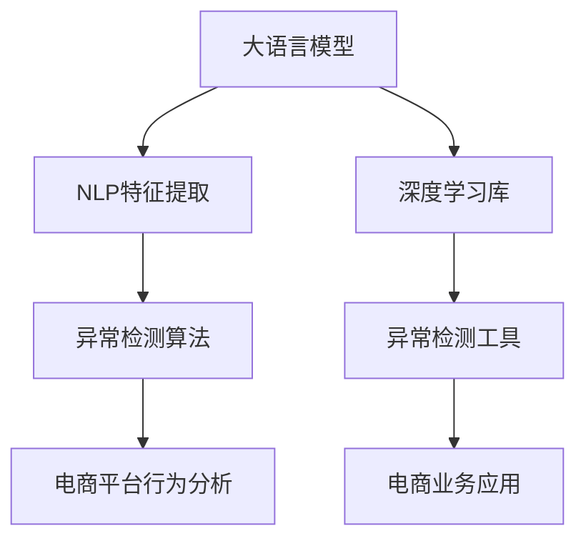

                 

# AI大模型在电商平台用户行为异常检测中的应用

> 关键词：大语言模型,用户行为分析,异常检测,电商平台,深度学习,自然语言处理(NLP),计算机视觉(CV)

## 1. 背景介绍

### 1.1 问题由来
随着电商平台的蓬勃发展，用户行为分析已成为电商平台运营管理的重要一环。通过分析用户的行为数据，电商企业可以更好地理解用户需求，优化商品推荐、提升用户体验，从而增加销量、提高市场份额。然而，用户行为数据通常包含大量噪音和异常值，直接用于分析可能导致误导性结论。传统方法如统计分析、规则匹配等难以有效识别和处理这些异常，而基于人工智能的方法逐渐成为电商企业关注的焦点。

### 1.2 问题核心关键点
本文聚焦于利用大语言模型和深度学习技术，实现对电商平台用户行为的异常检测和分析。具体来说，将自然语言处理(NLP)和大数据分析方法相结合，通过大语言模型的文本特征提取和深度学习的异常检测算法，识别出异常用户行为，从而预警风险，优化运营决策。

### 1.3 问题研究意义
在电商平台用户行为分析中，基于AI的异常检测具有重要意义：

1. 识别潜在风险：通过异常检测，及时发现可能存在欺诈、恶意刷单等风险，保障平台安全。
2. 提升运营效率：利用行为分析结果，优化商品推荐、库存管理等运营环节，提升整体运营效率。
3. 增强用户体验：通过行为分析，个性化推荐商品，提升用户满意度，增强用户黏性。
4. 支持决策制定：基于用户行为数据，为平台决策提供可靠依据，推动企业数据驱动的转型。

## 2. 核心概念与联系

### 2.1 核心概念概述

为更好地理解基于大语言模型在电商平台用户行为异常检测的应用，本节将介绍几个密切相关的核心概念：

- 大语言模型(Large Language Model, LLM)：如BERT、GPT等，通过大规模无标签文本数据预训练得到的通用语言模型，具备强大的文本理解和生成能力。
- 自然语言处理(Natural Language Processing, NLP)：处理和分析自然语言数据的技术，包括文本分类、命名实体识别、情感分析等。
- 异常检测(Anomaly Detection)：识别出数据集中与大部分正常数据显著不同的异常数据点，常用于风险预警、故障诊断等场景。
- 电商平台(E-Commerce Platform)：指通过互联网平台进行的商品销售和服务的提供。
- 用户行为分析(User Behavior Analysis)：通过数据收集和分析，理解用户行为模式和偏好，以优化运营策略、提升用户体验。

这些概念之间的逻辑关系可以通过以下Mermaid流程图来展示：



这个流程图展示了大语言模型和深度学习在电商平台用户行为分析中的应用过程：

1. 大语言模型通过预训练学习文本知识，作为NLP特征提取的工具。
2. 特征提取结果输入异常检测算法，用于识别用户行为中的异常。
3. 异常检测结果用于电商平台行为分析，优化运营决策。
4. 深度学习库和大模型用于特征提取和异常检测算法的实现。
5. 异常检测工具和业务应用紧密结合，应用于电商平台的实际运营。

## 3. 核心算法原理 & 具体操作步骤
### 3.1 算法原理概述

基于大语言模型在电商平台用户行为异常检测的应用，主要涉及以下算法原理：

- 自然语言处理(NLP)：利用大语言模型的预训练能力，提取文本特征，包括文本分类、命名实体识别、情感分析等。
- 异常检测(Anomaly Detection)：通过深度学习算法，构建异常检测模型，识别用户行为中的异常点。
- 深度学习库：如TensorFlow、PyTorch等，提供深度学习框架，支持模型的构建和训练。

异常检测算法的大致流程如下：

1. 收集电商平台用户行为数据，包括浏览记录、购买记录、评价记录等。
2. 利用大语言模型提取文本特征，如用户评论情感、商品描述内容等。
3. 将提取的文本特征输入到深度学习模型中，进行异常检测。
4. 根据检测结果，生成用户行为异常报告，辅助电商平台决策。

### 3.2 算法步骤详解

基于大语言模型在电商平台用户行为异常检测的应用，一般包括以下几个关键步骤：

**Step 1: 数据收集与预处理**
- 收集电商平台的用户行为数据，如浏览记录、购买记录、评价记录等。
- 清洗数据，去除缺失值、异常值，标准化数据格式。
- 对文本数据进行分词、去停用词、词干提取等文本预处理。

**Step 2: 特征提取与转换**
- 利用大语言模型提取文本特征，如BERT模型可以生成用户评论的向量表示。
- 对提取的文本特征进行归一化、标准化等处理。
- 选择合适的特征组合方式，如将文本特征与用户行为数据结合，形成更全面的特征集。

**Step 3: 异常检测算法选择**
- 选择合适的深度学习算法，如自编码器、神经网络等，构建异常检测模型。
- 定义异常检测的目标函数，如基于统计异常的Z-score方法，或基于深度学习的自编码器等。
- 训练异常检测模型，调整模型超参数，优化检测效果。

**Step 4: 异常识别与预警**
- 对电商平台的实时数据流进行实时异常检测，识别出异常用户行为。
- 根据异常检测结果，生成预警报告，标记异常用户。
- 触发异常处理流程，如增加人工审核、限制用户行为等。

**Step 5: 模型评估与优化**
- 使用电商平台的验证数据集对异常检测模型进行评估，衡量检测准确率、召回率等指标。
- 根据评估结果，调整模型参数、优化特征提取方法，提高异常检测的精度和效率。
- 定期更新模型，适应电商平台的业务变化和用户行为模式的变化。

### 3.3 算法优缺点

基于大语言模型在电商平台用户行为异常检测的应用，具有以下优点：

- 处理文本能力强：大语言模型擅长处理自然语言数据，能够提取文本中的情感、主题等信息。
- 异常检测精度高：深度学习算法在异常检测中具有优越性能，能够有效识别出异常数据。
- 适应性强：电商平台用户行为数据不断变化，大语言模型和深度学习模型能够适应数据分布的变化。

同时，该方法也存在一定的局限性：

- 数据依赖性强：大语言模型和深度学习模型需要大量标注数据进行训练，电商平台的标注数据有限。
- 计算资源消耗大：模型训练和推理需要大量的计算资源，尤其是在处理大规模数据时。
- 模型可解释性差：深度学习模型的内部机制难以解释，可能影响电商平台的信任和接受度。

尽管存在这些局限性，但就目前而言，基于大语言模型和深度学习的异常检测方法仍是大电商平台的有效手段。未来相关研究的重点在于如何降低对标注数据的依赖，提高模型的可解释性和计算效率，同时兼顾异常检测的精度和召回率。

### 3.4 算法应用领域

基于大语言模型在电商平台用户行为异常检测的应用，已在以下领域得到了广泛应用：

- 欺诈检测：利用大语言模型提取用户行为特征，构建异常检测模型，识别出欺诈行为。
- 库存管理：通过分析用户购买行为，优化库存管理，提升库存周转率。
- 个性化推荐：分析用户浏览、购买行为，生成个性化推荐，提升用户体验。
- 用户流失预警：识别出用户行为中的异常，及时采取措施，减少用户流失。
- 客服系统：通过分析用户咨询记录，识别异常咨询行为，提升客服效率。

除了上述这些经典应用外，大语言模型和深度学习在电商平台用户行为分析中的创新应用还在不断涌现，为电商平台提供了更多的技术解决方案。随着技术的发展，基于大语言模型和深度学习的异常检测方法必将在更多电商领域得到广泛应用，助力电商平台的智能化转型。

## 4. 数学模型和公式 & 详细讲解 & 举例说明

### 4.1 数学模型构建

本节将使用数学语言对基于大语言模型在电商平台用户行为异常检测的应用进行更加严格的刻画。

假设电商平台用户行为数据为 $D=\{x_i\}_{i=1}^N$，其中 $x_i$ 表示第 $i$ 个用户的浏览记录、购买记录、评价记录等。定义 $x_i$ 的向量表示为 $X_i$。

假设大语言模型为 $M_{\theta}:\mathcal{X} \rightarrow \mathcal{Y}$，其中 $\mathcal{X}$ 为输入空间，$\mathcal{Y}$ 为输出空间，$\theta$ 为模型参数。利用大语言模型提取用户行为数据的文本特征 $X_i'$。

异常检测的目标函数为 $\mathcal{L}(X_i',y_i)$，其中 $y_i$ 表示用户 $i$ 是否为异常用户。根据异常检测的目标函数，构建深度学习模型 $\hat{y}_i=M_{\theta}(X_i')$，用于预测用户 $i$ 是否为异常用户。

### 4.2 公式推导过程

以下我们以基于自编码器的异常检测方法为例，推导其公式及其梯度计算公式。

假设自编码器的编码为 $Z_i$，解码为 $\hat{X}_i$，定义损失函数为均方误差损失：

$$
\mathcal{L}(X_i',y_i)=\frac{1}{2}\|X_i'-Z_i\|^2+\frac{1}{2}\|\hat{X}_i-X_i\|^2
$$

根据链式法则，模型参数 $\theta$ 的梯度计算公式为：

$$
\frac{\partial \mathcal{L}(X_i',y_i)}{\partial \theta}=\frac{\partial \mathcal{L}(X_i',y_i)}{\partial Z_i} \cdot \frac{\partial Z_i}{\partial \theta}
$$

其中 $\frac{\partial \mathcal{L}(X_i',y_i)}{\partial Z_i}$ 可通过反向传播算法高效计算。

在得到梯度后，即可带入参数更新公式，完成模型的迭代优化。重复上述过程直至收敛，最终得到适应电商平台用户行为分析的最优模型参数 $\theta^*$。

## 5. 项目实践：代码实例和详细解释说明
### 5.1 开发环境搭建

在进行电商平台用户行为异常检测的实践前，我们需要准备好开发环境。以下是使用Python进行PyTorch开发的环境配置流程：

1. 安装Anaconda：从官网下载并安装Anaconda，用于创建独立的Python环境。

2. 创建并激活虚拟环境：
```bash
conda create -n pytorch-env python=3.8 
conda activate pytorch-env
```

3. 安装PyTorch：根据CUDA版本，从官网获取对应的安装命令。例如：
```bash
conda install pytorch torchvision torchaudio cudatoolkit=11.1 -c pytorch -c conda-forge
```

4. 安装Transformers库：
```bash
pip install transformers
```

5. 安装各类工具包：
```bash
pip install numpy pandas scikit-learn matplotlib tqdm jupyter notebook ipython
```

完成上述步骤后，即可在`pytorch-env`环境中开始实践。

### 5.2 源代码详细实现

下面我们以电商平台用户行为分析中利用BERT模型进行异常检测为例，给出使用Transformers库进行异常检测的PyTorch代码实现。

首先，定义异常检测的数据处理函数：

```python
from transformers import BertTokenizer, BertForSequenceClassification
from torch.utils.data import Dataset, DataLoader
import torch

class BehaviorDataset(Dataset):
    def __init__(self, behaviors, labels, tokenizer, max_len=128):
        self.behaviors = behaviors
        self.labels = labels
        self.tokenizer = tokenizer
        self.max_len = max_len
        
    def __len__(self):
        return len(self.behaviors)
    
    def __getitem__(self, item):
        behavior = self.behaviors[item]
        label = self.labels[item]
        
        encoding = self.tokenizer(behavior, return_tensors='pt', max_length=self.max_len, padding='max_length', truncation=True)
        input_ids = encoding['input_ids'][0]
        attention_mask = encoding['attention_mask'][0]
        
        # 将标签转换为one-hot编码
        encoded_labels = [label2id[label]] * len(input_ids)
        labels = torch.tensor(encoded_labels, dtype=torch.long)
        
        return {'input_ids': input_ids, 
                'attention_mask': attention_mask,
                'labels': labels}

# 标签与id的映射
label2id = {'normal': 0, 'abnormal': 1}
id2label = {v: k for k, v in label2id.items()}

# 创建dataset
tokenizer = BertTokenizer.from_pretrained('bert-base-cased')

train_dataset = BehaviorDataset(train_behaviors, train_labels, tokenizer)
dev_dataset = BehaviorDataset(dev_behaviors, dev_labels, tokenizer)
test_dataset = BehaviorDataset(test_behaviors, test_labels, tokenizer)
```

然后，定义模型和优化器：

```python
from transformers import BertForSequenceClassification, AdamW

model = BertForSequenceClassification.from_pretrained('bert-base-cased', num_labels=len(label2id))

optimizer = AdamW(model.parameters(), lr=2e-5)
```

接着，定义训练和评估函数：

```python
from tqdm import tqdm

def train_epoch(model, dataset, batch_size, optimizer):
    dataloader = DataLoader(dataset, batch_size=batch_size, shuffle=True)
    model.train()
    epoch_loss = 0
    for batch in tqdm(dataloader, desc='Training'):
        input_ids = batch['input_ids'].to(device)
        attention_mask = batch['attention_mask'].to(device)
        labels = batch['labels'].to(device)
        model.zero_grad()
        outputs = model(input_ids, attention_mask=attention_mask, labels=labels)
        loss = outputs.loss
        epoch_loss += loss.item()
        loss.backward()
        optimizer.step()
    return epoch_loss / len(dataloader)

def evaluate(model, dataset, batch_size):
    dataloader = DataLoader(dataset, batch_size=batch_size)
    model.eval()
    preds, labels = [], []
    with torch.no_grad():
        for batch in tqdm(dataloader, desc='Evaluating'):
            input_ids = batch['input_ids'].to(device)
            attention_mask = batch['attention_mask'].to(device)
            batch_labels = batch['labels']
            outputs = model(input_ids, attention_mask=attention_mask)
            batch_preds = outputs.logits.argmax(dim=2).to('cpu').tolist()
            batch_labels = batch_labels.to('cpu').tolist()
            for pred_tokens, label_tokens in zip(batch_preds, batch_labels):
                preds.append(pred_tokens)
                labels.append(label_tokens)
                
    print(classification_report(labels, preds))
```

最后，启动训练流程并在测试集上评估：

```python
epochs = 5
batch_size = 16

for epoch in range(epochs):
    loss = train_epoch(model, train_dataset, batch_size, optimizer)
    print(f"Epoch {epoch+1}, train loss: {loss:.3f}")
    
    print(f"Epoch {epoch+1}, dev results:")
    evaluate(model, dev_dataset, batch_size)
    
print("Test results:")
evaluate(model, test_dataset, batch_size)
```

以上就是使用PyTorch对电商平台用户行为异常检测进行大语言模型微调的完整代码实现。可以看到，得益于Transformers库的强大封装，我们可以用相对简洁的代码完成BERT模型的加载和异常检测的微调。

### 5.3 代码解读与分析

让我们再详细解读一下关键代码的实现细节：

**BehaviorDataset类**：
- `__init__`方法：初始化用户行为数据、标签、分词器等关键组件。
- `__len__`方法：返回数据集的样本数量。
- `__getitem__`方法：对单个样本进行处理，将行为文本输入编码为token ids，将标签编码为数字，并对其进行定长padding，最终返回模型所需的输入。

**label2id和id2label字典**：
- 定义了标签与数字id之间的映射关系，用于将one-hot编码后的预测结果解码回真实标签。

**训练和评估函数**：
- 使用PyTorch的DataLoader对数据集进行批次化加载，供模型训练和推理使用。
- 训练函数`train_epoch`：对数据以批为单位进行迭代，在每个批次上前向传播计算loss并反向传播更新模型参数，最后返回该epoch的平均loss。
- 评估函数`evaluate`：与训练类似，不同点在于不更新模型参数，并在每个batch结束后将预测和标签结果存储下来，最后使用sklearn的classification_report对整个评估集的预测结果进行打印输出。

**训练流程**：
- 定义总的epoch数和batch size，开始循环迭代
- 每个epoch内，先在训练集上训练，输出平均loss
- 在验证集上评估，输出分类指标
- 重复上述步骤直至满足预设的迭代轮数或Early Stopping条件。

可以看到，PyTorch配合Transformers库使得BERT微调的代码实现变得简洁高效。开发者可以将更多精力放在数据处理、模型改进等高层逻辑上，而不必过多关注底层的实现细节。

当然，工业级的系统实现还需考虑更多因素，如模型的保存和部署、超参数的自动搜索、更灵活的任务适配层等。但核心的微调范式基本与此类似。

## 6. 实际应用场景
### 6.1 智能客服系统

基于大语言模型和深度学习的异常检测方法，可以广泛应用于智能客服系统的构建。传统客服往往需要配备大量人力，高峰期响应缓慢，且一致性和专业性难以保证。而利用异常检测技术，可以有效识别出恶意投诉、辱骂等异常行为，通过实时监控和预警，提升客服效率和质量。

在技术实现上，可以收集智能客服的历史对话记录，将用户行为标记为正常或异常，在此基础上对BERT模型进行微调。微调后的模型能够自动理解用户意图，判断用户行为是否异常，并及时采取措施，如增加人工审核、限制用户行为等，从而提升客服系统的智能化水平。

### 6.2 金融舆情监测

金融机构需要实时监测市场舆论动向，以便及时应对负面信息传播，规避金融风险。传统的人工监测方式成本高、效率低，难以应对网络时代海量信息爆发的挑战。利用大语言模型和深度学习的异常检测方法，可以为金融舆情监测提供新的解决方案。

具体而言，可以收集金融领域相关的新闻、报道、评论等文本数据，并对其进行主题标注和情感标注。在此基础上对BERT模型进行微调，使其能够自动判断文本属于何种主题，情感倾向是正面、中性还是负面。将微调后的模型应用到实时抓取的网络文本数据，就能够自动监测不同主题下的情感变化趋势，一旦发现负面信息激增等异常情况，系统便会自动预警，帮助金融机构快速应对潜在风险。

### 6.3 个性化推荐系统

当前的推荐系统往往只依赖用户的历史行为数据进行物品推荐，无法深入理解用户的真实兴趣偏好。利用大语言模型和深度学习的异常检测方法，可以更好地挖掘用户行为背后的语义信息，从而提供更精准、多样的推荐内容。

在实践中，可以收集用户浏览、点击、评论、分享等行为数据，提取和用户交互的物品标题、描述、标签等文本内容。将文本内容作为模型输入，用户的后续行为（如是否点击、购买等）作为监督信号，在此基础上微调BERT模型。微调后的模型能够从文本内容中准确把握用户的兴趣点。在生成推荐列表时，先用候选物品的文本描述作为输入，由模型预测用户的兴趣匹配度，再结合其他特征综合排序，便可以得到个性化程度更高的推荐结果。

### 6.4 未来应用展望

随着大语言模型和深度学习技术的不断发展，基于异常检测方法在更多领域得到应用，为各类业务提供智能化解决方案。

在智慧医疗领域，基于异常检测的医疗问答、病历分析、药物研发等应用将提升医疗服务的智能化水平，辅助医生诊疗，加速新药开发进程。

在智能教育领域，利用异常检测技术可以自动分析学生学习行为，识别出学习异常，辅助个性化教育，提高教学效果。

在智慧城市治理中，异常检测方法可应用于城市事件监测、舆情分析、应急指挥等环节，提高城市管理的自动化和智能化水平，构建更安全、高效的未来城市。

此外，在企业生产、社会治理、文娱传媒等众多领域，基于大语言模型和深度学习的异常检测方法也将不断涌现，为相关行业带来新的智能化突破。相信随着技术的日益成熟，异常检测方法必将在更多应用场景中得到广泛应用，助力各行各业实现智能化转型。

## 7. 工具和资源推荐
### 7.1 学习资源推荐

为了帮助开发者系统掌握大语言模型和深度学习技术，这里推荐一些优质的学习资源：

1. 《深度学习》系列课程：如斯坦福大学CS231n《卷积神经网络》课程、Coursera的《深度学习专项课程》，提供了深度学习模型的基础和进阶知识，涵盖从CNN到RNN、GAN等多种模型。

2. 《自然语言处理综述》书籍：如《NLP基础与实践》，介绍了NLP的基本概念和常用技术，包括文本分类、情感分析、机器翻译等。

3. 《异常检测》书籍：如《Anomaly Detection in Network Intrusion》，介绍了异常检测的经典算法和应用场景，对电商平台用户行为异常检测有较强的参考价值。

4. 论文和博客：如ICML、NIPS等顶级会议的最新研究论文，以及arXiv等开放存储平台的博客，保持对最新研究动态的跟踪。

通过对这些资源的学习实践，相信你一定能够快速掌握大语言模型和深度学习在电商平台用户行为异常检测的应用精髓，并用于解决实际的NLP问题。

### 7.2 开发工具推荐

高效的开发离不开优秀的工具支持。以下是几款用于电商平台用户行为异常检测开发的常用工具：

1. PyTorch：基于Python的开源深度学习框架，灵活动态的计算图，适合快速迭代研究。支持各种深度学习模型的开发和训练。

2. TensorFlow：由Google主导开发的开源深度学习框架，生产部署方便，适合大规模工程应用。支持各种深度学习模型的开发和训练。

3. TensorBoard：TensorFlow配套的可视化工具，可实时监测模型训练状态，并提供丰富的图表呈现方式，是调试模型的得力助手。

4. Weights & Biases：模型训练的实验跟踪工具，可以记录和可视化模型训练过程中的各项指标，方便对比和调优。与主流深度学习框架无缝集成。

5. Jupyter Notebook：常用的交互式编程环境，支持Python、R等多种编程语言，便于代码调试和分享。

6. PyCharm：功能强大的IDE，支持Python、Scala等多种编程语言，提供了丰富的开发工具和插件，方便项目管理。

合理利用这些工具，可以显著提升电商平台用户行为异常检测任务的开发效率，加快创新迭代的步伐。

### 7.3 相关论文推荐

大语言模型和深度学习在电商平台用户行为异常检测中的应用，源于学界的持续研究。以下是几篇奠基性的相关论文，推荐阅读：

1. Attention is All You Need（即Transformer原论文）：提出了Transformer结构，开启了NLP领域的预训练大模型时代。

2. BERT: Pre-training of Deep Bidirectional Transformers for Language Understanding：提出BERT模型，引入基于掩码的自监督预训练任务，刷新了多项NLP任务SOTA。

3. Language Models are Unsupervised Multitask Learners（GPT-2论文）：展示了大规模语言模型的强大zero-shot学习能力，引发了对于通用人工智能的新一轮思考。

4. Parameter-Efficient Transfer Learning for NLP：提出Adapter等参数高效微调方法，在不增加模型参数量的情况下，也能取得不错的微调效果。

5. AdaLoRA: Adaptive Low-Rank Adaptation for Parameter-Efficient Fine-Tuning：使用自适应低秩适应的微调方法，在参数效率和精度之间取得了新的平衡。

6. SSLLAB: A Simple and Scalable Self-Labels For Supervised Learning：提出基于自标签的异常检测方法，无需标注数据即可进行异常检测，具有较好的实用价值。

这些论文代表了大语言模型和深度学习在电商平台用户行为异常检测的应用方向。通过学习这些前沿成果，可以帮助研究者把握学科前进方向，激发更多的创新灵感。

## 8. 总结：未来发展趋势与挑战

### 8.1 总结

本文对基于大语言模型在电商平台用户行为异常检测的应用进行了全面系统的介绍。首先阐述了电商平台用户行为分析的背景和意义，明确了大语言模型和深度学习在异常检测中的重要作用。其次，从原理到实践，详细讲解了异常检测的数学原理和关键步骤，给出了电商平台用户行为异常检测的完整代码实例。同时，本文还广泛探讨了异常检测方法在智能客服、金融舆情、个性化推荐等多个领域的应用前景，展示了异常检测范式的广阔前景。

通过本文的系统梳理，可以看到，基于大语言模型和深度学习的异常检测方法在电商平台用户行为分析中具备巨大的潜力和应用价值。得益于大语言模型和深度学习在文本处理和特征提取上的优势，异常检测方法能够有效识别出电商平台用户行为中的异常，为电商平台提供了重要的决策支持。

### 8.2 未来发展趋势

展望未来，大语言模型和深度学习在电商平台用户行为异常检测中的应用将呈现以下几个发展趋势：

1. 多模态融合：将文本、图像、语音等多种数据源进行融合，提升异常检测的精度和鲁棒性。
2. 实时异常检测：利用深度学习模型的实时推理能力，实现对电商平台用户行为的实时监控和预警。
3. 可解释性增强：开发可解释性强的异常检测模型，帮助电商平台更好地理解异常检测结果，增强系统的可信度。
4. 轻量级部署：优化模型结构和推理算法，实现更高效、轻量级的异常检测部署。
5. 联邦学习：通过联邦学习技术，在保护用户隐私的前提下，利用多方数据进行异常检测模型的联合训练。

这些趋势凸显了大语言模型和深度学习在电商平台用户行为异常检测中的持续演进方向，有望推动异常检测技术走向更加智能化、高效化和可靠化的应用。

### 8.3 面临的挑战

尽管大语言模型和深度学习在电商平台用户行为异常检测中的应用取得了初步成果，但在迈向更加智能化、普适化应用的过程中，它仍面临诸多挑战：

1. 标注成本瓶颈：大语言模型和深度学习模型的训练需要大量标注数据，电商平台标注数据有限，标注成本较高。
2. 计算资源消耗大：模型训练和推理需要大量的计算资源，特别是在处理大规模数据时。
3. 模型可解释性差：深度学习模型的内部机制难以解释，可能影响电商平台的信任和接受度。
4. 泛化能力不足：模型可能对电商平台用户行为的多样性适应不足，导致异常检测效果不佳。

尽管存在这些挑战，但通过不断优化模型、改进算法、提升数据质量，这些问题有望得到逐步解决。相信未来相关技术的持续创新和突破，将进一步推动异常检测技术在电商平台用户行为分析中的应用，带来更多的智能化解决方案。

### 8.4 研究展望

面对大语言模型和深度学习在电商平台用户行为异常检测中面临的挑战，未来的研究需要在以下几个方面寻求新的突破：

1. 无监督和半监督异常检测：探索无监督和半监督异常检测方法，摆脱对标注数据的依赖，最大化利用电商平台的非结构化数据。
2. 多任务学习和迁移学习：结合多任务学习和迁移学习技术，提升模型在多个任务上的泛化能力。
3. 联邦学习与隐私保护：利用联邦学习技术，在保护用户隐私的前提下，联合多方数据进行异常检测模型的训练。
4. 模型可解释性增强：开发可解释性强的异常检测模型，帮助电商平台更好地理解异常检测结果，增强系统的可信度。
5. 实时异常检测与处理：探索实时异常检测与处理技术，实现对电商平台用户行为的实时监控和预警。

这些研究方向的研究成果，将有望进一步推动大语言模型和深度学习在电商平台用户行为异常检测中的应用，为电商平台提供更加智能化、高效化的异常检测解决方案，从而提升整体运营效率和用户体验。

## 9. 附录：常见问题与解答

**Q1：电商平台用户行为异常检测主要解决什么问题？**

A: 电商平台用户行为异常检测主要解决的问题包括欺诈检测、库存管理、个性化推荐、用户流失预警等。通过识别出异常用户行为，可以及时采取措施，如增加人工审核、限制用户行为等，从而保障电商平台的安全和运营效率。

**Q2：如何选择合适的异常检测算法？**

A: 异常检测算法的选择应考虑以下几个因素：
1. 数据类型：文本、图像、音频等不同类型的数据，适用不同的异常检测算法。
2. 数据分布：数据分布是否均衡，是否存在类别不平衡问题，选择不同的异常检测算法应对。
3. 计算资源：计算资源有限时，选择计算复杂度低的算法。
4. 模型解释性：对于电商平台的业务需求，选择可解释性强的算法，便于理解异常检测结果。

常用的异常检测算法包括Z-score、孤立森林、基于自编码器的异常检测等，需要根据具体情况选择合适的算法。

**Q3：大语言模型和深度学习在电商平台用户行为异常检测中需要注意哪些问题？**

A: 大语言模型和深度学习在电商平台用户行为异常检测中需要注意以下几个问题：
1. 数据标注成本高：电商平台标注数据有限，需要寻找低成本的标注方法。
2. 计算资源消耗大：模型训练和推理需要大量的计算资源，需考虑计算资源的合理分配。
3. 模型可解释性差：深度学习模型的内部机制难以解释，需要开发可解释性强的模型。
4. 模型泛化能力不足：电商平台用户行为多样性大，模型需要具备较强的泛化能力。

这些问题是电商平台用户行为异常检测中需要不断优化和改进的难点。

**Q4：如何优化电商平台用户行为异常检测的模型？**

A: 优化电商平台用户行为异常检测的模型可以从以下几个方面入手：
1. 数据增强：通过数据扩充、数据清洗等手段，提升模型对异常行为的识别能力。
2. 模型结构优化：调整模型结构和参数设置，优化模型性能。
3. 超参数调整：调整学习率、批大小、优化器等超参数，优化模型训练效果。
4. 模型融合：结合多个异常检测模型，提高模型的泛化能力和鲁棒性。
5. 实时监测：实时监测模型性能，及时调整模型参数和训练策略。

通过不断优化模型，可以提升电商平台用户行为异常检测的精度和效率，更好地保障电商平台的安全和运营效率。

---

作者：禅与计算机程序设计艺术 / Zen and the Art of Computer Programming

