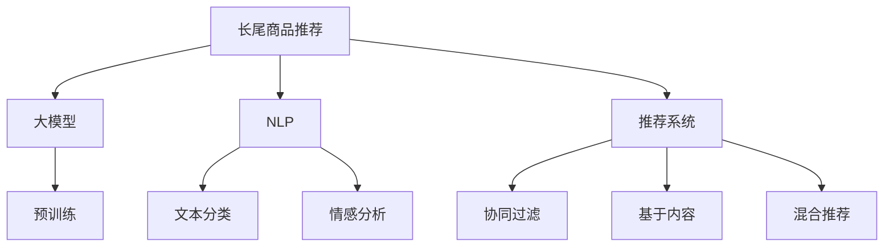

                 

# AI大模型在长尾商品推荐中的应用

> 关键词：长尾商品推荐,大模型,自然语言处理,NLP,推荐系统,预训练模型,微调,参数高效微调,推荐算法

## 1. 背景介绍

### 1.1 问题由来

随着电商行业的不断发展，市场竞争日益激烈，电商企业需要不断提升商品推荐系统的性能，才能在激烈的市场竞争中脱颖而出。传统的推荐系统依赖于用户历史行为数据进行推荐，但这些数据往往只能覆盖热门商品，对于长尾商品（即用户购买率较低但种类丰富的商品），用户行为数据稀疏，难以进行有效的推荐。

长尾商品推荐成为电商推荐系统的重大挑战。用户往往在浏览长尾商品时，需要花费更多的时间和精力来查找和选择，若不能快速找到满意的商品，容易放弃购买。因此，如何准确推荐长尾商品，成为电商企业亟需解决的问题。

### 1.2 问题核心关键点

为解决长尾商品推荐的难题，近年来AI大模型在商品推荐系统中的应用逐渐得到关注。通过预训练大模型和微调技术，电商推荐系统可以在有限的标注数据下，通过大模型自动获取商品特征，从而对长尾商品进行推荐。这不仅能提升推荐的覆盖率和准确率，还能挖掘潜在客户，为电商企业创造更多价值。

本文聚焦于基于大模型的长尾商品推荐方法，但同时也会兼顾参数高效微调和推荐算法等前沿技术，以期对电商推荐系统实践提供更全面的指导。

### 1.3 问题研究意义

研究基于大模型的长尾商品推荐方法，对于拓展大模型的应用范围，提升电商推荐系统的性能，加速电商推荐技术的产业化进程，具有重要意义：

1. 降低推荐成本。大模型的预训练和微调，可以在有限的标注数据下，快速获取商品特征，从而节省标注成本。
2. 提升推荐效果。大模型在长尾商品推荐上表现优异，能够准确把握用户潜在需求，提升电商的推荐效果。
3. 加速推荐迭代。基于大模型进行微调，可以迅速适配新的推荐场景，缩短电商推荐系统的开发周期。
4. 带来技术创新。大模型的长尾商品推荐方法，涉及自然语言处理(NLP)和推荐算法的新技术，为电商推荐带来新的研究方向。
5. 赋能电商增长。长尾商品推荐可以扩大电商的业务范围，挖掘更多用户需求，提升电商的竞争力。

## 2. 核心概念与联系

### 2.1 核心概念概述

为更好地理解基于大模型的长尾商品推荐方法，本节将介绍几个密切相关的核心概念：

- 长尾商品推荐（Long-tail Item Recommendation）：指在推荐系统中，对用户可能感兴趣但购买概率较低的商品进行推荐，以提升用户购买率和电商收入。
- 大模型（Large Model）：指通过大规模无标签文本数据预训练得到的语言模型，如BERT、GPT等，具备强大的语言理解和生成能力。
- 自然语言处理（NLP）：指使用计算机对自然语言文本进行处理和理解，包括文本分类、情感分析、实体识别等任务。
- 推荐系统（Recommendation System）：指使用机器学习或深度学习算法，根据用户历史行为和商品特征，推荐用户可能感兴趣的商品的系统。
- 预训练模型（Pre-trained Model）：指在大规模无标签文本数据上预训练得到的模型，学习通用的语言表示。
- 微调（Fine-tuning）：指在预训练模型的基础上，使用下游任务的少量标注数据，通过有监督学习优化模型在特定任务上的性能。
- 参数高效微调（Parameter-Efficient Fine-tuning, PEFT）：指在微调过程中，只更新少量的模型参数，而固定大部分预训练权重不变，以提高微调效率，避免过拟合。
- 推荐算法（Recommendation Algorithm）：指用于生成商品推荐结果的算法，包括协同过滤、基于内容的推荐、混合推荐等方法。

这些核心概念之间的逻辑关系可以通过以下Mermaid流程图来展示：



这个流程图展示了大模型在长尾商品推荐中的核心概念及其之间的关系：

1. 长尾商品推荐通过大模型获取商品特征。
2. 大模型通过预训练学习通用的语言表示。
3. 自然语言处理帮助大模型更好地理解商品描述和用户评论。
4. 推荐系统根据用户历史行为和商品特征，生成推荐结果。
5. 预训练模型和微调技术使推荐系统更加高效和精准。
6. 推荐算法结合大模型的输出，进行具体的推荐计算。

这些概念共同构成了长尾商品推荐的实现框架，使其能够高效、准确地推荐长尾商品。通过理解这些核心概念，我们可以更好地把握长尾商品推荐的实现方法和优化策略。

## 3. 核心算法原理 & 具体操作步骤
### 3.1 算法原理概述

基于大模型的长尾商品推荐方法，本质上是一种有监督的细粒度迁移学习过程。其核心思想是：将大语言模型视作一个强大的"特征提取器"，通过在长尾商品的标注数据上进行有监督的微调，使得模型能够自动提取商品特征，并根据这些特征推荐给可能感兴趣的用户。

形式化地，假设长尾商品推荐任务的数据集为 $D=\{(x_i, y_i)\}_{i=1}^N, x_i \in \mathcal{X}, y_i \in \mathcal{Y}$，其中 $x_i$ 为商品描述，$y_i$ 为该商品是否被用户购买。大模型 $M_{\theta}$ 在输入 $x_i$ 上的输出为 $\hat{y}=M_{\theta}(x_i) \in [0,1]$，表示商品被用户购买的概率。

微调的目标是找到最优参数 $\theta^*$，使得模型在长尾商品推荐任务上的损失函数最小化：

$$
\theta^* = \mathop{\arg\min}_{\theta} \sum_{i=1}^N \ell(\hat{y}_i,y_i)
$$

其中 $\ell$ 为损失函数，通常为交叉熵损失。

通过梯度下降等优化算法，微调过程不断更新模型参数 $\theta$，最小化损失函数 $\ell$，使得模型输出逼近真实标签。由于 $\theta$ 已经通过预训练获得了较好的初始化，因此即便在长尾商品推荐这样小规模数据集上进行微调，也能较快收敛到理想的模型参数 $\theta^*$。

### 3.2 算法步骤详解

基于大模型的长尾商品推荐方法一般包括以下几个关键步骤：

**Step 1: 准备数据集**

- 收集长尾商品的数据，包括商品描述、用户购买行为等，作为标注数据。
- 划分为训练集、验证集和测试集。
- 对数据进行预处理，如去除停用词、词形还原等，以便后续使用。

**Step 2: 添加任务适配层**

- 根据任务类型，在预训练模型的顶层设计合适的输出层和损失函数。
- 对于二分类任务，通常使用二元交叉熵损失函数。
- 对于回归任务，通常使用均方误差损失函数。

**Step 3: 设置微调超参数**

- 选择合适的优化算法及其参数，如 AdamW、SGD 等，设置学习率、批大小、迭代轮数等。
- 设置正则化技术及强度，包括权重衰减、Dropout、Early Stopping 等。
- 确定冻结预训练参数的策略，如仅微调顶层，或全部参数都参与微调。

**Step 4: 执行梯度训练**

- 将训练集数据分批次输入模型，前向传播计算损失函数。
- 反向传播计算参数梯度，根据设定的优化算法和学习率更新模型参数。
- 周期性在验证集上评估模型性能，根据性能指标决定是否触发 Early Stopping。
- 重复上述步骤直到满足预设的迭代轮数或 Early Stopping 条件。

**Step 5: 测试和部署**

- 在测试集上评估微调后模型 $M_{\hat{\theta}}$ 的性能，对比微调前后的精度提升。
- 使用微调后的模型对新样本进行推理预测，集成到实际的应用系统中。
- 持续收集新的数据，定期重新微调模型，以适应数据分布的变化。

以上是基于大模型的长尾商品推荐的一般流程。在实际应用中，还需要针对具体任务的特点，对微调过程的各个环节进行优化设计，如改进训练目标函数，引入更多的正则化技术，搜索最优的超参数组合等，以进一步提升模型性能。

### 3.3 算法优缺点

基于大模型的长尾商品推荐方法具有以下优点：

1. 简单高效。只需准备少量标注数据，即可对预训练模型进行快速适配，获得较大的性能提升。
2. 泛化能力强。大模型在长尾商品推荐上表现优异，能够准确把握用户潜在需求，提升电商的推荐效果。
3. 参数高效。利用参数高效微调技术，在固定大部分预训练参数的情况下，仍可取得不错的推荐效果。
4. 适用性强。适用于各种长尾商品推荐任务，包括文本分类、用户行为分析、商品相似性计算等，设计简单的任务适配层即可实现。

同时，该方法也存在一定的局限性：

1. 数据依赖。长尾商品推荐的效果很大程度上取决于标注数据的质量和数量，获取高质量标注数据的成本较高。
2. 迁移能力有限。当目标任务与预训练数据的分布差异较大时，微调的性能提升有限。
3. 过拟合风险。大模型的复杂性可能导致在长尾商品推荐上出现过拟合现象，需进一步优化。
4. 计算成本高。大模型的预训练和微调，需要大量的计算资源，对硬件要求较高。
5. 模型复杂。大模型在结构上较为复杂，推理速度较慢，需要高效的模型压缩和优化技术。

尽管存在这些局限性，但就目前而言，基于大模型的长尾商品推荐方法仍是大模型应用的最主流范式。未来相关研究的重点在于如何进一步降低对标注数据的依赖，提高模型的迁移能力和泛化能力，同时兼顾模型复杂度和计算效率。

### 3.4 算法应用领域

基于大模型的长尾商品推荐方法，已经在电商推荐系统、个性化商品推荐、智能客服等诸多领域得到应用，为电商平台带来了显著的业务增长。

在电商推荐系统上，通过将长尾商品描述输入微调后的模型，模型能够自动提取商品的关键词和特征，并根据用户的浏览和购买行为，推荐可能感兴趣的长尾商品。这种方法不仅能提升推荐效果，还能扩大电商的业务范围，提升销售额和用户满意度。

在个性化商品推荐上，通过对用户评论和商品描述进行微调，模型能够学习到商品和用户之间的关联特征，为不同的用户推荐符合其兴趣的长尾商品。这种方法不仅适用于电商，还能在旅游、餐饮、金融等场景中广泛应用，提升用户体验和业务转化率。

在智能客服上，通过将用户问题和商品描述输入微调后的模型，模型能够理解用户意图，推荐可能感兴趣的商品。这种方法不仅能够提升客服响应速度，还能提升用户的购买意愿和满意度。

除了上述这些经典应用外，大模型的长尾商品推荐方法还可以用于音乐、电影、新闻等领域的个性化推荐，为各行各业带来新的增长点。

## 4. 数学模型和公式 & 详细讲解  
### 4.1 数学模型构建

本节将使用数学语言对基于大模型的长尾商品推荐过程进行更加严格的刻画。

记长尾商品推荐任务的数据集为 $D=\{(x_i,y_i)\}_{i=1}^N, x_i \in \mathcal{X}, y_i \in \mathcal{Y}$。假设大模型 $M_{\theta}$ 在输入 $x_i$ 上的输出为 $\hat{y}=M_{\theta}(x_i) \in [0,1]$，表示商品被用户购买的概率。

定义模型 $M_{\theta}$ 在数据样本 $(x,y)$ 上的损失函数为 $\ell(M_{\theta}(x),y)$，则在数据集 $D$ 上的经验风险为：

$$
\mathcal{L}(\theta) = \frac{1}{N} \sum_{i=1}^N \ell(\hat{y}_i,y_i)
$$

微调的目标是最小化经验风险，即找到最优参数：

$$
\theta^* = \mathop{\arg\min}_{\theta} \mathcal{L}(\theta)
$$

在实践中，我们通常使用基于梯度的优化算法（如SGD、Adam等）来近似求解上述最优化问题。设 $\eta$ 为学习率，$\lambda$ 为正则化系数，则参数的更新公式为：

$$
\theta \leftarrow \theta - \eta \nabla_{\theta}\mathcal{L}(\theta) - \eta\lambda\theta
$$

其中 $\nabla_{\theta}\mathcal{L}(\theta)$ 为损失函数对参数 $\theta$ 的梯度，可通过反向传播算法高效计算。

### 4.2 公式推导过程

以下我们以二分类任务为例，推导交叉熵损失函数及其梯度的计算公式。

假设模型 $M_{\theta}$ 在输入 $x_i$ 上的输出为 $\hat{y}=M_{\theta}(x_i) \in [0,1]$，表示商品被用户购买的概率。真实标签 $y \in \{0,1\}$。则二分类交叉熵损失函数定义为：

$$
\ell(M_{\theta}(x),y) = -[y\log \hat{y} + (1-y)\log (1-\hat{y})]
$$

将其代入经验风险公式，得：

$$
\mathcal{L}(\theta) = -\frac{1}{N}\sum_{i=1}^N [y_i\log \hat{y}_i+(1-y_i)\log(1-\hat{y}_i)]
$$

根据链式法则，损失函数对参数 $\theta_k$ 的梯度为：

$$
\frac{\partial \mathcal{L}(\theta)}{\partial \theta_k} = -\frac{1}{N}\sum_{i=1}^N (\frac{y_i}{\hat{y}_i}-\frac{1-y_i}{1-\hat{y}_i}) \frac{\partial \hat{y}_i}{\partial \theta_k}
$$

其中 $\frac{\partial \hat{y}_i}{\partial \theta_k}$ 可进一步递归展开，利用自动微分技术完成计算。

在得到损失函数的梯度后，即可带入参数更新公式，完成模型的迭代优化。重复上述过程直至收敛，最终得到适应长尾商品推荐任务的最优模型参数 $\theta^*$。

## 5. 项目实践：代码实例和详细解释说明
### 5.1 开发环境搭建

在进行长尾商品推荐实践前，我们需要准备好开发环境。以下是使用Python进行PyTorch开发的环境配置流程：

1. 安装Anaconda：从官网下载并安装Anaconda，用于创建独立的Python环境。

2. 创建并激活虚拟环境：
```bash
conda create -n pytorch-env python=3.8 
conda activate pytorch-env
```

3. 安装PyTorch：根据CUDA版本，从官网获取对应的安装命令。例如：
```bash
conda install pytorch torchvision torchaudio cudatoolkit=11.1 -c pytorch -c conda-forge
```

4. 安装Transformers库：
```bash
pip install transformers
```

5. 安装各类工具包：
```bash
pip install numpy pandas scikit-learn matplotlib tqdm jupyter notebook ipython
```

完成上述步骤后，即可在`pytorch-env`环境中开始长尾商品推荐实践。

### 5.2 源代码详细实现

这里我们以电商平台推荐系统为例，给出使用Transformers库对BERT模型进行长尾商品推荐微调的PyTorch代码实现。

首先，定义长尾商品推荐任务的数据处理函数：

```python
from transformers import BertTokenizer
from torch.utils.data import Dataset
import torch

class ItemRecommendationDataset(Dataset):
    def __init__(self, items, users, tokenizer, max_len=128):
        self.items = items
        self.users = users
        self.tokenizer = tokenizer
        self.max_len = max_len
        
    def __len__(self):
        return len(self.items)
    
    def __getitem__(self, item):
        item = self.items[item]
        user = self.users[item]
        
        encoding = self.tokenizer(item, return_tensors='pt', max_length=self.max_len, padding='max_length', truncation=True)
        input_ids = encoding['input_ids'][0]
        attention_mask = encoding['attention_mask'][0]
        
        # 对token-wise的标签进行编码
        encoded_tags = [tag2id[tag] for tag in item_tags] 
        encoded_tags.extend([tag2id['O']] * (self.max_len - len(encoded_tags)))
        labels = torch.tensor(encoded_tags, dtype=torch.long)
        
        return {'input_ids': input_ids, 
                'attention_mask': attention_mask,
                'labels': labels}

# 标签与id的映射
tag2id = {'O': 0, 'buy': 1, 'not_buy': 2}
id2tag = {v: k for k, v in tag2id.items()}

# 创建dataset
tokenizer = BertTokenizer.from_pretrained('bert-base-cased')

train_dataset = ItemRecommendationDataset(train_items, train_users, tokenizer)
dev_dataset = ItemRecommendationDataset(dev_items, dev_users, tokenizer)
test_dataset = ItemRecommendationDataset(test_items, test_users, tokenizer)
```

然后，定义模型和优化器：

```python
from transformers import BertForTokenClassification, AdamW

model = BertForTokenClassification.from_pretrained('bert-base-cased', num_labels=len(tag2id))

optimizer = AdamW(model.parameters(), lr=2e-5)
```

接着，定义训练和评估函数：

```python
from torch.utils.data import DataLoader
from tqdm import tqdm
from sklearn.metrics import classification_report

device = torch.device('cuda') if torch.cuda.is_available() else torch.device('cpu')
model.to(device)

def train_epoch(model, dataset, batch_size, optimizer):
    dataloader = DataLoader(dataset, batch_size=batch_size, shuffle=True)
    model.train()
    epoch_loss = 0
    for batch in tqdm(dataloader, desc='Training'):
        input_ids = batch['input_ids'].to(device)
        attention_mask = batch['attention_mask'].to(device)
        labels = batch['labels'].to(device)
        model.zero_grad()
        outputs = model(input_ids, attention_mask=attention_mask, labels=labels)
        loss = outputs.loss
        epoch_loss += loss.item()
        loss.backward()
        optimizer.step()
    return epoch_loss / len(dataloader)

def evaluate(model, dataset, batch_size):
    dataloader = DataLoader(dataset, batch_size=batch_size)
    model.eval()
    preds, labels = [], []
    with torch.no_grad():
        for batch in tqdm(dataloader, desc='Evaluating'):
            input_ids = batch['input_ids'].to(device)
            attention_mask = batch['attention_mask'].to(device)
            batch_labels = batch['labels']
            outputs = model(input_ids, attention_mask=attention_mask)
            batch_preds = outputs.logits.argmax(dim=2).to('cpu').tolist()
            batch_labels = batch_labels.to('cpu').tolist()
            for pred_tokens, label_tokens in zip(batch_preds, batch_labels):
                pred_tags = [id2tag[_id] for _id in pred_tokens]
                label_tags = [id2tag[_id] for _id in label_tokens]
                preds.append(pred_tags[:len(label_tags)])
                labels.append(label_tags)
                
    print(classification_report(labels, preds))
```

最后，启动训练流程并在测试集上评估：

```python
epochs = 5
batch_size = 16

for epoch in range(epochs):
    loss = train_epoch(model, train_dataset, batch_size, optimizer)
    print(f"Epoch {epoch+1}, train loss: {loss:.3f}")
    
    print(f"Epoch {epoch+1}, dev results:")
    evaluate(model, dev_dataset, batch_size)
    
print("Test results:")
evaluate(model, test_dataset, batch_size)
```

以上就是使用PyTorch对BERT进行长尾商品推荐任务微调的完整代码实现。可以看到，得益于Transformers库的强大封装，我们可以用相对简洁的代码完成BERT模型的加载和微调。

### 5.3 代码解读与分析

让我们再详细解读一下关键代码的实现细节：

**ItemRecommendationDataset类**：
- `__init__`方法：初始化商品、用户、分词器等关键组件。
- `__len__`方法：返回数据集的样本数量。
- `__getitem__`方法：对单个样本进行处理，将商品描述输入编码为token ids，将用户购买标签编码为数字，并对其进行定长padding，最终返回模型所需的输入。

**tag2id和id2tag字典**：
- 定义了标签与数字id之间的映射关系，用于将token-wise的预测结果解码回真实的标签。

**训练和评估函数**：
- 使用PyTorch的DataLoader对数据集进行批次化加载，供模型训练和推理使用。
- 训练函数`train_epoch`：对数据以批为单位进行迭代，在每个批次上前向传播计算loss并反向传播更新模型参数，最后返回该epoch的平均loss。
- 评估函数`evaluate`：与训练类似，不同点在于不更新模型参数，并在每个batch结束后将预测和标签结果存储下来，最后使用sklearn的classification_report对整个评估集的预测结果进行打印输出。

**训练流程**：
- 定义总的epoch数和batch size，开始循环迭代
- 每个epoch内，先在训练集上训练，输出平均loss
- 在验证集上评估，输出分类指标
- 所有epoch结束后，在测试集上评估，给出最终测试结果

可以看到，PyTorch配合Transformers库使得BERT微调的代码实现变得简洁高效。开发者可以将更多精力放在数据处理、模型改进等高层逻辑上，而不必过多关注底层的实现细节。

当然，工业级的系统实现还需考虑更多因素，如模型的保存和部署、超参数的自动搜索、更灵活的任务适配层等。但核心的微调范式基本与此类似。

## 6. 实际应用场景
### 6.1 电商推荐系统

基于大模型的长尾商品推荐方法，可以广泛应用于电商推荐系统的构建。传统推荐系统往往只能推荐热门商品，难以覆盖长尾商品，导致用户体验和电商收入受损。通过微调大模型，电商推荐系统可以更加全面地覆盖长尾商品，提升用户的购买体验和电商的收益。

在技术实现上，可以收集电商平台的商品描述和用户购买行为数据，将数据集划分为训练集、验证集和测试集。在模型微调时，利用用户历史行为数据作为标注数据，通过微调大模型提取商品特征，并根据这些特征进行推荐。通过微调后的模型，可以更准确地预测用户对长尾商品的兴趣，提升推荐的准确率和覆盖率。

### 6.2 个性化推荐系统

个性化推荐系统通过分析用户的历史行为和兴趣，推荐符合用户需求的商品。但传统的推荐系统往往依赖于用户历史行为数据，难以覆盖长尾商品。通过微调大模型，个性化推荐系统可以更好地理解商品特征，覆盖长尾商品，提升推荐效果。

具体而言，可以收集用户浏览、点击、评论、分享等行为数据，提取和商品交互的物品标题、描述、标签等文本内容。将文本内容作为模型输入，用户的后续行为（如是否点击、购买等）作为监督信号，在此基础上微调预训练语言模型。微调后的模型能够从文本内容中准确把握用户的兴趣点。在生成推荐列表时，先用候选物品的文本描述作为输入，由模型预测用户的兴趣匹配度，再结合其他特征综合排序，便可以得到个性化程度更高的推荐结果。

### 6.3 智能客服系统

智能客服系统通过自然语言处理技术，理解用户意图，并推荐相关商品。但传统的客服系统往往依赖于人工标注，难以覆盖长尾商品。通过微调大模型，智能客服系统可以更好地理解商品描述，推荐符合用户需求的商品。

在技术实现上，可以收集企业内部的历史客服对话记录，将问题和最佳答复构建成监督数据，在此基础上对预训练对话模型进行微调。微调后的对话模型能够自动理解用户意图，匹配最合适的答复模板进行回复。对于客户提出的新问题，还可以接入检索系统实时搜索相关内容，动态组织生成回答。如此构建的智能客服系统，能大幅提升客户咨询体验和问题解决效率。

### 6.4 未来应用展望

随着大模型和微调方法的不断发展，基于大模型的长尾商品推荐技术将呈现以下几个发展趋势：

1. 模型规模持续增大。随着算力成本的下降和数据规模的扩张，预训练语言模型的参数量还将持续增长。超大规模语言模型蕴含的丰富语言知识，有望支撑更加复杂多变的长尾商品推荐任务。

2. 微调方法日趋多样。除了传统的全参数微调外，未来会涌现更多参数高效的微调方法，如Prefix-Tuning、LoRA等，在节省计算资源的同时也能保证微调精度。

3. 持续学习成为常态。随着数据分布的不断变化，微调模型也需要持续学习新知识以保持性能。如何在不遗忘原有知识的同时，高效吸收新样本信息，将成为重要的研究课题。

4. 标注样本需求降低。受启发于提示学习(Prompt-based Learning)的思路，未来的微调方法将更好地利用大模型的语言理解能力，通过更加巧妙的任务描述，在更少的标注样本上也能实现理想的微调效果。

5. 多模态微调崛起。当前的微调主要聚焦于纯文本数据，未来会进一步拓展到图像、视频、语音等多模态数据微调。多模态信息的融合，将显著提升语言模型对现实世界的理解和建模能力。

6. 模型通用性增强。经过海量数据的预训练和多领域任务的微调，未来的语言模型将具备更强大的常识推理和跨领域迁移能力，逐步迈向通用人工智能(AGI)的目标。

以上趋势凸显了大模型长尾商品推荐技术的广阔前景。这些方向的探索发展，必将进一步提升电商推荐系统的性能和应用范围，为电商平台带来更多的增长点。

## 7. 工具和资源推荐
### 7.1 学习资源推荐

为了帮助开发者系统掌握大模型在长尾商品推荐中的应用，这里推荐一些优质的学习资源：

1. 《Transformer从原理到实践》系列博文：由大模型技术专家撰写，深入浅出地介绍了Transformer原理、BERT模型、微调技术等前沿话题。

2. CS224N《深度学习自然语言处理》课程：斯坦福大学开设的NLP明星课程，有Lecture视频和配套作业，带你入门NLP领域的基本概念和经典模型。

3. 《Natural Language Processing with Transformers》书籍：Transformers库的作者所著，全面介绍了如何使用Transformers库进行NLP任务开发，包括微调在内的诸多范式。

4. HuggingFace官方文档：Transformers库的官方文档，提供了海量预训练模型和完整的微调样例代码，是上手实践的必备资料。

5. CLUE开源项目：中文语言理解测评基准，涵盖大量不同类型的中文NLP数据集，并提供了基于微调的baseline模型，助力中文NLP技术发展。

通过对这些资源的学习实践，相信你一定能够快速掌握大模型在长尾商品推荐中的应用，并用于解决实际的NLP问题。
###  7.2 开发工具推荐

高效的开发离不开优秀的工具支持。以下是几款用于大模型长尾商品推荐开发的常用工具：

1. PyTorch：基于Python的开源深度学习框架，灵活动态的计算图，适合快速迭代研究。大部分预训练语言模型都有PyTorch版本的实现。

2. TensorFlow：由Google主导开发的开源深度学习框架，生产部署方便，适合大规模工程应用。同样有丰富的预训练语言模型资源。

3. Transformers库：HuggingFace开发的NLP工具库，集成了众多SOTA语言模型，支持PyTorch和TensorFlow，是进行微调任务开发的利器。

4. Weights & Biases：模型训练的实验跟踪工具，可以记录和可视化模型训练过程中的各项指标，方便对比和调优。与主流深度学习框架无缝集成。

5. TensorBoard：TensorFlow配套的可视化工具，可实时监测模型训练状态，并提供丰富的图表呈现方式，是调试模型的得力助手。

6. Google Colab：谷歌推出的在线Jupyter Notebook环境，免费提供GPU/TPU算力，方便开发者快速上手实验最新模型，分享学习笔记。

合理利用这些工具，可以显著提升大模型长尾商品推荐任务的开发效率，加快创新迭代的步伐。

### 7.3 相关论文推荐

大模型和微调技术的发展源于学界的持续研究。以下是几篇奠基性的相关论文，推荐阅读：

1. Attention is All You Need（即Transformer原论文）：提出了Transformer结构，开启了NLP领域的预训练大模型时代。

2. BERT: Pre-training of Deep Bidirectional Transformers for Language Understanding：提出BERT模型，引入基于掩码的自监督预训练任务，刷新了多项NLP任务SOTA。

3. Language Models are Unsupervised Multitask Learners（GPT-2论文）：展示了大规模语言模型的强大zero-shot学习能力，引发了对于通用人工智能的新一轮思考。

4. Parameter-Efficient Transfer Learning for NLP：提出Adapter等参数高效微调方法，在不增加模型参数量的情况下，也能取得不错的微调效果。

5. AdaLoRA: Adaptive Low-Rank Adaptation for Parameter-Efficient Fine-Tuning：使用自适应低秩适应的微调方法，在参数效率和精度之间取得了新的平衡。

6. Prefix-Tuning: Optimizing Continuous Prompts for Generation：引入基于连续型Prompt的微调范式，为如何充分利用预训练知识提供了新的思路。

这些论文代表了大模型长尾商品推荐技术的发展脉络。通过学习这些前沿成果，可以帮助研究者把握学科前进方向，激发更多的创新灵感。

## 8. 总结：未来发展趋势与挑战

### 8.1 总结

本文对基于大模型的长尾商品推荐方法进行了全面系统的介绍。首先阐述了长尾商品推荐和大模型在电商推荐系统中的研究背景和意义，明确了微调在拓展大模型应用、提升电商推荐系统性能方面的独特价值。其次，从原理到实践，详细讲解了长尾商品推荐的数学原理和关键步骤，给出了长尾商品推荐任务开发的完整代码实例。同时，本文还广泛探讨了长尾商品推荐方法在电商、个性化推荐、智能客服等诸多领域的应用前景，展示了长尾商品推荐范式的巨大潜力。此外，本文精选了长尾商品推荐技术的各类学习资源，力求为读者提供全方位的技术指引。

通过本文的系统梳理，可以看到，基于大模型的长尾商品推荐方法正在成为电商推荐系统的重要范式，极大地拓展了预训练语言模型的应用边界，催生了更多的落地场景。受益于大规模语料的预训练，微调模型在长尾商品推荐上表现优异，能够准确把握用户潜在需求，提升电商的推荐效果。未来，伴随预训练语言模型和微调方法的持续演进，相信长尾商品推荐技术将不断成熟，成为电商推荐系统不可或缺的一部分。

### 8.2 未来发展趋势

展望未来，基于大模型的长尾商品推荐技术将呈现以下几个发展趋势：

1. 模型规模持续增大。随着算力成本的下降和数据规模的扩张，预训练语言模型的参数量还将持续增长。超大规模语言模型蕴含的丰富语言知识，有望支撑更加复杂多变的长尾商品推荐任务。

2. 微调方法日趋多样。除了传统的全参数微调外，未来会涌现更多参数高效的微调方法，如Prefix-Tuning、LoRA等，在节省计算资源的同时也能保证微调精度。

3. 持续学习成为常态。随着数据分布的不断变化，微调模型也需要持续学习新知识以保持性能。如何在不遗忘原有知识的同时，高效吸收新样本信息，将成为重要的研究课题。

4. 标注样本需求降低。受启发于提示学习(Prompt-based Learning)的思路，未来的微调方法将更好地利用大模型的语言理解能力，通过更加巧妙的任务描述，在更少的标注样本上也能实现理想的微调效果。

5. 多模态微调崛起。当前的微调主要聚焦于纯文本数据，未来会进一步拓展到图像、视频、语音等多模态数据微调。多模态信息的融合，将显著提升语言模型对现实世界的理解和建模能力。

6. 模型通用性增强。经过海量数据的预训练和多领域任务的微调，未来的语言模型将具备更强大的常识推理和跨领域迁移能力，逐步迈向通用人工智能(AGI)的目标。

以上趋势凸显了大模型长尾商品推荐技术的广阔前景。这些方向的探索发展，必将进一步提升电商推荐系统的性能和应用范围，为电商平台带来更多的增长点。

### 8.3 面临的挑战

尽管大模型长尾商品推荐技术已经取得了瞩目成就，但在迈向更加智能化、普适化应用的过程中，它仍面临着诸多挑战：

1. 标注成本瓶颈。尽管长尾商品推荐可以大幅降低对标注数据的依赖，但对于一些特定领域的长尾商品推荐，仍需获取大量高质量标注数据。如何进一步降低微调对标注样本的依赖，将是一大难题。

2. 模型鲁棒性不足。大模型的复杂性可能导致在长尾商品推荐上出现过拟合现象，需进一步优化。如何提高长尾商品推荐模型的鲁棒性，避免灾难性遗忘，还需要更多理论和实践的积累。

3. 计算成本高。大模型的预训练和微调，需要大量的计算资源，对硬件要求较高。如何优化计算资源消耗，提高模型推理效率，是大规模模型应用的关键。

4. 模型复杂。大模型在结构上较为复杂，推理速度较慢，需要高效的模型压缩和优化技术。如何在保证精度的情况下，提高模型推理效率，是长尾商品推荐系统的关键。

5. 知识整合能力不足。现有的长尾商品推荐模型往往局限于任务内数据，难以灵活吸收和运用更广泛的先验知识。如何让长尾商品推荐模型更好地与外部知识库、规则库等专家知识结合，形成更加全面、准确的信息整合能力，还有很大的想象空间。

正视长尾商品推荐面临的这些挑战，积极应对并寻求突破，将是大模型长尾商品推荐技术走向成熟的必由之路。相信随着学界和产业界的共同努力，这些挑战终将一一被克服，长尾商品推荐技术将不断成熟，成为电商推荐系统不可或缺的一部分。

### 8.4 研究展望

面对大模型长尾商品推荐所面临的挑战，未来的研究需要在以下几个方面寻求新的突破：

1. 探索无监督和半监督微调方法。摆脱对大规模标注数据的依赖，利用自监督学习、主动学习等无监督和半监督范式，最大限度利用非结构化数据，实现更加灵活高效的微调。

2. 研究参数高效和计算高效的微调范式。开发更加参数高效的微调方法，在固定大部分预训练参数的情况下，只更新极少量的任务相关参数。同时优化微调模型的计算图，减少前向传播和反向传播的资源消耗，实现更加轻量级、实时性的部署。

3. 融合因果和对比学习范式。通过引入因果推断和对比学习思想，增强长尾商品推荐模型建立稳定因果关系的能力，学习更加普适、鲁棒的语言表征，从而提升模型泛化性和抗干扰能力。

4. 引入更多先验知识。将符号化的先验知识，如知识图谱、逻辑规则等，与神经网络模型进行巧妙融合，引导微调过程学习更准确、合理的语言模型。同时加强不同模态数据的整合，实现视觉、语音等多模态信息与文本信息的协同建模。

5. 结合因果分析和博弈论工具。将因果分析方法引入长尾商品推荐模型，识别出模型决策的关键特征，增强输出解释的因果性和逻辑性。借助博弈论工具刻画人机交互过程，主动探索并规避模型的脆弱点，提高系统稳定性。

6. 纳入伦理道德约束。在模型训练目标中引入伦理导向的评估指标，过滤和惩罚有偏见、有害的输出倾向。同时加强人工干预和审核，建立模型行为的监管机制，确保输出符合人类价值观和伦理道德。

这些研究方向的探索，必将引领长尾商品推荐技术迈向更高的台阶，为构建安全、可靠、可解释、可控的智能系统铺平道路。面向未来，大模型长尾商品推荐技术还需要与其他人工智能技术进行更深入的融合，如知识表示、因果推理、强化学习等，多路径协同发力，共同推动自然语言理解和智能交互系统的进步。只有勇于创新、敢于突破，才能不断拓展长尾商品推荐模型的边界，让智能技术更好地造福人类社会。

## 9. 附录：常见问题与解答
**Q1：长尾商品推荐是否适用于所有电商场景？**

A: 长尾商品推荐主要适用于电商推荐系统，但对于某些特定类型的电商场景，可能不适用。例如，对于二手交易平台，长尾商品推荐效果往往较差，因为用户更关注商品的稀缺性和独特性，而非常规的电商平台推荐。此外，对于一些生活必需品，如食品、日用品等，用户可能更倾向于搜索和比较热门商品，而不是尝试长尾商品。

**Q2：如何选择合适的学习率？**

A: 长尾商品推荐模型的学习率通常需要比较小，以避免过拟合。一般建议从1e-5开始调参，逐步减小学习率，直至收敛。也可以使用warmup策略，在开始阶段使用较小的学习率，再逐渐过渡到预设值。需要注意的是，不同的优化器(如AdamW、Adafactor等)以及不同的学习率调度策略，可能需要设置不同的学习率阈值。

**Q3：长尾商品推荐模型的过拟合风险如何缓解？**

A: 缓解长尾商品推荐模型的过拟合风险，可以从以下几个方面入手：
1. 数据增强：通过回译、近义替换等方式扩充训练集
2. 正则化：使用L2正则、Dropout、Early Stopping等避免过拟合
3. 对抗训练：引入对抗样本，提高模型鲁棒性
4. 参数高效微调：只调整少量参数(如Adapter、Prefix等)，减小过拟合风险
5. 多模型集成：训练多个长尾商品推荐模型，取平均输出，抑制过拟合

这些策略往往需要根据具体任务和数据特点进行灵活组合。只有在数据、模型、训练、推理等各环节进行全面优化，才能最大限度地发挥长尾商品推荐模型的威力。

**Q4：长尾商品推荐模型在落地部署时需要注意哪些问题？**

A: 将长尾商品推荐模型转化为实际应用，还需要考虑以下因素：
1. 模型裁剪：去除不必要的层和参数，减小模型尺寸，加快推理速度
2. 量化加速：将浮点模型转为定点模型，压缩存储空间，提高计算效率
3. 服务化封装：将模型封装为标准化服务接口，便于集成调用
4. 弹性伸缩：根据请求流量动态调整资源配置，平衡服务质量和成本
5. 监控告警：实时采集系统指标，设置异常告警阈值，确保服务稳定性
6. 安全防护：采用访问鉴权、数据脱敏等措施，保障数据和模型安全

长尾商品推荐模型在落地部署时，需要考虑多方面的优化，以确保其在实际应用中的高效和稳定。

总之，长尾商品推荐方法利用大模型的预训练知识和微调技术，能够提升电商推荐系统的性能，覆盖更多长尾商品。但长尾商品推荐技术仍面临诸多挑战，未来需要在模型设计、训练策略、部署优化等方面进行持续探索，才能更好地应用于电商推荐系统，提升电商的业务价值。

