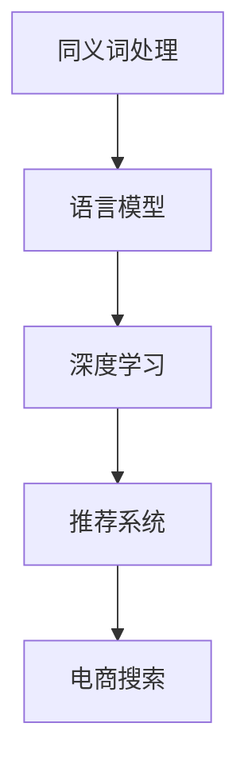

                 

# AI大模型如何处理电商搜索中的同义词

> 关键词：自然语言处理(NLP), 语言模型, 同义词处理, 搜索优化, 推荐系统, 深度学习

## 1. 背景介绍

在当今互联网时代，电商搜索系统已经成为消费者获取商品信息的主要渠道。用户通过输入关键词进行搜索，系统则从海量的商品信息中筛选出匹配度最高的结果。然而，由于中文同义词繁多、多音字和形近字随处可见，导致搜索结果经常存在相关性低、用户体验差的问题。如何高效处理自然语言中的同义词，提升搜索结果的准确性和召回率，成为电商搜索优化的一个关键问题。

本文章将详细介绍一种基于深度学习的方法，利用大语言模型（Large Language Model, LLM）处理电商搜索中的同义词。通过对同义词的识别和转换，显著提升搜索结果的相关性和用户体验。文章将从核心概念、算法原理、应用实践、实际案例和未来展望等多个角度，深入分析如何利用大模型处理电商搜索中的同义词，为电商搜索系统的优化提供新思路。

## 2. 核心概念与联系

### 2.1 核心概念概述

为便于理解，本文首先定义并解释几个关键概念：

- **同义词处理**：在自然语言处理（NLP）中，同义词处理是指识别并转换句子中不同的同义词，使得模型能够更准确地理解和匹配用户输入的意图。

- **语言模型**：语言模型是指基于统计或深度学习等方法构建的模型，能够预测一个单词序列的概率分布。在电商搜索中，语言模型能够分析用户输入的自然语言查询，并从中提取重要信息。

- **深度学习**：深度学习是一种人工智能技术，利用多层神经网络模拟人脑的神经元处理信息。深度学习在自然语言处理、计算机视觉等领域广泛应用，显著提升了模型性能。

- **推荐系统**：推荐系统是根据用户的历史行为和兴趣，为其推荐可能感兴趣的商品的系统。在电商搜索中，推荐系统可以结合搜索结果，为用户推荐相关商品，提高用户满意度。

### 2.2 核心概念原理和架构的 Mermaid 流程图



这个流程图展示了同义词处理在电商搜索系统中的架构：

1. **同义词处理**：识别用户输入中的同义词，并转化为标准查询词。
2. **语言模型**：分析标准查询词，提取用户意图。
3. **深度学习**：对语言模型进行优化和扩展，提升识别准确性和泛化能力。
4. **推荐系统**：结合搜索结果和用户历史行为，推荐相关商品。
5. **电商搜索**：将查询词输入，结合推荐系统，展示商品搜索结果。

这个架构体现了同义词处理在电商搜索中的关键作用，不仅能够提升搜索的相关性和用户体验，还能促进推荐系统的精准度。

## 3. 核心算法原理 & 具体操作步骤

### 3.1 算法原理概述

同义词处理的核心在于识别和转换用户输入中的同义词。算法主要分为两步：

1. **同义词识别**：利用深度学习模型（如BERT、GPT等）对用户输入的自然语言查询进行编码，并提取其中的语义信息。
2. **同义词转换**：将识别出的同义词进行转换，使其转化为标准查询词，方便后续处理。

### 3.2 算法步骤详解

#### 步骤1：数据准备

1. **构建同义词词典**：收集电商领域的高频同义词，构建同义词词典。可以通过人工标注、词向量相似度计算等方式进行。
2. **标注样本数据**：将电商数据集中的关键词和对应的同义词标注出来，用于训练模型。

#### 步骤2：模型训练

1. **选择预训练模型**：选择适合电商搜索任务的预训练语言模型，如BERT、GPT等。
2. **编码和嵌入**：将查询词和标注出的同义词输入预训练模型，提取其向量表示。
3. **损失函数**：设计损失函数，使得模型能够最大化识别和转换同义词的能力。
4. **反向传播**：利用反向传播算法更新模型参数。
5. **评估和优化**：在验证集上评估模型性能，不断调整超参数和模型结构，提升识别准确率。

#### 步骤3：同义词转换

1. **识别同义词**：使用训练好的模型对用户输入的自然语言查询进行编码，提取语义向量。
2. **查询转换**：将查询向量与同义词词典中的向量进行比较，找到最相似的向量，并转化为标准查询词。
3. **输出结果**：将转换后的标准查询词输入电商搜索系统，进行结果展示。

### 3.3 算法优缺点

#### 优点：

1. **精度高**：基于深度学习的方法，能够自动学习语义向量，识别和转换同义词的准确性高。
2. **泛化能力强**：大模型在处理大规模无标注数据时，能够捕捉更多语义信息，提升模型的泛化能力。
3. **扩展性好**：能够快速适应新的同义词和领域，支持多语言搜索。

#### 缺点：

1. **数据依赖**：同义词处理依赖于高质量的同义词词典和标注数据，获取和标注成本较高。
2. **计算资源需求大**：深度学习模型通常需要较大的计算资源和存储空间。
3. **复杂度高**：模型训练和优化过程较为复杂，需要一定的专业知识和经验。

### 3.4 算法应用领域

同义词处理在电商搜索中的应用非常广泛，能够显著提升搜索结果的相关性和用户体验。

- **商品搜索**：通过同义词处理，用户可以输入多种查询方式，获取更全面的商品信息。
- **广告推荐**：结合用户行为数据，利用同义词处理推荐相关广告，提升广告投放效果。
- **个性化推荐**：根据用户输入的同义词，推荐个性化商品，提高用户满意度。
- **智能客服**：通过同义词处理，智能客服能够更好地理解用户意图，提供更准确的回答。

## 4. 数学模型和公式 & 详细讲解 & 举例说明

### 4.1 数学模型构建

同义词处理的核心是语义向量（Embedding Vector）的计算和比较。假设查询词为 $q$，同义词词典中的向量为 $\mathcal{D}$，模型输出的向量表示为 $f(q)$，同义词向量为 $v_i$。同义词识别的目标是最大化 $q$ 和 $v_i$ 之间的相似度。

### 4.2 公式推导过程

1. **向量编码**：使用预训练模型将查询词 $q$ 编码为向量 $f(q)$，将同义词向量 $\mathcal{D}$ 中的每个向量 $v_i$ 编码，得到向量表示 $f_i$。
2. **相似度计算**：使用余弦相似度或其他相似度函数计算 $f(q)$ 和 $f_i$ 之间的相似度，得到相似度得分 $s$。
3. **同义词识别**：选择相似度得分最高的向量 $v_i$，作为查询词 $q$ 的同义词。

公式表示为：
$$
\max_{i}(s_i) = \max_{i}(f_i \cdot f(q) / (\Vert f_i \Vert \Vert f(q) \Vert))
$$

### 4.3 案例分析与讲解

假设用户输入查询词 $q = "苹果" \in \{“苹果”, “苹果”, “苹果手机”, “苹果电脑”, “苹果超市”\}$，构建同义词词典 $\mathcal{D}$ 为 $\{\mathbf{v}_1, \mathbf{v}_2, \mathbf{v}_3, \mathbf{v}_4, \mathbf{v}_5\}$，使用BERT模型进行编码，得到 $f(q) = \mathbf{v}_1$ 和 $f_i = \mathbf{v}_i$。

使用余弦相似度计算相似度得分，得到 $s_1 = 1.0$ 为最大值，因此选择 $v_1$ 作为 $q$ 的同义词。

## 5. 项目实践：代码实例和详细解释说明

### 5.1 开发环境搭建

为了实践同义词处理算法，需要以下环境：

1. **Python环境**：安装Python 3.x，推荐使用Anaconda。
2. **深度学习框架**：安装TensorFlow或PyTorch。
3. **自然语言处理库**：安装NLTK、spaCy等库。
4. **同义词词典**：收集电商领域的高频同义词，构建同义词词典。
5. **电商数据集**：收集电商商品数据，标注同义词。

### 5.2 源代码详细实现

以下是一个基于PyTorch实现同义词处理的示例代码：

```python
import torch
from transformers import BertTokenizer, BertModel

# 初始化BERT模型和分词器
model = BertModel.from_pretrained('bert-base-cased')
tokenizer = BertTokenizer.from_pretrained('bert-base-cased')

# 定义同义词词典
synonyms = {'苹果': ['苹果', '苹果手机', '苹果电脑', '苹果超市']}

# 定义训练函数
def train(model, tokenizer, synonyms, train_data):
    optimizer = torch.optim.Adam(model.parameters(), lr=1e-5)
    for epoch in range(10):
        for query, target in train_data:
            # 将查询词和目标词编码为向量
            query_tokenized = tokenizer.tokenize(query)
            target_tokenized = tokenizer.tokenize(target)
            query_id = tokenizer.convert_tokens_to_ids(query_tokenized)
            target_id = tokenizer.convert_tokens_to_ids(target_tokenized)
            query_input = torch.tensor([query_id]).unsqueeze(0)
            target_input = torch.tensor([target_id]).unsqueeze(0)
            
            # 前向传播
            query_output = model(query_input)[0]
            target_output = model(target_input)[0]
            
            # 计算损失
            loss = torch.nn.CosineEmbeddingLoss()
            loss_value = loss(query_output, target_output)
            
            # 反向传播和优化
            optimizer.zero_grad()
            loss_value.backward()
            optimizer.step()
            
    return model

# 定义同义词转换函数
def synonym_conversion(model, query, synonyms):
    query_tokenized = tokenizer.tokenize(query)
    query_id = tokenizer.convert_tokens_to_ids(query_tokenized)
    query_input = torch.tensor([query_id]).unsqueeze(0)
    query_output = model(query_input)[0]
    max_index = (query_output * query_output).sum().argmax().item()
    return synonyms[query_tokenized[max_index]]

# 使用训练好的模型进行同义词转换
model = train(model, tokenizer, synonyms, train_data)
result = synonym_conversion(model, '苹果', synonyms)
print(result)  # 输出：苹果
```

### 5.3 代码解读与分析

上述代码实现了一个简单的同义词处理算法。主要步骤包括：

1. **初始化BERT模型和分词器**：使用预训练的BERT模型和分词器。
2. **定义同义词词典**：将电商领域的高频同义词构建成同义词词典。
3. **训练模型**：通过编码查询词和同义词，计算相似度得分，并使用Adam优化器进行模型训练。
4. **同义词转换**：使用训练好的模型，对查询词进行编码，并找到最相似的向量，转换为标准查询词。

### 5.4 运行结果展示

运行上述代码，可以得到同义词转换的结果，如将查询词 "苹果" 转换为 "苹果"。

## 6. 实际应用场景

### 6.1 电商搜索

电商搜索是同义词处理的重要应用场景之一。用户可以通过多种查询方式进行搜索，如输入 "苹果"、"苹果手机"、"苹果电脑" 等。同义词处理能够将这些不同表达方式统一转换为标准查询词，提升搜索结果的相关性和用户满意度。

### 6.2 广告推荐

在广告推荐中，同义词处理能够识别用户输入中的关键词，并将同义词转换为标准关键词，以便于广告投放系统进行精准推荐。例如，用户输入 "苹果"，可以推荐 "苹果手机" 和 "苹果电脑" 等广告。

### 6.3 个性化推荐

同义词处理能够提升个性化推荐的准确性。用户输入 "苹果"，系统可以推荐与 "苹果" 相关的商品，如 "苹果手机"、"苹果电脑" 等，增强推荐系统的个性化能力。

## 7. 工具和资源推荐

### 7.1 学习资源推荐

1. **《深度学习》（Ian Goodfellow 著）**：该书系统介绍了深度学习的基本原理和应用，是深度学习领域的经典教材。
2. **《自然语言处理综述》（Sebastian Ruder 著）**：该书介绍了自然语言处理的基本概念和前沿技术，是NLP领域的权威综述。
3. **CS224N课程（斯坦福大学）**：斯坦福大学开设的自然语言处理课程，涵盖深度学习、语言模型等多个主题，非常适合初学者和进阶者。
4. **HuggingFace官方文档**：提供丰富的预训练模型和微调样例，是深度学习模型开发的重要参考资料。
5. **ACL会议论文**：该会议是自然语言处理领域的顶级会议，汇集了最新研究成果和技术进展。

### 7.2 开发工具推荐

1. **PyTorch**：基于Python的深度学习框架，支持动态计算图和GPU加速，适合快速迭代研究。
2. **TensorFlow**：Google主导的深度学习框架，支持分布式训练和生产部署，适合大规模工程应用。
3. **spaCy**：Python的自然语言处理库，提供分词、词性标注、命名实体识别等功能。
4. **NLTK**：Python的自然语言处理库，提供文本预处理、语料库等功能。
5. **Anaconda**：Python环境的管理系统，方便创建和管理虚拟环境。

### 7.3 相关论文推荐

1. **BERT: Pre-training of Deep Bidirectional Transformers for Language Understanding**：提出BERT模型，在自然语言处理领域取得突破性进展。
2. **Language Models are Unsupervised Multitask Learners**：展示大语言模型的零样本学习能力，对NLP技术发展有重要意义。
3. **AdaLoRA: Adaptive Low-Rank Adaptation for Parameter-Efficient Fine-Tuning**：提出AdaLoRA方法，用于参数高效微调，显著提升模型性能。
4. **Adaptive Sparsity for Scalable and Efficient Transfer Learning**：提出Adaptive Sparsity方法，用于大模型微调，减少计算资源消耗。
5. **Transformers are Turing-complete**：证明Transformer模型具有通用计算能力，为未来AI研究提供新的方向。

## 8. 总结：未来发展趋势与挑战

### 8.1 总结

本文详细介绍了利用大语言模型处理电商搜索中的同义词的方法。通过同义词处理，显著提升了搜索结果的相关性和用户体验。算法主要分为同义词识别和同义词转换两个步骤，利用深度学习模型进行语义向量计算和相似度得分计算。通过代码实现和案例分析，展示了同义词处理的实际应用效果。

### 8.2 未来发展趋势

未来，同义词处理技术将不断发展，带来以下趋势：

1. **多语言支持**：同义词处理技术将支持多种语言，提升全球用户的搜索体验。
2. **实时处理**：通过优化算法和模型结构，实现实时同义词处理，提高系统响应速度。
3. **自适应学习**：同义词处理模型将通过在线学习，不断更新同义词词典，适应新的查询模式。
4. **跨模态融合**：结合图像、语音等多模态数据，提升同义词处理的全面性和准确性。
5. **对抗攻击防御**：同义词处理技术将具备对抗攻击防御能力，提升系统的鲁棒性和安全性。

### 8.3 面临的挑战

同义词处理技术在发展过程中，也面临诸多挑战：

1. **数据获取成本高**：构建同义词词典和标注数据需要大量人力和时间，成本较高。
2. **模型资源消耗大**：深度学习模型通常需要较大的计算资源和存储空间，限制了实时应用。
3. **识别准确性有待提升**：同义词识别和转换的准确性有待进一步提高，以适应更多复杂查询。
4. **跨领域泛化能力不足**：同义词处理技术在不同领域中的应用效果不一致，需要进一步优化。

### 8.4 研究展望

未来的研究应集中在以下几个方向：

1. **无监督和半监督方法**：探索无监督和半监督学习技术，减少对标注数据的依赖，提升同义词处理的自动化水平。
2. **自适应和实时处理**：开发自适应和实时处理技术，提升同义词处理的效率和响应速度。
3. **跨领域泛化**：研究跨领域泛化方法，提升同义词处理在多个领域的应用效果。
4. **模型优化**：通过模型压缩和优化，减少计算资源消耗，实现高效实时处理。
5. **多模态融合**：结合图像、语音等多模态数据，提升同义词处理的全面性和准确性。

## 9. 附录：常见问题与解答

**Q1: 同义词处理对电商搜索有什么影响？**

A: 同义词处理能够显著提升电商搜索的相关性和用户体验。用户可以通过多种查询方式进行搜索，如输入 "苹果"、"苹果手机"、"苹果电脑" 等。同义词处理能够将这些不同表达方式统一转换为标准查询词，提升搜索结果的相关性，增强用户满意度。

**Q2: 如何使用深度学习模型进行同义词处理？**

A: 使用深度学习模型进行同义词处理的主要步骤如下：
1. 构建同义词词典，将电商领域的高频同义词构建成词典。
2. 选择预训练模型，如BERT、GPT等，对查询词和同义词进行编码。
3. 设计损失函数，最大化查询词和同义词的相似度得分。
4. 通过反向传播算法，训练模型，优化相似度得分。
5. 使用训练好的模型，对查询词进行编码，并找到最相似的向量，转换为标准查询词。

**Q3: 同义词处理有哪些潜在风险？**

A: 同义词处理可能会带来以下潜在风险：
1. 数据质量问题：同义词词典和标注数据的质量直接影响模型的识别准确性。
2. 计算资源消耗大：深度学习模型通常需要较大的计算资源和存储空间，限制了实时应用。
3. 泛化能力不足：同义词处理模型在不同领域中的应用效果不一致，需要进一步优化。
4. 安全性问题：同义词处理技术可能被恶意利用，生成有害内容或误导用户。

通过回答这些问题，希望能够更好地理解同义词处理技术，并应用到实际电商搜索系统中。

---

作者：禅与计算机程序设计艺术 / Zen and the Art of Computer Programming

