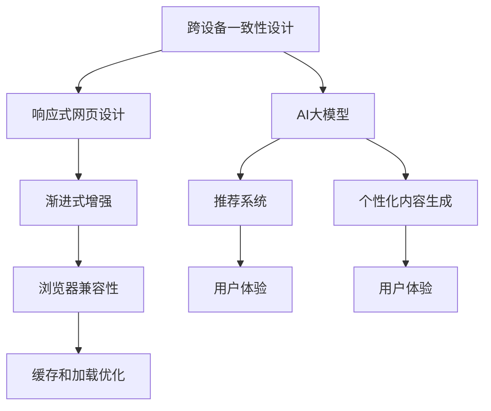

                 

# AI大模型如何提升电商平台的跨设备用户体验一致性

## 1. 背景介绍

### 1.1 问题由来

在电商平台上，用户通常会在不同的设备（如手机、平板、电脑）上浏览和购买商品。为了确保一致的用户体验，电商平台需要保证不同设备上显示的页面、功能、推荐等用户界面元素在视觉和功能上保持一致。然而，由于各设备屏幕尺寸、操作系统、浏览器等因素的差异，实现跨设备的体验一致性面临诸多挑战。

### 1.2 问题核心关键点

确保跨设备的用户体验一致性，需要解决以下几个关键问题：
- 多设备一致性设计：确保不同设备上页面布局、元素大小、颜色等设计元素保持一致。
- 多设备兼容性：优化代码和页面布局，以适应不同设备和屏幕尺寸。
- 加载速度优化：不同设备的网络状况和硬件性能差异，可能导致页面加载速度不一致。
- 功能一致性：保证不同设备上所有功能无缝运行，避免因设备差异导致的用户操作障碍。

### 1.3 问题研究意义

解决电商平台的跨设备用户体验一致性问题，能够提升用户体验、降低用户流失率、提高用户满意度和平台忠诚度。具体意义包括：
- 提高用户满意度：确保用户在不同设备上获得一致的购物体验，减少因设备差异导致的用户体验下降。
- 提升转化率：一致的购物体验有助于用户完成购买，减少因设备不适应导致的操作障碍。
- 增强平台竞争力：优质的用户体验是电商平台吸引用户和保持用户忠诚度的重要因素。

## 2. 核心概念与联系

### 2.1 核心概念概述

为了提升跨设备的用户体验一致性，需要引入以下几个核心概念：

- 跨设备一致性设计：通过设计统一的UI标准，确保不同设备上的界面元素在视觉和功能上保持一致。
- 响应式网页设计：利用CSS媒体查询和弹性布局，使网页能够自适应不同设备和屏幕尺寸。
- 渐进式增强：设计适用于多种设备和屏幕尺寸的基本页面结构，通过JavaScript动态增强用户体验。
- 浏览器兼容性：通过测试和适配，确保不同浏览器和操作系统上的一致性。
- 缓存和加载优化：利用缓存技术减少重复加载，优化页面加载速度。
- AI大模型：通过预训练的语言模型和图像识别模型，提升推荐和个性化内容生成能力，提升用户购物体验。

这些概念之间的逻辑关系可以通过以下Mermaid流程图来展示：



这个流程图展示了大模型在提升跨设备用户体验一致性中的作用：
- 跨设备一致性设计和大模型共同构建一致的用户界面。
- 响应式网页设计和渐进式增强通过动态调整页面布局，提升用户体验。
- 浏览器兼容性和缓存加载优化确保不同设备和浏览器的一致性。
- 推荐系统和个性化内容生成通过智能推荐，提升用户购物体验。

## 3. 核心算法原理 & 具体操作步骤
### 3.1 算法原理概述

为了提升跨设备的用户体验一致性，电商平台可以采用以下算法原理：
- 通过跨设备一致性设计，构建统一的UI标准。
- 利用响应式网页设计，自动调整页面布局以适应不同设备。
- 应用渐进式增强，动态加载和增强用户体验。
- 通过浏览器兼容性测试和适配，确保页面在各设备上正常显示。
- 采用缓存和加载优化技术，提升页面加载速度。
- 引入AI大模型，提升推荐和个性化内容生成能力。

这些原理在大模型的辅助下，能够实现跨设备的无缝衔接和用户体验的提升。

### 3.2 算法步骤详解

以下详细描述各步骤的操作过程：

**Step 1: 跨设备一致性设计**
- 定义统一的UI标准，包括颜色、字体、图标等设计元素。
- 确保不同设备上页面布局、元素大小、颜色等设计元素保持一致。
- 使用一致性设计工具，如Sketch、Figma等，进行设计管理和审核。

**Step 2: 响应式网页设计**
- 使用CSS媒体查询和弹性布局技术，使页面能够自适应不同设备和屏幕尺寸。
- 定义不同屏幕尺寸下的页面布局和元素大小。
- 测试和调整页面布局，确保在不同设备上显示效果一致。

**Step 3: 渐进式增强**
- 设计适用于多种设备和屏幕尺寸的基本页面结构。
- 使用JavaScript动态加载和增强页面元素，如交互效果、动画等。
- 确保动态增强效果在各种设备上兼容，避免出现浏览器兼容问题。

**Step 4: 浏览器兼容性测试和适配**
- 使用浏览器兼容性测试工具，如BrowserStack、Lighthouse等，进行跨设备测试。
- 发现和修复兼容性问题，确保页面在各浏览器和操作系统上正常显示。
- 采用Polyfills等技术，解决兼容性问题。

**Step 5: 缓存和加载优化**
- 利用浏览器缓存机制，减少重复加载和带宽消耗。
- 优化图片、CSS、JS等资源，减少加载时间和带宽占用。
- 使用CDN技术，加速资源的全球访问。

**Step 6: AI大模型引入**
- 选择合适的预训练语言模型和图像识别模型，如BERT、GPT、ResNet等。
- 在电商平台中进行微调，生成个性化推荐和内容。
- 使用大模型进行用户行为分析和预测，优化购物体验。

### 3.3 算法优缺点

跨设备用户体验一致性设计和大模型结合的算法具有以下优点：
- 提升用户满意度：一致的用户体验有助于用户完成购物，提升满意度。
- 提高转化率：一致的购物体验减少因设备不适应导致的操作障碍，提高转化率。
- 增强平台竞争力：优质的用户体验是电商平台吸引用户和保持用户忠诚度的重要因素。

但同时也有以下缺点：
- 设计复杂：跨设备一致性设计和大模型应用需要多方面的考虑，增加了设计和开发的复杂度。
- 成本较高：大模型需要大量计算资源和时间进行训练和微调，增加了成本。
- 数据隐私：大模型的应用需要大量的用户数据，可能涉及隐私问题。

### 3.4 算法应用领域

跨设备用户体验一致性设计和大模型结合的算法，在电商平台中得到广泛应用。具体应用领域包括：
- 商品推荐系统：通过大模型生成个性化推荐，提升用户购物体验。
- 智能客服：通过大模型提供智能聊天和问题解答，提升用户满意度。
- 个性化内容生成：利用大模型生成个性化广告和推荐内容，提高用户互动。
- 用户行为分析：通过大模型分析用户行为，优化购物体验和平台策略。

## 4. 数学模型和公式 & 详细讲解 & 举例说明

### 4.1 数学模型构建

为了构建基于AI大模型的跨设备用户体验一致性模型，需要定义以下数学模型：
- **用户界面一致性模型**：描述不同设备上界面元素的分布和大小，确保一致性。
- **推荐系统模型**：描述如何根据用户行为和偏好生成个性化推荐。
- **用户行为分析模型**：描述如何通过用户行为数据进行预测和优化。

### 4.2 公式推导过程

以下推导几个关键公式：
- **用户界面一致性模型**：
  $$
  P_{UI} = \sum_{i=1}^n P_{UI,i}
  $$
  其中 $P_{UI}$ 为不同设备上的用户界面一致性概率，$P_{UI,i}$ 为第 $i$ 个设备的概率。
  
- **推荐系统模型**：
  $$
  P_{Rec} = \prod_{i=1}^n P_{Rec,i}
  $$
  其中 $P_{Rec}$ 为推荐系统生成的推荐概率，$P_{Rec,i}$ 为第 $i$ 个设备的推荐概率。
  
- **用户行为分析模型**：
  $$
  P_{Beh} = \sum_{i=1}^n P_{Beh,i}
  $$
  其中 $P_{Beh}$ 为用户行为分析的概率，$P_{Beh,i}$ 为第 $i$ 个设备的概率。

### 4.3 案例分析与讲解

以商品推荐系统为例，分析大模型在该系统中的应用：
- **用户行为数据收集**：通过用户浏览、点击、购买等行为数据，构建用户行为数据集。
- **预训练语言模型选择**：选择BERT或GPT作为预训练模型，进行推荐系统的微调。
- **微调过程**：使用用户行为数据集对预训练模型进行微调，生成个性化推荐。
- **推荐效果评估**：通过A/B测试等方法，评估推荐系统的效果。

## 5. 项目实践：代码实例和详细解释说明

### 5.1 开发环境搭建

为了进行跨设备用户体验一致性设计和大模型的实践，需要搭建以下开发环境：
- Python：安装最新版本的Python，用于开发和运行大模型。
- PyTorch：安装PyTorch框架，用于实现大模型的训练和推理。
- TensorFlow：安装TensorFlow框架，用于实现图像识别等大模型的应用。
- Visual Studio Code：用于编写和调试代码，提供强大的代码补全和错误提示功能。
- Git：用于版本控制，便于协作开发。

### 5.2 源代码详细实现

以下是一个简单的商品推荐系统的代码实现，包括数据收集、模型训练、推荐生成等步骤：

```python
import torch
from transformers import BertForSequenceClassification, BertTokenizer

# 数据收集和预处理
# ...

# 定义BERT模型和tokenizer
model = BertForSequenceClassification.from_pretrained('bert-base-uncased')
tokenizer = BertTokenizer.from_pretrained('bert-base-uncased')

# 加载数据
inputs = tokenizer(train_data, return_tensors='pt', padding=True, truncation=True)
labels = torch.tensor(train_labels)

# 模型微调
model.train()
optimizer = torch.optim.Adam(model.parameters(), lr=1e-5)
for epoch in range(num_epochs):
    # 前向传播和反向传播
    # ...

# 推荐生成
def generate_recommendations(user_id):
    # 根据用户ID获取行为数据
    # ...

    # 将行为数据转化为模型输入
    inputs = tokenizer(user_behavior, return_tensors='pt', padding=True, truncation=True)
    with torch.no_grad():
        logits = model(inputs['input_ids'])

    # 生成推荐
    predicted_labels = torch.argmax(logits, dim=1)
    recommendations = ...

# 运行代码
generate_recommendations(user_id)
```

### 5.3 代码解读与分析

以上代码实现了一个简单的商品推荐系统，包括数据收集、模型训练和推荐生成等步骤。
- 数据收集和预处理：通过爬虫等手段收集用户行为数据，并进行清洗和预处理。
- BERT模型和tokenizer：选择BERT作为预训练模型，并使用tokenizer将行为数据转化为模型输入。
- 模型微调：使用Adam优化器对模型进行微调，最小化损失函数。
- 推荐生成：根据用户行为数据生成个性化推荐，返回推荐列表。

## 6. 实际应用场景

### 6.1 商品推荐系统

在电商平台中，商品推荐系统是用户购物体验的核心。通过引入AI大模型，推荐系统能够根据用户行为和偏好生成个性化推荐，提升用户购物体验。

**具体应用**：
- 用户行为数据收集：通过用户浏览、点击、购买等行为数据，构建用户行为数据集。
- 预训练语言模型选择：选择BERT或GPT作为预训练模型，进行推荐系统的微调。
- 微调过程：使用用户行为数据集对预训练模型进行微调，生成个性化推荐。
- 推荐效果评估：通过A/B测试等方法，评估推荐系统的效果。

**技术优势**：
- 个性化推荐：通过大模型生成个性化推荐，提升用户购物体验。
- 实时性：大模型能够实时处理用户行为数据，动态生成推荐。
- 多设备一致性：推荐系统在多设备上保持一致的推荐策略，提升用户体验。

### 6.2 智能客服

智能客服系统能够提供7x24小时不间断的客户服务，提升用户满意度和平台忠诚度。通过引入AI大模型，智能客服系统能够理解和回答用户的各种问题。

**具体应用**：
- 用户对话数据收集：收集用户与智能客服的对话数据。
- 预训练语言模型选择：选择BERT或GPT作为预训练模型，进行客服系统的微调。
- 微调过程：使用对话数据对预训练模型进行微调，生成智能客服的回复。
- 智能客服部署：将微调后的模型部署到实际应用中，提供智能客服服务。

**技术优势**：
- 多设备一致性：智能客服在多设备上保持一致的回复策略，提升用户体验。
- 实时性：智能客服能够实时响应用户问题，提升服务效率。
- 自然语言理解：通过大模型理解用户意图，生成自然流畅的回复。

### 6.3 个性化内容生成

个性化内容生成能够提供更丰富、更个性化的广告和推荐内容，提升用户互动和满意度。通过引入AI大模型，个性化内容生成能够根据用户偏好生成个性化内容。

**具体应用**：
- 用户偏好数据收集：收集用户浏览、点击、购买等偏好数据。
- 预训练语言模型选择：选择BERT或GPT作为预训练模型，进行内容生成系统的微调。
- 微调过程：使用偏好数据对预训练模型进行微调，生成个性化内容。
- 内容生成部署：将微调后的模型部署到实际应用中，提供个性化内容服务。

**技术优势**：
- 个性化内容：根据用户偏好生成个性化内容，提升用户互动和满意度。
- 多设备一致性：个性化内容在多设备上保持一致，提升用户体验。
- 实时性：内容生成系统能够实时响应用户需求，提供个性化推荐。

### 6.4 未来应用展望

随着AI大模型的不断发展，未来在跨设备用户体验一致性中的应用将更加广泛和深入。
- **多模态融合**：结合视觉、听觉等多模态数据，提升用户体验和系统智能化水平。
- **智能预测**：通过大模型进行用户行为预测，提前优化购物体验。
- **情感分析**：通过大模型进行情感分析，提升用户满意度和忠诚度。
- **自动化测试**：通过大模型进行自动化测试，确保不同设备上的用户体验一致性。

## 7. 工具和资源推荐

### 7.1 学习资源推荐

为了帮助开发者掌握跨设备用户体验一致性设计和大模型应用的理论基础和实践技巧，以下是一些推荐的学习资源：
- 《深度学习基础》：介绍深度学习的基本原理和算法，适合初学者入门。
- 《自然语言处理综述》：全面介绍自然语言处理技术，涵盖NLP的各个方向。
- 《AI大模型：理论与实践》：介绍AI大模型的原理、应用和未来趋势，适合深入学习。
- 《Python深度学习》：介绍使用Python进行深度学习的开发和实践，适合实践者参考。

### 7.2 开发工具推荐

为了进行跨设备用户体验一致性设计和大模型的开发，需要选择合适的工具。以下是一些推荐的工具：
- Jupyter Notebook：用于编写和调试Python代码，支持交互式开发和展示。
- Visual Studio Code：支持多种编程语言的代码编写和调试，提供强大的代码补全和错误提示功能。
- Git：用于版本控制，便于协作开发。
- Docker：用于构建和部署开发环境，支持跨平台运行。

### 7.3 相关论文推荐

为了进一步深入了解跨设备用户体验一致性设计和大模型的研究进展，以下是一些推荐的论文：
- "Deep Multi-modal Alignment for Multi-device Consistent User Experience"：介绍多模态融合提升用户体验的方法。
- "Cross-Device Consistent Recommendation System with Attention-based Model Fusion"：介绍注意力机制融合提升推荐系统一致性的方法。
- "Analyzing Multi-device Consistency of Recommendation Systems using A/B Testing"：介绍通过A/B测试评估推荐系统一致性的方法。

## 8. 总结：未来发展趋势与挑战

### 8.1 研究成果总结

本文介绍了基于AI大模型的跨设备用户体验一致性设计，包括跨设备一致性设计、响应式网页设计、渐进式增强、浏览器兼容性测试、缓存和加载优化、AI大模型应用等关键技术。通过这些技术的应用，电商平台能够提升用户体验，增强平台竞争力。

### 8.2 未来发展趋势

未来跨设备用户体验一致性设计和大模型应用将呈现以下几个趋势：
- **多模态融合**：结合视觉、听觉等多模态数据，提升用户体验和系统智能化水平。
- **智能预测**：通过大模型进行用户行为预测，提前优化购物体验。
- **情感分析**：通过大模型进行情感分析，提升用户满意度和忠诚度。
- **自动化测试**：通过大模型进行自动化测试，确保不同设备上的用户体验一致性。

### 8.3 面临的挑战

尽管跨设备用户体验一致性设计和大模型应用已经取得了一定进展，但仍面临以下挑战：
- **数据隐私**：大模型的应用需要大量的用户数据，可能涉及隐私问题。
- **成本较高**：大模型需要大量计算资源和时间进行训练和微调，增加了成本。
- **复杂度较高**：跨设备一致性设计和大模型应用需要多方面的考虑，增加了设计和开发的复杂度。

### 8.4 研究展望

未来需要在以下几个方面进行深入研究：
- **数据隐私保护**：探索如何保护用户隐私，同时利用大数据提升系统性能。
- **成本优化**：探索更高效的训练和微调方法，降低大模型应用的成本。
- **技术创新**：探索更多跨设备一致性设计和个性化推荐的新方法，提升用户体验。

## 9. 附录：常见问题与解答

### Q1：大模型在提升用户体验中的作用是什么？

A: 大模型在提升用户体验中主要起到以下作用：
- **个性化推荐**：通过大模型生成个性化推荐，提升用户购物体验。
- **智能客服**：通过大模型理解和回答用户的各种问题，提升用户满意度。
- **多设备一致性**：大模型能够确保不同设备上的一致性设计，提升用户体验。

### Q2：如何选择合适的预训练语言模型？

A: 选择合适的预训练语言模型需要考虑以下几个因素：
- **任务类型**：根据任务的性质选择适合的模型，如分类任务选择BERT，生成任务选择GPT。
- **数据规模**：数据规模较大的任务选择更大的模型，如GPT-3。
- **计算资源**：计算资源有限的情况下，选择较小的模型，如BERT。

### Q3：如何优化页面加载速度？

A: 优化页面加载速度的方法包括：
- **缓存技术**：利用浏览器缓存减少重复加载。
- **资源压缩**：压缩图片、CSS、JS等资源，减少加载时间和带宽占用。
- **CDN加速**：使用CDN技术，加速资源的全球访问。

### Q4：如何确保多设备兼容性？

A: 确保多设备兼容性的方法包括：
- **响应式设计**：使用CSS媒体查询和弹性布局技术，使页面能够自适应不同设备和屏幕尺寸。
- **浏览器测试**：使用浏览器兼容性测试工具，如BrowserStack、Lighthouse等，进行跨设备测试。
- **Polyfills技术**：使用Polyfills等技术，解决兼容性问题。

### Q5：如何进行用户行为分析？

A: 用户行为分析的方法包括：
- **数据收集**：通过用户浏览、点击、购买等行为数据，构建用户行为数据集。
- **模型选择**：选择适合的模型，如LSTM、RNN等，进行行为分析。
- **数据处理**：对数据进行清洗、预处理和特征工程，提升模型的效果。

---

作者：禅与计算机程序设计艺术 / Zen and the Art of Computer Programming

