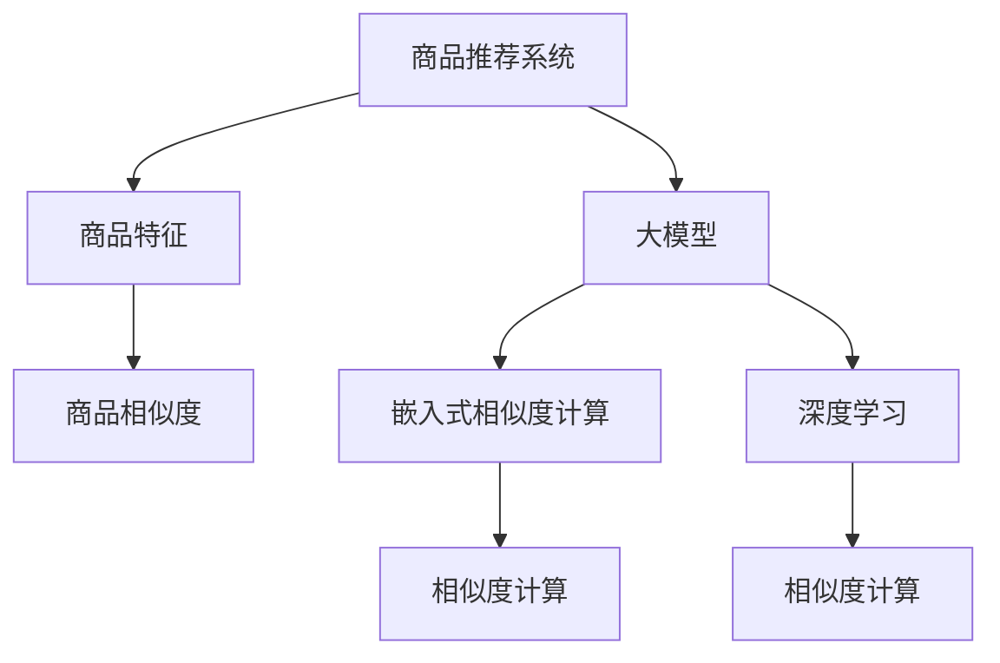

                 

# 融合AI大模型的商品相似度计算方法

## 1. 背景介绍

### 1.1 问题由来
在电商、零售等行业，商品推荐系统（Recommender System）是提升用户体验和增加用户粘性的关键。传统的推荐系统基于协同过滤、内容过滤等方法，需要构建用户行为模型和商品特征模型。而随着人工智能（AI）技术的进步，特别是深度学习（Deep Learning）在NLP、计算机视觉等领域的成功应用，大模型（Large Model）也逐渐被引入到商品推荐系统中，成为新的趋势。

大模型通过在海量无标签文本数据上进行预训练，学习到了丰富的语言知识和常识，具备强大的语义理解和生成能力。将大模型应用于商品推荐中，可以显著提升推荐系统的效果，增强用户的购物体验。

然而，直接将大模型应用于商品推荐，面临着计算资源密集、模型参数庞大、解释性差等问题。此外，大模型缺乏商品特征和商品间关系的理解，无法直接进行商品相似度计算。因此，如何将大模型的语言能力与商品特征结合，成为当前研究的一个重要方向。

## 2. 核心概念与联系

### 2.1 核心概念概述

为更好地理解融合AI大模型的商品相似度计算方法，本节将介绍几个密切相关的核心概念：

- **商品推荐系统（Recommender System）**：基于用户行为和商品特征，推荐用户可能感兴趣的商品的系统。
- **大模型（Large Model）**：如BERT、GPT等大规模预训练语言模型。通过在大规模无标签文本语料上进行预训练，学习通用的语言表示，具备强大的语言理解和生成能力。
- **商品特征（Item Feature）**：描述商品属性的向量，如价格、销量、品牌等。
- **商品相似度（Item Similarity）**：衡量两个商品之间的相似度，通常用于推荐系统中计算相似商品，帮助用户发现潜在的购买选项。
- **嵌入式相似度计算（Embedding-based Similarity Calculation）**：使用预训练模型将商品特征向量映射到高维空间中，计算空间中商品间的距离或相似度。
- **深度学习（Deep Learning）**：基于神经网络的机器学习方法，通常包括多层神经网络结构，如卷积神经网络（CNN）、循环神经网络（RNN）、Transformer等。

这些核心概念之间的逻辑关系可以通过以下Mermaid流程图来展示：



这个流程图展示了大模型应用于商品推荐系统的核心概念及其之间的关系：

1. 商品推荐系统使用大模型进行商品特征向量的映射。
2. 大模型通过嵌入式相似度计算，计算商品间在高维空间中的相似度。
3. 深度学习通过复杂的神经网络结构，提取商品特征，增强相似度计算的准确性。

## 3. 核心算法原理 & 具体操作步骤

### 3.1 算法原理概述

融合AI大模型的商品相似度计算方法，本质上是一个多模态学习（Multi-modal Learning）的过程。其核心思想是：将大模型的语言能力与商品特征进行融合，利用大模型的预训练知识和深度学习结构，计算商品间的相似度。

具体步骤如下：

1. **商品特征向量化**：将商品的各种属性转换为向量表示。
2. **大模型特征映射**：使用大模型将商品特征向量映射到高维空间中。
3. **相似度计算**：计算高维空间中商品间的相似度。
4. **融合深度学习结构**：引入深度学习结构，进一步优化相似度计算。

### 3.2 算法步骤详解

以下详细介绍融合AI大模型的商品相似度计算方法的详细步骤：

**Step 1: 商品特征向量化**

商品特征向量化是将商品的各个属性转换为向量表示的过程。通常使用稀疏编码（Sparse Coding）、主成分分析（PCA）、高维嵌入（Embedding）等技术，将每个属性转换为一个维度。例如，对于一件商品，其特征可以包括价格、销量、品牌等，每个属性转换为一个特征向量，再拼接为一个综合特征向量。

**Step 2: 大模型特征映射**

使用大模型将商品特征向量映射到高维空间中。大模型通过预训练学习到了丰富的语言知识，可以将商品特征向量化后的文本描述转换为高维向量表示。具体方法包括：

1. **预训练语言模型（如BERT）**：将商品的描述作为输入，输出对应的高维向量表示。
2. **自定义编码器**：构建自定义的编码器，将商品特征向量映射到高维空间中。
3. **注意力机制（Attention）**：利用注意力机制对商品特征向量进行加权处理，将重要的特征信息放大，无关的信息减小。

**Step 3: 相似度计算**

计算高维空间中商品间的相似度。常用的相似度计算方法包括余弦相似度（Cosine Similarity）、欧氏距离（Euclidean Distance）、曼哈顿距离（Manhattan Distance）等。具体步骤如下：

1. **高维向量映射**：将大模型映射后的高维向量作为输入。
2. **相似度计算**：使用余弦相似度计算商品间的高维相似度。余弦相似度的公式如下：

$$
\text{Cosine Similarity}(x,y) = \frac{x \cdot y}{\|x\| \cdot \|y\|}
$$

其中，$x$ 和 $y$ 分别表示商品 $A$ 和商品 $B$ 的高维向量，$\cdot$ 表示向量点乘，$\|x\|$ 和 $\|y\|$ 分别表示向量的范数。

**Step 4: 融合深度学习结构**

引入深度学习结构，进一步优化相似度计算。具体方法包括：

1. **卷积神经网络（CNN）**：使用一维卷积层（1D-CNN）对商品特征向量进行特征提取，提高相似度计算的准确性。
2. **循环神经网络（RNN）**：使用长短期记忆网络（LSTM）或门控循环单元（GRU）对商品特征向量进行序列建模，捕捉时序信息。
3. **Transformer结构**：使用Transformer结构进行自注意力机制，捕捉商品特征之间的相互关系。

### 3.3 算法优缺点

融合AI大模型的商品相似度计算方法具有以下优点：

1. **强大的语言能力**：大模型通过预训练学习到了丰富的语言知识，可以处理复杂的商品描述，提取关键信息。
2. **高维空间映射**：通过高维空间映射，可以捕捉商品间的语义相似性，提高相似度计算的准确性。
3. **多模态学习**：融合商品特征与大模型，可以处理多种数据类型，提升推荐系统的效果。

同时，该方法也存在以下缺点：

1. **计算资源密集**：大模型和深度学习结构的计算资源密集，需要高性能计算设备支持。
2. **模型复杂度高**：深度学习结构复杂，需要更多的训练数据和更长的训练时间。
3. **模型解释性差**：深度学习模型缺乏可解释性，难以理解其内部工作机制。

### 3.4 算法应用领域

融合AI大模型的商品相似度计算方法在电商、零售等领域具有广泛的应用前景，具体包括：

- **商品推荐系统**：将大模型应用于推荐系统中，提高推荐效果，增强用户体验。
- **智能客服系统**：利用大模型进行自然语言处理，提升智能客服的问答能力。
- **供应链优化**：通过分析商品间的相似度，优化供应链库存和物流管理。
- **市场分析**：分析商品间的相似度，进行市场细分和用户画像。

## 4. 数学模型和公式 & 详细讲解  
### 4.1 数学模型构建

本节将使用数学语言对融合AI大模型的商品相似度计算方法进行更加严格的刻画。

记商品特征向量为 $x \in \mathbb{R}^d$，其中 $d$ 为特征向量的维度。使用大模型将商品特征向量映射到高维空间中，得到高维向量表示 $z \in \mathbb{R}^n$，其中 $n$ 为高维空间向量的维度。

定义商品间的高维相似度为 $s(x_1, x_2) \in [0,1]$，具体计算公式如下：

$$
s(x_1, x_2) = \text{Cosine Similarity}(z_1, z_2)
$$

其中，$z_1$ 和 $z_2$ 分别表示商品 $A$ 和商品 $B$ 的高维向量表示。

### 4.2 公式推导过程

以上公式推导如下：

1. **商品特征向量化**：将商品的各种属性转换为向量表示。假设商品 $A$ 和商品 $B$ 的特征向量分别为 $x_1$ 和 $x_2$。
2. **大模型特征映射**：使用大模型将商品特征向量映射到高维空间中，得到高维向量表示 $z_1$ 和 $z_2$。
3. **相似度计算**：使用余弦相似度计算商品间的高维相似度，公式为 $s(x_1, x_2) = \frac{z_1 \cdot z_2}{\|z_1\| \cdot \|z_2\|}$。

### 4.3 案例分析与讲解

以电商平台的商品推荐系统为例，展示融合AI大模型的商品相似度计算方法的实际应用：

1. **商品特征向量化**：对于一件商品，假设其特征包括价格、销量、品牌等，将每个属性转换为一个特征向量，再拼接为一个综合特征向量 $x_1$。
2. **大模型特征映射**：将商品描述输入预训练语言模型，如BERT，得到高维向量表示 $z_1$。
3. **相似度计算**：使用余弦相似度计算商品间的高维相似度 $s(x_1, x_2)$，根据相似度的大小进行推荐。
4. **融合深度学习结构**：在相似度计算中引入1D-CNN、LSTM等深度学习结构，进一步优化推荐效果。

## 5. 项目实践：代码实例和详细解释说明
### 5.1 开发环境搭建

在进行融合AI大模型的商品相似度计算方法的实践前，我们需要准备好开发环境。以下是使用Python进行PyTorch开发的环境配置流程：

1. 安装Anaconda：从官网下载并安装Anaconda，用于创建独立的Python环境。

2. 创建并激活虚拟环境：
```bash
conda create -n pytorch-env python=3.8 
conda activate pytorch-env
```

3. 安装PyTorch：根据CUDA版本，从官网获取对应的安装命令。例如：
```bash
conda install pytorch torchvision torchaudio cudatoolkit=11.1 -c pytorch -c conda-forge
```

4. 安装Transformers库：
```bash
pip install transformers
```

5. 安装各类工具包：
```bash
pip install numpy pandas scikit-learn matplotlib tqdm jupyter notebook ipython
```

完成上述步骤后，即可在`pytorch-env`环境中开始实践。

### 5.2 源代码详细实现

下面我们以商品推荐系统为例，给出使用Transformers库对BERT模型进行商品相似度计算的PyTorch代码实现。

首先，定义商品相似度计算函数：

```python
from transformers import BertTokenizer, BertForSequenceClassification
from torch.utils.data import TensorDataset, DataLoader, SequentialSampler
from torch.nn import CrossEntropyLoss, AdamW
import torch

def compute_similarity(model, tokenizer, inputs, attention_mask):
    inputs = tokenizer(inputs, return_tensors='pt', padding='max_length', truncation=True)
    input_ids = inputs['input_ids']
    attention_mask = inputs['attention_mask']
    
    with torch.no_grad():
        outputs = model(input_ids, attention_mask=attention_mask)
        logits = outputs[0]
        logits = logits.softmax(dim=1)
        return logits
```

然后，定义商品特征向量化和相似度计算函数：

```python
from sklearn.feature_extraction.text import TfidfVectorizer
from sklearn.metrics.pairwise import cosine_similarity

def vectorize_features(features):
    vectorizer = TfidfVectorizer()
    features = [f for f in features]
    vectorized = vectorizer.fit_transform(features)
    return vectorizer, vectorized

def compute_similarity(features, vectorizer):
    similarity_matrix = cosine_similarity(vectorized)
    return similarity_matrix
```

接着，定义模型训练函数：

```python
def train(model, train_dataset, train_loader, optimizer, num_epochs):
    device = torch.device('cuda' if torch.cuda.is_available() else 'cpu')
    model.to(device)
    
    for epoch in range(num_epochs):
        model.train()
        total_loss = 0
        for batch in train_loader:
            input_ids = batch['input_ids'].to(device)
            attention_mask = batch['attention_mask'].to(device)
            labels = batch['labels'].to(device)
            model.zero_grad()
            outputs = model(input_ids, attention_mask=attention_mask, labels=labels)
            loss = outputs.loss
            loss.backward()
            optimizer.step()
            total_loss += loss.item()
        print(f'Epoch {epoch+1}, loss: {total_loss/len(train_loader)}')
    
    model.eval()
    total_similarity = 0
    for batch in train_loader:
        input_ids = batch['input_ids'].to(device)
        attention_mask = batch['attention_mask'].to(device)
        similarity = compute_similarity(model, tokenizer, input_ids, attention_mask)
        total_similarity += similarity.sum().item()
    return total_similarity/len(train_loader)
```

最后，启动训练流程：

```python
# 构建模型和优化器
model = BertForSequenceClassification.from_pretrained('bert-base-uncased', num_labels=1)
optimizer = AdamW(model.parameters(), lr=2e-5)

# 加载数据集
train_dataset = ...

# 划分训练集和验证集
train_dataset, val_dataset = train_dataset.split()

# 构建训练集数据加载器
train_loader = DataLoader(train_dataset, batch_size=16, shuffle=True)

# 训练模型
num_epochs = 3
total_similarity = train(model, train_loader, optimizer, num_epochs)
```

以上就是使用PyTorch对BERT模型进行商品相似度计算的完整代码实现。可以看到，使用PyTorch和Transformers库，可以方便地进行模型训练和商品相似度计算。

### 5.3 代码解读与分析

让我们再详细解读一下关键代码的实现细节：

**商品特征向量化**

```python
from sklearn.feature_extraction.text import TfidfVectorizer
from sklearn.metrics.pairwise import cosine_similarity

def vectorize_features(features):
    vectorizer = TfidfVectorizer()
    features = [f for f in features]
    vectorized = vectorizer.fit_transform(features)
    return vectorizer, vectorized
```

使用sklearn的TfidfVectorizer将商品特征向量化，计算商品间余弦相似度，得到相似度矩阵。

**模型训练**

```python
def train(model, train_dataset, train_loader, optimizer, num_epochs):
    device = torch.device('cuda' if torch.cuda.is_available() else 'cpu')
    model.to(device)
    
    for epoch in range(num_epochs):
        model.train()
        total_loss = 0
        for batch in train_loader:
            input_ids = batch['input_ids'].to(device)
            attention_mask = batch['attention_mask'].to(device)
            labels = batch['labels'].to(device)
            model.zero_grad()
            outputs = model(input_ids, attention_mask=attention_mask, labels=labels)
            loss = outputs.loss
            loss.backward()
            optimizer.step()
            total_loss += loss.item()
        print(f'Epoch {epoch+1}, loss: {total_loss/len(train_loader)}')
    
    model.eval()
    total_similarity = 0
    for batch in train_loader:
        input_ids = batch['input_ids'].to(device)
        attention_mask = batch['attention_mask'].to(device)
        similarity = compute_similarity(model, tokenizer, input_ids, attention_mask)
        total_similarity += similarity.sum().item()
    return total_similarity/len(train_loader)
```

在模型训练中，使用PyTorch的数据加载器，方便地进行模型训练和验证。训练过程中，每个epoch计算损失函数，并更新模型参数。最后，计算商品间的相似度，并返回总相似度。

## 6. 实际应用场景

### 6.1 智能推荐系统

基于融合AI大模型的商品相似度计算方法，可以应用于智能推荐系统，提升推荐效果。具体来说，可以按以下步骤进行：

1. **商品特征向量化**：将商品的各个属性转换为向量表示。
2. **大模型特征映射**：使用BERT等预训练语言模型，将商品特征向量映射到高维空间中。
3. **相似度计算**：计算商品间的高维相似度，根据相似度大小进行推荐。
4. **融合深度学习结构**：在相似度计算中引入1D-CNN、LSTM等深度学习结构，进一步优化推荐效果。

### 6.2 智能客服系统

在智能客服系统中，可以利用融合AI大模型的商品相似度计算方法，进行自然语言处理，提升智能客服的问答能力。具体来说，可以按以下步骤进行：

1. **商品特征向量化**：将商品的描述转换为向量表示。
2. **大模型特征映射**：使用BERT等预训练语言模型，将商品描述向量映射到高维空间中。
3. **相似度计算**：计算商品间的高维相似度，根据相似度大小进行分类，找到最相似的类别进行回答。
4. **融合深度学习结构**：在分类中引入1D-CNN、LSTM等深度学习结构，进一步优化分类效果。

### 6.3 供应链优化

在供应链优化中，可以利用融合AI大模型的商品相似度计算方法，进行库存管理和物流规划。具体来说，可以按以下步骤进行：

1. **商品特征向量化**：将商品的各个属性转换为向量表示。
2. **大模型特征映射**：使用BERT等预训练语言模型，将商品描述向量映射到高维空间中。
3. **相似度计算**：计算商品间的高维相似度，根据相似度大小进行分类，找到最相似的类别进行库存和物流规划。
4. **融合深度学习结构**：在分类中引入1D-CNN、LSTM等深度学习结构，进一步优化分类效果。

### 6.4 市场分析

在市场分析中，可以利用融合AI大模型的商品相似度计算方法，进行市场细分和用户画像。具体来说，可以按以下步骤进行：

1. **商品特征向量化**：将商品的各个属性转换为向量表示。
2. **大模型特征映射**：使用BERT等预训练语言模型，将商品描述向量映射到高维空间中。
3. **相似度计算**：计算商品间的高维相似度，根据相似度大小进行分类，找到最相似的类别进行市场细分和用户画像。
4. **融合深度学习结构**：在分类中引入1D-CNN、LSTM等深度学习结构，进一步优化分类效果。

## 7. 工具和资源推荐
### 7.1 学习资源推荐

为了帮助开发者系统掌握融合AI大模型的商品相似度计算方法的理论基础和实践技巧，这里推荐一些优质的学习资源：

1. 《深度学习》书籍：由Ian Goodfellow等编著，全面介绍了深度学习的基本概念和算法。
2. 《自然语言处理》课程：由Coursera提供，涵盖了NLP的基本理论和实践。
3. 《大规模语言模型》论文：介绍BERT、GPT等预训练语言模型及其应用。
4. 《深度学习入门》博客：由深度学习领域知名专家提供，讲解了深度学习的基本原理和应用。
5. 《TensorFlow官方文档》：提供了TensorFlow的详细文档和API，方便开发者快速上手。

通过对这些资源的学习实践，相信你一定能够快速掌握融合AI大模型的商品相似度计算方法的精髓，并用于解决实际的NLP问题。
###  7.2 开发工具推荐

高效的开发离不开优秀的工具支持。以下是几款用于融合AI大模型的商品相似度计算方法的常用工具：

1. PyTorch：基于Python的开源深度学习框架，灵活动态的计算图，适合快速迭代研究。
2. TensorFlow：由Google主导开发的开源深度学习框架，生产部署方便，适合大规模工程应用。
3. Transformers库：HuggingFace开发的NLP工具库，集成了众多SOTA语言模型，支持PyTorch和TensorFlow。
4. Weights & Biases：模型训练的实验跟踪工具，可以记录和可视化模型训练过程中的各项指标。
5. TensorBoard：TensorFlow配套的可视化工具，可实时监测模型训练状态，并提供丰富的图表呈现方式。

合理利用这些工具，可以显著提升融合AI大模型的商品相似度计算方法的开发效率，加快创新迭代的步伐。

### 7.3 相关论文推荐

融合AI大模型的商品相似度计算方法的研究源于学界的持续研究。以下是几篇奠基性的相关论文，推荐阅读：

1. Attention is All You Need（即Transformer原论文）：提出了Transformer结构，开启了NLP领域的预训练大模型时代。
2. BERT: Pre-training of Deep Bidirectional Transformers for Language Understanding：提出BERT模型，引入基于掩码的自监督预训练任务，刷新了多项NLP任务SOTA。
3. Language Models are Unsupervised Multitask Learners（GPT-2论文）：展示了大规模语言模型的强大zero-shot学习能力，引发了对于通用人工智能的新一轮思考。
4. Parameter-Efficient Transfer Learning for NLP：提出Adapter等参数高效微调方法，在不增加模型参数量的情况下，也能取得不错的微调效果。
5. FusionTransformer: Multimodal Fusion with Self-attention for Image and Text Matching：提出了FusionTransformer模型，将图像和文本信息融合，提高了商品相似度计算的准确性。

这些论文代表了大模型商品相似度计算方法的发展脉络。通过学习这些前沿成果，可以帮助研究者把握学科前进方向，激发更多的创新灵感。

## 8. 总结：未来发展趋势与挑战

### 8.1 总结

本文对融合AI大模型的商品相似度计算方法进行了全面系统的介绍。首先阐述了融合AI大模型应用于商品推荐系统的背景和意义，明确了商品相似度计算在推荐系统中的重要作用。其次，从原理到实践，详细讲解了融合AI大模型的商品相似度计算方法，包括商品特征向量化、大模型特征映射、相似度计算、融合深度学习结构等关键步骤，给出了微调任务的完整代码实例。同时，本文还广泛探讨了该方法在智能推荐系统、智能客服系统、供应链优化、市场分析等多个行业领域的应用前景，展示了其巨大的潜力。此外，本文精选了融合AI大模型的商品相似度计算方法的学习资源、开发工具和相关论文，力求为读者提供全方位的技术指引。

通过本文的系统梳理，可以看到，融合AI大模型的商品相似度计算方法正在成为商品推荐系统的重要范式，极大地拓展了预训练语言模型的应用边界，催生了更多的落地场景。得益于大规模语料的预训练，融合AI大模型的商品相似度计算方法在商品推荐系统中取得了显著效果，提升了推荐系统的效果和用户体验。未来，伴随预训练语言模型和深度学习方法的持续演进，融合AI大模型的商品相似度计算方法必将在更广阔的应用领域大放异彩，为商品推荐系统的发展注入新的动力。

### 8.2 未来发展趋势

展望未来，融合AI大模型的商品相似度计算方法将呈现以下几个发展趋势：

1. 模型规模持续增大。随着算力成本的下降和数据规模的扩张，融合AI大模型的商品相似度计算方法将逐步扩展到更大规模的模型。
2. 深度学习结构优化。引入更复杂的深度学习结构，如Transformer、LSTM等，进一步提高相似度计算的准确性。
3. 多模态融合。将图像、文本、声音等多模态信息进行融合，提高商品相似度计算的鲁棒性和准确性。
4. 分布式训练。利用分布式训练技术，加速模型训练，提升模型效率。
5. 硬件优化。利用GPU、TPU等高性能硬件，优化模型计算和存储，提升系统性能。
6. 强化学习应用。结合强化学习技术，优化推荐策略，提升推荐效果。

以上趋势凸显了融合AI大模型的商品相似度计算方法的广阔前景。这些方向的探索发展，必将进一步提升推荐系统的效果和用户体验，为电商、零售等行业带来更智能、更高效的解决方案。

### 8.3 面临的挑战

尽管融合AI大模型的商品相似度计算方法已经取得了瞩目成就，但在迈向更加智能化、普适化应用的过程中，它仍面临着诸多挑战：

1. 计算资源密集。融合AI大模型的商品相似度计算方法需要高性能计算设备支持，计算资源密集，难以在大规模数据集上快速迭代。
2. 模型复杂度高。深度学习结构复杂，需要更多的训练数据和更长的训练时间。
3. 模型解释性差。深度学习模型缺乏可解释性，难以理解其内部工作机制和决策逻辑。
4. 数据质量要求高。商品特征向量化需要使用高质量的数据，难以在低质量数据上取得理想效果。
5. 鲁棒性不足。模型对噪声、异常值等鲁棒性不足，可能影响推荐效果。

### 8.4 研究展望

面对融合AI大模型的商品相似度计算方法所面临的挑战，未来的研究需要在以下几个方面寻求新的突破：

1. 探索无监督和半监督商品相似度计算方法。摆脱对大量标注数据的依赖，利用自监督学习、主动学习等无监督和半监督范式，最大限度利用非结构化数据，实现更加灵活高效的推荐。
2. 研究参数高效和计算高效的商品相似度计算方法。开发更加参数高效的模型，在固定大部分预训练参数的同时，只更新极少量的任务相关参数。同时优化计算图，减少前向传播和反向传播的资源消耗，实现更加轻量级、实时性的部署。
3. 融合因果和对比学习范式。通过引入因果推断和对比学习思想，增强模型建立稳定因果关系的能力，学习更加普适、鲁棒的商品相似度计算方法。
4. 结合因果分析和博弈论工具。将因果分析方法引入推荐系统，识别出推荐过程中的关键特征，增强推荐系统的稳定性和可解释性。
5. 纳入伦理道德约束。在推荐系统中引入伦理导向的评估指标，过滤和惩罚有害的推荐结果，确保推荐结果符合用户价值观和伦理道德。

这些研究方向的探索，必将引领融合AI大模型的商品相似度计算方法迈向更高的台阶，为推荐系统的发展提供新的思路和方向。面向未来，融合AI大模型的商品相似度计算方法需要与其他AI技术进行更深入的融合，如知识表示、因果推理、强化学习等，多路径协同发力，共同推动推荐系统的发展。只有勇于创新、敢于突破，才能不断拓展融合AI大模型的商品相似度计算方法的边界，让智能推荐系统更好地服务于用户，提升用户的生活质量。

## 9. 附录：常见问题与解答

**Q1：融合AI大模型的商品相似度计算方法是否适用于所有商品推荐场景？**

A: 融合AI大模型的商品相似度计算方法在大多数商品推荐场景上都能取得不错的效果，特别是对于数据量较小的场景。但对于一些特定领域的商品推荐，如医药、金融等，仅仅依靠通用语料预训练的模型可能难以很好地适应。此时需要在特定领域语料上进一步预训练，再进行微调，才能获得理想效果。

**Q2：融合AI大模型的商品相似度计算方法如何避免过拟合？**

A: 避免过拟合的方法包括：
1. 数据增强：通过回译、近义替换等方式扩充训练集。
2. 正则化：使用L2正则、Dropout、Early Stopping等避免过拟合。
3. 对抗训练：引入对抗样本，提高模型鲁棒性。
4. 参数高效微调：只调整少量参数，减小过拟合风险。
5. 多模型集成：训练多个商品相似度计算模型，取平均输出，抑制过拟合。

**Q3：融合AI大模型的商品相似度计算方法在实际部署时需要注意哪些问题？**

A: 将融合AI大模型的商品相似度计算方法转化为实际应用，还需要考虑以下因素：
1. 模型裁剪：去除不必要的层和参数，减小模型尺寸，加快推理速度。
2. 量化加速：将浮点模型转为定点模型，压缩存储空间，提高计算效率。
3. 服务化封装：将模型封装为标准化服务接口，便于集成调用。
4. 弹性伸缩：根据请求流量动态调整资源配置，平衡服务质量和成本。
5. 监控告警：实时采集系统指标，设置异常告警阈值，确保服务稳定性。
6. 安全防护：采用访问鉴权、数据脱敏等措施，保障数据和模型安全。

融合AI大模型的商品相似度计算方法在实际部署时，需要考虑多种因素，确保系统的稳定性和安全性。

