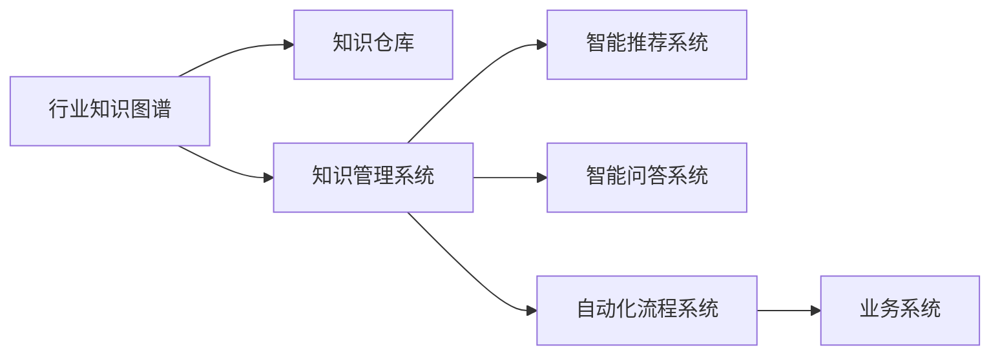

                 

# 行业知识服务要建立专家智库和品牌

> 关键词：行业知识服务, 专家智库, 知识品牌, 数据分析, 应用开发, 用户研究, 技术架构, 安全保障

## 1. 背景介绍

### 1.1 问题由来

随着信息技术的发展，各行各业对数据和知识的需求愈发强烈。在医疗、金融、制造等垂直领域，大量的业务决策、客户服务、产品研发等都离不开高效、准确、系统的行业知识。然而，很多行业领域的知识体系庞杂、散乱，缺乏系统化和标准化。许多信息被锁定在数据孤岛中，难以被有效整合和利用，导致业务效率低下、决策支持不足、服务质量不高的问题。

行业知识服务的核心目标在于，通过构建行业知识图谱、知识仓库、知识管理系统等基础设施，将散乱的知识进行标准化和系统化，提供高效、智能、定制化的知识服务。从而支持行业内企业进行业务创新、提升决策效率、优化客户体验。

### 1.2 问题核心关键点

行业知识服务的构建涉及多个关键环节，包括：

- **数据收集和清洗**：行业知识服务的第一步是数据收集，涉及大量结构化和非结构化数据。这些数据来源广泛，包括但不限于业务系统数据、公开发布的数据、用户反馈数据等。数据清洗则是确保数据准确性、完整性、一致性的重要环节。
- **知识抽取和建模**：从大量数据中抽取行业知识，如实体、关系、属性等，并进行结构化和语义化的建模。
- **知识存储与检索**：建立高效的知识存储系统，如知识图谱、知识仓库等，并通过智能化的检索技术，支持快速、精准的知识检索。
- **知识应用与服务**：构建知识应用系统，如推荐系统、智能问答、自动化流程等，为用户提供智能化的知识服务。

### 1.3 问题研究意义

行业知识服务是行业数字化转型的重要支撑，能够为行业企业带来显著的价值提升。

- **提升决策效率**：通过提供高质量、结构化的行业知识，支持企业决策者快速获取关键信息，提升决策速度和质量。
- **优化业务流程**：利用知识服务支持自动化流程和智能推荐，提高业务流程的效率和质量。
- **改善客户体验**：通过智能问答、个性化推荐等技术，提升客户服务体验，增强用户满意度。
- **促进知识共享**：构建知识平台，促进知识共享和传播，形成行业知识库，推动行业创新和进步。

## 2. 核心概念与联系

### 2.1 核心概念概述

行业知识服务的构建涉及到多个核心概念：

- **行业知识图谱**：以实体、关系为核心的知识表示形式，通过图结构存储行业领域的关键信息。
- **知识仓库**：将结构化和半结构化数据整合在一起的知识存储系统，支持高效的检索和分析。
- **知识管理系统(KMS)**：提供知识抽取、存储、检索、应用等功能，支持知识的生命周期管理。
- **智能推荐系统**：利用知识图谱和用户行为数据，提供个性化的知识推荐服务。
- **智能问答系统**：基于自然语言处理(NLP)和知识图谱，实现智能问答功能，支持客户服务、技术支持等场景。
- **自动化流程系统**：结合知识图谱和业务规则，实现自动化流程和决策支持，提升业务效率。

### 2.2 核心概念原理和架构的 Mermaid 流程图



这个流程图展示了行业知识服务的主要组件及其联系。

- **行业知识图谱**通过抽取和建模，将行业知识转化为结构化的图谱形式，为其他组件提供基础数据。
- **知识仓库**存储行业知识图谱和结构化数据，支持高效的检索和分析。
- **知识管理系统(KMS)**集成知识抽取、存储、检索、应用等功能，是知识服务的核心组件。
- **智能推荐系统**和**智能问答系统**基于知识图谱，提供智能化的推荐和问答服务。
- **自动化流程系统**利用知识图谱和业务规则，实现业务流程的自动化和决策支持。

### 2.3 核心概念之间的联系

这些核心概念相互关联，共同构成了行业知识服务的生态系统。具体联系如下：

- **知识抽取与建模**：是知识图谱构建的基础，通过自然语言处理(NLP)技术从文本中抽取实体、关系和属性。
- **知识存储与检索**：知识图谱和数据仓库存储了行业知识，通过检索技术支持高效的信息获取。
- **知识应用与服务**：知识管理系统将知识图谱和数据仓库中的知识应用于推荐、问答、流程自动化等场景，提升业务效率和用户体验。

## 3. 核心算法原理 & 具体操作步骤

### 3.1 算法原理概述

行业知识服务的构建涉及多领域技术，包括数据处理、自然语言处理、知识图谱构建、智能推荐、知识管理等。其中，核心算法原理如下：

- **自然语言处理(NLP)**：利用分词、命名实体识别、依存句法分析等技术，从文本中抽取实体、关系和属性。
- **知识抽取与建模**：通过基于规则和机器学习的方法，从大量数据中提取实体、关系、属性，并构建知识图谱。
- **知识存储与检索**：利用数据库技术、图数据库技术、索引技术等，高效存储和管理知识图谱和数据仓库中的知识，并支持快速检索。
- **智能推荐与问答**：利用知识图谱和用户行为数据，进行推荐和问答，支持个性化服务。
- **自动化流程与决策支持**：通过规则引擎、决策树、AI模型等，实现业务流程的自动化和决策支持。

### 3.2 算法步骤详解

行业知识服务的构建步骤如下：

1. **数据收集与清洗**：收集行业相关的数据，包括业务系统数据、公开数据、用户反馈数据等。数据清洗包括去重、去噪、填补缺失值等，确保数据的准确性和完整性。
2. **知识抽取与建模**：利用NLP技术从数据中抽取实体、关系、属性，并进行语义化的建模。知识抽取和建模过程可以分为两个步骤：
   - **基于规则的抽取**：利用领域专家设计的规则，从数据中识别实体、关系和属性。
   - **基于机器学习的抽取**：利用机器学习算法，自动从数据中抽取实体、关系和属性。
3. **知识存储与检索**：选择合适的存储技术，如数据库、图数据库、文档存储等，存储知识图谱和数据仓库中的知识。通过索引和检索技术，支持快速、精准的知识检索。
4. **知识应用与服务**：构建知识应用系统，如智能推荐、智能问答、自动化流程等，提供智能化的知识服务。通过API接口、移动端应用等形式，将知识服务接入到业务系统中。

### 3.3 算法优缺点

行业知识服务的构建具有以下优点：

- **标准化和系统化**：通过知识抽取和建模，将散乱的知识进行标准化和系统化，提升了数据的利用效率。
- **智能化和个性化**：利用智能推荐、智能问答等技术，提升服务智能化和个性化水平。
- **提升业务效率**：通过自动化流程和决策支持，提升了业务流程的效率和质量。

然而，行业知识服务的构建也存在一些缺点：

- **数据质量和量级**：数据收集和清洗过程耗时耗力，数据量和质量直接影响到知识服务的准确性和有效性。
- **技术复杂度**：涉及多领域技术，技术难度较大，需要跨学科的团队合作。
- **知识更新和维护**：知识图谱和数据仓库需要定期更新和维护，以保持知识的实时性。
- **隐私和安全问题**：在数据收集和处理过程中，需注意隐私保护和安全保障，确保数据安全和合规性。

### 3.4 算法应用领域

行业知识服务在多个领域有广泛的应用，包括：

- **医疗行业**：通过知识图谱和智能问答，提升医疗服务质量，支持医疗决策支持。
- **金融行业**：利用智能推荐和自动化流程，提升金融产品的推荐和风险管理能力。
- **制造行业**：通过知识图谱和决策支持，提升供应链管理和生产效率。
- **教育行业**：利用知识图谱和智能推荐，提升教育资源管理和个性化学习推荐。
- **政府行业**：构建公共知识和政务服务系统，支持政务管理和公共服务。

## 4. 数学模型和公式 & 详细讲解 & 举例说明

### 4.1 数学模型构建

行业知识服务构建的核心在于知识抽取和建模，通过构建知识图谱来表示和存储行业知识。知识图谱通常采用图结构表示，由节点和边构成。节点表示实体或属性，边表示实体之间的关系。

知识图谱的数学模型可以表示为：

$$
G = (N, E, R)
$$

其中：
- $N$ 表示节点集合，包含实体和属性。
- $E$ 表示边集合，表示实体之间的关系。
- $R$ 表示关系集合，包含各种关系类型。

### 4.2 公式推导过程

知识图谱的构建过程包括以下几个步骤：

1. **实体抽取**：利用NLP技术，从文本中识别出实体。常见的实体抽取方法包括基于规则的方法和基于机器学习的方法。

2. **关系抽取**：识别实体之间的关系。常用的关系抽取方法包括基于规则的方法和基于机器学习的方法。

3. **属性抽取**：识别实体的属性。常用的属性抽取方法包括基于规则的方法和基于机器学习的方法。

4. **关系推理**：利用已有的知识图谱，通过推理引擎推导出新的关系。常用的推理方法包括基于规则的推理和基于深度学习的推理。

### 4.3 案例分析与讲解

以医疗行业为例，分析知识图谱的构建过程。

1. **实体抽取**：从电子病历、医学文献等文本中抽取疾病、症状、药品等实体。
2. **关系抽取**：识别实体之间的关系，如疾病与症状之间的关系、药品与疾病之间的关系等。
3. **属性抽取**：识别实体的属性，如疾病的症状、药品的剂量等。
4. **关系推理**：利用已有的知识图谱，通过推理引擎推导出新的关系，如症状与疾病之间的关系、药品与治疗方案之间的关系等。

## 5. 项目实践：代码实例和详细解释说明

### 5.1 开发环境搭建

为了构建行业知识服务，需要搭建一个支持多数据源、多技术栈的开发环境。

1. **开发环境准备**：
   - 安装Python、Java、Python SDK等开发语言和工具。
   - 搭建数据存储系统，如MySQL、Elasticsearch等。
   - 搭建知识图谱系统，如Neo4j、TinkerPop等。
   - 搭建自然语言处理系统，如NLTK、SpaCy等。

2. **开发工具安装**：
   - 安装Visual Studio Code、PyCharm、IntelliJ IDEA等开发工具。
   - 安装依赖库，如TensorFlow、PyTorch、SpaCy、NLTK等。

3. **数据采集和处理**：
   - 搭建数据采集系统，自动采集和存储行业数据。
   - 数据清洗和预处理，包括数据去重、去噪、填补缺失值等。

### 5.2 源代码详细实现

下面以医疗知识服务为例，给出代码实现。

1. **数据采集和清洗**：

```python
import pandas as pd
from pandas_profiling import ProfileReport

# 从电子病历中提取数据
electronic_medical_records = pd.read_csv('electronic_medical_records.csv')

# 数据清洗
electronic_medical_records = electronic_medical_records.drop_duplicates()
electronic_medical_records = electronic_medical_records.fillna(method='ffill')

# 数据预处理
electronic_medical_records = electronic_medical_records[['disease', 'symptom', 'treatment']]

# 生成数据报告
report = ProfileReport(electric_medical_records, title='Electronic Medical Records Profile')
report.to_file('electronic_medical_records_profile.html')
```

2. **知识抽取和建模**：

```python
from spacy import displacy
from spacy.matcher import Matcher
from spacy.matcher import PhraseMatcher

# 加载SpaCy模型
nlp = spacy.load('en_core_web_sm')

# 实体匹配器
matcher = Matcher(nlp.vocab)
matcher.add("PERSON", None, None, "PERSON")
matcher.add("LOCATION", None, None, "LOCATION")
matcher.add("ORGANIZATION", None, None, "ORGANIZATION")

# 依存句法分析
doc = nlp(text)
matches = matcher(doc)
for _, start, end in matches:
    ent = doc[start:end]
    print(ent.text)

# 命名实体识别
noun_chunks = [chunk for chunk in doc.noun_chunks]
for chunk in noun_chunks:
    print(chunk.text)

# 依存句法分析
dep_tokens = [token for token in doc if token.dep_ == 'nsubj' or token.dep_ == 'dobj']
for token in dep_tokens:
    print(token.text)
```

3. **知识存储与检索**：

```python
from neo4j import GraphDatabase

# 连接数据库
driver = GraphDatabase.driver('bolt://localhost:7687', auth=('neo4j', 'password'))

# 创建数据库
with driver.session() as session:
    session.run("CREATE DATABASE knowledge_graph")
    session.run("CREATE INDEX ON nodes(disease)")
    session.run("CREATE INDEX ON nodes(symptom)")
    session.run("CREATE INDEX ON nodes(treatment)")

# 插入数据
with driver.session() as session:
    session.run("INSERT INTO disease (disease_name) VALUES ('Flu')")
    session.run("INSERT INTO symptom (symptom_name) VALUES ('Cough')")
    session.run("INSERT INTO treatment (treatment_name) VALUES ('Medication')")

# 查询数据
with driver.session() as session:
    result = session.run("MATCH (d:Disease)-[:HAS_SYMPTOM]->(s:Symptom) RETURN d, s")
    for record in result:
        print(record['disease_name'], record['symptom_name'])
```

4. **知识应用与服务**：

```python
import flask
from flask import request
from py2neo import Graph, Node, Relationship

# 连接数据库
graph = Graph("bolt://localhost:7687", auth=("neo4j", "password"))

# 创建Flask应用
app = flask.Flask(__name__)

# 推荐系统
@app.route('/recommend', methods=['POST'])
def recommend():
    disease = request.json['disease']
    symptom = request.json['symptom']
    query = """
    MATCH (d:Disease)-[:HAS_SYMPTOM]->(s:Symptom)
    WHERE d.disease_name = '{disease}' AND s.symptom_name = '{symptom}'
    RETURN s.treatment_name
    """.format(disease=disease, symptom=symptom)
    result = graph.run(query)
    recommendation = result.single()['symptom_name']
    return flask.jsonify({'recommendation': recommendation})

# 智能问答系统
@app.route('/answer', methods=['POST'])
def answer():
    question = request.json['question']
    query = """
    MATCH (d:Disease)-[:HAS_TREATMENT]->(t:Treatment)
    WHERE d.disease_name = '{disease}' AND t.treatment_name = '{treatment}'
    RETURN t.treatment_name
    """.format(disease=question, treatment=question)
    result = graph.run(query)
    answer = result.single()['treatment_name']
    return flask.jsonify({'answer': answer})

if __name__ == '__main__':
    app.run(debug=True)
```

### 5.3 代码解读与分析

**数据采集和清洗**：
- 使用Pandas库读取电子病历数据，并进行去重、填补缺失值等处理。
- 利用Pandas Profiling生成数据报告，可视化数据分布和统计特征。

**知识抽取和建模**：
- 利用SpaCy库进行实体抽取和依存句法分析，识别出疾病、症状和治疗方法。
- 使用Matcher工具进行实体匹配，将抽取的实体存储到知识图谱中。

**知识存储与检索**：
- 使用Py2Neo库连接Neo4j数据库，进行知识存储和检索。
- 插入疾病、症状和治疗数据，并查询出包含特定症状的推荐治疗。

**知识应用与服务**：
- 利用Flask框架构建Web应用，提供推荐和智能问答功能。
- 通过API接口获取输入的疾病和症状，返回推荐的治疗方案和智能问答结果。

### 5.4 运行结果展示

运行上述代码，可以在Web界面中提供智能化的医疗推荐和问答服务。用户输入疾病和症状，系统自动推荐治疗方案和提供智能问答。

## 6. 实际应用场景

### 6.1 医疗行业

在医疗行业中，知识服务可以应用于以下场景：

- **疾病诊断和治疗**：利用知识图谱和智能问答，辅助医生进行疾病诊断和治疗方案推荐。
- **患者管理**：通过智能推荐系统，推荐个性化的治疗方案和药物管理。
- **医学研究**：利用知识图谱和数据挖掘技术，支持医学研究和新药开发。

### 6.2 金融行业

在金融行业中，知识服务可以应用于以下场景：

- **风险管理**：利用知识图谱和智能推荐，评估客户的风险等级，进行风险管理。
- **投资决策**：通过智能推荐系统，推荐投资组合和市场分析报告。
- **客户服务**：利用智能问答系统，提供客户咨询和投诉处理。

### 6.3 制造行业

在制造行业中，知识服务可以应用于以下场景：

- **供应链管理**：利用知识图谱和自动化流程，优化供应链管理和库存管理。
- **设备维护**：通过智能推荐系统，推荐设备维护计划和备件管理。
- **产品设计**：利用知识图谱和数据挖掘技术，支持产品设计和创新。

### 6.4 未来应用展望

未来，行业知识服务的构建将进一步发展，面临以下几个趋势：

1. **跨领域知识融合**：利用知识图谱和跨领域知识库，构建跨领域的知识服务。
2. **实时数据处理**：利用大数据和流处理技术，实现实时数据处理和知识更新。
3. **智能推荐系统**：利用深度学习和强化学习技术，提升推荐系统的个性化和智能性。
4. **用户行为分析**：利用数据挖掘和机器学习技术，分析用户行为，提供更加个性化的服务。
5. **知识图谱演进**：利用知识图谱的演化算法，动态更新和维护知识图谱。

## 7. 工具和资源推荐

### 7.1 学习资源推荐

为了学习行业知识服务的构建，推荐以下学习资源：

1. **《知识图谱理论与实践》**：介绍知识图谱的基本概念和构建方法，涵盖实体抽取、关系抽取、属性抽取等内容。
2. **《深度学习与知识图谱》**：结合深度学习技术，介绍知识图谱的构建、存储和检索。
3. **《智能推荐系统》**：介绍智能推荐系统的算法和技术，涵盖协同过滤、基于内容的推荐、深度学习推荐等内容。
4. **《自然语言处理基础》**：介绍自然语言处理的基本技术和工具，涵盖分词、命名实体识别、依存句法分析等内容。

### 7.2 开发工具推荐

为了构建行业知识服务，推荐以下开发工具：

1. **Python**：主流的编程语言，具有丰富的数据处理和机器学习库。
2. **Java**：面向对象的编程语言，支持多线程和分布式计算。
3. **PyTorch**：深度学习框架，支持高效的模型训练和推理。
4. **TensorFlow**：深度学习框架，支持分布式计算和大规模数据处理。
5. **Flask**：Web框架，支持构建Web应用和服务。

### 7.3 相关论文推荐

为了深入了解行业知识服务的构建，推荐以下相关论文：

1. **《医疗知识图谱构建与应用》**：介绍医疗知识图谱的构建方法和应用，涵盖实体抽取、关系抽取、属性抽取等内容。
2. **《金融知识图谱构建与推荐系统》**：介绍金融知识图谱的构建方法和推荐系统技术，涵盖金融实体抽取、关系抽取、推荐算法等内容。
3. **《制造业知识图谱构建与自动化流程》**：介绍制造业知识图谱的构建方法和自动化流程，涵盖实体抽取、关系抽取、自动化流程等内容。
4. **《知识图谱演化算法与实时更新》**：介绍知识图谱的演化算法和实时更新方法，涵盖知识图谱的动态维护和实时更新等内容。

## 8. 总结：未来发展趋势与挑战

### 8.1 研究成果总结

本文介绍了行业知识服务的构建过程，包括数据收集和清洗、知识抽取和建模、知识存储与检索、知识应用与服务等关键步骤。通过知识图谱、知识仓库、知识管理系统等基础设施，提供高效、智能、个性化的知识服务，支持行业企业提升决策效率、优化业务流程、改善客户体验。

### 8.2 未来发展趋势

未来，行业知识服务的构建将呈现以下几个发展趋势：

1. **数据驱动的智能决策**：利用大数据和深度学习技术，提供智能化的决策支持。
2. **跨领域知识融合**：构建跨领域的知识图谱，支持多领域的数据整合和知识应用。
3. **实时数据处理**：利用大数据和流处理技术，实现实时数据处理和知识更新。
4. **个性化和智能化**：利用深度学习和强化学习技术，提升推荐系统和智能问答系统的个性化和智能性。
5. **用户行为分析**：利用数据挖掘和机器学习技术，分析用户行为，提供更加个性化的服务。

### 8.3 面临的挑战

行业知识服务的构建面临以下几个挑战：

1. **数据质量和量级**：数据收集和清洗过程耗时耗力，数据量和质量直接影响到知识服务的准确性和有效性。
2. **技术复杂度**：涉及多领域技术，技术难度较大，需要跨学科的团队合作。
3. **知识更新和维护**：知识图谱和数据仓库需要定期更新和维护，以保持知识的实时性。
4. **隐私和安全问题**：在数据收集和处理过程中，需注意隐私保护和安全保障，确保数据安全和合规性。

### 8.4 研究展望

未来的研究方向包括：

1. **数据质量和量级**：探索更高效的数据清洗和预处理方法，提高数据质量，降低数据量级。
2. **技术复杂度**：开发更易于使用的工具和框架，降低技术门槛，简化开发过程。
3. **知识更新和维护**：研究知识图谱的演化算法，动态更新和维护知识图谱，提高知识的时效性。
4. **隐私和安全问题**：研究隐私保护和安全保障技术，确保数据安全和合规性。

## 9. 附录：常见问题与解答

**Q1：行业知识服务对数据质量有什么要求？**

A: 行业知识服务对数据质量要求较高，主要体现在以下几个方面：

1. **完整性**：数据需覆盖行业领域的各个方面，包含所有重要实体、关系和属性。
2. **准确性**：数据需准确无误，避免错误的实体、关系和属性。
3. **一致性**：数据需保持一致性，避免重复、矛盾的信息。
4. **及时性**：数据需及时更新，反映最新的行业知识。

**Q2：行业知识服务构建过程中，如何保证数据的安全和隐私？**

A: 在数据收集和处理过程中，需注意以下数据安全和隐私问题：

1. **数据加密**：使用加密技术保护数据的传输和存储。
2. **访问控制**：限制数据访问权限，确保只有授权人员可以访问数据。
3. **数据脱敏**：对敏感数据进行脱敏处理，防止数据泄露。
4. **合规性**：确保数据处理过程符合相关法律法规，如GDPR、HIPAA等。

**Q3：如何构建高效的推荐系统？**

A: 构建高效的推荐系统需要考虑以下几个方面：

1. **数据来源**：收集高质量的数据，涵盖用户行为、物品属性、用户画像等信息。
2. **算法选择**：选择适合的推荐算法，如协同过滤、基于内容的推荐、深度学习推荐等。
3. **模型训练**：利用大数据和深度学习技术，训练高效的推荐模型。
4. **系统优化**：优化推荐系统的计算图，减少前向传播和反向传播的资源消耗，提升推理速度。

**Q4：知识图谱和数据仓库的区别是什么？**

A: 知识图谱和数据仓库的区别主要体现在以下几个方面：

1. **数据类型**：数据仓库主要存储结构化数据，如表格、文档等；知识图谱主要存储半结构化和非结构化数据，如文本、图像等。
2. **数据关系**：数据仓库主要存储数据的逻辑关系，如外键、索引等；知识图谱主要存储实体的关系，如实体-关系三元组。
3. **查询方式**：数据仓库主要支持SQL查询，快速检索结构化数据；知识图谱主要支持图数据库查询，支持复杂的关系查询和推理。

**Q5：行业知识服务构建过程中，如何提高数据质量？**

A: 提高数据质量可以从以下几个方面入手：

1. **数据清洗**：去除重复、无效、错误的数据，确保数据的完整性和准确性。
2. **数据标准化**：统一数据格式和命名规范，确保数据的一致性。
3. **数据校验**：建立数据校验机制，及时发现和纠正错误数据。
4. **数据更新**：定期更新数据，反映最新的行业知识，保持数据的时效性。

**Q6：行业知识服务如何提供个性化的推荐和问答？**

A: 提供个性化的推荐和问答需要考虑以下几个方面：

1. **用户画像**：构建用户画像，了解用户的兴趣、需求和行为。
2. **推荐算法**：选择适合的推荐算法，如协同过滤、基于内容的推荐、深度学习推荐等。
3. **自然语言处理**：利用自然语言处理技术，提取用户输入的自然语言查询，进行语义理解和实体识别。
4. **知识图谱**：利用知识图谱，进行实体关系推理和属性抽取，获取推荐结果和问答答案。

**Q7：行业知识服务的构建过程中，如何确保数据安全和隐私？**

A: 在数据收集和处理过程中，需注意以下数据安全和隐私问题：

1. **数据加密**：使用加密技术保护数据的传输和存储。
2. **访问控制**：限制数据访问权限，确保只有授权人员可以访问数据。
3. **数据脱敏**：对敏感数据进行脱敏处理，防止数据泄露。
4. **合规性**：确保数据处理过程符合相关法律法规，如GDPR、HIPAA等。

通过以上总结和解答，相信你对行业知识服务的构建有了更深入的了解。在实际应用中，需要根据具体行业特点和需求，不断优化和改进知识服务，以提升行业企业的业务效率和用户体验。

---

作者：禅与计算机程序设计艺术 / Zen and the Art of Computer Programming

