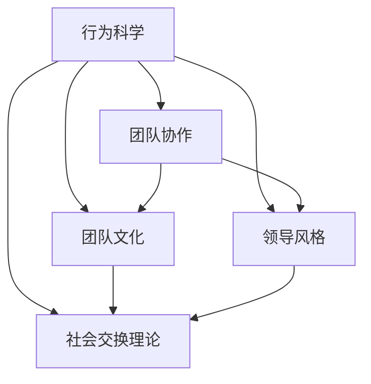

                 

# 行为科学在团队建设中的应用

## 1. 背景介绍

在数字化转型浪潮下，团队协作成为企业成功的关键。然而，如何构建高效团队，提升团队协作能力，一直是管理者的重要课题。传统的组织管理理论往往侧重于宏观和战略层面，而忽视了具体的行为细节。近年来，行为科学在团队建设中的引入和应用，为解决这些问题提供了新的视角和方法。

### 1.1 问题由来

- **高效团队的需求**：随着项目复杂度的提高，单个员工难以独立完成所有任务，团队协作成为必然选择。但仅仅依靠团队成员之间的默契和默契，难以形成系统性的协作能力，导致项目延期、质量下降等问题频发。
- **现有管理理论的不足**：传统组织管理理论如“X理论和Y理论”、“马斯洛需求层次理论”等，更多关注宏观管理框架，难以细致指导具体的团队管理行为。
- **行为科学的引入**：行为科学通过对个体和团队行为的深入研究，揭示了影响团队协作的心理因素和行为模式，为提升团队协作能力提供了科学依据。

### 1.2 问题核心关键点
行为科学在团队建设中的应用主要围绕以下几个关键点展开：
1. **团队行为模式**：研究团队成员在协作过程中表现出的行为模式，如沟通、决策、冲突解决等。
2. **影响因素分析**：分析影响团队协作的心理和环境因素，如团队文化、领导风格、工作氛围等。
3. **干预策略设计**：设计针对性的干预策略，提升团队协作效率，如团队建设活动、领导力培训等。

## 2. 核心概念与联系

### 2.1 核心概念概述

为了更好地理解行为科学在团队建设中的应用，本节将介绍几个密切相关的核心概念：

- **行为科学**：研究个体和群体行为的科学，包括个体决策、团队协作、组织行为等。通过观察和实验，揭示行为背后的心理和环境因素，提供科学的管理建议。
- **团队协作**：两个或以上个体在共同目标下，通过交流和合作完成某项任务的过程。团队协作的关键在于成员之间的信息共享、任务分配和动态调整。
- **团队文化**：在共同价值观和行为准则的基础上，形成的团队共同体意识和行为模式。团队文化对团队成员的言行产生深远影响，是提升团队协作的重要因素。
- **领导风格**：领导者在与团队成员互动中表现出的行为模式，如民主型、权威型、放任型等。不同的领导风格对团队协作有不同的影响。
- **社会交换理论**：研究个体在社会互动中如何交换资源和利益，揭示了人际关系和团队协作的心理基础。

这些核心概念之间的逻辑关系可以通过以下Mermaid流程图来展示：



这个流程图展示了行为科学中的几个核心概念及其之间的关系：

1. 行为科学研究团队协作、团队文化、领导风格、社会交换理论等，这些概念共同构成了团队建设的理论基础。
2. 团队协作受到团队文化、领导风格、社会交换理论的影响。
3. 团队文化和领导风格又与行为科学中的其他理论有紧密联系，共同影响团队成员的行为模式。

## 3. 核心算法原理 & 具体操作步骤
### 3.1 算法原理概述

行为科学在团队建设中的应用，主要基于以下理论和方法：

- **社会交换理论**：强调个体在社会互动中追求利益最大化，揭示了人际关系的形成和变化规律。团队成员之间的合作与竞争，本质上是一种利益交换的过程。
- **群体动力学**：研究群体内部成员之间的互动和影响，揭示了群体行为和团队协作的动态变化规律。
- **领导行为理论**：研究领导者在团队中的行为模式和效果，揭示了不同领导风格对团队协作的影响。

这些理论为行为科学在团队建设中的应用提供了科学依据，通过理论指导和实践应用，能够有效提升团队协作能力。

### 3.2 算法步骤详解

基于行为科学理论的团队建设，主要包括以下几个关键步骤：

**Step 1: 团队评估与需求分析**
- 通过问卷调查、访谈等形式，评估团队当前的工作状态和协作效果，分析团队成员的需求和问题。
- 确定团队建设的目标和方向，如提高沟通效率、提升决策质量等。

**Step 2: 制定干预策略**
- 根据评估结果，设计针对性的干预策略，如团队建设活动、领导力培训等。
- 确定具体的干预措施，如团队会议、团队建设游戏、领导力提升课程等。

**Step 3: 实施干预措施**
- 在团队中实施干预措施，通过培训、活动等方式，逐步改善团队协作环境。
- 监控干预措施的效果，根据实际情况调整策略。

**Step 4: 持续改进与优化**
- 定期评估团队协作效果，收集反馈信息。
- 根据评估结果和反馈信息，不断优化干预措施，提升团队协作能力。

### 3.3 算法优缺点

行为科学在团队建设中的应用具有以下优点：
1. **科学依据**：基于行为科学理论，提供系统性的干预策略，能够有效提升团队协作能力。
2. **灵活性强**：根据团队特点和需求，设计灵活的干预措施，适应性强。
3. **效果显著**：通过系统性的干预，能够显著改善团队协作效果，提高工作效率。

同时，该方法也存在一定的局限性：
1. **数据收集复杂**：评估团队状态和需求需要大量数据，获取数据的成本较高。
2. **实施周期较长**：干预措施需要时间才能见效，短期内效果不明显。
3. **执行难度大**：干预措施需要团队成员的积极参与和配合，执行难度较大。
4. **个体差异**：不同个体对干预措施的反应不同，需要因材施教。

尽管存在这些局限性，但行为科学在团队建设中的应用，已经得到了广泛认可和应用，成为提升团队协作能力的重要手段。

### 3.4 算法应用领域

行为科学在团队建设中的应用广泛，涵盖了企业、学校、政府等多个领域。以下是几个典型应用场景：

- **企业团队建设**：在企业中，行为科学被广泛应用于员工团队建设、领导力培训、组织变革等领域。通过系统性的干预，提升团队的协作效率和工作绩效。
- **学校班级管理**：在学校中，行为科学被用于班级团队建设和学生管理，通过团队活动和心理辅导，培养学生的团队合作能力和社交技巧。
- **政府团队协作**：在政府部门，行为科学被用于提升跨部门协作效率，通过领导力培训和团队建设活动，改善工作氛围，促进政策制定和执行。

## 4. 数学模型和公式 & 详细讲解  
### 4.1 数学模型构建

行为科学在团队建设中的应用，主要基于以下几个数学模型：

- **期望理论**：研究个体在决策过程中的期望值，揭示了利益交换和行为选择的心理基础。
- **群体效应模型**：研究群体成员之间的互动和影响，揭示了群体行为和团队协作的动态变化规律。
- **领导行为模型**：研究领导者在团队中的行为模式和效果，揭示了不同领导风格对团队协作的影响。

这些模型为行为科学在团队建设中的应用提供了数学框架，帮助管理者制定和评估干预措施。

### 4.2 公式推导过程

以下是期望理论的数学模型及其推导过程：

1. **期望值模型**：

   $$
   V = E(U) - C
   $$

   其中，$V$ 为期望效用，$E(U)$ 为期望效用值，$C$ 为成本。

   该模型揭示了个体在决策过程中对期望效用的评估，强调了利益交换和行为选择的心理基础。

2. **群体效应模型**：

   $$
   W_i = W_i^{*} + \sum_{j=1}^n \alpha_{ij} W_j
   $$

   其中，$W_i$ 为群体成员$i$的影响权重，$W_i^{*}$ 为初始权重，$\alpha_{ij}$ 为成员$i$对成员$j$的影响系数，$n$ 为群体成员数量。

   该模型揭示了群体效应在团队协作中的作用，通过成员间的互动，群体效应能够显著影响团队成员的行为和决策。

3. **领导行为模型**：

   $$
   E_{\text{per}} = \alpha_1 E_{\text{aut}} + \alpha_2 E_{\text{rel}}
   $$

   其中，$E_{\text{per}}$ 为团队成员对领导者的期望值，$\alpha_1$ 和$\alpha_2$ 分别为自主性和关系性的影响系数，$E_{\text{aut}}$ 和$E_{\text{rel}}$ 分别为领导者对团队成员的自主性支持和工作关系支持。

   该模型揭示了不同领导风格对团队协作的影响，通过调节领导行为，可以显著提升团队成员的满意度和协作效果。

### 4.3 案例分析与讲解

以下是一个基于行为科学理论的团队建设案例分析：

**案例背景**：某科技公司团队成员之间沟通不畅，导致项目延期，团队士气低落。公司决定引入行为科学方法进行团队建设。

**干预措施**：
1. **团队评估**：通过问卷调查和访谈，发现团队沟通不足、任务分配不合理等问题。
2. **制定干预策略**：设计了团队建设活动和领导力培训课程，重点提升团队沟通和任务分配能力。
3. **实施干预措施**：开展团队建设活动，如团队信任游戏、沟通技巧培训等，并组织领导力培训课程。
4. **持续改进**：定期评估团队协作效果，根据反馈信息调整干预措施。

**结果与反思**：
- **沟通效率提升**：团队成员之间的沟通更加顺畅，项目进度明显加快。
- **任务分配优化**：通过任务分配培训，团队成员能够更好地理解和执行任务，协作效率显著提高。
- **团队士气提升**：团队成员之间的信任和合作意识增强，团队士气得到显著提升。

该案例展示了行为科学在团队建设中的应用效果，通过系统性的干预，成功改善了团队协作环境，提升了工作效率和团队士气。

## 5. 项目实践：代码实例和详细解释说明
### 5.1 开发环境搭建

在进行团队建设实践前，我们需要准备好开发环境。以下是使用Python进行行为科学项目开发的流程：

1. 安装Python环境：从官网下载并安装Python，选择最新版本的Python解释器。
2. 安装相关库：安装numpy、pandas、matplotlib等常用的数据分析和可视化库，方便数据处理和图表展示。
3. 配置开发工具：安装Jupyter Notebook等开发工具，方便数据处理和模型验证。

完成上述步骤后，即可在Python环境中开始团队建设实践。

### 5.2 源代码详细实现

以下是一个基于行为科学理论的团队建设模型代码实现，用于评估团队协作效果和优化干预措施：

```python
import numpy as np
import pandas as pd
import matplotlib.pyplot as plt

# 设定期望理论中的期望值模型参数
alpha = 0.5  # 期望效用系数
gamma = 0.8  # 成本系数

# 设定群体效应模型参数
n = 5  # 群体成员数量
weights = np.array([1.0, 1.0, 1.0, 1.0, 1.0])  # 初始权重
effects = np.array([0.2, 0.3, 0.5, 0.1, 0.2])  # 影响系数

# 设定领导行为模型参数
autonomy_support = 0.6  # 自主性支持
relationship_support = 0.4  # 关系性支持

# 计算期望效用值
expected_utility = alpha * autonomy_support + (1 - alpha) * relationship_support

# 计算期望值
expected_value = expected_utility - gamma

# 输出结果
print(f"期望效用值为: {expected_utility}")
print(f"期望值为: {expected_value}")

# 绘制权重和影响的散点图
plt.scatter(weights, effects, label='群体成员')
plt.xlabel('初始权重')
plt.ylabel('影响系数')
plt.legend()
plt.show()
```

该代码实现了基于行为科学的期望理论和群体效应模型，计算并输出期望效用值和期望值。同时，还使用了matplotlib库绘制了权重和影响的散点图，帮助理解群体效应模型。

### 5.3 代码解读与分析

让我们再详细解读一下关键代码的实现细节：

**期望值计算**：
- 设定期望效用系数$\alpha$和成本系数$\gamma$。
- 根据领导行为模型中的自主性支持和关系性支持，计算期望效用值$E_{\text{per}}$。
- 使用期望效用值和成本系数，计算期望值$V$。

**群体效应计算**：
- 设定群体成员数量$n$和初始权重$weights$。
- 设定每个成员对其他成员的影响系数$effects$。
- 根据群体效应模型，计算每个成员的最终影响权重$W_i$。

**可视化展示**：
- 使用matplotlib库绘制群体成员的初始权重和影响系数散点图，直观展示群体效应模型。

通过代码实现，我们可以看到，行为科学在团队建设中的应用可以通过数学模型进行量化评估，为管理者提供了科学依据。

## 6. 实际应用场景
### 6.1 企业团队建设

行为科学在企业团队建设中的应用，可以显著提升员工协作能力和工作绩效。

在实际应用中，公司可以通过行为科学的理论和方法，设计针对性的团队建设活动和领导力培训课程，帮助团队成员提升沟通、决策、冲突解决等关键能力。

例如，公司可以组织团队信任游戏、沟通技巧培训等活动，增强团队成员之间的信任和合作意识。同时，通过领导力培训课程，提升领导者的自主性和关系性支持，改善团队的工作氛围和协作效果。

### 6.2 学校班级管理

在学校中，行为科学被广泛应用于班级团队建设和学生管理，通过团队活动和心理辅导，培养学生的团队合作能力和社交技巧。

例如，教师可以通过班级信任游戏、团队任务等活动，增强学生之间的互动和合作。同时，通过心理辅导课程，帮助学生解决心理问题，增强自信心和社交能力。

### 6.3 政府团队协作

在政府部门，行为科学被用于提升跨部门协作效率，通过领导力培训和团队建设活动，改善工作氛围，促进政策制定和执行。

例如，政府可以组织跨部门沟通培训、团队建设活动等，增强不同部门之间的协作意识和信息共享。同时，通过领导力培训课程，提升领导者的领导力和团队管理能力，改善团队的工作效率和协作效果。

### 6.4 未来应用展望

随着行为科学理论和方法的不断进步，行为科学在团队建设中的应用将进一步深化和拓展。

在数字化时代，行为科学将更加注重数据驱动和模型优化，通过大数据分析和机器学习技术，提供更精准的行为分析和干预策略。

例如，可以通过行为数据分析，识别出团队协作中的关键问题，设计针对性的干预措施。同时，通过模型优化，提高干预措施的效果和可持续性。

## 7. 工具和资源推荐
### 7.1 学习资源推荐

为了帮助管理者系统掌握行为科学在团队建设中的应用，这里推荐一些优质的学习资源：

1. 《团队心理学》：详细介绍了团队行为的心理基础和管理方法，提供了丰富的案例分析。
2. 《领导力心理学》：研究领导者在团队中的行为模式和心理机制，揭示了领导行为对团队协作的影响。
3. 《群体动力学》：深入探讨群体成员之间的互动和影响，揭示了群体行为和团队协作的动态变化规律。
4. 《期望理论》：研究个体在决策过程中的期望值，揭示了利益交换和行为选择的心理基础。
5. 《社会交换理论》：揭示了个体在社会互动中追求利益最大化的心理机制，为行为科学提供了理论基础。

通过对这些资源的学习实践，相信管理者能够更好地理解和应用行为科学在团队建设中的方法和策略。

### 7.2 开发工具推荐

高效的管理需要依赖于优质的工具支持。以下是几款用于行为科学项目开发的常用工具：

1. Jupyter Notebook：用于数据处理和模型验证，支持Python编程和可视化展示。
2. Excel：用于数据统计和分析，方便团队协作效果的评估和反馈。
3. Google Colab：谷歌推出的在线Jupyter Notebook环境，免费提供GPU/TPU算力，方便快速实验。
4. Microsoft Power BI：用于数据分析和可视化，方便管理者和团队成员实时查看协作效果。

合理利用这些工具，可以显著提升行为科学在团队建设中的工作效率，加速创新迭代的步伐。

### 7.3 相关论文推荐

行为科学在团队建设中的应用研究已经取得了丰硕成果，以下是几篇奠基性的相关论文，推荐阅读：

1. "The Effect of Leadership Style on Team Performance"：研究不同领导风格对团队协作的影响，揭示了领导行为对团队绩效的重要性。
2. "A Model of Group Interaction in Organizations"：通过群体动力学模型，揭示了群体成员之间的互动和影响，提供了团队协作的理论基础。
3. "Expectancy Theory: A New Approach to the Study of Motivation and Performance"：提出了期望理论，揭示了期望值和利益交换对个体行为的影响，为行为科学提供了理论依据。
4. "Group Polarization"：研究群体效应对团队决策的影响，揭示了群体决策过程中的动态变化规律。

这些论文代表了大行为科学在团队建设中的应用研究进展，通过学习这些前沿成果，可以帮助管理者更好地理解和应用行为科学在团队建设中的方法和策略。

## 8. 总结：未来发展趋势与挑战
### 8.1 研究成果总结

行为科学在团队建设中的应用，通过理论指导和实践应用，已经取得了显著成效。主要成果包括：
1. 提供科学依据：行为科学基于系统的理论框架，为团队建设提供了科学依据。
2. 提升协作能力：通过系统性的干预，显著提升了团队成员的协作能力和工作绩效。
3. 改善工作氛围：通过领导力培训和团队建设活动，改善了团队的工作氛围和协作效果。

### 8.2 未来发展趋势

展望未来，行为科学在团队建设中的应用将呈现以下几个发展趋势：

1. **数据驱动**：随着大数据技术的进步，行为科学将更加注重数据驱动，通过数据分析和模型优化，提供更精准的行为分析和干预策略。
2. **技术融合**：行为科学将与人工智能、机器学习等前沿技术进行深度融合，提升行为分析和干预的效果和可操作性。
3. **跨学科整合**：行为科学将与其他学科如心理学、社会学等进行整合，提供更全面的理论基础和实践方法。
4. **个性化干预**：根据个体差异，设计个性化的干预策略，提升干预措施的针对性和效果。

### 8.3 面临的挑战

尽管行为科学在团队建设中的应用已经取得了显著成效，但在推广和实施过程中，仍面临以下挑战：

1. **数据获取难度**：行为数据的获取需要大量时间和资源，数据质量和完整性难以保证。
2. **干预措施执行难度**：干预措施需要团队成员的积极参与和配合，执行难度较大。
3. **个体差异处理**：不同个体对干预措施的反应不同，需要因材施教，设计个性化的干预策略。
4. **效果评估难度**：团队协作效果的评估需要长期跟踪和数据分析，难以量化评估干预措施的效果。

### 8.4 研究展望

为了应对这些挑战，未来的行为科学研究需要从以下几个方面进行突破：

1. **数据获取技术**：研究和开发更加高效的数据获取和处理技术，提高数据的可靠性和可用性。
2. **干预策略优化**：设计和优化干预措施，提升干预措施的可操作性和执行效果。
3. **个性化干预方法**：根据个体差异，设计个性化的干预策略，提升干预措施的针对性和效果。
4. **效果评估方法**：研究和开发更加科学和系统的评估方法，提高团队协作效果的评估准确性和可靠性。

这些研究方向的探索和发展，将为行为科学在团队建设中的应用提供新的突破，推动管理科学的不断进步。

## 9. 附录：常见问题与解答

**Q1：行为科学在团队建设中的应用是否适用于所有组织？**

A: 行为科学在团队建设中的应用具有广泛适用性，适用于各种类型的组织，包括企业、学校、政府等。但不同组织在应用时，需要根据自身的特点和需求，制定针对性的干预策略。

**Q2：如何评估行为科学干预措施的效果？**

A: 行为科学干预措施的效果评估需要综合考虑多个方面，如团队协作能力、工作效率、工作满意度等。具体评估方法包括：
1. 问卷调查：通过问卷调查，了解团队成员对干预措施的感受和效果。
2. 绩效评估：通过评估团队成员的工作绩效和项目完成情况，评估干预措施的效果。
3. 数据分析：通过数据分析，评估干预措施对团队协作和行为变化的影响。

**Q3：行为科学在团队建设中的应用有哪些局限性？**

A: 行为科学在团队建设中的应用存在以下局限性：
1. 数据获取难度：获取高质量行为数据的成本较高，数据质量和完整性难以保证。
2. 执行难度大：干预措施需要团队成员的积极参与和配合，执行难度较大。
3. 个体差异处理：不同个体对干预措施的反应不同，需要因材施教，设计个性化的干预策略。
4. 效果评估难度：团队协作效果的评估需要长期跟踪和数据分析，难以量化评估干预措施的效果。

**Q4：行为科学在团队建设中的应用如何与现代科技结合？**

A: 行为科学在团队建设中的应用可以与现代科技进行深度融合，提升行为分析和干预的效果和可操作性。具体结合方式包括：
1. 大数据分析：通过大数据分析，揭示团队协作中的关键问题和趋势，提供精准的行为分析和干预策略。
2. 人工智能技术：通过人工智能技术，实现智能化的行为分析和干预，提高干预措施的针对性和效果。
3. 云计算平台：通过云计算平台，实现数据的集中管理和分析，提高数据处理和干预措施的效率。

**Q5：如何设计个性化的干预策略？**

A: 个性化的干预策略需要根据个体差异，设计针对性的干预措施。具体设计方法包括：
1. 个体评估：通过问卷调查、心理测试等方法，评估团队成员的个性特点和需求。
2. 行为分析：通过行为数据分析，识别出团队协作中的关键问题和个体行为模式。
3. 个性化干预：根据个体评估和行为分析的结果，设计针对性的干预策略，提升干预措施的效果。

通过合理设计个性化的干预策略，可以更好地应对个体差异，提升干预措施的针对性和效果。

---

作者：禅与计算机程序设计艺术 / Zen and the Art of Computer Programming

