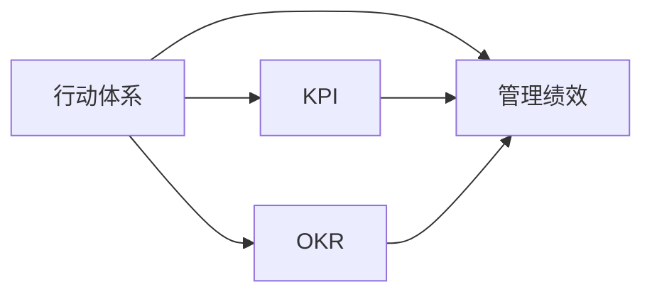

                 

# 行动体系与管理绩效的关联

行动体系与管理绩效的关联：一场实践与理论的深度对话

## 1. 背景介绍

### 1.1 问题由来
在现代企业管理中，行动体系与管理绩效之间存在着紧密的关联。一个有效的行动体系不仅能够提升企业的整体绩效，还能够增强员工的积极性和创造力。然而，这一关系并非总是显而易见的。在实际操作中，许多企业的管理层往往忽视了行动体系对绩效的影响，导致企业运营效率低下，员工士气低落。因此，理解并优化行动体系，对于提升企业管理绩效至关重要。

### 1.2 问题核心关键点
行动体系是指企业在战略规划、任务分配、员工激励、绩效评估等方面的制度安排和操作流程。管理绩效则是指企业在战略目标达成、业务增长、利润率提升等方面的表现。行动体系与管理绩效之间的关联主要体现在以下几个方面：

- 战略执行：行动体系的设计是否符合企业战略，直接影响战略的执行效果。
- 员工激励：行动体系是否能够有效地激励员工，调动其积极性和创造力。
- 绩效评估：行动体系是否能够公正、准确地评估员工绩效，促进个人与团队的表现提升。
- 风险管理：行动体系是否能够识别和应对潜在的运营风险，保障企业稳定发展。

### 1.3 问题研究意义
深入理解行动体系与管理绩效之间的关联，对于提升企业的整体运营效率、增强员工的士气和创造力具有重要意义。通过优化行动体系，企业可以更有效地实现其战略目标，提高市场竞争力。同时，优化后的行动体系也能够帮助员工更好地理解企业的目标和任务，增强其对企业的认同感和归属感。

## 2. 核心概念与联系

### 2.1 核心概念概述

为了更好地理解行动体系与管理绩效之间的关联，我们需要先明确几个核心概念：

- **行动体系**：指企业为了实现其战略目标和运营需求，设计的一系列制度和操作流程，包括但不限于任务分配、绩效评估、员工激励、风险管理等方面。
- **管理绩效**：指企业在一定时期内，其业务增长、利润率、市场份额、客户满意度等方面的表现。
- **KPI（关键绩效指标）**：指用于衡量企业或员工绩效的具体指标，如销售增长率、客户满意度、项目完成率等。
- **OKR（目标与关键结果）**：指一种绩效管理方法，通过设定明确的目标和关键结果，帮助企业聚焦于最重要的业务活动。

这些核心概念之间的关系可以用以下的Mermaid流程图表示：



这个流程图展示了行动体系通过影响KPI和OKR，进而对管理绩效产生影响的核心逻辑。

## 3. 核心算法原理 & 具体操作步骤

### 3.1 算法原理概述

行动体系与管理绩效之间的关联，可以通过一系列的算法模型进行量化和分析。这些算法模型基于行动体系的设计和执行情况，预测其对管理绩效的影响。

#### 3.1.1 数据收集与预处理
首先需要收集企业内部的相关数据，如行动体系的设计文档、员工反馈、绩效评估数据等。这些数据需要进行清洗和预处理，以确保数据的准确性和完整性。

#### 3.1.2 特征提取
对收集到的数据进行特征提取，如行动体系的设计复杂度、员工激励措施的公平性、绩效评估的标准化程度等。这些特征将作为输入数据，用于后续的建模分析。

#### 3.1.3 建模分析
使用机器学习或统计学方法，建立行动体系与管理绩效之间的关系模型。常用的方法包括回归分析、决策树、随机森林等。这些模型将帮助企业理解不同行动体系设计对管理绩效的具体影响。

#### 3.1.4 结果解读与优化
对模型预测结果进行解读，分析哪些行动体系设计因素对管理绩效的影响最大，哪些需要改进。根据分析结果，企业可以优化其行动体系，提升管理绩效。

### 3.2 算法步骤详解

#### 3.2.1 数据收集与清洗
1. **收集数据**：通过企业内部的信息管理系统，收集行动体系的设计文档、员工反馈、绩效评估数据等。
2. **数据清洗**：删除重复、缺失、异常的数据，确保数据的质量和一致性。

#### 3.2.2 特征提取
1. **特征选择**：选择对管理绩效影响显著的行动体系设计因素，如任务分配的复杂度、绩效评估的公平性、员工激励措施的公平性等。
2. **特征编码**：将特征转换为模型可以处理的数值或二值形式。

#### 3.2.3 建模分析
1. **模型选择**：选择适合的数据分析模型，如回归模型、决策树模型、随机森林模型等。
2. **模型训练**：使用历史数据训练模型，调整模型的参数和超参数，确保模型的准确性和泛化能力。
3. **模型验证**：使用测试数据验证模型的准确性和稳健性，避免过拟合。

#### 3.2.4 结果解读与优化
1. **结果分析**：分析模型预测结果，找出影响管理绩效的关键因素。
2. **优化策略**：根据分析结果，提出优化行动体系的策略，如简化任务分配流程、增强绩效评估的公平性、提高员工激励的公平性等。

### 3.3 算法优缺点

#### 3.3.1 优点
1. **量化分析**：通过算法模型，可以量化分析行动体系对管理绩效的影响，提供数据支撑。
2. **客观公正**：算法模型基于数据和逻辑，能够避免人为偏见，提供客观公正的分析结果。
3. **动态调整**：模型可以动态更新，及时反映行动体系的变化对管理绩效的影响。

#### 3.3.2 缺点
1. **数据质量依赖**：模型的准确性依赖于数据的质量和完整性，数据收集和预处理过程较为复杂。
2. **模型复杂性**：模型构建过程较为复杂，需要一定的技术背景和经验。
3. **假设限制**：模型假设行动体系和绩效之间的关系线性，实际情况可能更为复杂。

### 3.4 算法应用领域

行动体系与管理绩效的关联分析，可以应用于多个领域：

- **制造业**：通过优化生产流程和员工激励机制，提升生产效率和产品质量。
- **金融业**：通过优化投资策略和风险管理流程，提高投资回报率和风险控制能力。
- **服务业**：通过优化客户服务和员工培训流程，提升客户满意度和员工绩效。
- **零售业**：通过优化库存管理和营销策略，提升销售额和客户忠诚度。

## 4. 数学模型和公式 & 详细讲解 & 举例说明

### 4.1 数学模型构建

行动体系与管理绩效之间的关联，可以通过多元线性回归模型进行量化。假设行动体系的设计因素为 $X_1, X_2, ..., X_n$，管理绩效的指标为 $Y$。则多元线性回归模型为：

$$
Y = \beta_0 + \beta_1 X_1 + \beta_2 X_2 + ... + \beta_n X_n + \epsilon
$$

其中 $\beta_0$ 为截距，$\beta_i$ 为第 $i$ 个设计因素的系数，$\epsilon$ 为随机误差。

### 4.2 公式推导过程

1. **模型假设**：
   - 线性关系假设：行动体系的设计因素与管理绩效之间存在线性关系。
   - 误差独立同分布假设：随机误差项 $\epsilon$ 独立且服从同一分布。
   - 同方差假设：随机误差项的方差为常数。

2. **模型参数估计**：
   - 最小二乘法估计：通过最小化残差平方和，求解模型的系数 $\beta_i$。
   - 假设检验：检验模型的线性假设是否成立，检查模型是否存在多重共线性等异常情况。

3. **模型预测与验证**：
   - 使用测试数据集验证模型的预测性能，计算模型的 $R^2$ 值和均方误差等指标。
   - 调整模型参数，优化模型性能。

### 4.3 案例分析与讲解

#### 4.3.1 案例背景
某制造企业希望通过优化其生产流程和员工激励机制，提升整体绩效。企业收集了过去一年的生产数据和员工反馈，包括生产任务的数量、难度、员工工作满意度、绩效评估等。

#### 4.3.2 数据处理与特征提取
1. **数据收集**：从企业的ERP系统、员工满意度调查问卷、绩效评估系统等渠道，收集相关数据。
2. **数据清洗**：删除重复、缺失、异常的数据，确保数据的准确性和完整性。
3. **特征提取**：选择生产任务的数量、难度、员工工作满意度、绩效评估等作为模型的输入特征。

#### 4.3.3 模型构建与验证
1. **模型选择**：选择多元线性回归模型，建立生产任务数量、难度、员工工作满意度、绩效评估与管理绩效之间的关系。
2. **模型训练**：使用历史数据训练模型，调整模型参数和超参数，确保模型的准确性和泛化能力。
3. **模型验证**：使用测试数据验证模型的准确性和稳健性，计算模型的 $R^2$ 值和均方误差等指标。

#### 4.3.4 结果解读与优化
1. **结果分析**：分析模型预测结果，找出影响管理绩效的关键因素。
2. **优化策略**：根据分析结果，提出优化生产流程、增强员工激励的策略，如优化任务分配流程、提高员工工作满意度、改进绩效评估机制等。

## 5. 项目实践：代码实例和详细解释说明

### 5.1 开发环境搭建

在进行行动体系与管理绩效关联分析的项目实践前，我们需要准备好开发环境。以下是使用Python进行数据分析的项目环境配置流程：

1. **安装Python和相关库**：
   ```bash
   conda create -n action-performance python=3.8
   conda activate action-performance
   pip install pandas numpy scikit-learn matplotlib seaborn jupyter notebook
   ```

2. **数据预处理**：
   - 导入数据集
   ```python
   import pandas as pd
   data = pd.read_csv('action_performance_data.csv')
   ```
   - 数据清洗
   ```python
   data = data.dropna()  # 删除缺失值
   data = data.drop_duplicates()  # 删除重复数据
   ```

### 5.2 源代码详细实现

#### 5.2.1 数据预处理与特征提取

```python
import pandas as pd
import numpy as np
from sklearn.model_selection import train_test_split

# 导入数据集
data = pd.read_csv('action_performance_data.csv')

# 数据清洗
data = data.dropna()
data = data.drop_duplicates()

# 特征提取
features = data[['task_num', 'task_difficulty', 'employee_satisfaction', 'performance_score']]
labels = data['management_performance']
```

#### 5.2.2 模型训练与验证

```python
from sklearn.linear_model import LinearRegression
from sklearn.metrics import r2_score, mean_squared_error

# 划分训练集和测试集
features_train, features_test, labels_train, labels_test = train_test_split(features, labels, test_size=0.2, random_state=42)

# 模型训练
model = LinearRegression()
model.fit(features_train, labels_train)

# 模型验证
predictions = model.predict(features_test)
r2 = r2_score(labels_test, predictions)
mse = mean_squared_error(labels_test, predictions)
print(f'R^2: {r2:.2f}, MSE: {mse:.2f}')
```

### 5.3 代码解读与分析

**数据预处理与特征提取**：
- 使用Pandas库进行数据导入和清洗，删除缺失值和重复数据，提取行动体系设计因素与管理绩效的特征。

**模型训练与验证**：
- 使用Scikit-learn库的LinearRegression模型进行线性回归分析，训练模型并计算模型的R^2值和均方误差。

### 5.4 运行结果展示

运行上述代码，可以得到模型的预测性能指标。例如，R^2值和均方误差可以用于评估模型的拟合优度和预测精度。根据模型的结果，可以分析行动体系设计因素对管理绩效的具体影响，提出相应的优化策略。

## 6. 实际应用场景

### 6.1 智能制造
在智能制造领域，行动体系与生产流程的优化和管理绩效之间存在密切联系。通过优化任务分配、设备维护、员工培训等流程，可以显著提升生产效率和产品质量。例如，某制造企业通过优化生产任务分配流程，实现了生产线的自动化和智能化，显著提升了生产效率。

### 6.2 金融投资
在金融投资领域，行动体系与投资策略的优化和管理绩效之间存在密切联系。通过优化投资组合、风险管理流程、客户服务流程等，可以提升投资回报率和客户满意度。例如，某金融企业通过优化投资组合管理流程，实现了资产的长期稳定增长，增强了客户对企业的信任和忠诚度。

### 6.3 医疗健康
在医疗健康领域，行动体系与医疗服务的优化和管理绩效之间存在密切联系。通过优化诊疗流程、患者服务流程、员工培训等，可以提升医疗服务的质量和效率。例如，某医院通过优化诊疗流程，提高了医生的工作效率和患者满意度，提升了医疗服务的整体水平。

## 7. 工具和资源推荐

### 7.1 学习资源推荐

为了帮助开发者系统掌握行动体系与管理绩效关联分析的理论基础和实践技巧，这里推荐一些优质的学习资源：

1. **《行动体系设计与管理绩效提升》书籍**：系统讲解了行动体系设计的原理和实践，以及如何通过优化行动体系提升企业绩效。
2. **Coursera《数据科学导论》课程**：斯坦福大学开设的入门级数据科学课程，涵盖数据预处理、特征工程、模型构建等关键环节，适合初学者和进阶者。
3. **Kaggle竞赛平台**：参与数据科学和机器学习竞赛，实践行动体系与管理绩效关联分析的实际应用。
4. **IEEE Xplore数据库**：收录了大量的学术文章和论文，可以了解最新的行动体系与管理绩效关联分析的研究进展。

### 7.2 开发工具推荐

高效的开发离不开优秀的工具支持。以下是几款用于行动体系与管理绩效关联分析开发的常用工具：

1. **Jupyter Notebook**：免费的交互式开发环境，支持代码编写、数据可视化、模型构建等功能。
2. **Python**：流行的编程语言，拥有丰富的数据科学和机器学习库。
3. **Scikit-learn**：机器学习库，提供简单易用的模型构建和评估工具。
4. **TensorFlow**：深度学习库，支持复杂的模型构建和分布式计算。
5. **PyTorch**：深度学习库，提供灵活的模型构建和高效的计算图功能。

### 7.3 相关论文推荐

行动体系与管理绩效关联分析的研究涉及多个学科领域，以下是几篇奠基性的相关论文，推荐阅读：

1. **《行动体系设计与管理绩效提升》**：系统研究了行动体系设计的理论和方法，以及如何通过优化行动体系提升企业绩效。
2. **《行动体系对生产效率的影响研究》**：研究了行动体系对生产流程的影响，并通过案例分析展示了优化行动体系的效果。
3. **《行动体系与客户满意度研究》**：研究了行动体系对客户服务流程的影响，并通过实验验证了优化行动体系对客户满意度的提升效果。

## 8. 总结：未来发展趋势与挑战

### 8.1 总结

本文对行动体系与管理绩效的关联进行了全面系统的介绍。首先阐述了行动体系的设计与执行对管理绩效的影响，明确了行动体系在企业运营中的重要地位。其次，从原理到实践，详细讲解了如何通过算法模型量化分析行动体系对管理绩效的影响，给出了行动体系与管理绩效关联分析的完整代码实例。同时，本文还探讨了行动体系与管理绩效关联分析在多个行业领域的应用场景，展示了行动体系优化对企业绩效提升的巨大潜力。

通过本文的系统梳理，可以看到，行动体系与管理绩效的关联分析为提升企业的运营效率、增强员工的士气和创造力提供了新的思路。理解并优化行动体系，对于企业在竞争激烈的市场环境中保持竞争优势具有重要意义。

### 8.2 未来发展趋势

展望未来，行动体系与管理绩效的关联分析将呈现以下几个发展趋势：

1. **数据驱动的决策**：随着数据采集和处理技术的进步，企业将更多依赖数据驱动的决策，优化行动体系设计和执行，提升管理绩效。
2. **跨领域融合**：行动体系与管理绩效的关联分析将与其他人工智能技术（如自然语言处理、计算机视觉等）进行深度融合，实现跨领域的智能优化。
3. **实时优化**：行动体系与管理绩效的关联分析将实现实时优化，及时响应外部环境变化，提高企业应对市场变化的能力。
4. **AI辅助优化**：人工智能技术将辅助行动体系优化，通过自动化、智能化手段提升优化效率和效果。
5. **全球化应用**：行动体系与管理绩效的关联分析将应用于全球化经营的企业，帮助其在全球市场环境中取得成功。

以上趋势凸显了行动体系与管理绩效关联分析的广阔前景。这些方向的探索发展，必将进一步提升企业的运营效率和管理绩效，推动企业在全球市场竞争中占据有利地位。

### 8.3 面临的挑战

尽管行动体系与管理绩效的关联分析在理论和实践上取得了一定进展，但在实际操作中仍面临诸多挑战：

1. **数据获取难度**：数据获取和处理是行动体系与管理绩效关联分析的基础，但数据获取难度大、成本高，数据质量难以保证。
2. **模型复杂性**：模型构建和优化过程复杂，需要专业知识和经验，对普通企业而言，建模和优化成本较高。
3. **多因素影响**：行动体系与管理绩效的关联受到多种因素的影响，如外部环境变化、企业内部组织结构等，难以进行精确的量化分析。
4. **业务需求多样化**：不同企业、不同行业对行动体系与管理绩效的关联分析需求不同，需针对性地进行定制化设计和优化。
5. **隐私和安全**：数据隐私和安全问题对行动体系与管理绩效关联分析提出了新的挑战，需加强数据保护和隐私管理。

### 8.4 研究展望

面对行动体系与管理绩效关联分析所面临的挑战，未来的研究需要在以下几个方面寻求新的突破：

1. **高效数据采集与处理**：研究高效、低成本的数据采集和处理方法，降低数据获取难度和成本。
2. **简化模型构建**：研究简化模型构建和优化的算法和方法，降低建模和优化难度和成本。
3. **多因素融合**：研究如何综合考虑多种因素对行动体系与管理绩效的影响，进行更精确的量化分析。
4. **业务定制化**：研究行动体系与管理绩效关联分析的定制化设计和优化方法，满足不同企业、不同行业的需求。
5. **数据隐私保护**：研究数据隐私保护和安全的解决方案，确保行动体系与管理绩效关联分析的可靠性和可信度。

这些研究方向的探索，必将引领行动体系与管理绩效关联分析技术迈向更高的台阶，为构建高效、智能、安全的行动体系提供新的思路和方法。面向未来，行动体系与管理绩效关联分析技术还需要与其他人工智能技术进行更深入的融合，协同发力，共同推动企业的数字化转型和智能化升级。

## 9. 附录：常见问题与解答

**Q1：行动体系对企业绩效的影响如何量化？**

A: 行动体系对企业绩效的影响可以通过多元线性回归模型进行量化。选择行动体系的设计因素作为输入变量，企业绩效指标作为输出变量，通过最小二乘法估计模型参数，计算模型的R^2值和均方误差等指标，评估模型的预测精度。

**Q2：如何设计优化的行动体系？**

A: 设计优化的行动体系需要综合考虑企业的战略目标、业务流程、员工需求等因素。通过数据分析和建模，找出影响企业绩效的关键因素，制定相应的优化策略，如简化任务分配流程、增强员工激励措施、优化绩效评估机制等。

**Q3：行动体系对绩效的影响有哪些？**

A: 行动体系对绩效的影响主要体现在以下几个方面：
1. 任务分配的合理性：优化任务分配流程，提升生产效率和员工满意度。
2. 员工激励的公平性：增强员工激励措施的公平性，调动员工积极性和创造力。
3. 绩效评估的标准化：提高绩效评估的公平性和准确性，促进个人与团队的表现提升。
4. 风险管理的能力：优化风险管理流程，降低运营风险，保障企业稳定发展。

**Q4：行动体系设计与执行过程中需要注意哪些问题？**

A: 行动体系设计与执行过程中需要注意以下几个问题：
1. 合理性：行动体系的设计需要符合企业的战略目标和业务流程。
2. 可行性：行动体系的执行需要考虑到企业内部的资源和能力。
3. 员工接受度：行动体系的实施需要获得员工的理解和支持，避免引发抵触情绪。
4. 灵活性：行动体系需要具备一定的灵活性，适应外部环境变化和内部需求变化。

通过本文的系统梳理，我们可以看到，行动体系与管理绩效的关联分析为提升企业的运营效率和管理绩效提供了新的思路和方法。未来，随着数据采集和处理技术的进步、模型构建和优化方法的改进，行动体系与管理绩效的关联分析必将进一步提升企业的竞争力和市场价值。总之，行动体系与管理绩效的关联分析技术需要不断优化和创新，才能在企业智能化升级的道路上迈出坚实的步伐。

