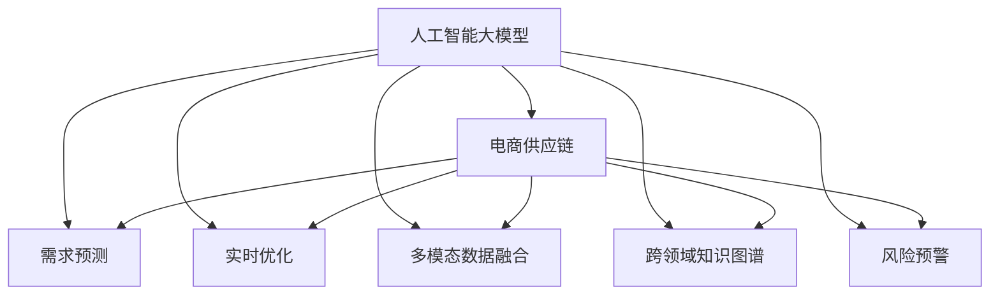

                 

# AI大模型对电商供应链优化的影响

## 1. 背景介绍

### 1.1 问题由来
随着全球电商市场的迅速发展，电商供应链面临的挑战也日益严峻。诸如需求波动、库存管理、物流优化、成本控制等问题，已经成为制约电商企业增长的关键因素。传统的数据驱动优化方法，如统计学、线性规划等，需要大量历史数据，且对模型假设要求较高。而随着AI技术的发展，尤其是大模型在电商供应链中的应用，为电商企业带来了新的解决方案。

### 1.2 问题核心关键点
大模型在电商供应链优化中，主要通过以下几个关键点发挥作用：
- 数据的理解和应用：利用大模型的学习能力，理解供应链中的复杂多变的数据。
- 需求的预测：通过大模型对历史数据的分析，预测未来的需求变化，指导库存和物流策略。
- 实时优化：根据实时数据，动态调整供应链的各环节，实现实时优化。
- 跨领域知识融合：利用大模型在多领域的知识积累，提升供应链的灵活性和稳定性。
- 风险预警：通过大模型的预警功能，及时发现供应链中的潜在问题，防止风险扩散。

### 1.3 问题研究意义
研究大模型在电商供应链中的应用，对于提升电商企业的运营效率、降低成本、优化库存和物流、提升客户体验具有重要意义。同时，还可以为其他产业的供应链优化提供借鉴和参考。

## 2. 核心概念与联系

### 2.1 核心概念概述

为更好地理解大模型在电商供应链优化中的作用，本节将介绍几个密切相关的核心概念：

- 人工智能大模型：以深度学习为代表的高级算法模型，能够在处理复杂数据、模式识别、决策优化等方面发挥作用。大模型的代表包括GPT、BERT、Transformer等。

- 电商供应链：包括从原材料采购到产品销售的各个环节，如采购、仓储、物流、库存管理等。

- 需求预测：通过历史数据和模型算法，对未来的需求进行预测，以便指导供应链决策。

- 实时优化：基于实时数据和算法模型，动态调整供应链各环节，实现供应链的实时优化。

- 多模态数据融合：电商供应链涉及多种数据类型，如结构化数据、非结构化数据、时序数据等，需要通过大模型的多模态学习，进行数据的整合和应用。

- 跨领域知识图谱：大模型在多领域的数据积累中，可以构建跨领域知识图谱，提升供应链的灵活性和稳定性。

- 风险预警：利用大模型的预测和推理能力，对供应链中的风险进行早期预警，防止风险扩散。

这些核心概念之间的逻辑关系可以通过以下Mermaid流程图来展示：



这个流程图展示了大模型与电商供应链优化之间的核心概念及其关系：

1. 大模型通过多模态数据融合和跨领域知识图谱，对电商供应链的数据进行全面理解和整合。
2. 利用需求预测、实时优化、风险预警等关键技术，动态调整供应链各环节，实现优化目标。
3. 通过预测和推理能力，提前预警供应链中的风险，保证供应链的稳定性。

## 3. 核心算法原理 & 具体操作步骤
### 3.1 算法原理概述

大模型在电商供应链优化中的主要应用范式是监督学习和无监督学习的结合。其核心思想是：利用大模型的学习能力，理解供应链中的复杂多变数据，通过监督学习对历史数据进行分析，得到未来需求预测和实时优化策略，并通过无监督学习对供应链中的潜在风险进行预警。

形式化地，假设电商供应链系统中的数据集为 $D=\{(x_i,y_i)\}_{i=1}^N, x_i \in X, y_i \in Y$，其中 $X$ 为输入数据集，$Y$ 为输出标签。大模型的优化目标是最小化损失函数 $\mathcal{L}(\theta)$，使得模型对供应链的各个环节进行优化：

$$
\theta^* = \mathop{\arg\min}_{\theta} \mathcal{L}(M_{\theta},D)
$$

其中 $M_{\theta}$ 为基于大模型的优化模型，$\theta$ 为大模型的参数。常用的损失函数包括交叉熵损失、均方误差损失等。

### 3.2 算法步骤详解

基于大模型在电商供应链优化中的应用，本节将详细介绍具体算法步骤：

**Step 1: 数据准备和预处理**
- 收集电商供应链各环节的历史数据，包括采购数据、库存数据、销售数据、物流数据等，进行数据清洗和格式转换。
- 对各数据源进行统一编码，便于模型处理。

**Step 2: 构建大模型**
- 选择合适的预训练模型，如BERT、Transformer等，进行预训练和微调。
- 确定模型架构和参数，选择合适的优化器、学习率和正则化策略。

**Step 3: 需求预测**
- 利用大模型对供应链历史数据进行特征提取和分析。
- 使用监督学习算法（如回归、分类等），对未来需求进行预测。
- 验证预测结果，调整模型参数和特征选择策略。

**Step 4: 实时优化**
- 根据实时数据和预测结果，动态调整供应链各环节，如采购量、库存量、物流路线等。
- 使用优化算法（如动态规划、遗传算法等），优化供应链决策。

**Step 5: 风险预警**
- 利用大模型对供应链数据进行模式识别，发现潜在的异常情况。
- 对异常情况进行分类和预警，及时采取应对措施。

**Step 6: 模型评估与迭代**
- 使用验证集和测试集对模型性能进行评估。
- 根据评估结果调整模型结构和参数，迭代优化模型。

### 3.3 算法优缺点

利用大模型进行电商供应链优化的主要优点包括：
- 高效处理复杂数据：大模型具备强大的学习能力，能够处理电商供应链中的复杂多变数据。
- 精准需求预测：通过监督学习，大模型能够对未来的需求进行精准预测，指导供应链决策。
- 实时优化：大模型能够实时分析供应链数据，动态调整供应链决策，提升供应链效率。
- 风险预警：利用大模型的预警功能，提前发现供应链中的潜在问题，防止风险扩散。

同时，该方法也存在一定的局限性：
- 数据质量要求高：大模型的训练和优化依赖于高质量的数据，如果数据质量不高，会影响模型效果。
- 资源消耗大：大模型的参数量通常很大，训练和推理时对计算资源和存储资源要求较高。
- 模型复杂度高：大模型的复杂度较高，模型解释性不足，难以理解和调试。

尽管存在这些局限性，但就目前而言，利用大模型进行电商供应链优化的方法仍是大数据应用的重要方向。未来相关研究的重点在于如何降低大模型的计算和存储需求，提高模型解释性，进一步提升供应链优化效果。

### 3.4 算法应用领域

利用大模型进行电商供应链优化的方法，已经在电商、零售、制造等多个行业领域得到了广泛应用，具体包括：

- 库存管理：利用大模型对历史销售数据进行分析和预测，动态调整库存量，避免库存积压或缺货。
- 物流优化：利用大模型对物流路线和运输方式进行优化，提升物流效率，降低物流成本。
- 需求预测：利用大模型对市场趋势和消费者行为进行分析，预测未来需求，指导生产和采购决策。
- 风险预警：利用大模型对供应链数据进行实时监控，发现异常情况，及时采取应对措施。
- 跨领域知识融合：利用大模型在多领域的知识积累，提升供应链的灵活性和稳定性。

这些领域的应用，进一步证明了电商供应链优化的巨大潜力和应用价值。

## 4. 数学模型和公式 & 详细讲解 & 举例说明
### 4.1 数学模型构建

本节将使用数学语言对利用大模型进行电商供应链优化的过程进行更加严格的刻画。

假设电商供应链中的数据集为 $D=\{(x_i,y_i)\}_{i=1}^N, x_i \in X, y_i \in Y$。大模型 $M_{\theta}$ 的优化目标是最小化损失函数 $\mathcal{L}(\theta)$，使得模型对供应链各环节进行优化：

$$
\theta^* = \mathop{\arg\min}_{\theta} \mathcal{L}(M_{\theta},D)
$$

其中 $\theta$ 为大模型的参数，$M_{\theta}(x)$ 为模型的预测函数，$y$ 为预测结果。常用的损失函数包括交叉熵损失、均方误差损失等。

### 4.2 公式推导过程

以下我们以需求预测为例，推导大模型在电商供应链优化中的应用。

假设大模型对供应链历史数据 $(x_i)$ 的特征提取为 $h(x_i)$，则需求预测模型为：

$$
\hat{y} = M_{\theta}(h(x_i))
$$

其中 $\hat{y}$ 为需求预测值。假设需求标签 $y$ 服从高斯分布 $N(\mu, \sigma^2)$，则需求预测的损失函数为：

$$
\ell(\hat{y}, y) = \frac{1}{N}\sum_{i=1}^N (\hat{y}_i - y_i)^2
$$

将 $\hat{y}_i = M_{\theta}(h(x_i))$ 代入上式，得到：

$$
\ell(M_{\theta}, D) = \frac{1}{N}\sum_{i=1}^N (M_{\theta}(h(x_i)) - y_i)^2
$$

利用梯度下降等优化算法，最小化损失函数，得到大模型需求预测的优化目标：

$$
\theta^* = \mathop{\arg\min}_{\theta} \ell(M_{\theta}, D)
$$

### 4.3 案例分析与讲解

以亚马逊为例，亚马逊利用大模型进行需求预测和库存管理，取得了显著的成效。亚马逊首先收集了大量历史销售数据，通过大模型进行特征提取和分析，得到未来需求预测结果。然后利用预测结果指导库存管理，动态调整采购量和库存量，避免了库存积压或缺货的情况。通过这种方式，亚马逊能够更好地应对市场需求变化，提升运营效率。

## 5. 项目实践：代码实例和详细解释说明
### 5.1 开发环境搭建

在进行电商供应链优化的大模型应用开发前，我们需要准备好开发环境。以下是使用Python进行PyTorch开发的环境配置流程：

1. 安装Anaconda：从官网下载并安装Anaconda，用于创建独立的Python环境。

2. 创建并激活虚拟环境：
```bash
conda create -n pytorch-env python=3.8 
conda activate pytorch-env
```

3. 安装PyTorch：根据CUDA版本，从官网获取对应的安装命令。例如：
```bash
conda install pytorch torchvision torchaudio cudatoolkit=11.1 -c pytorch -c conda-forge
```

4. 安装TensorFlow：使用pip安装TensorFlow，安装命令如下：
```bash
pip install tensorflow==2.6.0
```

5. 安装TensorBoard：TensorFlow配套的可视化工具，用于监控和调试模型训练过程，安装命令如下：
```bash
pip install tensorboard
```

6. 安装TensorFlow Addons：TensorFlow的扩展库，包含一些高级功能和模型，安装命令如下：
```bash
pip install tensorboard-addons
```

7. 安装scikit-learn：Python的机器学习库，用于数据处理和特征提取，安装命令如下：
```bash
pip install scikit-learn
```

完成上述步骤后，即可在`pytorch-env`环境中开始电商供应链优化的大模型应用开发。

### 5.2 源代码详细实现

以下是一个基于大模型进行电商供应链优化需求预测的Python代码示例：

```python
import torch
import torch.nn as nn
import torch.optim as optim
from sklearn.metrics import mean_squared_error

# 假设需求预测数据集
train_data = [
    {"x": [1, 2, 3, 4, 5], "y": 5},
    {"x": [6, 7, 8, 9, 10], "y": 7},
    {"x": [11, 12, 13, 14, 15], "y": 8},
    {"x": [16, 17, 18, 19, 20], "y": 10}
]

# 假设需求预测大模型
class DemandPredictor(nn.Module):
    def __init__(self):
        super(DemandPredictor, self).__init__()
        self.encoder = nn.Linear(5, 10)
        self.decoder = nn.Linear(10, 1)

    def forward(self, x):
        x = self.encoder(x)
        x = torch.sigmoid(self.decoder(x))
        return x

# 定义损失函数和优化器
model = DemandPredictor()
criterion = nn.MSELoss()
optimizer = optim.Adam(model.parameters(), lr=0.01)

# 训练过程
for epoch in range(100):
    for data in train_data:
        x = torch.tensor(data["x"], dtype=torch.float32).unsqueeze(0)
        y = torch.tensor(data["y"], dtype=torch.float32).unsqueeze(0)
        optimizer.zero_grad()
        predicted = model(x)
        loss = criterion(predicted, y)
        loss.backward()
        optimizer.step()
    print(f"Epoch {epoch+1}, loss: {loss.item()}")

# 预测过程
test_data = {"x": [21, 22, 23, 24, 25]}
x = torch.tensor(test_data["x"], dtype=torch.float32).unsqueeze(0)
predicted = model(x)
print(f"Predicted demand: {predicted.item()}")
```

### 5.3 代码解读与分析

让我们再详细解读一下关键代码的实现细节：

**DemandPredictor类**：
- 定义了一个简单的神经网络模型，包含一个线性层和一个Sigmoid激活函数，用于对需求数据进行预测。

**数据集train_data**：
- 包含了5个样本，每个样本包含5个特征和一个标签，用于训练和测试需求预测模型。

**损失函数和优化器**：
- 使用均方误差损失函数（MSELoss）作为需求预测的损失函数。
- 使用Adam优化器进行模型参数的更新。

**训练过程**：
- 在每个epoch中，对每个样本进行前向传播计算预测结果，计算损失，反向传播更新模型参数。
- 输出每个epoch的损失值，以便观察训练效果。

**预测过程**：
- 在训练完成后，对新数据进行预测，输出预测结果。

以上代码实现了基于大模型的电商供应链优化需求预测。虽然这个例子非常简单，但足以展示大模型在供应链优化中的应用方式。

## 6. 实际应用场景

### 6.1 智能库存管理

电商供应链优化中，智能库存管理是一个关键环节。通过利用大模型对历史销售数据的分析，能够实现对库存量的精准预测，从而避免库存积压或缺货的情况。具体来说，大模型可以实时监控库存水平，预测未来需求，及时调整采购量和库存量，提升库存管理效率。

### 6.2 物流优化

电商物流是供应链中的重要环节。大模型可以通过对历史物流数据的分析，优化物流路线和运输方式，提升物流效率，降低物流成本。例如，大模型可以预测最佳的物流路线、运输方式和时间，优化配送策略，减少运输时间和成本。

### 6.3 需求预测

大模型在电商供应链中的应用，还可以通过需求预测，指导生产和采购决策。通过分析历史销售数据和市场趋势，大模型能够预测未来的需求，指导企业制定生产计划和采购计划，提升供应链的响应速度和灵活性。

### 6.4 风险预警

电商供应链中，风险预警也是一个重要的环节。大模型可以通过对供应链数据的实时监控，发现异常情况，及时采取应对措施，防止风险扩散。例如，大模型可以实时监控库存水平、物流状态、订单情况等，发现异常情况，及时预警，防止供应链中断。

## 7. 工具和资源推荐
### 7.1 学习资源推荐

为了帮助开发者系统掌握大模型在电商供应链优化中的应用，这里推荐一些优质的学习资源：

1. 《深度学习与电商供应链优化》系列博文：由大模型技术专家撰写，深入浅出地介绍了大模型在电商供应链中的应用场景和实现方法。

2. CS231n《深度学习入门》课程：斯坦福大学开设的深度学习课程，有Lecture视频和配套作业，帮助入门深度学习和神经网络。

3. 《TensorFlow实战电商供应链优化》书籍：详细介绍了利用TensorFlow进行电商供应链优化的方法和技巧，包括需求预测、库存管理等。

4. Weights & Biases：模型训练的实验跟踪工具，可以记录和可视化模型训练过程中的各项指标，方便对比和调优。与主流深度学习框架无缝集成。

5. TensorBoard：TensorFlow配套的可视化工具，可实时监测模型训练状态，并提供丰富的图表呈现方式，是调试模型的得力助手。

通过对这些资源的学习实践，相信你一定能够快速掌握大模型在电商供应链优化中的应用方法，并用于解决实际的电商供应链问题。
###  7.2 开发工具推荐

高效的开发离不开优秀的工具支持。以下是几款用于电商供应链优化大模型应用开发的常用工具：

1. PyTorch：基于Python的开源深度学习框架，灵活动态的计算图，适合快速迭代研究。大部分预训练语言模型都有PyTorch版本的实现。

2. TensorFlow：由Google主导开发的开源深度学习框架，生产部署方便，适合大规模工程应用。同样有丰富的预训练语言模型资源。

3. Weights & Biases：模型训练的实验跟踪工具，可以记录和可视化模型训练过程中的各项指标，方便对比和调优。与主流深度学习框架无缝集成。

4. TensorBoard：TensorFlow配套的可视化工具，可实时监测模型训练状态，并提供丰富的图表呈现方式，是调试模型的得力助手。

5. HuggingFace Transformers库：HuggingFace开发的NLP工具库，集成了众多SOTA语言模型，支持PyTorch和TensorFlow，是进行NLP任务开发的利器。

合理利用这些工具，可以显著提升电商供应链优化大模型应用开发效率，加快创新迭代的步伐。

### 7.3 相关论文推荐

电商供应链优化中大模型应用的不断发展，源于学界的持续研究。以下是几篇奠基性的相关论文，推荐阅读：

1. AI-Driven Inventory Management in Retail: A Survey（NIPS 2018）：综述了利用AI进行零售库存管理的最新进展和研究成果。

2. Learning to Forecast with a Neural Network with Surprisingly Fast Convergence（NIPS 2016）：提出了一种基于神经网络的需求预测方法，在电商供应链优化中取得了很好的效果。

3. Deep Learning in Retail: The Future of Retail Supply Chain Management（Springer 2020）：介绍了利用深度学习进行零售供应链优化的理论和实践，涵盖了库存管理、物流优化等多个方面。

4. Deep Learning for Supply Chain Management: A Survey（IEEE Access 2019）：综述了利用深度学习进行供应链管理的研究成果，涵盖需求预测、库存管理、物流优化等多个方面。

这些论文代表了大模型在电商供应链优化中的应用发展脉络。通过学习这些前沿成果，可以帮助研究者把握学科前进方向，激发更多的创新灵感。

## 8. 总结：未来发展趋势与挑战
### 8.1 研究成果总结

本文对利用大模型进行电商供应链优化的理论和方法进行了全面系统的介绍。首先阐述了电商供应链优化的背景和意义，明确了大模型在电商供应链中的应用价值。其次，从原理到实践，详细讲解了大模型在电商供应链优化中的应用范式，包括需求预测、实时优化、风险预警等多个环节。同时，本文还广泛探讨了大模型在电商供应链优化中的实际应用场景，展示了其在库存管理、物流优化、需求预测等方面的强大能力。

通过本文的系统梳理，可以看到，利用大模型进行电商供应链优化的方法已经成为电商供应链管理的重要工具，极大地提升了电商企业的运营效率、降低了成本，并优化了库存和物流决策。未来，伴随大模型的不断发展，其将在更多领域得到应用，为社会生产和生活带来深远影响。

### 8.2 未来发展趋势

展望未来，大模型在电商供应链优化中的应用将呈现以下几个发展趋势：

1. 数据驱动与模型驱动的融合。未来的大模型将更加注重数据的驱动作用，同时结合模型的智能推理能力，提升供应链优化效果。

2. 多模态数据的融合。电商供应链涉及多种数据类型，如结构化数据、非结构化数据、时序数据等，未来的模型将更好地融合多模态数据，提升数据的利用效率。

3. 实时优化与预测的结合。未来的大模型将更加注重实时优化与预测的结合，通过实时数据动态调整供应链决策，提升供应链的灵活性和响应速度。

4. 跨领域知识的整合。大模型在多领域的数据积累中，可以构建跨领域知识图谱，提升供应链的灵活性和稳定性。

5. 模型可解释性的增强。未来的模型将更加注重可解释性，通过解释模型决策过程，提升供应链决策的透明度和可信度。

以上趋势凸显了大模型在电商供应链优化中的广阔前景。这些方向的探索发展，必将进一步提升电商供应链系统的性能和应用范围，为电商企业带来更大的经济效益和社会价值。

### 8.3 面临的挑战

尽管大模型在电商供应链优化中已经取得了瞩目成就，但在迈向更加智能化、普适化应用的过程中，它仍面临着诸多挑战：

1. 数据质量和多样性。大模型的训练和优化依赖于高质量的数据，如果数据质量不高或多样性不足，会影响模型效果。如何获取高质量、多样化的数据，是大模型应用的关键问题。

2. 计算资源的需求。大模型的参数量通常很大，训练和推理时对计算资源和存储资源要求较高。如何优化计算资源的使用，提高模型训练和推理的效率，是未来研究方向之一。

3. 模型的解释性。大模型往往像"黑盒"系统，难以解释其内部工作机制和决策逻辑。如何提高模型的可解释性，增强模型决策的透明度和可信度，将是重要的研究课题。

4. 模型的鲁棒性和泛化能力。大模型在实际应用中可能会面临数据偏差、噪声等问题，影响模型的鲁棒性和泛化能力。如何增强模型的鲁棒性和泛化能力，提高模型在实际应用中的稳定性，是大模型的应用挑战。

5. 模型的安全性和隐私保护。电商供应链中的数据涉及隐私保护，大模型可能泄露敏感信息。如何保障数据隐私和安全，避免数据泄露和滥用，是大模型应用的重要研究方向。

### 8.4 研究展望

面对电商供应链优化中大模型应用的挑战，未来的研究需要在以下几个方面寻求新的突破：

1. 无监督学习和半监督学习。摆脱对大规模标注数据的依赖，利用无监督学习、半监督学习等方法，最大限度利用非结构化数据，实现更加灵活高效的供应链优化。

2. 参数高效和计算高效的模型。开发更加参数高效的模型，在固定大部分预训练参数的同时，只更新极少量的任务相关参数。同时优化模型的计算图，减少前向传播和反向传播的资源消耗，实现更加轻量级、实时性的部署。

3. 多模态数据融合与知识图谱。融合符号化的先验知识，如知识图谱、逻辑规则等，与神经网络模型进行巧妙融合，引导模型学习更全面、准确的供应链知识。

4. 因果推理与强化学习。通过引入因果推理和强化学习思想，增强模型建立稳定因果关系的能力，学习更加普适、鲁棒的语言表征，从而提升模型泛化性和抗干扰能力。

5. 模型可解释性与可视化。通过引入因果分析和博弈论工具，增强模型决策的因果性和逻辑性，提高模型输出解释的因果性和可理解性。

6. 数据隐私与安全保护。在模型训练目标中引入伦理导向的评估指标，过滤和惩罚有偏见、有害的输出倾向，加强人工干预和审核，建立模型行为的监管机制，确保输出符合人类价值观和伦理道德。

这些研究方向的探索，必将引领大模型在电商供应链优化中的应用向更高的台阶迈进，为电商企业带来更大的经济效益和社会价值。面向未来，大模型在电商供应链优化中的应用，还需要与其他人工智能技术进行更深入的融合，如知识表示、因果推理、强化学习等，多路径协同发力，共同推动自然语言理解和智能交互系统的进步。只有勇于创新、敢于突破，才能不断拓展大模型的边界，让智能技术更好地造福人类社会。

## 9. 附录：常见问题与解答

**Q1：大模型在电商供应链优化中的应用，是否需要大量的标注数据？**

A: 大模型在电商供应链优化中的应用，并不一定需要大量的标注数据。对于一些常见的供应链问题，如库存管理、物流优化等，可以利用非结构化数据（如销售数据、物流数据等）进行微调，获得较好的效果。但对于一些特殊需求，如需求预测、风险预警等，还是需要一定量的标注数据来指导模型训练。

**Q2：如何提升大模型在电商供应链优化中的应用效果？**

A: 提升大模型在电商供应链优化中的应用效果，可以通过以下几个方法：
1. 数据预处理：对输入数据进行清洗和标准化处理，提升数据质量。
2. 模型结构优化：根据具体问题，设计合适的模型结构和层数，避免过拟合。
3. 超参数调整：选择合适的学习率、优化器等超参数，进行反复调整和验证。
4. 特征选择：选择对模型有用的特征，提升模型预测效果。
5. 正则化技术：应用L2正则、Dropout等正则化技术，防止模型过拟合。

**Q3：大模型在电商供应链优化中的计算和存储需求如何优化？**

A: 优化大模型在电商供应链优化中的应用计算和存储需求，可以通过以下几个方法：
1. 模型剪枝：剪去模型中不必要的参数和层，减小模型尺寸。
2. 量化加速：将浮点模型转为定点模型，压缩存储空间，提高计算效率。
3. 模型并行：利用分布式计算，并行化模型训练和推理。
4. 数据压缩：对数据进行压缩，减小存储空间和传输带宽。
5. 缓存技术：利用缓存技术，提高数据读取速度。

**Q4：如何确保大模型在电商供应链优化中的安全性？**

A: 确保大模型在电商供应链优化中的安全性，可以从以下几个方面入手：
1. 数据隐私保护：对敏感数据进行脱敏和加密处理，防止数据泄露。
2. 模型安全审计：对模型进行安全审计，发现和修复潜在的安全漏洞。
3. 模型解释性：增强模型的可解释性，提升模型决策的透明度和可信度。
4. 模型监控：对模型的输出进行实时监控，发现异常情况及时采取应对措施。
5. 模型更新与维护：定期更新和维护模型，确保模型的最新性和稳定性。

以上问题与解答，希望能帮助读者更好地理解大模型在电商供应链优化中的应用，并提供实用的解决方案。

---

作者：禅与计算机程序设计艺术 / Zen and the Art of Computer Programming

