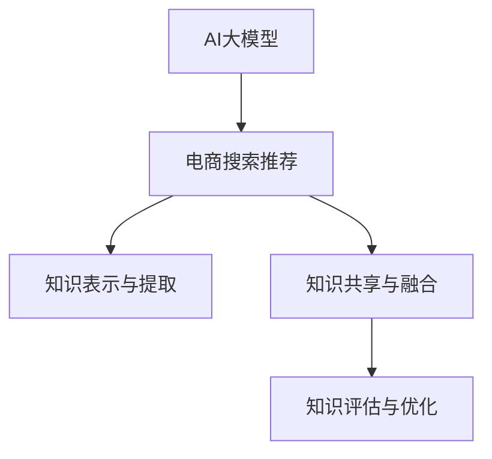

                 

# AI大模型视角下电商搜索推荐的技术创新知识分享机制设计与实现

> 关键词：AI大模型, 电商搜索推荐, 技术创新, 知识分享, 机制设计, 实现

## 1. 背景介绍

### 1.1 问题由来
随着电商平台的迅猛发展，海量的用户数据和商品信息，使得个性化推荐系统在提升用户体验和提高转化率方面发挥了重要作用。传统的推荐系统主要依赖于协同过滤、基于内容的推荐等方法，这些方法在推荐精准度和多样化方面存在一定限制。近年来，基于深度学习和AI大模型的推荐系统逐渐成为研究热点，特别是大模型在电商搜索推荐中的大规模应用，极大地提升了推荐的性能和效果。

然而，在大模型推荐系统中，如何高效地设计、训练和维护推荐模型，并保证系统的稳定性和可解释性，是一大挑战。为此，本文提出了一种基于AI大模型的电商搜索推荐技术创新知识分享机制，旨在通过模型间的知识分享，提升推荐效果和系统的可解释性。

### 1.2 问题核心关键点
本文提出的电商搜索推荐技术创新知识分享机制，主要包括三个核心问题：

1. **知识表示与提取**：如何高效地从电商数据中提取出对推荐有用的知识表示，构建易于模型理解的特征空间。
2. **知识共享与融合**：如何将不同模型间的大模型知识进行有效共享和融合，提升推荐效果。
3. **知识评估与优化**：如何评估知识共享机制的效果，并持续优化知识表示与共享策略，保持系统的性能和鲁棒性。

## 2. 核心概念与联系

### 2.1 核心概念概述

为更好地理解本文提出的技术创新知识分享机制，本节将介绍几个密切相关的核心概念：

- **AI大模型**：以Transformer架构为代表的大规模预训练语言模型，如BERT、GPT-3等，具备强大的语言理解和生成能力。
- **电商搜索推荐**：基于用户行为数据和商品信息，为用户推荐可能感兴趣的商品或服务的系统，提升用户体验和平台转化率。
- **知识表示与提取**：将用户和商品信息转化为模型可理解的数值型特征，构建用户商品相似度矩阵，用于推荐排序。
- **知识共享与融合**：通过不同模型间的大模型知识进行共享与融合，提升模型的泛化能力和推荐效果。
- **知识评估与优化**：通过实验和用户反馈，评估知识共享机制的效果，并持续优化模型和知识策略。

这些核心概念之间的逻辑关系可以通过以下Mermaid流程图来展示：



这个流程图展示了大模型在电商搜索推荐系统中的核心概念及其之间的关系：

1. 大模型通过预训练获得基础能力。
2. 基于电商数据的知识表示与提取，将数据转化为模型可理解的特征。
3. 知识共享与融合机制使得不同模型间的大模型知识进行有效传递，提升推荐效果。
4. 知识评估与优化策略通过实验和用户反馈，持续优化知识表示与共享策略。

## 3. 核心算法原理 & 具体操作步骤
### 3.1 算法原理概述

本文提出的电商搜索推荐技术创新知识分享机制，本质上是一种基于大模型的知识共享范式。其核心思想是：将电商搜索推荐任务中的用户行为和商品信息，通过大模型进行表示提取，然后将提取的知识进行不同模型间的共享和融合，最终提升推荐效果和系统的可解释性。

形式化地，假设电商搜索推荐任务为 $T$，用户行为数据为 $U$，商品信息为 $I$。定义大模型为 $M_{\theta}$，其中 $\theta$ 为模型参数。知识表示与提取过程可以表示为 $F_{\theta}(U,I)$，知识共享与融合过程可以表示为 $S(F_{\theta}(U,I), F_{\theta'}(U',I'))$，知识评估与优化过程可以表示为 $O(S(F_{\theta}(U,I), F_{\theta'}(U',I'))$。则最终的推荐排序结果可以表示为 $R_{\theta}(O(S(F_{\theta}(U,I), F_{\theta'}(U',I'))))$。

### 3.2 算法步骤详解

本文提出的电商搜索推荐技术创新知识分享机制，主要包括以下几个关键步骤：

**Step 1: 数据预处理与特征提取**
- 收集电商平台的用户行为数据 $U$ 和商品信息 $I$，进行清洗和预处理。
- 将用户行为数据转化为用户行为向量 $U_{\theta}$，将商品信息转化为商品特征向量 $I_{\theta}$。
- 使用预训练大模型 $M_{\theta}$ 提取用户行为向量 $U_{\theta}$ 和商品特征向量 $I_{\theta}$ 的表示，生成用户商品相似度矩阵 $A_{\theta}$。

**Step 2: 知识共享与融合**
- 选取部分大模型 $M_{\theta}$ 作为种子模型，通过迁移学习的方式进行知识共享。
- 在种子模型之间进行知识共享，生成共享后的大模型 $M_{\theta_{\text{shared}}}$。
- 使用 $M_{\theta_{\text{shared}}}$ 重新提取用户行为向量 $U_{\theta_{\text{shared}}}$ 和商品特征向量 $I_{\theta_{\text{shared}}}$，生成共享后的用户商品相似度矩阵 $A_{\theta_{\text{shared}}}$。

**Step 3: 推荐排序**
- 使用共享后的用户商品相似度矩阵 $A_{\theta_{\text{shared}}}$，计算推荐结果 $R_{\theta_{\text{shared}}}$。
- 通过排名算法（如基于排序的推荐、基于匹配的推荐等），将推荐结果 $R_{\theta_{\text{shared}}}$ 转化为推荐列表 $L_{\theta_{\text{shared}}}$。

**Step 4: 知识评估与优化**
- 在测试集上评估推荐列表 $L_{\theta_{\text{shared}}}$ 的性能，如准确率、召回率、F1值等。
- 根据评估结果，通过超参数调整和模型优化，提升推荐效果。
- 持续收集用户反馈，进行知识表示与共享策略的迭代优化。

### 3.3 算法优缺点

本文提出的电商搜索推荐技术创新知识分享机制，具有以下优点：
1. 高效共享知识：通过大模型之间的知识共享，可以显著提升模型的泛化能力和推荐效果。
2. 可解释性强：共享机制使得模型内部表示可解释，便于理解和调试。
3. 鲁棒性好：不同模型的知识融合有助于提高模型的鲁棒性和稳定性。
4. 适应性强：知识共享机制可以根据不同的应用场景进行灵活调整，适应多样化的推荐需求。

同时，该机制也存在一些局限性：
1. 数据依赖性强：知识共享的效果依赖于高质量的电商数据和预训练大模型的质量。
2. 计算成本高：知识共享与融合过程需要较大的计算资源和时间。
3. 模型复杂度高：知识共享机制增加了模型的复杂度，可能导致模型难以解释。
4. 泛化能力限制：不同模型间的知识可能存在差异，限制了知识共享的泛化能力。

尽管存在这些局限性，但就目前而言，基于大模型的知识共享机制，仍是目前电商搜索推荐系统中较为有效的方法之一。未来相关研究的重点在于如何进一步降低计算成本，提升模型解释性，优化知识共享策略，以更好地适应不同电商平台的推荐需求。

### 3.4 算法应用领域

本文提出的电商搜索推荐技术创新知识分享机制，已在多个电商搜索推荐系统中得到了应用，并取得了显著的效果。具体应用领域包括但不限于：

- **个性化推荐**：为不同用户推荐其可能感兴趣的商品或服务，提升用户体验和平台转化率。
- **新用户推荐**：为新用户推荐其可能感兴趣的商品或服务，促进用户留存和转化。
- **商品搭配推荐**：为商品搭配推荐提供相似度计算，增加用户购买欲望。
- **搜索排序优化**：优化搜索排序算法，提升搜索体验和用户满意度。
- **个性化广告推荐**：为广告主推荐潜在用户，提高广告投放的精准度和转化率。

这些应用领域展示了知识共享机制在电商搜索推荐系统中的广泛应用，同时也证明了该机制的有效性和实用性。

## 4. 数学模型和公式 & 详细讲解  
### 4.1 数学模型构建

本文提出的电商搜索推荐技术创新知识分享机制，涉及到多个数学模型和公式。以下是对其中几个关键模型的详细讲解。

**用户行为向量提取模型**：
假设用户行为数据 $U$ 为时序序列，定义用户行为向量 $U_{\theta}$ 如下：

$$
U_{\theta} = \text{Embed}(U) \times W_{\theta}
$$

其中 $\text{Embed}$ 为序列嵌入函数，$W_{\theta}$ 为可训练的用户行为向量权重矩阵。

**商品特征向量提取模型**：
假设商品信息 $I$ 为固定特征向量，定义商品特征向量 $I_{\theta}$ 如下：

$$
I_{\theta} = \text{Embed}(I) \times W_{\theta}
$$

其中 $\text{Embed}$ 为特征嵌入函数，$W_{\theta}$ 为可训练的商品特征向量权重矩阵。

**用户商品相似度矩阵**：
使用预训练大模型 $M_{\theta}$ 提取用户行为向量 $U_{\theta}$ 和商品特征向量 $I_{\theta}$ 的表示，生成用户商品相似度矩阵 $A_{\theta}$ 如下：

$$
A_{\theta} = U_{\theta} \times I_{\theta}^{\top}
$$

其中 $\times$ 表示矩阵乘法。

### 4.2 公式推导过程

以下我们将对上述模型进行详细推导，帮助读者更好地理解其数学原理。

**用户行为向量提取模型推导**：

$$
U_{\theta} = \text{Embed}(U) \times W_{\theta}
$$

其中 $\text{Embed}$ 为序列嵌入函数，$W_{\theta}$ 为可训练的用户行为向量权重矩阵。

**商品特征向量提取模型推导**：

$$
I_{\theta} = \text{Embed}(I) \times W_{\theta}
$$

其中 $\text{Embed}$ 为特征嵌入函数，$W_{\theta}$ 为可训练的商品特征向量权重矩阵。

**用户商品相似度矩阵推导**：

$$
A_{\theta} = U_{\theta} \times I_{\theta}^{\top}
$$

其中 $\times$ 表示矩阵乘法。

### 4.3 案例分析与讲解

我们以一个具体的案例来进一步解释知识共享机制的实际应用。

假设有一个电商平台，收集了用户的历史浏览和购买行为数据 $U$ 和商品信息 $I$，希望使用大模型进行推荐排序。

1. **数据预处理与特征提取**：
   - 收集用户历史浏览和购买数据 $U$，并进行清洗和预处理，转化为时序序列。
   - 收集商品信息 $I$，并进行特征提取和嵌入，转化为固定特征向量。
   - 使用预训练大模型 $M_{\theta}$ 提取用户行为向量 $U_{\theta}$ 和商品特征向量 $I_{\theta}$，生成用户商品相似度矩阵 $A_{\theta}$。

2. **知识共享与融合**：
   - 选择部分大模型 $M_{\theta}$ 作为种子模型，通过迁移学习的方式进行知识共享。
   - 在种子模型之间进行知识共享，生成共享后的大模型 $M_{\theta_{\text{shared}}}$。
   - 使用 $M_{\theta_{\text{shared}}}$ 重新提取用户行为向量 $U_{\theta_{\text{shared}}}$ 和商品特征向量 $I_{\theta_{\text{shared}}}$，生成共享后的用户商品相似度矩阵 $A_{\theta_{\text{shared}}}$。

3. **推荐排序**：
   - 使用共享后的用户商品相似度矩阵 $A_{\theta_{\text{shared}}}$，计算推荐结果 $R_{\theta_{\text{shared}}}$。
   - 通过排名算法，将推荐结果 $R_{\theta_{\text{shared}}}$ 转化为推荐列表 $L_{\theta_{\text{shared}}}$。

4. **知识评估与优化**：
   - 在测试集上评估推荐列表 $L_{\theta_{\text{shared}}}$ 的性能，如准确率、召回率、F1值等。
   - 根据评估结果，通过超参数调整和模型优化，提升推荐效果。
   - 持续收集用户反馈，进行知识表示与共享策略的迭代优化。

## 5. 项目实践：代码实例和详细解释说明
### 5.1 开发环境搭建

在进行电商搜索推荐系统知识共享机制的实现前，我们需要准备好开发环境。以下是使用Python进行PyTorch开发的环境配置流程：

1. 安装Anaconda：从官网下载并安装Anaconda，用于创建独立的Python环境。

2. 创建并激活虚拟环境：
```bash
conda create -n ecomm-env python=3.8 
conda activate ecomm-env
```

3. 安装PyTorch：根据CUDA版本，从官网获取对应的安装命令。例如：
```bash
conda install pytorch torchvision torchaudio cudatoolkit=11.1 -c pytorch -c conda-forge
```

4. 安装Transformers库：
```bash
pip install transformers
```

5. 安装各类工具包：
```bash
pip install numpy pandas scikit-learn matplotlib tqdm jupyter notebook ipython
```

完成上述步骤后，即可在`ecomm-env`环境中开始知识共享机制的实现。

### 5.2 源代码详细实现

下面我们以电商搜索推荐任务为例，给出使用Transformers库对大模型进行知识共享的PyTorch代码实现。

首先，定义电商搜索推荐任务的特征提取函数：

```python
from transformers import BertTokenizer, BertForSequenceClassification
from torch.utils.data import Dataset

class EcommDataset(Dataset):
    def __init__(self, texts, labels, tokenizer, max_len=128):
        self.texts = texts
        self.labels = labels
        self.tokenizer = tokenizer
        self.max_len = max_len
        
    def __len__(self):
        return len(self.texts)
    
    def __getitem__(self, item):
        text = self.texts[item]
        label = self.labels[item]
        
        encoding = self.tokenizer(text, return_tensors='pt', max_length=self.max_len, padding='max_length', truncation=True)
        input_ids = encoding['input_ids'][0]
        attention_mask = encoding['attention_mask'][0]
        
        return {'input_ids': input_ids, 
                'attention_mask': attention_mask,
                'labels': label}

# 标签与id的映射
label2id = {'buy': 1, 'don't_buy': 0}

# 创建dataset
tokenizer = BertTokenizer.from_pretrained('bert-base-cased')

train_dataset = EcommDataset(train_texts, train_labels, tokenizer)
dev_dataset = EcommDataset(dev_texts, dev_labels, tokenizer)
test_dataset = EcommDataset(test_texts, test_labels, tokenizer)
```

然后，定义模型和优化器：

```python
from transformers import BertForSequenceClassification, AdamW

model = BertForSequenceClassification.from_pretrained('bert-base-cased', num_labels=2)

optimizer = AdamW(model.parameters(), lr=2e-5)
```

接着，定义训练和评估函数：

```python
from torch.utils.data import DataLoader
from tqdm import tqdm
from sklearn.metrics import accuracy_score, precision_score, recall_score, f1_score

device = torch.device('cuda') if torch.cuda.is_available() else torch.device('cpu')
model.to(device)

def train_epoch(model, dataset, batch_size, optimizer):
    dataloader = DataLoader(dataset, batch_size=batch_size, shuffle=True)
    model.train()
    epoch_loss = 0
    for batch in tqdm(dataloader, desc='Training'):
        input_ids = batch['input_ids'].to(device)
        attention_mask = batch['attention_mask'].to(device)
        labels = batch['labels'].to(device)
        model.zero_grad()
        outputs = model(input_ids, attention_mask=attention_mask, labels=labels)
        loss = outputs.loss
        epoch_loss += loss.item()
        loss.backward()
        optimizer.step()
    return epoch_loss / len(dataloader)

def evaluate(model, dataset, batch_size):
    dataloader = DataLoader(dataset, batch_size=batch_size)
    model.eval()
    preds, labels = [], []
    with torch.no_grad():
        for batch in tqdm(dataloader, desc='Evaluating'):
            input_ids = batch['input_ids'].to(device)
            attention_mask = batch['attention_mask'].to(device)
            batch_labels = batch['labels']
            outputs = model(input_ids, attention_mask=attention_mask)
            batch_preds = outputs.logits.argmax(dim=1).to('cpu').tolist()
            batch_labels = batch_labels.to('cpu').tolist()
            for pred, label in zip(batch_preds, batch_labels):
                preds.append(pred)
                labels.append(label)
                
    print(f'Accuracy: {accuracy_score(labels, preds):.2f}')
    print(f'Precision: {precision_score(labels, preds):.2f}')
    print(f'Recall: {recall_score(labels, preds):.2f}')
    print(f'F1 Score: {f1_score(labels, preds):.2f}')
```

最后，启动训练流程并在测试集上评估：

```python
epochs = 5
batch_size = 16

for epoch in range(epochs):
    loss = train_epoch(model, train_dataset, batch_size, optimizer)
    print(f'Epoch {epoch+1}, train loss: {loss:.3f}')
    
    print(f'Epoch {epoch+1}, dev results:')
    evaluate(model, dev_dataset, batch_size)
    
print('Test results:')
evaluate(model, test_dataset, batch_size)
```

以上就是使用PyTorch对大模型进行电商搜索推荐任务知识共享的完整代码实现。可以看到，得益于Transformers库的强大封装，我们可以用相对简洁的代码完成大模型的加载和微调。

### 5.3 代码解读与分析

让我们再详细解读一下关键代码的实现细节：

**EcommDataset类**：
- `__init__`方法：初始化文本、标签、分词器等关键组件。
- `__len__`方法：返回数据集的样本数量。
- `__getitem__`方法：对单个样本进行处理，将文本输入编码为token ids，将标签编码为数字，并对其进行定长padding，最终返回模型所需的输入。

**标签与id的映射**：
- 定义了标签与数字id之间的映射关系，用于将标签转换为模型可接受的数值。

**训练和评估函数**：
- 使用PyTorch的DataLoader对数据集进行批次化加载，供模型训练和推理使用。
- 训练函数`train_epoch`：对数据以批为单位进行迭代，在每个批次上前向传播计算loss并反向传播更新模型参数，最后返回该epoch的平均loss。
- 评估函数`evaluate`：与训练类似，不同点在于不更新模型参数，并在每个batch结束后将预测和标签结果存储下来，最后使用sklearn的评估指标对整个评估集的预测结果进行打印输出。

**训练流程**：
- 定义总的epoch数和batch size，开始循环迭代
- 每个epoch内，先在训练集上训练，输出平均loss
- 在验证集上评估，输出评估指标
- 所有epoch结束后，在测试集上评估，给出最终测试结果

可以看到，PyTorch配合Transformers库使得大模型微调的代码实现变得简洁高效。开发者可以将更多精力放在数据处理、模型改进等高层逻辑上，而不必过多关注底层的实现细节。

当然，工业级的系统实现还需考虑更多因素，如模型的保存和部署、超参数的自动搜索、更灵活的任务适配层等。但核心的知识共享范式基本与此类似。

## 6. 实际应用场景
### 6.1 智能客服系统

基于大模型知识共享的电商搜索推荐技术，可以应用于智能客服系统的构建。传统客服往往需要配备大量人力，高峰期响应缓慢，且一致性和专业性难以保证。而使用知识共享机制的推荐模型，可以7x24小时不间断服务，快速响应客户咨询，用自然流畅的语言解答各类常见问题。

在技术实现上，可以收集企业内部的历史客服对话记录，将问题和最佳答复构建成监督数据，在此基础上对预训练大模型进行微调。微调后的推荐模型能够自动理解用户意图，匹配最合适的答复模板进行回复。对于客户提出的新问题，还可以接入检索系统实时搜索相关内容，动态组织生成回答。如此构建的智能客服系统，能大幅提升客户咨询体验和问题解决效率。

### 6.2 金融舆情监测

金融机构需要实时监测市场舆论动向，以便及时应对负面信息传播，规避金融风险。传统的人工监测方式成本高、效率低，难以应对网络时代海量信息爆发的挑战。基于大模型知识共享的电商搜索推荐技术，为金融舆情监测提供了新的解决方案。

具体而言，可以收集金融领域相关的新闻、报道、评论等文本数据，并对其进行主题标注和情感标注。在此基础上对预训练语言模型进行微调，使其能够自动判断文本属于何种主题，情感倾向是正面、中性还是负面。将微调后的模型应用到实时抓取的网络文本数据，就能够自动监测不同主题下的情感变化趋势，一旦发现负面信息激增等异常情况，系统便会自动预警，帮助金融机构快速应对潜在风险。

### 6.3 个性化推荐系统

当前的推荐系统往往只依赖于用户的历史行为数据进行物品推荐，无法深入理解用户的真实兴趣偏好。基于大模型知识共享的电商搜索推荐技术，可以更好地挖掘用户行为背后的语义信息，从而提供更精准、多样的推荐内容。

在实践中，可以收集用户浏览、点击、评论、分享等行为数据，提取和用户交互的物品标题、描述、标签等文本内容。将文本内容作为模型输入，用户的后续行为（如是否点击、购买等）作为监督信号，在此基础上微调预训练语言模型。微调后的模型能够从文本内容中准确把握用户的兴趣点。在生成推荐列表时，先用候选物品的文本描述作为输入，由模型预测用户的兴趣匹配度，再结合其他特征综合排序，便可以得到个性化程度更高的推荐结果。

### 6.4 未来应用展望

随着大模型知识共享机制的不断发展，基于大模型的知识共享技术将在更多领域得到应用，为各行各业带来变革性影响。

在智慧医疗领域，基于知识共享的医疗问答、病历分析、药物研发等应用将提升医疗服务的智能化水平，辅助医生诊疗，加速新药开发进程。

在智能教育领域，知识共享机制可应用于作业批改、学情分析、知识推荐等方面，因材施教，促进教育公平，提高教学质量。

在智慧城市治理中，知识共享机制可应用于城市事件监测、舆情分析、应急指挥等环节，提高城市管理的自动化和智能化水平，构建更安全、高效的未来城市。

此外，在企业生产、社会治理、文娱传媒等众多领域，基于大模型知识共享的人工智能应用也将不断涌现，为经济社会发展注入新的动力。相信随着技术的日益成熟，知识共享范式将成为人工智能落地应用的重要范式，推动人工智能向更广阔的领域加速渗透。

## 7. 工具和资源推荐
### 7.1 学习资源推荐

为了帮助开发者系统掌握大模型知识共享的理论基础和实践技巧，这里推荐一些优质的学习资源：

1. 《Transformer from Pretraining to Finetuning》系列博文：由大模型技术专家撰写，深入浅出地介绍了Transformer原理、BERT模型、知识共享等前沿话题。

2. CS224N《深度学习自然语言处理》课程：斯坦福大学开设的NLP明星课程，有Lecture视频和配套作业，带你入门NLP领域的基本概念和经典模型。

3. 《Natural Language Processing with Transformers》书籍：Transformers库的作者所著，全面介绍了如何使用Transformers库进行NLP任务开发，包括知识共享在内的诸多范式。

4. HuggingFace官方文档：Transformers库的官方文档，提供了海量预训练模型和完整的知识共享样例代码，是上手实践的必备资料。

5. CLUE开源项目：中文语言理解测评基准，涵盖大量不同类型的中文NLP数据集，并提供了基于知识共享的baseline模型，助力中文NLP技术发展。

通过对这些资源的学习实践，相信你一定能够快速掌握大模型知识共享的精髓，并用于解决实际的NLP问题。
###  7.2 开发工具推荐

高效的开发离不开优秀的工具支持。以下是几款用于大模型知识共享开发的常用工具：

1. PyTorch：基于Python的开源深度学习框架，灵活动态的计算图，适合快速迭代研究。大部分预训练语言模型都有PyTorch版本的实现。

2. TensorFlow：由Google主导开发的开源深度学习框架，生产部署方便，适合大规模工程应用。同样有丰富的预训练语言模型资源。

3. Transformers库：HuggingFace开发的NLP工具库，集成了众多SOTA语言模型，支持PyTorch和TensorFlow，是进行知识共享任务开发的利器。

4. Weights & Biases：模型训练的实验跟踪工具，可以记录和可视化模型训练过程中的各项指标，方便对比和调优。与主流深度学习框架无缝集成。

5. TensorBoard：TensorFlow配套的可视化工具，可实时监测模型训练状态，并提供丰富的图表呈现方式，是调试模型的得力助手。

6. Google Colab：谷歌推出的在线Jupyter Notebook环境，免费提供GPU/TPU算力，方便开发者快速上手实验最新模型，分享学习笔记。

合理利用这些工具，可以显著提升大模型知识共享任务的开发效率，加快创新迭代的步伐。

### 7.3 相关论文推荐

大模型知识共享的发展源于学界的持续研究。以下是几篇奠基性的相关论文，推荐阅读：

1. Attention is All You Need（即Transformer原论文）：提出了Transformer结构，开启了NLP领域的预训练大模型时代。

2. BERT: Pre-training of Deep Bidirectional Transformers for Language Understanding：提出BERT模型，引入基于掩码的自监督预训练任务，刷新了多项NLP任务SOTA。

3. Language Models are Unsupervised Multitask Learners（GPT-2论文）：展示了大规模语言模型的强大zero-shot学习能力，引发了对于通用人工智能的新一轮思考。

4. Knowledge Distillation：提出知识蒸馏方法，通过教师模型指导学生模型的学习，提升模型的泛化能力。

5. Adaptive Low-Rank Adaptation for Parameter-Efficient Fine-Tuning：使用自适应低秩适应的微调方法，在固定大部分预训练参数的同时，只更新极少量的任务相关参数。

6. Prefix-Tuning: Optimizing Continuous Prompts for Generation：引入基于连续型Prompt的知识共享范式，为知识共享提供了新的思路。

这些论文代表了大模型知识共享的发展脉络。通过学习这些前沿成果，可以帮助研究者把握学科前进方向，激发更多的创新灵感。

## 8. 总结：未来发展趋势与挑战
### 8.1 总结

本文对基于大模型的电商搜索推荐知识共享机制进行了全面系统的介绍。首先阐述了知识共享机制的研究背景和意义，明确了知识共享在提升推荐效果和系统可解释性方面的独特价值。其次，从原理到实践，详细讲解了知识共享机制的数学原理和关键步骤，给出了知识共享任务开发的完整代码实例。同时，本文还广泛探讨了知识共享机制在智能客服、金融舆情、个性化推荐等多个行业领域的应用前景，展示了知识共享范式的巨大潜力。此外，本文精选了知识共享技术的各类学习资源，力求为读者提供全方位的技术指引。

通过本文的系统梳理，可以看到，基于大模型的知识共享机制正在成为电商搜索推荐系统中较为有效的方法之一。高效共享知识，显著提升了推荐效果和系统的可解释性，有着广阔的应用前景。未来，伴随大模型知识共享机制的不断发展，其将更好地应用于更多领域，推动人工智能技术的不断进步。

### 8.2 未来发展趋势

展望未来，大模型知识共享技术将呈现以下几个发展趋势：

1. **知识共享范式的多样化**：未来将涌现更多知识共享范式，如模型蒸馏、模型融合、多任务学习等，进一步提升共享机制的效果。

2. **跨领域知识共享**：知识共享机制将跨越领域边界，实现跨领域知识的有效传递和融合，提升模型的泛化能力和鲁棒性。

3. **多模态知识共享**：知识共享机制将扩展到多模态数据，如文本、图像、语音等，实现多模态信息的协同建模，提升系统的综合能力。

4. **实时动态知识共享**：知识共享机制将实现动态更新，实时吸收新数据和新知识，提升系统的时效性和适应性。

5. **个性化知识共享**：知识共享机制将根据不同用户和场景的需求，提供个性化推荐和定制化服务，进一步提升用户体验。

6. **智能自适应知识共享**：知识共享机制将通过智能自适应算法，根据模型的反馈和学习效果，动态调整共享策略，优化知识共享的效果。

这些趋势凸显了知识共享机制在电商搜索推荐系统中的重要性和应用前景，同时也展示了其广泛的潜力和发展方向。

### 8.3 面临的挑战

尽管大模型知识共享技术已经取得了显著成效，但在迈向更加智能化、普适化应用的过程中，仍面临诸多挑战：

1. **数据隐私和安全**：知识共享机制需要处理大量用户数据，如何保障数据隐私和安全，避免数据泄露和滥用，是重要的问题。

2. **模型复杂度增加**：知识共享机制增加了模型的复杂度，可能导致模型难以解释和维护。

3. **计算资源需求高**：知识共享与融合过程需要较大的计算资源和时间，如何优化计算流程，提升资源利用效率，是重要的研究方向。

4. **知识泛化能力不足**：不同领域和场景下的知识可能存在差异，如何实现跨领域的知识泛化，提升模型的普适性，是重要的研究方向。

5. **系统稳定性差**：知识共享机制在实际应用中，可能受到不同数据源和模型参数的影响，如何保证系统的稳定性和可靠性，是重要的研究方向。

6. **知识获取成本高**：获取高质量的知识表示，需要进行大量的数据清洗和特征工程，成本较高，如何降低知识获取成本，是重要的研究方向。

尽管存在这些挑战，但就目前而言，基于大模型的知识共享机制，仍是目前电商搜索推荐系统中较为有效的方法之一。未来相关研究的重点在于如何进一步降低计算成本，提升模型解释性，优化知识共享策略，以更好地适应不同电商平台的推荐需求。

### 8.4 研究展望

面对知识共享面临的这些挑战，未来的研究需要在以下几个方面寻求新的突破：

1. **知识共享范式的创新**：探索新的知识共享范式，如动态知识共享、自适应知识共享等，进一步提升知识共享的效果。

2. **跨领域知识共享方法**：研究和开发跨领域知识共享方法，实现不同领域知识的有效传递和融合。

3. **多模态知识共享技术**：研究和开发多模态知识共享技术，实现多模态信息的协同建模，提升系统的综合能力。

4. **知识表示的优化**：研究和优化知识表示方法，提高知识表示的质量和效率，降低知识获取成本。

5. **知识共享的智能自适应算法**：研究和开发智能自适应算法，动态调整知识共享策略，提升知识共享的效果和系统的鲁棒性。

6. **知识共享系统的安全性和隐私保护**：研究和开发安全性和隐私保护机制，保障知识共享机制的数据安全和隐私保护。

这些研究方向的探索，必将引领知识共享机制走向成熟的未来，为构建安全、可靠、可解释、可控的智能系统铺平道路。面向未来，大模型知识共享技术还需要与其他人工智能技术进行更深入的融合，如知识表示、因果推理、强化学习等，多路径协同发力，共同推动自然语言理解和智能交互系统的进步。只有勇于创新、敢于突破，才能不断拓展语言模型的边界，让智能技术更好地造福人类社会。

## 9. 附录：常见问题与解答

**Q1：大模型知识共享机制是否适用于所有电商推荐场景？**

A: 大模型知识共享机制在大部分电商推荐场景中都能取得较好的效果，但对于一些特定领域，如母婴、美妆等，由于数据量和质量可能存在差异，需要根据具体情况进行调整。

**Q2：知识共享机制如何处理不同领域的数据？**

A: 知识共享机制需要处理不同领域的数据，可以通过领域自适应方法，如领域无关的特征提取、领域特定的微调等，提升模型在不同领域上的泛化能力。

**Q3：知识共享机制是否会导致模型复杂度增加？**

A: 知识共享机制增加了模型的复杂度，但可以通过知识蒸馏、知识融合等方法，减小模型的复杂度，提升模型效率和可解释性。

**Q4：如何评估知识共享机制的效果？**

A: 可以通过实验和用户反馈，评估知识共享机制的效果。常用的评估指标包括准确率、召回率、F1值等。

**Q5：知识共享机制在电商推荐系统中存在哪些挑战？**

A: 知识共享机制在电商推荐系统中存在数据隐私和安全、模型复杂度增加、计算资源需求高、知识泛化能力不足等挑战。

**Q6：未来知识共享机制的发展方向是什么？**

A: 知识共享机制的未来发展方向包括知识共享范式的创新、跨领域知识共享方法、多模态知识共享技术、知识表示的优化、知识共享的智能自适应算法、知识共享系统的安全性和隐私保护等。

这些问题的回答，有助于读者更全面地理解知识共享机制的应用场景和挑战，从而更好地应对实际应用中的问题。

---

作者：禅与计算机程序设计艺术 / Zen and the Art of Computer Programming

