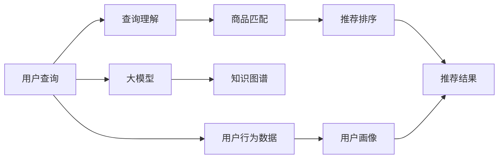

                 

# AI大模型视角下电商搜索推荐的技术创新知识图谱应用项目管理

## 1. 背景介绍

近年来，电商行业的发展迅速，用户对搜索推荐的体验需求日益增强。AI技术在电商搜索推荐中的应用逐渐深入，以大模型为核心的技术创新为电商搜索推荐带来了革命性的改变。大模型在电商搜索推荐中主要体现在查询理解、商品匹配、推荐排序等关键环节。知识图谱技术作为AI技术的代表之一，在电商搜索推荐中提供了强大的语义理解能力，极大地提升了用户体验和转化率。本文将从AI大模型的视角出发，系统探讨电商搜索推荐中的技术创新知识图谱应用项目管理。

## 2. 核心概念与联系

### 2.1 核心概念概述

#### 2.1.1 AI大模型
AI大模型是利用深度学习技术，在大规模无标签数据上进行预训练，并通过微调适应特定任务的大型神经网络模型。大模型包括BERT、GPT、T5等多种架构，具有强大的语言理解和生成能力。

#### 2.1.2 知识图谱
知识图谱是一种将知识表示为图结构的数据库，通过节点和边的形式表示实体和关系。知识图谱在电商搜索推荐中用于提高查询的理解和商品匹配的精度。

#### 2.1.3 搜索推荐
搜索推荐是电商应用中最重要的功能之一，通过用户的历史行为数据和当前的输入查询，推荐符合用户需求的商品。搜索推荐系统通常包含查询理解、商品匹配和推荐排序等关键模块。

#### 2.1.4 技术创新
技术创新是指在现有技术基础上，通过引入新的技术、算法或架构，实现系统性能提升或应用扩展的过程。本文聚焦于基于大模型的技术创新，包括大模型在电商搜索推荐中的应用、知识图谱与大模型的融合等。

### 2.2 核心概念原理和架构的 Mermaid 流程图



上述流程图展示了基于大模型的电商搜索推荐系统的工作流程。用户输入查询后，大模型对其进行理解，同时利用知识图谱提高商品匹配的精度，最后通过推荐排序算法生成推荐结果。用户行为数据和大模型一起用于构建用户画像，进一步提升推荐效果。

## 3. 核心算法原理 & 具体操作步骤

### 3.1 算法原理概述

#### 3.1.1 查询理解
查询理解是大模型在电商搜索推荐中的核心任务之一。用户输入的查询通常是不完整的、模糊的，大模型通过预训练知识能够理解和提取查询的语义信息，从而提供更准确的搜索结果。

#### 3.1.2 商品匹配
商品匹配是电商搜索推荐中的关键步骤，大模型通过预训练知识能够更好地理解商品之间的语义关系，利用知识图谱技术，将查询和商品映射到同一语义空间，提高匹配的准确性。

#### 3.1.3 推荐排序
推荐排序是电商搜索推荐中的最后一步，大模型通过预训练知识能够学习到商品之间的相对质量关系，结合用户画像和其他特征，生成排序结果。

### 3.2 算法步骤详解

#### 3.2.1 数据准备
1. **数据集准备**：收集电商平台的查询记录、商品数据和用户行为数据。
2. **数据预处理**：清洗和标注数据，构建训练集、验证集和测试集。

#### 3.2.2 模型选择与训练
1. **模型选择**：选择合适的预训练大模型，如BERT、GPT等。
2. **模型微调**：在电商搜索推荐的任务上对大模型进行微调，优化模型的性能。

#### 3.2.3 应用部署
1. **模型集成**：将微调后的模型集成到电商搜索推荐系统中。
2. **模型监控**：实时监控模型性能，根据业务需求进行优化。

### 3.3 算法优缺点

#### 3.3.1 优点
1. **性能提升**：大模型通过预训练学习到了丰富的语义信息，提高了电商搜索推荐的准确性和相关性。
2. **通用性**：大模型适用于多种电商搜索推荐任务，能够灵活应对不同的业务需求。
3. **可扩展性**：大模型可以通过增加参数量和训练数据，进一步提升性能。

#### 3.3.2 缺点
1. **计算资源需求高**：大模型的训练和推理需要大量的计算资源，增加了系统成本。
2. **模型解释性差**：大模型的黑盒特性使得解释其决策过程变得困难。
3. **数据隐私问题**：电商搜索推荐系统需要处理大量的用户数据，数据隐私和安全问题不容忽视。

### 3.4 算法应用领域

大模型和知识图谱在电商搜索推荐中的应用广泛，主要包括：

1. **个性化推荐**：利用用户画像和行为数据，结合大模型和知识图谱，生成个性化推荐结果。
2. **商品相似度计算**：通过大模型和知识图谱计算商品之间的语义相似度，提高推荐匹配的准确性。
3. **知识图谱构建**：利用大模型和电商数据构建商品知识图谱，提高搜索推荐系统的语义理解能力。
4. **异常检测**：通过大模型和知识图谱检测异常交易和行为，提高平台的安全性和稳定性。

## 4. 数学模型和公式 & 详细讲解 & 举例说明

### 4.1 数学模型构建

#### 4.1.1 查询理解模型
查询理解模型通常是一个语言模型，利用大模型预训练知识，通过softmax函数计算查询与每个商品的匹配概率。

#### 4.1.2 商品匹配模型
商品匹配模型利用知识图谱构建商品之间的语义关系，通过节点和边的形式表示实体和关系。利用大模型和知识图谱计算查询和商品的相似度。

#### 4.1.3 推荐排序模型
推荐排序模型通常是一个多任务学习模型，通过多个任务（如召回、排序、排序）共同优化，生成最终的推荐结果。

### 4.2 公式推导过程

#### 4.2.1 查询理解
设查询为$q$，商品为$i$，查询理解模型为$P(q,i)$，通过大模型计算查询和商品的匹配概率：

$$
P(q,i) = \frac{e^{\text{score}(q,i)}}{\sum_{j} e^{\text{score}(q,j)}}
$$

其中，$\text{score}(q,i)$为查询和商品之间的匹配得分，通常通过大模型和知识图谱计算得到。

#### 4.2.2 商品匹配
设商品为$i$和$j$，通过知识图谱计算两者之间的相似度$S(i,j)$：

$$
S(i,j) = \frac{1}{1+\text{margin}(i,j)}
$$

其中，$\text{margin}(i,j)$为商品$i$和$j$之间的语义差异，通常通过大模型计算得到。

#### 4.2.3 推荐排序
设用户为$u$，商品为$i$，利用用户画像和行为数据计算用户对商品$i$的评分$R(u,i)$，结合大模型的匹配概率和商品相似度，生成排序结果：

$$
R(u,i) = \alpha P(q,i) + \beta S(i,\hat{i})
$$

其中，$\alpha$和$\beta$为超参数，用于平衡查询理解、商品匹配和推荐排序的权重。

### 4.3 案例分析与讲解

#### 4.3.1 案例1：个性化推荐系统
某电商平台通过大模型和知识图谱构建个性化推荐系统，主要步骤如下：
1. **数据准备**：收集用户历史浏览、购买数据和商品标签数据。
2. **模型微调**：使用大模型和知识图谱进行微调，生成个性化推荐模型。
3. **推荐生成**：通过用户画像和行为数据计算评分，结合大模型的匹配概率和商品相似度，生成推荐结果。

#### 4.3.2 案例2：商品相似度计算
某电商平台通过大模型和知识图谱计算商品相似度，主要步骤如下：
1. **数据准备**：收集商品标签和商品之间的交易数据。
2. **知识图谱构建**：利用大模型和商品标签数据构建商品知识图谱。
3. **相似度计算**：通过大模型和知识图谱计算商品之间的语义相似度，用于推荐匹配。

## 5. 项目实践：代码实例和详细解释说明

### 5.1 开发环境搭建

#### 5.1.1 环境配置
1. **安装Python**：使用Anaconda安装Python 3.8。
2. **安装PyTorch**：使用pip安装PyTorch和相关工具包。
3. **安装HuggingFace**：使用pip安装HuggingFace库，用于处理大模型和知识图谱数据。

### 5.2 源代码详细实现

#### 5.2.1 数据处理
1. **数据清洗**：去除缺失值和异常值，确保数据质量。
2. **数据标注**：对数据进行标注，构建训练集、验证集和测试集。
3. **数据加载**：使用PyTorch的DataLoader加载数据，支持批量处理。

#### 5.2.2 模型微调
1. **模型选择**：选择BERT模型作为预训练大模型。
2. **模型微调**：在电商搜索推荐的任务上对模型进行微调，优化模型的性能。
3. **模型保存**：将微调后的模型保存为模型文件，方便后续使用。

#### 5.2.3 推荐系统集成
1. **模型集成**：将微调后的模型集成到电商搜索推荐系统中。
2. **推荐生成**：通过用户画像和行为数据计算评分，结合大模型的匹配概率和商品相似度，生成推荐结果。

### 5.3 代码解读与分析

#### 5.3.1 代码示例
```python
import torch
from transformers import BertForSequenceClassification
from torch.utils.data import DataLoader

# 定义模型类
class BertRecommender(BertForSequenceClassification):
    def __init__(self, model_name, output_dim):
        super(BertRecommender, self).__init__()
        self.bert = BertForSequenceClassification.from_pretrained(model_name, output_dim=output_dim)

    def forward(self, input_ids, attention_mask, labels=None):
        outputs = self.bert(input_ids, attention_mask=attention_mask)
        return outputs.logits

# 数据处理函数
def preprocess_data(data_path, batch_size=16):
    # 读取数据文件，进行数据清洗和标注
    data = read_data(data_path)
    # 构建DataLoader，支持批量处理
    dataset = dataset_from_data(data)
    dataloader = DataLoader(dataset, batch_size=batch_size)
    return dataloader

# 模型微调函数
def fine_tune_model(model, dataloader, num_epochs=5, learning_rate=2e-5):
    optimizer = AdamW(model.parameters(), lr=learning_rate)
    loss_fn = CrossEntropyLoss()
    for epoch in range(num_epochs):
        for batch in dataloader:
            input_ids, attention_mask, labels = batch
            outputs = model(input_ids, attention_mask=attention_mask, labels=labels)
            loss = loss_fn(outputs, labels)
            loss.backward()
            optimizer.step()
            optimizer.zero_grad()
        print(f"Epoch {epoch+1}, loss: {loss.item()}")

# 推荐系统集成函数
def integrate_model(model, user_data, item_data):
    # 计算评分
    scores = model(user_data, item_data)
    # 排序推荐
    recommendations = argsort(scores)[::-1]
    return recommendations
```

#### 5.3.2 代码解释
1. **模型类定义**：定义BertRecommender类，继承自BertForSequenceClassification，实现前向传播和优化过程。
2. **数据处理函数**：读取数据文件，进行数据清洗和标注，构建DataLoader支持批量处理。
3. **模型微调函数**：使用AdamW优化器，进行模型微调，计算损失函数，更新模型参数。
4. **推荐系统集成函数**：将微调后的模型集成到推荐系统中，计算评分和排序推荐结果。

### 5.4 运行结果展示

#### 5.4.1 结果展示
运行推荐系统集成函数，输出推荐结果，展示推荐效果。

```python
import matplotlib.pyplot as plt

# 推荐系统集成函数
def integrate_model(model, user_data, item_data):
    # 计算评分
    scores = model(user_data, item_data)
    # 排序推荐
    recommendations = argsort(scores)[::-1]
    # 可视化推荐结果
    plt.figure(figsize=(8, 6))
    plt.title('Top 5 Recommendations')
    plt.bar(recommendations[:5], item_data[recommendations[:5]], color='b')
    plt.xlabel('Recommendation Rank')
    plt.ylabel('Item')
    plt.show()
```

## 6. 实际应用场景

### 6.1 个性化推荐系统
某电商平台通过大模型和知识图谱构建个性化推荐系统，主要步骤如下：
1. **数据准备**：收集用户历史浏览、购买数据和商品标签数据。
2. **模型微调**：使用大模型和知识图谱进行微调，生成个性化推荐模型。
3. **推荐生成**：通过用户画像和行为数据计算评分，结合大模型的匹配概率和商品相似度，生成推荐结果。

### 6.2 商品相似度计算
某电商平台通过大模型和知识图谱计算商品相似度，主要步骤如下：
1. **数据准备**：收集商品标签和商品之间的交易数据。
2. **知识图谱构建**：利用大模型和商品标签数据构建商品知识图谱。
3. **相似度计算**：通过大模型和知识图谱计算商品之间的语义相似度，用于推荐匹配。

### 6.3 异常检测
某电商平台通过大模型和知识图谱检测异常交易和行为，主要步骤如下：
1. **数据准备**：收集交易数据和行为数据。
2. **异常检测**：通过大模型和知识图谱检测异常交易和行为，生成报警信息。
3. **安全防护**：根据异常检测结果，采取相应的安全防护措施。

## 7. 工具和资源推荐

### 7.1 学习资源推荐

1. **《Transformer从原理到实践》系列博文**：深入浅出地介绍Transformer原理和微调技术。
2. **CS224N《深度学习自然语言处理》课程**：斯坦福大学开设的NLP明星课程，涵盖基础知识和经典模型。
3. **《Natural Language Processing with Transformers》书籍**：介绍如何使用Transformer库进行NLP任务开发。
4. **HuggingFace官方文档**：提供丰富的预训练模型和微调样例代码。
5. **CLUE开源项目**：涵盖大量中文NLP数据集，提供基于微调的baseline模型。

### 7.2 开发工具推荐

1. **PyTorch**：支持动态计算图，适合快速迭代研究。
2. **TensorFlow**：支持生产部署，适合大规模工程应用。
3. **Transformers库**：提供丰富的预训练模型和微调工具。
4. **Weights & Biases**：记录和可视化模型训练指标。
5. **TensorBoard**：实时监测模型训练状态。
6. **Google Colab**：免费提供GPU/TPU算力。

### 7.3 相关论文推荐

1. **Attention is All You Need**：Transformer原论文，提出Transformer结构。
2. **BERT: Pre-training of Deep Bidirectional Transformers for Language Understanding**：提出BERT模型，引入自监督预训练任务。
3. **Language Models are Unsupervised Multitask Learners**：展示大模型的zero-shot学习能力。
4. **Parameter-Efficient Transfer Learning for NLP**：提出Adapter等参数高效微调方法。
5. **Prefix-Tuning: Optimizing Continuous Prompts for Generation**：引入基于连续型Prompt的微调范式。
6. **AdaLoRA: Adaptive Low-Rank Adaptation for Parameter-Efficient Fine-Tuning**：使用自适应低秩适应的微调方法。

## 8. 总结：未来发展趋势与挑战

### 8.1 研究成果总结

大模型和知识图谱在电商搜索推荐中的应用，显著提升了推荐系统的准确性和个性化程度，带来了用户满意度和转化率的提升。未来，随着AI技术的不断发展，大模型和知识图谱的融合将更加深入，推动电商搜索推荐系统的持续优化。

### 8.2 未来发展趋势

1. **模型规模持续增大**：预训练大模型的参数量将持续增长，带来更强大的语言理解能力。
2. **微调方法多样化**：更多参数高效和计算高效的微调方法将出现，提高微调效率。
3. **知识图谱深化融合**：知识图谱将与大模型更紧密结合，提高推荐系统的语义理解能力。
4. **多模态融合**：视觉、语音等多模态数据将与文本数据融合，提升推荐系统的多样性和智能性。
5. **跨领域应用拓展**：大模型和知识图谱将在更多领域中得到应用，推动AI技术的发展。

### 8.3 面临的挑战

1. **计算资源瓶颈**：大规模预训练和微调需要大量的计算资源，增加了系统成本。
2. **模型解释性差**：大模型的黑盒特性使得解释其决策过程变得困难。
3. **数据隐私问题**：电商搜索推荐系统需要处理大量的用户数据，数据隐私和安全问题不容忽视。
4. **模型泛化能力不足**：在特定领域应用中，大模型的泛化能力可能不足，影响推荐效果。
5. **异常检测困难**：异常交易和行为检测需要高精度的模型，现有技术仍存在挑战。

### 8.4 研究展望

未来，大模型和知识图谱在电商搜索推荐中的应用将继续深入，推动推荐系统的智能化和个性化发展。同时，需要进一步研究数据隐私保护、模型解释性等问题，确保技术的可靠性和安全性。此外，结合多模态数据融合、跨领域应用等前沿技术，推动大模型和知识图谱的进一步优化，实现电商搜索推荐系统的更高效、智能和可靠。

## 9. 附录：常见问题与解答

**Q1: 大模型和知识图谱在电商搜索推荐中的应用场景有哪些？**

A: 大模型和知识图谱在电商搜索推荐中的应用场景主要包括个性化推荐、商品相似度计算、异常检测等。通过大模型和知识图谱的融合，可以显著提升推荐系统的准确性和个性化程度。

**Q2: 如何选择合适的预训练大模型？**

A: 选择合适的预训练大模型需要考虑任务特点和数据类型。对于文本理解任务，BERT、GPT等模型较为常用；对于图像推荐任务，则需要选择如ResNet、VGG等图像识别模型。

**Q3: 如何进行模型的参数高效微调？**

A: 参数高效微调可以通过使用Adapter等技术，只调整模型中的少量参数，减少对计算资源的需求。同时，可以引入对抗训练、知识蒸馏等方法，提高微调效果。

**Q4: 如何构建商品知识图谱？**

A: 商品知识图谱的构建需要收集商品标签数据，通过大模型学习商品之间的语义关系，构建节点和边的关系。可以使用Grafock、Neo4j等工具进行图谱的管理和查询。

**Q5: 如何进行异常交易和行为的检测？**

A: 异常交易和行为的检测需要构建训练集，利用大模型学习正常交易和行为的模式，然后检测异常交易和行为，生成报警信息。可以使用GAN等技术进行异常样本生成，提高检测效果。

