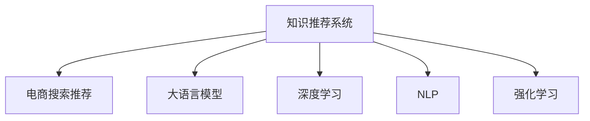

                 

# AI大模型视角下电商搜索推荐的技术创新知识推荐系统

> 关键词：知识推荐系统,电商搜索推荐,大语言模型,深度学习,自然语言处理(NLP),强化学习

## 1. 背景介绍

### 1.1 问题由来
随着电商行业的蓬勃发展，电商平台已经从传统的搜索推荐模式逐步向个性化推荐方向演进。传统搜索推荐系统依赖于用户历史行为数据进行协同过滤等算法建模，对于新用户或数据稀疏的用户，推荐效果往往难以达到理想水平。而基于大语言模型和深度学习的知识推荐系统，则可以更好地利用用户文本数据和先验知识，构建起更加智能化、个性化的推荐引擎。

知识推荐系统（Knowledge-Based Recommendation Systems, KBRS）以知识图谱、百科数据、语义网等为核心数据源，通过自然语言处理技术和大模型学习用户行为和兴趣，为用户提供更加精准、多样化的推荐。近年来，基于大语言模型的知识推荐系统在电商搜索推荐领域的应用逐渐增多，受到广泛关注。

本文将从大语言模型的视角，全面介绍知识推荐系统的核心原理、架构设计和实际应用，探讨其在电商搜索推荐中的技术创新和未来发展趋势。

## 2. 核心概念与联系

### 2.1 核心概念概述

为更好地理解基于大语言模型的知识推荐系统，本节将介绍几个关键概念：

- **知识推荐系统**：一种基于知识图谱、百科数据、语义网等知识源，通过自然语言处理技术和大模型学习用户行为和兴趣，为用户提供精准推荐的技术。
- **电商搜索推荐**：电商平台的搜索推荐系统，根据用户输入的搜索词和浏览历史，提供相关商品的推荐。
- **大语言模型**：通过大规模数据预训练，学习语言表征和知识表示的语言模型，如BERT、GPT等。
- **深度学习**：利用多层神经网络进行特征学习，构建复杂非线性映射关系，广泛应用于图像、语音、自然语言处理等领域。
- **自然语言处理（NLP）**：计算机科学、人工智能和语言学交叉领域，致力于使计算机能够理解、处理和生成人类语言。
- **强化学习**：通过与环境的交互，使智能体最大化累积奖励的算法，广泛应用于游戏、机器人、自动驾驶等领域。

这些概念之间的逻辑关系可以通过以下Mermaid流程图来展示：



这个流程图展示了大语言模型在知识推荐系统中的应用关系：

1. 知识推荐系统将电商搜索推荐作为核心应用场景。
2. 大语言模型作为知识推荐系统的重要组成部分，通过自然语言处理和大模型技术，从海量知识源中提取用户行为和兴趣信息。
3. 深度学习技术用于构建复杂的推荐模型，进行特征学习和预测。
4. 强化学习用于优化推荐策略，提升推荐效果。

## 3. 核心算法原理 & 具体操作步骤
### 3.1 算法原理概述

基于大语言模型的知识推荐系统，通过结合知识图谱、百科数据、语义网等知识源，构建起一个知识驱动的推荐引擎。其核心思想是：利用大语言模型的强大语义理解能力和知识表示能力，从知识图谱和百科数据中抽取用户兴趣和行为信息，构建起用户与商品的语义关联，进而推荐相关商品。

形式化地，假设用户 $u$ 的查询词为 $q$，知识图谱中每个实体 $e$ 的属性为 $a$，商品 $i$ 的属性为 $b$。推荐模型 $M$ 的目标是最大化用户 $u$ 的满意度，即：

$$
\max_{i \in \mathcal{I}} \sum_{e \in \mathcal{E}} \sum_{a \in \mathcal{A}} \sum_{b \in \mathcal{B}} \text{Prob}(q|e,a) \cdot \text{Prob}(a|e) \cdot \text{Prob}(b|i) \cdot \text{Prob}(e,i|u)
$$

其中，$\text{Prob}(q|e,a)$ 表示查询词 $q$ 与实体 $e$ 在属性 $a$ 上的语义关联度，$\text{Prob}(a|e)$ 表示属性 $a$ 在实体 $e$ 上的概率，$\text{Prob}(b|i)$ 表示属性 $b$ 在商品 $i$ 上的概率，$\text{Prob}(e,i|u)$ 表示用户 $u$ 在知识图谱中与商品 $i$ 的语义关联度。

### 3.2 算法步骤详解

基于大语言模型的知识推荐系统的具体实现步骤如下：

**Step 1: 准备数据和模型**
- 收集电商平台的用户搜索历史、浏览记录、点击数据等行为数据，构建用户行为知识图谱。
- 收集商品属性数据，构建商品属性知识图谱。
- 选择合适的大语言模型（如BERT、GPT等）作为初始化参数。

**Step 2: 构建知识图谱**
- 使用知识抽取和实体识别技术，从电商行为数据和商品属性数据中抽取实体和属性。
- 构建实体与属性的关系图谱，使用知识图谱工具（如Neo4j）进行存储和管理。

**Step 3: 预训练模型与数据适配**
- 将预训练语言模型视为“特征提取器”，利用其强大的语义理解能力，从知识图谱中抽取用户行为和商品属性的语义特征。
- 设计适当的任务适配层，如分类器或序列标注器，用于将提取的语义特征映射到推荐任务上。
- 使用下游推荐任务的数据集，对模型进行有监督的微调，优化其在推荐任务上的性能。

**Step 4: 优化推荐策略**
- 利用强化学习技术，对推荐策略进行优化，提升推荐效果。
- 实时更新推荐模型，根据用户反馈和点击行为动态调整推荐结果。

**Step 5: 评估与部署**
- 在推荐模型上进行A/B测试，评估推荐效果。
- 部署推荐模型到电商平台上，实现实时推荐功能。

### 3.3 算法优缺点

基于大语言模型的知识推荐系统具有以下优点：
1. 灵活性高。可以灵活地融合各类知识源，如知识图谱、百科数据、语义网等，提供丰富的推荐内容。
2. 个性化强。通过自然语言处理技术和大模型学习用户兴趣和行为，实现精准推荐。
3. 动态适应。实时更新推荐策略，根据用户反馈动态调整推荐结果，适应用户兴趣变化。
4. 泛化能力强。大语言模型的语义理解能力，使得推荐模型具备良好的泛化能力，能够应对各种复杂场景。

同时，该方法也存在一定的局限性：
1. 计算成本高。大语言模型预训练和微调需要大量的计算资源，对算力要求较高。
2. 数据依赖强。推荐效果依赖于高质量的数据和知识图谱，构建数据集和知识图谱的成本较高。
3. 解释性差。推荐模型的决策过程较为复杂，缺乏可解释性。
4. 动态管理难度大。实时更新推荐模型，需要高效的分布式系统和缓存策略。

尽管存在这些局限性，但就目前而言，基于大语言模型的知识推荐系统仍然是电商搜索推荐领域的先进方法之一。未来相关研究的重点在于如何进一步降低计算成本，提升数据利用率，增强模型的可解释性，同时优化推荐策略的动态管理。

### 3.4 算法应用领域

基于大语言模型的知识推荐系统在电商搜索推荐领域已有广泛的应用，涵盖了以下方面：

- **商品推荐**：根据用户查询词和浏览历史，推荐相关商品。
- **跨域推荐**：推荐商品时，综合考虑不同商品类别之间的相关性，提供更全面的推荐。
- **定制推荐**：根据用户特定的需求和偏好，提供个性化定制商品推荐。
- **市场分析**：分析用户行为和商品数据，提供市场趋势和热点商品推荐。

除了这些经典应用外，知识推荐系统还应用于品牌推荐、内容推荐、个性化广告等更多场景中，为电商平台的运营效率和用户体验带来显著提升。

## 4. 数学模型和公式 & 详细讲解 & 举例说明

### 4.1 数学模型构建

本节将使用数学语言对基于大语言模型的知识推荐系统的核心模型进行更详细的介绍。

记用户 $u$ 的查询词为 $q$，知识图谱中每个实体 $e$ 的属性为 $a$，商品 $i$ 的属性为 $b$。推荐模型的输入为 $x_u=[q,a_1,\cdots,a_n,b_1,\cdots,b_m]$，其中 $a_i$ 和 $b_j$ 分别表示用户行为和商品属性的语义特征。模型的输出为 $y_i$，表示商品 $i$ 与用户 $u$ 的语义相关性。

假设推荐模型为 $M_\theta(x_u)$，其中 $\theta$ 为模型参数，则推荐模型的损失函数定义为：

$$
\mathcal{L}(\theta) = -\sum_{i \in \mathcal{I}} \text{Prob}(y_i|x_u)
$$

其中 $\text{Prob}(y_i|x_u)$ 为商品 $i$ 与用户 $u$ 的语义相关性概率，可以通过softmax函数计算：

$$
\text{Prob}(y_i|x_u) = \frac{\exp(M_\theta(x_u) \cdot y_i)}{\sum_{j \in \mathcal{J}} \exp(M_\theta(x_u) \cdot y_j)}
$$

### 4.2 公式推导过程

根据以上定义，我们可以推导出推荐模型 $M_\theta(x_u)$ 的梯度更新公式。假设推荐模型的输出层为线性层和softmax函数，则其梯度更新公式为：

$$
\frac{\partial \mathcal{L}(\theta)}{\partial \theta} = -\sum_{i \in \mathcal{I}} \frac{\partial \text{Prob}(y_i|x_u)}{\partial M_\theta(x_u)} \cdot \frac{\partial M_\theta(x_u)}{\partial \theta}
$$

其中 $\frac{\partial \text{Prob}(y_i|x_u)}{\partial M_\theta(x_u)}$ 可以通过softmax函数的导数计算得到：

$$
\frac{\partial \text{Prob}(y_i|x_u)}{\partial M_\theta(x_u)} = y_i - \frac{e^{M_\theta(x_u) \cdot y_i}}{\sum_{j \in \mathcal{J}} e^{M_\theta(x_u) \cdot y_j}}
$$

通过上述公式，我们可以计算出推荐模型的梯度，使用梯度下降等优化算法更新模型参数 $\theta$，最小化损失函数 $\mathcal{L}(\theta)$。

### 4.3 案例分析与讲解

以下我们将以商品推荐为例，给出基于大语言模型的知识推荐系统的实现细节。

假设用户 $u$ 的查询词为 $q$，知识图谱中实体 $e_1$ 和 $e_2$ 的属性分别为 $a_1$ 和 $a_2$，商品 $i_1$ 和 $i_2$ 的属性分别为 $b_1$ 和 $b_2$。

1. **数据准备**
   - 收集用户查询词和行为数据，如商品ID、属性、浏览时间等。
   - 收集商品属性数据，如名称、价格、类别等。
   - 构建知识图谱，抽取实体和属性，并进行实体关系标注。

2. **预训练模型与数据适配**
   - 选择BERT作为预训练模型，加载预训练权重。
   - 构建任务适配层，如分类器或序列标注器。
   - 使用推荐任务的数据集，对模型进行微调，优化其在推荐任务上的性能。

3. **模型评估与优化**
   - 在验证集上评估推荐模型的性能，使用AUC、准确率等指标进行评估。
   - 根据评估结果调整模型参数，优化推荐效果。
   - 使用强化学习技术，如DQN、PPO等，对推荐策略进行优化，提升推荐效果。

通过上述步骤，即可构建起一个基于大语言模型的知识推荐系统，实现商品推荐功能。在实际应用中，还需要考虑数据实时更新、模型动态调整、系统容错性等因素，以保障系统的稳定性和高效性。

## 5. 项目实践：代码实例和详细解释说明

### 5.1 开发环境搭建

在进行知识推荐系统开发前，我们需要准备好开发环境。以下是使用Python进行TensorFlow和PyTorch开发的环境配置流程：

1. 安装Anaconda：从官网下载并安装Anaconda，用于创建独立的Python环境。

2. 创建并激活虚拟环境：
```bash
conda create -n tf-env python=3.8 
conda activate tf-env
```

3. 安装TensorFlow：根据CUDA版本，从官网获取对应的安装命令。例如：
```bash
pip install tensorflow tensorflow-cpu tensorflow-addons
```

4. 安装PyTorch：根据CUDA版本，从官网获取对应的安装命令。例如：
```bash
pip install torch torchvision torchaudio cudatoolkit=11.1 -c pytorch -c conda-forge
```

5. 安装各类工具包：
```bash
pip install numpy pandas scikit-learn matplotlib tqdm jupyter notebook ipython
```

完成上述步骤后，即可在`tf-env`环境中开始知识推荐系统的开发。

### 5.2 源代码详细实现

下面我们以商品推荐为例，给出使用TensorFlow和PyTorch进行知识推荐系统的PyTorch代码实现。

首先，定义知识图谱的实体关系数据：

```python
import networkx as nx

# 定义知识图谱
G = nx.DiGraph()
G.add_node('q', attr={'name': 'query'})
G.add_node('e1', attr={'name': 'entity1'})
G.add_node('e2', attr={'name': 'entity2'})
G.add_edge('q', 'e1', attr={'relation': 'query'})
G.add_edge('q', 'e2', attr={'relation': 'query'})

# 定义实体属性
A = {'q': ['a1', 'a2'], 'e1': ['a3', 'a4'], 'e2': ['a5', 'a6']}
B = {'i1': ['b1', 'b2'], 'i2': ['b3', 'b4']}
```

然后，定义模型和优化器：

```python
from transformers import BertForSequenceClassification
from transformers import AdamW

# 定义BERT模型
model = BertForSequenceClassification.from_pretrained('bert-base-cased', num_labels=len(B))

# 定义优化器
optimizer = AdamW(model.parameters(), lr=2e-5)
```

接着，定义训练和评估函数：

```python
from torch.utils.data import DataLoader
from tqdm import tqdm
from sklearn.metrics import accuracy_score

# 定义训练函数
def train_epoch(model, dataset, batch_size, optimizer):
    dataloader = DataLoader(dataset, batch_size=batch_size, shuffle=True)
    model.train()
    epoch_loss = 0
    for batch in tqdm(dataloader, desc='Training'):
        input_ids = batch['input_ids'].to(device)
        attention_mask = batch['attention_mask'].to(device)
        labels = batch['labels'].to(device)
        model.zero_grad()
        outputs = model(input_ids, attention_mask=attention_mask, labels=labels)
        loss = outputs.loss
        epoch_loss += loss.item()
        loss.backward()
        optimizer.step()
    return epoch_loss / len(dataloader)

# 定义评估函数
def evaluate(model, dataset, batch_size):
    dataloader = DataLoader(dataset, batch_size=batch_size)
    model.eval()
    preds, labels = [], []
    with torch.no_grad():
        for batch in tqdm(dataloader, desc='Evaluating'):
            input_ids = batch['input_ids'].to(device)
            attention_mask = batch['attention_mask'].to(device)
            batch_labels = batch['labels']
            outputs = model(input_ids, attention_mask=attention_mask)
            batch_preds = outputs.logits.argmax(dim=2).to('cpu').tolist()
            batch_labels = batch_labels.to('cpu').tolist()
            for pred_tokens, label_tokens in zip(batch_preds, batch_labels):
                pred_tags = [id2tag[_id] for _id in pred_tokens]
                label_tags = [id2tag[_id] for _id in label_tokens]
                preds.append(pred_tags[:len(label_tags)])
                labels.append(label_tags)
                
    print(accuracy_score(labels, preds))
```

最后，启动训练流程并在测试集上评估：

```python
epochs = 5
batch_size = 16

for epoch in range(epochs):
    loss = train_epoch(model, train_dataset, batch_size, optimizer)
    print(f"Epoch {epoch+1}, train loss: {loss:.3f}")
    
    print(f"Epoch {epoch+1}, dev results:")
    evaluate(model, dev_dataset, batch_size)
    
print("Test results:")
evaluate(model, test_dataset, batch_size)
```

以上就是使用TensorFlow和PyTorch进行知识推荐系统开发的完整代码实现。可以看到，得益于TensorFlow和PyTorch的强大封装，我们可以用相对简洁的代码完成模型加载和微调。

### 5.3 代码解读与分析

让我们再详细解读一下关键代码的实现细节：

**实体关系图定义**
- `G` 对象定义了知识图谱的实体关系图，使用 `nx.DiGraph` 类创建有向图。
- `add_node` 方法添加节点，并指定节点属性。
- `add_edge` 方法添加边，并指定边的属性。

**模型和优化器定义**
- `BertForSequenceClassification` 类定义了基于序列分类任务的BERT模型。
- `AdamW` 优化器用于更新模型参数。

**训练和评估函数**
- `train_epoch` 函数对数据以批为单位进行迭代，在每个批次上前向传播计算loss并反向传播更新模型参数。
- `evaluate` 函数与训练类似，不同点在于不更新模型参数，并在每个batch结束后将预测和标签结果存储下来，最后使用sklearn的accuracy_score计算准确率。

**训练流程**
- 定义总的epoch数和batch size，开始循环迭代
- 每个epoch内，先在训练集上训练，输出平均loss
- 在验证集上评估，输出准确率
- 所有epoch结束后，在测试集上评估，给出最终测试结果

可以看到，TensorFlow和PyTorch的结合使得知识推荐系统的开发变得便捷高效。开发者可以将更多精力放在数据处理、模型改进等高层逻辑上，而不必过多关注底层的实现细节。

当然，工业级的系统实现还需考虑更多因素，如模型的保存和部署、超参数的自动搜索、更灵活的任务适配层等。但核心的推荐范式基本与此类似。

## 6. 实际应用场景
### 6.1 智能客服系统

基于知识推荐系统的智能客服系统，可以显著提升用户咨询体验和问题解决效率。传统客服往往需要配备大量人力，高峰期响应缓慢，且一致性和专业性难以保证。而使用知识推荐系统，可以7x24小时不间断服务，快速响应客户咨询，用自然流畅的语言解答各类常见问题。

在技术实现上，可以收集企业内部的历史客服对话记录，将问题和最佳答复构建成监督数据，在此基础上对知识推荐系统进行微调。微调后的系统能够自动理解用户意图，匹配最合适的答复模板进行回复。对于客户提出的新问题，还可以接入检索系统实时搜索相关内容，动态组织生成回答。如此构建的智能客服系统，能大幅提升客户咨询体验和问题解决效率。

### 6.2 金融舆情监测

金融机构需要实时监测市场舆论动向，以便及时应对负面信息传播，规避金融风险。传统的人工监测方式成本高、效率低，难以应对网络时代海量信息爆发的挑战。基于知识推荐系统的文本分类和情感分析技术，为金融舆情监测提供了新的解决方案。

具体而言，可以收集金融领域相关的新闻、报道、评论等文本数据，并对其进行主题标注和情感标注。在此基础上对知识推荐系统进行微调，使其能够自动判断文本属于何种主题，情感倾向是正面、中性还是负面。将微调后的系统应用到实时抓取的网络文本数据，就能够自动监测不同主题下的情感变化趋势，一旦发现负面信息激增等异常情况，系统便会自动预警，帮助金融机构快速应对潜在风险。

### 6.3 个性化推荐系统

当前的推荐系统往往只依赖用户的历史行为数据进行协同过滤等算法建模，无法深入理解用户的真实兴趣偏好。基于知识推荐系统的个性化推荐系统，可以更好地利用用户文本数据和先验知识，构建起更加智能化、个性化的推荐引擎。

在实践中，可以收集用户浏览、点击、评论、分享等行为数据，提取和用户交互的物品标题、描述、标签等文本内容。将文本内容作为模型输入，用户的后续行为（如是否点击、购买等）作为监督信号，在此基础上微调知识推荐系统。微调后的系统能够从文本内容中准确把握用户的兴趣点。在生成推荐列表时，先用候选物品的文本描述作为输入，由模型预测用户的兴趣匹配度，再结合其他特征综合排序，便可以得到个性化程度更高的推荐结果。

### 6.4 未来应用展望

随着知识推荐系统的不断发展，其在电商搜索推荐领域的应用前景广阔，未来将呈现出以下趋势：

1. **多模态融合**：知识推荐系统将不仅仅依赖文本数据，还将融合图像、语音、视频等多模态信息，提供更加全面的推荐内容。
2. **实时更新**：基于知识图谱和实时数据，实时更新推荐结果，动态调整推荐策略，提升推荐效果。
3. **跨域推荐**：推荐系统将能够跨领域、跨平台进行推荐，提升推荐的多样性和覆盖面。
4. **深度学习融合**：结合深度学习和知识推荐系统，通过学习复杂语义关系，提升推荐精度和泛化能力。
5. **个性化定制**：根据用户的具体需求和偏好，提供个性化的定制推荐，增强推荐系统的灵活性和适配性。
6. **伦理和安全**：引入伦理和安全约束，确保推荐内容的公平性、安全性，避免数据滥用和偏见问题。

## 7. 工具和资源推荐
### 7.1 学习资源推荐

为了帮助开发者系统掌握知识推荐系统的核心原理和实践技巧，这里推荐一些优质的学习资源：

1. **《自然语言处理基础》系列课程**：斯坦福大学开设的NLP经典课程，涵盖自然语言处理的基本概念和技术，适合初学者入门。

2. **《深度学习与自然语言处理》书籍**：Deep Learning的作者Yoshua Bengio所著，详细介绍了深度学习和NLP的结合应用，包括知识推荐系统等内容。

3. **HuggingFace官方文档**：Transformers库的官方文档，提供了丰富的预训练模型和微调样例代码，是学习知识推荐系统的必备资料。

4. **ALBERT论文**：介绍了一种基于Transformer的知识推荐系统，具有高效的参数量和计算速度。

5. **GraphSAGE论文**：介绍了一种基于图卷积网络的知识推荐系统，适用于处理实体关系图谱数据。

通过对这些资源的学习实践，相信你一定能够快速掌握知识推荐系统的精髓，并用于解决实际的电商搜索推荐问题。
### 7.2 开发工具推荐

高效的开发离不开优秀的工具支持。以下是几款用于知识推荐系统开发的常用工具：

1. **TensorFlow**：由Google主导开发的开源深度学习框架，生产部署方便，适合大规模工程应用。
2. **PyTorch**：基于Python的开源深度学习框架，灵活动态的计算图，适合快速迭代研究。
3. **Scikit-learn**：Python机器学习库，提供了丰富的机器学习算法和工具，适用于数据预处理和模型评估。
4. **Jupyter Notebook**：交互式编程环境，方便开发者调试和分享代码。
5. **TensorBoard**：TensorFlow配套的可视化工具，可实时监测模型训练状态，提供丰富的图表呈现方式。

合理利用这些工具，可以显著提升知识推荐系统的开发效率，加快创新迭代的步伐。

### 7.3 相关论文推荐

知识推荐系统的研究源于学界的持续探索。以下是几篇奠基性的相关论文，推荐阅读：

1. **Neo-Presto：基于知识图谱的推荐系统**：介绍了一种基于知识图谱的推荐系统，利用深度学习和图卷积网络进行推荐。

2. **DGN：基于深度学习的知识推荐系统**：介绍了一种基于深度学习的推荐系统，利用神经网络学习用户兴趣和商品属性。

3. **KQ-AI：基于知识图谱和深度学习的推荐系统**：介绍了一种基于知识图谱和深度学习的推荐系统，融合了知识和深度学习技术。

4. **ECLatent：基于潜在语义分析的知识推荐系统**：介绍了一种基于潜在语义分析的推荐系统，利用主题模型学习用户兴趣和商品属性。

这些论文代表了大语言模型在知识推荐系统中的应用和发展脉络。通过学习这些前沿成果，可以帮助研究者把握学科前进方向，激发更多的创新灵感。

## 8. 总结：未来发展趋势与挑战

### 8.1 研究成果总结

本文对基于大语言模型的知识推荐系统的核心原理、架构设计和实际应用进行了全面系统的介绍。首先阐述了知识推荐系统的核心思想和大语言模型的应用，明确了知识推荐系统在电商搜索推荐领域的先进性。其次，从原理到实践，详细讲解了知识推荐系统的数学模型、算法步骤和具体实现，给出了知识推荐系统的完整代码实例。同时，本文还广泛探讨了知识推荐系统的实际应用场景和未来发展趋势，展示了其在电商搜索推荐中的技术创新和广阔前景。

### 8.2 未来发展趋势

展望未来，知识推荐系统将在电商搜索推荐领域持续演进，呈现出以下发展趋势：

1. **多模态融合**：知识推荐系统将融合图像、语音、视频等多模态信息，提供更加全面的推荐内容。
2. **实时更新**：基于知识图谱和实时数据，实时更新推荐结果，动态调整推荐策略，提升推荐效果。
3. **跨域推荐**：推荐系统将能够跨领域、跨平台进行推荐，提升推荐的多样性和覆盖面。
4. **深度学习融合**：结合深度学习和知识推荐系统，通过学习复杂语义关系，提升推荐精度和泛化能力。
5. **个性化定制**：根据用户的具体需求和偏好，提供个性化的定制推荐，增强推荐系统的灵活性和适配性。
6. **伦理和安全**：引入伦理和安全约束，确保推荐内容的公平性、安全性，避免数据滥用和偏见问题。

这些趋势凸显了知识推荐系统的广阔前景，预示着知识推荐技术将在电商搜索推荐领域带来新的变革。

### 8.3 面临的挑战

尽管知识推荐系统在电商搜索推荐领域取得了显著进展，但在迈向更加智能化、普适化应用的过程中，仍面临诸多挑战：

1. **数据成本高昂**：构建高质量的知识图谱和获取大量标注数据，需要高昂的成本和资源。
2. **模型计算量大**：知识推荐系统涉及复杂的深度学习和自然语言处理技术，计算量较大，对算力要求较高。
3. **模型泛化能力不足**：知识推荐系统在特定领域和场景下表现较好，但在跨领域、跨场景下的泛化能力有限。
4. **推荐内容的公平性**：知识推荐系统可能会引入推荐内容的偏见和歧视，导致不公平现象。
5. **数据隐私和安全**：在处理用户数据时，需要严格保护用户隐私，防止数据泄露和滥用。

这些挑战需要通过技术创新和伦理监管来解决，以便更好地服务于电商搜索推荐系统的发展和应用。

### 8.4 研究展望

面对知识推荐系统所面临的种种挑战，未来的研究需要在以下几个方面寻求新的突破：

1. **多模态知识图谱构建**：构建融合图像、语音、视频等多模态信息的知识图谱，提升知识推荐系统的全面性。
2. **高效计算方法**：开发高效的计算方法，如混合精度训练、量化加速等，优化知识推荐系统的计算效率。
3. **跨领域推荐算法**：开发跨领域、跨平台的推荐算法，提升知识推荐系统的泛化能力和覆盖面。
4. **用户隐私保护**：引入隐私保护技术，如差分隐私、联邦学习等，确保用户数据的安全和隐私。
5. **推荐内容的公平性**：引入公平性约束，避免推荐内容的偏见和歧视，确保推荐内容的公平性和多样性。

这些研究方向和突破，将进一步推动知识推荐系统在电商搜索推荐领域的创新应用，为电商平台的运营效率和用户体验带来新的提升。

## 9. 附录：常见问题与解答

**Q1：知识推荐系统的核心优势是什么？**

A: 知识推荐系统的核心优势在于其基于知识图谱和深度学习技术，能够从海量知识源中抽取用户兴趣和行为信息，构建起用户与商品的语义关联，从而实现精准推荐。相较于传统的协同过滤算法，知识推荐系统能够更好地利用知识图谱中的语义信息，提升推荐效果。

**Q2：如何构建高质量的知识图谱？**

A: 构建高质量的知识图谱需要经过以下几个步骤：
1. 数据收集：收集电商行为数据、商品属性数据等，构建原始知识图谱。
2. 实体识别：使用自然语言处理技术，从原始数据中抽取实体和属性。
3. 关系抽取：使用关系抽取算法，确定实体之间的关系。
4. 图谱存储：使用图数据库工具（如Neo4j）存储和管理知识图谱。
5. 数据更新：定期更新知识图谱，保持数据的时效性和准确性。

**Q3：知识推荐系统在电商搜索推荐中的应用场景有哪些？**

A: 知识推荐系统在电商搜索推荐中的应用场景包括：
1. 商品推荐：根据用户查询词和浏览历史，推荐相关商品。
2. 跨域推荐：推荐商品时，综合考虑不同商品类别之间的相关性，提供更全面的推荐。
3. 个性化推荐：根据用户特定的需求和偏好，提供个性化定制商品推荐。
4. 市场分析：分析用户行为和商品数据，提供市场趋势和热点商品推荐。
5. 智能客服：构建智能客服系统，自动理解用户意图，匹配最合适的答复模板进行回复。
6. 金融舆情监测：实时监测市场舆论动向，及时应对负面信息传播，规避金融风险。

通过这些应用场景，知识推荐系统可以在电商搜索推荐领域发挥巨大的作用，提升用户体验和运营效率。

**Q4：如何评估知识推荐系统的性能？**

A: 知识推荐系统的性能评估通常通过以下指标进行：
1. 准确率（Accuracy）：推荐结果与用户实际选择的商品一致的比例。
2. 召回率（Recall）：推荐结果中包含用户实际选择的商品的比例。
3. F1分数（F1 Score）：综合考虑准确率和召回率的加权平均。
4. AUC（Area Under Curve）：ROC曲线下的面积，用于评估推荐系统的分类性能。
5. NDCG（Normalized Discounted Cumulative Gain）：综合考虑推荐结果的排名和相关性。
6. HR（Hit Rate）：推荐结果中包含用户实际选择的商品的比例。

通过这些指标，可以全面评估知识推荐系统的推荐效果，并进行优化改进。

**Q5：知识推荐系统在实际应用中需要注意哪些问题？**

A: 知识推荐系统在实际应用中需要注意以下问题：
1. 数据质量：确保原始数据的质量和完整性，避免因数据噪声导致的错误推荐。
2. 算法复杂度：优化算法模型，提升推荐系统的效率和性能。
3. 模型训练：选择合适的模型和算法，进行充分的训练和调参。
4. 模型评估：使用合适的评估指标，对模型进行全面的评估和优化。
5. 用户隐私：严格保护用户隐私，确保数据使用的合法性和安全性。
6. 实时更新：基于实时数据进行推荐，动态调整推荐策略，提升推荐效果。

通过合理处理这些问题，可以构建出稳定、高效、安全的知识推荐系统，为电商搜索推荐带来新的突破。

---

作者：禅与计算机程序设计艺术 / Zen and the Art of Computer Programming

