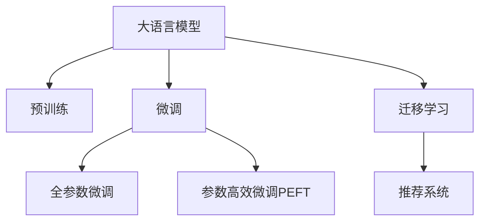

                 

# AI大模型视角下电商搜索推荐的未来展望

## 1. 背景介绍

在电商领域，搜索推荐系统已经成为了提升用户体验和增加收入的核心引擎。传统的搜索推荐系统主要基于协同过滤、线性回归等方法，虽然能够在一定程度上提升推荐效果，但随着数据量的不断增长和用户需求的日益个性化，传统推荐系统面临诸多挑战。近年来，随着深度学习和大模型的兴起，基于大模型推荐技术逐渐成为研究热点，并展现出良好的发展潜力。

大模型推荐技术利用大规模无标签数据进行预训练，学习到丰富的知识表示，能够更好地适应多样化的用户需求。在电商搜索推荐场景中，大模型通过学习用户行为、商品属性、上下文信息等多源数据，生成更加个性化的推荐结果，从而提升用户满意度、销售额和用户留存率。

## 2. 核心概念与联系

### 2.1 核心概念概述

为了更好地理解大模型在电商搜索推荐中的应用，本节将介绍几个关键概念：

- 大语言模型(Large Language Model, LLM)：以自回归(如GPT)或自编码(如BERT)模型为代表的大规模预训练语言模型。通过在大规模无标签文本语料上进行预训练，学习到丰富的语言知识和常识。
- 预训练(Pre-training)：指在大规模无标签文本语料上，通过自监督学习任务训练通用语言模型的过程。常见的预训练任务包括言语建模、遮挡语言模型等。
- 微调(Fine-tuning)：指在预训练模型的基础上，使用下游任务的少量标注数据，通过有监督地训练来优化模型在该任务上的性能。通常只需要调整顶层分类器或解码器，并以较小的学习率更新全部或部分的模型参数。
- 迁移学习(Transfer Learning)：指将一个领域学习到的知识，迁移应用到另一个不同但相关的领域的学习范式。大模型的预训练-微调过程即是一种典型的迁移学习方式。
- 推荐系统(Recommendation System)：指根据用户行为数据和商品信息，预测用户对未曝光商品的喜好程度，并为用户推荐最相关的商品的系统。

这些概念之间的逻辑关系可以通过以下Mermaid流程图来展示：



这个流程图展示了大语言模型的核心概念及其之间的关系：

1. 大语言模型通过预训练获得基础能力。
2. 微调是对预训练模型进行任务特定的优化，可以分为全参数微调和参数高效微调（PEFT）。
3. 推荐系统利用微调后的模型生成个性化推荐结果。
4. 迁移学习是连接预训练模型与推荐任务的桥梁，可以通过微调或迁移学习来实现。

## 3. 核心算法原理 & 具体操作步骤
### 3.1 算法原理概述

大模型推荐的核心思想是：将预训练的大语言模型作为“知识库”，通过微调技术，使其能够根据用户行为和上下文信息生成个性化推荐。

具体来说，大模型首先在大规模无标签数据上进行预训练，学习到丰富的语言知识和语义表示。在推荐场景中，模型将用户查询和商品信息作为输入，通过微调后的模型，生成每个商品的预测评分，并按照评分排序，为用户推荐最相关的商品。

### 3.2 算法步骤详解

大模型推荐一般包括以下几个关键步骤：

**Step 1: 准备预训练模型和数据集**
- 选择合适的预训练语言模型 $M_{\theta}$ 作为初始化参数，如 BERT、GPT 等。
- 准备电商推荐数据集 $D$，包括用户行为数据、商品属性数据、上下文信息等。

**Step 2: 设计推荐任务**
- 根据电商推荐任务，设计合适的任务适配层。
- 对于评分预测任务，通常使用线性回归模型或注意力机制对商品评分进行预测。
- 对于排序推荐任务，通常使用序列模型或神经网络模型对商品进行排序。

**Step 3: 设置微调超参数**
- 选择合适的优化算法及其参数，如 AdamW、SGD 等，设置学习率、批大小、迭代轮数等。
- 设置正则化技术及强度，包括权重衰减、Dropout、Early Stopping 等。
- 确定冻结预训练参数的策略，如仅微调顶层，或全部参数都参与微调。

**Step 4: 执行梯度训练**
- 将电商推荐数据集 $D$ 分批次输入模型，前向传播计算损失函数。
- 反向传播计算参数梯度，根据设定的优化算法和学习率更新模型参数。
- 周期性在验证集上评估模型性能，根据性能指标决定是否触发 Early Stopping。
- 重复上述步骤直到满足预设的迭代轮数或 Early Stopping 条件。

**Step 5: 测试和部署**
- 在测试集上评估微调后模型 $M_{\hat{\theta}}$ 的性能，对比微调前后的精度提升。
- 使用微调后的模型对新用户进行推荐，集成到电商推荐系统中。
- 持续收集新的用户行为数据，定期重新微调模型，以适应数据分布的变化。

以上是基于监督学习大模型推荐的一般流程。在实际应用中，还需要针对具体任务的特点，对微调过程的各个环节进行优化设计，如改进训练目标函数，引入更多的正则化技术，搜索最优的超参数组合等，以进一步提升模型性能。

### 3.3 算法优缺点

大模型推荐方法具有以下优点：

- 简单高效。只需准备少量标注数据，即可对预训练模型进行快速适配，获得较大的性能提升。
- 通用适用。适用于各种电商推荐任务，包括评分预测、排序推荐等，设计简单的任务适配层即可实现微调。
- 参数高效。利用参数高效微调技术，在固定大部分预训练权重不变的情况下，仍可取得不错的提升。
- 效果显著。在学术界和工业界的诸多电商推荐任务上，基于微调的方法已经刷新了最先进的性能指标。

同时，该方法也存在一定的局限性：

- 依赖标注数据。推荐模型的性能很大程度上取决于标注数据的质量和数量，获取高质量标注数据的成本较高。
- 迁移能力有限。当目标任务与预训练数据的分布差异较大时，微调的性能提升有限。
- 负面效果传递。预训练模型的固有偏见、有害信息等，可能通过微调传递到推荐任务，造成负面影响。
- 可解释性不足。推荐模型的决策过程通常缺乏可解释性，难以对其推理逻辑进行分析和调试。

尽管存在这些局限性，但就目前而言，基于监督学习的微调方法仍是大模型推荐应用的主流范式。未来相关研究的重点在于如何进一步降低推荐对标注数据的依赖，提高模型的少样本学习和跨领域迁移能力，同时兼顾可解释性和伦理安全性等因素。

### 3.4 算法应用领域

大模型推荐技术在电商领域已经得到了广泛的应用，涵盖了各种常见的推荐任务，例如：

- 用户画像：根据用户行为数据，构建用户兴趣模型，为用户推荐相关商品。
- 商品推荐：对商品进行个性化评分和排序，提升商品曝光率和销售额。
- 跨域推荐：结合不同电商平台的数据，为用户推荐跨平台的商品。
- 营销活动推荐：根据用户历史行为，推荐参与度和效果最佳的营销活动。
- 品牌推荐：根据用户品牌偏好，推荐相关品牌商品。
- 优惠券推荐：推荐用户最有可能点击和使用的优惠券。

除了上述这些经典任务外，大模型推荐还被创新性地应用到更多场景中，如可控推荐、广告推荐、商品评价等，为电商推荐系统带来了全新的突破。随着预训练模型和推荐方法的不断进步，相信电商推荐技术将在更广阔的应用领域大放异彩。

## 4. 数学模型和公式 & 详细讲解  
### 4.1 数学模型构建

本节将使用数学语言对基于监督学习的大模型推荐过程进行更加严格的刻画。

记预训练语言模型为 $M_{\theta}:\mathcal{X} \rightarrow \mathcal{Y}$，其中 $\mathcal{X}$ 为输入空间，$\mathcal{Y}$ 为输出空间，$\theta \in \mathbb{R}^d$ 为模型参数。假设推荐任务的训练集为 $D=\{(x_i,y_i)\}_{i=1}^N, x_i \in \mathcal{X}, y_i \in \mathcal{Y}$。

定义模型 $M_{\theta}$ 在输入 $x$ 上的损失函数为 $\ell(M_{\theta}(x),y)$，则在数据集 $D$ 上的经验风险为：

$$
\mathcal{L}(\theta) = \frac{1}{N} \sum_{i=1}^N \ell(M_{\theta}(x_i),y_i)
$$

其中 $\ell$ 为针对推荐任务设计的损失函数，用于衡量模型预测输出与真实标签之间的差异。常见的损失函数包括均方误差损失、交叉熵损失等。

微调的优化目标是最小化经验风险，即找到最优参数：

$$
\theta^* = \mathop{\arg\min}_{\theta} \mathcal{L}(\theta)
$$

在实践中，我们通常使用基于梯度的优化算法（如SGD、Adam等）来近似求解上述最优化问题。设 $\eta$ 为学习率，$\lambda$ 为正则化系数，则参数的更新公式为：

$$
\theta \leftarrow \theta - \eta \nabla_{\theta}\mathcal{L}(\theta) - \eta\lambda\theta
$$

其中 $\nabla_{\theta}\mathcal{L}(\theta)$ 为损失函数对参数 $\theta$ 的梯度，可通过反向传播算法高效计算。

### 4.2 公式推导过程

以下我们以评分预测任务为例，推导均方误差损失函数及其梯度的计算公式。

假设模型 $M_{\theta}$ 在输入 $x$ 上的输出为 $\hat{y}=M_{\theta}(x)$，表示对商品 $x$ 的评分预测。真实标签 $y \in [0,1]$。则均方误差损失函数定义为：

$$
\ell(M_{\theta}(x),y) = (\hat{y}-y)^2
$$

将其代入经验风险公式，得：

$$
\mathcal{L}(\theta) = \frac{1}{N}\sum_{i=1}^N (\hat{y_i}-y_i)^2
$$

根据链式法则，损失函数对参数 $\theta_k$ 的梯度为：

$$
\frac{\partial \mathcal{L}(\theta)}{\partial \theta_k} = -2\frac{1}{N}\sum_{i=1}^N (\hat{y_i}-y_i)\frac{\partial \hat{y_i}}{\partial \theta_k}
$$

其中 $\frac{\partial \hat{y_i}}{\partial \theta_k}$ 可进一步递归展开，利用自动微分技术完成计算。

在得到损失函数的梯度后，即可带入参数更新公式，完成模型的迭代优化。重复上述过程直至收敛，最终得到适应推荐任务的最优模型参数 $\theta^*$。

## 5. 项目实践：代码实例和详细解释说明
### 5.1 开发环境搭建

在进行推荐系统开发前，我们需要准备好开发环境。以下是使用Python进行PyTorch开发的环境配置流程：

1. 安装Anaconda：从官网下载并安装Anaconda，用于创建独立的Python环境。

2. 创建并激活虚拟环境：
```bash
conda create -n pytorch-env python=3.8 
conda activate pytorch-env
```

3. 安装PyTorch：根据CUDA版本，从官网获取对应的安装命令。例如：
```bash
conda install pytorch torchvision torchaudio cudatoolkit=11.1 -c pytorch -c conda-forge
```

4. 安装Transformers库：
```bash
pip install transformers
```

5. 安装各类工具包：
```bash
pip install numpy pandas scikit-learn matplotlib tqdm jupyter notebook ipython
```

完成上述步骤后，即可在`pytorch-env`环境中开始推荐系统开发。

### 5.2 源代码详细实现

这里我们以评分预测任务为例，给出使用Transformers库对BERT模型进行推荐系统开发的PyTorch代码实现。

首先，定义评分预测任务的数据处理函数：

```python
from transformers import BertTokenizer
from torch.utils.data import Dataset
import torch

class RecommendationDataset(Dataset):
    def __init__(self, items, features, labels, tokenizer, max_len=128):
        self.items = items
        self.features = features
        self.labels = labels
        self.tokenizer = tokenizer
        self.max_len = max_len
        
    def __len__(self):
        return len(self.items)
    
    def __getitem__(self, item):
        item_text = self.items[item]
        item_features = self.features[item]
        item_label = self.labels[item]
        
        encoding = self.tokenizer(item_text, return_tensors='pt', max_length=self.max_len, padding='max_length', truncation=True)
        input_ids = encoding['input_ids'][0]
        attention_mask = encoding['attention_mask'][0]
        
        # 对token-wise的标签进行编码
        encoded_labels = [label2id[label] for label in item_label] 
        encoded_labels.extend([label2id['O']] * (self.max_len - len(encoded_labels)))
        labels = torch.tensor(encoded_labels, dtype=torch.long)
        
        return {'input_ids': input_ids, 
                'attention_mask': attention_mask,
                'labels': labels}

# 标签与id的映射
label2id = {'O': 0, '5': 1, '7': 2, '8': 3}
id2label = {v: k for k, v in label2id.items()}

# 创建dataset
tokenizer = BertTokenizer.from_pretrained('bert-base-cased')

train_dataset = RecommendationDataset(train_items, train_features, train_labels, tokenizer)
dev_dataset = RecommendationDataset(dev_items, dev_features, dev_labels, tokenizer)
test_dataset = RecommendationDataset(test_items, test_features, test_labels, tokenizer)
```

然后，定义模型和优化器：

```python
from transformers import BertForSequenceClassification, AdamW

model = BertForSequenceClassification.from_pretrained('bert-base-cased', num_labels=len(label2id))

optimizer = AdamW(model.parameters(), lr=2e-5)
```

接着，定义训练和评估函数：

```python
from torch.utils.data import DataLoader
from tqdm import tqdm
from sklearn.metrics import mean_squared_error

device = torch.device('cuda') if torch.cuda.is_available() else torch.device('cpu')
model.to(device)

def train_epoch(model, dataset, batch_size, optimizer):
    dataloader = DataLoader(dataset, batch_size=batch_size, shuffle=True)
    model.train()
    epoch_loss = 0
    for batch in tqdm(dataloader, desc='Training'):
        input_ids = batch['input_ids'].to(device)
        attention_mask = batch['attention_mask'].to(device)
        labels = batch['labels'].to(device)
        model.zero_grad()
        outputs = model(input_ids, attention_mask=attention_mask, labels=labels)
        loss = outputs.loss
        epoch_loss += loss.item()
        loss.backward()
        optimizer.step()
    return epoch_loss / len(dataloader)

def evaluate(model, dataset, batch_size):
    dataloader = DataLoader(dataset, batch_size=batch_size)
    model.eval()
    preds, labels = [], []
    with torch.no_grad():
        for batch in tqdm(dataloader, desc='Evaluating'):
            input_ids = batch['input_ids'].to(device)
            attention_mask = batch['attention_mask'].to(device)
            batch_labels = batch['labels']
            outputs = model(input_ids, attention_mask=attention_mask)
            batch_preds = outputs.logits.argmax(dim=2).to('cpu').tolist()
            batch_labels = batch_labels.to('cpu').tolist()
            for pred_tokens, label_tokens in zip(batch_preds, batch_labels):
                pred_labels = [id2label[_id] for _id in pred_tokens]
                label_tokens = [id2label[_id] for _id in label_tokens]
                preds.append(pred_labels[:len(label_tokens)])
                labels.append(label_tokens)
                
    return mean_squared_error(labels, preds)
```

最后，启动训练流程并在测试集上评估：

```python
epochs = 5
batch_size = 16

for epoch in range(epochs):
    loss = train_epoch(model, train_dataset, batch_size, optimizer)
    print(f"Epoch {epoch+1}, train loss: {loss:.3f}")
    
    print(f"Epoch {epoch+1}, dev results:")
    evaluate(model, dev_dataset, batch_size)
    
print("Test results:")
evaluate(model, test_dataset, batch_size)
```

以上就是使用PyTorch对BERT进行推荐系统开发的完整代码实现。可以看到，得益于Transformers库的强大封装，我们可以用相对简洁的代码完成BERT模型的加载和推荐系统开发。

### 5.3 代码解读与分析

让我们再详细解读一下关键代码的实现细节：

**RecommendationDataset类**：
- `__init__`方法：初始化输入、特征、标签、分词器等关键组件。
- `__len__`方法：返回数据集的样本数量。
- `__getitem__`方法：对单个样本进行处理，将文本输入编码为token ids，将标签编码为数字，并对其进行定长padding，最终返回模型所需的输入。

**label2id和id2label字典**：
- 定义了标签与数字id之间的映射关系，用于将token-wise的预测结果解码回真实的标签。

**训练和评估函数**：
- 使用PyTorch的DataLoader对数据集进行批次化加载，供模型训练和推理使用。
- 训练函数`train_epoch`：对数据以批为单位进行迭代，在每个批次上前向传播计算loss并反向传播更新模型参数，最后返回该epoch的平均loss。
- 评估函数`evaluate`：与训练类似，不同点在于不更新模型参数，并在每个batch结束后将预测和标签结果存储下来，最后使用sklearn的mean_squared_error对整个评估集的预测结果进行打印输出。

**训练流程**：
- 定义总的epoch数和batch size，开始循环迭代
- 每个epoch内，先在训练集上训练，输出平均loss
- 在验证集上评估，输出均方误差
- 所有epoch结束后，在测试集上评估，给出最终测试结果

可以看到，PyTorch配合Transformers库使得BERT推荐系统开发的代码实现变得简洁高效。开发者可以将更多精力放在数据处理、模型改进等高层逻辑上，而不必过多关注底层的实现细节。

当然，工业级的系统实现还需考虑更多因素，如模型的保存和部署、超参数的自动搜索、更灵活的任务适配层等。但核心的推荐范式基本与此类似。

## 6. 实际应用场景
### 6.1 电商搜索推荐

在电商领域，基于大模型的推荐技术已经广泛应用于各类场景，并取得了显著的效果。以下是几个典型的应用案例：

**商品推荐引擎**：用户通过搜索引擎输入关键词，系统自动推荐与关键词匹配的商品。通过微调后的BERT模型，系统能够更好地理解用户的查询意图，生成相关性更高的推荐结果。

**个性化广告推荐**：在用户浏览商品时，系统实时推荐个性化广告。通过微调后的BERT模型，系统能够根据用户的浏览历史、点击行为等数据，生成最适合的广告内容。

**上下文推荐**：用户在浏览商品时，系统能够根据当前上下文信息（如浏览历史、购物车商品等），动态推荐更多相关商品。通过微调后的BERT模型，系统能够更好地捕捉上下文语境，提升推荐效果。

**新商品推荐**：电商平台上每天都会新增大量商品，如何推荐这些新商品给用户，是推荐系统面临的挑战。通过微调后的BERT模型，系统能够快速学习新商品的特征，并将其推荐给可能感兴趣的潜在用户。

### 6.2 未来应用展望

随着大模型推荐技术的不断发展，未来的电商推荐系统将在更多领域得到应用，为电商行业带来革命性的变化。

**智能客服系统**：电商平台上客户咨询量巨大，传统的客服系统难以应对。通过微调后的BERT模型，系统能够自动理解客户咨询，并生成合适的回复，提升客户满意度。

**商品质量评价**：用户对商品评价是电商平台上重要的数据源。通过微调后的BERT模型，系统能够从评论中自动抽取关键信息，并生成商品的综合评价。

**品牌推广推荐**：商家希望推广自己的品牌，通过微调后的BERT模型，系统能够自动生成符合品牌调性的广告内容，提升品牌曝光度和美誉度。

**营销活动推荐**：电商平台上经常有各种营销活动，如何推荐给用户是关键。通过微调后的BERT模型，系统能够自动分析用户的购物行为，推荐最适合的营销活动，提升用户参与度和商家ROI。

以上这些应用案例，展示了电商推荐技术在实际场景中的广泛应用。未来，随着大模型推荐技术的持续演进，其将在更多电商场景中发挥重要作用，进一步提升电商平台的运营效率和用户满意度。

## 7. 工具和资源推荐
### 7.1 学习资源推荐

为了帮助开发者系统掌握大模型推荐技术的理论基础和实践技巧，这里推荐一些优质的学习资源：

1. 《Transformer from Practical to Advanced》系列博文：由大模型技术专家撰写，深入浅出地介绍了Transformer原理、BERT模型、推荐系统等前沿话题。

2. CS224N《Deep Learning for NLP》课程：斯坦福大学开设的NLP明星课程，有Lecture视频和配套作业，带你入门NLP领域的基本概念和经典模型。

3. 《Recommender Systems》书籍：推荐系统领域的经典书籍，涵盖了推荐系统的各种算法和实践经验，是推荐系统开发的必备资料。

4. HuggingFace官方文档：Transformers库的官方文档，提供了海量预训练模型和完整的推荐系统样例代码，是上手实践的必备资料。

5. Kaggle竞赛平台：世界著名的数据科学竞赛平台，提供丰富的电商推荐系统数据集和竞赛，是锻炼推荐系统技能的好地方。

通过对这些资源的学习实践，相信你一定能够快速掌握大模型推荐技术的精髓，并用于解决实际的电商推荐问题。
###  7.2 开发工具推荐

高效的开发离不开优秀的工具支持。以下是几款用于大模型推荐系统开发的常用工具：

1. PyTorch：基于Python的开源深度学习框架，灵活动态的计算图，适合快速迭代研究。大部分预训练语言模型都有PyTorch版本的实现。

2. TensorFlow：由Google主导开发的开源深度学习框架，生产部署方便，适合大规模工程应用。同样有丰富的预训练语言模型资源。

3. Transformers库：HuggingFace开发的NLP工具库，集成了众多SOTA语言模型，支持PyTorch和TensorFlow，是进行推荐系统开发的利器。

4. Weights & Biases：模型训练的实验跟踪工具，可以记录和可视化模型训练过程中的各项指标，方便对比和调优。与主流深度学习框架无缝集成。

5. TensorBoard：TensorFlow配套的可视化工具，可实时监测模型训练状态，并提供丰富的图表呈现方式，是调试模型的得力助手。

6. Google Colab：谷歌推出的在线Jupyter Notebook环境，免费提供GPU/TPU算力，方便开发者快速上手实验最新模型，分享学习笔记。

合理利用这些工具，可以显著提升大模型推荐系统的开发效率，加快创新迭代的步伐。

### 7.3 相关论文推荐

大模型推荐技术的研究源于学界的持续研究。以下是几篇奠基性的相关论文，推荐阅读：

1. Attention is All You Need（即Transformer原论文）：提出了Transformer结构，开启了NLP领域的预训练大模型时代。

2. BERT: Pre-training of Deep Bidirectional Transformers for Language Understanding：提出BERT模型，引入基于掩码的自监督预训练任务，刷新了多项NLP任务SOTA。

3. Deep and Dense: A Deep Architectural Principle for Deep Learning：提出了深度和稠密的网络结构，提升了模型的表达能力，用于大规模语料预训练。

4. Large-Scale Pretrained Models for Inductive Recommandation：展示了在大规模预训练模型上进行推荐的效果，证明了预训练大模型的强大表现。

5. Factorization Machines: A Liblinear Model for Ranking: Pairwise and Soft Pairwise Ranking from Pairwise Data：介绍了因子化机模型，用于推荐系统的评估和优化。

这些论文代表了大模型推荐技术的发展脉络。通过学习这些前沿成果，可以帮助研究者把握学科前进方向，激发更多的创新灵感。

## 8. 总结：未来发展趋势与挑战
### 8.1 总结

本文对基于大模型的电商推荐系统进行了全面系统的介绍。首先阐述了大模型推荐系统的研究背景和意义，明确了其在提升电商推荐效果、优化用户体验方面的独特价值。其次，从原理到实践，详细讲解了推荐系统的数学模型和关键步骤，给出了推荐系统开发的完整代码实例。同时，本文还广泛探讨了推荐系统在电商搜索推荐、智能客服、广告推荐等多个电商场景中的实际应用，展示了其广阔的发展前景。

通过本文的系统梳理，可以看到，基于大模型的推荐系统已经在电商领域展现出巨大的潜力，正成为推荐技术落地的重要范式。未来，随着预训练模型和推荐方法的不断进步，相信电商推荐技术将在更广阔的应用领域大放异彩，为电商行业带来深远影响。

### 8.2 未来发展趋势

展望未来，大模型推荐技术将呈现以下几个发展趋势：

1. 模型规模持续增大。随着算力成本的下降和数据规模的扩张，预训练语言模型的参数量还将持续增长。超大批次的训练和推理也可能遇到显存不足的问题。因此需要采用一些资源优化技术，如梯度积累、混合精度训练、模型并行等，来突破硬件瓶颈。同时，模型的存储和读取也可能占用大量时间和空间，需要采用模型压缩、稀疏化存储等方法进行优化。

2. 推荐算法多样化。未来的推荐系统将不仅依赖于大模型，还将结合各种推荐算法，如协同过滤、内容推荐、兴趣推荐等，形成多算法协同的推荐体系。通过多源数据的融合，提升推荐的准确性和多样性。

3. 跨平台推荐。未来的推荐系统将打破平台壁垒，实现跨电商平台的推荐。通过联邦学习等技术，可以在不暴露用户隐私的前提下，利用多平台的用户数据进行推荐，提升推荐效果。

4. 个性化推荐。未来的推荐系统将更加注重个性化推荐，通过分析用户行为、兴趣、偏好等数据，生成更加精准的推荐结果。个性化推荐也将结合用户画像、商品属性、上下文信息等多种数据，形成多维度、多层次的推荐体系。

5. 实时推荐。未来的推荐系统将更加注重实时性，通过分布式计算、流式计算等技术，实现对用户行为的实时分析，并动态生成推荐结果。实时推荐将提升用户体验，满足用户即时需求。

6. 解释性增强。未来的推荐系统将更加注重可解释性，通过引入因果分析、可解释性AI等技术，提升推荐的透明度和可信度。可解释性推荐将有助于用户理解和信任推荐结果，提升用户满意度。

以上趋势凸显了大模型推荐技术的广阔前景。这些方向的探索发展，必将进一步提升电商推荐系统的性能和应用范围，为电商行业带来深远影响。

### 8.3 面临的挑战

尽管大模型推荐技术已经取得了瞩目成就，但在迈向更加智能化、普适化应用的过程中，它仍面临着诸多挑战：

1. 标注成本瓶颈。尽管微调依赖的标注数据量较小，但对于电商领域，仍然需要大量标注数据，标注成本较高。如何进一步降低推荐对标注数据的依赖，将是未来的一个重要研究方向。

2. 模型鲁棒性不足。当前推荐模型面对域外数据时，泛化性能往往大打折扣。对于测试样本的微小扰动，推荐模型的预测也容易发生波动。如何提高推荐模型的鲁棒性，避免灾难性遗忘，还需要更多理论和实践的积累。

3. 推理效率有待提高。大规模语言模型虽然精度高，但在实际部署时往往面临推理速度慢、内存占用大等效率问题。如何在保证性能的同时，简化模型结构，提升推理速度，优化资源占用，将是重要的优化方向。

4. 可解释性亟需加强。当前推荐模型的决策过程通常缺乏可解释性，难以对其推理逻辑进行分析和调试。对于电商等高风险应用，算法的可解释性和可审计性尤为重要。如何赋予推荐模型更强的可解释性，将是亟待攻克的难题。

5. 安全性有待保障。预训练语言模型难免会学习到有偏见、有害的信息，通过推荐传递到电商系统，产生误导性、歧视性的输出，给实际应用带来安全隐患。如何从数据和算法层面消除模型偏见，避免恶意用途，确保输出的安全性，也将是重要的研究课题。

6. 数据隐私问题。电商推荐系统需要处理大量的用户数据，如何保护用户隐私，防止数据泄露，将是推荐系统开发的关键挑战。

正视推荐系统面临的这些挑战，积极应对并寻求突破，将是大模型推荐技术走向成熟的必由之路。相信随着学界和产业界的共同努力，这些挑战终将一一被克服，大模型推荐技术必将在电商推荐系统领域绽放异彩。

### 8.4 研究展望

面对大模型推荐所面临的种种挑战，未来的研究需要在以下几个方面寻求新的突破：

1. 探索无监督和半监督推荐方法。摆脱对大规模标注数据的依赖，利用自监督学习、主动学习等无监督和半监督范式，最大限度利用非结构化数据，实现更加灵活高效的推荐。

2. 研究参数高效和计算高效的推荐范式。开发更加参数高效的推荐方法，在固定大部分预训练参数的同时，只更新极少量的任务相关参数。同时优化推荐模型的计算图，减少前向传播和反向传播的资源消耗，实现更加轻量级、实时性的部署。

3. 引入更多先验知识。将符号化的先验知识，如知识图谱、逻辑规则等，与神经网络模型进行巧妙融合，引导推荐过程学习更准确、合理的知识表示。同时加强不同模态数据的整合，实现视觉、语音等多模态信息与文本信息的协同建模。

4. 结合因果分析和博弈论工具。将因果分析方法引入推荐模型，识别出模型决策的关键特征，增强推荐输出的因果性和逻辑性。借助博弈论工具刻画人机交互过程，主动探索并规避推荐系统的脆弱点，提高系统稳定性。

5. 纳入伦理道德约束。在推荐模型的训练目标中引入伦理导向的评估指标，过滤和惩罚有害的推荐结果。同时加强人工干预和审核，建立推荐行为的监管机制，确保推荐结果符合人类价值观和伦理道德。

这些研究方向的探索，必将引领大模型推荐技术迈向更高的台阶，为构建智能、公平、安全的电商推荐系统铺平道路。面向未来，大模型推荐技术还需要与其他人工智能技术进行更深入的融合，如知识表示、因果推理、强化学习等，多路径协同发力，共同推动电商推荐系统的进步。只有勇于创新、敢于突破，才能不断拓展语言模型的边界，让智能技术更好地造福电商行业。

## 9. 附录：常见问题与解答
----------------------------------------------------------------

**Q1：大模型推荐是否适用于所有电商推荐任务？**

A: 大模型推荐在大多数电商推荐任务上都能取得不错的效果，特别是对于数据量较小的任务。但对于一些特定领域的任务，如时尚、家居等，仅仅依靠通用语料预训练的模型可能难以很好地适应。此时需要在特定领域语料上进一步预训练，再进行微调，才能获得理想效果。此外，对于一些需要时效性、个性化很强的任务，如推荐、广告推荐等，推荐方法也需要针对性的改进优化。

**Q2：微调过程中如何选择合适的学习率？**

A: 微调的学习率一般要比预训练时小1-2个数量级，如果使用过大的学习率，容易破坏预训练权重，导致过拟合。一般建议从1e-5开始调参，逐步减小学习率，直至收敛。也可以使用warmup策略，在开始阶段使用较小的学习率，再逐渐过渡到预设值。需要注意的是，不同的优化器(如AdamW、Adafactor等)以及不同的学习率调度策略，可能需要设置不同的学习率阈值。

**Q3：采用大模型推荐时会面临哪些资源瓶颈？**

A: 目前主流的预训练大模型动辄以亿计的参数规模，对算力、内存、存储都提出了很高的要求。GPU/TPU等高性能设备是必不可少的，但即便如此，超大批次的训练和推理也可能遇到显存不足的问题。因此需要采用一些资源优化技术，如梯度积累、混合精度训练、模型并行等，来突破硬件瓶颈。同时，模型的存储和读取也可能占用大量时间和空间，需要采用模型压缩、稀疏化存储等方法进行优化。

**Q4：如何缓解微调过程中的过拟合问题？**

A: 过拟合是微调面临的主要挑战，尤其是在标注数据不足的情况下。常见的缓解策略包括：
1. 数据增强：通过回译、近义替换等方式扩充训练集
2. 正则化：使用L2正则、Dropout、Early Stopping等避免过拟合
3. 对抗训练：引入对抗样本，提高模型鲁棒性
4. 参数高效微调：只调整少量参数(如Adapter、Prefix等)，减小过拟合风险
5. 多模型集成：训练多个微调模型，取平均输出，抑制过拟合

这些策略往往需要根据具体任务和数据特点进行灵活组合。只有在数据、模型、训练、推理等各环节进行全面优化，才能最大限度地发挥大模型推荐的威力。

**Q5：推荐系统在落地部署时需要注意哪些问题？**

A: 将微调模型转化为实际应用，还需要考虑以下因素：
1. 模型裁剪：去除不必要的层和参数，减小模型尺寸，加快推理速度
2. 量化加速：将浮点模型转为定点模型，压缩存储空间，提高计算效率
3. 服务化封装：将模型封装为标准化服务接口，便于集成调用
4. 弹性伸缩：根据请求流量动态调整资源配置，平衡服务质量和成本
5. 监控告警：实时采集系统指标，设置异常告警阈值，确保服务稳定性
6. 安全防护：采用访问鉴权、数据脱敏等措施，保障数据和模型安全

大模型推荐为电商推荐系统开启了广阔的想象空间，但如何将强大的性能转化为稳定、高效、安全的业务价值，还需要工程实践的不断打磨。唯有从数据、算法、工程、业务等多个维度协同发力，才能真正实现人工智能技术在垂直行业的规模化落地。总之，推荐系统需要开发者根据具体任务，不断迭代和优化模型、数据和算法，方能得到理想的效果。

---

作者：禅与计算机程序设计艺术 / Zen and the Art of Computer Programming

