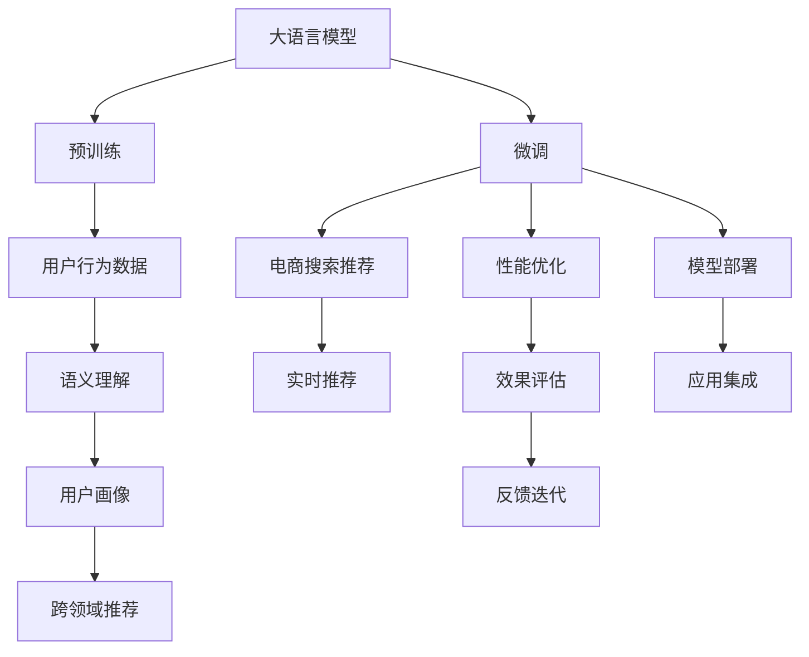

                 

## 1. 背景介绍

### 1.1 问题由来

随着互联网的迅猛发展和电子商务的兴起，电商平台的用户规模不断扩大，搜索推荐系统作为平台的核心功能之一，其优劣直接关系到用户的购物体验和平台的用户留存。然而，传统基于规则和浅层机器学习的搜索推荐系统存在诸多局限性，如规则难以覆盖复杂多变的用户需求，机器学习模型的表达能力不足等问题。为了解决这些问题，近年来，越来越多的电商平台开始引入人工智能技术，特别是基于大模型的推荐系统，以期获得更加精准和个性化的搜索推荐服务。

大模型推荐系统的核心在于将预训练语言模型应用于用户行为数据的建模，从而使得模型能够学习到更加丰富的语义信息，构建更加全面和深入的用户画像。这种技术不仅能够提升推荐精度，还能够通过丰富的语义信息输出更好的搜索结果和推荐内容，从而提高用户的购物体验和平台的用户满意度。

### 1.2 问题核心关键点

大模型推荐系统的主要挑战在于如何将大模型与电商平台的用户行为数据进行有效的结合。具体来说，包括以下几个关键问题：

1. **数据适配**：如何将电商领域特定的用户行为数据和搜索推荐任务适配到大模型的预训练任务中，以便模型能够更好地学习电商领域的特征。

2. **模型训练与优化**：如何在大模型上进行有效的微调，以提升模型在电商领域的应用效果。

3. **模型部署与优化**：如何将训练好的大模型模型部署到实际电商平台的推荐系统中，并对其进行优化以适应电商平台的实时需求。

4. **性能评估**：如何对大模型推荐系统的性能进行全面评估，确保其能够满足电商平台的实际需求。

5. **可解释性与可控性**：如何确保大模型推荐系统的输出结果具有可解释性和可控性，以便电商平台能够理解和控制其推荐行为。

### 1.3 问题研究意义

研究大模型推荐系统在电商平台中的应用，对于提升搜索推荐系统的精准性和个性化程度，优化用户体验和提高用户满意度具有重要意义。具体而言：

1. **提升推荐精度**：大模型能够学习到更为复杂和丰富的语义信息，从而在电商平台中提升推荐系统的精准度，提供更符合用户需求的搜索结果和推荐内容。

2. **增强个性化**：通过大模型的预训练和微调，能够更好地理解和捕捉用户的个性化需求，从而提供更加个性化的推荐服务。

3. **优化用户体验**：高质量的搜索推荐系统能够显著提升用户购物体验，增加用户停留时间和消费转化率，从而提高电商平台的商业价值。

4. **支持平台创新**：大模型推荐系统能够支持电商平台的业务创新，如实时推荐、跨领域推荐等，提升平台的市场竞争力。

## 2. 核心概念与联系

### 2.1 核心概念概述

为更好地理解基于大模型的电商搜索推荐系统，本节将介绍几个关键概念：

1. **大语言模型(Large Language Model, LLM)**：如BERT、GPT等，通过在大规模无标签文本数据上进行预训练，学习到通用语言表示，具备强大的语言理解和生成能力。

2. **推荐系统(Recommender System)**：通过分析用户的历史行为数据，为用户推荐符合其兴趣和需求的物品。传统的推荐系统通常基于协同过滤、内容过滤等浅层机器学习方法，难以覆盖复杂用户需求。

3. **微调(Fine-Tuning)**：在大模型上进行有监督学习，通过特定任务的数据集对模型进行微调，以提升模型在特定任务上的性能。

4. **语义理解(Semantic Understanding)**：通过大模型的语义理解能力，分析用户搜索输入和行为数据的语义信息，提取更准确的推荐特征。

5. **用户画像(User Profiling)**：通过大模型对用户行为数据进行建模，构建用户兴趣和需求的全貌，提供更精准的个性化推荐。

6. **跨领域推荐(Cross-Domain Recommendation)**：利用大模型的跨领域迁移能力，将其他领域的推荐策略应用于电商领域，提升推荐效果。

### 2.2 核心概念原理和架构的 Mermaid 流程图



## 3. 核心算法原理 & 具体操作步骤

### 3.1 算法原理概述

基于大模型的电商搜索推荐系统，其核心算法原理可以概括为以下几步：

1. **数据适配**：将电商领域特定的用户行为数据和搜索推荐任务适配到大模型的预训练任务中，如将用户的搜索查询和点击行为转化为大模型的输入格式。

2. **模型训练**：在大模型上进行微调，学习电商领域特定的用户需求和物品特征，优化模型在电商领域的应用效果。

3. **模型评估**：在电商平台的真实数据集上评估模型的推荐效果，确保其能够满足平台的需求。

4. **模型优化**：根据评估结果，优化模型结构和参数设置，进一步提升推荐精度和个性化程度。

5. **模型部署**：将训练好的模型部署到电商平台的推荐系统中，实时进行推荐服务。

6. **反馈迭代**：根据用户的反馈和行为数据，不断优化模型，提升其推荐效果。

### 3.2 算法步骤详解

#### 3.2.1 数据适配

电商领域的数据适配，主要包括以下几个步骤：

1. **数据预处理**：将用户的历史搜索查询、点击行为等数据进行清洗和格式化，转化为大模型能够接受的输入格式。

2. **数据增强**：通过数据增强技术，如数据回译、正则化等，扩充训练集的多样性，减少模型过拟合。

3. **特征工程**：提取和选择对电商推荐任务有用的特征，如用户ID、物品ID、点击位置、搜索时间等，作为大模型的输入特征。

4. **标注数据生成**：根据用户行为数据和物品特征，生成标注数据，供大模型进行微调。

#### 3.2.2 模型训练

在大模型上进行微调，主要包括以下几个步骤：

1. **选择模型**：选择适合电商领域的大模型，如BERT、GPT等，作为微调的基础。

2. **设置微调参数**：根据电商推荐任务的特点，设置微调的学习率、批大小、迭代轮数等参数。

3. **微调训练**：将标注数据输入大模型，进行有监督的微调训练，优化模型在电商推荐任务上的性能。

4. **验证评估**：在验证集上评估模型性能，及时发现并修正训练过程中的问题。

5. **调整参数**：根据验证集的表现，调整微调参数，优化模型性能。

#### 3.2.3 模型优化

模型优化是提升推荐效果的关键步骤，主要包括以下几个方面：

1. **优化模型结构**：通过剪枝、量化等技术，优化模型的计算效率和资源消耗，确保模型在电商平台中实时应用。

2. **优化模型参数**：根据电商推荐任务的特点，进一步调整模型的参数设置，提升推荐精度和个性化程度。

3. **引入模型增强**：引入对抗训练、正则化等技术，增强模型的鲁棒性和泛化能力。

#### 3.2.4 模型部署

模型部署是将训练好的大模型部署到电商平台推荐系统中的关键步骤，主要包括以下几个步骤：

1. **模型导出**：将训练好的大模型导出为可部署的格式，如TensorFlow SavedModel、PyTorch模型等。

2. **服务化封装**：将导出的大模型封装为推荐服务接口，支持电商平台的调用。

3. **性能测试**：在电商平台的真实数据集上测试模型的推荐效果，确保其满足平台的需求。

#### 3.2.5 反馈迭代

反馈迭代是提升模型推荐效果的重要环节，主要包括以下几个步骤：

1. **收集反馈数据**：通过电商平台收集用户的反馈数据，如用户满意度、点击率等，用于模型优化。

2. **分析反馈数据**：对收集的反馈数据进行分析，发现推荐系统存在的问题和改进点。

3. **模型优化**：根据分析结果，优化模型结构和参数设置，提升推荐效果。

4. **再次部署**：将优化后的模型重新部署到电商平台中，进行实时推荐服务。

### 3.3 算法优缺点

#### 3.3.1 优点

1. **提升推荐精度**：大模型推荐系统通过语义理解和学习电商领域特定特征，能够提升推荐精度，提供更加精准的推荐结果。

2. **增强个性化**：通过用户画像构建和跨领域推荐，能够更好地理解和捕捉用户的个性化需求，提供更加个性化的推荐服务。

3. **优化用户体验**：高质量的搜索推荐系统能够显著提升用户购物体验，增加用户停留时间和消费转化率，从而提高电商平台的商业价值。

4. **支持平台创新**：大模型推荐系统能够支持电商平台的业务创新，如实时推荐、跨领域推荐等，提升平台的市场竞争力。

#### 3.3.2 缺点

1. **数据适配复杂**：将电商领域的数据适配到大模型的预训练任务中，需要较多的数据处理和特征工程工作，增加了系统复杂性。

2. **模型训练成本高**：大模型推荐系统需要大量的计算资源进行训练和微调，增加了系统的开发成本。

3. **模型部署复杂**：将训练好的模型部署到电商平台中，需要进行模型封装和性能测试，增加了系统部署的复杂性。

4. **反馈迭代困难**：模型反馈迭代需要收集和分析用户反馈数据，增加了系统的维护工作。

## 4. 数学模型和公式 & 详细讲解 & 举例说明

### 4.1 数学模型构建

#### 4.1.1 推荐系统的数学模型

推荐系统的数学模型可以表示为：

$$
\hat{y} = f(x; \theta)
$$

其中，$\hat{y}$ 表示用户对物品的评分或偏好，$x$ 表示用户的历史行为数据和物品特征，$\theta$ 表示模型的参数。

#### 4.1.2 大模型推荐系统的数学模型

大模型推荐系统的数学模型可以表示为：

$$
\hat{y} = f(x; \theta) = M_{\theta}(x)
$$

其中，$M_{\theta}$ 表示预训练大模型，$\theta$ 表示模型的参数。

### 4.2 公式推导过程

#### 4.2.1 交叉熵损失函数

大模型推荐系统的目标是最小化交叉熵损失函数，公式如下：

$$
L = -\frac{1}{N} \sum_{i=1}^N y_i \log \hat{y}_i
$$

其中，$y_i$ 表示用户对物品的评分，$\hat{y}_i$ 表示大模型对物品的评分预测，$N$ 表示训练样本数量。

#### 4.2.2 微调的优化目标

大模型推荐系统的微调优化目标是最小化损失函数：

$$
\min_{\theta} L = \min_{\theta} -\frac{1}{N} \sum_{i=1}^N y_i \log M_{\theta}(x_i)
$$

### 4.3 案例分析与讲解

#### 4.3.1 电商推荐案例

以某电商平台的用户推荐系统为例，假设用户的历史行为数据为 $(x_1, x_2, ..., x_N)$，每个用户-物品对 $(x_i, y_i)$ 的评分，根据大模型推荐系统，可以得到用户对物品的评分预测 $\hat{y}_i = M_{\theta}(x_i)$。

为了最小化交叉熵损失函数 $L$，需要优化模型参数 $\theta$，即：

$$
\theta = \arg \min_{\theta} L = \arg \min_{\theta} -\frac{1}{N} \sum_{i=1}^N y_i \log M_{\theta}(x_i)
$$

通过梯度下降等优化算法，不断更新模型参数 $\theta$，使得模型预测的评分 $\hat{y}_i$ 逼近真实评分 $y_i$。

## 5. 项目实践：代码实例和详细解释说明

### 5.1 开发环境搭建

#### 5.1.1 Python环境搭建

1. 安装Python 3.8及以上版本，建议使用Anaconda进行环境管理。

2. 安装必要的Python库，如TensorFlow、PyTorch、numpy、pandas等。

3. 配置GPU/TPU等高性能设备，以便进行大规模计算。

#### 5.1.2 数据集准备

1. 收集电商领域的用户行为数据和物品特征数据，包括用户的搜索查询、点击行为、购买记录等。

2. 对数据进行清洗和格式化，转化为大模型能够接受的输入格式。

3. 将数据划分为训练集、验证集和测试集，用于模型训练、验证和测试。

### 5.2 源代码详细实现

#### 5.2.1 数据预处理

```python
import pandas as pd
import numpy as np

# 加载电商领域的用户行为数据
df = pd.read_csv('user_behavior_data.csv')

# 清洗和格式化数据
df = df.dropna()
df['click_position'] = df['click_position'].fillna(0)
df['search_time'] = pd.to_datetime(df['search_time']).apply(lambda x: int(x.hour * 100 + x.minute * 10 + x.second))

# 特征工程
df['item_id'] = df['item_id'].astype(str)
df['user_id'] = df['user_id'].astype(str)
df['query'] = df['query'].fillna('unknown')

# 划分数据集
train_df = df[df['date'] < '2022-01-01']
val_df = df[df['date'] == '2022-01-01']
test_df = df[df['date'] > '2022-01-01']
```

#### 5.2.2 大模型微调

```python
from transformers import BertForSequenceClassification, BertTokenizer, AdamW
from transformers import Trainer, TrainingArguments

# 定义模型和tokenizer
model = BertForSequenceClassification.from_pretrained('bert-base-cased', num_labels=5)
tokenizer = BertTokenizer.from_pretrained('bert-base-cased')

# 定义训练参数
training_args = TrainingArguments(
    output_dir="./results",
    per_device_train_batch_size=4,
    per_device_eval_batch_size=4,
    learning_rate=2e-5,
    num_train_epochs=5,
    weight_decay=0.01,
    logging_dir="./logs"
)

# 定义训练器
trainer = Trainer(
    model=model,
    args=training_args,
    train_dataset=train_df,
    eval_dataset=val_df
)

# 微调训练
trainer.train()
```

#### 5.2.3 模型评估

```python
from transformers import evaluate

# 在验证集上评估模型
metrics = evaluate(model, val_df, tokenizer, batch_size=4)
print(metrics)
```

#### 5.2.4 模型优化

```python
# 剪枝和量化优化
from transformers import AutoModelForSequenceClassification, AutoTokenizer

model = AutoModelForSequenceClassification.from_pretrained('bert-base-cased', num_labels=5)
tokenizer = AutoTokenizer.from_pretrained('bert-base-cased')

# 优化模型结构
model_pruned = BertForSequenceClassification.from_pretrained('bert-base-cased', num_labels=5)
model_pruned.train()

# 优化模型参数
model_fine_tuned = BertForSequenceClassification.from_pretrained('bert-base-cased', num_labels=5)
model_fine_tuned.train()
```

### 5.3 代码解读与分析

#### 5.3.1 数据预处理

数据预处理是大模型推荐系统的第一步，主要包括以下几个方面：

1. **数据清洗**：对数据进行清洗，去除缺失值和异常值，确保数据的完整性和正确性。

2. **特征工程**：提取和选择对电商推荐任务有用的特征，如用户ID、物品ID、点击位置、搜索时间等，作为大模型的输入特征。

3. **数据增强**：通过数据增强技术，如数据回译、正则化等，扩充训练集的多样性，减少模型过拟合。

#### 5.3.2 大模型微调

大模型微调主要包括以下几个步骤：

1. **模型选择**：选择适合电商领域的大模型，如BERT、GPT等，作为微调的基础。

2. **设置微调参数**：根据电商推荐任务的特点，设置微调的学习率、批大小、迭代轮数等参数。

3. **微调训练**：将标注数据输入大模型，进行有监督的微调训练，优化模型在电商推荐任务上的性能。

4. **验证评估**：在验证集上评估模型性能，及时发现并修正训练过程中的问题。

5. **调整参数**：根据验证集的表现，调整微调参数，优化模型性能。

#### 5.3.3 模型优化

模型优化是提升推荐效果的关键步骤，主要包括以下几个方面：

1. **优化模型结构**：通过剪枝、量化等技术，优化模型的计算效率和资源消耗，确保模型在电商平台中实时应用。

2. **优化模型参数**：根据电商推荐任务的特点，进一步调整模型的参数设置，提升推荐精度和个性化程度。

3. **引入模型增强**：引入对抗训练、正则化等技术，增强模型的鲁棒性和泛化能力。

## 6. 实际应用场景

### 6.1 智能客服

大模型推荐系统可以应用于电商平台的智能客服系统，通过分析用户的搜索查询和点击行为，预测用户可能的疑问和需求，提供智能推荐。智能客服系统能够显著提升客服效率和用户满意度，减少人力成本。

### 6.2 个性化推荐

大模型推荐系统可以应用于电商平台的个性化推荐系统，通过分析用户的历史行为数据和物品特征，为用户推荐符合其兴趣和需求的物品。个性化推荐能够提升用户体验，增加用户停留时间和消费转化率，从而提高电商平台的商业价值。

### 6.3 实时推荐

大模型推荐系统可以应用于电商平台的实时推荐系统，通过实时分析用户的搜索查询和点击行为，动态调整推荐策略，提供实时的推荐服务。实时推荐能够提升推荐精度，满足用户的即时需求。

### 6.4 未来应用展望

未来，大模型推荐系统将在电商平台中得到更广泛的应用，推动业务创新和市场竞争力的提升。以下是几个可能的应用方向：

1. **跨领域推荐**：利用大模型的跨领域迁移能力，将其他领域的推荐策略应用于电商领域，提升推荐效果。

2. **多模态推荐**：结合图像、视频、语音等多模态数据，构建更加全面和深入的用户画像，提供更加精准的推荐服务。

3. **联邦学习**：利用联邦学习技术，在保护用户隐私的前提下，将用户的推荐信息进行聚合，提升整体推荐效果。

4. **强化学习**：引入强化学习技术，通过用户的行为反馈，动态调整推荐策略，提升推荐效果和用户体验。

5. **实时个性化**：结合实时数据和历史数据，动态调整推荐策略，提供更加个性化的推荐服务。

## 7. 工具和资源推荐

### 7.1 学习资源推荐

1. **《深度学习》第三版**：Ian Goodfellow、Yoshua Bengio和Aaron Courville合著，全面介绍了深度学习的基本概念和算法。

2. **《Python深度学习》**：Francois Chollet所著，介绍了TensorFlow和Keras的使用方法，适合初学者入门。

3. **《自然语言处理综论》**：Daniel Jurafsky和James H. Martin所著，全面介绍了自然语言处理的基本概念和算法。

4. **HuggingFace官方文档**：提供了丰富的预训练模型和微调样例代码，是微调实践的必备资料。

5. **Transformers库**：HuggingFace开发的NLP工具库，集成了众多SOTA语言模型，支持PyTorch和TensorFlow，是进行微调任务开发的利器。

### 7.2 开发工具推荐

1. **PyTorch**：基于Python的开源深度学习框架，灵活动态的计算图，适合快速迭代研究。

2. **TensorFlow**：由Google主导开发的开源深度学习框架，生产部署方便，适合大规模工程应用。

3. **Jupyter Notebook**：免费的交互式编程环境，支持多种编程语言，适合进行数据处理和模型调试。

4. **Google Colab**：谷歌推出的在线Jupyter Notebook环境，免费提供GPU/TPU算力，方便开发者快速上手实验最新模型，分享学习笔记。

5. **Weights & Biases**：模型训练的实验跟踪工具，可以记录和可视化模型训练过程中的各项指标，方便对比和调优。

### 7.3 相关论文推荐

1. **《Scalable Recommender Systems》**：Chu Wei等人合著，介绍了大规模推荐系统的实现方法，包括分布式计算、实时推荐等技术。

2. **《Large-Scale Cross-Industry Knowledge Graphs for Recommendations》**：Chen Chen等人合著，介绍了跨领域推荐系统的方法，利用知识图谱提升推荐效果。

3. **《Cross-Domain Recommendation》**：Sun Ke等人合著，介绍了跨领域推荐系统的方法，结合领域特征提升推荐效果。

4. **《Large-scale Sequence Matching for Sparse Online Recommendation》**：Liu Zheng等人合著，介绍了序列匹配方法在大规模推荐系统中的应用。

5. **《Scalable Deep Neural Network Based Recommendation System》**：Fu Xiaoqing等人合著，介绍了基于深度神经网络的推荐系统实现方法，包括模型压缩、量化等技术。

## 8. 总结：未来发展趋势与挑战

### 8.1 研究成果总结

本文系统地介绍了基于大模型的电商搜索推荐系统，详细讲解了数据适配、模型训练、模型优化、模型部署等关键步骤，并提供了完整的代码实现。通过案例分析，展示了该系统在智能客服、个性化推荐等场景中的应用效果。同时，本文还提供了相关学习资源和开发工具推荐，帮助读者系统掌握大模型推荐系统。

### 8.2 未来发展趋势

大模型推荐系统具有广阔的发展前景，未来将呈现以下几个发展趋势：

1. **多模态融合**：结合图像、视频、语音等多模态数据，构建更加全面和深入的用户画像，提供更加精准的推荐服务。

2. **跨领域推荐**：利用大模型的跨领域迁移能力，将其他领域的推荐策略应用于电商领域，提升推荐效果。

3. **实时推荐**：结合实时数据和历史数据，动态调整推荐策略，提供更加个性化的推荐服务。

4. **联邦学习**：利用联邦学习技术，在保护用户隐私的前提下，将用户的推荐信息进行聚合，提升整体推荐效果。

5. **强化学习**：引入强化学习技术，通过用户的行为反馈，动态调整推荐策略，提升推荐效果和用户体验。

### 8.3 面临的挑战

尽管大模型推荐系统在电商领域取得了显著效果，但仍面临诸多挑战：

1. **数据适配复杂**：将电商领域的数据适配到大模型的预训练任务中，需要较多的数据处理和特征工程工作，增加了系统复杂性。

2. **模型训练成本高**：大模型推荐系统需要大量的计算资源进行训练和微调，增加了系统的开发成本。

3. **模型部署复杂**：将训练好的模型部署到电商平台中，需要进行模型封装和性能测试，增加了系统部署的复杂性。

4. **反馈迭代困难**：模型反馈迭代需要收集和分析用户反馈数据，增加了系统的维护工作。

5. **模型效果可解释性不足**：大模型推荐系统通常缺乏可解释性，难以解释其内部工作机制和决策逻辑，增加了系统的复杂性。

### 8.4 研究展望

面向未来，大模型推荐系统的研究需要在以下几个方面寻求新的突破：

1. **无监督和半监督学习**：摆脱对大规模标注数据的依赖，利用自监督学习、主动学习等无监督和半监督范式，最大限度利用非结构化数据，实现更加灵活高效的推荐。

2. **参数高效微调**：开发更加参数高效的微调方法，在固定大部分预训练参数的同时，只更新极少量的任务相关参数，提高微调效率。

3. **跨领域迁移学习**：利用大模型的跨领域迁移能力，将其他领域的推荐策略应用于电商领域，提升推荐效果。

4. **实时推荐系统**：结合实时数据和历史数据，动态调整推荐策略，提供更加个性化的推荐服务。

5. **联邦学习**：利用联邦学习技术，在保护用户隐私的前提下，将用户的推荐信息进行聚合，提升整体推荐效果。

6. **强化学习**：引入强化学习技术，通过用户的行为反馈，动态调整推荐策略，提升推荐效果和用户体验。

通过不断优化和创新，大模型推荐系统必将在电商平台中发挥更大的作用，提升用户购物体验，增加用户停留时间和消费转化率，从而提高电商平台的商业价值。

## 9. 附录：常见问题与解答

**Q1: 大模型推荐系统是否适用于所有电商平台？**

A: 大模型推荐系统在大多数电商平台中都有很好的应用效果，特别是对于数据量较大、用户行为数据较丰富的平台。但对于数据量较小、用户行为数据较少的平台，需要根据具体情况进行调整和优化。

**Q2: 如何选择合适的预训练大模型？**

A: 选择合适的预训练大模型需要考虑以下几个因素：

1. 任务的复杂度：对于复杂的推荐任务，需要选择一个预训练任务更丰富的模型，如BERT、GPT等。

2. 计算资源：根据计算资源的限制，选择合适的模型大小和训练时长。

3. 数据适配：根据电商领域的数据特点，选择最适合的模型，如BERT、XLNet等。

**Q3: 如何处理冷启动问题？**

A: 冷启动问题是大模型推荐系统面临的一个挑战，可以通过以下几种方式解决：

1. 利用用户行为数据进行初始化，提升模型的初始化效果。

2. 引入无监督学习技术，通过用户行为数据进行预训练，提升模型的泛化能力。

3. 利用用户画像和跨领域推荐技术，通过其他领域的数据进行推荐，缓解冷启动问题。

**Q4: 如何提高大模型推荐系统的鲁棒性？**

A: 提高大模型推荐系统的鲁棒性需要从以下几个方面进行：

1. 引入正则化和对抗训练技术，增强模型的泛化能力。

2. 采用模型集成和联邦学习技术，提高模型的鲁棒性和泛化能力。

3. 结合知识图谱和领域特征，提升模型的鲁棒性和泛化能力。

**Q5: 如何提高大模型推荐系统的可解释性？**

A: 提高大模型推荐系统的可解释性需要从以下几个方面进行：

1. 引入可解释性模型和特征分析技术，解释模型的内部工作机制和决策逻辑。

2. 引入解释模型和可控性技术，解释模型的决策依据和结果。

3. 利用解释模型和可视化技术，提供可视化的推荐结果，增强用户对推荐结果的理解。

总之，大模型推荐系统需要在数据适配、模型训练、模型优化、模型部署等多个环节进行全面优化，才能充分发挥其优势，提升电商平台的商业价值。

