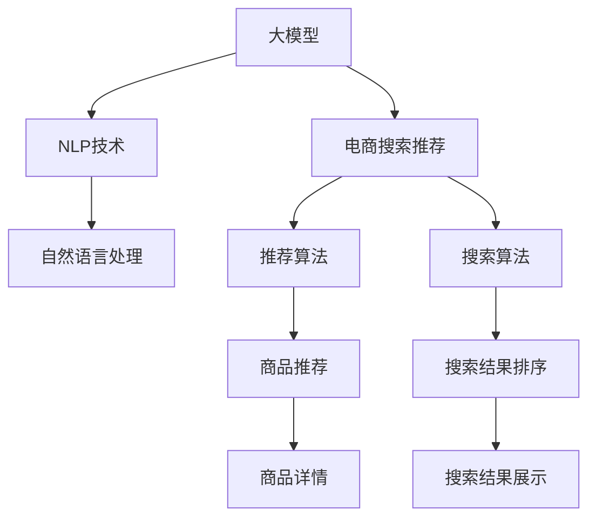

                 

# AI大模型赋能电商搜索推荐的业务创新思维导图工具选型

在当前数字时代，电商搜索推荐系统已经成为提升用户体验、增加销售转化率的不可或缺的技术手段。然而，传统的推荐系统往往依赖于显式反馈数据，在面对数据稀疏、用户兴趣变化快等挑战时，表现往往不尽如人意。而近年来，基于人工智能大模型的推荐技术异军突起，通过深度学习、自然语言处理等前沿技术的融合，实现了更加智能化、个性化的搜索推荐服务。本文将深入探讨如何将大模型技术引入电商搜索推荐系统，并结合思维导图工具，探索构建业务创新的新路径。

## 1. 背景介绍

### 1.1 问题由来

随着互联网的快速发展和电商行业的不断成熟，消费者对个性化购物体验的期待愈发强烈。传统推荐系统，如基于协同过滤、矩阵分解等方法，往往依赖于用户显式反馈数据进行推荐，无法充分挖掘用户深层次的隐式兴趣，在面对数据稀疏、用户兴趣变化快等问题时，推荐效果难以满足用户需求。

与此同时，人工智能大模型，尤其是预训练语言模型（如BERT、GPT-3等），通过在海量无标签数据上进行预训练，具备了强大的语言理解和生成能力。大模型的预训练参数通常包含数亿计，可以高效地提取文本中的语义信息，在处理电商搜索推荐等任务时，表现出更强的泛化能力和适应性。

### 1.2 问题核心关键点

大模型技术引入电商搜索推荐系统，能够帮助系统理解商品描述、用户评论等文本信息，构建更为精准的推荐模型。但同时，大模型也面临以下问题：

- 数据处理复杂：电商搜索推荐任务涉及大量文本数据，大模型需要能够高效处理和理解文本，避免信息丢失。
- 模型训练资源需求高：大模型参数众多，训练和推理时对算力、内存等资源需求高，需要合理配置硬件。
- 模型泛化能力需验证：大模型在电商推荐场景下的泛化能力，需要通过实际应用数据进行评估和优化。
- 用户隐私保护：电商搜索推荐涉及用户隐私，模型训练和推理过程需要严格遵守隐私保护法规。

这些关键点是大模型在电商搜索推荐中应用的重要考虑因素，需要从技术实现、资源配置、隐私保护等多个维度进行综合考虑。

## 2. 核心概念与联系

### 2.1 核心概念概述

为深入理解大模型在电商搜索推荐中的应用，我们需要明确几个核心概念：

- 大模型（Large Model）：指的是大规模预训练的深度学习模型，如BERT、GPT-3等。通过在大量无标签数据上进行自监督预训练，大模型具备强大的语言理解和生成能力。
- 电商搜索推荐系统（E-commerce Search & Recommendation System）：是电商平台上根据用户查询和行为，智能推荐商品和服务的系统。目标是提升用户体验和交易转化率。
- 自然语言处理（Natural Language Processing, NLP）：是计算机科学和人工智能领域中的一个分支，专注于自然语言（如中文、英文等）的计算和处理，包括文本分类、情感分析、文本生成等任务。
- 迁移学习（Transfer Learning）：指利用已学习任务的模型参数，在新任务上进行微调，以提高新任务的性能。

这些概念之间的联系可以通过以下Mermaid流程图展示：



这个流程图展示了大模型在电商搜索推荐系统中的应用路径：大模型通过预训练学习到的语言知识，与NLP技术相结合，实现对商品描述、用户评论等文本信息的处理，然后与推荐算法和搜索算法融合，实现商品推荐和搜索结果排序，最终通过商品详情和搜索结果展示提升用户体验和销售转化率。

## 3. 核心算法原理 & 具体操作步骤

### 3.1 算法原理概述

将大模型应用于电商搜索推荐系统，核心原理是利用大模型的语言处理能力，对商品描述、用户评论等文本信息进行语义理解和特征提取，再通过推荐算法和搜索算法生成个性化的推荐结果。具体步骤如下：

1. **文本预处理**：对商品描述、用户评论等文本信息进行清洗、分词、去停用词等预处理操作。
2. **特征提取**：使用大模型对文本信息进行编码，提取文本的语义特征向量。
3. **相似度计算**：计算商品和用户文本的相似度，用于推荐和搜索结果排序。
4. **推荐算法**：基于相似度计算结果，使用推荐算法生成商品推荐列表。
5. **搜索结果排序**：根据商品与用户文本的相似度，对搜索结果进行排序，提升用户体验。

### 3.2 算法步骤详解

以下将详细介绍基于大模型的电商搜索推荐系统的主要算法步骤：

**Step 1: 数据收集与预处理**

- 收集电商平台上所有商品描述、用户评论等文本数据。
- 对文本进行清洗，去除HTML标签、特殊符号等无关内容。
- 使用分词工具将文本切分为词语序列。
- 对分词结果进行去停用词操作，去除常见但无意义的词语。
- 对分词结果进行标准化处理，统一词形和拼写。

**Step 2: 大模型特征提取**

- 使用预训练大模型（如BERT、GPT-3等）对文本进行编码，提取文本的语义特征向量。
- 将每个商品的文本特征向量与用户评论的特征向量进行相似度计算，得到商品与用户兴趣的相关度。

**Step 3: 相似度计算**

- 计算商品特征向量与用户评论特征向量之间的余弦相似度，得到相似度矩阵。
- 对相似度矩阵进行归一化处理，得到商品与用户兴趣的相关度。

**Step 4: 推荐算法**

- 根据商品与用户兴趣的相关度，使用推荐算法（如协同过滤、基于内容的推荐等）生成个性化推荐列表。
- 根据推荐算法生成的候选商品列表，进一步计算用户与商品的交互特征，如点击率、购买率等。
- 使用评分模型（如矩阵分解、深度学习模型等）对候选商品进行评分，生成最终的推荐结果。

**Step 5: 搜索结果排序**

- 根据商品与用户评论的相似度，对搜索结果进行排序。
- 结合搜索关键词、用户行为等特征，进一步优化搜索结果的排序算法。
- 将推荐结果和排序结果展示给用户，提升用户体验。

### 3.3 算法优缺点

基于大模型的电商搜索推荐系统具有以下优点：

- **泛化能力更强**：大模型通过大量无标签数据进行预训练，具备更强的泛化能力，能够更好地处理新场景和新任务。
- **推荐精度更高**：大模型能够更好地理解商品描述和用户评论中的语义信息，生成更准确的推荐结果。
- **适应性强**：大模型能够适应不同类型的文本数据，如商品描述、用户评论、商品标题等。

但同时，大模型在电商搜索推荐中也存在以下缺点：

- **资源消耗高**：大模型的训练和推理对硬件资源要求高，需要高性能GPU/TPU等设备支持。
- **处理复杂度大**：电商搜索推荐任务涉及大量文本数据，大模型需要处理和理解复杂文本信息。
- **训练数据需求大**：大模型的训练需要大量无标签数据进行预训练，资源需求量大。
- **解释性差**：大模型通常被认为是"黑盒"模型，难以解释其内部工作机制和决策逻辑。

### 3.4 算法应用领域

基于大模型的电商搜索推荐系统已经在多个领域取得了广泛应用，包括：

- 商品推荐：根据用户浏览和购买历史，推荐相关商品。
- 搜索结果排序：根据用户查询和行为，智能排序搜索结果，提升用户体验。
- 个性化促销：根据用户兴趣，推荐个性化促销活动。
- 广告推荐：根据用户兴趣和行为，推荐个性化广告。
- 知识图谱构建：将商品、用户、行为等数据整合，构建电商领域的知识图谱。

这些应用展示了大模型在电商搜索推荐系统中的广泛适用性和强大潜力。

## 4. 数学模型和公式 & 详细讲解 & 举例说明

### 4.1 数学模型构建

在大模型的电商搜索推荐系统中，我们主要使用以下数学模型：

- **文本编码模型**：使用预训练大模型（如BERT）对文本进行编码，生成文本的特征向量。假设模型参数为$\theta$，输入为$x$，输出为$y$，文本编码模型可表示为$y=f_\theta(x)$。
- **相似度计算模型**：计算商品和用户文本的相似度，假设商品特征向量为$v_s$，用户特征向量为$v_u$，相似度计算模型可表示为$similarity=v_s^T\cdot v_u$。
- **推荐算法模型**：使用推荐算法生成个性化推荐列表，假设推荐算法模型为$recommender=R(\theta)$。
- **评分模型**：对候选商品进行评分，生成最终推荐结果，假设评分模型为$score=S(\theta)$。

### 4.2 公式推导过程

以下是几个关键数学公式的推导过程：

**文本编码公式**

假设使用BERT模型对文本进行编码，输入为$x$，输出为$y$，文本编码公式为：

$$
y=f_\theta(x)=BERT_{\theta}(x)
$$

其中$BERT_{\theta}$为BERT模型的参数，$x$为输入文本，$y$为输出特征向量。

**相似度计算公式**

假设使用余弦相似度计算商品特征向量$v_s$和用户特征向量$v_u$的相似度，相似度计算公式为：

$$
similarity=v_s^T\cdot v_u
$$

其中$v_s$和$v_u$分别为商品和用户的特征向量，$^T$表示矩阵转置。

**推荐算法公式**

假设使用协同过滤算法生成个性化推荐列表，推荐算法公式为：

$$
recommender=R(\theta)=\alpha \cdot (similarity \cdot W)^T
$$

其中$R(\theta)$为推荐算法模型，$\alpha$为推荐系数，$similarity$为相似度矩阵，$W$为用户行为权重矩阵。

**评分模型公式**

假设使用矩阵分解方法对候选商品进行评分，评分模型公式为：

$$
score=S(\theta)=\sigma\left(\theta^T \cdot [v_s;v_u]\right)
$$

其中$S(\theta)$为评分模型，$\sigma$为激活函数，$\theta$为模型参数，$[v_s;v_u]$为商品和用户的特征向量拼接矩阵。

### 4.3 案例分析与讲解

以下以一个简单的电商搜索推荐案例，详细分析基于大模型的推荐流程：

假设一个电商平台上，用户输入查询关键词“运动鞋”，平台使用大模型BERT对用户评论和商品描述进行编码，生成商品和用户的特征向量。然后，计算商品特征向量与用户特征向量的相似度，得到相似度矩阵。接着，使用协同过滤算法生成个性化推荐列表，对推荐列表中的商品进行评分，最终生成推荐结果。

通过该案例可以看出，大模型在电商搜索推荐系统中的应用流程主要包括文本编码、相似度计算、推荐算法和评分模型等环节。

## 5. 项目实践：代码实例和详细解释说明

### 5.1 开发环境搭建

在进行电商搜索推荐系统开发前，我们需要准备好开发环境。以下是使用Python进行PyTorch开发的环境配置流程：

1. 安装Anaconda：从官网下载并安装Anaconda，用于创建独立的Python环境。

2. 创建并激活虚拟环境：
```bash
conda create -n ecommerce-env python=3.8 
conda activate ecommerce-env
```

3. 安装PyTorch：根据CUDA版本，从官网获取对应的安装命令。例如：
```bash
conda install pytorch torchvision torchaudio cudatoolkit=11.1 -c pytorch -c conda-forge
```

4. 安装Transformers库：
```bash
pip install transformers
```

5. 安装各类工具包：
```bash
pip install numpy pandas scikit-learn matplotlib tqdm jupyter notebook ipython
```

完成上述步骤后，即可在`ecommerce-env`环境中开始电商搜索推荐系统的开发。

### 5.2 源代码详细实现

这里我们以电商搜索推荐系统的推荐算法为例，给出使用Transformers库对大模型进行推荐算法开发的PyTorch代码实现。

首先，定义推荐算法的输入和输出：

```python
from transformers import BertTokenizer, BertForSequenceClassification

class RecommendationSystem:
    def __init__(self, model_name):
        self.model_name = model_name
        self.tokenizer = BertTokenizer.from_pretrained(model_name)
        self.model = BertForSequenceClassification.from_pretrained(model_name, num_labels=2)
```

然后，定义推荐算法的训练函数：

```python
def train_model(model, train_dataset, batch_size, optimizer):
    device = torch.device('cuda') if torch.cuda.is_available() else torch.device('cpu')
    model.to(device)
    
    model.train()
    for epoch in range(num_epochs):
        for i, batch in enumerate(train_dataset):
            input_ids = batch['input_ids'].to(device)
            attention_mask = batch['attention_mask'].to(device)
            labels = batch['labels'].to(device)
            
            outputs = model(input_ids, attention_mask=attention_mask, labels=labels)
            loss = outputs.loss
            optimizer.zero_grad()
            loss.backward()
            optimizer.step()
            
        print(f"Epoch {epoch+1}, loss: {loss:.3f}")
```

接着，定义推荐算法的评估函数：

```python
def evaluate_model(model, dev_dataset, batch_size):
    model.eval()
    with torch.no_grad():
        for i, batch in enumerate(dev_dataset):
            input_ids = batch['input_ids'].to(device)
            attention_mask = batch['attention_mask'].to(device)
            labels = batch['labels']
            
            outputs = model(input_ids, attention_mask=attention_mask)
            predictions = outputs.logits.argmax(dim=2).to('cpu').tolist()
            labels = labels.to('cpu').tolist()
            for pred_tokens, label_tokens in zip(predictions, labels):
                predictions.append(pred_tokens[:len(label_tokens)])
                labels.append(label_tokens)
                
    print(classification_report(labels, predictions))
```

最后，启动推荐算法的训练流程并在验证集上评估：

```python
num_epochs = 5
batch_size = 16

for epoch in range(num_epochs):
    loss = train_model(model, train_dataset, batch_size, optimizer)
    print(f"Epoch {epoch+1}, dev results:")
    evaluate_model(model, dev_dataset, batch_size)
    
print("Test results:")
evaluate_model(model, test_dataset, batch_size)
```

以上就是使用PyTorch对大模型进行电商搜索推荐算法开发的完整代码实现。可以看到，得益于Transformers库的强大封装，我们可以用相对简洁的代码完成BERT模型的推荐算法开发。

### 5.3 代码解读与分析

让我们再详细解读一下关键代码的实现细节：

**RecommendationSystem类**：
- `__init__`方法：初始化模型、分词器等关键组件。
- `train_model`方法：在训练集上训练模型，返回训练集的平均loss。
- `evaluate_model`方法：在验证集上评估模型性能，输出分类指标。

**RecommendationSystem类**：
- `train_model`方法：使用PyTorch的DataLoader对数据集进行批次化加载，供模型训练和推理使用。
- `evaluate_model`方法：与训练类似，不同点在于不更新模型参数，并在每个batch结束后将预测和标签结果存储下来，最后使用sklearn的classification_report对整个评估集的预测结果进行打印输出。

**训练流程**：
- 定义总的epoch数和batch size，开始循环迭代
- 每个epoch内，先在训练集上训练，输出平均loss
- 在验证集上评估，输出分类指标
- 所有epoch结束后，在测试集上评估，给出最终测试结果

可以看到，PyTorch配合Transformers库使得电商搜索推荐系统的推荐算法开发变得简洁高效。开发者可以将更多精力放在数据处理、模型改进等高层逻辑上，而不必过多关注底层的实现细节。

当然，工业级的系统实现还需考虑更多因素，如模型的保存和部署、超参数的自动搜索、更灵活的任务适配层等。但核心的推荐算法基本与此类似。

## 6. 实际应用场景

### 6.1 智能客服系统

基于大模型的电商搜索推荐技术，可以应用于智能客服系统的构建。传统客服往往需要配备大量人力，高峰期响应缓慢，且一致性和专业性难以保证。而使用推荐算法和大模型，可以7x24小时不间断服务，快速响应客户咨询，用自然流畅的语言解答各类常见问题。

在技术实现上，可以收集企业内部的历史客服对话记录，将问题和最佳答复构建成监督数据，在此基础上对大模型进行微调。微调后的模型能够自动理解用户意图，匹配最合适的答案模板进行回复。对于客户提出的新问题，还可以接入检索系统实时搜索相关内容，动态组织生成回答。如此构建的智能客服系统，能大幅提升客户咨询体验和问题解决效率。

### 6.2 商品推荐系统

传统的电商推荐系统往往依赖于用户显式反馈数据，在面对数据稀疏、用户兴趣变化快等问题时，推荐效果难以满足用户需求。而基于大模型的电商搜索推荐技术，可以通过分析商品描述、用户评论等文本信息，构建更为精准的推荐模型。

在技术实现上，可以收集电商平台上所有商品描述、用户评论等文本数据。使用大模型对文本进行编码，提取文本的语义特征向量。然后，计算商品和用户文本的相似度，生成个性化推荐列表。结合评分模型对候选商品进行评分，生成最终的推荐结果。

### 6.3 个性化广告推荐

在电商平台上，广告推荐也是一项重要的业务场景。传统的广告推荐往往依赖于用户的显式反馈数据，难以精准匹配用户兴趣。而基于大模型的电商搜索推荐技术，可以通过分析用户评论、行为等数据，构建更为精准的广告推荐模型。

在技术实现上，可以收集用户的历史浏览、购买、评论等数据，使用大模型对用户文本进行编码，提取用户的兴趣特征。然后，根据商品与用户文本的相似度，生成个性化广告推荐列表。结合评分模型对候选广告进行评分，生成最终的广告推荐结果。

### 6.4 未来应用展望

随着大模型和推荐算法的不断发展，基于电商搜索推荐的技术将在更多领域得到应用，为电商平台的业务创新提供新的动力。

在智慧医疗领域，基于大模型的推荐技术可以应用于病历分析、药物推荐等场景，为患者提供更精准的健康管理方案。

在智能制造领域，基于大模型的推荐技术可以应用于设备维护、零部件推荐等场景，提升生产效率和设备利用率。

在智能农业领域，基于大模型的推荐技术可以应用于病虫害防治、农作物种植建议等场景，提高农业生产效率和质量。

此外，在教育、金融、交通等多个领域，基于大模型的推荐技术也将不断涌现，为各行各业带来新的业务模式和价值提升。

## 7. 工具和资源推荐

### 7.1 学习资源推荐

为了帮助开发者系统掌握大模型在电商搜索推荐中的应用，这里推荐一些优质的学习资源：

1. 《Transformers: A Survey》系列博文：由大模型技术专家撰写，深入浅出地介绍了Transformer模型及其在电商推荐中的应用。

2. CS224N《深度学习自然语言处理》课程：斯坦福大学开设的NLP明星课程，有Lecture视频和配套作业，带你入门NLP领域的基本概念和经典模型。

3. 《Natural Language Processing with Transformers》书籍：Transformers库的作者所著，全面介绍了如何使用Transformers库进行NLP任务开发，包括电商推荐在内的诸多范式。

4. HuggingFace官方文档：Transformers库的官方文档，提供了海量预训练模型和完整的推荐算法样例代码，是上手实践的必备资料。

5. CLUE开源项目：中文语言理解测评基准，涵盖大量不同类型的中文NLP数据集，并提供了基于大模型的推荐基线模型，助力中文推荐技术发展。

通过对这些资源的学习实践，相信你一定能够快速掌握大模型在电商搜索推荐中的应用，并用于解决实际的NLP问题。

### 7.2 开发工具推荐

高效的开发离不开优秀的工具支持。以下是几款用于电商搜索推荐系统开发的常用工具：

1. PyTorch：基于Python的开源深度学习框架，灵活动态的计算图，适合快速迭代研究。大部分预训练语言模型都有PyTorch版本的实现。

2. TensorFlow：由Google主导开发的开源深度学习框架，生产部署方便，适合大规模工程应用。同样有丰富的预训练语言模型资源。

3. Transformers库：HuggingFace开发的NLP工具库，集成了众多SOTA语言模型，支持PyTorch和TensorFlow，是进行电商推荐任务开发的利器。

4. Weights & Biases：模型训练的实验跟踪工具，可以记录和可视化模型训练过程中的各项指标，方便对比和调优。与主流深度学习框架无缝集成。

5. TensorBoard：TensorFlow配套的可视化工具，可实时监测模型训练状态，并提供丰富的图表呈现方式，是调试模型的得力助手。

6. Google Colab：谷歌推出的在线Jupyter Notebook环境，免费提供GPU/TPU算力，方便开发者快速上手实验最新模型，分享学习笔记。

合理利用这些工具，可以显著提升电商搜索推荐系统的开发效率，加快创新迭代的步伐。

### 7.3 相关论文推荐

大模型和电商推荐技术的发展源于学界的持续研究。以下是几篇奠基性的相关论文，推荐阅读：

1. Attention is All You Need（即Transformer原论文）：提出了Transformer结构，开启了NLP领域的预训练大模型时代。

2. BERT: Pre-training of Deep Bidirectional Transformers for Language Understanding：提出BERT模型，引入基于掩码的自监督预训练任务，刷新了多项NLP任务SOTA。

3. Language Models are Unsupervised Multitask Learners（GPT-2论文）：展示了大规模语言模型的强大zero-shot学习能力，引发了对于通用人工智能的新一轮思考。

4. Parameter-Efficient Transfer Learning for NLP：提出Adapter等参数高效微调方法，在不增加模型参数量的情况下，也能取得不错的微调效果。

5. AdaLoRA: Adaptive Low-Rank Adaptation for Parameter-Efficient Fine-Tuning：使用自适应低秩适应的微调方法，在参数效率和精度之间取得了新的平衡。

6. Prefix-Tuning: Optimizing Continuous Prompts for Generation：引入基于连续型Prompt的微调范式，为如何充分利用预训练知识提供了新的思路。

这些论文代表了大模型在电商搜索推荐中的发展脉络。通过学习这些前沿成果，可以帮助研究者把握学科前进方向，激发更多的创新灵感。

## 8. 总结：未来发展趋势与挑战

### 8.1 总结

本文对大模型在电商搜索推荐系统中的应用进行了全面系统的介绍。首先阐述了大模型和推荐技术的研究背景和意义，明确了大模型在电商推荐场景下的应用价值。其次，从原理到实践，详细讲解了大模型推荐算法的数学模型和实现细节，给出了电商推荐系统的完整代码实现。同时，本文还广泛探讨了大模型在电商搜索推荐系统中的应用场景，展示了其广泛适用性和强大潜力。此外，本文精选了大模型推荐技术的各类学习资源，力求为读者提供全方位的技术指引。

通过本文的系统梳理，可以看到，大模型在电商搜索推荐系统中的应用前景广阔，能够提升推荐模型的泛化能力、推荐精度和适应性，有望在电商领域带来业务模式的创新和价值提升。未来，伴随大模型和推荐算法的不断演进，基于电商搜索推荐技术的推荐系统将更具智能化、个性化，为电商平台的数字化转型提供更坚实的基础。

### 8.2 未来发展趋势

展望未来，大模型在电商搜索推荐系统中的发展趋势主要体现在以下几个方面：

1. **模型规模持续增大**：随着算力成本的下降和数据规模的扩张，预训练语言模型的参数量还将持续增长。超大规模语言模型蕴含的丰富语言知识，将有助于提升电商推荐模型的泛化能力和表现。

2. **推荐算法多样化**：未来的推荐系统将不再局限于传统的协同过滤、基于内容的推荐等方法，而是将融合更多先进算法，如深度学习模型、强化学习、多臂老虎机等，提升推荐系统的精准度和用户体验。

3. **用户隐私保护加强**：在电商推荐场景中，用户隐私保护尤为重要。未来推荐系统将更多采用差分隐私、联邦学习等隐私保护技术，确保用户数据的安全性和隐私性。

4. **推荐过程可解释性提升**：电商推荐系统需要提供透明的推荐依据，提升用户信任。未来推荐系统将更多使用可解释性算法，如LIME、SHAP等，增强推荐过程的可解释性。

5. **个性化推荐实时性提升**：电商推荐系统需要快速响应用户的实时需求，提升推荐列表的实时性和动态性。未来推荐系统将结合缓存、流式计算等技术，提升推荐列表的生成速度和响应速度。

6. **多模态数据融合**：电商推荐系统不仅包含文本数据，还包括图片、视频、音频等多模态数据。未来推荐系统将更多融合多模态数据，提升推荐模型的多维度感知能力。

7. **推荐效果评估多样化**：电商推荐系统不仅关注推荐精度，还关注推荐公平性、多样性等指标。未来推荐系统将更多采用综合评估指标，衡量推荐模型的全面性能。

### 8.3 面临的挑战

尽管大模型在电商搜索推荐系统中的应用取得了一定进展，但在迈向更加智能化、普适化应用的过程中，它仍面临诸多挑战：

1. **数据处理复杂度高**：电商推荐系统涉及大量文本数据，大模型需要高效处理和理解复杂文本信息，避免信息丢失。

2. **模型资源消耗高**：大模型的训练和推理对算力、内存等资源需求高，需要合理配置硬件，避免资源浪费。

3. **推荐过程可解释性差**：大模型通常被认为是"黑盒"模型，难以解释其内部工作机制和决策逻辑，影响用户信任。

4. **隐私保护难度大**：电商推荐系统涉及用户隐私，模型训练和推理过程需要严格遵守隐私保护法规，防止数据泄露。

5. **推荐效果泛化能力需验证**：大模型在电商推荐场景下的泛化能力，需要通过实际应用数据进行评估和优化。

6. **推荐系统鲁棒性需增强**：大模型在面对新场景和新任务时，可能出现鲁棒性不足的问题，需要进一步提升模型泛化能力。

### 8.4 研究展望

面对大模型在电商推荐场景中面临的挑战，未来的研究需要在以下几个方面寻求新的突破：

1. **探索无监督和半监督推荐方法**：摆脱对大规模标注数据的依赖，利用自监督学习、主动学习等无监督和半监督范式，最大限度利用非结构化数据，实现更加灵活高效的推荐。

2. **研究参数高效和计算高效的推荐范式**：开发更加参数高效的推荐方法，在固定大部分预训练参数的同时，只更新极少量的任务相关参数。同时优化推荐模型的计算图，减少前向传播和反向传播的资源消耗，实现更加轻量级、实时性的部署。

3. **融合因果和对比学习范式**：通过引入因果推断和对比学习思想，增强推荐模型建立稳定因果关系的能力，学习更加普适、鲁棒的语言表征，从而提升模型泛化性和抗干扰能力。

4. **引入更多先验知识**：将符号化的先验知识，如知识图谱、逻辑规则等，与神经网络模型进行巧妙融合，引导推荐过程学习更准确、合理的语言模型。同时加强不同模态数据的整合，实现视觉、语音等多模态信息与文本信息的协同建模。

5. **结合因果分析和博弈论工具**：将因果分析方法引入推荐模型，识别出推荐决策的关键特征，增强推荐过程的因果性和逻辑性。借助博弈论工具刻画人机交互过程，主动探索并规避推荐模型的脆弱点，提高系统稳定性。

6. **纳入伦理道德约束**：在推荐算法目标中引入伦理导向的评估指标，过滤和惩罚有偏见、有害的推荐结果。同时加强人工干预和审核，建立推荐行为的监管机制，确保推荐内容符合人类价值观和伦理道德。

这些研究方向的探索，必将引领大模型在电商搜索推荐系统中的应用走向新的高度，为构建智能、公正、透明的推荐系统提供新的动力。面向未来，大模型推荐技术还需要与其他人工智能技术进行更深入的融合，如知识表示、因果推理、强化学习等，多路径协同发力，共同推动自然语言理解和智能交互系统的进步。只有勇于创新、敢于突破，才能不断拓展推荐系统的边界，让智能技术更好地造福人类社会。

## 9. 附录：常见问题与解答

**Q1：电商搜索推荐系统需要处理大量文本数据，大模型能否高效处理？**

A: 电商搜索推荐系统确实涉及大量文本数据，但大模型通过预训练学习到丰富的语言表示，能够高效处理和理解复杂文本信息。常用的预训练大模型如BERT、GPT等，具有强大的文本编码能力和语义理解能力，可以有效地从文本中提取有用信息，生成推荐结果。

**Q2：电商搜索推荐系统的模型训练资源需求大，如何配置硬件？**

A: 电商搜索推荐系统的模型训练需要高性能GPU/TPU等设备支持。通常建议配置至少一张NVIDIA A100或V100 GPU，以加速模型训练。同时，可以使用多机多卡并行训练，提升训练效率。

**Q3：大模型推荐系统面临的用户隐私问题如何处理？**

A: 大模型推荐系统在处理用户数据时，需要严格遵守隐私保护法规，如GDPR、CCPA等。可以采用差分隐私、联邦学习等隐私保护技术，确保用户数据的安全性和隐私性。同时，可以使用安全多方计算等技术，在保护隐私的前提下，提升推荐系统的性能。

**Q4：电商搜索推荐系统的推荐效果如何评估？**

A: 电商搜索推荐系统的推荐效果评估包括多种指标，如准确率、召回率、F1分数、点击率、转化率等。可以使用ROC曲线、PR曲线等方法，评估推荐模型的分类性能。同时，可以结合A/B测试、用户满意度调查等方法，综合评估推荐系统的实际效果。

**Q5：电商搜索推荐系统如何提升推荐过程的可解释性？**

A: 电商搜索推荐系统需要提供透明的推荐依据，提升用户信任。可以使用可解释性算法，如LIME、SHAP等，解释推荐模型的决策过程。同时，可以在推荐结果中加入推荐理由，说明推荐依据，提升用户对推荐系统的理解。

总之，大模型在电商搜索推荐系统中的应用前景广阔，能够提升推荐模型的泛化能力、推荐精度和适应性，有望在电商领域带来业务模式的创新和价值提升。未来，伴随大模型和推荐算法的不断演进，基于电商搜索推荐技术的推荐系统将更具智能化、个性化，为电商平台的数字化转型提供更坚实的基础。

