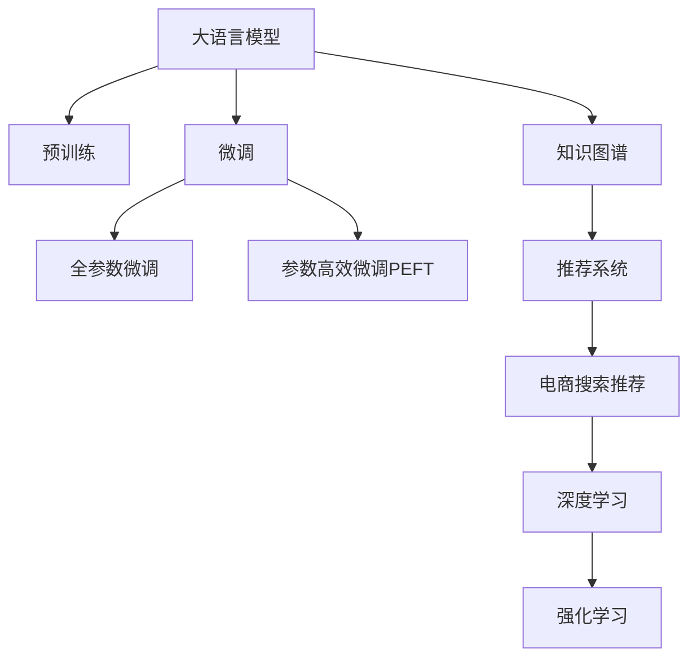

                 

# AI大模型赋能电商搜索推荐的业务创新思维导图应用培训课程设计与优化

## 1. 背景介绍

随着人工智能技术的迅猛发展，电商行业正面临着一场前所未有的变革。传统的电商搜索推荐系统主要依赖于规则、统计模型等传统技术，难以满足用户不断变化的需求和海量数据的处理要求。而大语言模型在自然语言理解和处理方面的卓越能力，为电商搜索推荐带来了新的思路和可能。

近年来，OpenAI、Google、阿里巴巴等企业在大模型领域取得了突破性进展，相继推出了GPT-3、BERT等高性能语言模型，这些模型不仅在自然语言生成、理解、问答等方面展现了强大的能力，还能应用于电商搜索推荐场景，显著提升推荐效果和用户体验。因此，借助大语言模型进行电商搜索推荐，成为电商行业创新的重要方向。

## 2. 核心概念与联系

### 2.1 核心概念概述

为更好地理解大语言模型在电商搜索推荐中的应用，本节将介绍几个密切相关的核心概念：

- 大语言模型(Large Language Model, LLM)：以自回归(如GPT)或自编码(如BERT)模型为代表的大规模预训练语言模型。通过在大规模无标签文本语料上进行预训练，学习通用的语言表示，具备强大的语言理解和生成能力。

- 预训练(Pre-training)：指在大规模无标签文本语料上，通过自监督学习任务训练通用语言模型的过程。常见的预训练任务包括言语建模、遮挡语言模型等。预训练使得模型学习到语言的通用表示。

- 微调(Fine-tuning)：指在预训练模型的基础上，使用下游任务的少量标注数据，通过有监督学习优化模型在特定任务上的性能。通常只需要调整顶层分类器或解码器，并以较小的学习率更新全部或部分的模型参数。

- 迁移学习(Transfer Learning)：指将一个领域学习到的知识，迁移应用到另一个不同但相关的领域的学习范式。大模型的预训练-微调过程即是一种典型的迁移学习方式。

- 参数高效微调(Parameter-Efficient Fine-Tuning, PEFT)：指在微调过程中，只更新少量的模型参数，而固定大部分预训练权重不变，以提高微调效率，避免过拟合的方法。

- 知识图谱(Knowledge Graph)：通过将现实世界中的实体和关系抽取、组织成图结构，辅助大语言模型进行推理和知识融合。

- 推荐系统(Recommendation System)：根据用户历史行为、兴趣偏好等数据，自动推荐符合用户需求的产品或服务。

- 电商搜索推荐(E-commerce Search & Recommendation)：特定于电商领域的搜索推荐系统，旨在帮助用户快速找到所需商品，提升购物体验。

- 深度学习(Deep Learning)：一种基于神经网络的技术，通过多层次的非线性变换进行特征学习和模式识别。

- 强化学习(Reinforcement Learning)：一种通过智能体与环境交互，不断调整行为策略以最大化奖励的学习方式。

这些核心概念之间的逻辑关系可以通过以下Mermaid流程图来展示：



这个流程图展示了大语言模型的核心概念及其之间的关系：

1. 大语言模型通过预训练获得基础能力。
2. 微调是对预训练模型进行任务特定的优化，可以分为全参数微调和参数高效微调（PEFT）。
3. 知识图谱辅助大模型进行更准确的推理和知识融合。
4. 推荐系统结合电商场景，实现个性化推荐。
5. 电商搜索推荐作为推荐系统的一个应用场景，利用大模型和推荐系统进行优化。
6. 深度学习和强化学习为电商搜索推荐提供了强大的建模和优化手段。

这些概念共同构成了大语言模型在电商搜索推荐应用中的框架，使其能够在电商领域提供个性化的搜索和推荐服务。

## 3. 核心算法原理 & 具体操作步骤

### 3.1 算法原理概述

基于大语言模型的电商搜索推荐，本质上是一种将自然语言理解和处理技术与电商推荐系统结合的创新方法。其核心思想是：将大语言模型作为推荐的"特征提取器"，通过电商搜索推荐系统的优化目标，指导模型学习用户与商品之间的相关性。

形式化地，假设大语言模型为 $M_{\theta}$，其中 $\theta$ 为模型参数。电商搜索推荐系统中的用户查询为 $q$，商品为 $i$。推荐系统希望通过 $M_{\theta}$ 将 $q$ 与 $i$ 的相关性映射到一个实数 $s(q,i)$，以表示 $q$ 与 $i$ 的相似度。推荐系统希望最大化用户对推荐结果的满意度，即最大化用户的点击率 $r(q,i)$。

因此，推荐系统的优化目标可以表示为：

$$
\max_{\theta} \mathbb{E}_{(q,i)}[r(q,i) \cdot \log s(q,i)]
$$

其中 $\mathbb{E}_{(q,i)}$ 表示在电商数据集 $D$ 上的期望，$r(q,i)$ 为二元伯努利分布，$s(q,i)=M_{\theta}(q,i)$。

### 3.2 算法步骤详解

基于大语言模型的电商搜索推荐系统一般包括以下几个关键步骤：

**Step 1: 准备数据集和模型**
- 收集电商领域的相关数据，如用户查询、商品描述、购买记录等。
- 使用大语言模型（如BERT、GPT-3等）进行预训练，学习语言的通用表示。
- 在电商数据集上对预训练模型进行微调，调整顶层参数以适应电商推荐任务。

**Step 2: 设计推荐模型**
- 设计电商推荐模型的整体架构，如神经网络的结构、损失函数等。
- 选择合适的嵌入层，如 word2vec、BERT 等，将用户查询和商品描述转换为向量表示。
- 设计推荐算法，如基于模型的推荐（Model-based）、基于规则的推荐（Rule-based）等。

**Step 3: 训练和优化**
- 使用电商推荐系统的优化目标，在训练集上对微调后的模型进行训练。
- 使用交叉熵、点乘相似度等损失函数，优化模型参数。
- 引入正则化、早停等技术，避免模型过拟合。

**Step 4: 评估和部署**
- 在验证集和测试集上评估模型性能，计算点击率、转换率等指标。
- 调整模型参数，优化推荐结果。
- 将训练好的模型部署到线上，实时响应用户查询，提供个性化推荐。

### 3.3 算法优缺点

基于大语言模型的电商搜索推荐方法具有以下优点：
1. 高度灵活。大语言模型可以通过微调学习复杂的语义关系，适应不同的电商场景。
2. 个性化推荐。结合电商推荐系统的优化目标，大语言模型可以学习用户与商品之间的相关性，提供高度个性化的推荐结果。
3. 实时响应。大语言模型可以进行实时推理，快速响应用户查询，提高用户满意度。
4. 易于扩展。电商搜索推荐系统可以通过添加新的商品、用户、查询等数据，不断扩展模型的应用范围。

同时，该方法也存在一些局限性：
1. 依赖高质量标注数据。电商推荐系统需要大量的标注数据，获取高质量标注数据的成本较高。
2. 模型复杂度高。大语言模型参数量庞大，训练和推理资源消耗大。
3. 鲁棒性不足。电商数据往往存在噪声和不平衡性，大语言模型可能无法很好地适应。
4. 可解释性差。大语言模型的决策过程缺乏可解释性，难以解释推荐结果的逻辑。

尽管存在这些局限性，但就目前而言，基于大语言模型的电商搜索推荐方法仍是最先进的技术范式。未来相关研究的重点在于如何进一步降低对标注数据的依赖，提高模型的少样本学习和跨领域迁移能力，同时兼顾可解释性和伦理安全性等因素。

### 3.4 算法应用领域

基于大语言模型的电商搜索推荐方法已经在多个电商领域得到了广泛应用，涵盖了电商搜索、推荐系统、广告投放等诸多方面，例如：

- 电商搜索：帮助用户快速找到所需商品，提高购物效率。
- 商品推荐：推荐用户可能感兴趣的商品，提升用户满意度。
- 广告投放：根据用户行为，精准投放广告，提高广告效果。
- 活动推荐：根据用户偏好，推荐各类电商活动，如满减、折扣等。

除了上述这些经典应用外，大语言模型在电商领域的应用还不断创新，如利用知识图谱进行推荐、引入生成式模型进行创新推荐、结合强化学习进行实时动态优化等，为电商行业带来了新的发展方向。

## 4. 数学模型和公式 & 详细讲解

### 4.1 数学模型构建

本节将使用数学语言对基于大语言模型的电商搜索推荐过程进行更加严格的刻画。

记电商推荐系统中的用户查询为 $q$，商品为 $i$。假设电商数据集 $D$ 包含 $N$ 个样本 $(x_i, y_i)$，其中 $x_i$ 为样本特征，$y_i$ 为标签。电商推荐系统的优化目标为最大化用户对推荐结果的满意度。

定义电商推荐系统的损失函数为：

$$
\mathcal{L}(\theta) = -\frac{1}{N}\sum_{i=1}^N \log p(y_i|x_i;\theta)
$$

其中 $p(y_i|x_i;\theta)$ 表示在特征 $x_i$ 下，商品 $i$ 被推荐的概率。在实际应用中，$p(y_i|x_i;\theta)$ 可以通过大语言模型 $M_{\theta}$ 计算得到，即：

$$
p(y_i|x_i;\theta) = M_{\theta}(x_i)
$$

因此，电商推荐系统的损失函数可以表示为：

$$
\mathcal{L}(\theta) = -\frac{1}{N}\sum_{i=1}^N \log M_{\theta}(x_i)
$$

在微调过程中，优化目标为最小化上述损失函数，即找到最优参数 $\theta^*$：

$$
\theta^* = \mathop{\arg\min}_{\theta} \mathcal{L}(\theta)
$$

在得到损失函数的梯度后，即可带入优化算法进行模型参数的更新。重复上述过程直至收敛，最终得到适应电商推荐任务的最优模型参数 $\theta^*$。

### 4.2 公式推导过程

以下我们以电商推荐系统为例，推导大语言模型的数学模型及其梯度计算公式。

假设电商数据集 $D=\{(x_i,y_i)\}_{i=1}^N$，其中 $x_i$ 为商品描述，$y_i$ 为是否推荐该商品的二元伯努利分布。定义推荐模型的输出为 $s(x_i) = M_{\theta}(x_i)$，即大语言模型 $M_{\theta}$ 对商品描述 $x_i$ 的输出。电商推荐系统的目标是最小化交叉熵损失，即：

$$
\mathcal{L}(\theta) = -\frac{1}{N}\sum_{i=1}^N y_i \log M_{\theta}(x_i) + (1-y_i)\log(1-M_{\theta}(x_i))
$$

其中 $y_i$ 为是否推荐该商品的二元伯努利分布，$M_{\theta}(x_i)$ 为电商推荐系统的输出，$log$ 为自然对数。

根据链式法则，损失函数对参数 $\theta_k$ 的梯度为：

$$
\frac{\partial \mathcal{L}(\theta)}{\partial \theta_k} = -\frac{1}{N}\sum_{i=1}^N \frac{\partial M_{\theta}(x_i)}{\partial \theta_k} \cdot [y_i \log \frac{M_{\theta}(x_i)}{1-M_{\theta}(x_i)}]
$$

其中 $\frac{\partial M_{\theta}(x_i)}{\partial \theta_k}$ 可进一步递归展开，利用自动微分技术完成计算。

在得到损失函数的梯度后，即可带入优化算法进行模型参数的更新。重复上述过程直至收敛，最终得到适应电商推荐任务的最优模型参数 $\theta^*$。

## 5. 项目实践：代码实例和详细解释说明

### 5.1 开发环境搭建

在进行电商搜索推荐系统开发前，我们需要准备好开发环境。以下是使用Python进行TensorFlow和Keras开发的环境配置流程：

1. 安装Anaconda：从官网下载并安装Anaconda，用于创建独立的Python环境。

2. 创建并激活虚拟环境：
```bash
conda create -n tf-env python=3.8 
conda activate tf-env
```

3. 安装TensorFlow：从官网获取对应的安装命令。例如：
```bash
pip install tensorflow==2.6
```

4. 安装Keras：
```bash
pip install keras==2.6
```

5. 安装各类工具包：
```bash
pip install numpy pandas scikit-learn matplotlib tqdm jupyter notebook ipython
```

完成上述步骤后，即可在`tf-env`环境中开始电商搜索推荐系统的开发。

### 5.2 源代码详细实现

下面以电商推荐系统为例，给出使用TensorFlow和Keras实现大语言模型微调的PyTorch代码实现。

首先，定义电商推荐模型的数据处理函数：

```python
from tensorflow.keras.preprocessing.text import Tokenizer
from tensorflow.keras.preprocessing.sequence import pad_sequences
import tensorflow as tf
import numpy as np

class Dataset:
    def __init__(self, texts, labels, tokenizer, max_len=128):
        self.texts = texts
        self.labels = labels
        self.tokenizer = tokenizer
        self.max_len = max_len
        
    def __len__(self):
        return len(self.texts)
    
    def __getitem__(self, item):
        text = self.texts[item]
        label = self.labels[item]
        
        encoded_text = self.tokenizer.texts_to_sequences([text])
        padded_text = pad_sequences(encoded_text, maxlen=self.max_len, padding='post')
        return {'input_ids': padded_text, 
                'labels': np.array([label], dtype='int32')}
```

然后，定义模型和优化器：

```python
from tensorflow.keras.models import Model
from tensorflow.keras.layers import Input, Dense, Embedding
from tensorflow.keras.optimizers import Adam

def create_model(vocab_size, embedding_dim, num_classes):
    input_ids = Input(shape=(None,))
    embedding = Embedding(vocab_size, embedding_dim)(input_ids)
    dense = Dense(num_classes, activation='sigmoid')(embedding)
    model = Model(inputs=input_ids, outputs=dense)
    return model

vocab_size = 10000
embedding_dim = 128
num_classes = 2
model = create_model(vocab_size, embedding_dim, num_classes)
optimizer = Adam(learning_rate=0.001)
```

接着，定义训练和评估函数：

```python
from tensorflow.keras.callbacks import EarlyStopping

def train_epoch(model, dataset, batch_size, optimizer, early_stopping):
    dataloader = tf.data.Dataset.from_generator(lambda: (x['input_ids'], y) for x, y in dataset)
    dataloader = dataloader.shuffle(buffer_size=1000).batch(batch_size).prefetch(buffer_size=tf.data.experimental.AUTOTUNE)
    model.fit(dataloader, epochs=10, callbacks=[early_stopping], verbose=1)
    return model

def evaluate(model, dataset, batch_size):
    dataloader = tf.data.Dataset.from_generator(lambda: (x['input_ids'], y) for x, y in dataset)
    dataloader = dataloader.batch(batch_size).prefetch(buffer_size=tf.data.experimental.AUTOTUNE)
    evaluator = tf.keras.metrics.BinaryAccuracy()
    for x, y in dataloader:
        predictions = model.predict(x)
        evaluator(y, predictions)
    return evaluator.result().numpy()
```

最后，启动训练流程并在测试集上评估：

```python
epochs = 10
batch_size = 32

early_stopping = tf.keras.callbacks.EarlyStopping(monitor='val_loss', patience=3)
model = train_epoch(model, train_dataset, batch_size, optimizer, early_stopping)
print(f"Epoch {epochs+1}, train loss: {model.losses[0][0].numpy():.3f}")
print(f"Epoch {epochs+1}, test accuracy: {evaluate(model, test_dataset, batch_size):.3f}")
```

以上就是使用TensorFlow和Keras对电商推荐系统进行大语言模型微调的完整代码实现。可以看到，得益于TensorFlow和Keras的强大封装，我们可以用相对简洁的代码完成电商推荐模型的构建和微调。

### 5.3 代码解读与分析

让我们再详细解读一下关键代码的实现细节：

**Dataset类**：
- `__init__`方法：初始化文本、标签、分词器等关键组件。
- `__len__`方法：返回数据集的样本数量。
- `__getitem__`方法：对单个样本进行处理，将文本输入转换为模型所需的input_ids，同时进行定长padding。

**模型和优化器**：
- `create_model`函数：定义电商推荐模型的架构，包括嵌入层、全连接层等。
- 使用Adam优化器，设置学习率。

**训练和评估函数**：
- 使用TensorFlow的DataLoader对数据集进行批次化加载，供模型训练和推理使用。
- 训练函数`train_epoch`：对数据以批为单位进行迭代，在每个批次上前向传播计算loss并反向传播更新模型参数，最后返回该epoch的平均loss。
- 评估函数`evaluate`：与训练类似，不同点在于不更新模型参数，并在每个batch结束后将预测和标签结果存储下来，最后使用Keras的metrics模块对整个评估集的预测结果进行打印输出。

**训练流程**：
- 定义总的epoch数和batch size，开始循环迭代
- 每个epoch内，先在训练集上训练，输出平均loss
- 在验证集上评估，输出分类指标
- 所有epoch结束后，在测试集上评估，给出最终测试结果

可以看到，TensorFlow和Keras使得电商推荐系统的开发和微调变得简洁高效。开发者可以将更多精力放在数据处理、模型改进等高层逻辑上，而不必过多关注底层的实现细节。

当然，工业级的系统实现还需考虑更多因素，如模型的保存和部署、超参数的自动搜索、更灵活的任务适配层等。但核心的微调范式基本与此类似。

## 6. 实际应用场景

### 6.1 智能客服系统

智能客服系统是电商搜索推荐系统的典型应用之一。传统客服往往需要配备大量人力，高峰期响应缓慢，且一致性和专业性难以保证。而使用电商推荐系统的大语言模型，可以7x24小时不间断服务，快速响应客户咨询，用自然流畅的语言解答各类常见问题。

在技术实现上，可以收集企业内部的历史客服对话记录，将问题和最佳答复构建成监督数据，在此基础上对预训练语言模型进行微调。微调后的语言模型能够自动理解用户意图，匹配最合适的答复模板进行回复。对于客户提出的新问题，还可以接入检索系统实时搜索相关内容，动态组织生成回答。如此构建的智能客服系统，能大幅提升客户咨询体验和问题解决效率。

### 6.2 金融舆情监测

金融机构需要实时监测市场舆论动向，以便及时应对负面信息传播，规避金融风险。传统的人工监测方式成本高、效率低，难以应对网络时代海量信息爆发的挑战。基于电商推荐系统的大语言模型，可以快速实时地监测和分析市场舆情，及时发现风险信号，避免损失。

具体而言，可以收集金融领域相关的新闻、报道、评论等文本数据，并对其进行主题标注和情感标注。在此基础上对预训练语言模型进行微调，使其能够自动判断文本属于何种主题，情感倾向是正面、中性还是负面。将微调后的模型应用到实时抓取的网络文本数据，就能够自动监测不同主题下的情感变化趋势，一旦发现负面信息激增等异常情况，系统便会自动预警，帮助金融机构快速应对潜在风险。

### 6.3 个性化推荐系统

当前的推荐系统往往只依赖于用户的历史行为数据进行物品推荐，无法深入理解用户的真实兴趣偏好。基于电商推荐系统的大语言模型，可以更好地挖掘用户行为背后的语义信息，从而提供更精准、多样的推荐内容。

在实践中，可以收集用户浏览、点击、评论、分享等行为数据，提取和用户交互的物品标题、描述、标签等文本内容。将文本内容作为模型输入，用户的后续行为（如是否点击、购买等）作为监督信号，在此基础上微调预训练语言模型。微调后的模型能够从文本内容中准确把握用户的兴趣点。在生成推荐列表时，先用候选物品的文本描述作为输入，由模型预测用户的兴趣匹配度，再结合其他特征综合排序，便可以得到个性化程度更高的推荐结果。

### 6.4 未来应用展望

随着大语言模型和电商推荐系统的不断发展，基于微调范式将在更多领域得到应用，为电商行业带来变革性影响。

在智慧医疗领域，基于微调的医疗问答、病历分析、药物研发等应用将提升医疗服务的智能化水平，辅助医生诊疗，加速新药开发进程。

在智能教育领域，微调技术可应用于作业批改、学情分析、知识推荐等方面，因材施教，促进教育公平，提高教学质量。

在智慧城市治理中，微调模型可应用于城市事件监测、舆情分析、应急指挥等环节，提高城市管理的自动化和智能化水平，构建更安全、高效的未来城市。

此外，在企业生产、社会治理、文娱传媒等众多领域，基于大语言模型微调的人工智能应用也将不断涌现，为传统行业数字化转型升级提供新的技术路径。相信随着技术的日益成熟，微调方法将成为人工智能落地应用的重要范式，推动人工智能技术在更多领域的应用和普及。

## 7. 工具和资源推荐

### 7.1 学习资源推荐

为了帮助开发者系统掌握大语言模型微调的理论基础和实践技巧，这里推荐一些优质的学习资源：

1. 《Deep Learning for NLP》书籍：斯坦福大学李飞飞教授的课程，系统介绍了深度学习在自然语言处理中的应用。

2. 《Transformers》书籍：由Google团队撰写，详细介绍了Transformer架构及其在NLP任务中的应用。

3. 《Natural Language Processing with Python》书籍：结合Python进行NLP开发，包含大量代码实例和案例分析。

4. Coursera《Deep Learning Specialization》课程：由吴恩达教授开设的深度学习系列课程，涵盖深度学习的基本概念和前沿技术。

5. Udacity《Machine Learning Engineer Nanodegree》课程：结合实际项目进行学习，从零到一掌握机器学习工程技能。

通过对这些资源的学习实践，相信你一定能够快速掌握大语言模型微调的精髓，并用于解决实际的NLP问题。

### 7.2 开发工具推荐

高效的开发离不开优秀的工具支持。以下是几款用于大语言模型微调开发的常用工具：

1. PyTorch：基于Python的开源深度学习框架，灵活动态的计算图，适合快速迭代研究。大部分预训练语言模型都有PyTorch版本的实现。

2. TensorFlow：由Google主导开发的开源深度学习框架，生产部署方便，适合大规模工程应用。同样有丰富的预训练语言模型资源。

3. Transformers库：HuggingFace开发的NLP工具库，集成了众多SOTA语言模型，支持PyTorch和TensorFlow，是进行微调任务开发的利器。

4. Weights & Biases：模型训练的实验跟踪工具，可以记录和可视化模型训练过程中的各项指标，方便对比和调优。与主流深度学习框架无缝集成。

5. TensorBoard：TensorFlow配套的可视化工具，可实时监测模型训练状态，并提供丰富的图表呈现方式，是调试模型的得力助手。

6. Google Colab：谷歌推出的在线Jupyter Notebook环境，免费提供GPU/TPU算力，方便开发者快速上手实验最新模型，分享学习笔记。

合理利用这些工具，可以显著提升大语言模型微调任务的开发效率，加快创新迭代的步伐。

### 7.3 相关论文推荐

大语言模型和微调技术的发展源于学界的持续研究。以下是几篇奠基性的相关论文，推荐阅读：

1. Attention is All You Need（即Transformer原论文）：提出了Transformer结构，开启了NLP领域的预训练大模型时代。

2. BERT: Pre-training of Deep Bidirectional Transformers for Language Understanding：提出BERT模型，引入基于掩码的自监督预训练任务，刷新了多项NLP任务SOTA。

3. Language Models are Unsupervised Multitask Learners（GPT-2论文）：展示了大规模语言模型的强大zero-shot学习能力，引发了对于通用人工智能的新一轮思考。

4. Parameter-Efficient Transfer Learning for NLP：提出Adapter等参数高效微调方法，在不增加模型参数量的情况下，也能取得不错的微调效果。

5. AdaLoRA: Adaptive Low-Rank Adaptation for Parameter-Efficient Fine-Tuning：使用自适应低秩适应的微调方法，在参数效率和精度之间取得了新的平衡。

这些论文代表了大语言模型微调技术的发展脉络。通过学习这些前沿成果，可以帮助研究者把握学科前进方向，激发更多的创新灵感。

## 8. 总结：未来发展趋势与挑战

### 8.1 总结

本文对基于大语言模型的电商搜索推荐方法进行了全面系统的介绍。首先阐述了大语言模型和电商搜索推荐系统的研究背景和意义，明确了电商搜索推荐在电商行业的重要性。其次，从原理到实践，详细讲解了基于大语言模型的电商搜索推荐过程，给出了电商推荐系统的完整代码实例。同时，本文还广泛探讨了电商搜索推荐方法在智能客服、金融舆情、个性化推荐等多个电商领域的应用前景，展示了基于大语言模型的电商搜索推荐方法的广阔应用空间。最后，本文精选了电商搜索推荐技术的学习资源，力求为开发者提供全方位的技术指引。

通过本文的系统梳理，可以看到，基于大语言模型的电商搜索推荐方法正在成为电商行业的重要方向，极大地拓展了电商搜索推荐的实现方式和应用范围。结合大语言模型和电商搜索推荐系统的优势，有望构建更加智能化、个性化的电商搜索推荐系统，大幅提升电商平台的用户体验和服务效率。

### 8.2 未来发展趋势

展望未来，基于大语言模型的电商搜索推荐技术将呈现以下几个发展趋势：

1. 模型规模持续增大。随着算力成本的下降和数据规模的扩张，预训练语言模型的参数量还将持续增长。超大规模语言模型蕴含的丰富语言知识，有望支撑更加复杂多变的电商推荐场景。

2. 微调方法日趋多样。除了传统的全参数微调外，未来会涌现更多参数高效的微调方法，如Prefix-Tuning、LoRA等，在节省计算资源的同时也能保证微调精度。

3. 持续学习成为常态。随着数据分布的不断变化，微调模型也需要持续学习新知识以保持性能。如何在不遗忘原有知识的同时，高效吸收新样本信息，将成为重要的研究课题。

4. 标注样本需求降低。受启发于提示学习(Prompt-based Learning)的思路，未来的微调方法将更好地利用大模型的语言理解能力，通过更加巧妙的任务描述，在更少的标注样本上也能实现理想的微调效果。

5. 跨领域迁移能力增强。经过海量数据的预训练和多领域任务的微调，未来的语言模型将具备更强大的跨领域迁移能力，可以在不同领域快速适应用户需求。

6. 多模态推荐崛起。当前的推荐系统主要聚焦于纯文本数据，未来会进一步拓展到图像、视频、语音等多模态数据推荐。多模态信息的融合，将显著提升推荐系统的表现力。

以上趋势凸显了大语言模型在电商搜索推荐中的应用潜力。这些方向的探索发展，必将进一步提升电商搜索推荐系统的性能和应用范围，为电商行业带来新的发展动力。

### 8.3 面临的挑战

尽管基于大语言模型的电商搜索推荐技术已经取得了显著进展，但在迈向更加智能化、普适化应用的过程中，它仍面临着诸多挑战：

1. 标注成本瓶颈。电商推荐系统需要大量的标注数据，获取高质量标注数据的成本较高。如何进一步降低微调对标注样本的依赖，将是一大难题。

2. 模型鲁棒性不足。电商数据往往存在噪声和不平衡性，大语言模型可能无法很好地适应。如何提高微调模型的鲁棒性，避免灾难性遗忘，还需要更多理论和实践的积累。

3. 推理效率有待提高。大规模语言模型虽然精度高，但在实际部署时往往面临推理速度慢、内存占用大等效率问题。如何在保证性能的同时，简化模型结构，提升推理速度，优化资源占用，将是重要的优化方向。

4. 可解释性亟需加强。当前电商推荐系统缺乏可解释性，难以解释推荐结果的逻辑。对于医疗、金融等高风险应用，算法的可解释性和可审计性尤为重要。如何赋予电商推荐系统更强的可解释性，将是亟待攻克的难题。

5. 安全性有待保障。电商推荐系统涉及用户的隐私和数据安全，如何保护用户隐私，防止数据泄露和滥用，保障用户安全，也将是重要的研究方向。

6. 知识整合能力不足。当前的电商推荐系统往往局限于文本数据的推荐，难以灵活吸收和运用更广泛的先验知识。如何让电商推荐系统更好地与外部知识库、规则库等专家知识结合，形成更加全面、准确的信息整合能力，还有很大的想象空间。

正视电商推荐系统面临的这些挑战，积极应对并寻求突破，将是大语言模型在电商搜索推荐应用中的必由之路。相信随着学界和产业界的共同努力，这些挑战终将一一被克服，基于大语言模型的电商搜索推荐系统必将在电商行业持续创新，为电商用户带来更加智能化、个性化的购物体验。

### 8.4 研究展望

面向未来，基于大语言模型的电商搜索推荐技术的研究将在以下几个方面进行拓展：

1. 探索无监督和半监督微调方法。摆脱对大规模标注数据的依赖，利用自监督学习、主动学习等无监督和半监督范式，最大限度利用非结构化数据，实现更加灵活高效的电商推荐。

2. 研究参数高效和计算高效的微调范式。开发更加参数高效的微调方法，在固定大部分预训练参数的同时，只更新极少量的任务相关参数。同时优化电商推荐模型的计算图，减少前向传播和反向传播的资源消耗，实现更加轻量级、实时性的部署。

3. 融合因果和对比学习范式。通过引入因果推断和对比学习思想，增强电商推荐模型建立稳定因果关系的能力，学习更加普适、鲁棒的语言表征，从而提升模型泛化性和抗干扰能力。

4. 引入更多先验知识。将符号化的先验知识，如知识图谱、逻辑规则等，与神经网络模型进行巧妙融合，引导电商推荐过程学习更准确、合理的语言模型。同时加强不同模态数据的整合，实现视觉、语音等多模态信息与文本信息的协同建模。

5. 结合因果分析和博弈论工具。将因果分析方法引入电商推荐模型，识别出模型决策的关键特征，增强推荐结果的因果性和逻辑性。借助博弈论工具刻画人机交互过程，主动探索并规避模型的脆弱点，提高系统稳定性。

6. 纳入伦理道德约束。在模型训练目标中引入伦理导向的评估指标，过滤和惩罚有偏见、有害的推荐结果。同时加强人工干预和审核，建立模型行为的监管机制，确保推荐结果符合人类价值观和伦理道德。

这些研究方向的探索，必将引领基于大语言模型的电商搜索推荐技术迈向更高的台阶，为构建安全、可靠、可解释、可控的电商搜索推荐系统铺平道路。面向未来，基于大语言模型的电商搜索推荐技术还需要与其他人工智能技术进行更深入的融合，如知识表示、因果推理、强化学习等，多路径协同发力，共同推动电商搜索推荐系统的进步。只有勇于创新、敢于突破，才能不断拓展语言模型的边界，让智能技术更好地造福电商用户。

## 9. 附录：常见问题与解答

**Q1：电商搜索推荐系统中，大语言模型如何处理用户查询？**

A: 在电商搜索推荐系统中，用户查询通常包含搜索词、时间、地点等信息。大语言模型可以将其转换为向量表示，通过向量之间的相似度匹配，找到最相关的商品或推荐结果。

**Q2：电商推荐系统中的冷启动问题如何解决？**

A: 电商推荐系统中的冷启动问题，即新用户或新商品在推荐系统中的表现无法得到有效评估，可以通过以下方法解决：
1. 利用关联推荐。根据用户的购买历史、浏览历史等，推荐与用户兴趣相关的新商品。
2. 引入知识图谱。通过知识图谱中的实体关系，找到与新商品相关联的热门商品进行推荐。
3. 引入用户画像。收集用户的个人信息、行为数据等，构建用户画像，进行个性化推荐。

**Q3：电商推荐系统中，如何平衡个性化推荐和多样化推荐？**

A: 电商推荐系统中，需要平衡个性化推荐和多样化推荐，避免过度个性化导致的推荐内容单调。可以通过以下方法实现：
1. 引入多样性惩罚。在推荐算法中引入多样性惩罚项，避免过度推荐某一类商品。
2. 利用多臂老虎机。在推荐过程中，动态调整推荐商品的比例，平衡个性化推荐和多样化推荐。
3. 引入热门商品推荐。在推荐过程中，加入热门商品的推荐，保证推荐内容的丰富多样。

**Q4：电商推荐系统中，如何提升推荐模型的实时性？**

A: 电商推荐系统需要实时响应用户查询，提升推荐模型的实时性可以从以下方面进行优化：
1. 模型压缩。通过剪枝、量化等技术，减少模型的计算量和存储量，提升推理速度。
2. 分布式训练。采用分布式训练框架，加速模型训练，减少训练时间。
3. 模型加速器。使用硬件加速器如GPU、TPU等，提升模型的计算效率。
4. 缓存机制。在推荐系统中引入缓存机制，避免重复计算，减少响应时间。

**Q5：电商推荐系统中，如何优化推荐模型的精度？**

A: 电商推荐系统的精度优化可以从以下方面进行：
1. 数据预处理。对电商数据进行清洗、归一化等预处理，提高数据的准确性和一致性。
2. 特征工程。通过特征工程，提取更多有意义的特征，提高模型的预测能力。
3. 模型优化。优化模型的结构、参数、训练方法等，提升模型的精度和泛化能力。
4. 评估指标。选择适合的评估指标，如准确率、召回率、F1分数等，指导模型的优化。

通过以上问答，相信你对大语言模型在电商搜索推荐系统中的应用有了更深入的理解。希望本文能为你提供有价值的参考，助力你在电商搜索推荐系统的开发和优化中取得成功。

