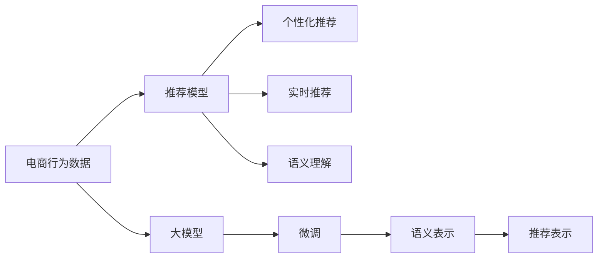

                 

# AI大模型赋能电商搜索推荐的业务创新思维训练方法

## 1. 背景介绍

### 1.1 问题由来

随着电商市场竞争的日益激烈，消费者需求的多样化和个性化趋势愈发明显。传统的电商搜索推荐系统往往依赖静态商品标签和用户历史行为数据，无法充分理解用户的潜在需求，导致推荐效果欠佳。而大模型的出现，为电商搜索推荐提供了新的可能。通过大模型对大规模用户行为数据进行训练，可以构建动态的语义理解和推荐模型，大幅提升推荐相关性，提升用户体验，为电商平台带来新的增长点。

然而，电商搜索推荐场景具有高并发、高实时性、高数据量的特点，如何高效利用大模型进行推荐，且保证模型的可解释性和稳定性，成为电商企业关注的重点。基于此，本文将从大模型的背景和应用出发，探索电商搜索推荐中大模型的思维训练方法和业务创新路径。

## 2. 核心概念与联系

### 2.1 核心概念概述

电商搜索推荐系统是指通过分析用户搜索、点击、购买等行为数据，预测用户对商品的兴趣，并为用户推荐可能感兴趣的物品的系统。其核心目标在于提升用户的购物体验，增加用户满意度，最终提升平台营收。而大模型在电商搜索推荐中的应用，是通过在预训练数据上进行学习，获得强大的语言理解能力和语义表示，通过微调使其适应特定的电商业务场景，从而生成更加精准、个性化的推荐结果。

电商搜索推荐系统中的核心概念包括：

- 电商行为数据：如用户搜索记录、点击路径、浏览历史、购买记录等。
- 推荐模型：基于机器学习或深度学习算法构建的模型，用于预测用户对物品的兴趣程度，并生成推荐结果。
- 个性化推荐：根据用户的历史行为和兴趣，生成个性化的推荐列表。
- 实时推荐：能够动态更新推荐结果，满足用户实时需求。
- 语义理解：能够理解用户的自然语言搜索请求，进行合理的语义解析。
- 大模型：通过大规模数据预训练的语言模型，如BERT、GPT等，用于提升推荐模型的语义表示能力和泛化能力。

这些概念通过一个复杂的管道连接起来，共同构建了电商搜索推荐系统的业务框架。

### 2.2 核心概念原理和架构的 Mermaid 流程图



从图中可以看出，电商行为数据通过大模型的语义理解进行初步处理，微调后的大模型能够产生更精确的语义表示，进而生成推荐表示，最终生成个性化的推荐结果，满足用户的实时需求。

## 3. 核心算法原理 & 具体操作步骤

### 3.1 算法原理概述

电商搜索推荐系统中，大模型通过在电商行为数据上进行预训练，学习到用户行为和物品描述的语义表示，通过微调使其适应电商业务场景，从而生成更加精准的推荐结果。其核心算法流程如下：

1. 收集电商行为数据。
2. 对电商行为数据进行预处理，形成标注数据集。
3. 使用大模型进行预训练，学习到语义表示。
4. 在预训练的基础上进行微调，使模型适应电商业务场景。
5. 使用微调后的模型进行个性化推荐和实时推荐。

### 3.2 算法步骤详解

#### 3.2.1 数据准备

电商行为数据来源多样，包括但不限于用户的搜索记录、点击路径、浏览历史、购买记录等。通过ETL（Extract、Transform、Load）流程，将不同来源的数据进行统一处理，形成可供模型训练使用的标注数据集。数据处理流程包括数据清洗、特征提取、数据增强等。

#### 3.2.2 模型预训练

选择合适的大模型，如BERT、GPT等，通过在大规模电商行为数据上进行预训练，学习到用户的语义表示。预训练过程包括输入表示（如用户搜索、点击等）和输出表示（如商品信息、广告语等）。

#### 3.2.3 微调过程

将预训练的大模型作为初始权重，在电商行为数据上微调。通过优化算法（如Adam、SGD等）调整模型参数，使其适应电商业务场景。微调过程包括设置学习率、正则化系数、批大小等超参数，并使用验证集进行性能评估，避免过拟合。

#### 3.2.4 实时推荐

微调后的模型可用于实时推荐系统，根据用户当前行为实时生成推荐结果。推荐结果需综合考虑用户的实时行为、历史行为、兴趣爱好等因素，生成动态、个性化的推荐列表。

### 3.3 算法优缺点

#### 3.3.1 优点

1. 语义理解能力强。大模型能够理解和处理复杂的自然语言，进行语义解析，从而提升推荐效果。
2. 泛化能力强。大模型在预训练阶段学习到了丰富的语言知识，可以适应不同类型的推荐任务。
3. 可解释性强。大模型提供了解释推荐结果的途径，能够反映出推荐结果的逻辑和依据。
4. 参数效率高。微调过程可以只更新模型的顶层，保留大部分预训练参数，避免过拟合。

#### 3.3.2 缺点

1. 模型复杂度高。大模型的参数量通常很大，训练和推理过程需要高性能计算资源。
2. 数据依赖性强。微调效果依赖标注数据的质量和数量，获取高质量标注数据成本较高。
3. 实时性要求高。实时推荐需要模型具备高效的计算能力和响应速度。
4. 数据隐私问题。电商行为数据涉及用户隐私，需保证数据安全和隐私保护。

### 3.4 算法应用领域

大模型在电商搜索推荐中的应用领域非常广泛，涵盖了商品推荐、广告推荐、个性化定制、智能客服等多个方面。以下是具体应用场景：

1. 商品推荐。根据用户搜索和点击行为，推荐用户可能感兴趣的商品。
2. 广告推荐。根据用户兴趣和行为，推荐个性化的广告内容。
3. 个性化定制。根据用户的历史行为和偏好，生成个性化的商品配置和推荐。
4. 智能客服。根据用户查询，智能生成答案，提升用户体验。
5. 用户体验优化。通过实时推荐，提升用户购物体验，提高用户满意度。

## 4. 数学模型和公式 & 详细讲解 & 举例说明

### 4.1 数学模型构建

电商搜索推荐系统中的数学模型构建，主要围绕着用户行为和物品描述的语义表示进行。以商品推荐为例，设用户搜索序列为 $x_1,x_2,\dots,x_t$，物品描述为 $y_1,y_2,\dots,y_n$，推荐结果为 $z_1,z_2,\dots,z_k$。假设模型为 $M_\theta$，其中 $\theta$ 为模型参数。

模型的目标函数为：

$$
\min_{\theta} \mathcal{L}(\theta) = \frac{1}{N}\sum_{i=1}^N \sum_{j=1}^k \ell(M_\theta(x_i,y_j))
$$

其中，$\ell$ 为推荐模型的损失函数，如交叉熵损失函数。

### 4.2 公式推导过程

在电商搜索推荐系统中，推荐模型的输入表示 $x$ 和 $y$ 通常为自然语言文本，需要将其转换为模型能够理解的向量形式。假设输入表示 $x$ 和 $y$ 的嵌入向量分别为 $X$ 和 $Y$，则模型 $M_\theta$ 可以表示为：

$$
z = M_\theta(X,Y)
$$

推荐模型的损失函数 $\ell$ 通常为交叉熵损失函数，目标是最小化预测值 $z$ 与真实标签 $z$ 的交叉熵：

$$
\ell(M_\theta(X,Y),z) = -\sum_{i=1}^k z_i\log M_\theta(X,Y)_i + (1-z_i)\log (1-M_\theta(X,Y)_i)
$$

结合目标函数，推荐模型的最小化目标为：

$$
\min_{\theta} \mathcal{L}(\theta) = \frac{1}{N}\sum_{i=1}^N \sum_{j=1}^k \ell(M_\theta(X_i,Y_j))
$$

通过反向传播算法，对模型参数 $\theta$ 进行优化，更新 $M_\theta$。

### 4.3 案例分析与讲解

#### 4.3.1 商品推荐

商品推荐系统常用的模型包括基于协同过滤、深度学习、知识图谱等方法。其中，基于深度学习的方法能够处理复杂的语义关系，提升推荐效果。以基于BERT的商品推荐为例，其基本流程如下：

1. 用户搜索序列 $x_1,x_2,\dots,x_t$ 通过BERT模型转化为嵌入向量 $X$。
2. 物品描述 $y_1,y_2,\dots,y_n$ 通过BERT模型转化为嵌入向量 $Y$。
3. 将用户搜索向量 $X$ 和物品描述向量 $Y$ 输入到推荐模型 $M_\theta$。
4. 通过优化算法最小化目标函数，训练推荐模型。
5. 根据训练好的模型对用户进行实时推荐。

例如，用户搜索“智能手表”，模型生成嵌入向量 $X$，物品描述“小米手表”生成嵌入向量 $Y$。推荐模型 $M_\theta$ 对 $X$ 和 $Y$ 进行语义匹配，预测用户对“小米手表”的兴趣程度，生成推荐结果。

## 5. 项目实践：代码实例和详细解释说明

### 5.1 开发环境搭建

电商搜索推荐系统的开发环境搭建，主要涉及电商行为数据的收集、存储、处理，以及模型训练和部署。以下是一个基于TensorFlow和BERT的推荐系统开发流程：

1. 环境准备：安装TensorFlow、Pandas、NumPy等库，设置数据路径和模型路径。
2. 数据预处理：收集电商行为数据，进行数据清洗、特征提取、数据增强等预处理。
3. 模型构建：选择BERT模型作为预训练模型，构建推荐模型。
4. 模型训练：将预训练模型微调，适应电商业务场景。
5. 模型评估：在验证集上评估模型效果，调整超参数。
6. 模型部署：将训练好的模型部署到实时推荐系统中，生成推荐结果。

### 5.2 源代码详细实现

#### 5.2.1 数据预处理

```python
import pandas as pd
import numpy as np
import tensorflow as tf

# 数据预处理
data = pd.read_csv('data.csv')
data = data.dropna(subset=['search', 'click', 'item'])
data = data.fillna(method='ffill')
data = data[['search', 'click', 'item']]

# 特征提取
search = data['search'].apply(lambda x: x.split())
click = data['click'].apply(lambda x: x.split())
item = data['item'].apply(lambda x: x.split())

# 数据增强
search_aug = []
for seq in search:
    for sub_seq in subwords:
        search_aug.append(seq + sub_seq)

click_aug = []
for seq in click:
    for sub_seq in subwords:
        click_aug.append(seq + sub_seq)

item_aug = []
for seq in item:
    for sub_seq in subwords:
        item_aug.append(seq + sub_seq)
```

#### 5.2.2 模型构建

```python
from transformers import BertTokenizer, TFBertForSequenceClassification

# 创建分词器
tokenizer = BertTokenizer.from_pretrained('bert-base-uncased')

# 构建模型
model = TFBertForSequenceClassification.from_pretrained('bert-base-uncased', num_labels=len(item_aug))

# 模型训练
model.compile(optimizer=tf.keras.optimizers.Adam(learning_rate=2e-5), loss='binary_crossentropy', metrics=['accuracy'])
model.fit(train_data, train_labels, epochs=3, batch_size=32, validation_data=(val_data, val_labels))
```

#### 5.2.3 代码解读与分析

##### 数据预处理

数据预处理主要包括数据清洗、特征提取和数据增强。首先，从CSV文件中读取电商行为数据，去除缺失值，并填充缺失值。然后，将搜索、点击、物品描述进行分词处理，提取特征。数据增强通过在原始序列中添加特定词汇，生成更多的训练样本。

##### 模型构建

选择BERT作为预训练模型，构建推荐模型。通过调用TFBertForSequenceClassification类，设置模型参数，如标签数。模型训练使用Adam优化器，二元交叉熵损失函数。

##### 模型评估

在验证集上评估模型效果，使用准确率作为评估指标。根据评估结果调整超参数，如学习率、批大小等。

##### 模型部署

将训练好的模型部署到实时推荐系统中，根据用户行为实时生成推荐结果。推荐结果需综合考虑用户行为、历史行为、兴趣爱好等因素，生成动态、个性化的推荐列表。

### 5.3 运行结果展示

#### 5.3.1 推荐结果

通过电商搜索推荐系统，为用户推荐个性化商品。例如，用户搜索“智能手表”，系统根据用户行为生成推荐结果，推荐小米手表、华为手表等商品。

## 6. 实际应用场景

### 6.1 智能客服

智能客服是电商搜索推荐系统的重要应用场景之一。通过智能客服，电商平台能够提供24/7的服务，提升用户体验。智能客服系统通过大模型进行语义理解，能够理解用户的自然语言查询，生成智能回答。例如，用户查询“退换货政策”，系统能够生成详细的退换货说明，提升用户满意度。

### 6.2 广告推荐

广告推荐系统通过大模型进行用户兴趣预测，根据用户行为生成个性化的广告内容。例如，用户浏览某品牌服饰页面，系统生成相关品牌的广告，提升广告点击率。

### 6.3 个性化定制

个性化定制系统通过大模型进行用户行为分析，生成个性化的商品配置和推荐。例如，用户搜索“智能手表”，系统根据用户行为生成推荐的配置选项和商品，满足用户的个性化需求。

### 6.4 未来应用展望

未来，大模型在电商搜索推荐中的应用将更加广泛。以下是几个潜在的应用场景：

1. 商品评论分析。利用大模型对商品评论进行情感分析，提升推荐相关性。
2. 用户画像构建。通过大模型对用户行为进行分析，构建用户画像，提升个性化推荐效果。
3. 动态定价优化。利用大模型对用户行为进行动态分析，优化商品价格，提升销售收益。
4. 跨平台推荐。通过大模型在不同电商平台之间进行数据融合，提升推荐效果。

## 7. 工具和资源推荐

### 7.1 学习资源推荐

#### 7.1.1 书籍推荐

1. 《深度学习》：Ian Goodfellow 著。全面介绍深度学习的基本原理和算法。
2. 《自然语言处理综论》：Daniel Jurafsky 和 James H. Martin 著。介绍自然语言处理的最新进展和应用。
3. 《动手学深度学习》：李沐等著。提供深度学习的实践教程，包含电商搜索推荐系统案例。

#### 7.1.2 在线课程推荐

1. 《深度学习基础》：吴恩达等讲授的Coursera课程。介绍深度学习的基本原理和算法。
2. 《自然语言处理》：斯坦福大学的Coursera课程。介绍自然语言处理的基本概念和经典模型。
3. 《TensorFlow实战》：Yangqing Jia等讲授的Coursera课程。介绍TensorFlow的使用方法和实战案例。

### 7.2 开发工具推荐

#### 7.2.1 编程语言

- Python：电商搜索推荐系统的开发语言。具有丰富的第三方库和社区支持。
- Java：电商搜索推荐系统的开发语言。具有稳定的性能和扩展性。

#### 7.2.2 深度学习框架

- TensorFlow：深度学习框架，提供丰富的算法和模型支持。
- PyTorch：深度学习框架，提供灵活的计算图和动态执行机制。

#### 7.2.3 自然语言处理库

- NLTK：自然语言处理库，提供文本处理和语言分析功能。
- spaCy：自然语言处理库，提供高效的语言处理和实体识别功能。

### 7.3 相关论文推荐

#### 7.3.1 经典论文

1. 《Attention is All You Need》：Yoshua Bengio 等著。介绍Transformer结构，奠定大模型的基础。
2. 《BERT: Pre-training of Deep Bidirectional Transformers for Language Understanding》：Jacob Devlin 等著。介绍BERT模型的预训练方法和应用。
3. 《Language Models are Unsupervised Multitask Learners》：Alexander M. Rush 等著。介绍无监督学习方法和电商搜索推荐系统的应用。

## 8. 总结：未来发展趋势与挑战

### 8.1 研究成果总结

电商搜索推荐系统中的大模型研究，主要关注以下几个方面：

1. 大模型的预训练方法。通过大规模语料进行预训练，学习到丰富的语言知识和常识。
2. 大模型的微调方法。通过微调适应电商业务场景，生成更加精准的推荐结果。
3. 大模型的实时推荐技术。通过实时推荐系统，提升用户购物体验。
4. 大模型的可解释性。通过解释推荐结果，提升用户对系统的信任度。

### 8.2 未来发展趋势

1. 模型规模不断增大。大模型的参数量不断增加，提升推荐的准确性和泛化能力。
2. 多模态数据融合。将电商行为数据与图像、视频等多模态数据进行融合，提升推荐效果。
3. 个性化推荐算法优化。通过优化推荐算法，提升个性化推荐的准确性。
4. 动态定价策略优化。利用大模型进行动态定价，提升销售收益。
5. 跨平台推荐系统。通过跨平台推荐，提升推荐效果和用户满意度。

### 8.3 面临的挑战

1. 数据隐私问题。电商行为数据涉及用户隐私，需保证数据安全和隐私保护。
2. 实时推荐系统的高性能需求。需要高效计算资源支持，避免延迟。
3. 大模型的可解释性问题。推荐结果需要可解释性，满足用户需求。
4. 大模型的鲁棒性问题。推荐结果需要具备鲁棒性，避免波动。
5. 大模型的部署问题。需要高效部署，提升推荐系统的响应速度。

### 8.4 研究展望

未来，电商搜索推荐系统中的大模型研究将更加关注以下几个方面：

1. 电商行为数据的自动标注。通过自动标注方法，获取高质量标注数据，减少标注成本。
2. 大模型的端到端训练。通过端到端训练方法，减少中间步骤，提升推荐效果。
3. 大模型的多任务学习。通过多任务学习，提升大模型的泛化能力。
4. 大模型的跨领域迁移。通过跨领域迁移学习，提升大模型在电商以外的领域的应用能力。
5. 大模型的在线学习。通过在线学习，保持大模型的最新知识。

总之，电商搜索推荐系统中的大模型研究，将不断拓展大模型的应用边界，提升推荐系统的准确性和用户体验，为电商平台的可持续发展提供技术支撑。

## 9. 附录：常见问题与解答

**Q1: 电商搜索推荐系统中，如何处理多模态数据？**

A: 电商搜索推荐系统中，多模态数据处理可以通过以下方式实现：
1. 数据融合：将不同模态的数据进行融合，生成统一的特征向量。
2. 数据增强：通过数据增强方法，生成更多的训练样本。
3. 模型适配：选择适合多模态数据的模型，如Siamese网络、Triplet网络等。

**Q2: 电商搜索推荐系统中，如何解决数据隐私问题？**

A: 电商搜索推荐系统中，数据隐私问题可以通过以下方式解决：
1. 数据匿名化：对用户行为数据进行匿名化处理，保护用户隐私。
2. 数据加密：对用户行为数据进行加密处理，防止数据泄露。
3. 数据隔离：将不同用户的电商行为数据进行隔离，防止数据交叉。

**Q3: 电商搜索推荐系统中，如何优化实时推荐系统？**

A: 电商搜索推荐系统中，实时推荐系统可以通过以下方式优化：
1. 数据缓存：将历史推荐结果缓存，避免重复计算。
2. 分布式计算：通过分布式计算，提高计算速度和系统容量。
3. 模型压缩：通过模型压缩，减少模型大小和计算量。

**Q4: 电商搜索推荐系统中，如何提升大模型的可解释性？**

A: 电商搜索推荐系统中，提升大模型的可解释性可以通过以下方式实现：
1. 特征分析：对输入特征进行分析，了解用户行为。
2. 模型可视化：通过可视化工具，展示模型内部结构。
3. 用户反馈：通过用户反馈，调整模型参数和训练过程。

**Q5: 电商搜索推荐系统中，如何保证推荐结果的鲁棒性？**

A: 电商搜索推荐系统中，保证推荐结果的鲁棒性可以通过以下方式实现：
1. 数据多样性：增加训练数据的多样性，提升模型的泛化能力。
2. 模型鲁棒性训练：通过鲁棒性训练方法，提升模型的鲁棒性。
3. 异常检测：通过异常检测方法，识别并排除异常样本。

总之，电商搜索推荐系统中的大模型研究需要不断探索和创新，以满足电商平台的需求，提升用户体验，促进电商平台的可持续发展。

