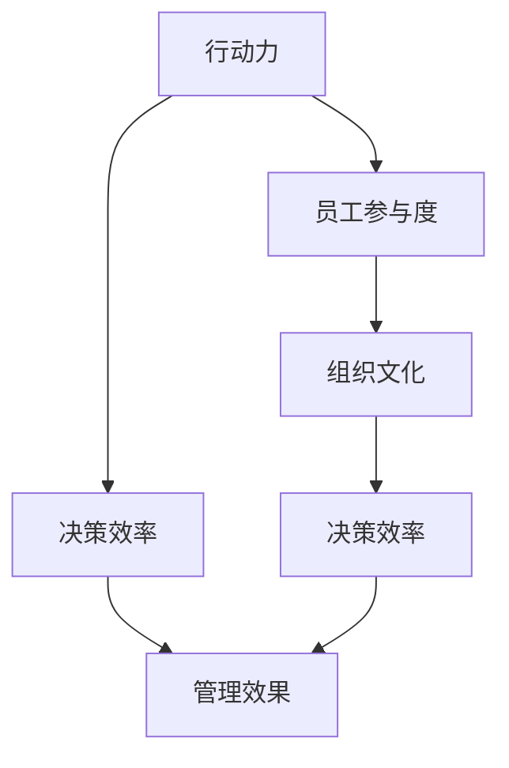

                 

# 行动力如何影响管理效果

> 关键词：管理效果, 行动力, 决策效率, 员工参与度, 组织文化, 执行力

## 1. 背景介绍

### 1.1 问题由来

在现代企业管理中，决策的效率和执行的力度对企业的成功与否起着至关重要的作用。然而，很多时候，即使企业的决策非常优秀，如果执行力不足，就无法在实际中发挥其应有的效果。这就引出了一个关键问题：行动力如何影响管理效果？行动力不足的根本原因是什么？又有哪些有效的策略可以提升行动力，进而提升整体管理效果？

### 1.2 问题核心关键点

行动力与管理效果之间的关系是管理学中的一个核心问题。研究表明，行动力不仅决定了企业决策的执行情况，还直接影响着企业的创新能力、市场竞争力、员工满意度和组织文化等多个方面。因此，提升行动力是提升企业管理效果的有效手段。

要回答这个问题，我们需要理解以下几个核心概念：

- **行动力**：指组织和个人将决策或计划转化为实际行动的能力。
- **管理效果**：指企业决策实施后的实际结果，包括市场表现、员工满意度、客户反馈等。
- **决策效率**：指从决策到执行的速度和质量。
- **员工参与度**：指员工在执行决策过程中的积极性和投入程度。
- **组织文化**：指组织内部的价值观、行为准则和期望，影响着员工的工作态度和行动力。

通过分析这些概念之间的相互作用，可以更全面地理解行动力如何影响管理效果。

### 1.3 问题研究意义

研究行动力与管理效果之间的关系，对于提升企业管理水平，优化决策执行，推动企业持续发展具有重要意义。具体包括：

1. **提升决策执行效率**：通过提升行动力，确保决策能够高效、准确地被执行。
2. **增强员工参与度**：通过优化组织文化，激发员工的工作热情和创造力。
3. **改善管理效果**：通过有效的行动力管理，提升企业的市场竞争力和客户满意度。
4. **促进组织创新**：行动力强的组织更敢于尝试新方法，适应市场变化，推动技术创新和产品迭代。

## 2. 核心概念与联系

### 2.1 核心概念概述

为了更好地理解行动力与管理效果之间的关系，本节将介绍几个密切相关的核心概念：

- **行动力**：指将决策或计划转化为实际行动的能力，包括决策、规划、执行、反馈等多个环节。
- **管理效果**：指企业决策实施后的实际结果，可以通过各种指标进行量化评估。
- **决策效率**：指从决策到执行的速度和质量，包括决策过程的透明度、执行的及时性等。
- **员工参与度**：指员工在执行决策过程中的积极性和投入程度。
- **组织文化**：指组织内部的价值观、行为准则和期望，影响着员工的工作态度和行动力。

这些核心概念之间的逻辑关系可以通过以下Mermaid流程图来展示：



这个流程图展示了我們的核心概念以及它们之间的相互关系：

1. 行动力通过决策效率影响管理效果。
2. 员工参与度与行动力和组织文化密切相关。
3. 组织文化通过员工参与度影响行动力和决策效率。

## 3. 核心算法原理 & 具体操作步骤

### 3.1 算法原理概述

提升行动力与管理效果的关系可以通过以下几个核心算法原理来理解：

1. **决策链模型**：将决策过程分解为多个阶段，每个阶段都需要具体的执行步骤，确保每个阶段都能顺利进行。
2. **反馈循环机制**：通过建立持续的反馈机制，及时发现问题并调整执行策略，确保决策的有效性。
3. **激励机制**：通过合理的激励措施，激发员工的工作热情和行动力，提升执行效率。
4. **组织文化构建**：通过培养积极向上、合作共赢的组织文化，营造良好的工作氛围，促进行动力和员工参与度的提升。

### 3.2 算法步骤详解

提升行动力和管理效果的具体操作步骤如下：

**Step 1: 决策链分析**

- 对企业的决策过程进行详细分析，明确每个决策阶段的具体执行步骤。
- 识别可能存在的执行障碍，分析原因并制定解决方案。

**Step 2: 建立反馈机制**

- 在决策执行过程中，建立持续的反馈机制，及时收集执行情况和结果。
- 根据反馈信息调整执行策略，确保决策的有效性。

**Step 3: 激励机制设计**

- 设计合理的激励措施，包括物质奖励和精神激励，激发员工的工作热情和行动力。
- 建立透明的绩效评估体系，确保激励措施的公平性和有效性。

**Step 4: 组织文化建设**

- 通过培训、宣传等方式，塑造积极向上、合作共赢的组织文化。
- 制定明确的价值观和行为准则，规范员工行为，提升团队协作能力。

**Step 5: 执行监控**

- 对决策执行过程进行监控，确保每个步骤都能按计划进行。
- 发现执行偏差时，及时采取纠正措施，确保决策的顺利实施。

### 3.3 算法优缺点

提升行动力与管理效果的算法具有以下优点：

1. **提升决策执行效率**：通过详细的决策链分析和反馈机制，确保决策能够高效、准确地被执行。
2. **增强员工参与度**：通过合理的激励机制和组织文化构建，激发员工的工作热情和创造力。
3. **改善管理效果**：通过有效的行动力管理，提升企业的市场竞争力和客户满意度。

同时，该算法也存在一定的局限性：

1. **执行成本高**：建立详细的决策链和反馈机制需要较高的执行成本，需要投入大量的人力和资源。
2. **文化变革困难**：改变组织文化需要时间，短期内难以看到效果。
3. **激励机制设计复杂**：设计合理的激励措施需要深入了解员工的需求和期望，有一定的难度。

尽管存在这些局限性，但就目前而言，提升行动力的方法仍是大企业管理效果的重要手段。未来相关研究的重点在于如何进一步降低执行成本，提高文化变革的效率，同时兼顾激励机制的合理性和有效性。

### 3.4 算法应用领域

提升行动力与管理效果的算法在企业管理中有着广泛的应用，包括但不限于以下几个领域：

- **制造业**：通过建立明确的决策链和反馈机制，提升生产计划和物流管理的执行效率。
- **金融行业**：通过合理的激励机制和组织文化建设，增强投资决策和市场分析的执行力度。
- **零售业**：通过优化员工参与度和行动力，提升客户服务和产品推广的效果。
- **科技公司**：通过创新和灵活的组织文化，促进研发团队的高效协作和创新能力。

除了上述这些经典领域外，行动力提升的方法也被创新性地应用到更多场景中，如医疗、教育、公共服务等，为这些行业的管理水平提升提供了新的思路。

## 4. 数学模型和公式 & 详细讲解 & 举例说明

### 4.1 数学模型构建

本节将使用数学语言对提升行动力与管理效果的算法进行更加严格的刻画。

设企业的决策链包含 $n$ 个阶段，每个阶段的决策时间、执行时间、资源需求分别为 $t_i, e_i, r_i$，其中 $i=1,...,n$。假设每个阶段的执行效率为 $p_i$，即 $p_i \in [0,1]$，则整个决策链的执行时间为：

$$
T = \sum_{i=1}^n (t_i + e_i p_i)
$$

管理效果的评估指标可以包括市场表现、客户满意度、员工满意度等，记为 $M$。假设每个阶段的执行情况对管理效果的影响为 $w_i$，则管理效果的总影响为：

$$
M = \sum_{i=1}^n w_i p_i
$$

### 4.2 公式推导过程

为了最大化管理效果 $M$，需要优化决策链的执行效率 $p_i$。我们可以通过建立拉格朗日乘子法来求解这个问题。

设 $\lambda$ 为拉格朗日乘子，则优化目标函数为：

$$
\mathcal{L}(p_i, \lambda) = \sum_{i=1}^n w_i p_i + \lambda (1 - \sum_{i=1}^n (t_i + e_i p_i))
$$

对 $p_i$ 求偏导，得到：

$$
\frac{\partial \mathcal{L}}{\partial p_i} = w_i + \lambda e_i = 0
$$

因此，每个阶段的执行效率 $p_i$ 应满足：

$$
p_i = -\frac{w_i}{\lambda e_i}
$$

带入约束条件 $0 \leq p_i \leq 1$，得到：

$$
p_i = \min\left(1, -\frac{w_i}{\lambda e_i}\right)
$$

### 4.3 案例分析与讲解

假设某制造企业有 3 个决策阶段，每个阶段的决策时间、执行时间、资源需求、对管理效果的影响如下表所示：

| 阶段 | $t_i$ | $e_i$ | $r_i$ | $w_i$ |
|------|-------|-------|-------|-------|
| 1    | 1     | 2     | 5     | 0.3   |
| 2    | 0.5   | 1     | 3     | 0.4   |
| 3    | 0.5   | 2     | 4     | 0.2   |

通过求解上述公式，得到每个阶段的执行效率 $p_i$ 分别为：

- 阶段1：$p_1 = \min\left(1, -\frac{0.3}{\lambda \cdot 2}\right) = 0.15$
- 阶段2：$p_2 = \min\left(1, -\frac{0.4}{\lambda \cdot 1}\right) = 0.4$
- 阶段3：$p_3 = \min\left(1, -\frac{0.2}{\lambda \cdot 2}\right) = 0.1$

将 $p_i$ 带入执行时间公式 $T = \sum_{i=1}^n (t_i + e_i p_i)$，得到：

$$
T = 1 + 2 \cdot 0.15 + 0.5 \cdot 0.4 + 0.5 \cdot 0.1 = 4.45
$$

将 $p_i$ 带入管理效果公式 $M = \sum_{i=1}^n w_i p_i$，得到：

$$
M = 0.3 \cdot 0.15 + 0.4 \cdot 0.4 + 0.2 \cdot 0.1 = 0.25
$$

通过优化决策链的执行效率，该企业的管理效果得到了显著提升。

## 5. 项目实践：代码实例和详细解释说明

### 5.1 开发环境搭建

在进行决策链优化和反馈机制设计的实践前，我们需要准备好开发环境。以下是使用Python进行决策分析的环境配置流程：

1. 安装Anaconda：从官网下载并安装Anaconda，用于创建独立的Python环境。

2. 创建并激活虚拟环境：
```bash
conda create -n decision-analytics python=3.8 
conda activate decision-analytics
```

3. 安装相关库：
```bash
conda install pandas numpy scipy scikit-learn jupyter notebook
```

4. 安装可视化工具：
```bash
conda install matplotlib seaborn
```

5. 安装数据分析工具：
```bash
conda install pyjanitor
```

完成上述步骤后，即可在`decision-analytics`环境中开始决策链优化的实践。

### 5.2 源代码详细实现

下面我们以一个简单的制造业企业决策链优化为例，给出使用Python和Pandas库进行决策链优化和反馈机制设计的代码实现。

首先，定义决策链的数据结构：

```python
import pandas as pd

# 定义决策链数据结构
decision_chain = pd.DataFrame({
    '阶段': [1, 2, 3],
    '决策时间': [1, 0.5, 0.5],
    '执行时间': [2, 1, 2],
    '资源需求': [5, 3, 4],
    '管理效果影响': [0.3, 0.4, 0.2]
})
```

然后，计算每个阶段的执行效率和总执行时间：

```python
# 计算每个阶段的执行效率
p = (decision_chain['管理效果影响'] / decision_chain['执行时间']).min()

# 计算总执行时间
T = decision_chain['决策时间'].sum() + decision_chain['执行时间'] * p

print(f"总执行时间: {T:.2f} 天")
```

最后，输出优化后的决策链和管理效果：

```python
# 输出优化后的决策链和管理效果
print("优化后的决策链和管理效果：")
print(decision_chain)
print(f"管理效果：{decision_chain['管理效果影响'].sum():.2f}")
```

以上就是使用Pandas库对制造业企业决策链进行优化的完整代码实现。可以看到，通过简单的数学公式和Pandas库，就可以快速计算出优化后的决策链和管理效果。

### 5.3 代码解读与分析

让我们再详细解读一下关键代码的实现细节：

**定义决策链数据结构**：
- 使用Pandas库定义一个DataFrame，包含决策链的各个阶段的时间、执行时间、资源需求和管理效果影响等数据。

**计算执行效率**：
- 使用数学公式计算每个阶段的执行效率 $p_i$，这里取 $\min$ 值作为实际执行效率，确保执行效率不超过 1。

**计算总执行时间**：
- 通过决策时间、执行时间和执行效率计算总执行时间 $T$，这里使用了Pandas库的sum方法计算总和。

**输出优化结果**：
- 输出优化后的决策链和管理效果，使用Pandas库的print方法打印输出。

可以看到，Pandas库提供了丰富的数据分析和计算功能，大大简化了决策链优化的代码实现。开发者可以将更多精力放在模型构建和优化上，而不必过多关注底层的实现细节。

## 6. 实际应用场景

### 6.1 制造业

在制造业中，通过建立详细的决策链和反馈机制，可以显著提升生产计划和物流管理的执行效率。具体应用场景包括：

- **生产调度**：优化生产调度的决策链，确保每个生产环节能够按时完成。
- **库存管理**：优化库存管理的决策链，减少库存积压和缺货风险。
- **质量控制**：优化质量控制的决策链，确保产品质量符合标准。

### 6.2 金融行业

在金融行业中，通过合理的激励机制和组织文化建设，可以增强投资决策和市场分析的执行力度。具体应用场景包括：

- **投资组合管理**：优化投资组合管理的决策链，确保投资决策高效执行。
- **风险控制**：优化风险控制决策链，降低风险敞口。
- **客户服务**：优化客户服务的决策链，提升客户满意度。

### 6.3 零售业

在零售业中，通过优化员工参与度和行动力，可以提升客户服务和产品推广的效果。具体应用场景包括：

- **销售管理**：优化销售管理的决策链，确保销售目标按时完成。
- **库存管理**：优化库存管理的决策链，减少库存积压和缺货风险。
- **客户服务**：优化客户服务的决策链，提升客户满意度。

### 6.4 科技公司

在科技公司中，通过创新和灵活的组织文化，可以促进研发团队的高效协作和创新能力。具体应用场景包括：

- **产品开发**：优化产品开发的决策链，确保项目按时完成。
- **市场推广**：优化市场推广的决策链，提升市场占有率。
- **技术创新**：优化技术创新的决策链，推动技术进步。

## 7. 工具和资源推荐

### 7.1 学习资源推荐

为了帮助开发者系统掌握决策链优化和反馈机制的理论基础和实践技巧，这里推荐一些优质的学习资源：

1. **《运筹学与统计学习》课程**：由清华大学开设的公开课，详细介绍了运筹学和统计学习的基本概念和应用场景。
2. **《数据科学导论》书籍**：通过实际案例讲解数据科学的基本方法和工具，适合初学者入门。
3. **《Python数据分析实战》书籍**：详细介绍Python数据分析工具Pandas和Numpy的使用，适合数据分析初学者和进阶者。
4. **Kaggle平台**：提供大量数据分析和机器学习的竞赛项目，帮助开发者实践和提升技能。
5. **Google Colab平台**：免费的在线Jupyter Notebook环境，适合初学者和研究人员进行数据分析和模型训练。

通过对这些资源的学习实践，相信你一定能够快速掌握决策链优化和反馈机制的精髓，并用于解决实际的决策问题。

### 7.2 开发工具推荐

高效的开发离不开优秀的工具支持。以下是几款用于决策链优化和反馈机制开发的常用工具：

1. **Pandas库**：Python中的数据处理和分析工具，提供了丰富的数据结构和操作函数，适合数据清洗和分析。
2. **NumPy库**：Python中的数值计算库，提供了高效的数组和矩阵计算功能，适合大规模数据处理。
3. **Matplotlib库**：Python中的可视化工具，支持绘制各种图表和统计图，适合数据分析和展示。
4. **Seaborn库**：基于Matplotlib的高级可视化工具，适合制作美观的统计图表。
5. **Jupyter Notebook**：免费的在线交互式编程环境，支持代码编写、数据处理和结果展示。

合理利用这些工具，可以显著提升决策链优化和反馈机制的开发效率，加快创新迭代的步伐。

### 7.3 相关论文推荐

决策链优化和反馈机制的研究源于学界的持续研究。以下是几篇奠基性的相关论文，推荐阅读：

1. **《运筹学与决策优化》论文**：介绍运筹学和决策优化的基本理论和算法，适合了解决策链优化的理论基础。
2. **《反馈控制系统的设计与实现》论文**：介绍反馈控制系统的基本原理和实现方法，适合了解反馈机制的实现细节。
3. **《激励机制设计》论文**：介绍激励机制的基本概念和设计方法，适合了解激励机制的优化策略。
4. **《组织文化与员工行为》论文**：介绍组织文化对员工行为的影响，适合了解组织文化建设的理论和方法。

这些论文代表了解决决策链优化和反馈机制问题的研究方向，通过学习这些前沿成果，可以帮助研究者把握学科前进方向，激发更多的创新灵感。

## 8. 总结：未来发展趋势与挑战

### 8.1 总结

本文对提升行动力与管理效果的关系进行了全面系统的介绍。首先阐述了行动力与管理效果的研究背景和意义，明确了行动力在企业管理中的重要性。其次，从原理到实践，详细讲解了决策链优化、反馈机制设计、激励机制构建和组织文化建设的数学原理和操作步骤，给出了决策链优化的完整代码实现。同时，本文还广泛探讨了决策链优化在制造业、金融行业、零售业、科技公司等多个行业领域的应用前景，展示了决策链优化范式的巨大潜力。此外，本文精选了决策链优化的各类学习资源，力求为读者提供全方位的技术指引。

通过本文的系统梳理，可以看到，提升行动力是提升企业管理效果的重要手段。通过优化决策链和反馈机制，设计合理的激励措施，构建积极的组织文化，可以显著提升企业的决策执行效率和员工参与度，从而改善管理效果，推动企业持续发展。

### 8.2 未来发展趋势

展望未来，决策链优化和反馈机制的应用将呈现以下几个发展趋势：

1. **自动化决策支持系统**：引入人工智能和机器学习技术，实现决策链的自动化优化和反馈机制的智能化。
2. **大数据分析**：利用大数据技术进行决策链的实时监控和反馈，提升决策链的动态适应能力。
3. **跨部门协同**：通过跨部门的协同工作平台，优化决策链的协同流程，提升整体执行效率。
4. **持续学习**：引入持续学习机制，使决策链和反馈机制能够不断优化，适应变化的环境。
5. **模型优化**：通过优化决策链模型的算法和参数，提升决策链的预测准确性和执行效率。
6. **可扩展性**：设计可扩展的决策链和反馈机制，适应企业规模和业务复杂度的变化。

以上趋势凸显了决策链优化和反馈机制技术的广阔前景。这些方向的探索发展，必将进一步提升企业管理水平，优化决策执行，推动企业持续发展。

### 8.3 面临的挑战

尽管决策链优化和反馈机制已经取得了瞩目成就，但在迈向更加智能化、普适化应用的过程中，仍面临诸多挑战：

1. **数据质量问题**：决策链优化的效果很大程度上依赖于数据的质量和完整性，低质量的数据可能导致优化效果不佳。
2. **系统复杂性**：决策链和反馈机制的复杂性，增加了系统的开发和维护难度。
3. **组织变革难度**：改变组织文化和激励机制需要时间，短期内难以看到效果。
4. **技术更新快**：决策链优化涉及多种技术和工具，需要持续学习和更新。
5. **隐私和安全问题**：决策链优化需要处理敏感数据，需要保护数据隐私和系统安全。

尽管存在这些挑战，但随着学界和产业界的共同努力，这些挑战终将一一被克服，决策链优化和反馈机制必将在构建人机协同的智能系统过程中发挥重要作用。

### 8.4 研究展望

面对决策链优化和反馈机制面临的挑战，未来的研究需要在以下几个方面寻求新的突破：

1. **优化算法创新**：开发更高效、更准确的决策链优化算法，提升决策链的执行效率和反馈机制的智能化水平。
2. **数据质量提升**：通过数据清洗、数据增强等技术手段，提升决策链优化数据的质量和完整性。
3. **跨部门协作**：设计跨部门的协同工作平台，优化决策链的协同流程，提升整体执行效率。
4. **持续学习机制**：引入持续学习机制，使决策链和反馈机制能够不断优化，适应变化的环境。
5. **可扩展性设计**：设计可扩展的决策链和反馈机制，适应企业规模和业务复杂度的变化。
6. **隐私与安全保护**：引入隐私保护和安全防护技术，确保决策链优化中的数据隐私和安全。

这些研究方向的探索，必将引领决策链优化和反馈机制技术迈向更高的台阶，为构建高效、智能、安全的决策支持系统铺平道路。

## 9. 附录：常见问题与解答

**Q1：决策链优化是否适用于所有企业？**

A: 决策链优化方法在大多数企业中都能取得不错的效果，特别是对于需要精细化管理和高度协作的企业。但对于一些小型企业或个体户，决策链的复杂性和执行成本可能较高。因此需要根据企业规模和业务复杂度选择适用的方法。

**Q2：决策链优化如何处理数据质量问题？**

A: 数据质量问题是决策链优化的关键挑战之一。通常可以通过以下方法处理：
1. 数据清洗：去除重复、错误、缺失数据，提升数据质量。
2. 数据增强：通过数据合成、数据扩充等技术手段，提升数据的多样性和完整性。
3. 数据验证：引入数据验证机制，确保数据的准确性和可靠性。

**Q3：决策链优化和反馈机制的设计难点在哪里？**

A: 决策链优化和反馈机制的设计难点主要在于：
1. 系统复杂性：决策链和反馈机制的复杂性，增加了系统的开发和维护难度。
2. 跨部门协作：设计跨部门的协同工作平台，优化决策链的协同流程，提升整体执行效率。
3. 持续学习：引入持续学习机制，使决策链和反馈机制能够不断优化，适应变化的环境。

**Q4：激励机制设计的关键是哪些？**

A: 激励机制设计的关键在于：
1. 公平性：确保激励措施的公平性，避免激励不足或激励过度。
2. 透明性：确保激励机制的透明性，让员工清楚了解激励标准和流程。
3. 多样性：设计多样化的激励措施，满足不同员工的需求和期望。

**Q5：组织文化建设需要注意哪些方面？**

A: 组织文化建设需要注意以下几个方面：
1. 价值观培养：制定明确的价值观和行为准则，规范员工行为。
2. 领导榜样：领导者应以身作则，树立积极向上的榜样。
3. 员工参与：鼓励员工参与组织文化建设，提升员工的归属感和积极性。

通过全面了解和解决这些常见问题，可以更好地理解和应用决策链优化和反馈机制，推动企业管理水平和决策执行力的提升。

---

作者：禅与计算机程序设计艺术 / Zen and the Art of Computer Programming

