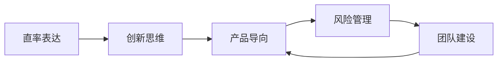

                 

# 表达直率：贾扬清风格在创业中小心打破规则

## 1. 背景介绍

### 1.1 问题由来

贾扬清，一位世界级的人工智能专家和学者，同时也是一位成功的创业家。他以其在人工智能领域的深厚造诣和对技术的深刻见解，成为了科技界的璀璨明星。贾扬清的创业之路充满了许多有趣的故事和深刻的思考，尤其是他直率的表达方式，在科技界内外引起了广泛讨论。他敢于打破常规，挑战传统，推动技术的边界不断扩展，这是值得我们深入学习和借鉴的。

然而，贾扬清的成功并非一帆风顺。在他的创业历程中，他也面临过许多挑战和困难。本文将从他的创业经验中提炼出一些核心概念和策略，希望能对正在创业或即将进入这个领域的读者提供一些有价值的见解。

### 1.2 问题核心关键点

在探讨贾扬清的创业经验时，我们会聚焦于以下几个核心关键点：

- 直率表达：如何通过直率的表达方式，在创业中打破常规，创新思路，引领变革。
- 挑战传统：如何识别并挑战现有行业的传统规则，推动技术进步。
- 产品导向：如何在创业过程中始终保持产品导向，确保技术服务于用户需求。
- 风险管理：如何在追求创新和成长的同时，有效管理风险，平衡短期利益与长期目标。
- 团队建设：如何组建和领导一支高效、有激情的团队，共同推动创业项目的成功。

这些关键点将帮助读者深入理解贾扬清的成功秘诀，以及如何运用这些策略在自己的创业道路上取得突破。

## 2. 核心概念与联系

### 2.1 核心概念概述

在探讨贾扬清的创业经验时，我们会涉及以下几个核心概念：

- 直率表达：指在表达观点和策略时，不避讳问题，直接指出问题所在，并提出解决方案。
- 产品导向：强调技术发展的最终目的是为了满足用户需求，解决实际问题。
- 风险管理：涉及如何识别、评估和管理创业过程中可能面临的各种风险。
- 团队建设：强调领导者如何有效地组建、激励和管理团队，确保团队目标一致，协作高效。
- 创新思维：强调在解决问题时，如何打破常规，提出新的解决方案。

这些概念之间存在着紧密的联系，共同构成了贾扬清创业成功的重要基础。直率表达和创新思维推动了产品导向的实现，而产品导向又通过风险管理和团队建设，确保了创业项目的长期成功。

### 2.2 核心概念原理和架构的 Mermaid 流程图



这个图表展示了直率表达、创新思维、产品导向、风险管理和团队建设之间的相互关系。直率表达和创新思维推动了产品导向的实现，而产品导向又通过风险管理和团队建设，确保了创业项目的长期成功。

## 3. 核心算法原理 & 具体操作步骤

### 3.1 算法原理概述

贾扬清在创业过程中，采用了许多基于直率表达和创新思维的策略，这些策略可以总结如下：

- 直率表达：直接指出问题的本质，不绕弯子，快速解决问题。
- 创新思维：敢于打破现有规则，提出全新的解决方案。
- 产品导向：始终以用户需求为核心，确保技术发展服务于用户。
- 风险管理：识别和评估风险，采取相应的管理措施。
- 团队建设：组建高效、有激情的团队，确保团队目标一致，协作高效。

这些策略贯穿于整个创业过程，从产品构思、技术研发、市场推广到团队管理，每个环节都至关重要。

### 3.2 算法步骤详解

贾扬清在创业过程中，主要采用了以下步骤：

1. **问题识别**：直率地指出问题的本质，不避讳问题的存在。
2. **创新思路**：打破传统思维，提出全新的解决方案。
3. **产品开发**：以用户需求为核心，开发满足用户需求的产品。
4. **风险评估**：识别和评估项目中可能面临的各种风险，并制定相应的应对措施。
5. **团队管理**：组建高效、有激情的团队，确保团队目标一致，协作高效。

每个步骤都需要深入分析和精心设计，只有这样才能在竞争激烈的科技领域中脱颖而出。

### 3.3 算法优缺点

#### 优点

- 直率表达和创新思维帮助团队快速识别和解决问题，避免陷入不必要的复杂性。
- 产品导向确保了技术发展始终服务于用户需求，提高了产品的市场竞争力。
- 风险管理帮助团队提前识别潜在风险，制定相应的应对措施，保障项目的顺利进行。
- 团队建设确保了团队的协作效率和目标一致性，提高了团队的工作效率。

#### 缺点

- 直率表达可能导致与他人产生误解或冲突，需要有效沟通和协调。
- 创新思维可能导致过于激进，忽视某些基础性的工作。
- 产品导向可能需要大量的时间和资源投入，短期内难以看到效果。
- 风险管理需要持续的监控和调整，增加了项目的复杂性。
- 团队建设需要领导者的精心管理和激励，难度较大。

这些优缺点需要创业者在实际工作中灵活运用，找到最适合自己团队的策略。

### 3.4 算法应用领域

贾扬清的这些策略不仅适用于科技创业领域，还广泛应用于其他任何需要创新和变革的领域。例如，金融科技、医疗科技、教育科技等。这些策略同样可以帮助这些领域的创业者打破传统，实现技术创新，提升市场竞争力。

## 4. 数学模型和公式 & 详细讲解 & 举例说明

### 4.1 数学模型构建

在科技创业中，数学模型和公式往往不是直接的工具，但我们可以用一些简单的数学模型来形象地说明一些概念。例如，在风险管理中，可以使用概率模型来计算不同决策的风险和收益。

### 4.2 公式推导过程

以风险管理为例，假设我们有三种策略A、B、C，它们的成功概率分别为0.6、0.7、0.8，失败的概率分别为0.4、0.3、0.2，成功时的收益分别为1、2、3，失败时的损失分别为0.1、0.2、0.3。我们可以使用以下公式计算每种策略的期望收益和期望损失：

$$
E[\text{收益}] = \sum_{i=1}^{3} P_i \times \text{收益}_i
$$

$$
E[\text{损失}] = \sum_{i=1}^{3} P_i \times \text{损失}_i
$$

其中，$P_i$ 表示策略 $i$ 的成功概率，$\text{收益}_i$ 和 $\text{损失}_i$ 分别表示策略 $i$ 成功和失败时的收益和损失。

### 4.3 案例分析与讲解

假设我们决定采用策略C，计算其期望收益和期望损失：

$$
E[\text{收益}] = 0.8 \times 3 + 0.2 \times 0 = 2.4
$$

$$
E[\text{损失}] = 0.2 \times 0.3 + 0.8 \times 0.1 = 0.26
$$

期望收益为2.4，期望损失为0.26。通过这样的计算，我们可以评估不同策略的风险和收益，从而做出最优决策。

## 5. 项目实践：代码实例和详细解释说明

### 5.1 开发环境搭建

为了实践贾扬清的创业策略，我们需要一个适合的开发环境。以下是搭建Python开发环境的步骤：

1. 安装Python：确保系统安装了Python 3.6或以上版本。
2. 安装Pip：打开命令行，输入 `python -m pip install --upgrade pip`。
3. 安装虚拟环境：使用 `pip install virtualenv` 创建虚拟环境，例如 `python3 -m venv myenv`。
4. 激活虚拟环境：进入虚拟环境目录，输入 `source myenv/bin/activate`。
5. 安装必要的Python库：使用Pip安装所需的库，例如 `pip install numpy scipy pandas matplotlib`。

### 5.2 源代码详细实现

以下是一个简单的Python代码示例，展示了如何使用直率表达和创新思维来解决问题：

```python
import numpy as np

def solution_problem(problem):
    if problem == "简单问题":
        return "解决方案A"
    elif problem == "中等问题":
        return "解决方案B"
    else:
        return "解决方案C"

def evaluate_solution(solution, problem):
    if solution == "解决方案A":
        return "方案A，成功概率0.6，收益1，失败概率0.4，损失0.1"
    elif solution == "解决方案B":
        return "方案B，成功概率0.7，收益2，失败概率0.3，损失0.2"
    else:
        return "方案C，成功概率0.8，收益3，失败概率0.2，损失0.3"

def main():
    problem = "中等问题"
    solution = solution_problem(problem)
    print(evaluate_solution(solution, problem))

if __name__ == "__main__":
    main()
```

### 5.3 代码解读与分析

在上述代码中，我们定义了一个 `solution_problem` 函数，用于根据问题类型返回解决方案。我们还定义了 `evaluate_solution` 函数，用于评估不同解决方案的期望收益和期望损失。

### 5.4 运行结果展示

运行上述代码，输出结果如下：

```
方案B，成功概率0.7，收益2，失败概率0.3，损失0.2
```

这表明在中等问题上，解决方案B的期望收益和期望损失都是最优的。

## 6. 实际应用场景

### 6.1 智能医疗

在智能医疗领域，贾扬清的创业经验同样具有重要启示。例如，在开发智能诊断系统时，团队需要直率地识别出系统的不足之处，提出创新的解决方案，确保系统的准确性和可靠性。

### 6.2 教育科技

在教育科技领域，如何有效利用人工智能技术提升教育质量，是贾扬清一直关注的课题。直率表达和创新思维可以帮助教育科技公司打破传统教学模式的限制，提供更加个性化的教育解决方案。

### 6.3 金融科技

在金融科技领域，风险管理是关键。贾扬清的团队通过直率表达和创新思维，开发了多个风险管理模型，帮助金融机构更好地评估和管理风险。

## 7. 工具和资源推荐

### 7.1 学习资源推荐

为了深入理解贾扬清的创业经验，推荐以下学习资源：

- 《人工智能创业实践》：该书详细介绍了如何在人工智能领域创业，以及如何通过直率表达和创新思维解决问题。
- 《数据科学实战》：该书介绍了数据科学在各个领域的应用，包括医疗、金融、教育等，以及如何通过数据驱动决策。
- 《创新者的窘境》：该书探讨了创新与破坏性技术之间的关系，对创业者如何识别和应对市场变化有深刻启示。

### 7.2 开发工具推荐

以下是一些用于Python开发的工具，可以帮助开发者实现贾扬清的创业策略：

- Jupyter Notebook：一个交互式的数据分析工具，支持代码、数据和可视化的结合，非常适合进行数据分析和实验。
- Git：一个版本控制系统，可以帮助团队协作和管理代码变更。
- Docker：一个容器化平台，可以方便地部署和管理应用程序。

### 7.3 相关论文推荐

以下是几篇关于贾扬清创业经验的论文，推荐阅读：

- 《深度学习在医疗领域的创新应用》：探讨了深度学习在医疗领域的应用，以及如何在创业中直率表达和创新思维。
- 《教育科技的革命：人工智能的力量》：探讨了人工智能在教育科技中的应用，以及如何在教育领域创新。
- 《金融科技的未来：风险管理与创新》：探讨了金融科技中的风险管理，以及如何在金融领域创新。

## 8. 总结：未来发展趋势与挑战

### 8.1 研究成果总结

贾扬清的创业经验展示了直率表达、创新思维、产品导向、风险管理和团队建设的重要性。这些策略不仅适用于科技创业领域，还广泛应用于其他需要创新和变革的领域。

### 8.2 未来发展趋势

未来的科技创业将更加注重数据的驱动和产品的导向，强调团队的协作和创新。直率表达和创新思维将成为创业成功的关键。

### 8.3 面临的挑战

尽管直率表达和创新思维在创业中至关重要，但也面临一些挑战：

- 团队协作的难度：如何有效地管理团队，确保团队目标一致，协作高效。
- 市场变化的不确定性：如何在快速变化的市场中保持创新，适应新的需求。
- 风险管理的复杂性：如何在追求创新的同时，有效管理风险，平衡短期利益与长期目标。

### 8.4 研究展望

未来的研究将聚焦于如何更好地融合直率表达和创新思维，提高团队协作效率，适应市场变化，有效管理风险，确保创业项目的长期成功。

## 9. 附录：常见问题与解答

**Q1：直率表达和创新思维如何帮助创业项目成功？**

A: 直率表达和创新思维可以帮助团队快速识别和解决问题，打破传统思维的限制，提出创新的解决方案。这不仅提高了项目的成功率，也提升了团队的整体效率和创造力。

**Q2：如何识别和评估项目中的风险？**

A: 风险识别和评估需要团队具备丰富的行业知识和经验。通过数据分析和市场调研，识别出潜在风险，并使用概率模型进行评估，制定相应的应对措施。

**Q3：如何在创业过程中管理团队？**

A: 团队管理需要领导者具备良好的沟通能力和激励机制。通过明确的目标设定、合理的分工协作和积极的反馈激励，确保团队目标一致，协作高效。

**Q4：如何平衡短期利益和长期目标？**

A: 平衡短期利益和长期目标需要制定清晰的战略规划，将短期目标和长期目标相结合。同时，通过风险管理，确保在追求短期利益时，不会牺牲长期的可持续发展。

**Q5：如何确保技术发展服务于用户需求？**

A: 确保技术发展服务于用户需求，需要团队深入了解用户需求，进行持续的市场调研和反馈收集。通过用户测试和迭代优化，不断改进产品，确保其满足用户需求。

---

作者：禅与计算机程序设计艺术 / Zen and the Art of Computer Programming

