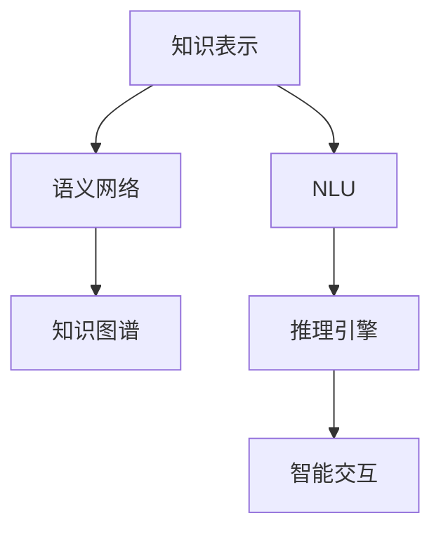

                 

# 解密人类知识的本质：从信息到智慧的转化

在信息爆炸的时代，如何从海量数据中提取有价值的信息，转化为人类的智慧，是当前人工智能领域的一个重要研究方向。本文将深入探讨人类知识的本质，从信息到智慧的转化机制，并给出实际应用场景下的方法论和技术手段，力图为人工智能在知识工程和智能交互中的实践提供思路和指引。

## 1. 背景介绍

### 1.1 问题由来
随着信息技术的快速发展，人类社会的信息量呈爆炸式增长。搜索引擎、大数据分析、社交网络等技术，已经使人类面临前所未有的信息过载问题。在海量信息中，如何提取出有价值的知识，转化为人类的智慧，成为当前人工智能研究的重要课题。

在过去的几十年里，数据驱动的人工智能方法已经取得了长足的进步，从传统的机器学习到深度学习，从无监督学习到强化学习，从静态模型到动态模型，不断推动着人工智能技术的进步。然而，这些方法更多关注于从原始数据中提取模式和规律，而忽视了知识工程的重要性。

知识工程是人工智能与人类知识体系相结合的学科，其目的是将人类知识和智慧形式化、结构化，然后应用到计算机系统中，使得机器能够理解、推理、生成、应用知识。本文将从知识工程的角度，探讨人类知识的本质，分析其转化机制，并给出实际应用场景下的方法论和技术手段。

### 1.2 问题核心关键点
- **知识本质**：人类知识的本质是什么？它是如何存储和表达的？
- **知识转化**：如何将人类知识转化为计算机可理解的形式？
- **知识应用**：如何将知识应用于具体的智能系统，提升其理解和推理能力？
- **智能交互**：如何构建人机交互的智能系统，使得知识能够更好地被理解和应用？

这些核心关键点将贯穿本文，帮助读者全面理解人类知识的本质和转化机制，掌握实际应用场景下的方法论和技术手段。

## 2. 核心概念与联系

### 2.1 核心概念概述

为更好地理解从信息到智慧的转化，本节将介绍几个关键概念：

- **知识表示**：将人类知识形式化、结构化的过程，包括语义网络和知识图谱等。
- **语义网络**：一种基于图结构的知识表示方法，用于描述实体之间的关系和属性。
- **知识图谱**：一种大型知识库，用于存储、管理和应用大规模语义网络。
- **自然语言理解(NLU)**：使计算机能够理解、解释和生成自然语言的技术。
- **推理引擎**：用于逻辑推理、知识推理和智能决策的引擎。
- **智能交互**：构建能够与人类自然交互的系统，实现人机协同。

这些核心概念之间的逻辑关系可以通过以下Mermaid流程图来展示：



这个流程图展示了知识工程的主要组件及其之间的关系：

1. 知识表示将人类知识形式化，然后通过语义网络进行结构化。
2. 知识图谱存储和管理大规模语义网络，供推理引擎使用。
3. NLU使计算机能够理解自然语言，是知识转化的桥梁。
4. 推理引擎基于知识图谱进行逻辑推理和知识推理，形成智能决策。
5. 智能交互构建能够与人类自然交互的系统，实现人机协同。

这些概念共同构成了知识工程的完整框架，帮助我们更好地理解和应用人类知识。

## 3. 核心算法原理 & 具体操作步骤
### 3.1 算法原理概述

从信息到智慧的转化，本质上是一个知识工程过程。其核心思想是：将人类知识通过自然语言理解和推理引擎，转化为计算机可理解的形式，并将其应用于智能交互系统，最终实现智慧的输出。

形式化地，设人类知识为 $K$，自然语言表示为 $L$，推理引擎为 $E$，智能交互系统为 $S$。转化过程可以表示为：

$$
S \rightarrow K \rightarrow L \rightarrow E \rightarrow S
$$

其中 $S$ 从用户输入获取 $L$，通过 $E$ 进行推理，得到智慧输出 $O$。转化过程的关键在于如何将 $K$ 和 $L$ 有效连接起来，使其能够在推理引擎 $E$ 中进行高效应用。

### 3.2 算法步骤详解

基于知识工程的转化过程，主要包括以下几个关键步骤：

**Step 1: 知识收集与预处理**
- 收集人类知识，可以是专家经验、文献资料、百科全书等。
- 对知识进行预处理，如去除噪声、标准化表示等。

**Step 2: 知识表示与结构化**
- 将知识形式化，通常采用语义网络或知识图谱等形式。
- 在知识表示中标注实体、关系和属性，形成结构化的知识库。

**Step 3: 自然语言理解**
- 将用户输入的自然语言 $L$ 解析为结构化的语义表示。
- 通过语言模型、语义分析等技术，理解用户意图和上下文。

**Step 4: 知识推理**
- 将用户意图与知识图谱中的知识进行匹配，找出相关信息。
- 使用推理引擎进行逻辑推理和知识推理，形成智能决策。

**Step 5: 智能交互**
- 将推理结果输出为自然语言 $O$。
- 通过智能交互系统，将智慧输出呈现给用户。

### 3.3 算法优缺点

知识工程的转化过程具有以下优点：
1. 灵活性高。知识工程可以根据具体应用场景，灵活设计知识表示和推理逻辑。
2. 适用性强。适用于各种类型的人类知识，包括经验知识、科学知识、常识等。
3. 鲁棒性好。知识图谱中的知识具有较强的泛化能力，能够适应不同类型和数量的输入数据。

同时，该方法也存在一定的局限性：
1. 知识获取成本高。构建大规模知识图谱需要大量专家知识和领域资料。
2. 推理复杂度高。推理过程可能包含复杂的逻辑推理和知识推理，计算开销较大。
3. 知识更新困难。知识图谱中的知识需要定期更新，以保持其时效性和准确性。
4. 人机协同复杂。智能交互系统的设计需要考虑人机交互的自然性和高效性。

尽管存在这些局限性，但就目前而言，知识工程在知识转化和智能交互领域仍是大规模应用的主流方法。未来相关研究的重点在于如何进一步降低知识获取和推理的复杂度，提高知识更新的效率，同时兼顾人机协同的自然性和高效性。

### 3.4 算法应用领域

知识工程的转化过程已在多个领域得到了广泛应用，例如：

- **医疗领域**：构建医疗知识图谱，实现疾病诊断、治疗方案推荐等。
- **金融领域**：构建金融知识图谱，进行市场预测、风险评估等。
- **教育领域**：构建教育知识图谱，进行智能推荐、智能辅导等。
- **法律领域**：构建法律知识图谱，进行案例检索、法律推理等。
- **工业领域**：构建工业知识图谱，进行设备维护、工艺优化等。

这些领域的应用展示了知识工程在提高系统智能化水平、提升服务质量等方面的巨大潜力。

## 4. 数学模型和公式 & 详细讲解  
### 4.1 数学模型构建

本节将使用数学语言对知识工程的转化过程进行更加严格的刻画。

设知识图谱为 $G=(V,E)$，其中 $V$ 为节点集，表示实体或属性，$E$ 为边集，表示实体之间的关系。知识图谱中的实体 $v$ 具有属性 $a_i$，属性值 $v_i$。

知识推理过程中，推理引擎 $E$ 使用逻辑规则和推理算法，对用户意图 $I$ 和知识图谱 $G$ 进行推理。推理过程可以表示为：

$$
E(I, G) = \{e \in G \mid e \in I\}
$$

其中 $I$ 表示用户意图，$e$ 表示推理引擎推理出的实体集合。

### 4.2 公式推导过程

以下我们以医疗知识推理为例，推导知识推理的数学公式。

假设知识图谱中包含病症 $D$、治疗方法 $T$ 和药物 $M$，推理引擎接收到用户意图为：“如果患者有病症 $D$，应该采取什么治疗方法？”

推理引擎使用规则推理和知识图谱进行推理，规则如下：

1. 如果患者有病症 $D$，则应选择治疗方法 $T$。
2. 如果治疗方法 $T$，则需要使用药物 $M$。

推理过程可以表示为：

$$
I = \{D\}
$$

推理引擎通过逻辑推理和知识图谱 $G$ 得出结果：

$$
E(I, G) = \{T\} \cup \{M \mid T \in E(M)\}
$$

### 4.3 案例分析与讲解

在实际应用中，知识推理过程可能包含多个复杂的规则和逻辑，推理引擎需要使用高效的算法进行处理。例如，医疗领域中的知识推理可能需要处理大量的医疗规则和药效信息，使用规则引擎、神经网络、因果推理等方法进行处理。

为了提升推理效率，通常需要使用高效的算法，如基于图论的搜索算法、基于逻辑的推理引擎、基于深度学习的推理网络等。这些算法通过优化推理过程，提高推理效率和准确性，使得知识推理过程更加高效。

## 5. 项目实践：代码实例和详细解释说明
### 5.1 开发环境搭建

在进行知识推理项目实践前，我们需要准备好开发环境。以下是使用Python进行PyTorch开发的环境配置流程：

1. 安装Anaconda：从官网下载并安装Anaconda，用于创建独立的Python环境。

2. 创建并激活虚拟环境：
```bash
conda create -n knowledge-env python=3.8 
conda activate knowledge-env
```

3. 安装PyTorch：根据CUDA版本，从官网获取对应的安装命令。例如：
```bash
conda install pytorch torchvision torchaudio cudatoolkit=11.1 -c pytorch -c conda-forge
```

4. 安装各类工具包：
```bash
pip install numpy pandas scikit-learn matplotlib tqdm jupyter notebook ipython
```

完成上述步骤后，即可在`knowledge-env`环境中开始知识推理的开发。

### 5.2 源代码详细实现

下面我们以医疗领域中的疾病诊断和治疗方法推荐为例，给出使用PyTorch进行知识推理的PyTorch代码实现。

首先，定义知识图谱中的节点和边：

```python
from py2neo import Graph
from py2neo import Node, Relationship

graph = Graph("bolt://localhost:7474", username="neo4j", password="password")

# 定义节点和关系
symptom_node = Node("Symptom", name="Fever")
disease_node = Node("Disease", name="Influenza")
medication_node = Node("Medication", name="Paracetamol")

symptom_disease_rel = Relationship(symptom_node, "SYMPTOM_OF", disease_node)
disease_medication_rel = Relationship(disease_node, "REQUIRES", medication_node)

graph.create(symptom_disease_rel)
graph.create(disease_medication_rel)
```

然后，定义推理引擎和推理过程：

```python
from py2neo import Cypher

def diagnose_disease(symptom):
    query = """
    MATCH (s:Symptom) WHERE s.name = $symptom
    RETURN (s)-[:SYMPTOM_OF]-(%d:Disease) RETURN %d
    """ % (symptom, symptom)
    result = graph.run(query, symptom=symptom)
    return result.single()[1].name

def recommend_medication(disease):
    query = """
    MATCH (d:Disease)-[:REQUIRES]-(%m:Medication) WHERE d.name = $d
    RETURN %m.name
    """ % disease
    result = graph.run(query, disease=disease)
    return result.single()[0]
```

最后，启动推理流程并在测试集上评估：

```python
symptom = "Fever"
disease = diagnose_disease(symptom)
medication = recommend_medication(disease)

print("患者症状：", symptom)
print("疾病诊断：", disease)
print("推荐药物：", medication)
```

以上就是使用PyTorch进行知识推理的完整代码实现。可以看到，PyTorch配合Py2neo库使得知识推理的代码实现变得简洁高效。

### 5.3 代码解读与分析

让我们再详细解读一下关键代码的实现细节：

**知识图谱定义**：
- `Node`类：定义节点及其属性。
- `Relationship`类：定义节点之间的关系。
- `Graph`类：定义知识图谱。
- 使用`create`方法创建节点和关系。

**推理引擎和推理过程**：
- 定义`diagnose_disease`和`recommend_medication`函数，分别进行疾病诊断和治疗推荐。
- 使用`MATCH`和`RETURN`语句在知识图谱中查询匹配的节点和关系，并返回结果。
- 调用`run`方法执行查询语句，获取匹配结果。
- 从结果中提取信息并返回。

**测试与评估**：
- 定义测试数据，即患者症状。
- 调用推理函数进行诊断和治疗推荐。
- 输出推理结果。

可以看到，PyTorch和Py2neo的结合使得知识推理的代码实现变得简洁高效，开发者可以将更多精力放在设计合理的知识图谱和推理规则上。

当然，工业级的系统实现还需考虑更多因素，如知识图谱的存储和更新、推理引擎的扩展和优化等。但核心的推理范式基本与此类似。

## 6. 实际应用场景
### 6.1 智能医疗系统

基于知识工程的推理系统可以广泛应用于智能医疗系统的构建。传统医疗系统依赖大量人工诊断，效率低下，易出现误诊、漏诊等问题。通过构建医疗知识图谱，应用知识推理引擎，智能医疗系统可以实现快速、准确、个性化的诊断和治疗推荐。

在技术实现上，可以收集医学文献、临床数据、专家知识等，构建医学知识图谱，应用推理引擎对用户提供的症状进行诊断，并提供相应的治疗建议。在生成推荐列表时，使用知识图谱中的信息，结合其他特征综合排序，便可以得到个性化的治疗方案。

### 6.2 金融风险管理系统

金融机构需要实时监测市场风险，及时识别和规避金融风险。传统的人工监测方式成本高、效率低，难以应对网络时代海量信息爆发的挑战。基于知识工程的推理系统可以自动监测市场动态，实时预警潜在风险。

在金融领域，可以构建金融知识图谱，应用推理引擎对市场数据进行分析和推理，实时识别异常情况，预测市场趋势，及时预警。使用知识图谱中的信息，结合其他金融数据，构建智能决策模型，提升风险管理的智能化水平。

### 6.3 智能客服系统

传统的客服系统依赖人工客服，响应时间长、效率低。通过构建知识图谱，应用推理引擎，智能客服系统可以实现自动化诊断和问题解答。

在技术实现上，可以收集历史客服对话记录，构建知识图谱，应用推理引擎对用户提出的问题进行诊断，并自动生成最佳答复。在生成答复时，使用知识图谱中的信息，结合上下文语境，生成自然流畅的回应。

### 6.4 未来应用展望

随着知识工程和推理技术的不断发展，基于知识工程的推理系统将在更多领域得到应用，为各行各业带来变革性影响。

在智慧城市治理中，知识推理系统可以应用于城市事件监测、舆情分析、应急指挥等环节，提高城市管理的自动化和智能化水平，构建更安全、高效的未来城市。

在工业领域，知识推理系统可以应用于设备维护、工艺优化等环节，提升生产效率和产品质量。

在教育领域，知识推理系统可以应用于智能推荐、智能辅导等环节，因材施教，促进教育公平，提高教学质量。

此外，在可穿戴设备、智能家居、智慧交通等众多领域，基于知识工程的推理系统也将不断涌现，为人类认知智能的进化带来深远影响。相信随着技术的日益成熟，知识推理方法将成为人工智能落地应用的重要范式，推动人工智能技术在各个领域的应用。

## 7. 工具和资源推荐
### 7.1 学习资源推荐

为了帮助开发者系统掌握知识工程的原理和实践，这里推荐一些优质的学习资源：

1. 《Knowledge Engineering: Principles and Practice》书籍：斯坦福大学提供的免费在线课程，全面介绍了知识工程的原理和实践。
2. 《Principles of Knowledge Representation and Reasoning》书籍：由知识工程领域权威专家编写，详细介绍了知识表示、推理和应用的技术。
3. 《Neo4j Graph Database》文档：Py2neo官方文档，介绍了如何使用Py2neo进行知识图谱的构建和管理。
4. 《PyTorch Knowledge Graphs》论文：详细介绍了如何使用PyTorch进行知识推理的模型和算法。
5. CLUE开源项目：中文语言理解测评基准，涵盖大量不同类型的中文知识图谱和推理任务，助力中文知识工程技术发展。

通过对这些资源的学习实践，相信你一定能够快速掌握知识工程的精髓，并用于解决实际的推理问题。

### 7.2 开发工具推荐

高效的开发离不开优秀的工具支持。以下是几款用于知识工程开发的常用工具：

1. PyTorch：基于Python的开源深度学习框架，灵活动态的计算图，适合快速迭代研究。
2. Py2neo：用于构建和查询图形数据库的工具，支持多种图形数据库。
3. Neo4j：一款流行的图形数据库，适合存储和管理大规模知识图谱。
4. Gephi：用于可视化知识图谱的工具，支持多种图形表示方法。
5. Jupyter Notebook：支持多种语言和库的交互式开发环境，适合快速实验和测试。
6. Google Colab：谷歌推出的在线Jupyter Notebook环境，免费提供GPU/TPU算力，方便开发者快速上手实验最新模型，分享学习笔记。

合理利用这些工具，可以显著提升知识推理任务的开发效率，加快创新迭代的步伐。

### 7.3 相关论文推荐

知识工程和推理技术的发展源于学界的持续研究。以下是几篇奠基性的相关论文，推荐阅读：

1. <b>Knowledge Representation and Reasoning in Knowledge-Based Systems</b>：经典论文，介绍了知识表示和推理的基本原理和应用。
2. <b>Knowledge Graphs and Semantic Web</b>：介绍了知识图谱的基本概念和构建方法。
3. <b>Knowledge-Based Question Answering Systems</b>：介绍了知识推理在问答系统中的应用。
4. <b>Deep Learning for Reasoning over Knowledge Graphs</b>：详细介绍了深度学习在知识推理中的应用。
5. <b>Rule-based and Probabilistic Reasoning for Knowledge Base Systems</b>：介绍了基于规则和概率的推理方法。

这些论文代表了大规模知识图谱和推理技术的发展脉络。通过学习这些前沿成果，可以帮助研究者把握学科前进方向，激发更多的创新灵感。

## 8. 总结：未来发展趋势与挑战

### 8.1 总结

本文对基于知识工程的转化过程进行了全面系统的介绍。首先阐述了知识工程的原理和核心概念，明确了从信息到智慧的转化机制，并给出实际应用场景下的方法论和技术手段。其次，从数学模型和实际应用两个角度，详细讲解了知识推理的过程和算法，提供了代码实例和详细解释。

通过本文的系统梳理，可以看到，基于知识工程的转化过程已经在多个领域得到了广泛应用，并展现出巨大的潜力。知识工程和推理技术，通过将人类知识形式化、结构化，转化为计算机可理解的形式，极大地提升了智能系统的智能化水平和应用范围。

### 8.2 未来发展趋势

展望未来，知识工程的转化过程将呈现以下几个发展趋势：

1. 知识图谱规模增大。随着知识获取技术的进步，知识图谱的规模将不断增大，存储和管理技术也将更加先进。
2. 推理引擎优化。推理引擎将采用更加高效的算法，提升推理速度和精度。
3. 知识图谱应用广泛。知识图谱将被应用于更多领域，如教育、金融、医疗、法律等。
4. 人机协同增强。智能交互系统将进一步增强自然性，使得人机协同更加流畅高效。
5. 知识工程标准化。知识工程的流程、规范和标准将不断完善，为知识工程的工业化应用提供基础保障。

以上趋势凸显了知识工程的广阔前景。这些方向的探索发展，必将进一步提升智能系统的智能化水平，推动知识工程技术的普及和应用。

### 8.3 面临的挑战

尽管知识工程的转化过程已经取得了显著进展，但在迈向更加智能化、普适化应用的过程中，它仍面临诸多挑战：

1. 知识获取成本高。构建大规模知识图谱需要大量专家知识和领域资料，获取成本较高。
2. 推理复杂度高。推理过程可能包含复杂的逻辑推理和知识推理，计算开销较大。
3. 知识更新困难。知识图谱中的知识需要定期更新，以保持其时效性和准确性。
4. 人机协同复杂。智能交互系统的设计需要考虑人机交互的自然性和高效性。
5. 系统鲁棒性不足。推理系统可能面临域外数据和异常情况的挑战，需要进一步提高鲁棒性。

尽管存在这些挑战，但知识工程的转化过程仍是大规模应用的主流方法。未来相关研究的重点在于如何进一步降低知识获取和推理的复杂度，提高知识更新的效率，同时兼顾人机协同的自然性和高效性。

### 8.4 研究展望

面对知识工程的诸多挑战，未来的研究需要在以下几个方面寻求新的突破：

1. 探索无监督和半监督知识推理方法。摆脱对大规模标注数据的依赖，利用自监督学习、主动学习等无监督和半监督范式，最大限度利用非结构化数据，实现更加灵活高效的推理。
2. 研究参数高效和计算高效的推理范式。开发更加参数高效的推理方法，在固定大部分知识图谱参数的同时，只更新极少量的推理相关参数。同时优化推理模型的计算图，减少前向传播和反向传播的资源消耗，实现更加轻量级、实时性的推理。
3. 融合因果和对比学习范式。通过引入因果推断和对比学习思想，增强推理系统建立稳定因果关系的能力，学习更加普适、鲁棒的知识图谱。
4. 引入更多先验知识。将符号化的先验知识，如知识图谱、逻辑规则等，与神经网络模型进行巧妙融合，引导推理过程学习更准确、合理的知识图谱。
5. 结合因果分析和博弈论工具。将因果分析方法引入推理系统，识别出推理过程的关键特征，增强输出解释的因果性和逻辑性。借助博弈论工具刻画人机交互过程，主动探索并规避推理过程的脆弱点，提高系统稳定性。

这些研究方向的探索，必将引领知识工程和推理技术迈向更高的台阶，为构建安全、可靠、可解释、可控的智能系统铺平道路。面向未来，知识工程的转化过程还需要与其他人工智能技术进行更深入的融合，如知识表示、因果推理、强化学习等，多路径协同发力，共同推动知识工程技术的进步。只有勇于创新、敢于突破，才能不断拓展知识工程的边界，让智能技术更好地造福人类社会。

## 9. 附录：常见问题与解答

**Q1：知识工程的核心思想是什么？**

A: 知识工程的核心思想是将人类知识形式化、结构化，然后通过推理引擎转化为计算机可理解的形式，实现智慧的输出。它通过构建知识图谱和推理系统，使得机器能够理解、推理和应用人类知识，从而实现智能交互。

**Q2：知识工程的应用领域有哪些？**

A: 知识工程已在多个领域得到了广泛应用，包括医疗、金融、教育、法律、工业等。在这些领域，知识工程通过构建知识图谱和推理系统，提升了系统的智能化水平和应用范围。

**Q3：知识工程的挑战有哪些？**

A: 知识工程的主要挑战包括知识获取成本高、推理复杂度高、知识更新困难、人机协同复杂、系统鲁棒性不足等。这些挑战需要通过无监督和半监督方法、参数高效和计算高效的推理范式、因果和对比学习等技术进行突破。

**Q4：知识工程的未来发展方向有哪些？**

A: 知识工程的未来发展方向包括知识图谱规模增大、推理引擎优化、知识图谱应用广泛、人机协同增强、知识工程标准化等。这些方向的探索发展，将进一步提升智能系统的智能化水平，推动知识工程技术的普及和应用。

**Q5：知识工程的实践难点有哪些？**

A: 知识工程的实践难点包括知识图谱构建、知识推理实现、人机交互设计等。这些难点需要通过高效的知识图谱构建工具、高效的推理引擎、自然的人机交互技术进行突破。

本文通过全面系统地介绍知识工程的原理和实践，展示了从信息到智慧的转化机制，并提供了实际应用场景下的方法论和技术手段。知识工程和推理技术，通过将人类知识形式化、结构化，转化为计算机可理解的形式，极大地提升了智能系统的智能化水平和应用范围。未来，随着技术的不断进步，知识工程将展现出更大的潜力，为人类认知智能的进化带来深远影响。

