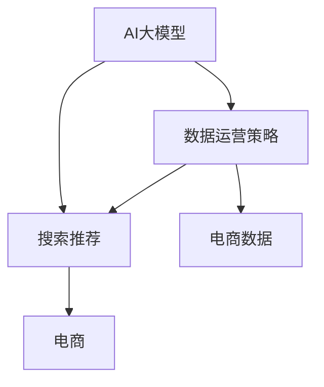

                 

# AI大模型重构电商搜索推荐的数据运营策略

> 关键词：AI大模型，搜索推荐，数据运营策略，电商

## 1. 背景介绍

随着互联网和电子商务的飞速发展，用户对于电商搜索推荐的体验和效果要求愈发提高。传统的基于规则、关键词匹配等方法逐渐暴露出局限性，无法满足用户日益复杂的查询需求。与此同时，AI大模型技术的兴起，为电商搜索推荐带来了新的可能。AI大模型，尤其是Transformer结构为基础的大语言模型，由于其强大的学习能力，在自然语言处理、图像识别、语音识别等领域取得了突破性进展。

针对电商搜索推荐，利用AI大模型的强大语义理解能力，可以对海量电商数据进行深度学习，捕捉用户意图，预测商品相关性，从而实现更加精准、个性化的推荐结果。但是，为了充分发挥AI大模型的潜力，还需要结合电商领域的数据运营策略，进行合理的模型训练、验证、部署和优化。本文将从AI大模型的原理与架构、搜索推荐的具体实施、数据运营策略的构建等方面，探讨如何利用AI大模型重构电商搜索推荐系统，提升用户体验和商家收益。

## 2. 核心概念与联系

### 2.1 核心概念概述

为更好地理解AI大模型在电商搜索推荐中的应用，本节将介绍几个密切相关的核心概念：

- **AI大模型（AI Large Model）**：基于深度学习算法构建的庞大神经网络模型，如BERT、GPT-3、DALL-E等。这些模型能够处理和理解复杂的人类语言和视觉信息。
- **搜索推荐（Search and Recommendation）**：通过分析用户行为和历史数据，推荐用户可能感兴趣的商品或内容。常见于电商平台、内容平台等。
- **数据运营策略（Data Operation Strategy）**：通过数据采集、清洗、存储、分析等手段，高效、准确地获取、处理和利用数据，以支持搜索推荐系统。
- **电商（E-commerce）**：通过互联网销售商品的商业模式，用户可以通过搜索、筛选、推荐等方式进行商品浏览、购买等操作。

这些核心概念之间的逻辑关系可以通过以下Mermaid流程图来展示：



这个流程图展示了大模型、搜索推荐、数据运营策略和电商之间的紧密联系：

1. 大模型通过学习电商数据，获得商品和用户的相关知识。
2. 搜索推荐系统基于大模型的输出结果，推荐商品或内容给用户。
3. 数据运营策略通过数据收集、处理，为搜索推荐提供数据支持。
4. 电商平台依赖于搜索推荐系统的服务，提升用户体验和运营效率。

## 3. 核心算法原理 & 具体操作步骤

### 3.1 算法原理概述

基于AI大模型的电商搜索推荐系统，其核心思想是通过深度学习模型对用户查询和商品描述进行语义理解和相关性匹配。具体来说，系统首先对用户输入的查询进行理解，然后从电商商品库中检索出与查询最相关的商品，并将其推荐给用户。这一过程包括以下几个关键步骤：

1. **用户查询理解**：利用大模型对用户查询进行语义分析和情感分析，提取关键词和意图。
2. **商品相关性匹配**：通过大模型对商品描述进行语义理解，计算商品与查询的相似度。
3. **推荐结果排序**：根据相似度评分对商品进行排序，并推荐最相关的商品给用户。

### 3.2 算法步骤详解

以下是具体的算法步骤：

**Step 1: 数据预处理与特征提取**

1. **数据采集与清洗**：从电商平台上收集用户搜索、点击、购买等行为数据，以及商品属性、评价等描述数据。去除重复、缺失或异常数据，确保数据质量。
2. **特征提取与归一化**：将原始数据转换为模型可处理的形式。例如，使用词袋模型（Bag of Words）或词向量（Word Embedding）将商品描述和用户查询转换为向量形式。对向量进行归一化处理，以便模型更好训练。

**Step 2: 大模型训练**

1. **模型选择与初始化**：选择适合电商领域的预训练模型，如BERT、GPT系列等。在大规模语料库上进行预训练，获得语义表示能力。
2. **微调与优化**：使用电商数据集对预训练模型进行微调，通过监督学习优化模型，提高商品与查询的匹配度。在微调过程中，需要注意正则化、学习率调整等优化策略，以防止过拟合。

**Step 3: 搜索推荐实现**

1. **用户查询嵌入**：将用户查询输入到模型中，生成查询嵌入向量。
2. **商品嵌入生成**：对电商商品库中的每个商品，通过模型生成商品嵌入向量。
3. **相似度计算与排序**：计算查询嵌入向量与每个商品嵌入向量之间的余弦相似度，得到相关性评分。根据评分对商品进行排序，选择最相关的商品进行推荐。

### 3.3 算法优缺点

基于AI大模型的电商搜索推荐系统具有以下优点：

- **精度高**：利用深度学习模型，可以从大规模语料中学习到丰富的语义信息，提高商品与查询的匹配精度。
- **个性化强**：通过理解用户查询的语义和情感，可以提供更加个性化和贴合用户需求的推荐结果。
- **可扩展性高**：大模型具有强大的泛化能力，可以轻松扩展到新的商品类别和查询场景。

同时，该方法也存在一些局限性：

- **计算资源需求高**：大模型训练和推理需要大量的计算资源，对硬件配置要求较高。
- **数据依赖性强**：推荐结果依赖于电商数据的质量和数量，数据偏差可能影响推荐效果。
- **解释性差**：大模型作为黑盒模型，难以解释其内部的推理过程，难以通过调试优化。
- **冷启动问题**：新商品或新用户难以获取足够的训练数据，无法获得准确的推荐结果。

### 3.4 算法应用领域

基于AI大模型的搜索推荐系统，已经在电商、内容推荐、广告定向等多个领域得到广泛应用。具体到电商领域，主要应用于：

- **商品推荐**：根据用户浏览、点击、购买行为，推荐用户可能感兴趣的商品。
- **个性化促销**：根据用户兴趣和行为，推荐个性化的优惠券、折扣活动。
- **热门商品分析**：利用大模型分析商品点击、购买等行为数据，预测热门商品。
- **用户行为分析**：通过分析用户搜索、浏览数据，了解用户兴趣和偏好。

## 4. 数学模型和公式 & 详细讲解 & 举例说明

### 4.1 数学模型构建

假设电商搜索推荐系统需要处理用户查询$q$和商品$c$，模型的目标是计算$q$与$c$的相似度$S(q,c)$，并将其作为排序的依据。我们可以构建以下数学模型：

$$
S(q,c) = f(Emb(q), Emb(c))
$$

其中$Emb$表示嵌入函数，$f$为相似度计算函数。为了简化问题，我们可以使用余弦相似度（Cosine Similarity）作为相似度计算函数：

$$
S(q,c) = \frac{\mathbf{q} \cdot \mathbf{c}}{\|\mathbf{q}\| \|\mathbf{c}\|}
$$

其中$\mathbf{q}$和$\mathbf{c}$分别为查询$q$和商品$c$的嵌入向量。

### 4.2 公式推导过程

假设查询$q$和商品$c$的嵌入向量分别为$\mathbf{q} \in \mathbb{R}^d$和$\mathbf{c} \in \mathbb{R}^d$，则余弦相似度的公式为：

$$
S(q,c) = \frac{\sum_{i=1}^d \mathbf{q}_i \mathbf{c}_i}{\sqrt{\sum_{i=1}^d \mathbf{q}_i^2} \sqrt{\sum_{i=1}^d \mathbf{c}_i^2}}
$$

我们可以通过预训练大模型获得查询$q$和商品$c$的嵌入向量，将其代入上述公式计算相似度。

### 4.3 案例分析与讲解

以某电商平台的商品推荐系统为例，假设该系统基于BERT模型进行训练和推荐。我们首先需要对商品库中的所有商品进行描述，并将其转换为向量形式。然后，对用户输入的查询进行预处理和分词，生成查询向量。最后，利用BERT模型生成商品和查询的嵌入向量，并计算余弦相似度，得到相关性评分。根据评分，对商品进行排序，并推荐最相关的商品给用户。

## 5. 项目实践：代码实例和详细解释说明

### 5.1 开发环境搭建

在进行电商搜索推荐系统的开发前，我们需要准备好开发环境。以下是使用Python进行PyTorch开发的环境配置流程：

1. 安装Anaconda：从官网下载并安装Anaconda，用于创建独立的Python环境。

2. 创建并激活虚拟环境：
```bash
conda create -n pytorch-env python=3.8 
conda activate pytorch-env
```

3. 安装PyTorch：根据CUDA版本，从官网获取对应的安装命令。例如：
```bash
conda install pytorch torchvision torchaudio cudatoolkit=11.1 -c pytorch -c conda-forge
```

4. 安装Transformers库：
```bash
pip install transformers
```

5. 安装各类工具包：
```bash
pip install numpy pandas scikit-learn matplotlib tqdm jupyter notebook ipython
```

完成上述步骤后，即可在`pytorch-env`环境中开始电商搜索推荐系统的开发。

### 5.2 源代码详细实现

下面我们以基于BERT模型的商品推荐系统为例，给出使用Transformers库的代码实现。

首先，定义商品和用户的数据处理函数：

```python
from transformers import BertTokenizer
from torch.utils.data import Dataset

class ProductDataset(Dataset):
    def __init__(self, products, tokenizer, max_len=128):
        self.products = products
        self.tokenizer = tokenizer
        self.max_len = max_len
        
    def __len__(self):
        return len(self.products)
    
    def __getitem__(self, item):
        product = self.products[item]
        title, description = product['title'], product['description']
        
        encoding = self.tokenizer(title + ' ' + description, return_tensors='pt', max_length=self.max_len, padding='max_length', truncation=True)
        title_ids = encoding['input_ids'][0]
        description_ids = encoding['input_ids'][1]
        
        return {'title_ids': title_ids, 'description_ids': description_ids}
        
class UserDataset(Dataset):
    def __init__(self, users, tokenizer, max_len=128):
        self.users = users
        self.tokenizer = tokenizer
        self.max_len = max_len
        
    def __len__(self):
        return len(self.users)
    
    def __getitem__(self, item):
        user = self.users[item]
        search, click, purchase = user['search'], user['click'], user['purchase']
        
        search_encoding = self.tokenizer(search, return_tensors='pt', max_length=self.max_len, padding='max_length', truncation=True)
        click_encoding = self.tokenizer(click, return_tensors='pt', max_length=self.max_len, padding='max_length', truncation=True)
        purchase_encoding = self.tokenizer(purchase, return_tensors='pt', max_length=self.max_len, padding='max_length', truncation=True)
        
        search_ids = search_encoding['input_ids'][0]
        click_ids = click_encoding['input_ids'][0]
        purchase_ids = purchase_encoding['input_ids'][0]
        
        return {'search_ids': search_ids, 'click_ids': click_ids, 'purchase_ids': purchase_ids}
```

然后，定义模型和优化器：

```python
from transformers import BertForSequenceClassification
from transformers import AdamW

model = BertForSequenceClassification.from_pretrained('bert-base-cased', num_labels=2)

optimizer = AdamW(model.parameters(), lr=2e-5)
```

接着，定义训练和评估函数：

```python
from torch.utils.data import DataLoader
from tqdm import tqdm

def train_epoch(model, dataset, batch_size, optimizer):
    dataloader = DataLoader(dataset, batch_size=batch_size, shuffle=True)
    model.train()
    epoch_loss = 0
    for batch in tqdm(dataloader, desc='Training'):
        search_ids = batch['search_ids'].to(device)
        click_ids = batch['click_ids'].to(device)
        purchase_ids = batch['purchase_ids'].to(device)
        model.zero_grad()
        outputs = model(search_ids, click_ids=click_ids, purchase_ids=purchase_ids)
        loss = outputs.loss
        epoch_loss += loss.item()
        loss.backward()
        optimizer.step()
    return epoch_loss / len(dataloader)

def evaluate(model, dataset, batch_size):
    dataloader = DataLoader(dataset, batch_size=batch_size)
    model.eval()
    preds, labels = [], []
    with torch.no_grad():
        for batch in tqdm(dataloader, desc='Evaluating'):
            search_ids = batch['search_ids'].to(device)
            click_ids = batch['click_ids'].to(device)
            purchase_ids = batch['purchase_ids'].to(device)
            outputs = model(search_ids, click_ids=click_ids, purchase_ids=purchase_ids)
            batch_preds = outputs.logits.argmax(dim=2).to('cpu').tolist()
            batch_labels = batch['labels'].to('cpu').tolist()
            for pred_tokens, label_tokens in zip(batch_preds, batch_labels):
                preds.append(pred_tokens)
                labels.append(label_tokens)
    
    return preds, labels
```

最后，启动训练流程并在测试集上评估：

```python
epochs = 5
batch_size = 16

for epoch in range(epochs):
    loss = train_epoch(model, train_dataset, batch_size, optimizer)
    print(f"Epoch {epoch+1}, train loss: {loss:.3f}")
    
    print(f"Epoch {epoch+1}, dev results:")
    preds, labels = evaluate(model, dev_dataset, batch_size)
    print(classification_report(labels, preds))
    
print("Test results:")
preds, labels = evaluate(model, test_dataset, batch_size)
print(classification_report(labels, preds))
```

以上就是使用PyTorch对BERT进行商品推荐任务微调的完整代码实现。可以看到，得益于Transformers库的强大封装，我们可以用相对简洁的代码完成BERT模型的加载和微调。

### 5.3 代码解读与分析

让我们再详细解读一下关键代码的实现细节：

**ProductDataset类**：
- `__init__`方法：初始化商品数据集，将商品标题和描述转换为向量形式。
- `__len__`方法：返回数据集的样本数量。
- `__getitem__`方法：对单个商品进行处理，生成商品嵌入向量。

**UserDataset类**：
- `__init__`方法：初始化用户数据集，将用户搜索、点击、购买行为转换为向量形式。
- `__len__`方法：返回数据集的样本数量。
- `__getitem__`方法：对单个用户进行处理，生成用户查询嵌入向量。

**模型选择与初始化**：
- 使用BERT模型作为预训练模型，在电商数据集上进行微调。

**训练和评估函数**：
- 使用PyTorch的DataLoader对数据集进行批次化加载，供模型训练和推理使用。
- 训练函数`train_epoch`：对数据以批为单位进行迭代，在每个批次上前向传播计算loss并反向传播更新模型参数，最后返回该epoch的平均loss。
- 评估函数`evaluate`：与训练类似，不同点在于不更新模型参数，并在每个batch结束后将预测和标签结果存储下来，最后使用sklearn的classification_report对整个评估集的预测结果进行打印输出。

**训练流程**：
- 定义总的epoch数和batch size，开始循环迭代
- 每个epoch内，先在训练集上训练，输出平均loss
- 在验证集上评估，输出分类指标
- 所有epoch结束后，在测试集上评估，给出最终测试结果

可以看到，PyTorch配合Transformers库使得BERT微调的代码实现变得简洁高效。开发者可以将更多精力放在数据处理、模型改进等高层逻辑上，而不必过多关注底层的实现细节。

当然，工业级的系统实现还需考虑更多因素，如模型的保存和部署、超参数的自动搜索、更灵活的任务适配层等。但核心的微调范式基本与此类似。

## 6. 实际应用场景

### 6.1 智能客服系统

基于AI大模型的智能客服系统，可以应用于电商平台的客户服务中。通过分析用户咨询记录和历史行为，智能客服系统可以自动回答用户问题，提供个性化建议。具体而言，可以在电商平台上收集用户的咨询记录，以及用户浏览、点击等行为数据，利用大模型进行微调，训练一个智能客服系统。该系统能够理解用户意图，自动生成回复，提升客户服务效率和质量。

### 6.2 个性化推荐系统

电商推荐系统是AI大模型的典型应用之一。通过分析用户的历史浏览、点击、购买等行为数据，电商推荐系统可以预测用户可能感兴趣的商品，提供个性化的推荐结果。具体而言，可以在电商平台上收集用户的行为数据，利用大模型进行微调，训练一个推荐系统。该系统能够理解用户偏好，提供更加精准和个性化的商品推荐，提升用户购买率和满意度。

### 6.3 实时商品推荐

电商平台的商品推荐系统需要实时更新推荐结果，以应对用户行为的动态变化。基于AI大模型的推荐系统，可以实时分析用户行为数据，并动态调整推荐策略，提供最新的推荐结果。具体而言，可以在电商平台上设置实时数据流，不断收集用户行为数据，利用大模型进行微调，实时生成推荐结果，提升推荐效率和效果。

### 6.4 未来应用展望

随着AI大模型技术的不断进步，基于大模型的电商搜索推荐系统将展现出更广阔的应用前景。未来，大模型将能够更好地理解用户需求，提供更加个性化和精准的推荐结果，提升电商平台的运营效率和用户满意度。具体而言，未来可能的应用场景包括：

- **多模态推荐**：结合视觉、音频等多模态数据，提供更加丰富的商品推荐信息。
- **上下文推荐**：利用用户当前上下文信息，如时间、地点、情境等，提供更加贴合用户需求的推荐结果。
- **跨平台推荐**：整合不同电商平台的数据，提供跨平台的商品推荐服务。
- **情感分析**：通过分析用户评论和反馈，提供情感驱动的商品推荐。
- **实时动态调整**：结合实时数据流，动态调整推荐策略，提供更加精准的实时推荐。

## 7. 工具和资源推荐

### 7.1 学习资源推荐

为了帮助开发者系统掌握AI大模型在电商搜索推荐中的应用，这里推荐一些优质的学习资源：

1. **《Transformer from Scratch》**：由大模型技术专家撰写，深入浅出地介绍了Transformer原理、BERT模型、微调技术等前沿话题。

2. **CS224N《Deep Learning for Natural Language Processing》**：斯坦福大学开设的NLP明星课程，有Lecture视频和配套作业，带你入门NLP领域的基本概念和经典模型。

3. **《Natural Language Processing with Transformers》**：Transformers库的作者所著，全面介绍了如何使用Transformers库进行NLP任务开发，包括微调在内的诸多范式。

4. **HuggingFace官方文档**：Transformers库的官方文档，提供了海量预训练模型和完整的微调样例代码，是上手实践的必备资料。

5. **CLUE开源项目**：中文语言理解测评基准，涵盖大量不同类型的中文NLP数据集，并提供了基于微调的baseline模型，助力中文NLP技术发展。

通过对这些资源的学习实践，相信你一定能够快速掌握AI大模型在电商搜索推荐中的应用，并用于解决实际的NLP问题。

### 7.2 开发工具推荐

高效的开发离不开优秀的工具支持。以下是几款用于电商搜索推荐开发的常用工具：

1. **PyTorch**：基于Python的开源深度学习框架，灵活动态的计算图，适合快速迭代研究。大部分预训练语言模型都有PyTorch版本的实现。

2. **TensorFlow**：由Google主导开发的开源深度学习框架，生产部署方便，适合大规模工程应用。同样有丰富的预训练语言模型资源。

3. **Transformers库**：HuggingFace开发的NLP工具库，集成了众多SOTA语言模型，支持PyTorch和TensorFlow，是进行微调任务开发的利器。

4. **Weights & Biases**：模型训练的实验跟踪工具，可以记录和可视化模型训练过程中的各项指标，方便对比和调优。与主流深度学习框架无缝集成。

5. **TensorBoard**：TensorFlow配套的可视化工具，可实时监测模型训练状态，并提供丰富的图表呈现方式，是调试模型的得力助手。

6. **Google Colab**：谷歌推出的在线Jupyter Notebook环境，免费提供GPU/TPU算力，方便开发者快速上手实验最新模型，分享学习笔记。

合理利用这些工具，可以显著提升电商搜索推荐任务的开发效率，加快创新迭代的步伐。

### 7.3 相关论文推荐

大语言模型和微调技术的发展源于学界的持续研究。以下是几篇奠基性的相关论文，推荐阅读：

1. **Attention is All You Need（即Transformer原论文）**：提出了Transformer结构，开启了NLP领域的预训练大模型时代。

2. **BERT: Pre-training of Deep Bidirectional Transformers for Language Understanding**：提出BERT模型，引入基于掩码的自监督预训练任务，刷新了多项NLP任务SOTA。

3. **Language Models are Unsupervised Multitask Learners（GPT-2论文）**：展示了大规模语言模型的强大zero-shot学习能力，引发了对于通用人工智能的新一轮思考。

4. **Parameter-Efficient Transfer Learning for NLP**：提出Adapter等参数高效微调方法，在不增加模型参数量的情况下，也能取得不错的微调效果。

5. **Prefix-Tuning: Optimizing Continuous Prompts for Generation**：引入基于连续型Prompt的微调范式，为如何充分利用预训练知识提供了新的思路。

6. **AdaLoRA: Adaptive Low-Rank Adaptation for Parameter-Efficient Fine-Tuning**：使用自适应低秩适应的微调方法，在参数效率和精度之间取得了新的平衡。

这些论文代表了大语言模型微调技术的发展脉络。通过学习这些前沿成果，可以帮助研究者把握学科前进方向，激发更多的创新灵感。

## 8. 总结：未来发展趋势与挑战

### 8.1 研究成果总结

本文对基于AI大模型的电商搜索推荐系统进行了全面系统的介绍。首先阐述了AI大模型和电商搜索推荐的基本概念，明确了微调在拓展预训练模型应用、提升下游任务性能方面的独特价值。其次，从原理到实践，详细讲解了基于大模型的电商搜索推荐的具体实施过程，并给出了完整的代码实现。最后，探讨了电商搜索推荐系统在实际应用中的关键问题，包括智能客服、个性化推荐、实时动态调整等，展示了AI大模型的强大潜力。

通过本文的系统梳理，可以看到，基于AI大模型的电商搜索推荐系统正在成为电商领域的重要范式，极大地拓展了电商平台的运营效率和用户满意度。未来，伴随预训练语言模型和微调方法的持续演进，基于大模型的电商搜索推荐必将在更广泛的领域得到应用，为电商产业带来颠覆性变革。

### 8.2 未来发展趋势

展望未来，AI大模型在电商搜索推荐领域的应用将呈现以下几个趋势：

1. **跨平台集成**：整合不同电商平台的数据，提供跨平台的商品推荐服务。
2. **实时动态调整**：结合实时数据流，动态调整推荐策略，提供更加精准的实时推荐。
3. **多模态融合**：结合视觉、音频等多模态数据，提供更加丰富的推荐信息。
4. **上下文推荐**：利用用户当前上下文信息，如时间、地点、情境等，提供更加贴合用户需求的推荐结果。
5. **情感驱动**：通过分析用户评论和反馈，提供情感驱动的商品推荐。

以上趋势凸显了AI大模型在电商搜索推荐领域的广阔前景。这些方向的探索发展，必将进一步提升电商搜索推荐系统的性能和应用范围，为电商产业带来更多的创新价值。

### 8.3 面临的挑战

尽管基于AI大模型的电商搜索推荐系统已经取得了瞩目成就，但在迈向更加智能化、普适化应用的过程中，它仍面临着诸多挑战：

1. **计算资源瓶颈**：大模型训练和推理需要大量的计算资源，对硬件配置要求较高。
2. **数据依赖性强**：推荐结果依赖于电商数据的质量和数量，数据偏差可能影响推荐效果。
3. **解释性差**：大模型作为黑盒模型，难以解释其内部的推理过程，难以通过调试优化。
4. **冷启动问题**：新商品或新用户难以获取足够的训练数据，无法获得准确的推荐结果。

### 8.4 研究展望

面对AI大模型在电商搜索推荐领域所面临的挑战，未来的研究需要在以下几个方面寻求新的突破：

1. **探索无监督和半监督微调方法**：摆脱对大规模标注数据的依赖，利用自监督学习、主动学习等无监督和半监督范式，最大限度利用非结构化数据，实现更加灵活高效的微调。
2. **研究参数高效和计算高效的微调范式**：开发更加参数高效的微调方法，在固定大部分预训练参数的同时，只更新极少量的任务相关参数。同时优化微调模型的计算图，减少前向传播和反向传播的资源消耗，实现更加轻量级、实时性的部署。
3. **引入因果分析和博弈论工具**：将因果分析方法引入微调模型，识别出模型决策的关键特征，增强输出解释的因果性和逻辑性。借助博弈论工具刻画人机交互过程，主动探索并规避模型的脆弱点，提高系统稳定性。
4. **纳入伦理道德约束**：在模型训练目标中引入伦理导向的评估指标，过滤和惩罚有偏见、有害的输出倾向。同时加强人工干预和审核，建立模型行为的监管机制，确保输出符合人类价值观和伦理道德。
5. **结合符号化的先验知识**：将符号化的先验知识，如知识图谱、逻辑规则等，与神经网络模型进行巧妙融合，引导微调过程学习更准确、合理的语言模型。

这些研究方向的探索，必将引领AI大模型在电商搜索推荐领域迈向更高的台阶，为构建安全、可靠、可解释、可控的智能系统铺平道路。面向未来，AI大模型在电商搜索推荐技术的研究还需要与其他人工智能技术进行更深入的融合，如知识表示、因果推理、强化学习等，多路径协同发力，共同推动自然语言理解和智能交互系统的进步。只有勇于创新、敢于突破，才能不断拓展语言模型的边界，让智能技术更好地造福电商产业和社会。

## 9. 附录：常见问题与解答

**Q1：大语言模型在电商搜索推荐中有哪些应用？**

A: 大语言模型在电商搜索推荐中的应用主要包括以下几个方面：

1. **商品推荐**：根据用户浏览、点击、购买等行为数据，利用大模型进行微调，提供个性化的商品推荐。
2. **智能客服**：利用大模型分析用户咨询记录和历史行为，自动回答用户问题，提升客户服务效率和质量。
3. **个性化促销**：根据用户兴趣和行为，推荐个性化的优惠券、折扣活动。
4. **实时商品推荐**：结合实时数据流，动态调整推荐策略，提供最新的推荐结果。
5. **情感分析**：通过分析用户评论和反馈，提供情感驱动的商品推荐。

通过以上应用，大语言模型可以显著提升电商平台的运营效率和用户满意度。

**Q2：大语言模型在电商搜索推荐中面临哪些挑战？**

A: 大语言模型在电商搜索推荐中面临的挑战主要包括以下几个方面：

1. **计算资源瓶颈**：大模型训练和推理需要大量的计算资源，对硬件配置要求较高。
2. **数据依赖性强**：推荐结果依赖于电商数据的质量和数量，数据偏差可能影响推荐效果。
3. **解释性差**：大模型作为黑盒模型，难以解释其内部的推理过程，难以通过调试优化。
4. **冷启动问题**：新商品或新用户难以获取足够的训练数据，无法获得准确的推荐结果。

以上挑战需要在算法和工程层面进行全面优化，才能充分发挥大语言模型的潜力。

**Q3：大语言模型在电商搜索推荐中的优势是什么？**

A: 大语言模型在电商搜索推荐中的优势主要包括以下几个方面：

1. **精度高**：利用深度学习模型，可以从大规模语料中学习到丰富的语义信息，提高商品与查询的匹配精度。
2. **个性化强**：通过理解用户查询的语义和情感，可以提供更加个性化和贴合用户需求的推荐结果。
3. **可扩展性高**：大模型具有强大的泛化能力，可以轻松扩展到新的商品类别和查询场景。

通过以上优势，大语言模型在电商搜索推荐中能够提供更加精准、个性化的推荐结果，提升用户体验和商家收益。

**Q4：如何优化大语言模型在电商搜索推荐中的性能？**

A: 优化大语言模型在电商搜索推荐中的性能，可以从以下几个方面入手：

1. **数据采集与清洗**：确保电商数据的全面性和质量，去除重复、缺失或异常数据，提高数据可用性。
2. **特征提取与归一化**：选择合适的特征提取方式，如词袋模型、词向量等，对数据进行归一化处理，提高模型输入的规范性。
3. **模型选择与初始化**：选择适合电商领域的预训练模型，如BERT、GPT系列等，在大规模语料库上进行预训练，获得语义表示能力。
4. **微调与优化**：使用电商数据集对预训练模型进行微调，通过监督学习优化模型，提高商品与查询的匹配度。在微调过程中，需要注意正则化、学习率调整等优化策略，以防止过拟合。
5. **实时动态调整**：结合实时数据流，动态调整推荐策略，提供更加精准的实时推荐。

通过以上优化措施，可以显著提升大语言模型在电商搜索推荐中的性能，提高用户体验和商家收益。

**Q5：大语言模型在电商搜索推荐中如何使用数据运营策略？**

A: 在电商搜索推荐中，数据运营策略的构建和应用主要包括以下几个方面：

1. **数据采集与清洗**：从电商平台上收集用户搜索、点击、购买等行为数据，以及商品属性、评价等描述数据。去除重复、缺失或异常数据，确保数据质量。
2. **特征提取与归一化**：将原始数据转换为模型可处理的形式。例如，使用词袋模型（Bag of Words）或词向量（Word Embedding）将商品描述和用户查询转换为向量形式。对向量进行归一化处理，以便模型更好训练。
3. **模型选择与初始化**：选择适合电商领域的预训练模型，如BERT、GPT系列等。在大规模语料库上进行预训练，获得语义表示能力。
4. **微调与优化**：使用电商数据集对预训练模型进行微调，通过监督学习优化模型，提高商品与查询的匹配度。在微调过程中，需要注意正则化、学习率调整等优化策略，以防止过拟合。
5. **实时动态调整**：结合实时数据流，动态调整推荐策略，提供更加精准的实时推荐。

通过以上数据运营策略的构建和应用，可以显著提升电商搜索推荐系统的性能，提高用户体验和商家收益。

---

作者：禅与计算机程序设计艺术 / Zen and the Art of Computer Programming

