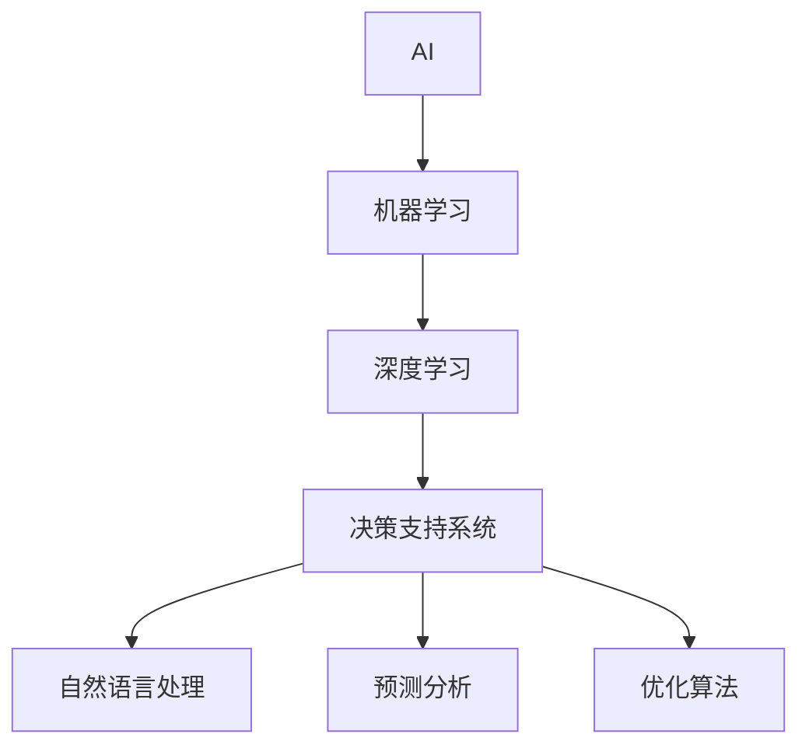

                 

## 1. 背景介绍

### 1.1 问题由来
在当今快速变化的商业环境中，企业面临着诸多不确定性和挑战。从复杂的市场动态到瞬息万变的客户需求，再到纷繁复杂的竞争态势，企业决策者需要具备更强的洞察力、更精准的判断力和更灵活的应变力。AI技术的出现，为这一目标提供了可能。特别是深度学习和机器学习技术的迅猛发展，使得AI能够在数据驱动的决策过程中发挥重要作用。

AI技术的核心在于通过数据和算法，发现潜在的规律和趋势，辅助决策者进行更为科学、合理的决策。在企业决策过程中，AI技术的应用不仅能提升决策的效率和准确性，还能帮助企业更好地应对复杂多变的外部环境。本文将详细探讨AI在企业决策过程中的应用，揭示其如何改变决策的流程和方式。

### 1.2 问题核心关键点
AI在企业决策过程中的应用，关键在于其数据驱动的能力和自动化处理的能力。通过大量的数据收集、处理和分析，AI可以发现复杂问题背后的深层次原因，并提供高效、准确的解决方案。自动化处理则能大大减轻决策者的工作负担，使他们能够专注于更为重要的战略规划和全局决策。

AI在企业决策中的应用主要涉及以下几个方面：
- 数据驱动的决策支持
- 自动化处理和流程优化
- 预测和前瞻性分析
- 个性化和动态优化
- 人机协同的决策环境

这些应用使企业能够在更短的时间内做出更为科学的决策，优化资源配置，提升整体竞争力。

### 1.3 问题研究意义
AI在企业决策中的应用，不仅提升了决策的科学性和准确性，还带来了深远的管理变革。以下是AI技术在企业决策中带来的主要意义：

1. **提升决策效率**：通过自动化处理和数据分析，AI能够快速处理海量数据，提供实时的决策支持，大大提升决策的效率。
2. **提高决策准确性**：AI能挖掘数据中的隐含关系，发现不易察觉的规律，帮助决策者做出更为准确、有依据的决策。
3. **优化资源配置**：AI能通过数据分析，识别出资源配置的瓶颈和优化点，从而提升资源的利用效率。
4. **增强前瞻性**：AI的预测能力能够预见未来的趋势和变化，帮助企业在变化中找到机会，减少风险。
5. **个性化决策**：AI能根据客户、市场等的个性化需求，提供定制化的决策方案。

## 2. 核心概念与联系

### 2.1 核心概念概述

AI在企业决策中的应用，涉及到多个核心概念。以下是一些关键概念及其联系：

- **AI（人工智能）**：通过算法和计算，使机器具备感知、学习、推理等人类智能行为的学科。
- **机器学习（ML）**：AI的一个分支，通过数据训练模型，使其能够自动完成特定任务。
- **深度学习（DL）**：一种特殊类型的机器学习，通过多层神经网络，使模型具备更强的学习能力和泛化能力。
- **决策支持系统（DSS）**：利用AI技术，提供数据和分析，辅助决策者做出更为科学的决策。
- **自然语言处理（NLP）**：使机器具备理解、处理自然语言的能力，用于智能客服、市场分析等场景。
- **预测分析**：利用历史数据和模型，预测未来趋势和变化，帮助企业做好风险控制和资源规划。
- **优化算法**：通过算法优化，使企业资源配置更为高效。

这些概念之间存在紧密的联系，共同构成了AI在企业决策中的应用框架。

### 2.2 核心概念原理和架构的 Mermaid 流程图



这个流程图展示了AI在企业决策中的核心概念及其联系。从AI到决策支持系统，再到自然语言处理、预测分析和优化算法，这些技术共同作用，支持企业进行更为科学的决策。

## 3. 核心算法原理 & 具体操作步骤

### 3.1 算法原理概述

AI在企业决策中的应用，核心在于其数据驱动的能力。通过收集、处理和分析海量数据，AI能够发现复杂问题背后的深层次原因，并提供高效、准确的解决方案。以下是AI在企业决策中的主要算法原理：

- **数据收集**：通过传感器、客户调查、社交媒体等多种途径，收集相关数据。
- **数据处理**：对收集到的数据进行清洗、分类、筛选等预处理，准备用于分析。
- **数据分析**：利用机器学习算法，分析数据中的模式、趋势和关联性。
- **模型训练**：通过历史数据训练模型，使其具备预测和推理能力。
- **决策支持**：根据分析结果，提供数据和洞察，辅助决策者进行决策。

这些步骤共同构成了AI在企业决策中的应用框架，使得企业能够基于数据和分析，做出更为科学的决策。

### 3.2 算法步骤详解

AI在企业决策中的应用，涉及以下几个关键步骤：

**Step 1: 数据收集和预处理**
- 通过各种传感器、问卷调查、网络爬虫等途径，收集相关数据。
- 对数据进行清洗、去重、填充等预处理，准备用于后续分析。

**Step 2: 数据分析和建模**
- 利用机器学习算法，分析数据中的模式和关联性。
- 通过历史数据训练模型，使其具备预测和推理能力。
- 使用深度学习等高级算法，提升模型的泛化能力和准确性。

**Step 3: 决策支持和优化**
- 根据模型分析结果，提供数据和洞察，辅助决策者进行决策。
- 利用优化算法，优化资源配置和业务流程。
- 实时监测和调整决策，确保其适应外部环境的变化。

这些步骤构成了AI在企业决策中的应用流程，使得企业能够基于数据和算法，做出更为科学的决策。

### 3.3 算法优缺点

AI在企业决策中的应用，具有以下优点：

- **提升决策效率**：通过自动化处理和数据分析，AI能够快速处理海量数据，提供实时的决策支持，大大提升决策的效率。
- **提高决策准确性**：AI能挖掘数据中的隐含关系，发现不易察觉的规律，帮助决策者做出更为准确、有依据的决策。
- **优化资源配置**：AI能通过数据分析，识别出资源配置的瓶颈和优化点，从而提升资源的利用效率。
- **增强前瞻性**：AI的预测能力能够预见未来的趋势和变化，帮助企业在变化中找到机会，减少风险。
- **个性化决策**：AI能根据客户、市场等的个性化需求，提供定制化的决策方案。

同时，AI在企业决策中的应用也存在一些缺点：

- **数据质量要求高**：AI的决策依赖于数据的质量和完整性，低质量数据可能导致错误的决策。
- **算法复杂度大**：AI算法的复杂度较高，需要大量计算资源和专业知识，可能面临技术挑战。
- **决策透明度低**：AI模型的决策过程通常难以解释，决策者可能对模型输出的结果缺乏信心。
- **潜在偏见**：AI模型可能继承数据的偏见，导致决策结果的不公平和歧视性。

尽管存在这些缺点，但AI在企业决策中的应用总体上还是具有显著的优势，能够在提升决策科学性和效率方面发挥重要作用。

### 3.4 算法应用领域

AI在企业决策中的应用，涵盖了多个领域。以下是一些主要的应用领域：

- **供应链管理**：利用预测分析和优化算法，优化库存管理、物流规划等，提升供应链效率。
- **市场分析**：通过数据分析和NLP技术，分析客户需求、市场趋势，指导产品开发和市场策略。
- **客户服务**：利用智能客服和语音识别技术，提升客户满意度和服务质量。
- **风险管理**：利用预测分析模型，识别潜在的风险点，制定风险控制策略。
- **财务分析**：通过数据分析和机器学习，提升财务报表的准确性和及时性，优化资金使用。
- **人力资源管理**：利用数据分析和NLP技术，优化招聘流程、员工绩效管理等。

这些应用领域展示了AI在企业决策中的广泛应用，能够带来显著的管理提升和业务效益。

## 4. 数学模型和公式 & 详细讲解 & 举例说明

### 4.1 数学模型构建

在企业决策中，AI的应用通常涉及多个数学模型。以下是一些常见的数学模型及其构建方式：

- **回归模型**：用于预测连续变量的值，如销售预测、市场趋势等。
- **分类模型**：用于分类任务，如客户细分、产品推荐等。
- **聚类模型**：用于发现数据中的模式和群体，如客户群体分析、产品分类等。
- **优化模型**：用于资源配置和业务流程优化，如物流规划、资源分配等。

这些模型在企业决策中的应用，通常需要利用历史数据进行训练和验证，确保其具备良好的泛化能力。

### 4.2 公式推导过程

以线性回归模型为例，其公式推导过程如下：

设输入为 $X$，输出为 $Y$，模型参数为 $\theta$，则线性回归模型的目标是最小化预测值与真实值之间的误差：

$$
\min_{\theta} \sum_{i=1}^n (y_i - \theta^T x_i)^2
$$

通过梯度下降等优化算法，求解上述目标函数，得到最优参数 $\theta$。在实际应用中，往往使用标准化的线性回归模型或其变种，如岭回归、Lasso回归等，以应对不同场景的需求。

### 4.3 案例分析与讲解

假设某零售企业希望通过AI预测下一季度的销售量。在数据收集阶段，企业收集了过去多年的销售数据，包括节假日、促销活动、季节变化等因素。在数据预处理阶段，企业对数据进行了清洗和标准化，消除了噪声和异常值。接着，企业利用线性回归模型进行训练和验证，得到一个具备预测能力的模型。在决策支持阶段，企业根据模型预测结果，调整库存和供应链策略，以应对即将到来的销售高峰。

这个案例展示了AI在企业决策中的应用流程。通过数据驱动的分析和预测，企业能够做出更为科学的决策，提升资源利用效率和市场响应能力。

## 5. 项目实践：代码实例和详细解释说明

### 5.1 开发环境搭建

在企业决策中应用AI技术，通常需要构建一个完整的开发环境。以下是一些常用工具和框架的搭建流程：

1. **Python环境**：选择Python作为主要编程语言，搭建Python开发环境，包括Python版本、包管理工具等。
2. **数据收集和存储**：搭建数据收集和存储系统，确保数据的及时性和完整性。
3. **计算资源**：配置高性能计算资源，如GPU、TPU等，支持复杂算法的计算需求。
4. **模型训练和验证**：搭建模型训练和验证环境，包括数据预处理、模型训练、评估等步骤。
5. **可视化工具**：选择可视化工具，如Matplotlib、Seaborn等，用于数据展示和模型分析。

### 5.2 源代码详细实现

以下是一个简单的线性回归模型实现代码：

```python
import pandas as pd
from sklearn.linear_model import LinearRegression
from sklearn.model_selection import train_test_split
import matplotlib.pyplot as plt

# 读取数据
data = pd.read_csv('sales_data.csv')

# 数据预处理
X = data[['season', 'holiday', 'weather', 'sales']]
Y = data['sales']

# 分割训练集和测试集
X_train, X_test, y_train, y_test = train_test_split(X, Y, test_size=0.2, random_state=42)

# 训练模型
model = LinearRegression()
model.fit(X_train, y_train)

# 预测和评估
y_pred = model.predict(X_test)
plt.scatter(y_test, y_pred)
plt.xlabel('True Values')
plt.ylabel('Predicted Values')
plt.show()
```

以上代码展示了线性回归模型的实现流程，包括数据预处理、模型训练、预测和评估等步骤。

### 5.3 代码解读与分析

以下是代码中各个部分的详细解读：

- **数据读取**：使用pandas库读取数据，方便数据处理和分析。
- **数据预处理**：对数据进行清洗和标准化，确保数据质量。
- **模型训练**：利用scikit-learn库的LinearRegression模型进行训练，得到预测模型。
- **预测和评估**：利用训练好的模型进行预测，并使用可视化工具展示预测结果。

### 5.4 运行结果展示

以上代码运行结果展示了预测值和真实值之间的散点图，用于评估模型预测的准确性。


## 6. 实际应用场景

### 6.1 智能客服系统

在智能客服系统中，AI技术能够显著提升客户服务体验。通过NLP技术和智能客服模型，企业能够自动处理客户咨询，提供24小时不间断服务。智能客服系统能够理解客户意图，自动匹配答案模板，提高问题解决效率。

### 6.2 市场分析

市场分析是企业决策的重要环节。通过数据分析和NLP技术，企业能够实时监测市场趋势和客户需求，快速做出决策响应。例如，利用情感分析技术，分析社交媒体上的用户评论，了解消费者对产品的态度和反馈，及时调整市场策略。

### 6.3 风险管理

风险管理是企业决策中的关键环节。通过预测分析和机器学习模型，企业能够识别潜在的风险点，制定风险控制策略。例如，利用预测模型，预测市场变化和客户违约风险，提前采取措施，减少财务损失。

### 6.4 未来应用展望

未来，AI在企业决策中的应用将更加广泛和深入。以下是一些未来应用展望：

- **自动化决策支持**：通过AI自动化处理数据和分析，辅助决策者快速做出决策。
- **实时决策优化**：利用实时数据分析和预测，动态调整决策，应对突发事件。
- **跨部门协同决策**：利用AI技术，促进跨部门信息共享和协同决策，提升决策效率和质量。
- **大数据分析**：利用大数据技术，进行更深入的数据分析和挖掘，发现更多的业务机会和优化点。

## 7. 工具和资源推荐

### 7.1 学习资源推荐

为了帮助开发者深入理解AI在企业决策中的应用，以下是一些优秀的学习资源：

- **Coursera和edX**：提供多门机器学习和AI课程，涵盖数据预处理、模型训练、优化算法等知识点。
- **Kaggle**：提供大量数据集和机器学习竞赛，实践AI技术在实际问题中的应用。
- **Google AI Hub**：提供多款开源AI工具和库，方便开发者快速实现AI应用。
- **TensorFlow和PyTorch**：开源深度学习框架，提供丰富的模型和算法支持。
- **《Python机器学习》**：经典教材，全面介绍机器学习算法和Python实现。

### 7.2 开发工具推荐

以下是一些常用的AI开发工具和框架：

- **Jupyter Notebook**：支持Python和R语言，方便开发者进行代码编写和数据可视化。
- **TensorFlow和PyTorch**：开源深度学习框架，支持分布式计算和模型部署。
- **Keras**：高层API，简化深度学习模型的搭建和训练过程。
- **Scikit-learn**：提供多种机器学习算法和工具，支持数据预处理和模型评估。
- **Apache Spark**：大数据处理引擎，支持分布式计算和实时数据分析。

### 7.3 相关论文推荐

以下是一些相关的AI论文和研究：

- **《Google's BERT: A Pre-training Approach for Language Understanding》**：Google提出的BERT模型，在NLP领域取得了显著效果。
- **《Deep Learning for Market Risk Management》**：利用深度学习技术，预测市场风险和波动。
- **《Predictive Maintenance with Deep Learning》**：利用深度学习技术，预测设备故障和维护需求。
- **《A Survey on Decision Support Systems in Business and Management》**：综述企业决策支持系统的发展现状和应用。
- **《AI for Business: Success Factors for Implementing AI in Enterprises》**：探讨AI在企业中的应用成功案例和最佳实践。

## 8. 总结：未来发展趋势与挑战

### 8.1 研究成果总结

本文详细介绍了AI在企业决策中的应用，揭示了其如何改变决策的流程和方式。AI技术的应用，通过数据驱动的决策支持和自动化处理，显著提升了决策的科学性和效率，优化了资源配置，增强了前瞻性，满足了个性化需求。

### 8.2 未来发展趋势

未来，AI在企业决策中的应用将呈现以下几个发展趋势：

- **自动化程度提升**：AI将更加自动化，减少人工干预，提高决策效率。
- **跨领域融合**：AI与其他技术（如大数据、物联网等）的融合，带来更全面和深入的决策支持。
- **多模态数据整合**：结合文本、图像、语音等多模态数据，提升决策的全面性和准确性。
- **实时决策支持**：利用实时数据分析和预测，动态调整决策，应对突发事件。
- **智能决策平台**：搭建综合性的智能决策平台，集成多种AI工具和算法，支持跨部门协同决策。

### 8.3 面临的挑战

尽管AI在企业决策中的应用带来了显著的优势，但也面临诸多挑战：

- **数据质量**：数据的质量和完整性是AI应用的基石，低质量数据可能导致错误的决策。
- **算法复杂度**：AI算法的复杂度较高，需要大量计算资源和专业知识，可能面临技术挑战。
- **决策透明度**：AI模型的决策过程通常难以解释，决策者可能对模型输出的结果缺乏信心。
- **潜在偏见**：AI模型可能继承数据的偏见，导致决策结果的不公平和歧视性。

### 8.4 研究展望

未来的AI研究需要在这几个方面进行深入探索：

- **提升数据质量**：建立数据质量管理机制，确保数据的及时性和完整性。
- **简化算法复杂度**：开发更高效、易用的AI算法，降低技术门槛。
- **增强模型透明度**：提升模型的可解释性，增强决策者的信心。
- **消除模型偏见**：研究消除数据偏见的算法和技术，确保决策的公平性和公正性。

## 9. 附录：常见问题与解答

### Q1: 企业决策中如何选择合适的AI技术？

A: 企业在决策中应根据具体需求选择合适的AI技术。例如，预测分析适合用于销售预测和市场趋势，智能客服适合用于客户咨询处理，风险管理适合用于识别潜在的风险点。同时，应考虑技术的可行性、成本和数据要求等因素。

### Q2: AI在企业决策中如何保证数据质量？

A: 数据质量是AI应用的基石，应建立数据质量管理机制，确保数据的及时性和完整性。例如，进行数据清洗、去重、填充等预处理，建立数据标注和验证流程，使用数据质量监控工具等。

### Q3: 如何确保AI决策的透明度和可解释性？

A: 确保AI决策的透明度和可解释性，可以通过以下方法：建立模型评估和验证机制，使用可解释性算法，增强模型输出的可视化，进行专家评审和审核等。

### Q4: 如何应对AI模型的潜在偏见？

A: 应对AI模型的潜在偏见，可以通过以下方法：建立数据集的多样性和公平性，使用偏见消除技术，进行模型监控和反馈调整，建立多元化的决策团队等。

---

作者：禅与计算机程序设计艺术 / Zen and the Art of Computer Programming

