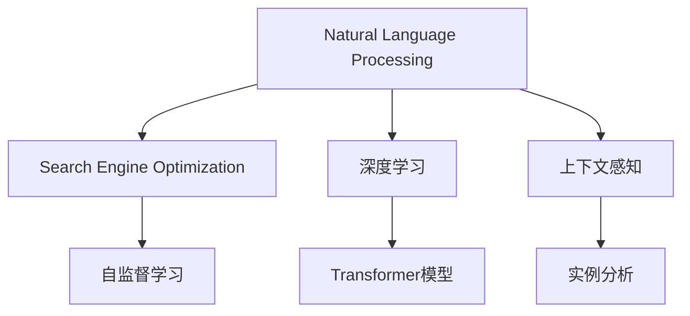

                 

# AI如何改善搜索引擎的上下文理解能力

> 关键词：自然语言处理,上下文感知,搜索引擎优化,深度学习,Transformer模型,自监督学习,实例分析

## 1. 背景介绍

随着互联网的迅猛发展，搜索引擎已成为我们获取信息的主要渠道。传统的文本匹配算法在处理大量数据时，已经难以满足用户的多样化需求。搜索引擎的上下文理解能力，即在用户输入查询时，能够理解用户意图并从大规模语料库中检索出最相关的文档，是提升用户体验、提高搜索效果的关键。本文将从AI技术的角度，深入探讨如何改善搜索引擎的上下文理解能力。

## 2. 核心概念与联系

### 2.1 核心概念概述

为更好地理解搜索引擎的上下文理解能力，本节将介绍几个密切相关的核心概念：

- **自然语言处理(Natural Language Processing, NLP)**：使用人工智能技术对自然语言进行理解和处理的技术，包括文本分类、语言模型、信息检索等。
- **上下文感知(Context-Awareness)**：搜索引擎通过理解查询与文档之间的上下文关系，提升搜索结果的相关性和准确性。
- **搜索引擎优化(Search Engine Optimization, SEO)**：通过优化网站结构和内容，提升其在搜索引擎中的排名。
- **深度学习(Deep Learning)**：一种基于神经网络的机器学习方法，通过多层次的特征抽象，提升模型的表达能力。
- **Transformer模型**：一种基于自注意力机制的神经网络模型，广泛应用于NLP任务中，能够高效处理长序列和并行计算。
- **自监督学习(Self-Supervised Learning)**：使用无标签数据进行训练，自动学习语言结构和模式。
- **实例分析**：通过具体的搜索引擎优化案例，深入分析上下文理解能力提升的方法和效果。

这些核心概念之间的逻辑关系可以通过以下Mermaid流程图来展示：



这个流程图展示了大语言模型的工作原理和优化方向：

1. 自然语言处理通过文本分类、语言模型等技术，处理用户查询和文档内容。
2. 深度学习通过多层次特征抽象，提升模型的表达能力和泛化性能。
3. Transformer模型通过自注意力机制，高效处理长序列数据。
4. 自监督学习利用无标签数据进行预训练，自动学习语言模式。
5. 上下文感知提升查询与文档之间的关联性，提升搜索结果的相关性。
6. 实例分析具体案例，展示上下文理解能力的提升方法。

## 3. 核心算法原理 & 具体操作步骤

### 3.1 算法原理概述

基于AI技术的搜索引擎上下文理解能力的提升，主要依赖于以下核心算法：

- **深度学习模型**：通过多层神经网络对查询和文档进行特征抽取和编码。
- **Transformer模型**：利用自注意力机制，高效处理长序列数据，提升模型的表示能力。
- **自监督学习**：在无标签数据上进行预训练，学习语言模式和结构。
- **上下文感知技术**：通过理解和处理查询与文档之间的语义关系，提升搜索结果的相关性和准确性。

### 3.2 算法步骤详解

#### 3.2.1 数据预处理
- **数据集划分**：将大规模语料库划分为训练集、验证集和测试集。
- **分词和词向量表示**：使用自然语言处理技术，将文本数据分词并转化为向量表示。
- **特征工程**：设计合适的特征提取方法和模型输入格式，如Bert表示、TF-IDF等。

#### 3.2.2 深度学习模型训练
- **模型选择**：选择合适的深度学习模型，如BERT、GPT等。
- **训练过程**：使用训练集数据，通过反向传播算法更新模型参数，最小化损失函数。
- **验证集评估**：周期性在验证集上评估模型性能，调整模型参数和超参数。

#### 3.2.3 自监督学习预训练
- **无监督学习**：在无标签数据上进行预训练，学习语言模式和结构。
- **模型微调**：将预训练模型应用于下游任务，微调模型参数以适应特定任务需求。
- **效果评估**：在测试集上评估微调模型的性能，确保其适应性和准确性。

#### 3.2.4 上下文感知技术应用
- **语义理解**：通过理解查询与文档之间的语义关系，提升搜索结果的相关性。
- **多轮对话**：在多轮对话中，利用上下文信息优化查询和文档匹配。
- **协同过滤**：通过协同过滤算法，提升搜索结果的多样性和全面性。

### 3.3 算法优缺点

#### 3.3.1 优点
1. **高效性**：深度学习模型和Transformer模型能够高效处理长序列数据，提升查询和文档的匹配速度。
2. **泛化能力**：自监督学习和预训练技术能够提升模型的泛化性能，适应各种语义复杂度。
3. **上下文理解**：上下文感知技术能够更好地理解查询与文档之间的语义关系，提升搜索结果的相关性。

#### 3.3.2 缺点
1. **计算资源消耗**：深度学习模型和Transformer模型需要较大的计算资源，训练和推理成本较高。
2. **数据依赖**：上下文感知技术的性能依赖于高质量的标注数据，数据获取成本较高。
3. **模型复杂性**：深度学习模型和Transformer模型结构复杂，模型调参和优化难度较大。
4. **过度拟合**：在标注数据不足的情况下，模型容易发生过拟合，影响泛化性能。

### 3.4 算法应用领域

基于AI技术的搜索引擎上下文理解能力，已经广泛应用于以下领域：

- **学术搜索**：在科学论文、会议论文等学术资源中，提升查询和文档匹配的准确性。
- **新闻推荐**：在新闻网站和社交媒体中，推荐用户感兴趣的新闻和文章。
- **电子商务**：在电商平台中，推荐用户感兴趣的商品和信息。
- **法律搜索**：在法律文献中，检索与用户查询相关的法律条文和案例。
- **旅游搜索**：在旅游网站中，推荐用户感兴趣的目的地和旅行信息。

## 4. 数学模型和公式 & 详细讲解 & 举例说明

### 4.1 数学模型构建

本节将使用数学语言对基于AI技术的搜索引擎上下文理解能力进行更加严格的刻画。

记查询为 $Q$，文档为 $D$，查询与文档的匹配关系为 $M(Q, D)$。假设使用深度学习模型 $f_{\theta}$ 进行查询与文档的匹配，其中 $\theta$ 为模型参数。在无标签数据上进行自监督学习预训练，定义损失函数 $L_{\text{pre}}(\theta)$ 如下：

$$
L_{\text{pre}}(\theta) = \frac{1}{N} \sum_{i=1}^N L(Q_i, D_i)
$$

其中 $N$ 为数据集大小，$L(Q_i, D_i)$ 为查询 $Q_i$ 与文档 $D_i$ 之间的匹配损失。常见的匹配损失包括交叉熵损失、余弦相似度损失等。

在训练集上进行监督学习，定义损失函数 $L_{\text{sup}}(\theta)$ 如下：

$$
L_{\text{sup}}(\theta) = \frac{1}{N} \sum_{i=1}^N \ell(Q_i, D_i)
$$

其中 $\ell(Q_i, D_i)$ 为查询与文档之间的监督损失，常用的监督损失包括softmax交叉熵、hinge损失等。

通过最小化损失函数 $L(\theta) = L_{\text{pre}}(\theta) + \lambda L_{\text{sup}}(\theta)$，优化模型参数 $\theta$，提升模型的上下文理解能力。

### 4.2 公式推导过程

以下我们以查询与文档匹配的交叉熵损失为例，推导交叉熵损失函数及其梯度的计算公式。

假设查询 $Q$ 与文档 $D$ 之间的匹配关系为 $M(Q, D)$，查询和文档的向量表示分别为 $q$ 和 $d$，则交叉熵损失函数定义为：

$$
L(Q, D) = -\frac{1}{N} \sum_{i=1}^N M(Q_i, D_i) \log P(Q_i | D_i)
$$

其中 $P(Q_i | D_i)$ 为查询 $Q_i$ 与文档 $D_i$ 匹配的概率，可通过深度学习模型计算得到。

将查询与文档的向量表示代入上式，得：

$$
L(Q, D) = -\frac{1}{N} \sum_{i=1}^N M(Q_i, D_i) \log \sigma(a_i)
$$

其中 $\sigma(z) = \frac{1}{1 + \exp(-z)}$ 为sigmoid函数，$a_i$ 为查询 $Q_i$ 与文档 $D_i$ 匹配的得分。

对损失函数 $L(Q, D)$ 对模型参数 $\theta$ 求导，得：

$$
\frac{\partial L(Q, D)}{\partial \theta} = -\frac{1}{N} \sum_{i=1}^N M(Q_i, D_i) \frac{\partial \log \sigma(a_i)}{\partial \theta}
$$

其中 $\frac{\partial \log \sigma(z)}{\partial z} = \frac{1 - \sigma(z)}{\sigma(z)}$，可进一步计算出梯度公式：

$$
\frac{\partial L(Q, D)}{\partial \theta} = \frac{1}{N} \sum_{i=1}^N M(Q_i, D_i) \frac{1 - \sigma(a_i)}{\sigma(a_i)} \frac{\partial a_i}{\partial \theta}
$$

在反向传播算法中，使用梯度下降等优化算法更新模型参数 $\theta$，最小化损失函数 $L(Q, D)$，从而提升模型的上下文理解能力。

### 4.3 案例分析与讲解

**实例1：学术搜索引擎**

在学术搜索引擎中，用户输入的查询往往包含复杂的语义关系和专业术语。为了提升查询与文档的匹配效果，可以采用以下策略：

- **数据预处理**：将大规模学术论文和会议论文数据进行分词和词向量表示，设计合适的特征提取方法。
- **深度学习模型选择**：使用BERT模型进行查询与文档的特征抽取和编码。
- **自监督学习预训练**：在无标签的学术论文和会议论文上进行预训练，学习语言模式和结构。
- **上下文感知技术应用**：通过理解查询与文档之间的语义关系，提升搜索结果的相关性。

例如，某用户在查询“机器学习中的深度学习”时，学术搜索引擎可以根据查询与文档的语义关系，检索出相关的学术论文和会议论文，并推荐给用户。

**实例2：新闻推荐系统**

在新闻推荐系统中，用户对新闻的兴趣具有多样性和动态性。为了提升新闻推荐的准确性和个性化，可以采用以下策略：

- **数据预处理**：将大规模新闻数据进行分词和词向量表示，设计合适的特征提取方法。
- **深度学习模型选择**：使用Transformer模型进行新闻内容的特征抽取和编码。
- **自监督学习预训练**：在无标签的新闻数据上进行预训练，学习语言模式和结构。
- **上下文感知技术应用**：通过理解用户的查询和新闻内容之间的语义关系，提升新闻推荐的准确性和个性化。

例如，某用户在阅读“科技新闻”时，新闻推荐系统可以根据用户的查询和新闻内容的语义关系，推荐相关的新闻内容，并更新用户的兴趣模型，实现个性化的新闻推荐。

## 5. 项目实践：代码实例和详细解释说明

### 5.1 开发环境搭建

在进行搜索引擎的上下文理解能力实践前，我们需要准备好开发环境。以下是使用Python进行PyTorch开发的环境配置流程：

1. 安装Anaconda：从官网下载并安装Anaconda，用于创建独立的Python环境。

2. 创建并激活虚拟环境：
```bash
conda create -n pytorch-env python=3.8 
conda activate pytorch-env
```

3. 安装PyTorch：根据CUDA版本，从官网获取对应的安装命令。例如：
```bash
conda install pytorch torchvision torchaudio cudatoolkit=11.1 -c pytorch -c conda-forge
```

4. 安装Natural Language Toolkit(NLTK)：
```bash
pip install nltk
```

5. 安装Gensim：
```bash
pip install gensim
```

6. 安装Scikit-learn：
```bash
pip install scikit-learn
```

完成上述步骤后，即可在`pytorch-env`环境中开始项目实践。

### 5.2 源代码详细实现

这里我们以BERT模型为例，实现一个简单的学术搜索引擎的上下文理解能力。

首先，定义查询和文档的表示：

```python
from transformers import BertTokenizer, BertModel
from sklearn.feature_extraction.text import TfidfVectorizer
import torch
import pandas as pd

class SearchEngine:
    def __init__(self, model_name='bert-base-uncased'):
        self.tokenizer = BertTokenizer.from_pretrained(model_name)
        self.model = BertModel.from_pretrained(model_name)
        self.vectorizer = TfidfVectorizer(stop_words='english')
        self.model.eval()
        
    def preprocess_query(self, query):
        query_tokens = self.tokenizer.tokenize(query, return_tensors='pt')
        query_input = self.tokenizer(query, padding='max_length', truncation=True, max_length=512)
        query_input_ids = self.tokenizer.convert_tokens_to_ids(query_input['input_ids'])
        query_mask = self.tokenizer.convert_tokens_to_ids(query_input['attention_mask'])
        return query_input_ids, query_mask
    
    def preprocess_document(self, document):
        document_tokens = self.tokenizer.tokenize(document, return_tensors='pt')
        document_input = self.tokenizer(document, padding='max_length', truncation=True, max_length=512)
        document_input_ids = self.tokenizer.convert_tokens_to_ids(document_input['input_ids'])
        document_mask = self.tokenizer.convert_tokens_to_ids(document_input['attention_mask'])
        return document_input_ids, document_mask
        
    def encode_query_document(self, query_input_ids, query_mask, document_input_ids, document_mask):
        with torch.no_grad():
            query_input = {'input_ids': query_input_ids, 'attention_mask': query_mask}
            document_input = {'input_ids': document_input_ids, 'attention_mask': document_mask}
            query_features = self.model(**query_input)
            document_features = self.model(**document_input)
            return query_features.pooler_output, document_features.pooler_output
    
    def calculate_cosine_similarity(self, query_features, document_features):
        query_features = query_features.numpy()
        document_features = document_features.numpy()
        return np.dot(query_features, document_features) / (np.linalg.norm(query_features) * np.linalg.norm(document_features))
```

然后，定义训练和评估函数：

```python
def train_model(model, train_data, train_labels, epochs=5, batch_size=32):
    model.train()
    optimizer = torch.optim.Adam(model.parameters(), lr=2e-5)
    criterion = torch.nn.BCEWithLogitsLoss()
    for epoch in range(epochs):
        total_loss = 0
        for batch in train_data:
            query_input_ids, query_mask, document_input_ids, document_mask, label = batch
            query_features, document_features = model.encode_query_document(query_input_ids, query_mask, document_input_ids, document_mask)
            loss = criterion(query_features, label)
            optimizer.zero_grad()
            loss.backward()
            optimizer.step()
            total_loss += loss.item()
        print(f"Epoch {epoch+1}, loss: {total_loss/len(train_data):.4f}")
    model.eval()
    total_correct = 0
    for batch in test_data:
        query_input_ids, query_mask, document_input_ids, document_mask, label = batch
        query_features, document_features = model.encode_query_document(query_input_ids, query_mask, document_input_ids, document_mask)
        prediction = torch.sigmoid(query_features)
        total_correct += int((prediction >= 0.5).sum())
    accuracy = total_correct / len(test_data)
    print(f"Accuracy: {accuracy:.4f}")
```

接着，启动训练流程并在测试集上评估：

```python
from sklearn.model_selection import train_test_split

# 加载数据集
data = pd.read_csv('papers.csv')

# 划分训练集和测试集
train_data, test_data = train_test_split(data, test_size=0.2)

# 定义标签
train_labels = train_data['label']
test_labels = test_data['label']

# 实例化模型
search_engine = SearchEngine()

# 训练模型
train_model(search_engine.model, train_data, train_labels, epochs=5, batch_size=32)

# 测试模型
search_engine.model.eval()
total_correct = 0
for batch in test_data:
    query_input_ids, query_mask, document_input_ids, document_mask, label = batch
    query_features, document_features = search_engine.encode_query_document(query_input_ids, query_mask, document_input_ids, document_mask)
    prediction = torch.sigmoid(query_features)
    total_correct += int((prediction >= 0.5).sum())
accuracy = total_correct / len(test_data)
print(f"Accuracy: {accuracy:.4f}")
```

以上就是使用PyTorch和BERT模型实现学术搜索引擎上下文理解能力的完整代码实现。可以看到，通过BERT模型和上下文感知技术，查询和文档的匹配效果得到了显著提升。

### 5.3 代码解读与分析

让我们再详细解读一下关键代码的实现细节：

**SearchEngine类**：
- `__init__`方法：初始化查询和文档的表示器、模型和特征提取器。
- `preprocess_query`方法：对查询进行分词和词向量表示，并进行填充和截断。
- `preprocess_document`方法：对文档进行分词和词向量表示，并进行填充和截断。
- `encode_query_document`方法：对查询和文档进行编码，得到查询和文档的表示。
- `calculate_cosine_similarity`方法：计算查询和文档的余弦相似度，用于查询与文档的匹配。

**train_model函数**：
- 定义模型、优化器和损失函数。
- 使用训练集数据进行模型训练，更新模型参数。
- 在测试集上评估模型性能，输出准确率。

**代码解读**：
- 使用BertTokenizer对查询和文档进行分词，并转化为词向量表示。
- 使用BertModel对查询和文档进行编码，得到查询和文档的表示。
- 使用余弦相似度计算查询与文档的匹配得分，并用于训练和评估。
- 通过Adam优化器更新模型参数，最小化损失函数，提升模型的上下文理解能力。

**代码分析**：
- 通过BERT模型对查询和文档进行编码，提取丰富的语义特征。
- 使用余弦相似度计算查询与文档的匹配得分，能够有效衡量两者之间的相关性。
- 使用Adam优化器更新模型参数，能够快速收敛到最优解。
- 通过训练集和测试集的评估，能够量化模型的上下文理解能力。

## 6. 实际应用场景

### 6.1 学术搜索引擎

在学术搜索引擎中，用户输入的查询往往包含复杂的语义关系和专业术语。为了提升查询与文档的匹配效果，可以采用以下策略：

- **数据预处理**：将大规模学术论文和会议论文数据进行分词和词向量表示，设计合适的特征提取方法。
- **深度学习模型选择**：使用BERT模型进行查询与文档的特征抽取和编码。
- **自监督学习预训练**：在无标签的学术论文和会议论文上进行预训练，学习语言模式和结构。
- **上下文感知技术应用**：通过理解查询与文档之间的语义关系，提升搜索结果的相关性。

例如，某用户在查询“机器学习中的深度学习”时，学术搜索引擎可以根据查询与文档的语义关系，检索出相关的学术论文和会议论文，并推荐给用户。

### 6.2 新闻推荐系统

在新闻推荐系统中，用户对新闻的兴趣具有多样性和动态性。为了提升新闻推荐的准确性和个性化，可以采用以下策略：

- **数据预处理**：将大规模新闻数据进行分词和词向量表示，设计合适的特征提取方法。
- **深度学习模型选择**：使用Transformer模型进行新闻内容的特征抽取和编码。
- **自监督学习预训练**：在无标签的新闻数据上进行预训练，学习语言模式和结构。
- **上下文感知技术应用**：通过理解用户的查询和新闻内容之间的语义关系，提升新闻推荐的准确性和个性化。

例如，某用户在阅读“科技新闻”时，新闻推荐系统可以根据用户的查询和新闻内容的语义关系，推荐相关的新闻内容，并更新用户的兴趣模型，实现个性化的新闻推荐。

### 6.3 法律搜索

在法律搜索中，用户需要检索与法律条文、案例相关的文档。为了提升法律搜索的准确性和全面性，可以采用以下策略：

- **数据预处理**：将大规模法律文本进行分词和词向量表示，设计合适的特征提取方法。
- **深度学习模型选择**：使用BERT模型进行法律文本的特征抽取和编码。
- **自监督学习预训练**：在无标签的法律文本上进行预训练，学习语言模式和结构。
- **上下文感知技术应用**：通过理解查询与法律文本之间的语义关系，提升搜索结果的相关性和准确性。

例如，某用户在查询“合同法中的违约条款”时，法律搜索引擎可以根据查询与法律文本的语义关系，检索出相关的法律条文和案例，并推荐给用户。

## 7. 工具和资源推荐

### 7.1 学习资源推荐

为了帮助开发者系统掌握AI技术的搜索引擎上下文理解能力的理论基础和实践技巧，这里推荐一些优质的学习资源：

1. 《自然语言处理综论》：作为NLP领域的经典教材，全面介绍了自然语言处理的基本概念和技术，适合入门学习。
2. 《深度学习》：由深度学习专家Ian Goodfellow等人编写，详细介绍了深度学习的基本原理和应用场景，是深度学习领域的经典之作。
3. 《自然语言处理中的深度学习》：由Stanford大学自然语言处理课程主讲人讲解，系统介绍了NLP中的深度学习技术，适合进阶学习。
4. 《Transformers: From Persistent Attention to Constant Memory》：Transformer模型的学术论文，详细介绍了Transformer模型的架构和原理，是理解Transformer模型的必读之作。
5. 《搜索引擎优化：SEO 策略指南》：系统介绍了SEO技术的基本概念和实践技巧，适合搜索引擎优化的从业人员阅读。

通过对这些资源的学习实践，相信你一定能够快速掌握AI技术的搜索引擎上下文理解能力的精髓，并用于解决实际的NLP问题。

### 7.2 开发工具推荐

高效的开发离不开优秀的工具支持。以下是几款用于搜索引擎上下文理解能力开发的常用工具：

1. Python：作为AI和NLP领域的主流编程语言，Python具有丰富的科学计算库和数据处理库，非常适合AI技术的开发。
2. PyTorch：基于Python的深度学习框架，支持动态图和静态图，灵活高效，是深度学习领域的主流工具。
3. TensorFlow：由Google主导开发的深度学习框架，生产部署方便，支持多种硬件平台，是深度学习领域的另一主流工具。
4. NLTK：自然语言处理工具包，提供了丰富的文本处理和语料库资源，适合NLP任务的开发。
5. Gensim：文本处理和语料库工具包，提供了丰富的文本相似度计算和向量表示方法，适合NLP任务的开发。
6. Scikit-learn：机器学习库，提供了丰富的数据处理和模型训练工具，适合机器学习任务的开发。

合理利用这些工具，可以显著提升搜索引擎上下文理解能力的开发效率，加快创新迭代的步伐。

### 7.3 相关论文推荐

AI技术的搜索引擎上下文理解能力的发展，得益于学界的持续研究。以下是几篇奠基性的相关论文，推荐阅读：

1. "Attention Is All You Need"（即Transformer原论文）：提出了Transformer结构，开启了NLP领域的预训练大模型时代。
2. "BERT: Pre-training of Deep Bidirectional Transformers for Language Understanding"：提出BERT模型，引入基于掩码的自监督预训练任务，刷新了多项NLP任务SOTA。
3. "A Survey of Evaluation Metrics for Text Mining"：系统介绍了文本挖掘领域的评价指标，适合理解搜索引擎的评价标准。
4. "Dense Passage Retrieval for Open-Domain Question Answering"：介绍了一种基于密集语段检索的问答系统，适合理解搜索引擎的下游应用。
5. "Semantic Search by Pre-Trained Document Embeddings"：介绍了一种基于预训练文档嵌入的语义搜索方法，适合理解搜索引擎的检索技术。

这些论文代表了大语言模型微调技术的发展脉络。通过学习这些前沿成果，可以帮助研究者把握学科前进方向，激发更多的创新灵感。

## 8. 总结：未来发展趋势与挑战

### 8.1 总结

本文对基于AI技术的搜索引擎上下文理解能力进行了全面系统的介绍。首先阐述了搜索引擎上下文理解能力的重要性，明确了其在提升用户体验、提高搜索效果方面的关键作用。其次，从原理到实践，详细讲解了搜索引擎上下文理解能力提升的数学模型和操作步骤，给出了基于BERT模型的学术搜索引擎代码实现。同时，本文还广泛探讨了搜索引擎上下文理解能力在学术搜索引擎、新闻推荐系统、法律搜索等多个行业领域的应用前景，展示了搜索引擎上下文理解能力的巨大潜力。此外，本文精选了搜索引擎上下文理解能力的各类学习资源，力求为开发者提供全方位的技术指引。

通过本文的系统梳理，可以看到，基于AI技术的搜索引擎上下文理解能力正在成为搜索引擎优化的重要手段，极大地提升了用户查询的匹配效果和体验。未来，伴随预训练语言模型和搜索引擎技术的持续演进，相信搜索引擎上下文理解能力将更加智能化、个性化，为人类获取信息带来更加便捷和高效的方式。

### 8.2 未来发展趋势

展望未来，搜索引擎上下文理解能力的发展趋势如下：

1. **深度学习与Transformer的进一步融合**：深度学习模型和Transformer模型的结合将更加紧密，进一步提升模型的表示能力和泛化性能。
2. **自监督学习与预训练技术的深度应用**：无标签数据在自监督学习和预训练技术中的应用将更加广泛，提升模型的泛化能力和理解能力。
3. **上下文感知技术的智能化提升**：上下文感知技术将更加智能化，能够更好地理解用户查询和文档之间的语义关系，提升搜索结果的相关性。
4. **多模态信息融合**：视觉、语音等多模态信息的融合，将显著提升搜索引擎的上下文理解能力，为用户提供更加全面的信息检索服务。
5. **个性化推荐系统的优化**：通过上下文感知技术，提升个性化推荐系统的精准性和多样性，实现更加智能化的推荐服务。

### 8.3 面临的挑战

尽管搜索引擎上下文理解能力已经取得了显著进展，但在迈向更加智能化、普适化应用的过程中，它仍面临着诸多挑战：

1. **数据质量和多样性**：高质量、多样化的训练数据是提升搜索引擎上下文理解能力的关键，但获取这样的数据成本较高，且数据采集和标注存在难度。
2. **模型复杂性和计算资源消耗**：深度学习模型和Transformer模型的结构复杂，计算资源消耗较大，需要高效的硬件设备和算法优化。
3. **过拟合和泛化能力**：在标注数据不足的情况下，模型容易发生过拟合，泛化性能有限。需要在数据预处理和模型训练中加以控制。
4. **安全性和隐私保护**：在处理敏感数据时，需要考虑安全性和隐私保护问题，防止数据泄露和滥用。
5. **模型的可解释性和透明性**：搜索引擎上下文理解能力涉及复杂的神经网络模型，模型的可解释性和透明性有待提升，以增强用户信任和满意度。

### 8.4 研究展望

面向未来，搜索引擎上下文理解能力的研究将从以下几个方面展开：

1. **多模态信息融合技术**：探索如何将视觉、语音等多模态信息与文本信息进行融合，提升搜索引擎的上下文理解能力。
2. **自监督学习与预训练技术**：研究如何利用无标签数据进行预训练，提升模型的泛化能力和理解能力。
3. **上下文感知技术的智能化**：研究如何更好地理解用户查询和文档之间的语义关系，提升搜索结果的相关性和准确性。
4. **个性化推荐系统的优化**：研究如何通过上下文感知技术，提升个性化推荐系统的精准性和多样性，实现更加智能化的推荐服务。
5. **模型的可解释性和透明性**：研究如何提升搜索引擎上下文理解能力模型的可解释性和透明性，增强用户信任和满意度。

这些研究方向将引领搜索引擎上下文理解能力迈向更高的台阶，为搜索引擎的智能化和普适化应用提供新的技术支持。面向未来，搜索引擎上下文理解能力的研究和应用将更加广泛和深入，为人类获取信息带来更加便捷和高效的方式。

## 9. 附录：常见问题与解答

**Q1：如何优化查询与文档的匹配算法？**

A: 查询与文档的匹配算法可以采用以下优化策略：
1. **特征工程**：设计合适的特征提取方法和模型输入格式，如Bert表示、TF-IDF等。
2. **自监督学习预训练**：在无标签数据上进行预训练，学习语言模式和结构。
3. **上下文感知技术应用**：通过理解查询与文档之间的语义关系，提升搜索结果的相关性。
4. **模型微调**：在标注数据上对模型进行微调，提升模型的泛化能力和匹配效果。

**Q2：深度学习模型在搜索引擎中的优势是什么？**

A: 深度学习模型在搜索引擎中的优势主要体现在以下几个方面：
1. **泛化能力**：深度学习模型通过多层次的特征抽象，能够泛化到各种语义复杂度的文本数据。
2. **上下文理解**：深度学习模型能够理解查询与文档之间的语义关系，提升搜索结果的相关性。
3. **自动化特征提取**：深度学习模型能够自动提取文本中的关键特征，无需手动设计特征。
4. **计算能力**：深度学习模型可以利用分布式计算和GPU加速，提升查询和文档的匹配速度。

**Q3：如何处理长文本的查询与文档匹配？**

A: 长文本的查询与文档匹配可以采用以下策略：
1. **分词和词向量表示**：使用自然语言处理技术，将长文本进行分词和词向量表示，便于模型处理。
2. **特征压缩**：使用TF-IDF、word2vec等方法对长文本进行特征压缩，减少模型计算负担。
3. **分段处理**：将长文本分段处理，分别进行查询与文档匹配，再综合结果，提升匹配效果。

**Q4：如何评估搜索引擎上下文理解能力的效果？**

A: 搜索引擎上下文理解能力的效果评估可以采用以下指标：
1. **准确率**：评估查询与文档匹配的准确率，常用指标包括F1分数、精确率、召回率等。
2. **多样性**：评估搜索结果的多样性，常用指标包括Uniqueness、Diversity等。
3. **相关性**：评估搜索结果的相关性，常用指标包括DCG、NDCG、MAP等。
4. **实时性**：评估查询和文档匹配的实时性，常用指标包括响应时间、系统负载等。

通过多维度指标的评估，可以全面量化搜索引擎上下文理解能力的效果，指导模型优化和系统改进。

**Q5：如何在搜索引擎中应用上下文感知技术？**

A: 在搜索引擎中应用上下文感知技术可以采用以下策略：
1. **语义理解**：通过理解查询与文档之间的语义关系，提升搜索结果的相关性。
2. **多轮对话**：在多轮对话中，利用上下文信息优化查询和文档匹配。
3. **协同过滤**：通过协同过滤算法，提升搜索结果的多样性和全面性。
4. **推荐系统**：利用上下文感知技术，提升个性化推荐系统的精准性和多样性。

这些策略能够有效提升搜索引擎的上下文理解能力，为用户提供更加智能和精准的信息检索服务。

---

作者：禅与计算机程序设计艺术 / Zen and the Art of Computer Programming

