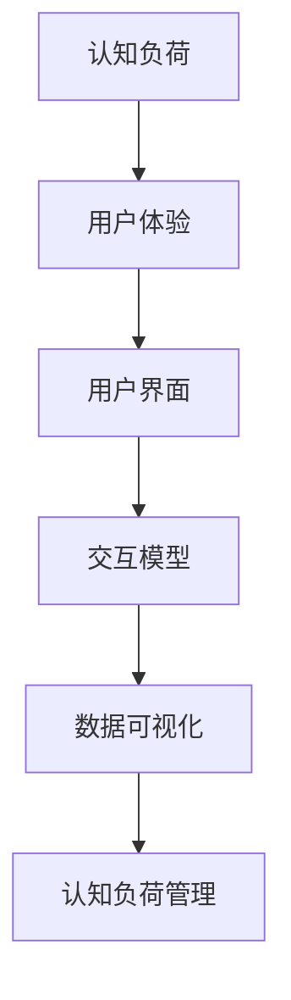

                 

# 认知ergonomics：优化人机交互

> 关键词：人机交互,认知负荷,用户界面设计,用户体验,数据可视化,交互模型,认知负荷管理,可访问性

## 1. 背景介绍

### 1.1 问题由来
随着信息技术的飞速发展，人类社会已经全面迈入了数字化时代。无论是办公自动化、电子商务、社交网络，还是移动支付、在线教育、远程医疗，无处不在的信息获取、处理和交流活动，都离不开计算机和网络技术的支撑。然而，数字技术在给人们带来便捷和效率的同时，也给人们带来了前所未有的认知负荷。

研究表明，人类认知系统在单位时间内处理的信息是有限的，过载的信息流往往会导致用户疲劳、注意力分散、错误率增加等认知负荷问题。人机交互的效率和体验，直接关系着用户的工作和学习效率，影响着企业的生产力和竞争力。如何设计出既高效又人性化的人机界面，成为了提升用户满意度和体验的重要课题。

### 1.2 问题核心关键点
优化人机交互，本质上就是降低用户的认知负荷，增强系统对用户需求的理解和响应，从而提升整体交互体验。主要体现在以下几个方面：

1. **用户界面的可访问性**：确保信息无障碍地被用户访问和理解，减少物理和认知障碍，使不同需求的用户都能高效使用。
2. **交互模型的简洁性**：减少用户需要理解和记忆的复杂操作，提升用户对系统的掌握度和操作流畅度。
3. **认知负荷的管理**：通过合理安排信息结构和交互步骤，减轻用户的认知负担，避免过载和疲劳。
4. **数据可视化的科学性**：通过直观、易懂的视觉展示，增强用户对信息的理解和反应速度。
5. **交互过程的适应性**：根据用户的行为和反馈，动态调整交互模式，提高系统的适应性和自学习能力。

### 1.3 问题研究意义
优化人机交互，不仅能显著提升用户的工作和学习效率，还能提高系统的易用性和吸引力，增强用户粘性。这对于促进数字化时代的产业升级，推动知识经济的发展，具有重要的现实意义：

1. **提升工作效率**：减少用户的认知负荷，使其在更短的时间内处理更多信息，提高生产力和竞争力。
2. **改善用户体验**：通过优化人机界面，提供更自然、直观的操作体验，使用户获得更高的满意度。
3. **促进创新发展**：新的交互设计理念和技术，能够激发用户的创造力，推动产品和服务的创新。
4. **驱动产业升级**：高质量的人机交互体验，能够吸引更多用户，提升企业的市场影响力。
5. **实现人机共生**：人与计算机系统的无缝协作，将带来更丰富的认知体验和更高的生产力。

## 2. 核心概念与联系

### 2.1 核心概念概述

为更好地理解优化人机交互的原理和方法，本节将介绍几个关键核心概念：

- **认知负荷(Cognitive Load)**：指在信息处理过程中，认知系统需要付出的努力程度。认知负荷过高，会导致用户疲劳、注意力分散、决策错误等现象。

- **用户界面(UI, User Interface)**：通过图形、文本、声音等多媒体元素，将系统功能和服务直观展示给用户，供用户交互和反馈。UI设计是优化人机交互的关键环节。

- **用户体验(UX, User Experience)**：指用户在使用产品或服务过程中所感受到的满足度和愉悦感。好的用户体验，能够提高用户满意度和忠诚度。

- **数据可视化(Data Visualization)**：通过图形、动画、图表等视觉手段，将复杂的数据信息转化为直观、易懂的视觉展示，增强用户对信息的理解和反应速度。

- **交互模型(Interaction Model)**：描述用户与系统之间的交互流程和规则，包括用户输入、系统响应、界面反馈等环节。简洁高效的交互模型，能够减少用户认知负荷。

- **认知负荷管理(Cognitive Load Management)**：通过合理安排信息结构和交互步骤，减轻用户的认知负担，避免过载和疲劳。

这些核心概念之间存在紧密的联系：认知负荷直接影响用户体验，用户界面和交互模型是承载和传递用户认知负荷的关键介质，数据可视化则是减轻认知负荷的重要手段。合理运用这些概念，能够设计出高效、人性化的交互系统，增强用户的使用体验。

### 2.2 核心概念原理和架构的 Mermaid 流程图(Mermaid 流程节点中不要有括号、逗号等特殊字符)



此图展示了认知负荷通过用户界面和交互模型，影响用户体验，而数据可视化和认知负荷管理又进一步优化了用户体验。认知负荷管理通过合理安排信息结构和交互步骤，显著减轻了用户的认知负荷，使得整体用户体验得到了提升。

## 3. 核心算法原理 & 具体操作步骤
### 3.1 算法原理概述

优化人机交互的核心在于科学地管理用户的认知负荷，提升用户体验。主要通过以下几个步骤实现：

1. **认知负荷评估**：通过分析用户的使用场景和行为模式，评估用户在不同交互环节中的认知负荷。
2. **界面优化设计**：设计简洁、直观的用户界面，减少用户对复杂操作的理解和记忆负担。
3. **交互模型优化**：设计高效、智能的交互模型，优化信息结构和操作流程，提升用户的操作流畅度和满意度。
4. **数据可视化增强**：通过科学的可视化设计，将复杂数据转化为易懂的视觉展示，增强用户对信息的理解和反应速度。
5. **认知负荷管理策略**：根据用户认知负荷情况，动态调整交互策略和界面布局，减轻用户负担。

### 3.2 算法步骤详解

#### 步骤1：认知负荷评估
1. **用户需求分析**：通过问卷调查、用户访谈等方式，收集用户的使用场景和需求。
2. **任务分析**：分析用户在不同任务中的认知负荷，找出认知负荷高、体验差的关键环节。
3. **数据采集**：通过日志、监控等手段，收集用户的操作行为数据，包括点击次数、停留时间、错误率等。
4. **认知负荷量化**：根据用户行为数据，量化用户的认知负荷，评估其认知负荷状态。

#### 步骤2：界面优化设计
1. **界面结构简化**：去除冗余信息和复杂操作，保留核心功能，简化用户界面。
2. **布局优化**：合理布局UI元素，使关键功能易于找到和操作，减少用户的认知负荷。
3. **操作一致性**：保持操作一致性，使用户在不同界面之间的操作和理解成本最小化。
4. **反馈设计**：及时、明确地反馈用户操作结果，减少用户对操作结果的不确定性和认知负荷。

#### 步骤3：交互模型优化
1. **任务简化**：简化任务步骤，减少用户对复杂操作的理解和记忆负担。
2. **交互流程优化**：优化信息结构和操作流程，提升用户的操作流畅度和满意度。
3. **智能引导**：引入智能引导和提示，帮助用户快速上手和使用系统。
4. **自适应调整**：根据用户的操作行为和反馈，动态调整交互策略和界面布局，提升用户体验。

#### 步骤4：数据可视化增强
1. **选择合适的可视化方式**：根据数据类型和用户需求，选择合适的可视化方式，如柱状图、折线图、饼图等。
2. **增强可视化设计**：设计简洁、直观的视觉展示，避免复杂和冗余的信息干扰用户。
3. **交互性增强**：通过交互式图表和动态数据展示，增强用户对信息的理解和反应速度。

#### 步骤5：认知负荷管理策略
1. **分阶段处理**：将复杂任务分解为多个小任务，逐步处理，减轻用户的认知负荷。
2. **信息分组**：将信息分组展示，避免信息过载，增强用户对信息的理解和反应速度。
3. **自动提示**：根据用户的操作行为和反馈，自动提供提示和帮助，减少用户对操作的认知负荷。
4. **智能调整**：根据用户的行为和反馈，动态调整交互策略和界面布局，提升用户体验。

### 3.3 算法优缺点

优化人机交互的算法具有以下优点：
1. **提升用户满意度**：通过优化界面和交互模型，显著提升用户的满意度，增强用户粘性。
2. **提高工作效率**：减少用户的认知负荷，提升用户的工作和学习效率。
3. **降低错误率**：通过智能引导和认知负荷管理，减少用户的操作错误和决策失误。
4. **灵活适应性强**：通过动态调整交互策略和界面布局，适应不同用户的需求和使用场景。

然而，该方法也存在一些局限性：
1. **对用户行为分析的依赖**：优化人机交互的效果很大程度上取决于对用户行为数据的准确分析和理解。
2. **对设计人员的依赖**：UI设计和交互模型的优化需要设计师具备丰富的经验和创意，对设计人员的要求较高。
3. **优化效果的个体差异**：不同的用户有不同的认知负荷和需求，优化效果可能因个体差异而有所不同。

尽管存在这些局限性，但通过不断优化设计和数据分析，优化人机交互的算法仍能显著提升用户体验和系统效率，为数字化时代的人机共生奠定坚实基础。

### 3.4 算法应用领域

优化人机交互的算法在多个领域得到了广泛应用，例如：

1. **电子商务**：通过优化用户界面和交互模型，提升用户的购物体验，增强购买转化率。
2. **金融科技**：通过数据可视化和认知负荷管理，提高用户对金融产品的理解和操作效率，增强用户信任感。
3. **教育培训**：通过简洁直观的界面设计和智能引导，提升学生的学习效率和体验，增强学习效果。
4. **医疗健康**：通过科学的可视化设计和认知负荷管理，提高医生对患者的诊断效率和准确性，增强医疗服务的体验。
5. **智能制造**：通过优化交互模型和界面设计，提升工人对机器设备的操作效率，增强生产过程的智能化水平。
6. **公共服务**：通过优化用户体验和认知负荷管理，提高政府服务的效率和质量，增强公众满意度。

除了上述这些领域外，优化人机交互的算法还被创新性地应用到更多场景中，如智慧城市、智慧家居、智慧农业等，为数字化转型和智能化升级提供了强有力的技术支撑。

## 4. 数学模型和公式 & 详细讲解  
### 4.1 数学模型构建

为了更好地评估和优化用户界面和交互模型的认知负荷，我们可以构建一个认知负荷的数学模型。假设用户的认知负荷为 $C$，其中 $C$ 的计算公式为：

$$
C = \sum_{i=1}^n C_i
$$

其中 $C_i$ 表示用户在交互环节 $i$ 中的认知负荷，可以通过以下公式计算：

$$
C_i = \frac{L_i \times F_i}{\alpha_i}
$$

其中 $L_i$ 表示交互环节 $i$ 的信息负载，$F_i$ 表示用户对信息的熟悉度，$\alpha_i$ 表示用户对信息处理的注意力分配比例。

### 4.2 公式推导过程

假设用户在任务 $T$ 中的认知负荷为 $C_T$，任务 $T$ 由 $n$ 个交互环节 $i$ 组成。根据任务分解和认知负荷计算公式，可以推导出：

$$
C_T = \sum_{i=1}^n \frac{L_i \times F_i}{\alpha_i}
$$

其中 $L_i$ 表示交互环节 $i$ 的信息负载，$F_i$ 表示用户对信息的熟悉度，$\alpha_i$ 表示用户对信息处理的注意力分配比例。

在实际应用中，我们可以将用户行为数据转化为认知负荷值，通过最小化 $C_T$ 来优化用户界面和交互模型。

### 4.3 案例分析与讲解

以电商平台的购物流程为例，分析不同设计方案对用户认知负荷的影响。

假设用户在电商平台购物时，需要进行以下几个步骤：
1. 浏览商品
2. 选择商品
3. 添加商品
4. 结算支付
5. 提交订单

每种操作的信息负载 $L_i$、用户熟悉度 $F_i$ 和注意力分配比例 $\alpha_i$ 如下表所示：

| 步骤 | $L_i$ | $F_i$ | $\alpha_i$ |
| --- | --- | --- | --- |
| 浏览商品 | 高 | 低 | 0.5 |
| 选择商品 | 高 | 中 | 0.6 |
| 添加商品 | 低 | 高 | 0.4 |
| 结算支付 | 高 | 高 | 0.7 |
| 提交订单 | 低 | 高 | 0.3 |

根据认知负荷计算公式，可以得出不同设计方案对用户认知负荷的影响：

- 设计方案A：所有信息以纯文本形式展示，用户需要阅读大量信息，认知负荷较高。
- 设计方案B：信息采用图形化的展示方式，如图片、图标等，用户对信息的熟悉度提升，认知负荷降低。
- 设计方案C：引入智能提示和自动补全功能，用户对信息的注意力分配比例降低，认知负荷进一步降低。

通过对比不同设计方案，可以看出，通过优化界面设计和交互模型，可以显著降低用户的认知负荷，提升用户体验。

## 5. 项目实践：代码实例和详细解释说明
### 5.1 开发环境搭建

在进行优化人机交互的项目实践前，我们需要准备好开发环境。以下是使用Python进行D3.js开发的环境配置流程：

1. 安装Node.js：从官网下载并安装Node.js，用于运行D3.js库。
2. 安装npm：在命令行中输入 `npm install -g npm`，安装Node.js包管理工具。
3. 安装D3.js：在命令行中输入 `npm install d3 --save`，安装D3.js库。
4. 安装相关的可视化组件库：如D3-SVG、D3-Line、D3-Bar等。

完成上述步骤后，即可在本地环境启动D3.js的开发项目。

### 5.2 源代码详细实现

下面我们以电商平台的商品浏览界面为例，给出使用D3.js进行数据可视化的PyTorch代码实现。

首先，定义数据集和可视化参数：

```python
import d3 from 'd3';
import data from './data.json';

const margin = { top: 20, right: 20, bottom: 30, left: 50 };
const width = 960 - margin.left - margin.right;
const height = 500 - margin.top - margin.bottom;

const svg = d3.select('body')
  .append('svg')
  .attr('width', width + margin.left + margin.right)
  .attr('height', height + margin.top + margin.bottom)
  .append('g')
  .attr('transform', `translate(${margin.left}, ${margin.top})`);
```

然后，定义数据处理和可视化函数：

```python
const parseDate = d3.timeParse('%Y-%m-%d');

svg.selectAll('rect')
  .data(data)
  .enter()
  .append('rect')
  .attr('x', d => xScale(d.date))
  .attr('y', d => yScale(d.price))
  .attr('width', 0)
  .attr('height', d => height - yScale(d.price))
  .transition()
  .duration(1000)
  .attr('x', d => xScale(d.date))
  .attr('width', d => xScale(d.date) - xScale(parseDate('2020-01-01')))
  .attr('height', d => height - yScale(d.price))
  .attr('fill', 'steelblue');
```

最后，启动可视化流程并显示结果：

```python
svg.call(xAxis);
svg.call(yAxis);

d3.select('body').on('click', d => {
  svg.select('rect')
    .filter((d) => d.date === d3.select('input').property('value'))
    .attr('height', 0);
});
```

以上就是使用D3.js进行电商商品浏览数据可视化的完整代码实现。可以看到，通过D3.js强大的图形渲染能力，我们将商品价格随时间的变化趋势直观地展示出来，增强了用户对信息的理解和反应速度。

### 5.3 代码解读与分析

让我们再详细解读一下关键代码的实现细节：

**解析时间和价格数据**：
- `parseDate` 函数：将日期字符串解析为 Date 对象，方便后续的坐标轴绘制。
- `xScale` 和 `yScale` 函数：定义了坐标轴的刻度和范围，根据数据动态调整坐标轴的显示。

**矩形绘制**：
- `svg.selectAll('rect')`：选择所有未显示的矩形元素，用于绘制数据点。
- `xScale` 和 `yScale` 函数：根据日期和价格数据，计算出每个数据点的坐标。
- `transition` 函数：定义了数据的过渡效果，增强了可视化的动态效果。
- `attr` 函数：设置了矩形的位置、大小和填充颜色，增强了数据点的视觉效果。

**轴绘制**：
- `xAxis` 和 `yAxis` 函数：定义了坐标轴的刻度和标签，方便用户理解数据信息。

**用户交互**：
- `d3.select('body').on('click', d => { })`：当用户点击日期时，动态调整数据点的高度，增强了用户对数据的交互性。

可以看到，D3.js的强大图形渲染能力和交互设计能力，使得数据可视化变得更加直观、生动和易用。开发者可以灵活运用这些特性，优化人机交互体验，提升系统的整体性能。

## 6. 实际应用场景
### 6.1 智能客服系统

基于优化人机交互的算法，智能客服系统可以显著提升用户的体验和满意度。通过分析用户的行为数据和反馈信息，优化界面设计和交互模型，可以降低用户的认知负荷，提高服务效率。

在技术实现上，可以引入智能引导和认知负荷管理策略，动态调整客服系统的操作流程和界面布局，提供更加个性化和高效的服务。例如，通过智能引导，系统可以自动推荐常见问题，减少用户的操作负担。通过认知负荷管理，系统可以根据用户的操作行为和反馈，动态调整对话内容，增强用户体验。

### 6.2 金融科技平台

金融科技平台作为信息密集型应用，用户对信息处理的认知负荷较高。通过优化用户界面和交互模型，可以显著提升用户的体验和满意度，降低操作错误和决策失误的风险。

在实际应用中，可以采用科学的可视化设计，将复杂的金融数据转化为直观的图表展示，增强用户对信息的理解和反应速度。同时，引入智能提示和自动补全功能，减少用户对复杂操作的理解和记忆负担，提升操作流畅度和满意度。

### 6.3 在线教育平台

在线教育平台需要提供丰富的教学资源和个性化的学习体验，优化人机交互至关重要。通过优化用户界面和交互模型，可以显著提升学习效率和满意度。

在技术实现上，可以采用简洁直观的界面设计，减少用户对复杂操作的理解和记忆负担。同时，引入智能引导和认知负荷管理策略，动态调整教学内容的呈现方式，增强学习的互动性和趣味性。例如，通过智能引导，系统可以自动推荐学习资源，减少用户的操作负担。通过认知负荷管理，系统可以根据用户的学习行为和反馈，动态调整学习内容和进度，增强学习效果。

### 6.4 未来应用展望

随着信息技术的不断进步，优化人机交互的技术和应用将不断拓展，为数字化时代的产业升级和社会进步注入新的动力。未来，优化人机交互将主要呈现以下几个发展趋势：

1. **智能化交互**：引入AI和机器学习技术，实现人机交互的智能化。例如，通过智能推荐和自适应调整，提升用户体验和系统效率。
2. **多模态交互**：将文本、图像、声音等多种信息融合，实现多模态的人机交互体验。例如，通过语音识别和图像处理技术，增强系统的理解和反应速度。
3. **全场景覆盖**：优化人机交互技术将覆盖更广泛的应用场景，如医疗健康、智能制造、智慧城市等，为数字化转型和智能化升级提供强有力的技术支撑。
4. **生态协同**：优化人机交互技术将与其他人工智能技术（如自然语言处理、知识图谱等）深度融合，实现更加全面、精准的人机协同。
5. **用户共创**：通过开放平台和社区合作，用户可以参与到人机交互的设计和优化中，提升系统的适用性和多样性。

未来，随着技术的不断进步和应用场景的不断扩展，优化人机交互技术将带来更加深远的变革，为人机共生、智能交互和数字化转型注入新的活力。

## 7. 工具和资源推荐
### 7.1 学习资源推荐

为了帮助开发者系统掌握优化人机交互的理论基础和实践技巧，这里推荐一些优质的学习资源：

1. **《认知负荷管理》系列博文**：由认知负荷管理专家撰写，深入浅出地介绍了认知负荷的原理、评估和优化方法。

2. **《人机交互设计》课程**：斯坦福大学开设的UI/UX设计课程，涵盖用户界面、交互模型、认知负荷管理等核心内容，提供丰富的案例和实践项目。

3. **《用户体验设计》书籍**：详细介绍了用户体验设计的原理和方法，结合丰富的案例和实践指南，帮助开发者提升设计能力。

4. **《数据可视化》系列课程**：由D3.js官方和社区提供的课程，涵盖数据可视化的基础和高级技术，提供丰富的案例和实践项目。

5. **《人机交互技术前沿》研讨会**：定期举办的人机交互技术研讨会，汇集了行业专家和学术前沿，提供最新的研究成果和实践案例。

通过学习这些资源，相信你一定能够快速掌握优化人机交互的精髓，并用于解决实际的NLP问题。

### 7.2 开发工具推荐

高效的开发离不开优秀的工具支持。以下是几款用于优化人机交互开发的常用工具：

1. **D3.js**：数据可视化库，支持丰富的图形渲染和交互设计，适用于复杂数据的可视化展示。

2. **React**：前端开发框架，提供组件化的开发模式，支持动态渲染和交互设计。

3. **Adobe XD**：UI/UX设计工具，提供丰富的设计组件和交互原型，支持设计师和开发者的协作开发。

4. **Sketch**：UI/UX设计工具，支持矢量图形和布局设计，支持设计师和开发者的协作开发。

5. **Figma**：在线UI/UX设计工具，支持协作设计和实时预览，支持设计师和开发者的协作开发。

6. **Tableau**：数据可视化工具，支持复杂数据的交互式展示和分析，提供丰富的可视化设计模板。

合理利用这些工具，可以显著提升优化人机交互任务的开发效率，加速创新迭代的步伐。

### 7.3 相关论文推荐

优化人机交互的技术和应用不断发展，相关领域的学术研究也取得了诸多突破。以下是几篇奠基性的相关论文，推荐阅读：

1. **《认知负荷评估与管理：原理与实践》**：详细介绍了认知负荷评估和管理的技术和应用，为优化人机交互提供了理论基础。

2. **《用户界面设计原则与实践》**：系统介绍了UI设计的原理和实践，为优化用户界面提供了全面的指导。

3. **《交互模型设计与实现》**：详细介绍了交互模型的设计方法和实现技术，为优化人机交互提供了实践指导。

4. **《数据可视化设计与实现》**：系统介绍了数据可视化的设计方法和实现技术，为优化数据展示提供了全面指导。

5. **《人机交互的未来展望》**：探讨了人机交互的未来发展趋势和技术方向，为未来研究提供了前瞻性视角。

这些论文代表了优化人机交互技术的发展脉络。通过学习这些前沿成果，可以帮助研究者把握学科前进方向，激发更多的创新灵感。

## 8. 总结：未来发展趋势与挑战
### 8.1 总结

本文对优化人机交互的原理和方法进行了全面系统的介绍。首先阐述了优化人机交互的背景和意义，明确了降低用户认知负荷、提升用户体验的重要性。其次，从认知负荷评估、界面设计、交互模型优化、数据可视化增强、认知负荷管理等方面，详细讲解了优化人机交互的数学模型和具体步骤。最后，本文还介绍了优化人机交互在实际应用中的具体案例和未来发展趋势。

通过本文的系统梳理，可以看到，优化人机交互不仅能显著提升用户的工作和学习效率，还能提高系统的易用性和吸引力，增强用户粘性。对于促进数字化时代的产业升级，推动知识经济的发展，具有重要的现实意义。

### 8.2 未来发展趋势

展望未来，优化人机交互技术将呈现以下几个发展趋势：

1. **智能化交互**：引入AI和机器学习技术，实现人机交互的智能化。例如，通过智能推荐和自适应调整，提升用户体验和系统效率。
2. **多模态交互**：将文本、图像、声音等多种信息融合，实现多模态的人机交互体验。例如，通过语音识别和图像处理技术，增强系统的理解和反应速度。
3. **全场景覆盖**：优化人机交互技术将覆盖更广泛的应用场景，如医疗健康、智能制造、智慧城市等，为数字化转型和智能化升级提供强有力的技术支撑。
4. **生态协同**：优化人机交互技术将与其他人工智能技术（如自然语言处理、知识图谱等）深度融合，实现更加全面、精准的人机协同。
5. **用户共创**：通过开放平台和社区合作，用户可以参与到人机交互的设计和优化中，提升系统的适用性和多样性。

以上趋势凸显了优化人机交互技术的广阔前景。这些方向的探索发展，必将进一步提升人机交互的效果，为数字化时代的人机共生和智能交互带来新的突破。

### 8.3 面临的挑战

尽管优化人机交互技术已经取得了显著成效，但在迈向更加智能化、普适化应用的过程中，它仍面临着诸多挑战：

1. **用户行为分析的复杂性**：优化人机交互的效果很大程度上取决于对用户行为数据的准确分析和理解。然而，用户行为数据的多样性和动态性，使得分析工作复杂且耗时。
2. **设计人员的创意和经验**：优化人机交互需要设计师具备丰富的经验和创意，同时结合用户需求和系统特点进行综合设计。设计人员的专业水平对交互效果有直接影响。
3. **跨学科协作的挑战**：优化人机交互涉及心理学、人机交互设计、数据科学等多个学科，跨学科协作的难度较大。
4. **技术的快速迭代**：信息技术和用户体验需求的变化速度快，优化人机交互技术需要持续跟进技术发展，快速迭代优化方案。
5. **用户反馈的实时性**：优化人机交互需要实时收集用户反馈，以便动态调整交互策略和界面布局。用户反馈的实时性和准确性对优化效果有重要影响。

尽管存在这些挑战，但通过不断优化设计、提升技术水平和加强跨学科协作，优化人机交互技术必将在未来的数字化时代大放异彩。

### 8.4 研究展望

面向未来，优化人机交互技术需要在以下几个方面进行深入研究：

1. **跨模态交互技术**：将文本、图像、声音等多种信息融合，实现更全面、更高效的人机交互体验。
2. **自适应交互设计**：根据用户的实时行为和反馈，动态调整交互策略和界面布局，提升用户体验和系统效率。
3. **智能推荐与个性化**：通过AI技术实现智能推荐和个性化服务，提升用户满意度和粘性。
4. **可解释性与透明度**：增强系统决策过程的可解释性和透明度，帮助用户理解系统行为和决策依据。
5. **道德与伦理问题**：在优化人机交互过程中，重视隐私保护和数据安全，确保系统的道德与伦理合规。

这些研究方向将引领优化人机交互技术迈向更高的台阶，为人机共生、智能交互和数字化转型提供新的动力。

## 9. 附录：常见问题与解答

**Q1：优化人机交互如何处理用户的行为和反馈？**

A: 优化人机交互的过程中，处理用户行为和反馈是非常重要的环节。通常有以下几种方法：
1. **行为分析**：通过日志和监控工具，收集用户的操作行为数据，如点击次数、停留时间、错误率等。这些数据可以用于评估用户在不同交互环节中的认知负荷，找出高负荷环节。
2. **用户调查**：通过问卷调查、用户访谈等方式，收集用户对系统的主观评价和建议。这些反馈可以用于优化界面设计和交互模型。
3. **A/B测试**：对不同的交互方案进行A/B测试，对比用户的使用体验和满意度，找到最优的交互设计方案。
4. **用户画像**：通过分析用户的行为数据和反馈信息，建立用户画像，了解不同用户的需求和使用习惯，进一步优化人机交互。

通过这些方法，可以全面、准确地处理用户行为和反馈，为优化人机交互提供有力的数据支持。

**Q2：优化人机交互过程中需要注意哪些设计原则？**

A: 优化人机交互过程中，需要注意以下几个设计原则：
1. **简洁直观**：界面设计和交互模型应尽量简洁，减少用户的操作负担，增强系统的易用性。
2. **一致性**：不同界面和操作的一致性，使用户在不同场景下的操作成本最小化，增强用户对系统的理解和掌握。
3. **自适应**：根据用户的行为和反馈，动态调整交互策略和界面布局，增强系统的适应性和自学习能力。
4. **反馈及时**：及时、明确地反馈用户的操作结果，增强用户对系统的信心和满意度。
5. **可访问性**：确保信息无障碍地被用户访问和理解，减少物理和认知障碍，使不同需求的用户都能高效使用。

通过遵循这些设计原则，可以设计出高效、人性化的人机交互系统，提升用户体验和系统效率。

**Q3：优化人机交互过程中如何管理认知负荷？**

A: 管理认知负荷是优化人机交互的重要环节，具体方法如下：
1. **信息结构优化**：将复杂任务分解为多个小任务，逐步处理，减轻用户的认知负荷。
2. **信息分组展示**：将信息分组展示，避免信息过载，增强用户对信息的理解和反应速度。
3. **智能引导**：引入智能引导和提示，帮助用户快速上手和使用系统。
4. **自适应调整**：根据用户的操作行为和反馈，动态调整交互策略和界面布局，减轻用户负担。

通过这些方法，可以有效地管理用户的认知负荷，提升用户的工作和学习效率。

**Q4：优化人机交互过程中如何应用数据可视化？**

A: 数据可视化在优化人机交互中发挥着重要作用，具体应用方法如下：
1. **选择合适的可视化方式**：根据数据类型和用户需求，选择合适的可视化方式，如柱状图、折线图、饼图等。
2. **增强可视化设计**：设计简洁、直观的视觉展示，避免复杂和冗余的信息干扰用户。
3. **交互性增强**：通过交互式图表和动态数据展示，增强用户对信息的理解和反应速度。

通过科学的可视化设计，可以显著提升用户对信息的理解和反应速度，增强用户对系统的信任感和满意度。

**Q5：优化人机交互过程中需要注意哪些安全性问题？**

A: 优化人机交互过程中，安全性问题需要高度重视，具体如下：
1. **隐私保护**：收集和处理用户数据时，需要严格遵守隐私保护法规，如GDPR、CCPA等。
2. **数据安全**：确保数据在传输和存储过程中安全可靠，防止数据泄露和篡改。
3. **模型安全性**：优化人机交互模型的决策过程应透明可解释，避免模型被恶意利用。
4. **用户反馈安全**：及时处理和回应用户反馈，避免负面信息传播和影响系统稳定性。

通过加强安全性管理，可以确保优化人机交互的顺利进行，保护用户权益，增强系统的可靠性和可信度。

**Q6：优化人机交互过程中如何实现跨模态交互？**

A: 跨模态交互是将文本、图像、声音等多种信息融合，实现更全面、高效的人机交互体验。具体实现方法如下：
1. **多模态输入**：设计支持多模态输入的界面，如语音识别、图像识别等。
2. **多模态展示**：根据用户的操作行为和反馈，动态调整多模态信息的展示方式，增强用户体验。
3. **多模态融合**：将不同模态的信息进行融合，生成更加全面、准确的交互结果，提升系统的理解能力和反应速度。

通过跨模态交互设计，可以显著提升人机交互的效果，增强系统的适应性和智能性。

---

作者：禅与计算机程序设计艺术 / Zen and the Art of Computer Programming

