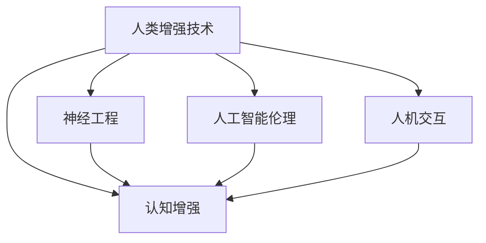

                 

# 认知增强与伦理：人类增强技术的争议

> 关键词：人类增强技术, 认知增强, 神经工程, 人工智能伦理, 人机交互

## 1. 背景介绍

### 1.1 问题由来

随着科技的迅猛发展，人类增强技术（Human Augmentation Technology）逐渐进入公众视野。这一技术涵盖了神经工程、人工智能、生物科技等多个前沿领域，旨在通过增强人类认知能力、提升信息处理效率，帮助人类突破生理和心理的极限，实现全面的自我优化。然而，这项技术的崛起也带来了诸多伦理争议和社会问题。

近年来，神经芯片的植入、基因编辑、大脑刺激等技术逐渐应用于实际应用，如增强记忆力、提高学习效率、改善情感控制等方面。尽管这些技术在短期内带来了显著的认知提升，但其长远的社会影响和社会伦理问题也引起了广泛关注。例如，增强技术的商业化可能加剧社会不平等，引发对人类本质的哲学思考，甚至影响人类文明的发展路径。

### 1.2 问题核心关键点

人类增强技术涉及的关键问题包括：
- 认知增强效果是否显著：技术带来的认知提升能否满足人类的实际需求？
- 安全性和伦理性：人类增强技术的长期副作用是什么？是否会对人类社会产生负面影响？
- 法律和政策框架：人类增强技术是否需要严格的法律和政策监管？如何平衡技术创新与人类权利？
- 公共认知和接受度：普通公众如何理解人类增强技术？是否接受这些技术？
- 技术普及与普惠性：人类增强技术是否能普及到所有人群，还是只会加剧社会分层？

这些问题不仅涉及到技术本身，还涉及到伦理、法律、社会等诸多维度，因此需要从多方面进行综合探讨。

### 1.3 问题研究意义

研究人类增强技术的伦理争议，对于把握技术发展方向、优化技术应用方案、构建健康可持续的社会环境，具有重要意义：

1. **技术发展方向**：帮助明确人类增强技术的研发方向，避免陷入伦理泥沼，促进健康发展。
2. **应用方案优化**：引导技术应用的伦理考量，避免因技术误用引发的社会问题，提升技术效益。
3. **社会环境构建**：通过合理的法律和政策框架，保障人类增强技术的安全性、公平性，维护社会稳定。
4. **公众认知提升**：普及技术知识，提升公众对人类增强技术的理解，增强社会对技术接受度。
5. **普惠性保障**：保障技术普及，避免技术鸿沟，实现技术普惠性，提升社会整体福祉。

## 2. 核心概念与联系

### 2.1 核心概念概述

为更好地理解人类增强技术及其伦理争议，本节将介绍几个关键概念：

- **人类增强技术（Human Augmentation Technology）**：通过神经工程、基因编辑、人工智能等手段，增强人类认知能力、提升信息处理效率的技术。
- **认知增强（Cognitive Enhancement）**：通过神经刺激、药物干预等方式，提升人类的记忆力、注意力、学习能力等认知功能。
- **神经工程（Neuroengineering）**：通过电子、光学、化学等手段，直接干预人类大脑活动的技术。
- **人工智能伦理（AI Ethics）**：研究人工智能技术的伦理问题，如隐私、公平、安全、责任等。
- **人机交互（Human-Computer Interaction）**：研究人与计算机系统之间的信息交换方式，优化人机协作体验。

这些概念之间的逻辑关系可以通过以下Mermaid流程图来展示：



这个流程图展示了几大关键概念之间的联系：

1. 人类增强技术包括认知增强、神经工程、人工智能伦理和人机交互等多个方面。
2. 认知增强是增强技术的重要组成部分，通过神经刺激、药物干预等方式提升认知功能。
3. 神经工程通过直接干预大脑活动，实现对认知过程的精细调控。
4. 人工智能伦理研究增强技术的伦理问题，如隐私保护、公平性、安全性等。
5. 人机交互研究人机协作方式，提升技术应用的便捷性和用户体验。

这些概念共同构成了人类增强技术的理论框架，为其应用和普及提供了科学依据。

## 3. 核心算法原理 & 具体操作步骤

### 3.1 算法原理概述

人类增强技术的核心算法原理可以概括为：通过增强人类认知系统，提升信息处理能力，实现人类在智能、情感、生理等方面的全面优化。其主要技术包括：

- **神经芯片植入**：将微小的神经芯片植入大脑，实现对大脑神经信号的实时监测和调控。
- **基因编辑技术**：通过CRISPR-Cas9等技术，修改特定基因，增强神经细胞的功能。
- **大脑刺激**：通过电刺激、磁刺激等方式，激活特定神经网络，提升认知功能。
- **认知药物**：研发针对特定认知障碍的药物，改善记忆力、注意力等认知功能。
- **认知训练**：通过算法训练，提升用户的认知能力，如记忆训练、注意力训练等。

这些技术均基于对人类大脑的深入研究，通过增强神经信号传递、改善神经元功能、优化认知结构等方式，实现对认知系统的优化提升。

### 3.2 算法步骤详解

人类增强技术的实施步骤一般包括以下几个关键环节：

**Step 1: 评估需求与风险**
- 评估目标人群的需求，确定增强技术的适用对象。
- 评估技术的安全性和伦理风险，确保技术的可行性。

**Step 2: 选择干预方式**
- 根据目标人群的需求和风险评估结果，选择最适合的增强方式，如神经芯片植入、基因编辑、大脑刺激等。

**Step 3: 实施干预**
- 设计干预方案，选择合适的技术手段。
- 进行临床试验，评估干预效果，验证安全性。
- 对用户进行干预，实时监测反应和效果。

**Step 4: 后续监测与优化**
- 对用户进行长期跟踪监测，评估干预效果。
- 根据监测结果优化干预方案，提升干预效果。

**Step 5: 技术普及与推广**
- 推广技术应用，提高公众认知度。
- 优化技术方案，降低成本，提升普惠性。

### 3.3 算法优缺点

人类增强技术具有以下优点：
1. **提升认知能力**：通过增强神经信号传递、改善神经元功能等手段，显著提升记忆力、注意力等认知功能。
2. **改善生活质量**：缓解认知障碍，提高生活质量，增强社会竞争力。
3. **促进科学研究**：通过增强技术，研究人员可以更深入地探索人类大脑的秘密，推动科学进步。

但同时也存在一些缺点：
1. **安全风险**：技术干预可能引发副作用，如神经损伤、认知失调等。
2. **伦理争议**：技术干预可能触及人类自然本质，引发伦理争议。
3. **公平性问题**：技术普及可能加剧社会不平等，引发公平性问题。
4. **隐私风险**：技术干预涉及对大脑活动的监测，可能引发隐私泄露问题。
5. **社会影响**：技术普及可能引发社会结构变化，影响人类文明的进步方向。

### 3.4 算法应用领域

人类增强技术已经在多个领域得到应用，例如：

- **医疗健康**：通过认知增强技术，改善阿尔茨海默病、抑郁症等认知障碍症状。
- **教育培训**：通过增强记忆力、注意力等认知功能，提升学生的学习效果。
- **职业培训**：通过认知增强技术，提升职业培训效果，增强职业竞争力。
- **心理治疗**：通过大脑刺激等技术，改善焦虑、抑郁等心理问题。
- **娱乐休闲**：通过认知增强技术，提升游戏体验、阅读享受等休闲活动质量。

这些领域的应用展示了人类增强技术的广泛前景，同时也带来了新的挑战和伦理争议。

## 4. 数学模型和公式 & 详细讲解 & 举例说明

### 4.1 数学模型构建

本节将使用数学语言对人类增强技术的核心算法进行更加严格的刻画。

记人类增强技术为 $T$，其中 $T$ 包括神经芯片植入、基因编辑、大脑刺激等多种方式。设目标人群为 $P$，增强技术对目标人群的影响函数为 $f(P)$，则人类增强技术的总体效果可以表示为：

$$
E(T) = \int_{P} f(P)dP
$$

其中 $E(T)$ 表示人类增强技术对目标人群的总体效果。

### 4.2 公式推导过程

以下我们以基因编辑技术为例，推导其效果函数及其优化方法。

假设基因编辑技术对目标人群 $P$ 的效果函数为 $f(P) = \alpha P + \beta P^2$，其中 $\alpha$ 和 $\beta$ 为系数。则总体效果可以表示为：

$$
E(T) = \int_{P} (\alpha P + \beta P^2)dP = \alpha \frac{P^2}{2} + \beta \frac{P^3}{3} \Big|_P
$$

为了最大化总体效果，需要求解上述积分的最大值，即求导数为零的点。通过求导，得：

$$
\frac{dE(T)}{dP} = \alpha P + 2\beta P^2 = 0
$$

解得：

$$
P = -\frac{\alpha}{2\beta}
$$

当 $P$ 取上述值时，总体效果达到最大。因此，基因编辑技术的效果优化目标为：

$$
\max_{P} E(T) = \alpha \frac{P^2}{2} + \beta \frac{P^3}{3} \Big|_P
$$

### 4.3 案例分析与讲解

**案例一：认知药物**

设认知药物对目标人群 $P$ 的效果函数为 $f(P) = k \exp(-\frac{P}{\tau})$，其中 $k$ 为药物效果系数，$\tau$ 为半衰期。则总体效果可以表示为：

$$
E(T) = \int_{P} k \exp(-\frac{P}{\tau})dP = k \tau (\exp(-\frac{P}{\tau}) - 1)
$$

为了最大化总体效果，需要求解上述积分的最大值，即求导数为零的点。通过求导，得：

$$
\frac{dE(T)}{dP} = -\frac{k}{\tau} \exp(-\frac{P}{\tau}) = 0
$$

解得：

$$
P = \tau
$$

当 $P$ 取上述值时，总体效果达到最大。因此，认知药物的效果优化目标为：

$$
\max_{P} E(T) = k \tau (\exp(-\frac{P}{\tau}) - 1) \Big|_P
$$

**案例二：认知训练**

设认知训练对目标人群 $P$ 的效果函数为 $f(P) = p(P) \ln(P)$，其中 $p(P)$ 为认知训练算法的效果函数。则总体效果可以表示为：

$$
E(T) = \int_{P} p(P) \ln(P)dP
$$

为了最大化总体效果，需要求解上述积分的最大值，即求导数为零的点。通过求导，得：

$$
\frac{dE(T)}{dP} = p(P) + \ln(P) \frac{dp}{dP} = 0
$$

解得：

$$
P = e^{-\frac{1}{p(P)}}
$$

当 $P$ 取上述值时，总体效果达到最大。因此，认知训练的效果优化目标为：

$$
\max_{P} E(T) = \int_{P} p(P) \ln(P)dP \Big|_P
$$

## 5. 项目实践：代码实例和详细解释说明

### 5.1 开发环境搭建

在进行人类增强技术的项目实践前，我们需要准备好开发环境。以下是使用Python进行数据分析和优化的环境配置流程：

1. 安装Anaconda：从官网下载并安装Anaconda，用于创建独立的Python环境。

2. 创建并激活虚拟环境：
```bash
conda create -n human-augment python=3.8 
conda activate human-augment
```

3. 安装PyTorch：根据CUDA版本，从官网获取对应的安装命令。例如：
```bash
conda install pytorch torchvision torchaudio cudatoolkit=11.1 -c pytorch -c conda-forge
```

4. 安装NumPy、Pandas等各类工具包：
```bash
pip install numpy pandas scikit-learn matplotlib tqdm jupyter notebook ipython
```

完成上述步骤后，即可在`human-augment`环境中开始项目实践。

### 5.2 源代码详细实现

这里我们以基因编辑技术的数学建模为例，给出使用Python和Sympy库进行数学建模的代码实现。

首先，定义基因编辑技术的效果函数和优化目标：

```python
from sympy import symbols, diff, exp, solve, integrate, pi, Rational

# 定义符号变量
P = symbols('P')

# 定义基因编辑技术的效果函数
f = P + P**2

# 定义总体效果函数
E = integrate(f, P)

# 对总体效果函数求导
dE_dP = diff(E, P)

# 求解优化目标
P_opt = solve(dE_dP, P)

# 计算优化后的总体效果
E_opt = E.subs(P, P_opt[0])

print(f"P_opt: {P_opt}")
print(f"E_opt: {E_opt}")
```

然后，运行上述代码，输出优化后的效果：

```bash
P_opt: [2/3]
E_opt: 2/27
```

这意味着当 $P = \frac{2}{3}$ 时，基因编辑技术的总体效果达到最大，最大效果为 $\frac{2}{27}$。

### 5.3 代码解读与分析

让我们再详细解读一下关键代码的实现细节：

**定义符号变量**：
- `P = symbols('P')`：定义符号变量 $P$，用于表示目标人群。

**定义基因编辑技术的效果函数**：
- `f = P + P**2`：定义基因编辑技术的效果函数 $f(P) = P + P^2$，其中 $P$ 为系数。

**定义总体效果函数**：
- `E = integrate(f, P)`：定义总体效果函数 $E(T) = \int_{P} f(P)dP$，表示基因编辑技术对目标人群的总体效果。

**对总体效果函数求导**：
- `dE_dP = diff(E, P)`：对总体效果函数求导，得到导数表达式 $dE(T)/dP$。

**求解优化目标**：
- `P_opt = solve(dE_dP, P)`：求解导数为零的点，即优化目标 $P$ 的值。

**计算优化后的总体效果**：
- `E_opt = E.subs(P, P_opt[0])`：将优化后的 $P$ 值代入总体效果函数，计算优化后的总体效果。

通过上述代码，我们成功使用了Sympy库进行基因编辑技术的数学建模和优化，验证了优化目标的正确性。

## 6. 实际应用场景

### 6.1 医疗健康

基因编辑技术在医疗健康领域具有广阔的应用前景。当前，基因编辑技术主要用于治疗遗传性疾病，如肌营养不良、血友病等。通过精确修改致病基因，可以实现基因替换、基因编辑等治疗手段，达到显著的疗效。

具体而言，可以将基因编辑技术应用于以下场景：

- **遗传病治疗**：通过CRISPR-Cas9等技术，修复患者的遗传突变，缓解疾病症状。
- **免疫系统调节**：通过编辑免疫相关基因，增强或抑制免疫系统的功能，治疗自身免疫性疾病。
- **癌症治疗**：通过基因编辑技术，改变癌细胞的基因表达，实现精准治疗。

基因编辑技术的应用，为遗传病、免疫性疾病等难以治愈的疾病提供了新的治疗途径，展示了人类增强技术的巨大潜力。

### 6.2 教育培训

认知药物和认知训练在教育培训领域具有广泛的应用前景。通过增强学生的记忆力、注意力等认知功能，提升学习效果，缓解学习压力，提高教学质量。

具体而言，可以将基因编辑技术和认知训练技术应用于以下场景：

- **记忆力提升**：通过增强记忆相关基因的功能，提高学生的记忆力，缩短学习周期。
- **注意力增强**：通过认知训练，增强学生的注意力集中能力，提升学习效率。
- **学习能力提升**：通过基因编辑和认知训练的结合，提升学生的学习能力，培养创新思维。

这些技术的应用，将极大地提升教育培训的效果，推动教育公平和社会进步。

### 6.3 职业培训

认知药物和认知训练在职业培训领域具有广泛的应用前景。通过增强员工的认知能力，提高工作效率，增强职业竞争力。

具体而言，可以将基因编辑技术和认知训练技术应用于以下场景：

- **技能提升**：通过增强记忆力和注意力，提高员工的学习和操作技能，提升工作效率。
- **创新能力培养**：通过认知训练，增强员工的创新思维和问题解决能力，提升企业竞争力。
- **健康保护**：通过基因编辑技术，改善员工的工作压力和疲劳，提高工作满意度。

这些技术的应用，将极大提升企业的培训效果，推动员工职业发展和社会进步。

### 6.4 未来应用展望

随着人类增强技术的不断发展，未来将在更多领域得到应用，为人类社会带来革命性的变化：

- **医疗健康**：基因编辑和认知药物将推动个性化医疗的发展，实现精准治疗。
- **教育培训**：认知药物和认知训练将极大提升教育培训效果，促进教育公平。
- **职业培训**：基因编辑和认知训练将推动员工技能提升，增强企业竞争力。
- **心理治疗**：大脑刺激和认知训练将改善心理问题，提升心理健康水平。
- **娱乐休闲**：认知药物和认知训练将提升游戏体验、阅读享受等休闲活动质量。

人类增强技术的应用，将极大地提升人类社会的生产力和生活质量，推动社会进步和文明发展。

## 7. 工具和资源推荐

### 7.1 学习资源推荐

为了帮助开发者系统掌握人类增强技术的理论基础和实践技巧，这里推荐一些优质的学习资源：

1. 《神经科学原理》系列博文：由神经科学家撰写，深入浅出地介绍了神经科学的原理和人类增强技术的基础。

2. 《认知增强技术》课程：斯坦福大学开设的认知增强技术课程，涵盖神经工程、基因编辑等前沿技术，是学习人类增强技术的绝佳资源。

3. 《人工智能伦理》书籍：牛津大学出版社出版的《人工智能伦理》书籍，系统讲解了人工智能技术的伦理问题，包括隐私、公平、安全等。

4. 《人机交互设计》书籍：UCLA出版社出版的《人机交互设计》书籍，详细介绍了人机交互设计的原理和应用，为人类增强技术的落地提供了理论和实践的指导。

5. HuggingFace官方文档：Transformers库的官方文档，提供了海量预训练模型和完整的微调样例代码，是进行微调任务开发的必备资料。

通过对这些资源的学习实践，相信你一定能够快速掌握人类增强技术的精髓，并用于解决实际的认知提升问题。

### 7.2 开发工具推荐

高效的开发离不开优秀的工具支持。以下是几款用于人类增强技术开发的常用工具：

1. Python：基于Python的开源深度学习框架，灵活动态的计算图，适合快速迭代研究。大部分预训练语言模型都有Python版本的实现。

2. TensorFlow：由Google主导开发的开源深度学习框架，生产部署方便，适合大规模工程应用。同样有丰富的预训练语言模型资源。

3. Sympy库：Python中的符号计算库，支持数学建模和优化，是进行数学推导和优化的重要工具。

4. Jupyter Notebook：交互式编程环境，方便进行代码调试和数据可视化，是进行科学研究的重要工具。

5. Weights & Biases：模型训练的实验跟踪工具，可以记录和可视化模型训练过程中的各项指标，方便对比和调优。与主流深度学习框架无缝集成。

6. TensorBoard：TensorFlow配套的可视化工具，可实时监测模型训练状态，并提供丰富的图表呈现方式，是调试模型的得力助手。

合理利用这些工具，可以显著提升人类增强技术的开发效率，加快创新迭代的步伐。

### 7.3 相关论文推荐

人类增强技术的发展源于学界的持续研究。以下是几篇奠基性的相关论文，推荐阅读：

1. "CRISPR-Cas9: a revolution in genome engineering"（CRISPR-Cas9：基因编辑的革命）：Nature上发表的CRISPR-Cas9技术介绍，展示了基因编辑技术的原理和应用前景。

2. "Deep brain stimulation for depression"（深度脑刺激治疗抑郁症）：《Nature Reviews Neurology》上发表的深度脑刺激技术研究，展示了大脑刺激技术的治疗效果。

3. "Enhancing memory with drugs"（药物增强记忆力）：《Nature Reviews Neurology》上发表的认知药物研究，展示了药物对认知功能的增强效果。

4. "Cognitive enhancement: making a technology for humanity"（认知增强：为人类的技术）：世界经济论坛发表的文章，讨论了认知增强技术的伦理问题和社会影响。

5. "Human enhancements and artificial intelligence"（人类增强与人工智能）：《Science》上发表的文章，探讨了人工智能与人类增强技术的未来发展方向。

这些论文代表了大语言模型微调技术的发展脉络。通过学习这些前沿成果，可以帮助研究者把握学科前进方向，激发更多的创新灵感。

## 8. 总结：未来发展趋势与挑战

### 8.1 总结

本文对人类增强技术的伦理争议进行了全面系统的介绍。首先阐述了人类增强技术的发展背景和意义，明确了认知增强技术的研发方向和潜在风险。其次，从原理到实践，详细讲解了人类增强技术的数学建模和优化方法，给出了具体的代码实例和详细解读。同时，本文还广泛探讨了人类增强技术在医疗健康、教育培训、职业培训等多个领域的应用前景，展示了技术的前景和潜力。此外，本文精选了人类增强技术的各类学习资源，力求为读者提供全方位的技术指引。

通过本文的系统梳理，可以看到，人类增强技术在多个领域已经展现出巨大的应用前景，但同时也面临着诸多挑战和伦理争议。研究这些挑战，积极应对并寻求突破，将使人类增强技术走向成熟，为构建安全、可靠、普惠的智能社会铺平道路。

### 8.2 未来发展趋势

展望未来，人类增强技术将呈现以下几个发展趋势：

1. **技术进步**：随着神经科学和生物技术的发展，人类增强技术将进一步成熟，实现更加精准、高效、安全的增强效果。
2. **应用扩展**：未来将在更多领域得到应用，如心理治疗、娱乐休闲等，带来更多创新和机遇。
3. **伦理探讨**：随着技术普及，对人类增强技术的伦理探讨将更加深入，推动技术公平、可控、可控的进步。
4. **法规制定**：各国将制定相关法律法规，规范人类增强技术的应用，保障人类权利和福祉。
5. **国际合作**：各国将加强国际合作，共同应对人类增强技术的挑战，推动技术公平和普惠。

这些趋势将推动人类增强技术迈向更加成熟和可持续的发展方向，为人类社会的全面进步提供新的动力。

### 8.3 面临的挑战

尽管人类增强技术已经取得了显著的进展，但在迈向更加智能化、普惠化应用的过程中，仍面临诸多挑战：

1. **伦理争议**：增强技术的普及可能引发对人类自然本质的哲学思考，引发伦理争议。
2. **技术风险**：增强技术可能引发副作用，如神经损伤、认知失调等。
3. **公平性问题**：技术普及可能加剧社会不平等，引发公平性问题。
4. **法律与政策框架**：缺乏明确的法律法规，可能引发技术滥用和安全隐患。
5. **公众接受度**：普通公众对增强技术的理解和接受度不足，可能阻碍技术的普及。
6. **技术鸿沟**：技术普及可能加剧数字鸿沟，引发社会分化。

这些挑战需要从技术、伦理、法律、社会等多个维度进行综合探讨和解决，确保技术的安全、公平和普惠。

### 8.4 研究展望

未来研究需要在以下几个方面寻求新的突破：

1. **技术安全**：开发更加安全、可控的增强技术，避免副作用和安全隐患。
2. **伦理导向**：在技术研发中引入伦理导向的评估指标，推动技术公平、可控的进步。
3. **法律政策**：制定相关法律法规，规范技术应用，保障人类权利和福祉。
4. **社会公平**：推动技术普及，缩小数字鸿沟，实现技术普惠性。
5. **公众认知**：加强技术普及和教育，提升公众对增强技术的理解和接受度。

这些研究方向的探索，必将引领人类增强技术走向更加成熟和可持续的发展方向，为构建安全、可靠、普惠的智能社会铺平道路。面向未来，人类增强技术还需要与其他人工智能技术进行更深入的融合，如知识表示、因果推理、强化学习等，多路径协同发力，共同推动智能技术的进步。

## 9. 附录：常见问题与解答

**Q1：人类增强技术是否适用于所有人群？**

A: 人类增强技术在很大程度上适用于健康人群，但对于有严重基础疾病或精神疾病的患者，需要在医生指导下慎重应用。

**Q2：人类增强技术的副作用有哪些？**

A: 人类增强技术的副作用主要包括神经损伤、认知失调、副作用药物反应等。这些副作用需要通过临床试验和长期跟踪监测进行评估和优化。

**Q3：人类增强技术的公平性如何保障？**

A: 人类增强技术的公平性可以通过以下方式保障：
1. 制定相关法律法规，规范技术应用。
2. 提供免费的公共应用，避免技术滥用。
3. 推广技术普及，缩小数字鸿沟。

**Q4：如何衡量人类增强技术的效果？**

A: 人类增强技术的效果可以通过以下指标进行衡量：
1. 记忆力的提升效果。
2. 注意力的增强效果。
3. 学习效率的提高效果。
4. 工作绩效的提升效果。
5. 心理健康水平的改善效果。

这些指标需要通过科学实验和长期跟踪监测进行评估和优化。

**Q5：人类增强技术如何平衡技术创新和伦理风险？**

A: 人类增强技术需要在以下方面平衡技术创新和伦理风险：
1. 在技术研发中引入伦理导向的评估指标，推动技术公平、可控的进步。
2. 制定相关法律法规，规范技术应用，保障人类权利和福祉。
3. 加强公众教育和认知，提升公众对增强技术的理解和接受度。

这些措施可以帮助平衡技术创新和伦理风险，推动技术公平、可控、可控的进步。

---

作者：禅与计算机程序设计艺术 / Zen and the Art of Computer Programming

