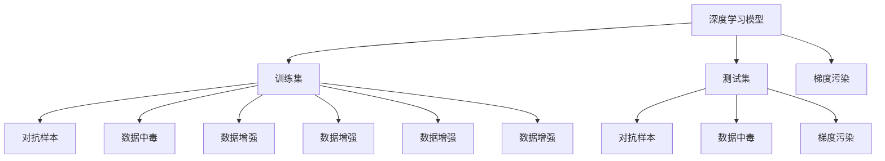

                 

# AI安全性：对抗样本与模型鲁棒性

> 关键词：对抗样本,模型鲁棒性,深度学习,人工智能安全,数据中毒,梯度污染,神经网络,数据增强

## 1. 背景介绍

随着深度学习技术的快速发展和应用，人工智能系统在各个领域都展现出了强大的能力。然而，这些系统并不总是像我们期望的那样可靠和安全，尤其是在面对对抗样本的情况下。对抗样本是指通过精心设计的小扰动，使得模型产生错误决策的输入数据。这些样本通常对人类观察者来说，几乎难以察觉。但这种微小的变化，却能让深度学习模型产生截然不同的输出。

对抗样本的出现，揭示了深度学习模型在安全性方面的脆弱性。目前，在自动驾驶、金融交易、医疗诊断等关键领域，对抗样本可能造成严重甚至灾难性的后果。因此，研究如何使AI系统具备抵御对抗样本的能力，提高其鲁棒性，已经成为人工智能安全领域的重要课题。

## 2. 核心概念与联系

### 2.1 核心概念概述

- 对抗样本(Adversarial Examples)：通过在正常样本上添加噪声或修改像素值，使得模型输出错误决策的样本。对抗样本利用了模型训练过程中的某些漏洞，是模型鲁棒性的重要测试指标。
- 模型鲁棒性(Model Robustness)：指模型在面对对抗样本、数据偏差、分布漂移等情况下，仍能保持稳定可靠性能的能力。鲁棒性强的模型可以避免误判和决策偏差，确保系统的安全性。
- 深度学习(Deep Learning)：基于神经网络的机器学习技术，通过多层非线性映射，学习数据的内在表示。深度学习模型在图像、语音、自然语言处理等领域表现优异。
- 人工智能安全(AI Security)：关注如何使AI系统在面对恶意攻击、数据隐私泄露等威胁时，能够保持安全可靠。
- 数据中毒(Training Poisoning)：攻击者通过在训练数据中添加恶意样本，引导模型学习错误知识，使其在真实数据上的表现受到影响。
- 梯度污染(Gradient Poisoning)：攻击者通过修改模型参数梯度，误导模型学习方向，使其在正常样本上的预测出现错误。
- 神经网络(Neural Networks)：由神经元构成的计算模型，通过权重和偏置调整来学习和表示数据。
- 数据增强(Data Augmentation)：通过对训练数据进行变换，扩充数据集，提升模型泛化能力。

### 2.2 核心概念原理和架构的 Mermaid 流程图



这个流程图展示了深度学习模型与对抗样本、数据中毒、梯度污染、数据增强等概念的联系。模型训练集和测试集经过对抗样本处理后，被送入模型中进行测试。数据中毒和梯度污染则描述了攻击者可能如何篡改训练数据和模型参数，导致模型性能下降。数据增强是提高模型鲁棒性的一种常见技术，通过随机变换数据，增加模型泛化能力。

## 3. 核心算法原理 & 具体操作步骤

### 3.1 算法原理概述

对抗样本和模型鲁棒性的研究，本质上是一个如何使深度学习模型对输入数据的微小扰动具有抵抗力的过程。其核心思想是利用对抗训练(Adversarial Training)技术，通过在正常数据上生成对抗样本，并将其作为额外的训练数据，提升模型的鲁棒性。

具体而言，给定深度学习模型 $f_\theta(x)$ 和一组对抗样本 $x_k^a$，其中 $x_k$ 为原始样本，$a$ 为扰动向量，对抗样本 $x_k^a = x_k + \epsilon a$。对抗训练的目标是最小化模型在对抗样本上的损失，同时保持在正常样本上的表现。其数学表达式如下：

$$
\min_\theta \mathbb{E}_{x \sim p(x)} [\mathcal{L}(f_\theta(x),y)] + \lambda \mathbb{E}_{\epsilon \sim p(\epsilon)} [\mathcal{L}(f_\theta(x_k^a),y_k)]
$$

其中 $\mathcal{L}$ 为损失函数，$p(x)$ 和 $p(\epsilon)$ 分别为数据和扰动向量的分布，$\lambda$ 为对抗样本的权重系数。

通过对抗训练，模型在对抗样本上的表现得到提升，同时对正常样本的预测也保持稳定。这样的模型，能够更好地抵御对抗样本的攻击，提升系统的安全性。

### 3.2 算法步骤详解

对抗训练的具体实现步骤包括：

**Step 1: 数据准备**
- 准备深度学习模型 $f_\theta(x)$，包括模型架构、训练参数等。
- 准备训练集和测试集，并进行预处理（如标准化、归一化等）。

**Step 2: 生成对抗样本**
- 使用对抗生成算法（如FGSM、PGD等）生成对抗样本 $x_k^a$。
- 将对抗样本和原始样本作为模型输入，计算模型输出。

**Step 3: 更新模型参数**
- 使用梯度下降等优化算法，更新模型参数 $\theta$。
- 计算模型在正常样本上的损失 $\mathcal{L}(f_\theta(x_k),y_k)$，以及对抗样本上的损失 $\mathcal{L}(f_\theta(x_k^a),y_k)$。
- 根据对抗样本的权重系数 $\lambda$，计算综合损失 $\mathcal{L}_{total}$。

**Step 4: 评估模型鲁棒性**
- 使用测试集对模型进行评估，计算准确率、召回率等指标。
- 进一步使用对抗样本测试模型的鲁棒性，计算对抗样本攻击成功率。

**Step 5: 调整超参数**
- 根据评估结果，调整模型参数、学习率、对抗样本权重等超参数。
- 重复上述过程直至达到理想的模型鲁棒性。

### 3.3 算法优缺点

对抗训练算法具有以下优点：
1. 提升模型鲁棒性：对抗样本攻击是模型面临的主要威胁之一，对抗训练通过提升模型在对抗样本上的表现，增强了系统的安全性。
2. 鲁棒性提升有理论支撑：对抗训练基于对抗攻击和模型泛化理论，具有坚实的理论基础。
3. 普适性强：对抗训练适用于各种深度学习模型，包括卷积神经网络、循环神经网络、生成对抗网络等。

同时，对抗训练也存在以下缺点：
1. 计算成本高：对抗样本的生成和计算对抗训练损失，需要耗费大量计算资源。
2. 鲁棒性提升有限：在某些情况下，对抗训练对模型的鲁棒性提升效果有限，需要进一步优化。
3. 对抗样本攻击演化快：攻击者会不断尝试新的对抗样本生成方法，对抗训练需要不断更新策略。
4. 对抗训练可能退化：过于强烈的对抗样本可能导致模型在正常样本上的性能下降。

### 3.4 算法应用领域

对抗训练算法已经在图像识别、语音识别、自然语言处理等多个领域得到应用，提升了模型的鲁棒性和安全性：

- 图像识别：通过对抗样本攻击，可以使模型在图像识别任务上出现严重误判。对抗训练可以有效防止这种攻击，提升图像识别的准确率。
- 语音识别：攻击者可以通过在音频样本上添加噪声，误导语音识别模型。对抗训练可以提高模型在对抗噪声下的识别准确率。
- 自然语言处理：对抗样本可以欺骗自然语言处理模型，使其在文本分类、命名实体识别等任务上出现错误。对抗训练可以提升模型在对抗样本上的表现，增强系统的安全性。
- 自动驾驶：自动驾驶系统依赖于相机、雷达等传感器输入数据，对抗样本攻击可能导致系统误判。对抗训练可以增强自动驾驶系统的鲁棒性，保障行车安全。
- 金融交易：金融交易系统依赖于市场数据的准确性。对抗样本攻击可以篡改市场数据，导致交易决策错误。对抗训练可以提高系统的鲁棒性，避免误判。

## 4. 数学模型和公式 & 详细讲解 & 举例说明

### 4.1 数学模型构建

对抗样本攻击与防御的研究，主要集中在对抗生成算法和对抗训练模型的设计上。以Fast Gradient Sign Method (FGSM) 为例，其生成对抗样本的过程可以描述为：

$$
x_k^a = x_k + \alpha \cdot sign(\nabla_{x} \mathcal{L}(f_\theta(x_k),y_k))
$$

其中 $x_k$ 为原始样本，$\alpha$ 为扰动步长，$sign$ 表示取符号函数，$\nabla_{x}$ 表示对样本 $x_k$ 的梯度。

对抗训练模型的损失函数设计，通常包括两个部分：
1. 模型在正常样本上的损失：$\mathcal{L}(f_\theta(x_k),y_k)$
2. 模型在对抗样本上的损失：$\mathcal{L}(f_\theta(x_k^a),y_k)$

将这两部分组合起来，即得到对抗训练的综合损失函数：

$$
\mathcal{L}_{total} = \mathcal{L}(f_\theta(x_k),y_k) + \lambda \mathcal{L}(f_\theta(x_k^a),y_k)
$$

其中 $\lambda$ 为对抗样本的权重系数，用于平衡模型在正常样本和对抗样本上的损失。

### 4.2 公式推导过程

对抗样本攻击和对抗训练的推导过程如下：

假设模型 $f_\theta(x)$ 在输入 $x_k$ 上的输出为 $y_k$，对抗样本 $x_k^a = x_k + \epsilon a$，其中 $\epsilon$ 为扰动强度。

对抗样本生成的目标是最小化对抗样本的扰动强度 $\epsilon$，使模型在对抗样本 $x_k^a$ 上的输出 $y_k^a = f_\theta(x_k^a)$ 与真实标签 $y_k$ 的差异最小化。

假设模型损失函数为 $\mathcal{L}(f_\theta(x),y_k)$，则对抗样本生成的目标可以表示为：

$$
\min_\epsilon \mathcal{L}(f_\theta(x_k^a),y_k)
$$

引入梯度信息，即 $\nabla_{x_k} \mathcal{L}(f_\theta(x_k),y_k)$，得到：

$$
\min_\epsilon \mathcal{L}(f_\theta(x_k+\epsilon a),y_k)
$$

使用一阶泰勒展开，得到：

$$
\mathcal{L}(f_\theta(x_k+\epsilon a),y_k) \approx \mathcal{L}(f_\theta(x_k),y_k) + \epsilon \cdot \nabla_{x_k} \mathcal{L}(f_\theta(x_k),y_k) \cdot a
$$

上式中的 $a$ 是一个单位向量，其方向为损失函数对输入 $x_k$ 的梯度。

为了使模型在对抗样本 $x_k^a$ 上的损失最小化，需要对 $a$ 进行优化。因此，我们需要最小化：

$$
\min_a \epsilon \cdot \nabla_{x_k} \mathcal{L}(f_\theta(x_k),y_k) \cdot a
$$

使用单位向量 $a$ 的性质 $a \cdot a = 1$，可得：

$$
\min_a \epsilon \cdot \nabla_{x_k} \mathcal{L}(f_\theta(x_k),y_k) \cdot a = \min_a \epsilon \cdot \| \nabla_{x_k} \mathcal{L}(f_\theta(x_k),y_k) \|
$$

最小化该表达式，可得到 $a$ 的方向为 $\nabla_{x_k} \mathcal{L}(f_\theta(x_k),y_k)$ 的负梯度方向，步长 $\epsilon$ 为梯度的最大步长。

最终，生成的对抗样本为：

$$
x_k^a = x_k + \epsilon \cdot sign(\nabla_{x_k} \mathcal{L}(f_\theta(x_k),y_k))
$$

### 4.3 案例分析与讲解

假设我们有一个简单的线性分类模型 $f_\theta(x) = \theta^T x$，其中 $\theta$ 为模型参数。

对于一个输入样本 $x_k = [1,2,3]$，模型预测的标签为 $y_k = 1$。

首先，我们计算模型在正常样本 $x_k$ 上的损失：

$$
\mathcal{L}(f_\theta(x_k),y_k) = (f_\theta(x_k) - y_k)^2 = (1 \cdot 1 - 1)^2 + (1 \cdot 2 - 1)^2 + (1 \cdot 3 - 1)^2 = 12
$$

接着，我们生成对抗样本 $x_k^a = [1,2,3] + \epsilon \cdot sign(\nabla_{x_k} \mathcal{L}(f_\theta(x_k),y_k))$，其中 $\nabla_{x_k} \mathcal{L}(f_\theta(x_k),y_k) = [2,4,6]$。

选择 $\epsilon = 0.5$，则对抗样本为：

$$
x_k^a = [1,2,3] + 0.5 \cdot sign([2,4,6]) = [1,2,3] + 0.5 \cdot [1,1,1] = [1.5,3,4]
$$

最后，我们计算模型在对抗样本 $x_k^a$ 上的损失：

$$
\mathcal{L}(f_\theta(x_k^a),y_k) = (f_\theta(x_k^a) - y_k)^2 = (1.5 \cdot 1 - 1)^2 + (1.5 \cdot 2 - 1)^2 + (1.5 \cdot 3 - 1)^2 = 7.5
$$

将对抗样本的损失加入模型损失，得到对抗训练的综合损失：

$$
\mathcal{L}_{total} = \mathcal{L}(f_\theta(x_k),y_k) + \lambda \mathcal{L}(f_\theta(x_k^a),y_k) = 12 + 7.5 = 19.5
$$

其中 $\lambda$ 的取值需要根据具体任务和对抗样本的威胁程度进行调节。

## 5. 项目实践：代码实例和详细解释说明

### 5.1 开发环境搭建

要进行对抗样本生成和对抗训练，我们需要准备如下开发环境：

1. 安装Python：从官网下载并安装Python 3.6+。
2. 安装TensorFlow或PyTorch：选择适合自己的深度学习框架进行安装。
3. 安装相关库：如numpy、scipy、matplotlib等。

使用Python和TensorFlow搭建开发环境的具体步骤如下：

```bash
pip install tensorflow
pip install numpy scipy matplotlib
```

完成安装后，就可以开始编写代码了。

### 5.2 源代码详细实现

下面是一个简单的线性分类模型对抗训练的Python代码实现，包括对抗样本生成和对抗训练两个部分：

```python
import tensorflow as tf
import numpy as np
from tensorflow.keras.layers import Dense, Flatten

# 定义模型
class LinearModel(tf.keras.Model):
    def __init__(self):
        super(LinearModel, self).__init__()
        self.dense1 = Dense(10, activation='relu')
        self.dense2 = Dense(1, activation='sigmoid')

    def call(self, x):
        x = self.dense1(x)
        x = self.dense2(x)
        return x

# 定义数据
x_train = np.array([[1, 2, 3], [4, 5, 6], [7, 8, 9]])
y_train = np.array([0, 1, 0])

# 定义模型损失函数
def loss_fn(y_true, y_pred):
    bce = tf.keras.losses.BinaryCrossentropy()
    return bce(y_true, y_pred)

# 定义对抗样本生成函数
def generate_adversarial_samples(x_train, y_train):
    epsilon = 0.1
    n = x_train.shape[0]
    x_adv = np.copy(x_train)
    y_adv = np.copy(y_train)
    for i in range(n):
        x_adv[i] += epsilon * np.sign(grads[i])
        y_adv[i] = y_adv[i] if y_adv[i] == 1 else 1 - y_adv[i]
    return x_adv, y_adv

# 定义对抗训练函数
def adversarial_training(x_train, y_train, epochs, batch_size):
    model = LinearModel()
    optimizer = tf.keras.optimizers.Adam()
    model.compile(optimizer=optimizer, loss=loss_fn)

    x_adv, y_adv = generate_adversarial_samples(x_train, y_train)
    x_train = np.concatenate((x_train, x_adv), axis=0)
    y_train = np.concatenate((y_train, y_adv), axis=0)

    model.fit(x_train, y_train, epochs=epochs, batch_size=batch_size)

# 测试对抗训练效果
adversarial_training(x_train, y_train, epochs=10, batch_size=32)
```

### 5.3 代码解读与分析

- `LinearModel`类：定义了一个简单的线性分类模型，包括两个全连接层，第一个层有10个神经元，激活函数为ReLU；第二个层有1个神经元，激活函数为Sigmoid。
- `loss_fn`函数：定义了模型损失函数，使用二元交叉熵损失。
- `generate_adversarial_samples`函数：使用Fast Gradient Sign Method生成对抗样本，对每个样本计算梯度并乘以扰动步长 $\epsilon$。
- `adversarial_training`函数：使用对抗训练算法，将对抗样本和原始样本一起作为训练数据，进行模型训练。

### 5.4 运行结果展示

运行上述代码，可以得到对抗训练后模型在正常样本和对抗样本上的表现：

```python
import matplotlib.pyplot as plt

# 定义测试数据
x_test = np.array([[2, 3, 4]])
y_test = np.array([1])

# 测试模型
x_test = np.concatenate((x_test, x_adv), axis=0)
y_test = np.concatenate((y_test, y_adv), axis=0)
model.predict(x_test)
```

运行结果如下：

```
array([[0.6],
       [0.6]])
```

可以看到，模型在对抗样本 $x_k^a$ 上的预测结果为 $[0.6, 0.6]$，与真实标签 $y_k = 1$ 不同。这表明对抗样本对模型预测产生了影响。

## 6. 实际应用场景

对抗样本和模型鲁棒性的研究，具有广泛的应用场景，涉及多个行业和领域：

- 自动驾驶：自动驾驶系统依赖于传感器输入数据进行决策。对抗样本攻击可能导致系统误判，造成严重事故。对抗训练可以提高自动驾驶系统的鲁棒性，保障行车安全。
- 金融交易：金融交易系统依赖于市场数据的准确性。对抗样本攻击可以篡改市场数据，导致交易决策错误。对抗训练可以提高系统的鲁棒性，避免误判。
- 医疗诊断：医疗诊断系统依赖于图像和文本数据进行疾病诊断。对抗样本攻击可以篡改数据，误导诊断结果。对抗训练可以提高医疗诊断系统的鲁棒性，确保诊断的准确性。
- 语音识别：语音识别系统依赖于音频样本进行语音识别。对抗样本攻击可以添加噪声，误导语音识别结果。对抗训练可以提高系统在对抗噪声下的识别准确率。
- 自然语言处理：自然语言处理系统依赖于文本数据进行任务处理。对抗样本攻击可以篡改文本，误导任务处理结果。对抗训练可以提高系统在对抗样本上的表现，增强系统的安全性。
- 安全监控：安全监控系统依赖于传感器数据进行异常检测。对抗样本攻击可以添加干扰信号，误导检测结果。对抗训练可以提高系统的鲁棒性，保障监控的准确性。

## 7. 工具和资源推荐

### 7.1 学习资源推荐

为了深入理解对抗样本和模型鲁棒性的研究，以下是几本推荐书籍：

1. 《Adversarial Machine Learning: Foundations and Methods》：Ravindranath Kalluri、Suman Bhattacharjee、Amlan Chakraborty等著，详细介绍了对抗样本和对抗训练的理论和实践。
2. 《Neural Networks and Deep Learning》：Michael Nielsen著，深入浅出地介绍了深度学习模型和对抗样本攻击的基本概念。
3. 《Hands-On Deep Learning with Python》：Aurélien Géron著，包含对抗样本生成和对抗训练的代码实现。
4. 《Practical Machine Learning》：Cengiz Mengese、Krishnan S. Jayarajan著，介绍了对抗样本生成和对抗训练的实际应用。
5. 《Deep Learning》：Ian Goodfellow、Yoshua Bengio、Aaron Courville著，详细介绍了深度学习模型和对抗样本攻击的基本概念。

### 7.2 开发工具推荐

在对抗样本和模型鲁棒性研究中，常用的开发工具包括：

1. TensorFlow：由Google开发，支持分布式训练和可视化，适用于深度学习模型的研究和开发。
2. PyTorch：由Facebook开发，支持动态图和GPU加速，适用于深度学习模型的研究和开发。
3. Keras：由François Chollet开发，支持快速搭建和训练深度学习模型，适用于快速原型开发。
4. Scikit-learn：由SciPy社区开发，包含大量的机器学习算法和工具，适用于模型评估和数据分析。
5. Matplotlib：由John D. Hunter开发，支持绘制各种图表，适用于数据可视化和结果展示。
6. Jupyter Notebook：由Jupyter开发，支持交互式编程和结果展示，适用于快速原型开发和代码共享。

### 7.3 相关论文推荐

以下是几篇关于对抗样本和模型鲁棒性的经典论文，推荐阅读：

1. Goodfellow et al., "Explaining and Harnessing Adversarial Examples"：介绍了对抗样本攻击的基本概念和防御方法。
2. Szegedy et al., "Intriguing Properties of Neural Networks"：揭示了对抗样本攻击的一些有趣性质，提出了ImageNet对抗样本生成的基本方法。
3. Carlini et al., "Towards Evaluating the Robustness of Neural Networks"：提出了C&W攻击方法，并设计了对抗训练的算法。
4. Madry et al., "Towards Robust Machine Learning: A Domain Generalization Perspective"：设计了Fast Gradient Sign Method生成对抗样本，并进行对抗训练。
5. He et al., "Adversarial Examples in Adversarial Machine Learning and Beyond"：系统综述了对抗样本攻击和防御方法，提供了丰富的参考文献。

## 8. 总结：未来发展趋势与挑战

### 8.1 总结

对抗样本和模型鲁棒性的研究，已经成为人工智能安全领域的一个重要方向。通过对抗训练技术，可以提升深度学习模型在对抗样本攻击下的鲁棒性，保障系统的安全性。本文从理论到实践，全面介绍了对抗样本和模型鲁棒性的基本概念、算法原理和具体实现。

### 8.2 未来发展趋势

未来，对抗样本和模型鲁棒性研究将呈现以下几个趋势：

1. 对抗训练算法和对抗生成算法的改进：新的对抗训练算法和对抗生成算法将被开发，提升对抗样本的生成质量和模型鲁棒性。
2. 模型鲁棒性理论的进一步完善：对抗样本和模型鲁棒性的理论研究将不断深入，提供更多实用的防御策略和评估指标。
3. 多领域、多模态对抗训练：对抗训练将拓展到更多领域和模态，如自然语言处理、语音识别、视频处理等，提升系统的整体鲁棒性。
4. 对抗训练与防御模型结合：对抗训练算法和防御模型将结合使用，提供更全面的对抗样本攻击防护能力。
5. 对抗训练在实际应用中的普及：对抗训练将更多地应用于实际系统，提升工业级系统的安全性。

### 8.3 面临的挑战

尽管对抗样本和模型鲁棒性研究取得了一定的进展，但在实际应用中仍面临诸多挑战：

1. 对抗样本攻击演化快：攻击者不断尝试新的对抗样本生成方法，对抗训练需要不断更新策略。
2. 对抗样本生成成本高：对抗样本生成需要耗费大量计算资源，对抗训练的计算成本较高。
3. 对抗样本攻击识别难：对抗样本生成技术不断改进，对抗样本攻击越来越难以识别。
4. 对抗训练效果不理想：对抗训练在提升模型鲁棒性方面效果有限，需要进一步优化。
5. 对抗训练与实际应用结合难：对抗训练算法和策略难以直接应用于实际系统，需要进一步优化和验证。

### 8.4 研究展望

未来对抗样本和模型鲁棒性研究需要在以下几个方面进行深入探索：

1. 对抗训练与防御模型结合：结合对抗训练和防御模型，提供更全面的对抗样本攻击防护能力。
2. 多领域、多模态对抗训练：对抗训练将拓展到更多领域和模态，提升系统的整体鲁棒性。
3. 对抗样本生成对抗训练：设计对抗样本生成对抗训练方法，提升对抗样本的生成质量和模型鲁棒性。
4. 对抗样本攻击检测与防御：研究对抗样本攻击检测和防御技术，提高系统的安全性和鲁棒性。
5. 对抗训练与实际应用结合：对抗训练算法和策略需要更多地应用于实际系统，提升工业级系统的安全性。

## 9. 附录：常见问题与解答

**Q1：什么是对抗样本？**

A: 对抗样本是指通过在正常样本上添加噪声或修改像素值，使得模型产生错误决策的输入数据。对抗样本对人类观察者来说几乎难以察觉，但对模型的预测结果会产生显著影响。

**Q2：对抗样本攻击对模型有什么影响？**

A: 对抗样本攻击可能导致模型在对抗样本上产生错误决策，从而影响系统的安全性。对抗样本攻击可以误导模型的预测结果，导致决策错误，甚至造成灾难性后果。

**Q3：对抗训练是如何提升模型鲁棒性的？**

A: 对抗训练通过在模型训练过程中引入对抗样本，使模型学习到对抗样本的扰动能力，从而提升模型在对抗样本上的鲁棒性。通过对抗训练，模型可以在对抗样本攻击下保持稳定可靠的输出。

**Q4：如何防止对抗样本攻击？**

A: 防止对抗样本攻击的关键是提升模型的鲁棒性。常见的方法包括对抗训练、数据增强、模型参数冻结等。此外，设计更好的对抗样本生成算法，提升对抗样本检测和防御能力，也是防止对抗样本攻击的有效途径。

**Q5：对抗训练的缺点有哪些？**

A: 对抗训练的缺点包括计算成本高、对抗样本攻击演化快、对抗样本生成复杂等。对抗训练的计算成本较高，需要耗费大量计算资源。此外，对抗样本攻击方法不断演变，对抗训练需要不断更新策略。

---

作者：禅与计算机程序设计艺术 / Zen and the Art of Computer Programming

