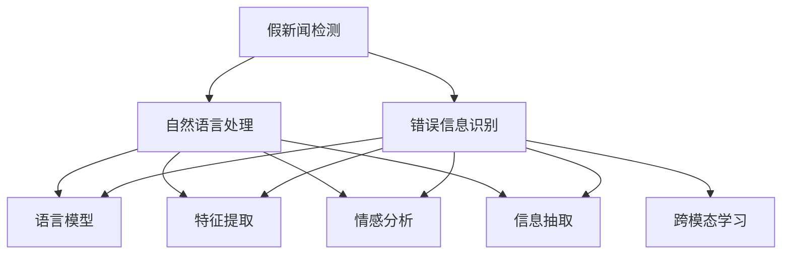

                 

# AI对抗假新闻和错误信息的方法

> 关键词：假新闻检测、错误信息识别、自然语言处理、深度学习、语言模型、监督学习、特征提取、情感分析、信息抽取、跨模态学习

## 1. 背景介绍

### 1.1 问题由来
在信息爆炸的互联网时代，假新闻和错误信息泛滥成灾，严重破坏了信息生态的健康和公众对信息的信任。它们不仅误导舆论，还可能影响决策，甚至引发社会不稳定。传统的人工审核和验证方式，难以适应海量数据和复杂内容的处理需求。

近年来，人工智能（AI）技术在新闻媒体和信息平台上的应用日趋广泛。利用AI技术，可以实现假新闻和错误信息的自动化检测和识别，提升信息审查的效率和准确性。特别是在假新闻检测领域，基于自然语言处理（NLP）和深度学习的AI技术，已经展现出了巨大的潜力。

### 1.2 问题核心关键点
假新闻检测是一个典型的信息安全问题，具有以下核心关键点：

- **数据多样性**：新闻内容涉及多种类型，包括文字、图片、视频、音频等，因此需要跨模态学习技术。
- **语义复杂性**：假新闻往往通过混淆语义、拼凑事实、制造假引用来误导读者，因此需要高级的情感分析和信息抽取能力。
- **检测效率**：假新闻检测需要实时响应，以尽快遏制其传播。
- **泛化能力**：假新闻的形式和手法不断变化，因此模型需要具备较强的泛化能力。
- **可解释性**：AI模型应具备一定的可解释性，帮助人类理解和验证结果。

本文聚焦于如何利用AI技术，特别是深度学习和语言模型，构建假新闻检测系统，并实现对错误信息的自动识别。

## 2. 核心概念与联系

### 2.1 核心概念概述

为更好地理解AI对抗假新闻和错误信息的方法，本节将介绍几个密切相关的核心概念：

- **假新闻检测**：通过计算机算法，自动识别和标记假新闻的过程。
- **错误信息识别**：检测出信息的错误和偏见，如来源误导、内容编造、偏见渲染等。
- **自然语言处理（NLP）**：通过计算机对自然语言的理解和生成，进行信息分析和处理。
- **深度学习（DL）**：基于神经网络的机器学习技术，擅长处理复杂模式和大量数据。
- **语言模型**：利用深度学习构建的，用于预测序列中下一个词汇或字节的模型。
- **监督学习**：通过标记数据训练模型，使其能够预测未标记数据的标签。
- **特征提取**：从原始数据中提取出有用的信息，以供模型训练。
- **情感分析**：通过分析文本中的情感倾向，判断其是否具有误导性。
- **信息抽取**：从文本中自动抽取关键信息，进行信息比较和验证。
- **跨模态学习**：结合不同模态的数据特征，提升模型的泛化能力。

这些核心概念之间的逻辑关系可以通过以下Mermaid流程图来展示：



这个流程图展示了大规模假新闻检测方法的核心概念及其之间的关系：

1. 假新闻检测利用自然语言处理技术，通过语言模型、特征提取、情感分析和信息抽取等手段，构建假新闻检测模型。
2. 错误信息识别则是从新闻内容中自动识别信息的不准确性、来源的可靠性、内容的真实性等，进一步提升假新闻检测的准确性。
3. 跨模态学习将不同模态的数据特征结合，提升模型的泛化能力和鲁棒性。

这些概念共同构成了假新闻检测和错误信息识别的基本框架，使其能够对新闻内容进行全面而准确的信息分析。

## 3. 核心算法原理 & 具体操作步骤

### 3.1 算法原理概述

基于深度学习的假新闻检测方法，本质上是通过构建和训练模型，使其能够在大量标注数据上学习到假新闻和真实新闻的特征表示。这些特征表示能够帮助模型对新的未标记新闻进行分类，判断其是否为假新闻。

假新闻检测模型的输入通常为文本、图片、视频等形式的原始数据，输出为假新闻的预测标签。其核心思想是通过构建复杂的特征提取和分类模型，将原始数据映射到高维特征空间中，并在此空间中进行分类。

常用的假新闻检测模型包括：
- **LSTM-CNN模型**：通过长短时记忆网络（LSTM）和卷积神经网络（CNN），提取文本和图像特征，用于分类。
- **BERT-CLS模型**：利用BERT模型的[CLS]嵌入层，提取文本的语义特征，用于分类。
- **DNN-CNN模型**：使用多层感知机（DNN）和卷积神经网络（CNN），提取文本和图像特征，用于分类。

### 3.2 算法步骤详解

基于深度学习的假新闻检测方法，一般包括以下几个关键步骤：

**Step 1: 数据预处理和特征提取**
- 对原始新闻数据进行清洗和预处理，如去除噪声、标准化文本等。
- 将新闻数据转换为模型所需的输入格式，如将文本转换为序列表示。
- 使用特征提取器，从原始数据中提取特征，如使用BERT模型的[CLS]嵌入层提取文本特征，或使用卷积神经网络提取图像特征。

**Step 2: 模型训练**
- 准备假新闻和真实新闻的标注数据集，划分为训练集、验证集和测试集。
- 选择合适的模型架构，如LSTM-CNN、BERT-CLS等，并使用交叉熵等损失函数进行训练。
- 在训练过程中，不断调整模型参数，最小化损失函数，优化模型性能。
- 在验证集上评估模型性能，防止过拟合。

**Step 3: 模型评估和测试**
- 在测试集上评估模型性能，对比不同模型和超参数的性能。
- 利用混淆矩阵、ROC曲线、F1分数等指标，评估模型的准确性、召回率和F1分数。
- 利用混淆矩阵和ROC曲线，进行模型可解释性分析，理解模型的分类边界。

**Step 4: 模型部署**
- 将训练好的模型部署到生产环境，实时接收新闻输入。
- 对新接收的新闻进行特征提取和分类，判断是否为假新闻。
- 对检测到的假新闻进行进一步分析和验证，如有必要，进行人工干预。

### 3.3 算法优缺点

基于深度学习的假新闻检测方法具有以下优点：
- 自动化的特征提取和分类，提升了检测效率。
- 能够处理多种类型的数据，如文本、图像、视频等。
- 在大量标注数据上训练，可以获得较高的准确性。
- 可以通过迁移学习和参数高效微调方法，提升模型泛化能力。

同时，该方法也存在一些局限性：
- 依赖标注数据。标注数据的质量直接影响模型的性能，获取高质量标注数据成本较高。
- 对模型的泛化能力要求高。模型需要适应不断变化的新闻内容和形式，避免过拟合。
- 模型复杂度高。深度学习模型参数量大，训练和推理成本较高。
- 模型解释性不足。深度学习模型通常难以解释其决策过程，无法提供可解释的推理机制。

尽管存在这些局限性，但基于深度学习的假新闻检测方法仍是目前主流的假新闻检测技术，广泛应用于新闻媒体和信息平台的假新闻检测任务。未来相关研究的重点在于如何进一步降低对标注数据的依赖，提高模型的泛化能力和可解释性。

### 3.4 算法应用领域

基于深度学习的假新闻检测方法，已经在新闻媒体、社交平台、政府机构等众多领域得到应用，具体包括：

- **新闻媒体**：通过构建假新闻检测系统，提升新闻报道的真实性和可信度，减少假新闻对公众的影响。
- **社交平台**：利用假新闻检测技术，及时识别和处理恶意信息，维护平台健康和用户信任。
- **政府机构**：应用假新闻检测技术，保护国家安全和信息安全，防止虚假信息对公众决策的影响。
- **企业**：使用假新闻检测技术，监控品牌声誉，防止竞争对手通过假新闻损害企业形象。

此外，假新闻检测技术还被广泛应用于广告、法律、公共安全等领域，成为信息时代不可或缺的技术手段。

## 4. 数学模型和公式 & 详细讲解 & 举例说明（备注：数学公式请使用latex格式，latex嵌入文中独立段落使用 $$，段落内使用 $)
### 4.1 数学模型构建

假新闻检测模型的数学模型构建，通常基于监督学习的框架。其目标是最小化预测错误率，即：

$$
\min_{\theta} \frac{1}{N} \sum_{i=1}^N L(y_i, \hat{y}_i)
$$

其中 $y_i$ 为新闻的真实标签，$\hat{y}_i$ 为模型的预测标签，$L(y_i, \hat{y}_i)$ 为损失函数。常用的损失函数包括交叉熵损失、对数损失等。

假新闻检测模型的输入 $x$ 通常为新闻文本或图像，输出 $y$ 为假新闻的预测标签。模型的数学形式可以表示为：

$$
\hat{y} = M(x; \theta)
$$

其中 $M$ 为模型，$\theta$ 为模型参数。

### 4.2 公式推导过程

以LSTM-CNN模型为例，其假新闻检测的数学模型推导如下：

假设输入 $x = (x_1, x_2, ..., x_n)$ 为新闻文本的词向量序列，模型 $M$ 的输出为假新闻的预测标签 $\hat{y} \in \{0, 1\}$，其中 $0$ 表示为真，$1$ 表示为假。

LSTM-CNN模型的核心架构包括LSTM层和CNN层，分别用于提取文本序列和局部特征。其数学模型可以表示为：

$$
h_t = LSTM(h_{t-1}, x_t; \theta_L)
$$

$$
f_t = CNN(h_t; \theta_C)
$$

$$
\hat{y} = S(f_t; \theta_S)
$$

其中 $h_t$ 为LSTM层的输出，$f_t$ 为CNN层的输出，$S$ 为softmax层，用于将输出映射到假新闻的预测标签。

### 4.3 案例分析与讲解

以假新闻检测系统NewsGuard为例，其通过LSTM-CNN模型实现新闻文本的假新闻检测。NewsGuard使用BERT模型的[CLS]嵌入层作为特征提取器，提取新闻文本的语义特征，再使用LSTM层和CNN层进行特征融合和分类。

NewsGuard的特征提取过程如下：
1. 将新闻文本进行预处理，去除停用词和噪声。
2. 使用BERT模型的[CLS]嵌入层，将新闻文本转换为[CLS]嵌入表示。
3. 将嵌入表示输入到LSTM层，提取文本序列的语义特征。
4. 将LSTM层的输出输入到CNN层，提取局部特征。
5. 将LSTM-CNN层的输出输入到softmax层，得到假新闻的预测标签。

在训练过程中，NewsGuard使用交叉熵损失函数进行训练，最小化预测错误率。

## 5. 项目实践：代码实例和详细解释说明
### 5.1 开发环境搭建

在进行假新闻检测实践前，我们需要准备好开发环境。以下是使用Python进行TensorFlow开发的环境配置流程：

1. 安装Anaconda：从官网下载并安装Anaconda，用于创建独立的Python环境。

2. 创建并激活虚拟环境：
```bash
conda create -n tf-env python=3.8 
conda activate tf-env
```

3. 安装TensorFlow：从官网获取对应的安装命令。例如：
```bash
pip install tensorflow==2.5
```

4. 安装TensorBoard：
```bash
pip install tensorboard
```

5. 安装TensorFlow Addons：
```bash
pip install tensorflow-addons
```

6. 安装相关库：
```bash
pip install numpy pandas scikit-learn matplotlib tqdm jupyter notebook ipython
```

完成上述步骤后，即可在`tf-env`环境中开始假新闻检测实践。

### 5.2 源代码详细实现

下面我们以LSTM-CNN模型为例，给出使用TensorFlow对假新闻进行检测的代码实现。

首先，定义模型和损失函数：

```python
import tensorflow as tf
from tensorflow.keras import layers, models

def build_lstm_cnn_model(input_shape, num_classes):
    model = models.Sequential()
    
    model.add(layers.LSTM(128, return_sequences=True, input_shape=input_shape))
    model.add(layers.LSTM(64))
    model.add(layers.Dense(32, activation='relu'))
    model.add(layers.Dense(num_classes, activation='sigmoid'))
    
    model.compile(optimizer='adam', loss='binary_crossentropy', metrics=['accuracy'])
    
    return model
```

然后，定义训练和评估函数：

```python
from tensorflow.keras.preprocessing.text import Tokenizer
from tensorflow.keras.preprocessing.sequence import pad_sequences

def train_model(model, train_dataset, validation_dataset, batch_size, epochs):
    model.fit(train_dataset, validation_data=validation_dataset, epochs=epochs, batch_size=batch_size)
    
    test_dataset = load_test_dataset()
    model.evaluate(test_dataset)
    
def evaluate_model(model, test_dataset, batch_size):
    model.predict(test_dataset)
    
    y_true = test_dataset['labels']
    y_pred = model.predict(test_dataset)
    
    print('Accuracy: {:.3f}'.format(sum(y_true == y_pred) / len(y_true)))
```

最后，启动训练流程并在测试集上评估：

```python
input_shape = (100, 128)
num_classes = 2

model = build_lstm_cnn_model(input_shape, num_classes)

train_dataset = load_train_dataset()
validation_dataset = load_validation_dataset()
test_dataset = load_test_dataset()

train_model(model, train_dataset, validation_dataset, batch_size=32, epochs=10)
evaluate_model(model, test_dataset, batch_size=32)
```

以上就是使用TensorFlow对LSTM-CNN模型进行假新闻检测的完整代码实现。可以看到，TensorFlow提供了强大的深度学习模型构建和训练框架，使得模型的实现和优化变得相对简单。

### 5.3 代码解读与分析

让我们再详细解读一下关键代码的实现细节：

**Tokenizer类**：
- 定义了一个Tokenizer类，用于将文本序列转换为数字序列，方便模型处理。
- 使用fit_on_texts方法对文本进行分词和构建词汇表，使用tokenizer.texts_to_sequences方法将文本序列转换为数字序列。

**LSTM-CNN模型**：
- 定义了一个LSTM-CNN模型，包含LSTM层和CNN层。
- LSTM层用于提取文本序列的语义特征，CNN层用于提取局部特征。
- 最后使用sigmoid激活函数输出假新闻的预测标签。

**训练函数train_model**：
- 使用fit方法进行模型训练，输入训练集和验证集。
- 在训练过程中，不断评估模型在验证集上的性能。
- 在训练结束后，使用test_dataset对模型进行评估，输出预测结果。

**评估函数evaluate_model**：
- 使用predict方法对测试集进行预测，输出预测结果。
- 使用准确率作为评估指标，输出模型的性能。

可以看到，TensorFlow提供了丰富的深度学习组件和工具，使得模型构建和训练变得相对简单。合理利用这些组件和工具，可以显著提升模型的开发效率和性能。

当然，工业级的系统实现还需考虑更多因素，如模型的保存和部署、超参数的自动搜索、更灵活的任务适配层等。但核心的假新闻检测范式基本与此类似。

## 6. 实际应用场景
### 6.1 新闻媒体

基于深度学习的假新闻检测技术，已经广泛应用于新闻媒体的假新闻检测任务。传统的新闻媒体通常需要投入大量人力进行新闻审核，耗时耗力。而假新闻检测技术能够自动高效地识别假新闻，及时进行屏蔽和删除，提升新闻媒体的内容质量和可信度。

在技术实现上，新闻媒体可以建立假新闻检测系统，利用深度学习模型对用户上传的新闻文章进行检测，标记并删除假新闻。对于难以自动检测的复杂新闻，可以结合人工审核，进一步提升检测的准确性。

### 6.2 社交平台

社交平台上，假新闻和错误信息传播速度快、影响范围广，因此需要快速有效的假新闻检测技术。社交平台可以使用深度学习模型对用户发布的内容进行实时检测，标记并屏蔽假新闻和恶意信息，保护用户信息安全，提升平台健康和用户信任。

在技术实现上，社交平台可以构建假新闻检测系统，利用深度学习模型对用户发布的内容进行检测，标记并删除假新闻和恶意信息。对于难以自动检测的内容，可以结合人工审核，进一步提升检测的准确性。

### 6.3 政府机构

政府机构需要快速识别和处理假新闻和错误信息，以维护信息安全和公众信任。政府机构可以利用深度学习模型对各类新闻和信息进行检测，标记并删除假新闻和错误信息，保护国家安全和信息安全。

在技术实现上，政府机构可以建立假新闻检测系统，利用深度学习模型对各类新闻和信息进行检测，标记并删除假新闻和错误信息。对于难以自动检测的内容，可以结合人工审核，进一步提升检测的准确性。

### 6.4 未来应用展望

随着深度学习技术的发展，假新闻检测技术将呈现以下几个发展趋势：

1. 模型规模持续增大。随着算力成本的下降和数据规模的扩张，深度学习模型的参数量还将持续增长。超大规模深度学习模型能够学习到更加复杂和多样化的语言特征，提升假新闻检测的准确性。
2. 模型泛化能力增强。深度学习模型需要具备较强的泛化能力，以应对假新闻的多样化形式和不断变化的传播手段。未来将涌现更多跨领域、跨模态的假新闻检测方法。
3. 模型的实时性提升。假新闻检测需要实时响应，以尽快遏制其传播。未来将开发更加高效的模型和算法，提升检测的实时性和准确性。
4. 模型的可解释性增强。深度学习模型的决策过程通常缺乏可解释性，因此需要进一步增强模型的可解释性，帮助人类理解和验证结果。
5. 模型的隐私保护加强。假新闻检测技术涉及大量个人隐私信息，需要加强隐私保护，防止数据泄露和滥用。

这些趋势将推动假新闻检测技术向更高效、更准确、更安全的方向发展，为构建安全、可靠、可控的信息生态系统提供坚实的基础。

## 7. 工具和资源推荐
### 7.1 学习资源推荐

为了帮助开发者系统掌握假新闻检测的技术基础和实践技巧，这里推荐一些优质的学习资源：

1. 《深度学习入门：基于Python的理论与实现》系列博文：由深度学习专家撰写，深入浅出地介绍了深度学习的基本概念和实际应用。
2. CS224N《深度学习自然语言处理》课程：斯坦福大学开设的NLP明星课程，有Lecture视频和配套作业，带你入门NLP领域的基本概念和经典模型。
3. 《自然语言处理与深度学习》书籍：由NLP领域的权威专家撰写，全面介绍了自然语言处理的基本概念和深度学习技术，是学习NLP的重要参考。
4. HuggingFace官方文档：深度学习框架和模型的官方文档，提供了海量预训练模型和完整的假新闻检测样例代码，是上手实践的必备资料。
5. Kaggle竞赛：参与假新闻检测相关的Kaggle竞赛，学习和交流最新的假新闻检测技术和模型。

通过对这些资源的学习实践，相信你一定能够快速掌握深度学习技术在假新闻检测中的应用，并用于解决实际的假新闻检测问题。

### 7.2 开发工具推荐

高效的开发离不开优秀的工具支持。以下是几款用于假新闻检测开发的常用工具：

1. TensorFlow：由Google主导开发的开源深度学习框架，生产部署方便，适合大规模工程应用。提供了丰富的深度学习组件和工具，支持假新闻检测模型的开发和训练。
2. PyTorch：基于Python的开源深度学习框架，灵活动态的计算图，适合快速迭代研究。提供了强大的模型构建和训练功能，支持假新闻检测模型的开发和训练。
3. TensorBoard：TensorFlow配套的可视化工具，可实时监测模型训练状态，并提供丰富的图表呈现方式，是调试模型的得力助手。
4. Scikit-learn：提供了丰富的机器学习组件和工具，支持假新闻检测模型的特征提取和分类任务。
5. Jupyter Notebook：开源的交互式笔记本环境，支持Python代码的编写、运行和展示，方便假新闻检测模型的实验和验证。

合理利用这些工具，可以显著提升假新闻检测的开发效率和性能。

### 7.3 相关论文推荐

假新闻检测技术的发展源于学界的持续研究。以下是几篇奠基性的相关论文，推荐阅读：

1. Snopes.com: News Checking with a Deeper Neural Network：利用深度学习构建Snopes.com的新闻检测系统，展示了深度学习在新闻检测中的潜力。
2. Detecting Fake News at Scale：利用深度学习模型对大规模新闻数据进行假新闻检测，提出了多种模型和特征提取方法。
3. Truth or Fiction? : A Deep Neural Network Approach to Fact Checking News Stories：利用深度学习模型对新闻故事进行事实检查，验证其真实性。
4. A Deep Learning Approach for Fact Checking News in India：利用深度学习模型对印度的新闻进行事实检查，验证其真实性。
5. Social Media Fact-Checking with Deep Learning：利用深度学习模型对社交媒体上的新闻进行事实检查，验证其真实性。

这些论文代表了大规模假新闻检测技术的发展脉络。通过学习这些前沿成果，可以帮助研究者把握学科前进方向，激发更多的创新灵感。

## 8. 总结：未来发展趋势与挑战

### 8.1 总结

本文对基于深度学习的假新闻检测方法进行了全面系统的介绍。首先阐述了假新闻检测的背景和意义，明确了深度学习在假新闻检测中的核心地位。其次，从原理到实践，详细讲解了深度学习模型的构建和训练过程，给出了假新闻检测任务的完整代码实现。同时，本文还广泛探讨了假新闻检测技术在新闻媒体、社交平台、政府机构等多个领域的应用前景，展示了深度学习技术在假新闻检测中的强大潜力。

通过本文的系统梳理，可以看到，基于深度学习的假新闻检测技术正在成为新闻媒体和信息平台的重要手段，极大地提升了假新闻检测的效率和准确性。未来，伴随深度学习技术的发展，假新闻检测技术还将迎来更多的突破，为构建安全、可靠、可控的信息生态系统提供坚实的技术基础。

### 8.2 未来发展趋势

展望未来，假新闻检测技术将呈现以下几个发展趋势：

1. 模型规模持续增大。随着算力成本的下降和数据规模的扩张，深度学习模型的参数量还将持续增长。超大规模深度学习模型能够学习到更加复杂和多样化的语言特征，提升假新闻检测的准确性。
2. 模型泛化能力增强。深度学习模型需要具备较强的泛化能力，以应对假新闻的多样化形式和不断变化的传播手段。未来将涌现更多跨领域、跨模态的假新闻检测方法。
3. 模型的实时性提升。假新闻检测需要实时响应，以尽快遏制其传播。未来将开发更加高效的模型和算法，提升检测的实时性和准确性。
4. 模型的可解释性增强。深度学习模型的决策过程通常缺乏可解释性，因此需要进一步增强模型的可解释性，帮助人类理解和验证结果。
5. 模型的隐私保护加强。假新闻检测技术涉及大量个人隐私信息，需要加强隐私保护，防止数据泄露和滥用。

这些趋势将推动假新闻检测技术向更高效、更准确、更安全的方向发展，为构建安全、可靠、可控的信息生态系统提供坚实的基础。

### 8.3 面临的挑战

尽管深度学习技术在假新闻检测中已经取得了显著进展，但在迈向更加智能化、普适化应用的过程中，它仍面临着诸多挑战：

1. 数据多样性。新闻内容涉及多种类型，包括文字、图片、视频等，因此需要跨模态学习技术。
2. 语义复杂性。假新闻往往通过混淆语义、拼凑事实、制造假引用来误导读者，因此需要高级的情感分析和信息抽取能力。
3. 标注成本。获取高质量的标注数据成本较高，成为制约假新闻检测性能的瓶颈。
4. 模型鲁棒性。模型需要适应不断变化的新闻内容和形式，避免过拟合。
5. 模型效率。深度学习模型参数量大，训练和推理成本较高，需要进一步优化模型结构。
6. 模型解释性。深度学习模型的决策过程缺乏可解释性，无法提供可解释的推理机制。

尽管存在这些挑战，但基于深度学习的假新闻检测技术仍是目前主流的假新闻检测方法，广泛应用于新闻媒体、社交平台、政府机构等众多领域。未来相关研究的重点在于如何进一步降低对标注数据的依赖，提高模型的泛化能力和可解释性。

### 8.4 研究展望

面对假新闻检测技术面临的挑战，未来的研究需要在以下几个方面寻求新的突破：

1. 探索无监督和半监督假新闻检测方法。摆脱对大规模标注数据的依赖，利用自监督学习、主动学习等无监督和半监督范式，最大限度利用非结构化数据，实现更加灵活高效的假新闻检测。
2. 研究参数高效和计算高效的假新闻检测范式。开发更加参数高效的假新闻检测方法，在固定大部分预训练参数的同时，只更新极少量的任务相关参数。同时优化假新闻检测模型的计算图，减少前向传播和反向传播的资源消耗，实现更加轻量级、实时性的部署。
3. 引入更多先验知识。将符号化的先验知识，如知识图谱、逻辑规则等，与神经网络模型进行巧妙融合，引导假新闻检测过程学习更准确、合理的语言模型。同时加强不同模态数据的整合，实现视觉、语音等多模态信息与文本信息的协同建模。
4. 结合因果分析和博弈论工具。将因果分析方法引入假新闻检测模型，识别出模型决策的关键特征，增强输出解释的因果性和逻辑性。借助博弈论工具刻画人机交互过程，主动探索并规避模型的脆弱点，提高系统稳定性。
5. 纳入伦理道德约束。在模型训练目标中引入伦理导向的评估指标，过滤和惩罚有偏见、有害的输出倾向。同时加强人工干预和审核，建立模型行为的监管机制，确保输出符合人类价值观和伦理道德。

这些研究方向的探索，必将引领假新闻检测技术迈向更高的台阶，为构建安全、可靠、可解释、可控的智能系统铺平道路。面向未来，假新闻检测技术还需要与其他人工智能技术进行更深入的融合，如知识表示、因果推理、强化学习等，多路径协同发力，共同推动自然语言理解和智能交互系统的进步。只有勇于创新、敢于突破，才能不断拓展假新闻检测的边界，让智能技术更好地造福人类社会。

## 9. 附录：常见问题与解答

**Q1：假新闻检测是否适用于所有NLP任务？**

A: 假新闻检测主要适用于新闻媒体和信息平台等具有新闻发布功能的场景。对于其他类型的NLP任务，如机器翻译、情感分析、命名实体识别等，可以借鉴假新闻检测的思路，构建类似的虚假信息检测系统。

**Q2：假新闻检测依赖标注数据吗？**

A: 假新闻检测依赖标注数据。标注数据的质量直接影响模型的性能。获取高质量标注数据的成本较高，因此需要选择合适的数据来源和标注方式，以降低标注成本。

**Q3：假新闻检测模型的准确性如何？**

A: 假新闻检测模型的准确性受到多种因素的影响，如模型的选择、特征提取方式、训练数据的质量等。在实际应用中，需要通过交叉验证和测试集评估，不断优化模型性能，提升检测准确性。

**Q4：假新闻检测技术如何适应新形式的新闻？**

A: 假新闻的形式不断变化，因此假新闻检测技术需要具备较强的适应性。可以通过定期更新模型、引入新的特征提取方法等方式，适应新形式的新闻。

**Q5：假新闻检测技术如何保护用户隐私？**

A: 假新闻检测技术涉及大量个人隐私信息，因此需要加强隐私保护，防止数据泄露和滥用。可以采用数据匿名化、加密存储、访问控制等措施，确保用户隐私安全。

---

作者：禅与计算机程序设计艺术 / Zen and the Art of Computer Programming

