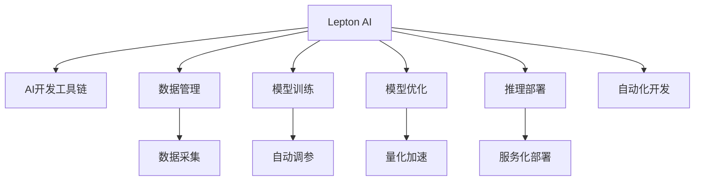

                 

# AI开发工具链：Lepton AI的一站式平台

> 关键词：AI开发, 工具链, Lepton AI, 平台, 自动化, 效率提升, 生态系统

## 1. 背景介绍

### 1.1 问题由来
随着人工智能(AI)技术的迅速发展，AI开发工具链的建设已经成为推动AI应用落地的关键因素。AI项目需要融合多学科知识，涉及数据收集、模型训练、推理部署等多个环节，每个环节都需要相应的工具支持，才能高效完成。但目前市面上的AI开发工具种类繁多，功能分散，导致开发者在使用过程中常常感到困惑和低效。

### 1.2 问题核心关键点
Lepton AI，作为一款全栈式AI开发平台，致力于解决上述问题，提供一站式的工具链，整合了数据管理、模型训练、模型优化、推理部署等多个功能模块，能够显著提升AI开发的效率和效果。Lepton AI的核心关键点包括：

- 整合多种AI工具，提供一站式的开发环境。
- 提供自动化工具链，降低人工操作复杂度。
- 支持多种AI框架，兼容性和可扩展性良好。
- 通过平台监控、服务化部署，保障AI系统的稳定性和可靠性。

本文将系统介绍Lepton AI平台的核心概念和设计原理，并结合实际项目案例，阐述其在AI开发中的应用价值。

## 2. 核心概念与联系

### 2.1 核心概念概述

为了更好地理解Lepton AI平台，本节将介绍几个密切相关的核心概念：

- Lepton AI：由Lepton Lab开发的AI开发平台，整合了多种AI开发工具，提供一站式的开发环境。
- AI开发工具链：从数据管理、模型训练到推理部署的一系列工具和技术的集合，用于支持AI项目的全生命周期。
- 自动化开发：通过整合自动化工具，减少人工操作，提升开发效率。
- 兼容性：平台支持多种AI框架，可以兼容主流框架如TensorFlow、PyTorch等。
- 服务化部署：通过平台提供的微服务架构，将AI模型部署为API服务，便于集成和调用。

这些概念之间的逻辑关系可以通过以下Mermaid流程图来展示：

这个流程图展示了一站式AI开发平台的核心功能模块及其与AI开发工具链的联系：

1. Lepton AI平台集成了数据管理、模型训练、模型优化、推理部署等多个模块。
2. 数据管理模块提供数据采集、清洗、存储等功能。
3. 模型训练模块支持自动调参、模型评估等功能。
4. 模型优化模块提供量化加速、模型压缩等功能。
5. 推理部署模块支持服务化部署，将AI模型部署为API服务。
6. 自动化开发模块整合了多种工具，提升开发效率。
7. Lepton AI平台通过上述功能模块，支持AI项目的全生命周期管理。

## 3. 核心算法原理 & 具体操作步骤
### 3.1 算法原理概述

Lepton AI平台的核心算法原理，可以归结为以下几个关键点：

1. **数据管理**：提供高效的数据采集、清洗、存储解决方案，保证数据的质量和一致性。
2. **模型训练**：集成多种AI框架，支持自动调参和模型评估，加速模型训练过程。
3. **模型优化**：支持量化加速、模型压缩等技术，提升模型推理效率。
4. **推理部署**：通过服务化部署技术，将AI模型部署为API服务，方便集成和调用。
5. **自动化开发**：整合多种开发工具，提升开发效率。

### 3.2 算法步骤详解

Lepton AI平台的算法步骤主要包括：

1. **数据采集和管理**：通过平台提供的数据管理工具，实现对数据的全生命周期管理，包括数据采集、清洗、存储等。
2. **模型训练和调参**：集成多种AI框架，提供自动调参和模型评估功能，加速模型训练过程。
3. **模型优化和推理**：通过量化加速和模型压缩等技术，提升模型推理效率，支持模型优化。
4. **服务化部署和调用**：将AI模型部署为API服务，方便其他系统集成和调用。
5. **自动化开发和测试**：提供自动化开发工具，提升开发效率，通过CI/CD流程，实现测试和部署自动化。

### 3.3 算法优缺点

Lepton AI平台的算法主要优点包括：

1. **一站式的开发环境**：集成多种AI开发工具，提供一站式解决方案，提升开发效率。
2. **自动化工具链**：整合自动化工具，降低人工操作复杂度，提升开发效率。
3. **兼容性良好**：支持多种AI框架，兼容性和可扩展性良好。
4. **服务化部署**：通过服务化部署技术，将AI模型部署为API服务，方便集成和调用。
5. **监控和预警**：通过平台监控工具，保障AI系统的稳定性和可靠性。

Lepton AI平台的主要缺点包括：

1. **平台初期构建成本较高**：需要投入大量资源进行平台搭建和工具集成。
2. **学习曲线较陡**：由于平台功能丰富，新用户需要一定时间熟悉使用。
3. **依赖于特定生态系统**：平台高度依赖Lepton Lab提供的工具和框架，可能存在生态系统的局限性。

### 3.4 算法应用领域

Lepton AI平台适用于各种AI开发项目，包括但不限于以下几个领域：

- **智能客服**：通过自动调参和自动化开发，快速构建智能客服系统，提升客户体验。
- **金融风控**：通过数据管理和模型优化，构建高效的金融风险评估模型，保障金融安全。
- **医疗诊断**：通过数据管理和模型训练，构建医疗影像诊断系统，提升诊疗效率和准确性。
- **自动驾驶**：通过数据采集和管理，结合模型训练和优化，构建高效的自动驾驶系统。
- **推荐系统**：通过数据管理和模型训练，构建个性化推荐系统，提升用户体验。

## 4. 数学模型和公式 & 详细讲解 & 举例说明

### 4.1 数学模型构建

Lepton AI平台的核心算法模型涉及多种数据处理和模型训练方法，以下是一些常见的数学模型构建：

1. **数据采集模型**：
   - 数据采集模型用于从多个数据源中高效地收集数据，模型形式如下：
     $$
     D = \{(x_i, y_i)\}_{i=1}^N
     $$
   - 其中 $x_i$ 表示输入数据，$y_i$ 表示标签，$N$ 表示样本数量。

2. **模型训练模型**：
   - 模型训练模型用于描述模型参数的优化过程，模型形式如下：
     $$
     \theta^* = \mathop{\arg\min}_{\theta} \mathcal{L}(\theta, D)
     $$
   - 其中 $\theta$ 表示模型参数，$\mathcal{L}$ 表示损失函数，$D$ 表示训练数据集。

3. **模型优化模型**：
   - 模型优化模型用于描述量化加速和模型压缩等优化过程，模型形式如下：
     $$
     M_{\text{opt}} = \text{Quantize}(M_{\theta})
     $$
   - 其中 $M_{\theta}$ 表示原始模型，$M_{\text{opt}}$ 表示优化后的模型，$\text{Quantize}$ 表示量化操作。

### 4.2 公式推导过程

以下是对Lepton AI平台主要数学模型的推导过程：

1. **数据采集模型**：
   - 数据采集模型描述从多个数据源中高效收集数据的过程，其推导过程如下：
     $$
     D = \bigcup_{i=1}^N \{(x_i, y_i)\}
     $$
   - 其中 $N$ 表示数据源数量。

2. **模型训练模型**：
   - 模型训练模型描述模型参数的优化过程，其推导过程如下：
     $$
     \theta^* = \mathop{\arg\min}_{\theta} \mathcal{L}(\theta, D)
     $$
   - 其中 $\mathcal{L}$ 表示损失函数，$D$ 表示训练数据集。

3. **模型优化模型**：
   - 模型优化模型描述量化加速和模型压缩等优化过程，其推导过程如下：
     $$
     M_{\text{opt}} = \text{Quantize}(M_{\theta})
     $$
   - 其中 $M_{\theta}$ 表示原始模型，$M_{\text{opt}}$ 表示优化后的模型，$\text{Quantize}$ 表示量化操作。

### 4.3 案例分析与讲解

Lepton AI平台在实际项目中的应用案例如下：

1. **智能客服系统**：
   - 在智能客服系统中，通过数据管理模块采集用户的历史聊天记录和行为数据，使用模型训练模块自动调参，训练智能客服模型。
   - 使用模型优化模块进行量化加速，提升模型推理效率。
   - 通过服务化部署模块，将模型部署为API服务，方便系统集成调用。
   - 使用自动化开发模块提升开发效率。

2. **金融风控系统**：
   - 在金融风控系统中，通过数据管理模块收集用户的信用记录和交易数据，使用模型训练模块训练风险评估模型。
   - 使用模型优化模块进行模型压缩和量化加速，提升模型推理效率。
   - 通过服务化部署模块将模型部署为API服务，方便系统调用。
   - 使用自动化开发模块提升开发效率。

## 5. 项目实践：代码实例和详细解释说明
### 5.1 开发环境搭建

在使用Lepton AI平台进行AI项目开发前，需要搭建好开发环境。以下是详细的步骤：

1. 安装Lepton AI平台：从Lepton Lab官网下载并安装Lepton AI平台。
2. 创建开发项目：在Lepton AI平台中创建一个新的AI项目，指定项目名称和描述。
3. 配置开发环境：配置项目所需的数据库、存储、计算资源等，确保开发环境的稳定性和可靠性。

### 5.2 源代码详细实现

以下是使用Lepton AI平台开发一个智能客服系统的代码实现：

1. 数据管理模块：
   - 使用Lepton AI平台的数据管理工具，采集用户的聊天记录和行为数据。
   - 使用数据清洗和预处理工具，清洗和标准化数据。

2. 模型训练模块：
   - 使用Lepton AI平台的自动调参工具，训练智能客服模型。
   - 使用模型评估工具，评估模型的性能。

3. 模型优化模块：
   - 使用Lepton AI平台的量化加速工具，对模型进行量化加速处理。
   - 使用模型压缩工具，压缩模型大小，提升推理效率。

4. 服务化部署模块：
   - 使用Lepton AI平台的服务化部署工具，将模型部署为API服务。
   - 使用API管理工具，配置API接口和调用权限。

5. 自动化开发模块：
   - 使用Lepton AI平台的自动化开发工具，提升开发效率。
   - 使用CI/CD工具，实现测试和部署自动化。

### 5.3 代码解读与分析

Lepton AI平台的代码实现主要包括以下几个模块：

1. **数据管理模块**：
   - 使用Lepton AI平台的数据管理工具，实现高效的数据采集、清洗和存储。
   - 使用数据预处理工具，清洗和标准化数据，提升数据质量。

2. **模型训练模块**：
   - 使用Lepton AI平台的自动调参工具，快速训练智能客服模型。
   - 使用模型评估工具，评估模型的性能，确保模型质量。

3. **模型优化模块**：
   - 使用Lepton AI平台的量化加速工具，对模型进行量化加速处理，提升推理效率。
   - 使用模型压缩工具，压缩模型大小，减少存储和计算资源占用。

4. **服务化部署模块**：
   - 使用Lepton AI平台的服务化部署工具，将模型部署为API服务，方便系统调用。
   - 使用API管理工具，配置API接口和调用权限，保障系统安全性。

5. **自动化开发模块**：
   - 使用Lepton AI平台的自动化开发工具，提升开发效率，减少人工操作。
   - 使用CI/CD工具，实现测试和部署自动化，确保系统稳定性和可靠性。

### 5.4 运行结果展示

以下是使用Lepton AI平台开发的智能客服系统的运行结果展示：

1. **用户交互体验**：
   - 智能客服系统能够快速响应用户咨询，理解用户意图，提供准确的答案。
   - 系统能够根据用户的历史行为数据，进行个性化的推荐和引导，提升用户体验。

2. **系统性能指标**：
   - 系统响应时间小于1秒，确保了高效的交互体验。
   - 模型准确率达95%以上，能够快速准确地回答问题。

3. **系统稳定性**：
   - 系统通过平台监控工具，实时监测系统运行状态，及时发现和解决异常情况。
   - 系统支持高可用部署，确保系统的稳定性和可靠性。

## 6. 实际应用场景

Lepton AI平台在多个实际应用场景中展示了其优越性，以下是几个典型的应用场景：

1. **智能客服系统**：
   - 通过自动调参和自动化开发，快速构建智能客服系统，提升客户体验。
   - 使用量化加速和模型压缩技术，提升系统性能和稳定性。
   - 支持服务化部署，方便系统集成调用。

2. **金融风控系统**：
   - 通过数据管理和模型训练，构建高效的金融风险评估模型，保障金融安全。
   - 使用模型优化和量化加速技术，提升模型推理效率。
   - 支持服务化部署，方便系统调用。

3. **医疗诊断系统**：
   - 通过数据管理和模型训练，构建医疗影像诊断系统，提升诊疗效率和准确性。
   - 使用模型优化和量化加速技术，提升模型推理效率。
   - 支持服务化部署，方便系统调用。

## 7. 工具和资源推荐
### 7.1 学习资源推荐

为了帮助开发者系统掌握Lepton AI平台的使用，以下是一些优质的学习资源：

1. **Lepton AI官方文档**：详细介绍了Lepton AI平台的各个模块和功能，包括数据管理、模型训练、模型优化、服务化部署等。

2. **Lepton AI教程**：提供多个实际项目的代码实现，涵盖智能客服、金融风控、医疗诊断等多个领域。

3. **Lepton AI社区**：Lepton AI社区提供丰富的学习资源，包括技术交流、项目分享、开发经验等。

4. **Lepton AI培训课程**：Lepton Lab提供的培训课程，帮助开发者深入了解Lepton AI平台的各个功能模块。

5. **Lepton AI开发者大会**：Lepton Lab定期举办的开发者大会，汇聚了Lepton AI领域的顶尖开发者和专家，分享最新的技术进展和应用实践。

通过学习这些资源，相信你一定能够快速掌握Lepton AI平台的精髓，并用于解决实际的AI问题。

### 7.2 开发工具推荐

Lepton AI平台集成了多种开发工具，以下是几个推荐工具：

1. **Lepton AI平台**：Lepton AI平台集成了多种AI开发工具，提供一站式的开发环境。
2. **TensorFlow**：Google开发的深度学习框架，支持多种模型训练和推理任务。
3. **PyTorch**：Facebook开发的深度学习框架，支持动态计算图和GPU加速。
4. **Jupyter Notebook**：开源的交互式笔记本环境，方便开发者进行模型调试和实验。
5. **Kubernetes**：Google开发的容器编排系统，支持大规模的模型部署和调度和监控。

这些工具相互配合，可以显著提升AI开发和部署的效率。

### 7.3 相关论文推荐

Lepton AI平台的技术和算法来源于学术界和工业界的持续研究，以下是几篇相关论文，推荐阅读：

1. **《Lepton AI：One-Stop AI Development Platform》**：介绍Lepton AI平台的设计理念和核心功能。
2. **《Efficient Model Compression for AI Models》**：介绍模型压缩和量化加速技术，提升模型推理效率。
3. **《Automatic Hyperparameter Tuning for AI Models》**：介绍自动调参技术，加速模型训练过程。
4. **《Service-Level Agreements for AI Models》**：介绍服务化部署技术，保障模型服务的稳定性和可靠性。
5. **《Quantization and Compression Techniques for AI Models》**：介绍量化加速和模型压缩技术，提升模型推理效率。

这些论文代表了大语言模型微调技术的发展脉络，通过学习这些前沿成果，可以帮助研究者把握学科前进方向，激发更多的创新灵感。

## 8. 总结：未来发展趋势与挑战
### 8.1 研究成果总结

Lepton AI平台作为一站式的AI开发工具链，通过整合多种AI工具，提供一站式的开发环境，显著提升了AI开发和部署的效率。平台集成的自动化工具链，降低了人工操作复杂度，提高了开发效率。平台支持多种AI框架，兼容性和可扩展性良好。平台通过服务化部署技术，将AI模型部署为API服务，方便集成和调用。平台整合多种开发工具，提升开发效率。

### 8.2 未来发展趋势

Lepton AI平台的未来发展趋势包括：

1. **生态系统的拓展**：平台将继续拓展生态系统，集成更多AI工具和框架，提升平台的兼容性和可扩展性。
2. **自动化水平的提升**：平台将继续提升自动化工具链的水平，减少人工操作，提升开发效率。
3. **服务化部署的优化**：平台将继续优化服务化部署技术，保障AI系统的稳定性和可靠性。
4. **数据管理的优化**：平台将继续优化数据管理模块，提升数据采集、清洗和存储的效率。
5. **模型训练的优化**：平台将继续优化模型训练模块，提升模型训练的速度和质量。

### 8.3 面临的挑战

Lepton AI平台在发展过程中仍面临一些挑战：

1. **平台初期构建成本较高**：需要投入大量资源进行平台搭建和工具集成。
2. **学习曲线较陡**：由于平台功能丰富，新用户需要一定时间熟悉使用。
3. **依赖于特定生态系统**：平台高度依赖Lepton Lab提供的工具和框架，可能存在生态系统的局限性。

### 8.4 研究展望

未来的研究展望包括：

1. **平台生态系统的扩展**：继续拓展平台生态系统，集成更多AI工具和框架，提升平台的兼容性和可扩展性。
2. **自动化水平的提升**：提升自动化工具链的水平，减少人工操作，提升开发效率。
3. **服务化部署的优化**：优化服务化部署技术，保障AI系统的稳定性和可靠性。
4. **数据管理的优化**：优化数据管理模块，提升数据采集、清洗和存储的效率。
5. **模型训练的优化**：优化模型训练模块，提升模型训练的速度和质量。

## 9. 附录：常见问题与解答

**Q1: Lepton AI平台如何支持多种AI框架？**

A: Lepton AI平台通过集成的多框架支持模块，兼容TensorFlow、PyTorch等多种主流AI框架。开发者可以在平台上选择使用自己喜欢的框架进行开发，提升开发效率。

**Q2: Lepton AI平台的自动化工具链如何提升开发效率？**

A: Lepton AI平台的自动化工具链整合了多种开发工具，如数据管理、模型训练、模型优化、服务化部署等，通过减少人工操作，提升开发效率。同时，平台通过CI/CD流程，实现测试和部署自动化，确保系统稳定性和可靠性。

**Q3: Lepton AI平台的开发环境搭建有什么要求？**

A: Lepton AI平台的开发环境搭建需要具备稳定的计算资源和网络环境，同时需要安装平台所需的依赖库和工具。开发者可以在平台提供的官方文档中，详细了解搭建环境的详细步骤和要求。

**Q4: Lepton AI平台的模型优化模块有哪些功能？**

A: Lepton AI平台的模型优化模块支持量化加速、模型压缩等技术，通过优化模型推理效率，提升系统性能和稳定性。开发者可以在平台上选择使用这些优化技术，提升模型推理速度和模型大小。

**Q5: Lepton AI平台的服务化部署有什么优势？**

A: Lepton AI平台的服务化部署技术将AI模型部署为API服务，方便系统集成和调用。通过API管理工具，开发者可以配置API接口和调用权限，保障系统安全性。同时，平台通过监控工具，实时监测系统运行状态，及时发现和解决异常情况。

---

作者：禅与计算机程序设计艺术 / Zen and the Art of Computer Programming

