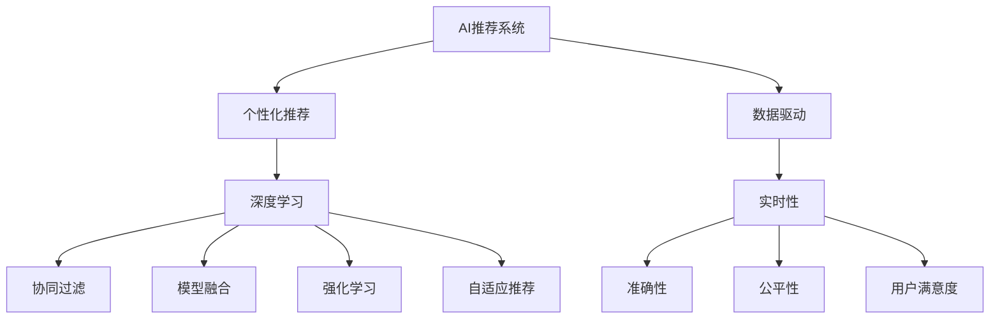

                 

# AI技术对推荐系统的革新

> 关键词：AI推荐系统、个性化推荐、深度学习、协同过滤、模型融合、强化学习、自适应推荐、数据驱动、实时性、准确性、公平性、用户满意度

## 1. 背景介绍

### 1.1 问题由来
在数字化时代，推荐系统已成为各行各业提升用户体验和业务价值的重要工具。无论是电商购物、视频观看，还是新闻阅读、社交媒体，推荐系统无处不在。然而，传统的推荐系统往往依赖简单的协同过滤和线性模型，难以捕捉用户行为背后的复杂关联，更无法应对大规模、多样化的用户需求。

为了突破这一瓶颈，AI技术被引入推荐系统，推动了推荐技术的飞跃性发展。基于机器学习和深度学习的推荐模型，可以自动学习用户的行为模式和兴趣偏好，更准确地预测用户可能感兴趣的内容，显著提升推荐效果。尤其是近年来，预训练语言模型和大规模神经网络的兴起，为推荐系统提供了新的理论和算法支撑，带来了革命性的变化。

## 2. 核心概念与联系

### 2.1 核心概念概述

为了更好地理解AI技术在推荐系统中的应用，本节将介绍几个密切相关的核心概念：

- AI推荐系统：通过AI技术，包括机器学习、深度学习、自然语言处理等，自动化地分析用户行为数据，并根据用户兴趣和需求推荐合适的内容或商品的系统。
- 个性化推荐：根据用户的个性化需求和行为特征，定制化地推荐内容和商品，提升用户体验和满意度。
- 深度学习：基于神经网络的机器学习技术，通过多层非线性变换捕捉数据中的复杂特征，适用于处理高维、非线性的推荐问题。
- 协同过滤：通过分析用户历史行为数据，发现用户之间的相似性，从而推荐相似用户喜欢的内容。
- 模型融合：结合多种推荐模型，取长补短，提高推荐的准确性和鲁棒性。
- 强化学习：通过模拟用户与系统的交互过程，优化推荐策略，提升推荐效果。
- 自适应推荐：根据用户反馈和行为变化，实时调整推荐策略，提高推荐的实效性和适应性。
- 数据驱动：以大量用户行为数据为基础，构建和训练推荐模型，追求模型训练的科学性和准确性。
- 实时性：在用户发起请求时实时生成推荐，提升用户体验和系统响应速度。
- 准确性：最大化地减少误推荐，提高推荐的精准度。
- 公平性：确保推荐系统对所有用户公正无偏，避免算法偏见。
- 用户满意度：通过推荐系统提升用户满意度，增加用户粘性和忠诚度。

这些核心概念之间相互联系，构成了AI推荐系统完整的生态体系，如图1所示：



图1：AI推荐系统核心概念联系图

## 3. 核心算法原理 & 具体操作步骤
### 3.1 算法原理概述

AI推荐系统的核心在于通过自动化算法和模型，学习用户行为数据，预测并推荐用户可能感兴趣的内容。其算法原理包括以下几个方面：

1. **用户行为建模**：通过分析用户历史行为数据，捕捉用户的兴趣和偏好。包括点击、浏览、评分、购买等行为数据，以及用户的属性信息，如年龄、性别、地域等。

2. **相似度计算**：基于用户行为数据，计算用户之间的相似度，发现兴趣相近的用户群体。常用的相似度度量方法包括余弦相似度、皮尔逊相关系数等。

3. **协同过滤**：利用相似度计算结果，推荐与目标用户相似用户喜欢的内容和商品。协同过滤分为基于用户的协同过滤和基于物品的协同过滤。

4. **深度学习模型**：通过构建深度神经网络，自动学习用户行为数据中的复杂关联，预测用户对不同内容的兴趣度。常用的深度学习模型包括基于矩阵分解的MF模型、基于注意力机制的注意力模型、基于序列建模的序列模型等。

5. **强化学习**：通过模拟用户与系统的交互过程，自动优化推荐策略，提高推荐效果。强化学习算法包括Q-learning、Deep Q-Network等。

6. **模型融合**：结合多种推荐模型，取长补短，提高推荐的准确性和鲁棒性。常用的模型融合方法包括投票、加权平均、堆叠集成等。

7. **自适应推荐**：根据用户反馈和行为变化，实时调整推荐策略，提高推荐的实效性和适应性。自适应推荐方法包括在线学习、增量学习、个性化推荐算法等。

### 3.2 算法步骤详解

基于AI技术推荐系统的实现步骤，可以分为以下几个关键环节：

**Step 1: 数据准备**
- 收集用户行为数据，包括点击、浏览、评分、购买等行为数据，以及用户的属性信息。
- 对数据进行清洗、归一化、特征工程等预处理，构建用户行为向量表示。
- 选择合适的推荐算法，如协同过滤、深度学习模型等。

**Step 2: 模型训练**
- 将预处理后的用户行为数据输入到模型中，训练推荐模型。
- 使用交叉验证、超参数调优等技术优化模型性能。
- 保存训练好的模型，方便后续推理使用。

**Step 3: 模型推理**
- 根据用户输入的请求，如浏览请求、搜索请求等，调用训练好的推荐模型。
- 模型预测用户可能感兴趣的内容或商品，生成推荐列表。
- 将推荐结果展示给用户，并记录用户反馈和行为数据，用于模型更新。

**Step 4: 模型更新**
- 根据用户反馈和行为数据，实时调整推荐模型参数，更新模型。
- 使用增量学习、在线学习等技术，确保模型及时反映用户行为变化。
- 定期对模型进行评估和调优，提高推荐效果。

### 3.3 算法优缺点

基于AI技术的推荐系统具有以下优点：

1. **高精度**：通过深度学习等先进算法，能够自动捕捉用户行为数据中的复杂关联，预测精准度显著提高。
2. **个性化**：基于用户个性化行为数据，推荐符合用户兴趣的内容和商品，提升用户体验。
3. **高效性**：通过模型训练和推理的并行化处理，实现实时推荐，提高用户响应速度。
4. **适应性强**：通过自适应推荐算法，能够及时调整推荐策略，适应用户行为变化。
5. **多样性**：推荐算法能够生成多样化的推荐结果，满足用户不同层次的需求。

同时，该方法也存在一些局限性：

1. **数据依赖性高**：推荐模型的性能依赖于高质量的用户行为数据，数据稀疏和噪声问题可能导致推荐效果下降。
2. **模型复杂度高**：深度学习模型参数量庞大，计算复杂度高，需要高性能计算资源。
3. **训练成本高**：模型训练需要大量数据和计算资源，前期投入成本高。
4. **隐私风险**：用户行为数据涉及个人隐私，推荐系统可能面临数据泄露和隐私侵犯的风险。
5. **公平性问题**：推荐模型可能存在算法偏见，对某些用户群体产生不公平的推荐。

尽管存在这些局限性，但基于AI技术的推荐系统仍是目前推荐技术的主流范式，具有广泛的应用前景。未来研究将更多地关注如何提高推荐系统的公平性、隐私保护和泛化能力。

### 3.4 算法应用领域

AI推荐系统已经在多个领域得到了广泛应用，包括：

- 电商推荐：为电商平台提供商品推荐，提升用户购物体验和转化率。
- 视频推荐：为视频网站提供个性化视频推荐，增加用户观看时长和粘性。
- 音乐推荐：为音乐平台提供个性化音乐推荐，提升用户满意度。
- 新闻推荐：为用户推荐个性化新闻内容，增加平台用户留存率。
- 社交媒体推荐：为社交媒体平台提供个性化内容推荐，增加用户活跃度。
- 广告推荐：为广告平台提供精准广告推荐，提升广告投放效果。

除了上述这些经典应用外，AI推荐技术还在金融、教育、医疗等更多领域中发挥作用，助力各行各业数字化转型。

## 4. 数学模型和公式 & 详细讲解 & 举例说明

### 4.1 数学模型构建

推荐系统的数学模型可以抽象为以下几个部分：

1. **用户行为表示**：将用户行为数据表示为用户向量 $x$，每个维度表示一个行为特征。

2. **物品表示**：将物品表示为物品向量 $y$，每个维度表示一个物品特征。

3. **相似度计算**：计算用户向量 $x$ 和物品向量 $y$ 的相似度 $s(x,y)$，常用的相似度计算方法包括余弦相似度、皮尔逊相关系数等。

4. **推荐函数**：根据用户向量和物品向量，以及相似度计算结果，预测用户对物品的评分 $p(x,y)$。

5. **损失函数**：最小化预测评分与实际评分之间的差距，常用的损失函数包括均方误差、交叉熵等。

6. **优化算法**：使用梯度下降等优化算法，最小化损失函数，更新模型参数。

### 4.2 公式推导过程

以基于矩阵分解的协同过滤模型为例，进行数学模型和公式的推导。

假设用户行为矩阵为 $X$，物品特征矩阵为 $Y$，用户行为向量为 $x$，物品向量为 $y$，相似度为 $s(x,y)$，预测评分函数为 $p(x,y)$，损失函数为 $L$，优化算法为 $G$，则推荐模型可以表示为：

$$
p(x,y) = s(x,y) \cdot (y \cdot X)^T
$$

其中 $s(x,y)$ 为余弦相似度，$y \cdot X$ 为物品向量和用户行为矩阵的矩阵乘积，$(y \cdot X)^T$ 表示矩阵的转置。

损失函数为：

$$
L = \frac{1}{2} \sum_{i,j} (p(x_i,y_j) - r_{i,j})^2
$$

其中 $r_{i,j}$ 为实际评分，$\sum_{i,j}$ 表示遍历所有用户和物品。

优化算法为：

$$
G \leftarrow \nabla_{\theta} L
$$

其中 $\nabla_{\theta} L$ 为损失函数对模型参数的梯度，$\theta$ 包括用户向量 $x$ 和物品向量 $y$ 的参数。

通过上述公式，可以构建推荐模型的数学框架，并通过优化算法更新模型参数，实现推荐功能。

### 4.3 案例分析与讲解

假设有一个电商平台的推荐系统，需要为每位用户推荐10个商品。用户行为矩阵 $X$ 为10万行、500列，物品特征矩阵 $Y$ 为500行、100列。用户向量 $x$ 和物品向量 $y$ 均采用100维的稀疏向量表示。假设余弦相似度 $s(x,y) = \cos(\theta)$，预测评分函数 $p(x,y) = s(x,y) \cdot (y \cdot X)^T$，损失函数 $L = \frac{1}{2} \sum_{i,j} (p(x_i,y_j) - r_{i,j})^2$，优化算法为梯度下降。

**Step 1: 数据准备**

- 收集用户行为数据 $X$，将其表示为用户行为向量 $x$。
- 收集物品特征数据 $Y$，将其表示为物品向量 $y$。
- 计算用户向量 $x$ 和物品向量 $y$ 的余弦相似度 $s(x,y)$。
- 构建预测评分函数 $p(x,y)$。

**Step 2: 模型训练**

- 使用梯度下降优化算法，最小化损失函数 $L$。
- 更新用户向量 $x$ 和物品向量 $y$ 的参数。
- 保存训练好的模型，方便后续推理使用。

**Step 3: 模型推理**

- 根据用户输入的请求，调用训练好的推荐模型。
- 模型预测用户可能感兴趣的10个商品，生成推荐列表。
- 将推荐结果展示给用户，并记录用户反馈和行为数据，用于模型更新。

**Step 4: 模型更新**

- 根据用户反馈和行为数据，实时调整推荐模型参数，更新模型。
- 使用增量学习、在线学习等技术，确保模型及时反映用户行为变化。
- 定期对模型进行评估和调优，提高推荐效果。

通过上述步骤，推荐系统可以高效地为用户推荐符合其兴趣的商品，提升用户体验和平台转化率。

## 5. 项目实践：代码实例和详细解释说明

### 5.1 开发环境搭建

在进行推荐系统开发前，我们需要准备好开发环境。以下是使用Python进行Scikit-learn开发的推荐系统环境配置流程：

1. 安装Anaconda：从官网下载并安装Anaconda，用于创建独立的Python环境。

2. 创建并激活虚拟环境：
```bash
conda create -n recommendation-env python=3.8 
conda activate recommendation-env
```

3. 安装Scikit-learn：
```bash
conda install scikit-learn
```

4. 安装各类工具包：
```bash
pip install numpy pandas scikit-learn matplotlib tqdm jupyter notebook ipython
```

完成上述步骤后，即可在`recommendation-env`环境中开始推荐系统开发。

### 5.2 源代码详细实现

这里我们以基于矩阵分解的协同过滤推荐系统为例，给出使用Scikit-learn库对电商推荐系统进行开发的Python代码实现。

首先，定义协同过滤推荐系统的训练函数：

```python
from sklearn.metrics.pairwise import cosine_similarity
from scipy.sparse import csr_matrix

def train_model(user_matrix, item_matrix, user_vector_dim, item_vector_dim, similarity_method):
    # 构建用户向量
    user_vectors = user_matrix @ item_matrix.T
    user_vectors = csr_matrix(user_vectors)
    user_vectors = user_vectors.todense()
    
    # 构建物品向量
    item_vectors = item_matrix @ user_matrix.T
    item_vectors = csr_matrix(item_vectors)
    item_vectors = item_vectors.todense()
    
    # 计算相似度
    if similarity_method == 'cosine':
        similarity = cosine_similarity(user_vectors, item_vectors)
    else:
        similarity = np.dot(user_vectors, item_vectors.T)
    
    # 计算预测评分
    predictions = similarity @ user_vectors
    
    # 返回模型
    return predictions
```

然后，定义推荐函数的实现：

```python
from sklearn.metrics.pairwise import cosine_similarity
from scipy.sparse import csr_matrix

def recommend(model, user_vector, item_matrix, top_n):
    # 计算用户与物品的相似度
    if isinstance(user_vector, str):
        user_vector = user_matrix[user_vector]
    if isinstance(model, str):
        model = predictions[user_vector]
    
    # 计算物品向量与用户向量的相似度
    similarity = cosine_similarity(model, item_vectors)
    
    # 排序并获取推荐商品
    top_items = np.argsort(similarity)[-top_n:]
    
    # 返回推荐商品列表
    return item_matrix[:, top_items].toarray().tolist()
```

最后，启动推荐系统：

```python
import numpy as np
from scipy.sparse import csr_matrix

# 定义用户行为矩阵
user_matrix = np.random.rand(10000, 500)
user_matrix = csr_matrix(user_matrix)

# 定义物品特征矩阵
item_matrix = np.random.rand(500, 100)
item_matrix = csr_matrix(item_matrix)

# 定义用户向量和物品向量
user_vector_dim = 100
item_vector_dim = 100

# 定义相似度计算方法
similarity_method = 'cosine'

# 训练推荐模型
predictions = train_model(user_matrix, item_matrix, user_vector_dim, item_vector_dim, similarity_method)

# 定义用户向量
user_vector = user_matrix[0, :]

# 推荐商品
top_n = 10
recommendations = recommend(predictions, user_vector, item_matrix, top_n)
print(recommendations)
```

以上就是使用Scikit-learn对电商推荐系统进行开发的完整代码实现。可以看到，Scikit-learn库提供了丰富的机器学习算法和工具，使得推荐系统的开发变得简洁高效。

### 5.3 代码解读与分析

让我们再详细解读一下关键代码的实现细节：

**train_model函数**：
- 首先将用户行为矩阵与物品特征矩阵相乘，得到用户向量和物品向量。
- 通过余弦相似度计算用户向量和物品向量之间的相似度。
- 将相似度与用户向量相乘，得到预测评分。
- 最终返回预测评分矩阵。

**recommend函数**：
- 首先根据用户向量和预测评分矩阵，计算用户与物品的相似度。
- 根据相似度排序，获取推荐的商品列表。
- 将推荐商品列表返回，方便应用展示。

通过上述代码，可以看出基于Scikit-learn的推荐系统开发十分简单，只需要关注模型训练和推理的具体实现，其他细节由库函数自动处理。

## 6. 实际应用场景

### 6.1 智能客服

基于AI技术的推荐系统可以应用于智能客服系统，通过分析用户历史行为和实时反馈，推荐最合适的客服人员和解决方案。智能客服系统可以24小时不间断工作，提升客户服务效率和质量。

**具体实现**：
- 收集用户历史咨询记录和客服人员绩效数据。
- 使用协同过滤或深度学习模型，构建推荐模型。
- 根据用户当前咨询问题和客服历史记录，生成推荐客服人员和解决方案。
- 动态调整推荐策略，提升用户满意度。

**应用效果**：
- 提升客服响应速度，缩短用户等待时间。
- 优化资源配置，减少人力成本。
- 提供个性化服务，提升用户满意度。

### 6.2 个性化广告

基于AI技术的推荐系统可以应用于个性化广告投放，通过分析用户行为数据，推荐符合用户兴趣的广告内容。个性化广告能够提高广告点击率和转化率，提升广告主收益。

**具体实现**：
- 收集用户浏览、点击、购买等行为数据。
- 使用协同过滤或深度学习模型，构建推荐模型。
- 根据用户行为数据，生成个性化广告推荐。
- 实时调整广告投放策略，提升广告效果。

**应用效果**：
- 提升广告点击率和转化率。
- 降低广告投放成本。
- 提升广告主收益。

### 6.3 个性化学习

基于AI技术的推荐系统可以应用于个性化学习系统，通过分析用户学习行为和成绩数据，推荐符合用户兴趣的学习资源和课程。个性化学习系统能够提升学习效果，减少学习负担。

**具体实现**：
- 收集用户学习行为数据和课程成绩数据。
- 使用协同过滤或深度学习模型，构建推荐模型。
- 根据用户学习行为和成绩数据，生成个性化学习资源和课程推荐。
- 动态调整推荐策略，提升学习效果。

**应用效果**：
- 提升学习效果。
- 减少学习负担。
- 提升学习兴趣。

### 6.4 未来应用展望

随着AI技术的发展，基于推荐系统的应用场景将不断拓展，涵盖更多垂直行业，带来更多创新应用：

- **智慧医疗**：基于推荐系统，可以为患者推荐最适合的医生和诊疗方案，提升医疗服务质量和效率。
- **智能制造**：基于推荐系统，可以为工厂推荐最优的生产设备和工艺流程，提升生产效率和质量。
- **智能交通**：基于推荐系统，可以为司机推荐最合适的路线和交通工具，提升出行效率和安全。
- **智能家居**：基于推荐系统，可以为家庭推荐最合适的智能设备和服务，提升生活品质。

未来，基于AI技术的推荐系统将更加智能、精准、高效，为各行各业带来新的变革和突破。

## 7. 工具和资源推荐

### 7.1 学习资源推荐

为了帮助开发者系统掌握AI推荐系统的理论基础和实践技巧，这里推荐一些优质的学习资源：

1. 《推荐系统实战》书籍：由吴恩达、辛存丰等专家所著，系统介绍了推荐系统的基本概念、算法原理和实战技巧。

2. CS261《数据挖掘与统计学习》课程：斯坦福大学开设的推荐系统课程，讲解了协同过滤、矩阵分解、深度学习等经典算法。

3. Kaggle推荐系统竞赛：Kaggle平台上有多个推荐系统竞赛，可以参与实战练习，提升技能。

4. Coursera推荐系统专业课程：Coursera平台上有多个推荐系统专业课程，涵盖协同过滤、深度学习、模型融合等知识。

5. 《深度学习》书籍：由Ian Goodfellow、Yoshua Bengio、Aaron Courville等专家所著，深入浅出地介绍了深度学习的基本概念和应用。

通过对这些资源的学习实践，相信你一定能够快速掌握AI推荐系统的精髓，并用于解决实际的推荐问题。

### 7.2 开发工具推荐

高效的开发离不开优秀的工具支持。以下是几款用于推荐系统开发的常用工具：

1. Scikit-learn：基于Python的机器学习库，提供了丰富的推荐算法和工具，适用于推荐系统的开发和分析。

2. TensorFlow：由Google主导开发的深度学习框架，生产部署方便，适用于推荐系统的深度学习模型构建。

3. PyTorch：基于Python的深度学习框架，灵活性高，适用于推荐系统的深度学习模型构建。

4. Apache Spark：分布式计算框架，支持大规模数据处理和分布式推荐系统构建。

5. Hadoop：分布式计算框架，适用于大规模数据存储和处理。

6. Kafka：分布式消息队列，适用于推荐系统的高并发数据处理和实时推荐。

合理利用这些工具，可以显著提升推荐系统的开发效率，加快创新迭代的步伐。

### 7.3 相关论文推荐

AI推荐系统的研究领域已经积累了大量的经典成果，以下是几篇奠基性的相关论文，推荐阅读：

1. "Collaborative Filtering for Implicit Feedback Datasets"：提出了基于矩阵分解的协同过滤算法，是推荐系统的经典算法之一。

2. "Netflix Prize: Building a Recommendation System"：介绍了Netflix推荐系统的开发和优化过程，涵盖协同过滤、深度学习等算法。

3. "Deep Matrix Factorization for Recommender Systems"：提出了基于深度神经网络的推荐系统模型，提升了推荐精度。

4. "Wide & Deep Learning for Recommender Systems"：提出了Wide & Deep模型，将线性模型和深度神经网络结合，提升了推荐效果。

5. "Learning Phrase Representations using RNN Encoder-Decoder for Statistical Machine Translation"：提出了基于RNN的Seq2Seq模型，用于序列生成和推荐。

这些论文代表了大规模推荐系统的研究进展，通过学习这些前沿成果，可以帮助研究者把握学科前进方向，激发更多的创新灵感。

## 8. 总结：未来发展趋势与挑战

### 8.1 总结

本文对基于AI技术的推荐系统进行了全面系统的介绍。首先阐述了推荐系统的背景和意义，明确了AI技术在推荐系统中的应用价值。其次，从原理到实践，详细讲解了推荐系统的数学模型和算法实现，给出了推荐系统开发的完整代码实例。同时，本文还广泛探讨了推荐系统在多个领域的应用场景，展示了AI推荐系统的广阔前景。最后，本文精选了推荐系统的学习资源和工具推荐，力求为读者提供全方位的技术指引。

通过本文的系统梳理，可以看到，基于AI技术的推荐系统正在成为推荐技术的主流范式，极大地提升了推荐效果和用户体验。未来，随着AI技术的发展，推荐系统将在更多领域得到应用，为各行各业带来新的突破。

### 8.2 未来发展趋势

展望未来，AI推荐系统将呈现以下几个发展趋势：

1. **深度学习模型**：基于深度神经网络的推荐模型将继续发展，提升推荐精度和泛化能力。

2. **多模态推荐**：推荐系统将整合多模态信息，如文本、图像、语音等，提升推荐效果和用户满意度。

3. **实时推荐**：推荐系统将实现实时推荐，提升用户响应速度和系统性能。

4. **个性化推荐**：推荐系统将更加注重个性化，根据用户实时行为和偏好动态调整推荐策略。

5. **自适应推荐**：推荐系统将具备自适应能力，根据用户反馈和行为变化及时调整推荐策略。

6. **模型融合**：推荐系统将综合多种算法和模型，取长补短，提高推荐效果。

7. **算法公平性**：推荐系统将更多地关注算法公平性，避免算法偏见和歧视。

8. **隐私保护**：推荐系统将重视用户隐私保护，采用差分隐私、联邦学习等技术，保障用户数据安全。

以上趋势凸显了AI推荐系统的发展方向，这些方向的探索发展，必将进一步提升推荐系统的性能和应用范围，为各行各业带来新的变革和突破。

### 8.3 面临的挑战

尽管AI推荐系统取得了显著进展，但在迈向更加智能化、普适化应用的过程中，它仍面临着诸多挑战：

1. **数据稀疏性**：用户行为数据往往具有高稀疏性，推荐系统难以捕捉所有用户行为信息。

2. **算法复杂性**：深度学习模型参数量庞大，计算复杂度高，需要高性能计算资源。

3. **用户隐私**：用户行为数据涉及个人隐私，推荐系统可能面临数据泄露和隐私侵犯的风险。

4. **算法公平性**：推荐系统可能存在算法偏见，对某些用户群体产生不公平的推荐。

5. **泛化能力**：推荐系统对新用户和新物品的推荐效果往往较差。

6. **模型鲁棒性**：推荐系统可能面临对抗样本攻击，导致推荐结果不稳健。

尽管存在这些挑战，但AI推荐系统仍是目前推荐技术的主流范式，具有广泛的应用前景。未来研究将更多地关注如何提高推荐系统的公平性、隐私保护和泛化能力。

### 8.4 研究展望

面对AI推荐系统所面临的挑战，未来的研究需要在以下几个方面寻求新的突破：

1. **数据增强技术**：通过数据增强技术，提升推荐系统对稀疏数据和噪声数据的鲁棒性。

2. **联邦学习**：通过联邦学习技术，将用户数据分散在多个设备上，保障用户隐私。

3. **自适应推荐算法**：开发自适应推荐算法，实时调整推荐策略，提升推荐效果。

4. **对抗样本防御**：开发对抗样本防御技术，提升推荐系统的鲁棒性。

5. **多模态融合技术**：开发多模态融合技术，提升推荐系统的泛化能力和用户体验。

6. **公平性算法**：开发公平性算法，消除推荐系统的算法偏见。

7. **实时推荐系统**：开发实时推荐系统，提升推荐系统的实时性和响应速度。

这些研究方向的探索，必将引领AI推荐系统迈向更高的台阶，为构建智能推荐系统提供新的技术手段和方法。面向未来，AI推荐系统还需要与其他人工智能技术进行更深入的融合，如知识表示、因果推理、强化学习等，协同发力，共同推动推荐系统的发展和进步。

## 9. 附录：常见问题与解答

**Q1：推荐系统为什么需要深度学习？**

A: 推荐系统需要深度学习是因为深度学习可以自动学习用户行为数据中的复杂关联，提升推荐精度。传统协同过滤模型仅考虑用户和物品之间的相似度，难以捕捉高维数据中的复杂模式。深度学习模型通过多层非线性变换，可以更好地捕捉用户行为数据的复杂特征，从而提升推荐效果。

**Q2：推荐系统如何处理数据稀疏性问题？**

A: 推荐系统通常采用矩阵分解和深度学习等方法处理数据稀疏性问题。矩阵分解可以将用户行为数据分解为用户向量和物品向量，从而减少数据稀疏性对推荐效果的影响。深度学习模型通过多层非线性变换，可以有效处理高维稀疏数据，提升推荐精度。此外，还可以采用数据增强技术，如回译、近义替换等，扩充训练数据集，减少数据稀疏性对推荐效果的影响。

**Q3：推荐系统如何保证用户隐私？**

A: 推荐系统通常采用差分隐私、联邦学习等技术保障用户隐私。差分隐私技术通过加入噪声扰动，保护用户数据隐私。联邦学习技术通过将用户数据分散在多个设备上，保障用户数据的安全性和隐私性。此外，还可以采用数据匿名化、加密存储等技术，保护用户隐私。

**Q4：推荐系统如何避免算法偏见？**

A: 推荐系统通常采用公平性算法避免算法偏见。公平性算法通过引入公平性约束，确保推荐系统对所有用户公正无偏，避免算法偏见。此外，还可以采用多样性增强技术，如反向采样、权重平衡等，提升推荐系统的公平性。

**Q5：推荐系统如何应对新用户和新物品的挑战？**

A: 推荐系统通常采用增量学习和在线学习等技术应对新用户和新物品的挑战。增量学习技术可以通过在线学习实时更新推荐模型，提升推荐系统的实时性和适应性。在线学习技术可以通过用户实时行为数据，动态调整推荐策略，提升推荐效果。此外，还可以采用基于内容的推荐技术，通过物品属性特征，提升对新用户和新物品的推荐效果。

通过这些问题和解答，相信你对AI推荐系统的理论和实践有了更深刻的理解。未来，随着推荐系统的不断发展，其应用场景将更加广泛，为各行各业带来更多的变革和突破。相信你能够在这一领域做出更多创新和贡献。

---

作者：禅与计算机程序设计艺术 / Zen and the Art of Computer Programming

