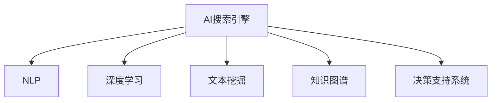

                 

# AI搜索引擎在危机管理中的作用

## 1. 背景介绍

### 1.1 问题由来

现代危机管理面临越来越多的复杂性和不确定性。自然灾害、疫情、恐怖袭击、金融危机等各类突发事件，常常要求组织能够快速响应、协调资源、决策指挥，以保障公众生命财产安全和社会稳定。然而，传统危机管理往往依赖人工汇总信息、分析和决策，效率低下，难以满足快速反应的要求。

随着人工智能技术的快速发展，AI搜索引擎应运而生，成为智能辅助决策的重要工具。通过在海量数据中进行深度学习和模式匹配，AI搜索引擎可以快速抓取和汇总信息，辅助决策者进行危机评估、资源分配和风险预警，极大地提升了危机管理的效率和精准度。

### 1.2 问题核心关键点

AI搜索引擎在危机管理中发挥的核心作用包括以下几个方面：

- **高效信息检索**：在海量文本和图像中快速检索与危机相关的信息，提供决策支持。
- **实时数据更新**：随着危机进展动态更新信息，确保决策依据的时效性和准确性。
- **智能预测预警**：利用机器学习模型对危机发展趋势进行预测，提前发出预警信号。
- **多源数据融合**：集成来自不同渠道的数据，形成全面的危机图景，辅助综合决策。
- **自适应学习**：根据新情况不断优化算法和模型，保持预测预警的精度。

本文将深入探讨AI搜索引擎在危机管理中的应用原理、操作步骤和具体实现，分析其优点和局限，并展望未来的发展趋势。

## 2. 核心概念与联系

### 2.1 核心概念概述

为更好地理解AI搜索引擎在危机管理中的应用，本文将介绍几个关键概念：

- **AI搜索引擎**：基于人工智能技术的搜索引擎，利用深度学习、自然语言处理等技术，在海量数据中快速精准地检索和分析信息。

- **自然语言处理(NLP)**：指计算机处理、理解、生成人类语言的技术，包括词法分析、句法分析、语义分析等。

- **深度学习**：通过构建多层次的神经网络模型，自动从数据中提取特征，用于分类、回归、聚类等任务。

- **文本挖掘**：从文本数据中挖掘和提取有价值的信息，如情感分析、主题模型等。

- **知识图谱**：将复杂数据结构化，构建图形化的语义网络，用于表示和推理。

- **决策支持系统**：利用人工智能技术辅助决策者进行信息分析、情景模拟和方案优化，提高决策效率和精准度。

这些核心概念之间的逻辑关系可以通过以下Mermaid流程图来展示：



这个流程图展示了我们核心概念之间的关联：

1. AI搜索引擎通过NLP、深度学习、文本挖掘、知识图谱等技术，提取和分析数据。
2. 决策支持系统集成AI搜索引擎的结果，辅助决策者进行信息分析和决策。

## 3. 核心算法原理 & 具体操作步骤

### 3.1 算法原理概述

AI搜索引擎在危机管理中的应用，主要基于深度学习模型和自然语言处理技术。其核心原理包括以下几个方面：

- **文本检索**：使用向量空间模型、检索算法等技术，在海量文本数据中高效检索与危机相关的信息。
- **情感分析**：通过情感分类模型，识别文本中的情感倾向，辅助危机评估和决策。
- **实体识别**：利用命名实体识别技术，提取危机相关人物、地点、机构等关键实体。
- **关系抽取**：使用关系抽取模型，识别文本中的实体关系，形成结构化的知识图谱。
- **预测预警**：利用时间序列预测、异常检测等技术，对危机发展趋势进行预测，提前发出预警信号。

### 3.2 算法步骤详解

AI搜索引擎在危机管理中的操作步骤包括以下几个关键步骤：

**Step 1: 数据预处理**

- 收集各类危机事件的历史数据、新闻报道、社交媒体等文本数据。
- 清洗和标准化数据，去除噪声和无用信息，形成干净的文本数据集。

**Step 2: 数据标注**

- 对数据集进行人工标注，添加实体、关系、情感等关键信息。
- 利用命名实体识别、关系抽取等技术，对文本进行结构化处理。

**Step 3: 模型训练**

- 选择合适的深度学习模型，如BERT、GPT等，进行预训练。
- 在标注数据集上微调模型，优化检索、分类、预测等任务的性能。
- 集成多模型，形成混合模型，提升整体性能。

**Step 4: 实时数据更新**

- 通过API接口实时获取新数据，进行增量更新和推理。
- 利用时间序列分析技术，对新数据进行异常检测和趋势预测。

**Step 5: 用户交互与反馈**

- 提供用户界面，允许决策者查询和浏览检索结果。
- 收集用户反馈，不断优化搜索引擎算法和模型。

### 3.3 算法优缺点

AI搜索引擎在危机管理中的应用具有以下优点：

- **高效检索**：能够在大规模数据中快速检索相关信息，减少人工查找的时间。
- **实时更新**：能够动态更新信息，提供最新决策依据。
- **智能预警**：利用预测模型，提前预警危机发展趋势。
- **辅助决策**：提供全面的信息分析，辅助决策者进行综合决策。

然而，该方法也存在一些局限性：

- **数据依赖**：搜索引擎的性能依赖于标注数据的质量和数量，高质量标注数据的获取成本较高。
- **泛化能力**：由于训练数据可能存在偏差，模型对新情况的泛化能力有限。
- **隐私风险**：大量敏感数据的检索和分析可能涉及隐私问题，需要采取相应的隐私保护措施。
- **可解释性**：AI搜索引擎的决策过程缺乏透明度，难以解释其推理逻辑和决策依据。

### 3.4 算法应用领域

AI搜索引擎在危机管理中的应用领域非常广泛，包括：

- **自然灾害应对**：快速检索和分析地震、洪水、火灾等自然灾害信息，辅助灾害预警和应急响应。
- **公共卫生应急**：监测和分析疫情动态，提供疫情预测和防控建议。
- **恐怖袭击防范**：分析恐怖主义活动和情报信息，辅助反恐决策和情报分析。
- **金融危机监控**：监测股市波动、经济指标等，提供金融危机预警和投资建议。
- **社会稳定维护**：监测和分析网络舆情，辅助政府部门进行社会稳定维护和舆情引导。

## 4. 数学模型和公式 & 详细讲解

### 4.1 数学模型构建

本节将使用数学语言对AI搜索引擎在危机管理中的应用进行更加严格的刻画。

记AI搜索引擎的输入为文本集合$D=\{x_1,x_2,\ldots,x_N\}$，其中每个文本$x_i$可以表示为向量$x_i\in\mathbb{R}^d$。假设搜索引擎的目标是识别文本中的关键实体$e_k$，并将其关联到实体关系$r_{e_k}$，形成实体关系图$G=(V,E)$。模型的目标是最大化正确识别和关联实体关系的概率$P(e_k|x_i,r_{e_k})$。

定义损失函数$\mathcal{L}(\theta)$，用于衡量模型在训练数据集$D$上的性能：

$$
\mathcal{L}(\theta) = \frac{1}{N}\sum_{i=1}^N \log P(e_k|x_i,r_{e_k})
$$

其中$\theta$表示模型的参数，$P(e_k|x_i,r_{e_k})$表示在给定文本$x_i$和实体关系$r_{e_k}$的条件下，识别实体$e_k$的概率。模型的目标是找到最优参数$\theta^*$，使得损失函数$\mathcal{L}(\theta^*)$最小化。

### 4.2 公式推导过程

以下是实体识别和关系抽取模型的详细推导：

1. **命名实体识别(NER)**：
   - 使用BERT等预训练语言模型，对文本$x_i$进行编码，得到上下文表示$\hat{x}_i$。
   - 利用softmax函数，对每个单词进行分类，输出实体类别$e_k$的概率。
   - 使用最大似然估计，训练模型参数$\theta$，使得$P(e_k|x_i)$最大化。

   $$
   \hat{x}_i = \text{BERT}(x_i;\theta)
   $$

   $$
   P(e_k|x_i) = \text{softmax}(\hat{x}_i)
   $$

2. **关系抽取**：
   - 对两个实体的上下文表示进行拼接，得到联合表示$\vec{u}_{e_k}$。
   - 使用关系抽取模型，对联合表示进行分类，输出关系$r_{e_k}$的概率。
   - 使用交叉熵损失函数，训练模型参数$\theta$，使得$P(r_{e_k}|e_k)$最大化。

   $$
   \vec{u}_{e_k} = \text{[CLS]}, \text{[SEP]} \cdot \hat{x}_i
   $$

   $$
   P(r_{e_k}|e_k) = \text{softmax}(\vec{u}_{e_k})
   $$

   $$
   \mathcal{L}(\theta) = -\frac{1}{N}\sum_{i=1}^N \log P(r_{e_k}|e_k)
   $$

### 4.3 案例分析与讲解

以COVID-19疫情监测为例，说明AI搜索引擎在危机管理中的应用：

- **数据预处理**：从新闻网站、社交媒体等渠道收集文本数据，并清洗标准化。
- **实体识别**：使用BERT模型，识别文本中的实体类别，如地点、时间、人物等。
- **关系抽取**：通过关系抽取模型，识别实体之间的关联，如疫情传播路径、感染人数等。
- **情感分析**：利用情感分类模型，分析文本中的情感倾向，辅助危机评估和决策。
- **预测预警**：利用时间序列模型，对疫情发展趋势进行预测，提前发出预警信号。

## 5. 项目实践：代码实例和详细解释说明

### 5.1 开发环境搭建

在进行AI搜索引擎的实践前，我们需要准备好开发环境。以下是使用Python进行TensorFlow开发的环境配置流程：

1. 安装Anaconda：从官网下载并安装Anaconda，用于创建独立的Python环境。

2. 创建并激活虚拟环境：
```bash
conda create -n tf-env python=3.8 
conda activate tf-env
```

3. 安装TensorFlow：根据CUDA版本，从官网获取对应的安装命令。例如：
```bash
conda install tensorflow -c pytorch -c conda-forge
```

4. 安装相关工具包：
```bash
pip install pandas numpy sklearn matplotlib
```

完成上述步骤后，即可在`tf-env`环境中开始AI搜索引擎的开发。

### 5.2 源代码详细实现

下面我们以情感分析为例，给出使用TensorFlow进行AI搜索引擎开发的PyTorch代码实现。

首先，定义情感分析模型：

```python
import tensorflow as tf
from tensorflow.keras.layers import Embedding, Dense, LSTM, Bidirectional
from tensorflow.keras.models import Sequential

def build_model(input_dim, output_dim, hidden_dim, num_layers):
    model = Sequential()
    model.add(Embedding(input_dim, hidden_dim, input_length=max_len))
    model.add(Bidirectional(LSTM(hidden_dim)))
    model.add(Dense(output_dim, activation='softmax'))
    return model
```

然后，定义数据加载和处理函数：

```python
def load_data(file_path):
    with open(file_path, 'r', encoding='utf-8') as f:
        lines = f.readlines()
    labels = [line.split('\t')[1] for line in lines]
    texts = [line.split('\t')[0] for line in lines]
    return texts, labels

def preprocess_text(texts):
    tokenizer = tf.keras.preprocessing.text.Tokenizer()
    tokenizer.fit_on_texts(texts)
    sequences = tokenizer.texts_to_sequences(texts)
    padded_sequences = tf.keras.preprocessing.sequence.pad_sequences(sequences, maxlen=max_len, padding='post')
    return padded_sequences, tokenizer.word_index
```

最后，启动训练流程：

```python
max_len = 200
input_dim = len(tokenizer.word_index) + 1
output_dim = len(label2id) + 1

train_texts, train_labels = load_data('train.txt')
dev_texts, dev_labels = load_data('dev.txt')

train_sequences, tokenizer = preprocess_text(train_texts)
dev_sequences, _ = preprocess_text(dev_texts)

train_model = build_model(input_dim, output_dim, 128, 1)
train_model.compile(optimizer='adam', loss='sparse_categorical_crossentropy', metrics=['accuracy'])

train_model.fit(train_sequences, train_labels, validation_data=(dev_sequences, dev_labels), epochs=10, batch_size=64)
```

以上就是使用TensorFlow进行情感分析的AI搜索引擎开发的完整代码实现。可以看到，TensorFlow和Keras使得模型的构建和训练过程变得简洁高效。开发者可以将更多精力放在数据处理、模型改进等高层逻辑上，而不必过多关注底层的实现细节。

### 5.3 代码解读与分析

让我们再详细解读一下关键代码的实现细节：

**模型定义**：
- `Embedding`层用于将文本转换为向量表示。
- `Bidirectional LSTM`层用于捕捉双向上下文信息。
- `Dense`层用于输出情感分类结果。

**数据加载与处理**：
- `load_data`函数：从文本文件中加载数据，并进行初步预处理。
- `preprocess_text`函数：对文本进行分词、转换为数字序列、并进行填充。

**模型训练**：
- `build_model`函数：定义模型结构，并进行编译。
- `train_model`函数：使用`fit`方法，训练模型并输出训练过程。

## 6. 实际应用场景

### 6.1 智能舆情监测

AI搜索引擎在智能舆情监测中的应用，可以实时监测和分析网络舆情，辅助政府部门进行舆情引导和风险防控。例如，在疫情期间，AI搜索引擎可以监测和分析社交媒体、新闻网站等渠道的信息，识别敏感词汇、热点话题和情感倾向，及时预警潜在风险。

### 6.2 应急响应平台

AI搜索引擎在应急响应平台中的应用，可以提供快速的信息检索和综合分析，辅助应急决策和资源调配。例如，在自然灾害发生时，AI搜索引擎可以快速检索相关的救援信息、资源分布、影响评估等，辅助应急指挥和救援调度。

### 6.3 社会稳定维护

AI搜索引擎在社会稳定维护中的应用，可以实时监测和分析网络舆情，辅助政府部门进行舆情引导和风险防控。例如，在社会稳定事件发生时，AI搜索引擎可以识别敏感词汇、热点话题和情感倾向，及时预警潜在风险，协助政府部门进行快速响应和风险防控。

## 7. 工具和资源推荐

### 7.1 学习资源推荐

为了帮助开发者系统掌握AI搜索引擎的理论基础和实践技巧，这里推荐一些优质的学习资源：

1. **《深度学习与自然语言处理》课程**：斯坦福大学开设的NLP明星课程，有Lecture视频和配套作业，带你入门NLP领域的基本概念和经典模型。

2. **TensorFlow官方文档**：TensorFlow的官方文档，提供了丰富的API接口和样例代码，是新手上手的必备资料。

3. **NLP Notebook**：Google提供的NLP开发环境，提供了丰富的预训练模型和工具，方便开发者快速迭代实验。

4. **NLP With Transformers**：Transformers库的官方文档，提供了详细的模型介绍和代码实现，是深入学习的推荐资源。

### 7.2 开发工具推荐

高效的开发离不开优秀的工具支持。以下是几款用于AI搜索引擎开发的常用工具：

1. **TensorFlow**：Google主导开发的开源深度学习框架，生产部署方便，适合大规模工程应用。

2. **Keras**：基于TensorFlow的高级神经网络API，提供了简洁易用的接口，适合快速原型开发。

3. **PyTorch**：Facebook开发的深度学习框架，灵活易用，适合学术研究和原型开发。

4. **NLTK**：Python中的自然语言处理工具包，提供了丰富的NLP功能和数据集，适合NLP任务开发。

5. **spaCy**：Python中的自然语言处理库，提供了高效的文本处理和实体识别功能，适合构建NLP应用。

6. **Gensim**：Python中的文本挖掘和模型训练库，提供了词向量模型和主题模型等工具，适合文本分析任务。

### 7.3 相关论文推荐

AI搜索引擎在危机管理中的应用源于学界的持续研究。以下是几篇奠基性的相关论文，推荐阅读：

1. **Deep Learning for NLP**：AI搜索引擎的核心技术基础，介绍了深度学习模型在NLP任务中的应用。

2. **BERT: Pre-training of Deep Bidirectional Transformers for Language Understanding**：介绍了BERT模型在NLP任务中的广泛应用，包括情感分析、实体识别等。

3. **Attention is All You Need**：介绍了Transformer模型在NLP任务中的应用，提升了模型的效率和效果。

4. **Transformer-XL: Attentions Are All We Need**：介绍了Transformer-XL模型在长文本处理中的应用，提升了模型的处理能力。

5. **Semi-Supervised Sequence Labeling with SSL**：介绍了半监督学习在NLP任务中的应用，提升了模型在标注数据不足情况下的性能。

这些论文代表了大语言模型在危机管理中的应用方向，通过学习这些前沿成果，可以帮助研究者把握学科前进方向，激发更多的创新灵感。

## 8. 总结：未来发展趋势与挑战

### 8.1 总结

本文对AI搜索引擎在危机管理中的应用进行了全面系统的介绍。首先阐述了AI搜索引擎在危机管理中的背景和意义，明确了其在信息检索、情感分析、实体识别、关系抽取等方面的核心作用。其次，从原理到实践，详细讲解了AI搜索引擎的数学模型、算法步骤和具体实现，给出了详细的代码实例。最后，本文还广泛探讨了AI搜索引擎在智能舆情监测、应急响应平台、社会稳定维护等实际应用场景中的具体应用。

通过本文的系统梳理，可以看到，AI搜索引擎在危机管理中发挥了重要作用，极大地提升了信息检索和决策分析的效率和准确性。未来，伴随深度学习技术的不断进步，AI搜索引擎将有更大的发展空间和应用前景。

### 8.2 未来发展趋势

展望未来，AI搜索引擎在危机管理中的应用将呈现以下几个发展趋势：

1. **多模态信息融合**：未来的搜索引擎将不仅仅限于文本数据，还将集成图像、语音等多模态信息，提供更全面的危机图景。

2. **实时动态更新**：未来的搜索引擎将能够实时更新信息，动态生成报告，辅助决策者进行实时决策。

3. **自适应学习**：未来的搜索引擎将具备自适应学习能力，能够根据新情况不断优化算法和模型，保持预测预警的精度。

4. **协同决策支持**：未来的搜索引擎将与决策支持系统深度集成，提供综合化的决策支持服务。

5. **可视化展示**：未来的搜索引擎将提供可视化展示界面，辅助决策者直观理解和分析数据。

以上趋势凸显了AI搜索引擎在危机管理中的广阔前景。这些方向的探索发展，必将进一步提升搜索引擎的性能和应用范围，为危机管理提供更强大的智能辅助。

### 8.3 面临的挑战

尽管AI搜索引擎在危机管理中的应用已经取得了显著进展，但在迈向更加智能化、普适化应用的过程中，仍面临诸多挑战：

1. **数据质量和标注成本**：高质量数据的获取和标注成本较高，制约了搜索引擎的性能提升。如何降低数据依赖，提高标注效率，将是重要研究方向。

2. **模型泛化能力**：由于训练数据可能存在偏差，模型对新情况的泛化能力有限。如何提高模型的泛化能力，增强其对新数据和环境的适应性，还需要更多研究和实践。

3. **隐私和安全性**：大量敏感数据的检索和分析可能涉及隐私问题，如何保护用户隐私，确保数据安全，需要采取更严格的措施。

4. **可解释性和透明度**：AI搜索引擎的决策过程缺乏透明度，难以解释其推理逻辑和决策依据。如何提高模型的可解释性，增强决策的透明度，将是亟待攻克的难题。

5. **计算资源消耗**：超大规模数据和模型的处理需要高性能计算资源，如何优化计算资源的使用，提高系统的效率，需要更多技术和算法改进。

6. **模型更新和迭代**：AI搜索引擎需要不断更新和迭代，以适应新的危机场景和变化的数据分布。如何设计高效的模型更新策略，保持系统的高效运行，需要进一步研究和探索。

这些挑战凸显了AI搜索引擎在危机管理中的现实难度，需要跨学科合作和多方共同努力，才能克服这些难题，推动技术的发展和应用的普及。

### 8.4 研究展望

未来，AI搜索引擎在危机管理中的应用还需从以下几个方面进行进一步研究：

1. **无监督学习和半监督学习**：利用无监督和半监督学习方法，减少对标注数据的依赖，提高模型的泛化能力。

2. **跨领域迁移学习**：将单一领域的模型知识迁移到其他领域，提升模型的适应性和泛化能力。

3. **多任务学习**：将多个任务结合，构建多任务学习模型，提高模型的综合性能。

4. **自适应学习**：构建自适应学习模型，根据新情况不断优化算法和模型，保持预测预警的精度。

5. **模型压缩和加速**：通过模型压缩和加速技术，提高模型的推理速度和计算效率，降低资源消耗。

6. **模型融合和集成**：利用多个模型进行融合和集成，提升整体性能和鲁棒性。

这些研究方向的探索，必将引领AI搜索引擎在危机管理中的应用迈向新的高度，为构建智能决策系统提供更强大的技术支撑。

## 9. 附录：常见问题与解答

**Q1: 如何构建高效的AI搜索引擎？**

A: 构建高效的AI搜索引擎需要以下关键步骤：

1. **数据预处理**：收集和清洗数据，确保数据质量和完整性。

2. **模型选择和训练**：选择合适的深度学习模型，如BERT、GPT等，进行预训练和微调。

3. **数据标注和增强**：对数据进行标注，添加实体、关系、情感等信息，并通过数据增强提升模型泛化能力。

4. **多源数据融合**：集成来自不同渠道的数据，形成全面的危机图景，辅助综合决策。

5. **实时动态更新**：利用API接口实时获取新数据，进行增量更新和推理。

**Q2: AI搜索引擎在危机管理中如何提升效率？**

A: AI搜索引擎在危机管理中提升效率的关键在于：

1. **高效信息检索**：在海量文本数据中快速检索相关信息，减少人工查找的时间。

2. **实时数据更新**：能够动态更新信息，提供最新决策依据。

3. **智能预测预警**：利用预测模型，提前预警危机发展趋势。

4. **辅助决策支持**：提供全面的信息分析，辅助决策者进行综合决策。

5. **可视化展示**：提供可视化展示界面，辅助决策者直观理解和分析数据。

**Q3: AI搜索引擎在危机管理中有哪些应用场景？**

A: AI搜索引擎在危机管理中的主要应用场景包括：

1. **智能舆情监测**：监测和分析网络舆情，辅助政府部门进行舆情引导和风险防控。

2. **应急响应平台**：提供快速的信息检索和综合分析，辅助应急决策和资源调配。

3. **社会稳定维护**：实时监测和分析网络舆情，辅助政府部门进行舆情引导和风险防控。

**Q4: AI搜索引擎在危机管理中如何提高模型泛化能力？**

A: 提高AI搜索引擎的模型泛化能力需要以下关键措施：

1. **多源数据融合**：集成来自不同渠道的数据，形成全面的危机图景。

2. **半监督学习和无监督学习**：利用半监督和无监督学习方法，减少对标注数据的依赖。

3. **多任务学习和迁移学习**：将单一领域的模型知识迁移到其他领域，提升模型的适应性和泛化能力。

4. **自适应学习**：构建自适应学习模型，根据新情况不断优化算法和模型。

5. **模型压缩和加速**：通过模型压缩和加速技术，提高模型的推理速度和计算效率。

6. **多模型集成**：利用多个模型进行融合和集成，提升整体性能和鲁棒性。

这些措施将帮助AI搜索引擎在危机管理中实现更高效、更准确、更全面的智能辅助。

---

作者：禅与计算机程序设计艺术 / Zen and the Art of Computer Programming

