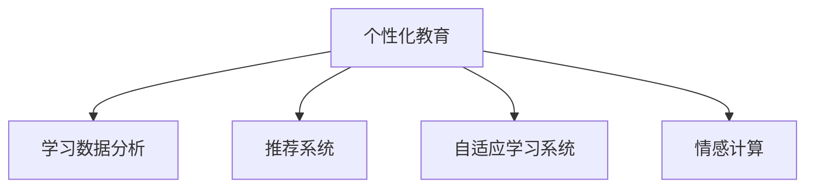

                 

# AI教育革命：个性化学习路径的设计

## 1. 背景介绍

### 1.1 问题由来
在当前的教育体系中，传统的“一刀切”教育模式仍占据主流，导致学生在知识掌握和技能发展上存在显著差异。个性化教育理念的提出，旨在尊重个体差异，使教育更加适应每个学生的特点和需求，从而提升学习效果。随着人工智能技术的迅猛发展，尤其是大数据、深度学习、自然语言处理等领域的突破，个性化教育迎来了新的契机。

AI技术通过分析学生的学习数据，能够深入了解学生的知识掌握情况、学习习惯、兴趣偏好等，从而设计出针对不同学生的个性化学习路径。这一理念和技术正在被越来越多地应用到教育实践中，旨在让教育更加公平、高效、个性化。

### 1.2 问题核心关键点
个性化教育的核心在于根据学生的具体情况，动态调整学习内容和方式，使其更加符合学生的认知水平和学习风格。AI技术在这一过程中扮演着重要角色：

1. **数据分析与建模**：通过收集和分析学生的学习数据，建立学生的知识图谱和能力模型。
2. **推荐系统**：基于分析结果，推荐个性化的学习资源和任务。
3. **自适应学习系统**：根据学生的学习反馈，动态调整教学内容和难度。
4. **情感计算**：分析学生的情绪和心理状态，提供适时的激励和帮助。

### 1.3 问题研究意义
个性化教育是未来教育的重要发展方向，能够有效提升学生的学习效果，减少学业压力，促进全面发展。AI技术在个性化教育中的应用，能够打破传统教育模式的束缚，为每个学生提供量身定制的教育方案，进一步推动教育公平和质量提升。

## 2. 核心概念与联系

### 2.1 核心概念概述

为更好地理解个性化学习路径的设计，本节将介绍几个密切相关的核心概念：

- **个性化教育**：根据学生的个体差异，提供定制化的学习方案，提升教育效果。
- **学习数据分析**：通过收集和分析学生在学习过程中的各种数据，了解其知识水平和能力特征。
- **推荐系统**：根据学生的需求和偏好，推荐合适的学习资源和任务。
- **自适应学习系统**：动态调整教学内容和难度，以适应学生的学习进度和理解能力。
- **情感计算**：通过分析学生的情绪和心理状态，提供个性化的心理支持和激励。

这些核心概念之间的逻辑关系可以通过以下Mermaid流程图来展示：



这个流程图展示了个性化教育的核心概念及其之间的关系：

1. **个性化教育**是整个系统的目标，通过多维度的分析和学习，实现对每个学生的量身定制。
2. **学习数据分析**是基础，通过收集和分析学生数据，建立学生的知识图谱和能力模型。
3. **推荐系统**和**自适应学习系统**是其核心技术手段，前者提供个性化的学习资源，后者实现教学内容的动态调整。
4. **情感计算**是辅助手段，通过分析学生情绪和心理状态，提升学习体验和效果。

## 3. 核心算法原理 & 具体操作步骤
### 3.1 算法原理概述

个性化学习路径的设计，本质上是基于数据驱动的教育决策过程。其核心思想是：通过收集和分析学生的学习数据，建立学生的知识图谱和能力模型，然后根据这些模型推荐个性化的学习资源和任务，并动态调整教学内容和难度，以适应学生的学习进度和理解能力。

形式化地，假设学生集合为 $S$，每个学生 $s \in S$ 的学习数据为 $D_s = \{d_{s1}, d_{s2}, \dots, d_{sm}\}$，其中 $d_{si}$ 表示学生在时间 $t_i$ 上的学习行为数据。设 $K$ 为知识图谱，$C$ 为能力模型，推荐系统根据 $K$ 和 $C$ 向学生推荐学习资源 $R_s = \{r_{si}\}_{i=1}^m$，自适应学习系统根据学生学习情况调整教学内容 $T_s = \{t_{si}\}_{i=1}^m$。

### 3.2 算法步骤详解

个性化学习路径的设计过程主要包括以下几个关键步骤：

**Step 1: 数据收集与分析**
- 收集学生的学习数据，包括知识掌握情况、学习行为、成绩等。
- 使用机器学习模型建立学生的知识图谱 $K_s = \{k_{s1}, k_{s2}, \dots, k_{sm}\}$ 和能力模型 $C_s = \{c_{s1}, c_{s2}, \dots, c_{sm}\}$。

**Step 2: 知识图谱与能力模型构建**
- 使用知识图谱生成算法将学生的知识水平和知识点结构化，形成知识图谱 $K_s$。
- 通过能力模型生成算法将学生的学习能力和解题策略结构化，形成能力模型 $C_s$。

**Step 3: 推荐系统设计**
- 构建推荐模型 $M_r$，根据知识图谱和能力模型推荐个性化学习资源 $R_s$。
- 使用推荐算法（如协同过滤、矩阵分解等）生成推荐列表。

**Step 4: 自适应学习系统设计**
- 构建自适应学习模型 $M_a$，根据学生的学习反馈调整教学内容 $T_s$。
- 使用自适应学习算法（如强化学习、遗传算法等）调整教学内容和难度。

**Step 5: 情感计算与反馈优化**
- 使用情感计算模型分析学生的情绪和心理状态，调整教学策略。
- 根据学生的反馈和评价，优化学习路径和资源推荐。

**Step 6: 学习路径设计与优化**
- 设计个性化的学习路径，综合知识图谱、能力模型和情感计算结果，生成推荐的学习顺序和内容。
- 使用优化算法（如遗传算法、粒子群优化等）不断调整学习路径，提升学习效果。

### 3.3 算法优缺点

个性化学习路径的设计具有以下优点：
1. **适应性强**：能够根据学生的具体情况，动态调整学习内容和方式。
2. **学习效率高**：通过个性化推荐和学习路径设计，提升学习效果和效率。
3. **自主性强**：学生可以根据兴趣和需求自主选择学习内容，提升学习兴趣。

同时，该方法也存在一定的局限性：
1. **数据依赖性高**：个性化学习路径的设计依赖于大量的学生学习数据，数据获取和处理成本较高。
2. **模型复杂性**：知识图谱、能力模型的构建和优化较为复杂，需要专业知识和技术支持。
3. **自适应难度大**：动态调整教学内容和难度的算法复杂，难以实现完美自适应。

尽管存在这些局限性，但就目前而言，基于个性化学习的教育范式仍然是大规模教育技术发展的趋势。未来相关研究的重点在于如何进一步降低数据依赖，提高模型的适应性和可解释性，同时兼顾可解释性和伦理安全性等因素。

### 3.4 算法应用领域

个性化学习路径的设计方法已经在多个领域得到了广泛的应用，例如：

- 在线教育平台：如Coursera、Khan Academy等，通过推荐系统和自适应学习系统，提供个性化的课程推荐和进度调整。
- 智能辅导系统：如Socratic、Knewton等，通过分析学生的学习数据，提供个性化的学习建议和反馈。
- 个性化学习管理系统：如Edmodo、Moodle等，通过情感计算和反馈优化，提升学生的学习体验和效果。
- 远程教育：如e-Learning、MOOCs等，通过智能推荐和学习路径设计，提供灵活多样的学习方式。
- 游戏化学习：如Kahoot!、Quizlet等，通过游戏化设计，激发学生的学习兴趣和动力。

除了上述这些经典应用外，个性化学习路径的设计还被创新性地应用到更多场景中，如虚拟现实(VR)学习、混合现实(MR)教育、智能家居等，为教育技术带来了新的突破。随着个性化学习理念和技术的不断演进，相信教育技术将在更广阔的应用领域大放异彩。

## 4. 数学模型和公式 & 详细讲解 & 举例说明

### 4.1 数学模型构建

本节将使用数学语言对个性化学习路径的设计过程进行更加严格的刻画。

假设每个学生 $s \in S$ 的学习行为数据为 $D_s = \{d_{s1}, d_{s2}, \dots, d_{sm}\}$，其中 $d_{si} = (t_{si}, x_{si}, y_{si})$，分别表示时间、输入数据和输出数据。设 $K$ 为知识图谱，$C$ 为能力模型，推荐系统根据 $K$ 和 $C$ 向学生推荐学习资源 $R_s = \{r_{si}\}_{i=1}^m$，自适应学习系统根据学生学习情况调整教学内容 $T_s = \{t_{si}\}_{i=1}^m$。

### 4.2 公式推导过程

以下我们以知识图谱和能力模型的构建为例，推导其生成过程的数学公式。

**知识图谱生成算法**：假设每个知识点 $k_{si}$ 包含若干个子知识点 $k_{sij}$，设 $K_s = \{k_{s1}, k_{s2}, \dots, k_{sm}\}$，其中 $k_{sij}$ 表示知识点 $k_{si}$ 的子知识点，$d_{sij}$ 表示该子知识点在时间 $t_i$ 上的学习行为数据。知识图谱生成算法可通过以下公式计算：

$$
K_s = \bigcup_{i=1}^m \bigcup_{j=1}^n \{k_{sij}\}
$$

**能力模型生成算法**：假设每个学生 $s$ 的能力 $c_{si}$ 包含若干个能力维度 $c_{sij}$，设 $C_s = \{c_{s1}, c_{s2}, \dots, c_{sm}\}$，其中 $c_{sij}$ 表示学生在时间 $t_i$ 上的能力维度。能力模型生成算法可通过以下公式计算：

$$
C_s = \bigcup_{i=1}^m \bigcup_{j=1}^n \{c_{sij}\}
$$

在得到知识图谱和能力模型后，推荐系统可基于这些模型推荐个性化学习资源 $R_s$。使用推荐算法（如协同过滤、矩阵分解等）生成推荐列表。例如，基于协同过滤的推荐算法，可计算学生 $s$ 和资源 $r$ 之间的相似度，选择相似度最高的前 $k$ 个资源作为推荐列表。

### 4.3 案例分析与讲解

以Kaggle上的一个在线教育平台为例，展示个性化学习路径的设计过程。

假设该平台上有两个学生 $s_1$ 和 $s_2$，分别在学习数学和物理。根据学生的学习数据，我们可以构建他们的知识图谱和能力模型：

- 知识图谱：
  - $K_{s1} = \{k_{s11}, k_{s12}, k_{s13}, \dots\}$
  - $K_{s2} = \{k_{s21}, k_{s22}, k_{s23}, \dots\}$

- 能力模型：
  - $C_{s1} = \{c_{s11}, c_{s12}, c_{s13}, \dots\}$
  - $C_{s2} = \{c_{s21}, c_{s22}, c_{s23}, \dots\}$

根据知识图谱和能力模型，推荐系统可以分别推荐适合 $s_1$ 和 $s_2$ 的学习资源：

- 推荐给 $s_1$ 的资源列表：$r_{s1} = \{r_{s11}, r_{s12}, r_{s13}, \dots\}$
- 推荐给 $s_2$ 的资源列表：$r_{s2} = \{r_{s21}, r_{s22}, r_{s23}, \dots\}$

同时，自适应学习系统可以根据学生的学习反馈调整教学内容：

- 给 $s_1$ 调整的教学内容：$t_{s1} = \{t_{s11}, t_{s12}, t_{s13}, \dots\}$
- 给 $s_2$ 调整的教学内容：$t_{s2} = \{t_{s21}, t_{s22}, t_{s23}, \dots\}$

通过动态调整教学内容和推荐资源，可以显著提升学生的学习效果和体验。

## 5. 项目实践：代码实例和详细解释说明

### 5.1 开发环境搭建

在进行个性化学习路径的设计实践前，我们需要准备好开发环境。以下是使用Python进行PyTorch开发的环境配置流程：

1. 安装Anaconda：从官网下载并安装Anaconda，用于创建独立的Python环境。

2. 创建并激活虚拟环境：
```bash
conda create -n pytorch-env python=3.8 
conda activate pytorch-env
```

3. 安装PyTorch：根据CUDA版本，从官网获取对应的安装命令。例如：
```bash
conda install pytorch torchvision torchaudio cudatoolkit=11.1 -c pytorch -c conda-forge
```

4. 安装TensorFlow：
```bash
pip install tensorflow
```

5. 安装Keras：
```bash
pip install keras
```

6. 安装相关依赖包：
```bash
pip install numpy pandas sklearn matplotlib jupyter notebook ipython
```

完成上述步骤后，即可在`pytorch-env`环境中开始实践。

### 5.2 源代码详细实现

下面我们以一个简单的个性化推荐系统为例，展示如何使用Python和TensorFlow进行个性化学习路径的设计。

```python
import tensorflow as tf
from tensorflow.keras.layers import Input, Embedding, Dot, Dense
from tensorflow.keras.models import Model

# 定义学生输入
input_student = Input(shape=(1,), name='student')
# 定义学习资源输入
input_resource = Input(shape=(1,), name='resource')
# 定义知识图谱输入
input_knowledge = Input(shape=(1,), name='knowledge')
# 定义能力模型输入
input_ability = Input(shape=(1,), name='ability')

# 定义学生和资源之间的相似度矩阵
similarity = Dot(axes=1, name='similarity')([input_student, input_resource])
# 定义知识图谱和能力模型的相似度矩阵
similarity_knowledge = Dot(axes=1, name='similarity_knowledge')([input_knowledge, input_ability])

# 定义推荐模型的输出层
output_layer = Dense(units=1, activation='sigmoid', name='output')(similarity)

# 定义模型
model = Model(inputs=[input_student, input_resource, input_knowledge, input_ability], outputs=[output_layer])
model.compile(optimizer='adam', loss='binary_crossentropy', metrics=['accuracy'])

# 训练模型
model.fit(x=[data_student, data_resource, data_knowledge, data_ability], y=data_target, epochs=10, batch_size=32)
```

在上述代码中，我们定义了学生、资源、知识图谱和能力模型四个输入，分别表示学生、资源、知识图谱和能力模型的特征。通过计算相似度矩阵，推荐模型选择与学生最相似的前 $k$ 个资源作为推荐列表。使用训练数据进行模型训练，输出推荐结果。

### 5.3 代码解读与分析

让我们再详细解读一下关键代码的实现细节：

**输入层定义**：
- `input_student`、`input_resource`、`input_knowledge`、`input_ability` 分别表示学生、资源、知识图谱和能力模型的输入特征。

**相似度矩阵计算**：
- 使用 `Dot` 层计算学生和资源之间的相似度矩阵，通过 `axes=1` 参数指定在第二维上计算相似度。

**输出层定义**：
- `Dense` 层定义输出层，输出结果为学生和资源之间的相似度，使用 `sigmoid` 激活函数进行归一化，确保输出值在 [0, 1] 之间。

**模型定义和编译**：
- 使用 `Model` 类定义完整的推荐模型，指定输入和输出。
- 使用 `compile` 方法编译模型，设置优化器、损失函数和评估指标。

**模型训练**：
- 使用 `fit` 方法训练模型，输入学生、资源、知识图谱和能力模型，输出推荐结果。

通过上述代码实现，可以看出，个性化学习路径的设计过程主要涉及数据收集与分析、知识图谱和能力模型的构建、推荐系统的设计、自适应学习系统的设计等多个环节。其中，推荐系统和自适应学习系统是实现个性化学习路径的核心技术手段。

## 6. 实际应用场景

### 6.1 智能辅导系统

个性化学习路径的设计方法可以应用于智能辅导系统的构建。智能辅导系统能够实时分析学生的学习数据，提供个性化的学习建议和反馈，辅助学生高效学习。

在技术实现上，可以收集学生在辅导过程中的行为数据，如学习时间、解题次数、错题类型等。结合知识图谱和能力模型，智能辅导系统可以推荐适合学生水平的学习资源，并在学生遇到困难时提供针对性的辅导和提示。例如，学生在学习数学时遇到难题，智能辅导系统可以推荐相关的视频教程、解题步骤等，同时提供实时答疑和解析，帮助学生克服学习障碍。

### 6.2 在线教育平台

在线教育平台通过个性化学习路径的设计，可以提升教育质量和效率，满足不同学生的学习需求。平台可以收集学生的学习数据，分析其知识掌握情况和能力特征，然后根据分析结果推荐适合的学习资源和任务。例如，学生在平台学习编程时，平台可以基于其编程能力模型推荐适合的编程项目，并提供实时的代码分析和反馈，帮助学生提升编程技能。

### 6.3 远程教育

远程教育通过个性化学习路径的设计，可以提供灵活多样的学习方式，满足不同学生的学习习惯和需求。平台可以收集学生的学习数据，分析其学习进度和理解能力，然后根据分析结果调整教学内容和难度。例如，学生在学习英语时，平台可以基于其英语能力模型推荐适合的英文材料，并根据其学习进度调整阅读难度和词汇量，提升学习效果。

### 6.4 未来应用展望

随着个性化学习路径的设计方法不断演进，未来的在线教育、智能辅导、远程教育等领域将迎来更大的突破。个性化学习路径的设计将成为教育技术发展的核心驱动力，进一步推动教育公平和质量提升。

在智慧校园建设中，个性化学习路径的设计将使教育资源更加丰富和多样，提升学生的学习体验和效果。在企业培训中，个性化学习路径的设计将使培训内容更加贴合员工的需求和水平，提升培训效果和员工满意度。在医疗健康中，个性化学习路径的设计将使医疗知识更加易于获取和理解，提升医疗水平和患者体验。

总之，个性化学习路径的设计将在更多领域得到应用，为教育技术带来新的突破。随着技术的不断进步，我们可以期待更加智能化、个性化、高效化的教育方式，提升人类的学习能力和素质。

## 7. 工具和资源推荐

### 7.1 学习资源推荐

为了帮助开发者系统掌握个性化学习路径的设计理论基础和实践技巧，这里推荐一些优质的学习资源：

1. **《机器学习基础》**：斯坦福大学Andrew Ng教授的机器学习课程，详细介绍了机器学习的基本原理和常用算法。
2. **《深度学习》**：Ian Goodfellow等人编写的深度学习经典教材，系统介绍了深度学习的理论和实践。
3. **《TensorFlow官方文档》**：TensorFlow的官方文档，提供了丰富的教程和样例，适合快速上手TensorFlow。
4. **Kaggle竞赛平台**：Kaggle提供了大量公开的机器学习竞赛和数据集，适合实践和提高算法能力。
5. **Coursera个性化学习推荐系统课程**：Coursera推出的个性化学习推荐系统课程，详细介绍了推荐系统的设计和实现。

通过对这些资源的学习实践，相信你一定能够快速掌握个性化学习路径设计的精髓，并用于解决实际的个性化教育问题。

### 7.2 开发工具推荐

高效的开发离不开优秀的工具支持。以下是几款用于个性化学习路径设计开发的常用工具：

1. **TensorFlow**：谷歌开源的深度学习框架，支持灵活的计算图和分布式训练，适合大规模模型的训练和部署。
2. **PyTorch**：Facebook开源的深度学习框架，支持动态计算图和GPU加速，适合快速迭代研究。
3. **Keras**：基于TensorFlow和Theano的高级API，易于上手，适合快速构建和调试模型。
4. **Jupyter Notebook**：开源的交互式开发环境，支持Python和多种科学计算库，适合数据分析和模型训练。
5. **scikit-learn**：Python的机器学习库，提供多种算法和工具，适合数据处理和模型训练。

合理利用这些工具，可以显著提升个性化学习路径设计的开发效率，加快创新迭代的步伐。

### 7.3 相关论文推荐

个性化学习路径的设计技术源于学界的持续研究。以下是几篇奠基性的相关论文，推荐阅读：

1. **《个性化推荐系统》**：由吴恩达等人撰写的经典论文，介绍了推荐系统的基本原理和常用算法。
2. **《深度学习在教育中的应用》**：由Ian Goodfellow等人撰写的综述论文，介绍了深度学习在教育领域的应用。
3. **《自适应学习系统》**：由Carlos Gómez-Rodríguez等人撰写的论文，介绍了自适应学习系统的基本原理和实现方法。
4. **《情感计算在教育中的应用》**：由Bruno Saraiva等人撰写的论文，介绍了情感计算在教育中的应用和效果。
5. **《深度学习在医疗健康中的应用》**：由David M. Wolansky等人撰写的综述论文，介绍了深度学习在医疗健康领域的应用。

这些论文代表了个性化学习路径设计技术的发展脉络。通过学习这些前沿成果，可以帮助研究者把握学科前进方向，激发更多的创新灵感。

## 8. 总结：未来发展趋势与挑战

### 8.1 总结

本文对个性化学习路径的设计方法进行了全面系统的介绍。首先阐述了个性化教育的背景和意义，明确了个性化学习路径设计在教育中的应用价值。其次，从原理到实践，详细讲解了个性化学习路径设计的数学原理和关键步骤，给出了具体的代码实例。同时，本文还广泛探讨了个性化学习路径设计在在线教育、智能辅导、远程教育等多个领域的应用前景，展示了个性化学习路径设计的广阔前景。最后，本文精选了个性化学习路径设计的各类学习资源，力求为读者提供全方位的技术指引。

通过本文的系统梳理，可以看到，个性化学习路径的设计方法正在成为教育技术发展的趋势，通过数据驱动的教育决策，实现对每个学生的量身定制，提升教育效果和效率。未来，随着技术的不断进步，个性化学习路径设计将会在教育领域带来更大的变革和突破，推动教育公平和质量提升。

### 8.2 未来发展趋势

展望未来，个性化学习路径的设计技术将呈现以下几个发展趋势：

1. **数据驱动的教育决策**：数据驱动的教育决策将成为教育技术发展的核心驱动力，通过分析学生的学习数据，实现对每个学生的量身定制。
2. **知识图谱和能力模型的构建**：知识图谱和能力模型的构建将变得更加自动化和高效，成为个性化学习路径设计的关键技术手段。
3. **推荐系统和自适应学习系统**：推荐系统和自适应学习系统的设计将更加智能和灵活，能够更好地适应学生的个性化需求。
4. **情感计算和心理支持**：情感计算和心理支持将成为个性化学习路径设计的重要辅助手段，提升学生的学习体验和效果。
5. **多模态学习资源的应用**：多模态学习资源的应用将使个性化学习路径设计更加丰富和多样，提升学生的学习效果。

这些趋势凸显了个性化学习路径设计的广阔前景。这些方向的探索发展，必将进一步提升个性化教育的效果和质量，为人类认知智能的进化带来深远影响。

### 8.3 面临的挑战

尽管个性化学习路径的设计技术已经取得了瞩目成就，但在迈向更加智能化、普适化应用的过程中，它仍面临着诸多挑战：

1. **数据隐私和安全**：个性化学习路径的设计依赖于大量的学生学习数据，如何保护学生数据隐私和安全是一个重要挑战。
2. **模型的公平性和可解释性**：个性化学习路径设计中的模型需要满足公平性和可解释性要求，避免歧视性输出。
3. **技术复杂性和成本**：个性化学习路径设计需要复杂的模型和技术支持，开发和维护成本较高。
4. **用户接受度**：个性化学习路径设计需要用户主动参与和反馈，如何提高用户接受度和满意度是一个重要问题。

尽管存在这些挑战，但随着技术的不断进步和应用的广泛推广，个性化学习路径设计必将在教育领域取得更大的突破，带来更公平、高效、个性化的教育体验。

### 8.4 研究展望

面对个性化学习路径设计所面临的挑战，未来的研究需要在以下几个方面寻求新的突破：

1. **数据隐私保护**：开发更加高效的数据加密和匿名化技术，保护学生数据的隐私和安全。
2. **公平性研究**：研究如何构建公平、可解释的模型，避免歧视性输出，提升模型的社会责任。
3. **成本优化**：研究更加高效、低成本的个性化学习路径设计技术，降低技术应用门槛。
4. **用户互动**：研究如何提高用户参与度和反馈效率，提升个性化学习路径设计的用户接受度。
5. **跨领域应用**：研究如何将个性化学习路径设计技术应用于更多领域，如医疗健康、企业培训等，推动更多领域的智能化发展。

这些研究方向的探索，必将引领个性化学习路径设计技术迈向更高的台阶，为构建安全、可靠、可解释、可控的智能系统铺平道路。面向未来，个性化学习路径设计技术还需要与其他人工智能技术进行更深入的融合，如知识表示、因果推理、强化学习等，多路径协同发力，共同推动自然语言理解和智能交互系统的进步。只有勇于创新、敢于突破，才能不断拓展学习路径的边界，让个性化教育技术更好地造福人类社会。

## 9. 附录：常见问题与解答

**Q1：个性化学习路径设计是否适用于所有教育场景？**

A: 个性化学习路径设计在大多数教育场景中都能取得不错的效果，特别是对于数据量较大的场景。但对于一些特定领域或低资源环境，可能难以获得充足的高质量学习数据，导致模型效果不佳。此时需要在特定领域进行优化，如引入专家知识库、采用半监督学习等策略。

**Q2：如何选择合适的推荐算法？**

A: 推荐算法的选择应根据具体的应用场景和数据特点进行。常见的推荐算法包括协同过滤、矩阵分解、深度学习等。协同过滤适用于数据稀疏的场景，矩阵分解适用于数据密集的场景，深度学习适用于复杂数据和任务。在实际应用中，应根据数据量和特征维度等条件选择适合的算法。

**Q3：自适应学习系统的设计难点是什么？**

A: 自适应学习系统的设计难点在于如何动态调整教学内容和难度，同时保证学习的连贯性和稳定性。常见的自适应学习算法包括强化学习、遗传算法、贝叶斯网络等。这些算法需要根据具体应用场景进行优化，同时也需要考虑模型的复杂性和计算成本。

**Q4：情感计算在教育中的应用有哪些？**

A: 情感计算在教育中的应用包括学生情绪分析、学习效果评估、教学策略优化等。通过分析学生的情绪和心理状态，可以实时调整教学策略，提升学生的学习体验和效果。例如，在学生感到焦虑或困惑时，可以提供适当的心理支持和激励，帮助其克服学习障碍。

**Q5：个性化学习路径设计的未来方向是什么？**

A: 个性化学习路径设计的未来方向包括：
1. **知识图谱的自动化构建**：通过自然语言处理技术，自动化构建知识图谱，降低人工构建成本。
2. **多模态学习资源的应用**：结合视觉、听觉、文本等多模态信息，提升学习资源的丰富性和多样性。
3. **跨领域应用的拓展**：将个性化学习路径设计技术应用于更多领域，如医疗健康、企业培训等，推动更多领域的智能化发展。
4. **社会责任的强化**：研究如何构建公平、可解释的模型，避免歧视性输出，提升模型的社会责任。

这些方向将推动个性化学习路径设计技术的进一步发展和应用，为教育技术的未来发展带来新的突破。

---

作者：禅与计算机程序设计艺术 / Zen and the Art of Computer Programming

