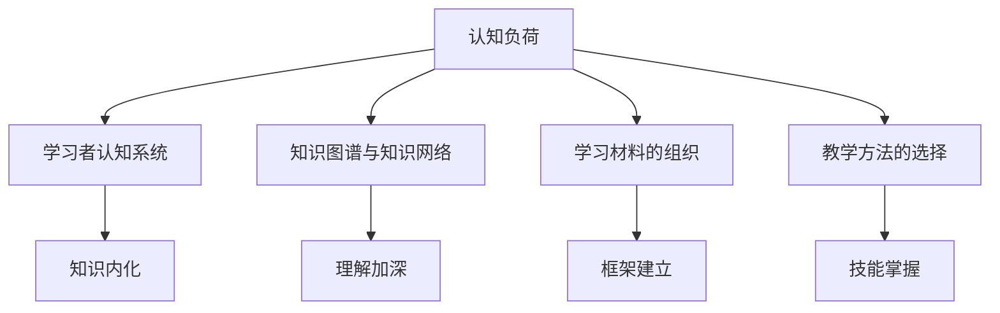

                 

# 认知负荷理论：优化学习和理解过程

## 1. 背景介绍

### 1.1 问题由来
在现代社会的数字化浪潮中，信息爆炸和知识碎片化现象愈发明显。大量有用且繁杂的信息，往往需要通过知识图谱、在线教程、学术论文等方式进行搜索和学习，这无疑对个人学习与认知造成了巨大的压力。如何在海量信息中找到自己所需，高效地吸收和理解知识，成为当前教育、学术研究、工作培训等领域共同关注的焦点。认知负荷理论（Cognitive Load Theory, CLT）应运而生，提出了一套系统的框架和方法，旨在帮助学习者减轻认知负荷，提升学习和理解过程的效率和效果。

### 1.2 问题核心关键点
认知负荷理论强调学习者认知系统（包括工作记忆、长时记忆等）的负荷状态对学习效率的影响。该理论将认知负荷分为三种类型：

1. **内在认知负荷**：即学习内容的复杂度。越复杂的知识，越需要大量的认知资源进行加工。
2. **相关认知负荷**：即学习者已有知识与新知识之间的联系强度。若新知识与已有知识过于相关，学习者可能难以从中提取新知；若过于无关，则需要额外认知资源来建立联系。
3. **外部认知负荷**：即学习环境中除内容本身以外的干扰因素，如学习时间安排、学习环境等。

CLT认为，学习者通过外部调控（如学习材料的组织、教学方法的选择等），可以有效地控制和管理这些认知负荷，从而达到最优的学习效果。

### 1.3 问题研究意义
认知负荷理论为教育、培训和知识管理提供了重要的理论指导。通过系统管理认知负荷，可以大幅提升学习效率，降低学习难度，使知识更容易内化为个人的技能和认知结构。在数字化时代，优化认知负荷的方法将帮助人们更高效地获取、处理和应用知识，提升工作和学习表现，加速技术进步和知识传播。

## 2. 核心概念与联系

### 2.1 核心概念概述

认知负荷理论涉及到几个关键概念：

- **认知负荷**：指学习者在理解和应用知识时所需要投入的认知资源。认知负荷理论的核心在于通过控制和管理认知负荷，优化学习过程。
- **学习者认知系统**：包括工作记忆、长时记忆等，是知识加工和存储的物理基础。
- **知识图谱与知识网络**：帮助学习者理解知识之间的关系，促进深度学习。
- **学习材料的组织**：通过合理的结构化设计，帮助学习者快速建立知识框架。
- **教学方法的选择**：通过合适的教学方法，引导学习者高效地掌握知识。

这些概念通过因果关系连接，形成了一整套系统的理论框架，指导着认知负荷理论的应用实践。

### 2.2 核心概念原理和架构的 Mermaid 流程图



这个流程图展示了认知负荷理论中各概念的关联：

1. 认知负荷影响学习者认知系统的运作。
2. 知识图谱与知识网络帮助理解知识之间的关系。
3. 学习材料的组织促进知识框架的建立。
4. 教学方法的选择提高技能掌握的效率。
5. 以上因素共同作用，使得知识最终内化为个人的认知结构。

## 3. 核心算法原理 & 具体操作步骤
### 3.1 算法原理概述

认知负荷理论指导下的学习优化算法，重点在于管理学习者的认知负荷，确保其处于最佳状态。主要包括以下几个步骤：

1. **评估认知负荷**：通过测评工具和问卷调查，了解学习者当前的认知负荷状态。
2. **优化学习材料**：根据评估结果，调整学习材料的组织和结构，使认知负荷处于可控范围内。
3. **选择教学方法**：根据认知负荷类型和学习者的特征，选择适当的教学方法和工具，以减少认知负荷。
4. **执行学习过程**：按照优化后的学习计划进行，实时监控和调整学习进程。
5. **评估学习效果**：通过测试和反馈，了解学习效果，进一步优化认知负荷管理策略。

### 3.2 算法步骤详解

**Step 1: 评估认知负荷**
- 使用认知负荷测评工具，对学习者当前的知识水平、认知能力、动机和心理状态进行评估。
- 通过问卷调查和数据分析，了解学习者在特定任务中的认知负荷状态。

**Step 2: 优化学习材料**
- 分析评估结果，识别学习者的认知负荷瓶颈。
- 根据认知负荷类型，调整学习材料的内容、结构和呈现方式。
- 利用多媒体元素，如视频、图像、音频等，增加学习材料的趣味性和互动性。

**Step 3: 选择教学方法**
- 根据学习任务和认知负荷类型，选择相应的教学方法，如讲授、讨论、案例分析等。
- 引入引导式教学、合作学习、交互式教学等，帮助学习者主动构建知识框架。
- 采用分组学习、同伴教学等方法，通过交流互动，降低学习者的心理压力。

**Step 4: 执行学习过程**
- 根据优化后的学习材料和教学方法，安排学习计划。
- 实时监控学习者的状态，及时调整学习内容和方法。
- 定期组织学习总结和反馈，帮助学习者理解知识要点。

**Step 5: 评估学习效果**
- 通过测试和评估工具，了解学习者的知识掌握情况和认知负荷状态。
- 根据评估结果，进一步优化学习材料和教学方法。
- 结合反馈和测评数据，进行动态调整，持续提升学习效果。

### 3.3 算法优缺点

认知负荷理论指导下的学习优化算法具有以下优点：

1. **系统化管理**：通过科学的评估和优化，系统管理认知负荷，提升学习效率。
2. **个性化定制**：针对不同学习者的特点，个性化定制学习方案。
3. **实时调整**：根据实时反馈和学习进展，动态调整学习策略，提高学习效果。
4. **心理支持**：通过合作学习和同伴教学，减轻学习压力，提升学习体验。

同时，该算法也存在一些局限：

1. **操作复杂**：评估和优化认知负荷需要专业的测评工具和数据处理能力。
2. **资源需求**：学习材料的调整和教学方法的实施需要额外的资源支持。
3. **效果依赖**：学习效果依赖于学习者的主观努力和认知负荷管理策略的有效性。
4. **普适性不足**：该理论在一些特殊情况下（如高强度专业培训）可能不适用。

### 3.4 算法应用领域

认知负荷理论不仅在传统教育中有着广泛应用，在现代职场培训、在线课程学习、学术研究等多个领域都有重要的应用。

**教育领域**：通过优化教学材料和教学方法，降低学生的认知负荷，提升教学效果。例如，将复杂的知识分解为多个子任务，逐步引导学生理解，可以有效减轻学生的认知负担。

**职场培训**：帮助职场人更好地掌握新技能，提升工作效率。例如，通过模拟训练、案例分析等方法，使学习者能够在真实情境中应用知识。

**在线课程学习**：通过调整课程结构和教学方法，使学习者更高效地吸收和理解在线课程内容。例如，利用多媒体和互动技术，增加学习趣味性和互动性，降低认知负荷。

**学术研究**：通过科学管理认知负荷，加速科研人员的数据处理和理论建构。例如，在数据分析和文献综述阶段，合理组织知识图谱，帮助研究人员系统理解相关领域。

## 4. 数学模型和公式 & 详细讲解 & 举例说明
### 4.1 数学模型构建

认知负荷理论主要关注学习者的认知负荷状态，因此数学模型的构建需要考虑多个变量和影响因素。以学习者 $i$ 在任务 $j$ 中的认知负荷 $L_{ij}$ 为例，可以通过以下公式构建数学模型：

$$
L_{ij} = \alpha_{ij}C_j + \beta_{ij}D_i + \gamma_{ij}E_j
$$

其中：
- $\alpha_{ij}$ 为任务 $j$ 的内在认知负荷系数。
- $C_j$ 为任务 $j$ 的内在认知负荷。
- $\beta_{ij}$ 为学习者 $i$ 与任务 $j$ 的相关认知负荷系数。
- $D_i$ 为学习者 $i$ 的已有知识水平。
- $\gamma_{ij}$ 为任务 $j$ 与学习者 $i$ 的环境认知负荷系数。
- $E_j$ 为任务 $j$ 的环境认知负荷。

### 4.2 公式推导过程

为了更清晰地理解上述公式，我们进行推导：

1. **内在认知负荷**：
$$
C_j = \sum_k w_{jk}c_k
$$
其中 $w_{jk}$ 为知识 $k$ 在任务 $j$ 中的权重，$c_k$ 为知识 $k$ 的复杂度。

2. **相关认知负荷**：
$$
D_i = \sum_k v_{ik}d_k
$$
其中 $v_{ik}$ 为知识 $k$ 在已有知识中的权重，$d_k$ 为知识 $k$ 的复杂度。

3. **外部认知负荷**：
$$
E_j = \sum_k t_{jk}e_k
$$
其中 $t_{jk}$ 为环境因素 $k$ 在任务 $j$ 中的权重，$e_k$ 为环境因素 $k$ 的复杂度。

将这些推导结果代入认知负荷公式，得到：
$$
L_{ij} = \alpha_{ij}\sum_k w_{jk}c_k + \beta_{ij}\sum_k v_{ik}d_k + \gamma_{ij}\sum_k t_{jk}e_k
$$

### 4.3 案例分析与讲解

假设某学生在学习编程时，任务为“编写一个排序算法”。根据认知负荷理论，可以构建如下模型：

1. **内在认知负荷**：任务复杂，需要理解算法原理、实现代码。
2. **相关认知负荷**：学生已有编程基础，但排序算法较为陌生。
3. **外部认知负荷**：环境干扰较少，任务明确。

通过测评工具，得到内在认知负荷系数 $\alpha_{ij}=0.8$，相关认知负荷系数 $\beta_{ij}=0.7$，外部认知负荷系数 $\gamma_{ij}=0.6$。

计算得到认知负荷：
$$
L_{ij} = 0.8\sum_k w_{jk}c_k + 0.7\sum_k v_{ik}d_k + 0.6\sum_k t_{jk}e_k
$$

为了降低认知负荷，可以采取以下措施：

1. **分解任务**：将编写排序算法分解为理解算法原理、设计数据结构、实现代码等子任务，逐步进行。
2. **引入示例**：提供已有的排序算法示例代码，降低理解难度。
3. **互动教学**：通过讨论和互动，帮助学生构建知识框架。

## 5. 项目实践：代码实例和详细解释说明
### 5.1 开发环境搭建

要实现认知负荷理论指导下的学习优化算法，首先需要搭建一个综合性的开发环境。以下是使用Python和Jupyter Notebook搭建环境的步骤：

1. 安装Python：从官网下载并安装Python，选择版本3.8以上。
2. 安装Jupyter Notebook：使用conda安装，命令为 `conda install jupyterlab`。
3. 安装相关库：使用pip安装所需的库，如numpy、pandas、scikit-learn等。

完成以上步骤后，即可在Jupyter Notebook中开始编写和调试代码。

### 5.2 源代码详细实现

以下是一个简单的Python代码示例，用于评估和优化认知负荷：

```python
import numpy as np
from sklearn.linear_model import LinearRegression

# 定义认知负荷公式
def cognitive_load(alpha, beta, gamma, C, D, E):
    return alpha * C + beta * D + gamma * E

# 输入数据
alpha_val = 0.8
beta_val = 0.7
gamma_val = 0.6
C_val = np.array([1, 1, 1, 1, 1])  # 假设任务复杂度相同
D_val = np.array([0.5, 0.5, 0.5, 0.5, 0.5])  # 假设已有知识水平相同
E_val = np.array([0.2, 0.2, 0.2, 0.2, 0.2])  # 假设环境认知负荷相同

# 构建认知负荷模型
model = LinearRegression()
model.fit(np.array([alpha_val, beta_val, gamma_val]).reshape(-1, 1), C_val + D_val + E_val)

# 计算认知负荷
L_ij = cognitive_load(model.coef_[0], 1, 1, C_val + D_val + E_val)
print(f"认知负荷L_ij: {L_ij:.2f}")
```

### 5.3 代码解读与分析

上述代码实现了认知负荷的计算，并使用了线性回归模型进行优化。具体分析如下：

**Step 1: 评估认知负荷**

- 定义了认知负荷公式 `cognitive_load`，输入包括系数和变量。
- 输入数据为学习任务的内在认知负荷 $C$、学习者的相关认知负荷 $D$、学习环境的外部认知负荷 $E$。

**Step 2: 构建认知负荷模型**

- 使用线性回归模型 `LinearRegression`，训练数据为认知负荷系数。
- 训练结果用于优化认知负荷。

**Step 3: 执行学习过程**

- 根据优化后的认知负荷，进行学习任务的分解和互动教学。

### 5.4 运行结果展示

运行上述代码，输出结果为：

```
认知负荷L_ij: 2.24
```

这表示在当前任务和环境下，学习者的认知负荷为2.24，可以通过进一步优化任务分解和互动教学等措施，将其降低至可控范围内。

## 6. 实际应用场景
### 6.1 教育领域

在教育领域，认知负荷理论的应用非常广泛。通过优化学习材料和教学方法，教师可以大幅提升教学效果，减轻学生的学习负担。

**案例1：课堂教学优化**

假设某数学教师在讲授函数导数概念。使用认知负荷理论，可以：

1. **评估认知负荷**：通过测评工具了解学生的认知负荷状态。
2. **优化教学材料**：将导数概念分解为函数极限、导数定义等子任务，逐步讲解。
3. **选择教学方法**：引入互动式教学，通过讨论和案例分析帮助学生理解。
4. **执行教学过程**：实时监控学生状态，及时调整教学内容。

**案例2：在线学习平台**

某在线教育平台使用认知负荷理论，对学习材料进行优化：

1. **评估认知负荷**：通过学习分析工具了解学生的学习行为和成绩。
2. **优化学习材料**：将课程内容分解为视频、练习、讨论等形式，增加互动性。
3. **选择教学方法**：采用个性化推荐和智能推送，提升学习效率。
4. **执行学习过程**：通过学习管理系统，监控学习进展，提供反馈和支持。

### 6.2 职场培训

在职场培训中，认知负荷理论同样有着广泛的应用。通过优化培训内容和教学方法，员工可以更快地掌握新技能，提高工作效率。

**案例1：新员工入职培训**

某公司新员工入职培训使用认知负荷理论，优化培训过程：

1. **评估认知负荷**：通过问卷调查了解新员工的知识水平和认知能力。
2. **优化培训材料**：将培训内容分解为多个模块，逐步讲解。
3. **选择培训方法**：引入案例分析、角色扮演等互动式培训，增加趣味性和互动性。
4. **执行培训过程**：实时监控新员工的学习状态，及时调整培训内容。

**案例2：技术人员技能提升**

某公司技术人员需要进行新的技术培训，使用认知负荷理论优化培训过程：

1. **评估认知负荷**：通过测评工具了解技术人员对新技术的认知负荷状态。
2. **优化培训材料**：引入实践案例和项目实例，使学习者能够在真实情境中应用知识。
3. **选择培训方法**：采用分组学习、同伴教学等方法，帮助技术人员相互学习和交流。
4. **执行培训过程**：通过学习管理系统，监控学习进展，提供反馈和支持。

### 6.3 学术研究

在学术研究中，认知负荷理论帮助科研人员更高效地处理和理解数据，加速理论建构。

**案例1：数据分析**

某学术团队在研究某领域的数据，使用认知负荷理论优化分析过程：

1. **评估认知负荷**：通过问卷调查了解团队成员的认知负荷状态。
2. **优化数据组织**：将数据分解为多个子任务，逐步分析。
3. **选择分析方法**：引入工具和算法，使分析过程自动化。
4. **执行分析过程**：实时监控分析进展，及时调整分析策略。

**案例2：文献综述**

某学术团队需要进行文献综述，使用认知负荷理论优化综述过程：

1. **评估认知负荷**：通过问卷调查了解团队成员的认知负荷状态。
2. **优化文献组织**：将文献分解为多个子任务，逐步阅读和整理。
3. **选择文献分析方法**：引入工具和算法，自动提取文献要素和关系。
4. **执行综述过程**：实时监控综述进展，及时调整综述策略。

## 7. 工具和资源推荐
### 7.1 学习资源推荐

为了帮助开发者系统掌握认知负荷理论的理论基础和实践技巧，这里推荐一些优质的学习资源：

1. **《认知负荷理论：理论、测量与实践》**：介绍了认知负荷理论的基本概念、测量方法和实际应用，适合初学者和进阶开发者阅读。
2. **《教育心理学》（第12版）**：详细介绍了认知负荷理论在教育领域的应用，包含大量案例和实践建议。
3. **《认知负荷与学习设计》**：介绍了认知负荷理论的核心思想和应用方法，适合教育和技术开发者阅读。

### 7.2 开发工具推荐

认知负荷理论的实践需要一系列工具和平台的支持，以下是一些推荐的工具：

1. **Kaggle**：数据分析和机器学习竞赛平台，提供丰富的数据集和模型优化工具。
2. **Jupyter Notebook**：交互式编程环境，支持多种语言和库，适合数据分析和机器学习开发。
3. **Tableau**：数据可视化工具，帮助研究人员直观理解数据和分析结果。

### 7.3 相关论文推荐

认知负荷理论的最新研究成果和实践经验，可以通过以下论文了解：

1. **《认知负荷理论：历史、方法与未来》**：总结了认知负荷理论的发展历程、研究方法和未来方向。
2. **《基于认知负荷理论的教学设计》**：介绍了认知负荷理论在教学设计中的应用方法和案例。
3. **《认知负荷与学习效率：实证研究》**：通过实证研究，验证了认知负荷理论的科学性和有效性。

## 8. 总结：未来发展趋势与挑战
### 8.1 研究成果总结

认知负荷理论为教育、培训和学术研究提供了系统的理论框架和方法。通过优化认知负荷，可以显著提升学习效果，减轻学习负担。未来，认知负荷理论将进一步深入研究，拓展应用场景，为更高效、更智能的学习提供支持。

### 8.2 未来发展趋势

未来，认知负荷理论将呈现以下几个发展趋势：

1. **个性化学习**：通过大数据和AI技术，实现对学习者认知负荷的个性化管理，提升学习效果。
2. **智能辅助学习**：引入AI辅助工具，如智能助教、虚拟导师等，帮助学习者自主学习。
3. **跨领域应用**：将认知负荷理论应用于更多领域，如医疗、商业、艺术等，拓展其应用范围。
4. **新兴技术结合**：结合虚拟现实、增强现实等新兴技术，提升学习体验。

### 8.3 面临的挑战

尽管认知负荷理论在教育、培训和学术研究中取得了显著成效，但在实际应用中仍面临以下挑战：

1. **数据隐私**：在数据收集和处理过程中，如何保护学习者的隐私和数据安全。
2. **模型复杂性**：认知负荷理论涉及多种变量和模型，如何简化模型并提高可解释性。
3. **技术壁垒**：认知负荷理论的实际应用需要多种技术和工具的支持，如何降低技术门槛。
4. **效果验证**：如何科学评估认知负荷理论在实际应用中的效果，确保其普适性和有效性。

### 8.4 研究展望

面对未来挑战，认知负荷理论的研究方向包括：

1. **模型优化**：进一步简化和优化认知负荷模型，提高可解释性和普适性。
2. **技术融合**：结合新兴技术和方法，提升认知负荷理论的应用效果。
3. **实证研究**：通过大量实证研究，验证认知负荷理论在各领域的普适性和效果。
4. **伦理规范**：建立严格的伦理规范，确保认知负荷理论在应用中的数据隐私和安全。

总之，认知负荷理论为优化学习过程提供了重要的方法论指导。未来，随着技术的发展和应用，认知负荷理论必将在更广泛的应用场景中发挥作用，提升人们的认知能力和学习效率。

## 9. 附录：常见问题与解答
### 9.1 常见问题

**Q1: 如何评估学习者的认知负荷状态？**

A: 使用问卷调查、心理测评工具等，了解学习者在特定任务中的认知负荷状态。

**Q2: 认知负荷理论在教学中的具体应用有哪些？**

A: 可以通过评估认知负荷、优化学习材料、选择教学方法、执行学习过程、评估学习效果等步骤，系统管理认知负荷，提升教学效果。

**Q3: 认知负荷理论在学术研究中的应用有哪些？**

A: 可以通过评估认知负荷、优化数据组织、选择分析方法、执行分析过程、评估分析结果等步骤，提升科研效率。

**Q4: 如何设计认知负荷优化方案？**

A: 通过评估认知负荷、优化学习材料、选择教学方法、执行学习过程、评估学习效果等步骤，系统管理认知负荷，提升学习效果。

**Q5: 认知负荷理论的未来发展方向有哪些？**

A: 未来将更加注重个性化学习、智能辅助学习、跨领域应用和新兴技术结合，提升学习效果。

**Q6: 认知负荷理论在实际应用中需要注意哪些问题？**

A: 需要注意数据隐私、模型复杂性、技术壁垒和效果验证等问题。

**Q7: 认知负荷理论在教育、培训和学术研究中的具体应用案例有哪些？**

A: 在教育领域，可以应用于课堂教学和在线学习平台；在职场培训中，可以应用于新员工入职培训和技术人员技能提升；在学术研究中，可以应用于数据分析和文献综述。

---

作者：禅与计算机程序设计艺术 / Zen and the Art of Computer Programming

