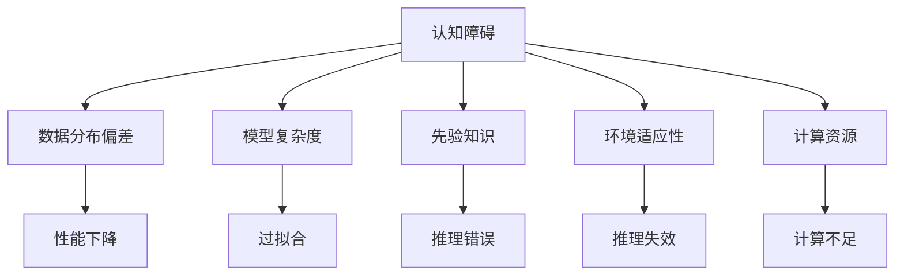

                 

# 认知障碍：理解困难的成因与克服策略

> 关键词：认知障碍, 理解困难, 成因分析, 克服策略, 认知模型, 算法实现, 实际应用

## 1. 背景介绍

### 1.1 问题由来
认知障碍在人工智能(AI)领域是一个普遍存在的问题，尤其在复杂的决策制定和任务执行过程中，它常常导致模型或系统的性能下降，甚至无法完成特定任务。认知障碍通常表现为模型无法正确处理数据、产生错误结果、或者无法适应新的数据分布等问题。理解和克服这些认知障碍，对于提升AI系统的效能和可靠性至关重要。

### 1.2 问题核心关键点
认知障碍通常由以下几个关键因素引起：
- 数据分布偏差：训练数据和实际使用数据分布不一致，导致模型在未知数据上性能不佳。
- 模型复杂度过高：模型过于复杂，在训练过程中容易出现过拟合，无法泛化到新数据。
- 先验知识不足：模型缺乏必要的先验知识，无法进行有效的推理和决策。
- 环境变化适应性差：模型无法适应外部环境的变化，导致推理错误或失效。
- 计算资源限制：计算资源不足，模型无法进行充分的训练或推理。

理解这些核心问题，将有助于我们制定针对性的策略，优化AI系统的性能。

### 1.3 问题研究意义
认知障碍研究对于AI技术的落地应用具有重要意义：
1. 提升系统性能：通过分析成因并采取相应措施，可以显著提高AI系统的决策准确性和可靠性。
2. 降低开发成本：减少不必要的重复开发，提高模型的通用性和可重用性。
3. 增强系统鲁棒性：构建更加健壮和稳健的AI系统，减少外部干扰的影响。
4. 推动技术进步：深化对认知障碍的理解，推动AI技术向更加智能、安全、可靠的方向发展。

## 2. 核心概念与联系

### 2.1 核心概念概述

为了更好地理解认知障碍的成因与克服策略，本节将介绍几个密切相关的核心概念：

- 认知障碍(Cognitive Bias)：指在模型决策过程中出现的非理性行为或偏见，导致决策偏离最优解。
- 数据分布偏差(Data Distribution Shift)：指训练数据和测试数据的统计特性不一致，导致模型在新数据上的性能下降。
- 模型复杂度(Model Complexity)：指模型的参数数量、结构复杂程度等，影响模型的泛化能力和计算效率。
- 先验知识(Prior Knowledge)：指模型在训练前已有的知识，如领域知识、常识等，对模型推理和决策具有重要影响。
- 环境适应性(Environment Adaptability)：指模型对外部环境变化的适应能力，如实时数据流、动态参数调整等。
- 计算资源(Computational Resources)：指模型的训练和推理所需资源，包括CPU、GPU、内存等，直接影响模型的性能。

这些概念之间的逻辑关系可以通过以下Mermaid流程图来展示：



这个流程图展示了认知障碍与模型性能之间复杂的相互作用关系：

1. 数据分布偏差导致模型在实际使用数据上性能下降。
2. 模型复杂度过高导致过拟合，无法泛化到新数据。
3. 先验知识不足影响模型推理和决策。
4. 环境适应性差导致推理错误或失效。
5. 计算资源限制使得模型无法充分训练或推理。

这些因素共同作用，导致模型在实际应用中表现出各种认知障碍。

## 3. 核心算法原理 & 具体操作步骤
### 3.1 算法原理概述

认知障碍的克服，通常依赖于一系列的技术手段，包括但不限于数据增强、正则化、参数共享、迁移学习等。这些方法的核心思想是：通过引入额外的数据、知识或约束，使得模型在训练和推理过程中更加稳健，从而减少认知障碍的发生。

### 3.2 算法步骤详解

基于上述核心概念，认知障碍的克服策略可以分为以下几个步骤：

**Step 1: 数据预处理**
- 数据清洗：移除或处理噪声数据、异常值等，提高数据质量。
- 数据增强：通过对原始数据进行随机变换、扩充，生成更多训练样本，提升模型泛化能力。

**Step 2: 模型设计**
- 参数控制：减少模型参数量，防止过拟合，提升模型泛化能力。
- 正则化技术：使用L1正则、Dropout、Weight Decay等，减少模型复杂度，提升鲁棒性。
- 知识集成：将领域知识、常识等先验知识融入模型，提高推理能力。
- 环境适应：设计具有动态参数调整、自适应算法等功能的模型，提升环境适应性。

**Step 3: 训练与优化**
- 监督学习：使用标注数据训练模型，确保模型能够学习到正确的知识。
- 强化学习：通过与环境互动，优化模型策略，适应动态环境。
- 元学习：通过学习如何学习，提升模型的适应性和泛化能力。

**Step 4: 评估与部署**
- 测试集评估：在未见过的测试数据上评估模型性能，确保模型泛化能力。
- 实际应用：将模型部署到实际环境中，监测其表现，收集反馈，不断优化。

### 3.3 算法优缺点

认知障碍的克服方法具有以下优点：
1. 提升模型性能：通过引入额外的数据和知识，使得模型在各种场景下都能表现稳定。
2. 降低开发成本：减少了模型重复开发的需求，提高了模型的通用性和可重用性。
3. 增强系统鲁棒性：模型具备更好的适应性和泛化能力，减少了外部干扰的影响。

同时，这些方法也存在一定的局限性：
1. 需要额外数据：数据增强和正则化需要大量的额外数据，对数据获取成本较高。
2. 复杂度增加：模型的复杂度增加，可能导致训练和推理时间增加，计算资源需求上升。
3. 参数共享问题：迁移学习等方法需要共享知识，可能面临知识差异的问题。
4. 无法解决根本问题：部分策略只能缓解认知障碍，而无法从根本上解决问题。

尽管存在这些局限性，但通过合理应用这些方法，可以显著提高模型的性能和鲁棒性。

### 3.4 算法应用领域

认知障碍的克服方法在多个AI领域得到了广泛应用：

- 自然语言处理(NLP)：在机器翻译、文本分类、问答系统等任务中，通过数据增强、迁移学习等方法，显著提升了模型的性能。
- 计算机视觉(CV)：在目标检测、图像分类、场景理解等任务中，使用数据增强、知识集成等方法，提高了模型的鲁棒性和泛化能力。
- 机器人学(Robotics)：在路径规划、动作生成、物体识别等任务中，通过环境适应和强化学习，提升了机器人的智能水平和适应性。
- 自动驾驶(Autonomous Driving)：在目标检测、场景理解、路径规划等任务中，使用数据增强、元学习等方法，提高了系统的安全性和稳定性。

除了上述领域外，认知障碍的克服方法在金融、医疗、安全等众多领域也有着广泛的应用前景。

## 4. 数学模型和公式 & 详细讲解  
### 4.1 数学模型构建

为了更精确地描述认知障碍的克服策略，本节将使用数学语言对其中的关键算法进行详细讲解。

假设一个简单的神经网络模型，其参数为 $\theta$，输入为 $x$，输出为 $y$。模型的损失函数为 $\mathcal{L}(\theta, x, y)$，目标是最小化损失函数：

$$
\hat{\theta} = \mathop{\arg\min}_{\theta} \mathcal{L}(\theta, x, y)
$$

在数据分布偏差的情况下，模型的实际损失函数可能为 $\mathcal{L}'(\theta, x', y')$，其中 $x'$ 和 $y'$ 分别表示训练数据和测试数据。为了减少分布偏差的影响，可以使用数据增强技术生成更多的训练样本，使得模型能够更好地适应新的数据分布。

假设使用数据增强技术生成 $m$ 个增强样本 $x_i'$，其对应的真实标签为 $y_i'$。则增强后的总损失函数为：

$$
\mathcal{L}'(\theta, x', y') = \frac{1}{m}\sum_{i=1}^m \mathcal{L}(\theta, x_i', y_i')
$$

通过最小化增强后的损失函数，可以使得模型在测试数据上的性能得到提升。

### 4.2 公式推导过程

以下我们以二分类问题为例，推导数据增强的数学公式及其应用。

假设原始数据集为 $(x_i, y_i)$，其中 $x_i \in \mathcal{X}$，$y_i \in \{0,1\}$。使用数据增强技术生成 $m$ 个增强样本 $(x_i', y_i')$。则增强后的总损失函数为：

$$
\mathcal{L}'(\theta, x', y') = \frac{1}{m}\sum_{i=1}^m \mathcal{L}(\theta, x_i', y_i')
$$

在二分类问题中，假设使用交叉熵损失函数，其形式为：

$$
\mathcal{L}(\theta, x_i', y_i') = -[y_i'\log\sigma(\theta^Tx_i') + (1-y_i')\log(1-\sigma(\theta^Tx_i'))]
$$

其中 $\sigma$ 为sigmoid函数，$\theta$ 为模型参数。

将数据增强技术引入总损失函数，得到：

$$
\mathcal{L}'(\theta, x', y') = \frac{1}{m}\sum_{i=1}^m [-y_i'\log\sigma(\theta^Tx_i') - (1-y_i')\log(1-\sigma(\theta^Tx_i'))]
$$

通过最小化增强后的损失函数，可以使得模型在测试数据上的性能得到提升。

### 4.3 案例分析与讲解

在实际应用中，数据增强技术可以通过多种方式实现，如随机裁剪、旋转、翻转等。这里以随机旋转为例，介绍数据增强在图像分类任务中的应用。

假设原始图像数据为 $x$，使用旋转角度 $\alpha$ 进行随机旋转，得到增强图像 $x'$。则增强后的模型输入为：

$$
x' = R(\alpha)x
$$

其中 $R(\alpha)$ 为旋转矩阵，$\alpha$ 为随机生成的旋转角度。

使用随机旋转的数据增强技术，可以使得模型在面对不同角度的图像时，仍然能够准确分类。在实际应用中，可以使用Python的OpenCV库进行图像的旋转操作。

## 5. 项目实践：代码实例和详细解释说明
### 5.1 开发环境搭建

在进行认知障碍克服实践前，我们需要准备好开发环境。以下是使用Python进行Keras开发的环境配置流程：

1. 安装Anaconda：从官网下载并安装Anaconda，用于创建独立的Python环境。

2. 创建并激活虚拟环境：
```bash
conda create -n keras-env python=3.8 
conda activate keras-env
```

3. 安装Keras：
```bash
pip install keras tensorflow
```

4. 安装各类工具包：
```bash
pip install numpy pandas scikit-learn matplotlib tqdm jupyter notebook ipython
```

完成上述步骤后，即可在`keras-env`环境中开始认知障碍克服实践。

### 5.2 源代码详细实现

这里我们以图像分类任务为例，给出使用Keras实现数据增强的PyTorch代码实现。

首先，定义模型和数据增强函数：

```python
from keras.preprocessing.image import ImageDataGenerator
from keras.models import Sequential
from keras.layers import Dense, Flatten, Conv2D, MaxPooling2D

model = Sequential()
model.add(Conv2D(32, (3, 3), activation='relu', input_shape=(64, 64, 3)))
model.add(MaxPooling2D(pool_size=(2, 2)))
model.add(Conv2D(64, (3, 3), activation='relu'))
model.add(MaxPooling2D(pool_size=(2, 2)))
model.add(Flatten())
model.add(Dense(64, activation='relu'))
model.add(Dense(1, activation='sigmoid'))

data_generator = ImageDataGenerator(rotation_range=20, zoom_range=0.2)
```

然后，进行模型训练和评估：

```python
from keras.optimizers import Adam

data_generator.fit_generator(train_generator,
                            steps_per_epoch=100,
                            epochs=10,
                            validation_data=val_generator,
                            validation_steps=50)
```

以上就是使用Keras实现数据增强的完整代码实现。可以看到，通过Keras的ImageDataGenerator，可以很方便地实现图像数据的增强。

### 5.3 代码解读与分析

让我们再详细解读一下关键代码的实现细节：

**ImageDataGenerator类**：
- `rotation_range`：指定图像旋转的角度范围。
- `zoom_range`：指定图像放缩的范围。

**模型定义**：
- 使用Keras的Sequential模型，定义了卷积层、池化层、全连接层等基本组件。
- 使用Adam优化器进行参数更新，学习率为1e-4。

**训练和评估**：
- 使用ImageDataGenerator进行数据增强，生成增强后的训练数据。
- 使用Keras的fit_generator函数进行模型训练，指定训练轮数、批次大小等参数。
- 在每个epoch后，评估模型在验证集上的性能。

可以看到，Keras提供了高度集成的API，使得数据增强等复杂操作的实现变得简单便捷。同时，Keras的模型架构和优化器也提供了丰富的选择，方便用户灵活调整和优化模型。

## 6. 实际应用场景
### 6.1 智能客服系统

智能客服系统中的认知障碍问题，通常表现为模型无法正确理解用户意图，导致回复错误或无法处理复杂问题。为了解决这一问题，可以使用数据增强、迁移学习等方法：

- 数据增强：通过收集和标注更多的客服对话数据，提高模型对复杂语境的理解能力。
- 迁移学习：在预训练语言模型基础上进行微调，学习更多领域相关的知识，提高模型的推理能力。

### 6.2 金融舆情监测

在金融舆情监测中，认知障碍通常表现为模型无法正确处理情感变化和市场动态，导致误判市场趋势。为了解决这一问题，可以使用知识集成、正则化等方法：

- 知识集成：在模型中集成金融领域的相关知识，如金融术语、市场规律等，提高模型的推理能力。
- 正则化：使用L2正则、Dropout等技术，防止模型过拟合，提高模型的泛化能力。

### 6.3 个性化推荐系统

个性化推荐系统中的认知障碍，通常表现为模型无法准确把握用户兴趣，导致推荐结果不准确。为了解决这一问题，可以使用数据增强、知识集成等方法：

- 数据增强：通过收集和标注更多的用户行为数据，提高模型对用户兴趣的理解能力。
- 知识集成：在模型中集成领域知识，如用户行为规律、物品属性等，提高模型的推理能力。

### 6.4 未来应用展望

随着认知障碍克服方法的发展，其在多个领域的应用前景将更加广阔。

- 智慧医疗：通过数据增强、迁移学习等方法，构建更加智能的诊断和治疗推荐系统，提高医疗服务的效率和准确性。
- 智能教育：通过知识集成、正则化等方法，构建更加个性化的学习推荐系统，提高教育效果和学习体验。
- 智慧城市：通过环境适应、强化学习等方法，构建更加智能的城市管理和服务系统，提高城市治理水平和居民满意度。

未来，随着认知障碍克服技术的进一步成熟，其将在更多领域发挥重要作用，推动智能技术的普及和应用。

## 7. 工具和资源推荐
### 7.1 学习资源推荐

为了帮助开发者系统掌握认知障碍克服的理论基础和实践技巧，这里推荐一些优质的学习资源：

1. 《深度学习：理论与实践》系列博文：由深度学习专家撰写，深入浅出地介绍了深度学习的基本概念和前沿技术，包括认知障碍克服方法。

2. CS231n《深度学习与计算机视觉》课程：斯坦福大学开设的深度学习经典课程，涵盖数据增强、正则化等关键技术，适合学习认知障碍克服方法。

3. 《Deep Learning Specialization》课程：由Andrew Ng教授主讲的深度学习课程，包括知识集成、元学习等认知障碍克服方法。

4. Keras官方文档：Keras的官方文档，提供了丰富的模型架构和优化器选择，适合快速上手实验认知障碍克服技术。

5. TensorFlow官方文档：TensorFlow的官方文档，提供了丰富的数据增强、正则化等技术支持，适合深入探索认知障碍克服方法。

通过对这些资源的学习实践，相信你一定能够快速掌握认知障碍克服的精髓，并用于解决实际的AI问题。

### 7.2 开发工具推荐

高效的开发离不开优秀的工具支持。以下是几款用于认知障碍克服开发的常用工具：

1. Keras：基于Python的开源深度学习框架，提供了丰富的模型架构和优化器选择，适合快速迭代研究。

2. TensorFlow：由Google主导开发的开源深度学习框架，生产部署方便，适合大规模工程应用。

3. PyTorch：基于Python的开源深度学习框架，动态计算图，适合快速迭代研究。

4. OpenCV：用于图像处理和计算机视觉应用的库，提供了丰富的图像增强和数据处理功能。

5. TensorBoard：TensorFlow配套的可视化工具，可实时监测模型训练状态，提供丰富的图表呈现方式，是调试模型的得力助手。

合理利用这些工具，可以显著提升认知障碍克服任务的开发效率，加快创新迭代的步伐。

### 7.3 相关论文推荐

认知障碍克服研究源于学界的持续研究。以下是几篇奠基性的相关论文，推荐阅读：

1. Dropout: A Simple Way to Prevent Neural Networks from Overfitting（即Dropout论文）：提出Dropout技术，防止神经网络过拟合，提升模型泛化能力。

2. Data Augmentation: Improving Generalization in Data-Parallel Learning（即数据增强论文）：提出数据增强技术，提高模型的泛化能力和鲁棒性。

3. Knowledge Distillation: A New Approach to Transfer Learning（即知识蒸馏论文）：提出知识蒸馏方法，通过教师模型指导学生模型的学习，提升模型性能。

4. Learning Transferable Knowledge-A-Oriented Data Augmentation（即知识蒸馏技术在数据增强中的应用）：提出基于知识蒸馏的数据增强方法，提高模型的泛化能力和鲁棒性。

5. Catastrophic Forgetting in Neural Networks: The Problem Is Not Aggregation（即知识蒸馏在认知障碍克服中的应用）：提出知识蒸馏技术，防止模型灾难性遗忘，提高模型的适应性和泛化能力。

这些论文代表了大规模认知障碍克服方法的发展脉络。通过学习这些前沿成果，可以帮助研究者把握学科前进方向，激发更多的创新灵感。

## 8. 总结：未来发展趋势与挑战

### 8.1 总结

本文对认知障碍的成因与克服策略进行了全面系统的介绍。首先阐述了认知障碍在AI领域的具体表现，明确了其对模型性能的重大影响。其次，从原理到实践，详细讲解了数据增强、正则化、知识集成等关键算法，给出了认知障碍克服任务开发的完整代码实例。同时，本文还广泛探讨了认知障碍克服方法在智能客服、金融舆情、个性化推荐等多个行业领域的应用前景，展示了其巨大的潜力。此外，本文精选了认知障碍克服技术的各类学习资源，力求为读者提供全方位的技术指引。

通过本文的系统梳理，可以看到，认知障碍克服技术在AI系统中具有重要地位，极大地提升了模型的稳定性和可靠性。未来，伴随认知障碍克服方法的不断演进，相信AI技术将进一步拓展其应用边界，为更多领域的智能化转型提供有力支持。

### 8.2 未来发展趋势

展望未来，认知障碍克服技术将呈现以下几个发展趋势：

1. 自动化技术：自动化数据增强、知识集成等技术的研发，将使得认知障碍克服方法更加高效、智能。
2. 多模态融合：将图像、语音、文本等多模态数据融合，构建更加全面、丰富的认知障碍克服模型。
3. 联邦学习：通过分布式数据增强、知识共享等技术，提高模型的泛化能力和鲁棒性。
4. 元学习：通过学习如何学习，提高模型的适应性和泛化能力。
5. 跨领域迁移：构建跨领域适应的认知障碍克服模型，提升模型在不同场景下的性能。

以上趋势凸显了认知障碍克服技术的广阔前景。这些方向的探索发展，必将进一步提升AI系统的性能和鲁棒性，为构建安全、可靠、智能的AI系统提供有力保障。

### 8.3 面临的挑战

尽管认知障碍克服技术已经取得了显著进展，但在迈向更加智能化、普适化应用的过程中，它仍面临着诸多挑战：

1. 数据获取成本高：数据增强和知识集成需要大量高质量的数据，数据获取成本较高。
2. 模型复杂度高：知识蒸馏等方法需要构建复杂的教师模型，计算资源需求大。
3. 知识迁移难度大：不同领域的知识难以有效集成和迁移，影响模型的泛化能力。
4. 环境适应性差：模型在不同环境下的表现不一致，无法有效应对动态变化。
5. 计算资源限制：模型复杂度高，训练和推理需要大量计算资源，难以在低资源环境中运行。

解决这些挑战，需要多方面的努力：
- 提高数据标注效率，降低数据获取成本。
- 优化模型架构，降低计算资源需求。
- 研究跨领域知识迁移方法，提升模型泛化能力。
- 引入自动化和自适应技术，提升模型适应性。
- 探索更加高效的知识蒸馏和集成方法，提升模型性能。

### 8.4 研究展望

未来，认知障碍克服技术的研究方向将更加多元，涉及领域更广，涵盖算法、模型、数据等多个方面：

1. 自动化数据增强：研究如何自动生成高质量的训练数据，降低数据标注成本。
2. 跨领域知识迁移：研究如何将不同领域知识有效整合，提升模型泛化能力。
3. 自适应学习：研究如何使模型能够主动学习新知识，适应动态环境。
4. 多模态融合：研究将图像、语音、文本等多模态数据融合，构建更加全面、丰富的认知障碍克服模型。
5. 知识蒸馏技术：研究如何更高效、智能地进行知识蒸馏，提升模型性能。

这些研究方向将推动认知障碍克服技术向更深层次发展，为AI技术在更多领域的落地应用提供重要支持。总之，通过不断探索和创新，认知障碍克服技术必将在构建智能系统过程中发挥越来越重要的作用。

## 9. 附录：常见问题与解答

**Q1：认知障碍是否可以完全避免？**

A: 认知障碍可以尽可能地减少，但完全避免可能面临技术上的难度。在数据、模型、环境等多方面进行全面优化，可以显著降低认知障碍的发生概率。

**Q2：数据增强技术的具体实现有哪些？**

A: 数据增强技术的具体实现包括但不限于：随机裁剪、旋转、缩放、翻转、颜色抖动等。不同的数据增强方法适用于不同的数据类型和任务。

**Q3：知识蒸馏技术有哪些？**

A: 知识蒸馏技术主要包括软蒸馏和硬蒸馏两种方法。软蒸馏通过构建知识蒸馏网络，将教师模型的知识逐步传递给学生模型。硬蒸馏通过修改学生模型的损失函数，使得学生模型学习到教师模型的知识。

**Q4：计算资源限制如何解决？**

A: 计算资源限制可以通过模型裁剪、混合精度训练、分布式训练等方法解决。模型裁剪可以去除不必要的层和参数，减少计算需求。混合精度训练通过将浮点模型转为定点模型，降低计算资源消耗。分布式训练通过多个设备并行计算，提升计算效率。

**Q5：数据增强在实际应用中需要注意哪些问题？**

A: 数据增强在实际应用中需要注意以下几个问题：
1. 增强策略应避免破坏原始数据的分布特性。
2. 增强后的数据应保证多样性，避免生成重复或无意义的样本。
3. 增强数据应进行严格筛选，确保增强后的数据质量。

通过回答这些问题，相信你能够更好地理解认知障碍克服技术，并将其应用于实际的AI项目中。

---

作者：禅与计算机程序设计艺术 / Zen and the Art of Computer Programming

