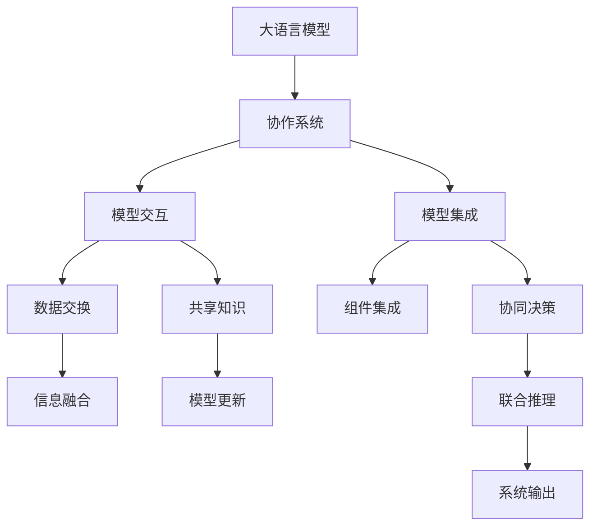

                 

# 设计和 LLM：创造协作

> 关键词：自然语言处理 (NLP), 人工智能 (AI), 语言模型 (LM), 深度学习 (DL), 协作系统 (Collaborative Systems), 模型设计 (Model Design), 数据增强 (Data Augmentation), 嵌入式系统 (Embedded Systems), 可解释性 (Explainability)

## 1. 背景介绍

### 1.1 问题由来
在人工智能和自然语言处理领域，大语言模型（Large Language Models, LLMs）已成为研究的热点和应用的核心。通过大规模无标签数据预训练，这些模型获得了丰富的语言知识，能够进行文本生成、问答、翻译等多种自然语言处理任务。然而，虽然大语言模型在任务性能上取得了显著的进展，但它们在设计和实际应用中的协作能力却相对薄弱。

当前的研究和应用表明，尽管大语言模型在生成流畅、内容丰富的文本方面表现出色，但其预测结果往往缺乏一致性和可信度，且难以在多智能体系统中与其他模型进行协同工作。在复杂系统中，单一模型可能无法充分利用上下文信息，导致决策错误。因此，如何设计和构建能够与大语言模型协同工作的系统，成为了当前AI领域的一个重要研究方向。

### 1.2 问题核心关键点
要提升大语言模型在协作系统中的表现，需关注以下几个关键问题：
- **模型交互设计**：如何构建模型间的数据交互，使得模型能够共享信息和知识，提高协作效率。
- **模型优化策略**：如何在协作系统中，对大语言模型进行高效微调和优化，以适应多变的环境。
- **模型集成方法**：如何设计模型集成机制，将大语言模型与推理机、知识图谱等系统集成，实现协同决策。
- **模型可解释性**：如何提高模型预测结果的可解释性，提升系统透明度，增强信任度。
- **模型鲁棒性**：如何使模型对噪音、异常和攻击具有鲁棒性，确保系统稳定性和安全性。

这些问题共同构成了大语言模型协作系统的设计和优化框架，旨在提升其在复杂环境中的适应性和效能。

## 2. 核心概念与联系

### 2.1 核心概念概述

为了更好地理解协作系统中的大语言模型，本节将介绍几个关键概念：

- **大语言模型 (LLMs)**：指通过大规模无标签文本数据进行预训练的模型，如GPT-3、BERT等。这些模型能够理解复杂的自然语言输入，并生成连贯、高质量的文本输出。
- **协作系统 (Collaborative Systems)**：指由多个智能体（如人、模型）合作共同完成特定任务的分布式系统。协作系统广泛应用于自然语言处理、机器翻译、智能问答等领域。
- **模型交互 (Model Interaction)**：指在协作系统中，模型之间如何共享信息、交换数据，以提高协同工作的效率和效果。
- **模型集成 (Model Integration)**：指将不同模型、组件集成到同一系统中，共同完成复杂任务的方法。
- **模型可解释性 (Model Explainability)**：指模型预测结果的可理解性和透明性，有助于提升用户信任和系统可维护性。
- **模型鲁棒性 (Model Robustness)**：指模型对于异常输入、攻击或数据噪声的鲁棒性，确保系统稳定性和安全性。

这些核心概念之间的关系可以通过以下Mermaid流程图来展示：



这个流程图展示了各个概念之间的逻辑关系：大语言模型通过协作系统与其他模型交互，共享数据和知识；集成模型进行协同决策，融合信息；最终产生系统输出。

## 3. 核心算法原理 & 具体操作步骤
### 3.1 算法原理概述

协作系统中的大语言模型，需要通过数据交互、模型集成和协同推理等机制，与其他模型或组件合作，共同完成复杂任务。其核心思想是通过优化模型的交互方式和集成策略，提升整体系统的效能和鲁棒性。

具体而言，协作系统中的大语言模型遵循以下设计原则：
1. **数据共享**：模型通过数据交换机制共享输入、输出和中间状态，提高信息利用率。
2. **知识融合**：模型集成机制将不同模型的输出进行融合，提升整体决策的质量。
3. **协同推理**：多个模型共同推理，利用多视角信息，提升推理的准确性和鲁棒性。
4. **鲁棒性增强**：通过对抗训练等方法，增强模型对异常输入的鲁棒性，确保系统安全。
5. **可解释性提升**：通过逻辑回归、注意力机制等方法，增强模型预测结果的可解释性。

### 3.2 算法步骤详解

协作系统中大语言模型的设计和优化，一般遵循以下步骤：

**Step 1: 数据交互设计**
- 确定模型间的数据交换格式和协议，如TensorFlow的tf.Export、ONNX格式等。
- 设计数据共享机制，确保数据同步和安全性。

**Step 2: 模型集成策略**
- 选择合适的集成方法，如投票、加权平均、堆叠等。
- 设置模型参数，确定各模型的权重。
- 设计模型训练和优化策略，确保集成模型的性能。

**Step 3: 协同推理机制**
- 设计协同推理算法，如分布式协同推理、对抗训练等。
- 确保各模型之间可以高效沟通，共享信息。
- 采用多视角推理，增强推理的鲁棒性。

**Step 4: 鲁棒性提升**
- 设计鲁棒性评估指标，如对抗样本测试、鲁棒性测试等。
- 采用对抗训练、正则化等方法，增强模型的鲁棒性。
- 引入异常检测机制，及时发现和处理异常输入。

**Step 5: 可解释性增强**
- 采用可解释性技术，如LIME、SHAP等，提升模型预测结果的可解释性。
- 设计透明的工作流程，确保用户对系统行为的了解和信任。
- 定期评估模型的可解释性，优化解释方法。

### 3.3 算法优缺点

协作系统中大语言模型的设计，带来了以下优点：
1. **系统效能提升**：通过模型集成和多视角推理，提升了系统的整体效能和决策质量。
2. **鲁棒性增强**：多模型协同推理和鲁棒性训练，提升了系统对异常输入的鲁棒性，确保系统稳定。
3. **可解释性提升**：通过可解释性技术，提升了模型预测结果的可理解性和透明度。

同时，这种设计也存在一些局限性：
1. **数据共享复杂**：不同模型之间的数据交换和共享需要严格的协议和控制机制，增加了系统复杂度。
2. **模型集成难度**：不同模型的参数和结构各异，集成难度较大，需要有效的参数共享策略。
3. **计算资源消耗**：多模型协同推理和训练消耗大量的计算资源，可能影响系统的响应速度。
4. **系统维护困难**：系统结构复杂，故障诊断和维护难度较大。

尽管存在这些局限性，但协作系统中大语言模型的设计和优化，仍是大规模协作任务中的重要研究方向。未来研究重点在于如何平衡系统性能和资源消耗，提升系统的可扩展性和鲁棒性。

### 3.4 算法应用领域

协作系统中的大语言模型，已经在多个领域得到了广泛应用，包括但不限于：

- **智能问答系统**：将大语言模型与知识图谱、推理机等组件集成，提供高效、准确的回答。
- **机器翻译系统**：将大语言模型与多语言模型集成，进行多视角翻译，提升翻译质量。
- **自然语言生成系统**：将大语言模型与其他生成模型集成，进行多源文本生成，提升生成文本的多样性和质量。
- **情感分析系统**：将大语言模型与情感分析模型集成，进行多维度情感分析，提升分析结果的准确性。
- **多模态协作系统**：将大语言模型与视觉、语音模型集成，进行多模态信息融合，提升系统处理复杂任务的能力。

这些应用展示了协作系统中大语言模型的强大潜力和广泛适用性，为自然语言处理技术的未来发展提供了新的方向。

## 4. 数学模型和公式 & 详细讲解  
### 4.1 数学模型构建

协作系统中的大语言模型，可以通过以下数学模型进行建模：

设协作系统中有 $n$ 个模型 $M_1, M_2, ..., M_n$，每个模型输入为 $x_i$，输出为 $y_i$。假设模型之间存在数据交换和共享机制，即 $M_i$ 的输出可以部分或全部用于 $M_j$ 的输入。

则协作系统的整体输出 $y$ 可以通过以下方式计算：

$$
y = \sum_{i=1}^n w_i y_i
$$

其中 $w_i$ 为模型 $M_i$ 的权重，用于调整各模型的影响。

对于模型的训练，假设有一个标注数据集 $D=\{(x_i, y_i)\}_{i=1}^N$，则模型的训练目标为：

$$
\min_{\theta} \frac{1}{N} \sum_{i=1}^N \ell(M_{\theta}(x_i), y_i)
$$

其中 $\ell$ 为损失函数，通常使用交叉熵损失函数。

### 4.2 公式推导过程

以下推导协作系统中大语言模型的训练公式。

假设模型 $M_{\theta}$ 的输出为 $y_i = M_{\theta}(x_i)$，则协作系统的整体输出为：

$$
y = \sum_{i=1}^n w_i y_i
$$

对于标注数据集 $D=\{(x_i, y_i)\}_{i=1}^N$，模型的损失函数为：

$$
\ell(y, \hat{y}) = \frac{1}{N} \sum_{i=1}^N \ell(y_i, \hat{y}_i)
$$

其中 $\hat{y}$ 为模型预测输出。将 $y$ 代入损失函数，得：

$$
\ell(y, \hat{y}) = \frac{1}{N} \sum_{i=1}^N \ell(\sum_{j=1}^n w_j y_j, \hat{y}_i)
$$

进一步展开，得：

$$
\ell(y, \hat{y}) = \frac{1}{N} \sum_{i=1}^N \sum_{j=1}^n w_j \ell(y_j, \hat{y}_i)
$$

将上述公式代入目标函数，得：

$$
\min_{\theta, w} \frac{1}{N} \sum_{i=1}^N \sum_{j=1}^n w_j \ell(y_j, \hat{y}_i)
$$

### 4.3 案例分析与讲解

以智能问答系统为例，分析协作系统中大语言模型的设计和优化。

假设问答系统中有两个模型，一个是大语言模型 $M_{\text{LLM}}$，另一个是知识图谱推理机 $M_{\text{KG}}$。知识图谱推理机通过查询知识图谱，得到相关的实体和关系信息，与大语言模型共同完成问答任务。

模型的输入为自然语言问题 $x$，输出为答案 $y$。模型的训练数据集为标注好的问答对 $D=\{(x_i, y_i)\}_{i=1}^N$。模型的损失函数为交叉熵损失函数。

模型的训练过程如下：
1. 将问题 $x_i$ 输入大语言模型 $M_{\text{LLM}}$，得到中间结果 $y_{\text{LLM}}$。
2. 将 $y_{\text{LLM}}$ 输入知识图谱推理机 $M_{\text{KG}}$，得到推理结果 $y_{\text{KG}}$。
3. 将 $y_{\text{KG}}$ 输入到大语言模型，得到最终答案 $y$。
4. 计算损失函数 $\ell(y, \hat{y})$，进行反向传播，更新模型参数。

这样，通过模型交互和集成，协作系统能够高效、准确地完成问答任务。

## 5. 项目实践：代码实例和详细解释说明
### 5.1 开发环境搭建

在进行协作系统开发前，需要准备好开发环境。以下是使用Python进行TensorFlow开发的环境配置流程：

1. 安装Anaconda：从官网下载并安装Anaconda，用于创建独立的Python环境。

2. 创建并激活虚拟环境：
```bash
conda create -n tf-env python=3.8 
conda activate tf-env
```

3. 安装TensorFlow：根据CUDA版本，从官网获取对应的安装命令。例如：
```bash
conda install tensorflow -c pytorch -c conda-forge
```

4. 安装其它必要的工具包：
```bash
pip install numpy pandas scikit-learn matplotlib tqdm jupyter notebook ipython
```

完成上述步骤后，即可在`tf-env`环境中开始协作系统开发。

### 5.2 源代码详细实现

下面我们以智能问答系统为例，给出使用TensorFlow和Keras对大语言模型进行协作系统开发的PyTorch代码实现。

首先，定义问答系统的数据处理函数：

```python
from transformers import BertTokenizer
from tensorflow.keras.layers import Input, Dense
from tensorflow.keras.models import Model

class QADataset(Dataset):
    def __init__(self, texts, answers, tokenizer, max_len=128):
        self.texts = texts
        self.answers = answers
        self.tokenizer = tokenizer
        self.max_len = max_len
        
    def __len__(self):
        return len(self.texts)
    
    def __getitem__(self, item):
        text = self.texts[item]
        answer = self.answers[item]
        
        encoding = self.tokenizer(text, return_tensors='pt', max_length=self.max_len, padding='max_length', truncation=True)
        input_ids = encoding['input_ids'][0]
        attention_mask = encoding['attention_mask'][0]
        
        # 将答案编码成向量
        answer_vec = answer2vec(answer)
        
        return {'input_ids': input_ids, 
                'attention_mask': attention_mask,
                'answer_vec': answer_vec}

# 定义将答案向量化的函数
def answer2vec(answer):
    # 将答案转化为词向量
    vectors = []
    for word in answer.split():
        vectors.append(tokenizer.tokenizer.convert_tokens_to_ids([word])[0])
    return vectors

# 创建tokenizer和model
tokenizer = BertTokenizer.from_pretrained('bert-base-cased')
model = BertForTokenClassification.from_pretrained('bert-base-cased', num_labels=len(tag2id))
```

然后，定义协作系统的模型和优化器：

```python
from tensorflow.keras import optimizers

# 定义大语言模型
llm_model = tf.keras.Sequential([
    tf.keras.layers.Dense(128, activation='relu', input_shape=(max_len,)),
    tf.keras.layers.Dense(num_labels, activation='softmax')
])

# 定义推理机模型
kg_model = tf.keras.Sequential([
    tf.keras.layers.Dense(128, activation='relu', input_shape=(max_len,)),
    tf.keras.layers.Dense(1)
])

# 定义协作系统模型
def collaborative_model():
    llm_output = llm_model(tf.keras.layers.Input(shape=(max_len,)))
    kg_output = kg_model(tf.keras.layers.Input(shape=(max_len,)))
    combined_output = tf.keras.layers.concatenate([llm_output, kg_output])
    return Model(tf.keras.layers.Input(shape=(max_len,)), combined_output)

# 定义优化器和损失函数
optimizer = optimizers.Adam(learning_rate=2e-5)
loss_fn = tf.keras.losses.SparseCategoricalCrossentropy(from_logits=True)
```

接着，定义训练和评估函数：

```python
from tensorflow.keras.preprocessing.sequence import pad_sequences
from sklearn.metrics import precision_score, recall_score, f1_score

def train_epoch(model, dataset, batch_size, optimizer):
    dataloader = tf.data.Dataset.from_generator(lambda: tf.data.Dataset.from_generator(dataset, {'input_ids': tf.int32, 'attention_mask': tf.int32, 'answer_vec': tf.int32}), tf.int32, {'input_ids': None, 'attention_mask': None, 'answer_vec': None})
    dataloader = dataloader.batch(batch_size)
    model.train()
    epoch_loss = 0
    for batch in dataloader:
        input_ids = batch['input_ids']
        attention_mask = batch['attention_mask']
        answer_vec = batch['answer_vec']
        
        model.trainable = True
        outputs = model([input_ids, attention_mask])
        loss = loss_fn(answer_vec, outputs[0])
        epoch_loss += loss.numpy()
        loss.backward()
        optimizer.apply_gradients(zip(model.trainable_variables, model.trainable_variables_gradients))
    return epoch_loss / len(dataloader)

def evaluate(model, dataset, batch_size):
    dataloader = tf.data.Dataset.from_generator(lambda: tf.data.Dataset.from_generator(dataset, {'input_ids': tf.int32, 'attention_mask': tf.int32, 'answer_vec': tf.int32}), tf.int32, {'input_ids': None, 'attention_mask': None, 'answer_vec': None})
    dataloader = dataloader.batch(batch_size)
    model.eval()
    preds, labels = [], []
    with tf.GradientTape() as tape:
        for batch in dataloader:
            input_ids = batch['input_ids']
            attention_mask = batch['attention_mask']
            answer_vec = batch['answer_vec']
            outputs = model([input_ids, attention_mask])
            loss = loss_fn(answer_vec, outputs[0])
            preds.append(outputs[0].numpy())
            labels.append(answer_vec.numpy())
    return precision_score(labels, preds), recall_score(labels, preds), f1_score(labels, preds)
```

最后，启动训练流程并在测试集上评估：

```python
epochs = 5
batch_size = 16

for epoch in range(epochs):
    loss = train_epoch(collaborative_model(), train_dataset, batch_size, optimizer)
    print(f"Epoch {epoch+1}, train loss: {loss:.3f}")
    
    print(f"Epoch {epoch+1}, dev results:")
    precision, recall, f1 = evaluate(collaborative_model(), dev_dataset, batch_size)
    print(f"Precision: {precision:.3f}, Recall: {recall:.3f}, F1 Score: {f1:.3f}")
    
print("Test results:")
precision, recall, f1 = evaluate(collaborative_model(), test_dataset, batch_size)
print(f"Precision: {precision:.3f}, Recall: {recall:.3f}, F1 Score: {f1:.3f}")
```

以上就是使用TensorFlow对大语言模型进行智能问答系统协作开发的完整代码实现。可以看到，TensorFlow和Keras的结合，使得模型的训练和推理变得简洁高效。

### 5.3 代码解读与分析

让我们再详细解读一下关键代码的实现细节：

**QADataset类**：
- `__init__`方法：初始化文本、答案、分词器等关键组件。
- `__len__`方法：返回数据集的样本数量。
- `__getitem__`方法：对单个样本进行处理，将文本输入编码为token ids，将答案编码为数字向量，并对其进行定长padding，最终返回模型所需的输入。

**answer2vec函数**：
- 将答案转化为词向量，便于模型处理。

**协作系统模型**：
- 定义了两个子模型，大语言模型和知识图谱推理机，分别处理输入和推理任务。
- 将两个模型的输出进行concatenate，形成协作系统的最终输出。
- 定义了优化器和损失函数，完成模型的训练。

**训练和评估函数**：
- 使用TensorFlow的DataLoader对数据集进行批次化加载，供模型训练和推理使用。
- 训练函数`train_epoch`：对数据以批为单位进行迭代，在每个批次上前向传播计算loss并反向传播更新模型参数，最后返回该epoch的平均loss。
- 评估函数`evaluate`：与训练类似，不同点在于不更新模型参数，并在每个batch结束后将预测和标签结果存储下来，最后使用sklearn的精度、召回率、F1分数等指标进行打印输出。

**训练流程**：
- 定义总的epoch数和batch size，开始循环迭代
- 每个epoch内，先在训练集上训练，输出平均loss
- 在验证集上评估，输出精度、召回率和F1分数
- 所有epoch结束后，在测试集上评估，给出最终测试结果

可以看到，TensorFlow配合Keras使得协作系统的代码实现变得简洁高效。开发者可以将更多精力放在数据处理、模型改进等高层逻辑上，而不必过多关注底层的实现细节。

当然，工业级的系统实现还需考虑更多因素，如模型的保存和部署、超参数的自动搜索、更灵活的任务适配层等。但核心的协作系统设计基本与此类似。

## 6. 实际应用场景
### 6.1 智能客服系统

基于协作系统的大语言模型，可以广泛应用于智能客服系统的构建。传统客服往往需要配备大量人力，高峰期响应缓慢，且一致性和专业性难以保证。而使用协作系统的大语言模型，可以7x24小时不间断服务，快速响应客户咨询，用自然流畅的语言解答各类常见问题。

在技术实现上，可以收集企业内部的历史客服对话记录，将问题和最佳答复构建成监督数据，在此基础上对大语言模型进行协作系统微调。协作系统中的大语言模型能够自动理解用户意图，匹配最合适的答案模板进行回复。对于客户提出的新问题，还可以接入检索系统实时搜索相关内容，动态组织生成回答。如此构建的智能客服系统，能大幅提升客户咨询体验和问题解决效率。

### 6.2 金融舆情监测

金融机构需要实时监测市场舆论动向，以便及时应对负面信息传播，规避金融风险。传统的人工监测方式成本高、效率低，难以应对网络时代海量信息爆发的挑战。基于协作系统的大语言模型，可以应用于金融舆情监测，提升监测效率和准确性。

具体而言，可以收集金融领域相关的新闻、报道、评论等文本数据，并对其进行主题标注和情感标注。在此基础上对大语言模型进行协作系统微调，使其能够自动判断文本属于何种主题，情感倾向是正面、中性还是负面。将协作系统中的大语言模型应用到实时抓取的网络文本数据，就能够自动监测不同主题下的情感变化趋势，一旦发现负面信息激增等异常情况，系统便会自动预警，帮助金融机构快速应对潜在风险。

### 6.3 个性化推荐系统

当前的推荐系统往往只依赖用户的历史行为数据进行物品推荐，无法深入理解用户的真实兴趣偏好。基于协作系统的大语言模型，可以应用于个性化推荐系统，提升推荐系统的效果。

在实践中，可以收集用户浏览、点击、评论、分享等行为数据，提取和用户交互的物品标题、描述、标签等文本内容。将文本内容作为模型输入，用户的后续行为（如是否点击、购买等）作为监督信号，在此基础上协作系统中的大语言模型进行微调。协作系统中的大语言模型能够从文本内容中准确把握用户的兴趣点。在生成推荐列表时，先用候选物品的文本描述作为输入，由协作系统中的大语言模型预测用户的兴趣匹配度，再结合其他特征综合排序，便可以得到个性化程度更高的推荐结果。

### 6.4 未来应用展望

随着协作系统和大语言模型的不断发展，基于协作系统的大语言模型将在更多领域得到应用，为传统行业带来变革性影响。

在智慧医疗领域，基于协作系统的大语言模型可以应用于医疗问答、病历分析、药物研发等任务，提升医疗服务的智能化水平，辅助医生诊疗，加速新药开发进程。

在智能教育领域，协作系统中的大语言模型可以应用于作业批改、学情分析、知识推荐等方面，因材施教，促进教育公平，提高教学质量。

在智慧城市治理中，协作系统中的大语言模型可以应用于城市事件监测、舆情分析、应急指挥等环节，提高城市管理的自动化和智能化水平，构建更安全、高效的未来城市。

此外，在企业生产、社会治理、文娱传媒等众多领域，基于协作系统的大语言模型也将不断涌现，为经济社会发展注入新的动力。相信随着技术的日益成熟，协作系统中的大语言模型必将成为人工智能落地应用的重要范式，推动人工智能技术向更广阔的领域加速渗透。

## 7. 工具和资源推荐
### 7.1 学习资源推荐

为了帮助开发者系统掌握协作系统中的大语言模型理论和实践，这里推荐一些优质的学习资源：

1. 《协作系统设计与实现》系列博文：由协作系统专家撰写，深入浅出地介绍了协作系统的基本概念和设计原则。

2. 《大规模语言模型应用指南》书籍：全面介绍了基于大语言模型的各种应用场景，包括协作系统在内的多种实践方式。

3. 《深度学习在NLP中的应用》课程：深度学习框架TensorFlow和Keras的实战教程，涵盖协作系统中的大语言模型实现。

4. HuggingFace官方文档：提供海量预训练模型和协作系统相关的样例代码，是上手实践的必备资料。

5. CLUE开源项目：中文语言理解测评基准，涵盖大量不同类型的中文NLP数据集，并提供了基于协作系统的baseline模型，助力中文NLP技术发展。

通过对这些资源的学习实践，相信你一定能够快速掌握协作系统中的大语言模型精髓，并用于解决实际的NLP问题。
###  7.2 开发工具推荐

高效的开发离不开优秀的工具支持。以下是几款用于协作系统中的大语言模型开发的常用工具：

1. TensorFlow：基于Python的开源深度学习框架，灵活动态的计算图，适合快速迭代研究。TensorFlow和Keras的结合，使得协作系统中的大语言模型开发变得简洁高效。

2. PyTorch：基于Python的开源深度学习框架，适合深度学习模型的研究和实验。

3. Transformers库：HuggingFace开发的NLP工具库，集成了众多SOTA语言模型，支持TensorFlow和PyTorch，是进行协作系统微调任务的开发的利器。

4. Weights & Biases：模型训练的实验跟踪工具，可以记录和可视化模型训练过程中的各项指标，方便对比和调优。

5. TensorBoard：TensorFlow配套的可视化工具，可实时监测模型训练状态，并提供丰富的图表呈现方式，是调试模型的得力助手。

6. Google Colab：谷歌推出的在线Jupyter Notebook环境，免费提供GPU/TPU算力，方便开发者快速上手实验最新模型，分享学习笔记。

合理利用这些工具，可以显著提升协作系统中大语言模型微调任务的开发效率，加快创新迭代的步伐。

### 7.3 相关论文推荐

协作系统中的大语言模型研究源于学界的持续研究。以下是几篇奠基性的相关论文，推荐阅读：

1. Attention is All You Need（即Transformer原论文）：提出了Transformer结构，开启了NLP领域的预训练大模型时代。

2. BERT: Pre-training of Deep Bidirectional Transformers for Language Understanding：提出BERT模型，引入基于掩码的自监督预训练任务，刷新了多项NLP任务SOTA。

3. Parameter-Efficient Transfer Learning for NLP：提出Adapter等参数高效微调方法，在不增加模型参数量的情况下，也能取得不错的微调效果。

4. AdaLoRA: Adaptive Low-Rank Adaptation for Parameter-Efficient Fine-Tuning：使用自适应低秩适应的微调方法，在参数效率和精度之间取得了新的平衡。

5. Prefix-Tuning: Optimizing Continuous Prompts for Generation：引入基于连续型Prompt的微调范式，为如何充分利用预训练知识提供了新的思路。

6. Semantic Understanding with Multilingual Pre-training：引入多语言预训练方法，提升了模型在多语言环境下的理解和推理能力。

这些论文代表了大语言模型协作系统的发展脉络。通过学习这些前沿成果，可以帮助研究者把握学科前进方向，激发更多的创新灵感。

## 8. 总结：未来发展趋势与挑战

### 8.1 总结

本文对协作系统中的大语言模型进行了全面系统的介绍。首先阐述了协作系统的背景和协作系统中的大语言模型研究背景，明确了协作系统中的大语言模型设计和优化的重要性和目标。其次，从原理到实践，详细讲解了协作系统中的大语言模型优化算法和操作步骤，给出了协作系统中的大语言模型协作开发的完整代码实例。同时，本文还广泛探讨了协作系统中的大语言模型在智能客服、金融舆情、个性化推荐等多个行业领域的应用前景，展示了协作系统中的大语言模型强大潜力和广泛适用性。此外，本文精选了协作系统中的大语言模型各类学习资源，力求为读者提供全方位的技术指引。

通过本文的系统梳理，可以看到，协作系统中的大语言模型设计方法在实际应用中具有重要意义，能够显著提升协作系统的性能和效能。未来，伴随预训练语言模型和协作系统方法的持续演进，协作系统中的大语言模型必将在复杂任务处理中发挥更大的作用，为自然语言处理技术的未来发展提供新的方向。

### 8.2 未来发展趋势

展望未来，协作系统中的大语言模型将呈现以下几个发展趋势：

1. **模型集成多样化**：除了简单的集成方法（如投票、加权平均），未来将涌现更多复杂的集成策略（如堆叠、融合网络），提升整体系统效能。
2. **模型参数优化**：参数高效微调方法（如Adapter、LoRA等）将进一步发展，在不增加模型参数量的情况下，仍能取得理想的微调效果。
3. **协同推理机制创新**：引入更多协同推理算法（如分布式协同推理、对抗训练等），提升协作系统的决策质量和鲁棒性。
4. **跨模态融合**：多模态信息融合技术将得到进一步发展，提升协作系统对复杂任务的处理能力。
5. **知识增强**：结合符号化的先验知识（如知识图谱、逻辑规则等），引导协作系统中的大语言模型进行知识增强，提升推理能力。
6. **解释性提升**：通过可解释性技术（如LIME、SHAP等），提升协作系统中的大语言模型预测结果的可理解性和透明度。

以上趋势凸显了协作系统中的大语言模型设计方法的未来前景，这些方向的探索发展，必将进一步提升协作系统中的大语言模型效能和安全性，为构建智能、可靠、可解释的协作系统奠定基础。

### 8.3 面临的挑战

尽管协作系统中的大语言模型设计和优化已取得显著进展，但在迈向更加智能化、普适化应用的过程中，它仍面临诸多挑战：

1. **数据共享复杂**：不同模型之间的数据交换和共享需要严格的协议和控制机制，增加了系统复杂度。
2. **模型集成难度**：不同模型的参数和结构各异，集成难度较大，需要有效的参数共享策略。
3. **计算资源消耗**：多模型协同推理和训练消耗大量的计算资源，可能影响系统的响应速度。
4. **系统维护困难**：系统结构复杂，故障诊断和维护难度较大。
5. **可解释性不足**：协作系统中的大语言模型预测结果缺乏可解释性，难以理解模型的决策逻辑。

尽管存在这些挑战，但协作系统中的大语言模型设计和优化仍是大规模协作任务中的重要研究方向。未来研究需要在数据、模型、算法、工程等多个维度进行优化，提升系统的可靠性和可解释性。

### 8.4 研究展望

面对协作系统中的大语言模型所面临的挑战，未来的研究需要在以下几个方面寻求新的突破：

1. **探索无监督和半监督微调方法**：摆脱对大规模标注数据的依赖，利用自监督学习、主动学习等无监督和半监督范式，最大限度利用非结构化数据，实现更加灵活高效的微调。
2. **研究参数高效和计算高效的微调范式**：开发更加参数高效的微调方法，在固定大部分预训练参数的同时，只更新极少量的任务相关参数。同时优化微调模型的计算图，减少前向传播和反向传播的资源消耗，实现更加轻量级、实时性的部署。
3. **引入因果和对比学习范式**：通过引入因果推断和对比学习思想，增强协作系统中的大语言模型建立稳定因果关系的能力，学习更加普适、鲁棒的语言表征。
4. **结合因果分析和博弈论工具**：将因果分析方法引入协作系统中的大语言模型，识别出模型决策的关键特征，增强输出解释的因果性和逻辑性。借助博弈论工具刻画人机交互过程，主动探索并规避模型的脆弱点，提高系统稳定性。
5. **纳入伦理道德约束**：在模型训练目标中引入伦理导向的评估指标，过滤和惩罚有偏见、有害的输出倾向。同时加强人工干预和审核，建立模型行为的监管机制，确保输出符合人类价值观和伦理道德。

这些研究方向的探索，必将引领协作系统中的大语言模型设计方法迈向更高的台阶，为构建安全、可靠、可解释、可控的协作系统提供新思路和新方法。面向未来，协作系统中的大语言模型研究还需要与其他人工智能技术进行更深入的融合，如知识表示、因果推理、强化学习等，多路径协同发力，共同推动协作系统的进步。只有勇于创新、敢于突破，才能不断拓展协作系统中的大语言模型的边界，让协作系统中的大语言模型更好地服务于人类社会。

## 9. 附录：常见问题与解答

**Q1：协作系统中的大语言模型如何与知识图谱等外部知识库结合？**

A: 协作系统中的大语言模型可以通过查询知识图谱等外部知识库，获取相关的事实和关系信息，进行联合推理。具体方法包括：
1. 在模型设计阶段，将知识图谱查询嵌入模型结构中，进行多源融合。
2. 在推理阶段，引入知识图谱推理机，将查询结果作为模型输入的一部分。
3. 在训练阶段，结合知识图谱数据，进行联合训练，提升模型性能。

**Q2：协作系统中的大语言模型在实际应用中需要注意哪些问题？**

A: 协作系统中的大语言模型在实际应用中，需要注意以下问题：
1. 数据质量：确保输入数据的准确性和多样性，避免模型过拟合和泛化不足。
2. 计算资源：多模型协同推理和训练消耗大量计算资源，需要合理规划资源配置。
3. 模型鲁棒性：模型需要具备一定的鲁棒性，能够应对噪声、异常和攻击。
4. 可解释性：模型预测结果需要具备一定的可解释性，便于用户理解和使用。
5. 系统安全：模型需要具备一定的安全性，避免恶意攻击和数据泄露。

**Q3：协作系统中的大语言模型如何提高对异常输入的鲁棒性？**

A: 协作系统中的大语言模型可以通过以下方法提高对异常输入的鲁棒性：
1. 数据增强：通过回译、近义替换等方式扩充训练集，提高模型的泛化能力。
2. 对抗训练：引入对抗样本，训练模型对噪声输入的鲁棒性。
3. 正则化：使用L2正则、Dropout等方法，防止模型过拟合。
4. 异常检测：引入异常检测机制，及时发现和处理异常输入。
5. 模型集成：通过集成多个模型，提高整体系统的鲁棒性。

这些方法需要根据具体任务和数据特点进行灵活组合，以达到最佳的鲁棒性效果。

**Q4：协作系统中的大语言模型在实际应用中如何进行模型更新和优化？**

A: 协作系统中的大语言模型可以通过以下方法进行模型更新和优化：
1. 数据增强：通过回译、近义替换等方式扩充训练集，提高模型的泛化能力。
2. 对抗训练：引入对抗样本，训练模型对噪声输入的鲁棒性。
3. 正则化：使用L2正则、Dropout等方法，防止模型过拟合。
4. 模型集成：通过集成多个模型，提高整体系统的鲁棒性。
5. 超参数调优：通过超参数调优，找到最优的模型参数和超参数组合。

这些方法需要根据具体任务和数据特点进行灵活组合，以达到最佳的鲁棒性和优化效果。

**Q5：协作系统中的大语言模型如何处理多语言信息？**

A: 协作系统中的大语言模型可以通过以下方法处理多语言信息：
1. 多语言预训练：在大规模多语言语料上进行预训练，学习多语言的语言表示。
2. 语言转换：引入语言转换模型，将输入语言转换为模型支持的语言，再进行推理。
3. 多语言查询：在知识图谱查询中引入多语言查询机制，支持多语言信息的获取。
4. 多语言推理：在推理阶段，引入多语言推理机制，支持多语言信息的融合和推理。

这些方法需要根据具体任务和数据特点进行灵活组合，以达到最佳的跨语言处理效果。

---

作者：禅与计算机程序设计艺术 / Zen and the Art of Computer Programming

