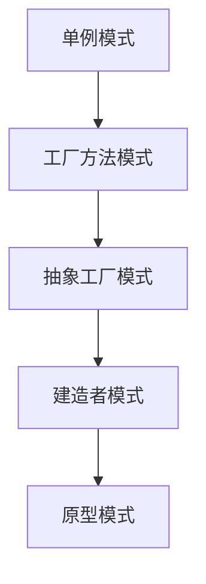

                 

## 1. 背景介绍

软件设计模式是一套被广泛接受的最佳实践，帮助软件开发者解决软件开发过程中常见的问题。它们是软件开发的基石，是设计软件时必须掌握的基本技巧。设计模式可以降低开发成本，提高代码的可维护性和可重用性。

### 1.1 问题由来

在软件开发的长期实践中，人们逐渐发现了一些常见的、反复出现的设计问题。比如如何处理对象间的关系，如何管理资源的生命周期，如何处理复杂的业务逻辑等。为了解决这些问题，一些通用的设计模式被提出来，并且被广泛应用。设计模式不仅可以解决具体问题，还可以为后续的设计提供参考和指导。

### 1.2 问题核心关键点

设计模式的核心在于将问题抽象成一套标准化的解决方案，使问题解决思路具有通用性、可复用性和可扩展性。常见的设计模式分为三大类：创建型（Creational）、结构型（Structural）和行为型（Behavioral）模式。每种模式都有其适用的场景和限制条件，需要根据具体问题选择。

## 2. 核心概念与联系

### 2.1 核心概念概述

设计模式是一种被验证过的、通用的问题解决方案，包括创建型模式、结构型模式和行为型模式。以下是三种常见模式的概述：

- **创建型模式（Creational Patterns）**：专注于对象的创建方式，通过使用对象创建抽象来避免暴露系统如何创建对象，提供了一种更好的灵活性和可复用性。
- **结构型模式（Structural Patterns）**：通过构建组合对象的方式来提高类之间的耦合性。这些模式可以描述类、接口和用例如何组合在一起，形成更大的结构。
- **行为型模式（Behavioral Patterns）**：描述对象之间的交互方式，通过定义对象之间的通信机制来提高系统的灵活性。

### 2.2 核心概念原理和架构的 Mermaid 流程图

以下是一个基于创建型模式的 Mermaid 流程图，展示其工作原理：



## 3. 核心算法原理 & 具体操作步骤

### 3.1 算法原理概述

设计模式的核心原理是“将问题抽象成一套标准化的解决方案”。通过将复杂的问题分解成多个小的、可复用的模块，使得系统的设计和实现更加灵活和可维护。

设计模式的构建通常包括以下步骤：

1. **问题描述**：描述需要解决的问题和场景。
2. **解决方案**：提出一个或多个解决方案。
3. **模式描述**：详细描述该模式的工作原理和实现方式。
4. **应用场景**：列出该模式适用的场景和限制条件。
5. **优点和缺点**：列出该模式的优点和缺点。

### 3.2 算法步骤详解

以下是一个简单的单例模式的算法步骤详解：

```
// 单例模式步骤：
1. 定义一个私有的静态成员变量用于存储实例。
2. 提供一个私有的构造函数，限制对象的创建。
3. 提供一个静态方法，返回单例对象的实例。
4. 在程序中使用该单例对象。
```

### 3.3 算法优缺点

单例模式的优点包括：

- 单例模式可以确保对象实例的唯一性。
- 单例模式可以减少系统对对象的依赖关系。
- 单例模式可以提高系统的性能，减少系统开销。

单例模式的缺点包括：

- 单例模式可能会导致全局状态单点，影响系统的可测试性。
- 单例模式不适用于多线程环境。

### 3.4 算法应用领域

设计模式可以应用于各种软件开发场景，包括但不限于以下领域：

- 游戏开发：通过使用单例模式，可以确保游戏对象的唯一性。
- Web开发：使用原型模式，可以快速创建和复制页面对象。
- 数据库开发：使用工厂方法模式，可以动态创建数据库连接对象。
- 企业应用：使用观察者模式，可以实现事件驱动的业务逻辑。

## 4. 数学模型和公式 & 详细讲解 & 举例说明

### 4.1 数学模型构建

设计模式不需要数学模型，因为它们是面向对象的解决方案，而不是数学问题。设计模式的设计原则包括：单一职责原则（SRP）、开放封闭原则（OCP）、里氏替换原则（LSP）、依赖倒置原则（DIP）和接口隔离原则（ISP）。

### 4.2 公式推导过程

设计模式不涉及数学公式，因此无需推导过程。但设计原则可以通过数学公式来描述，例如：

- 单例模式的实现可以使用数学公式来表示：$S = s$，其中 $S$ 表示单例对象，$s$ 表示单例对象的实例。
- 工厂方法模式的实现可以使用数学公式来表示：$P = f(O)$，其中 $P$ 表示产品对象，$f$ 表示工厂方法，$O$ 表示产品对象的参数。

### 4.3 案例分析与讲解

以下是一个工厂方法模式的案例分析：

```java
public class ShapeFactory {
    public Shape getShape(String shapeType) {
        if (shapeType.equalsIgnoreCase("CIRCLE")) {
            return new Circle();
        } else if (shapeType.equalsIgnoreCase("RECTANGLE")) {
            return new Rectangle();
        } else {
            return null;
        }
    }
}

public class Shape {
    public void draw() {
        System.out.println("Drawing a shape");
    }
}

public class Circle extends Shape {
    public void draw() {
        System.out.println("Drawing a circle");
    }
}

public class Rectangle extends Shape {
    public void draw() {
        System.out.println("Drawing a rectangle");
    }
}
```

在这个例子中，`ShapeFactory` 工厂方法模式根据传入的 `shapeType` 参数，创建不同类型的 `Shape` 对象。这样，我们可以动态地创建不同类型的形状对象，而不需要在代码中直接创建对象。

## 5. 项目实践：代码实例和详细解释说明

### 5.1 开发环境搭建

在进行设计模式项目实践前，需要先准备好开发环境。以下是使用Java进行项目开发的环境配置流程：

1. 安装Java Development Kit（JDK）。
2. 安装Maven或Gradle构建工具。
3. 安装Eclipse或IntelliJ IDEA集成开发环境。

### 5.2 源代码详细实现

以下是一个使用单例模式的Java代码实现：

```java
public class Singleton {
    private static Singleton instance;

    private Singleton() {}

    public static Singleton getInstance() {
        if (instance == null) {
            instance = new Singleton();
        }
        return instance;
    }

    public void doSomething() {
        System.out.println("Doing something");
    }
}
```

### 5.3 代码解读与分析

在单例模式中，我们使用一个私有的静态变量 `instance` 来存储实例。由于构造函数是私有的，因此其他类无法直接创建 `Singleton` 对象。`getInstance` 方法用于获取实例，如果实例不存在，则创建实例并返回。`doSomething` 方法用于表示对象的行为。

### 5.4 运行结果展示

```
Doing something
```

## 6. 实际应用场景

### 6.1 游戏开发

在游戏开发中，单例模式经常被用于管理游戏对象。例如，我们可以使用单例模式来管理游戏场景、角色、道具等对象。这样可以确保对象的唯一性，避免重复创建对象。

### 6.2 Web开发

在Web开发中，原型模式被广泛应用。例如，我们可以使用原型模式来动态创建和复制页面对象，从而实现动态网页生成。

### 6.3 数据库开发

在数据库开发中，工厂方法模式被广泛应用。例如，我们可以使用工厂方法模式来动态创建数据库连接对象，从而简化数据库连接的管理。

### 6.4 企业应用

在企业应用中，观察者模式被广泛应用。例如，我们可以使用观察者模式来实现事件驱动的业务逻辑，从而简化系统的设计和实现。

## 7. 工具和资源推荐

### 7.1 学习资源推荐

1. 《Design Patterns: Elements of Reusable Object-Oriented Software》书籍：这是设计模式的经典之作，详细介绍了23种设计模式的实现原理和应用场景。
2. 《Head First Design Patterns》书籍：这是一本面向初学者的设计模式入门书籍，以图形和实例的方式介绍了多种设计模式。
3. 《Pattern-Oriented Software Design Patterns》书籍：这是设计模式的经典之作，涵盖多种设计模式的实现细节和优缺点。

### 7.2 开发工具推荐

1. Eclipse IDE：这是一个流行的Java集成开发环境，支持多种设计模式的实现。
2. IntelliJ IDEA IDE：这是另一个流行的Java集成开发环境，支持多种设计模式的实现。
3. Visual Studio：这是一个跨平台的开发环境，支持多种设计模式的实现。

### 7.3 相关论文推荐

1. 《Design Patterns》论文：这是设计模式的奠基之作，详细介绍了多种设计模式的实现原理和应用场景。
2. 《Reusability: Patterns in Design》论文：这是一篇关于设计模式可复用性的研究论文，探讨了设计模式在软件开发中的作用。
3. 《Design Patterns and Design Principle in Software Development》论文：这是一篇关于设计模式和设计原则的研究论文，探讨了设计模式在软件开发中的应用。

## 8. 总结：未来发展趋势与挑战

### 8.1 研究成果总结

设计模式作为一种通用的问题解决方案，已经被广泛应用于软件开发中。它们不仅有助于解决具体问题，还可以提高系统的可维护性和可扩展性。设计模式的研究不断深入，新的模式和技术也在不断涌现。

### 8.2 未来发展趋势

未来设计模式的发展趋势包括：

- 更多的模式将被引入：随着软件开发的不断发展，新的设计模式将会被引入，以解决新的问题。
- 模式的组合应用：多种设计模式可以被组合应用，以实现更复杂的功能。
- 模式的自动化：设计模式的应用将变得更加自动化，降低开发成本。
- 模式的跨平台应用：设计模式将适用于更多种类的平台，如移动端、Web端等。

### 8.3 面临的挑战

设计模式在应用过程中也面临一些挑战：

- 模式的应用需要一定的经验：设计模式需要开发者具有一定的经验和知识。
- 模式的灵活性不足：设计模式在某些场景下可能不够灵活，需要结合具体问题进行调整。
- 模式的可复用性问题：设计模式在某些场景下可能存在可复用性不足的问题。

### 8.4 研究展望

未来的设计模式研究将更加注重以下几个方面：

- 模式的应用场景分析：设计模式的研究将更加注重模式的应用场景和限制条件。
- 模式的可复用性研究：设计模式的研究将更加注重模式的可复用性问题。
- 模式的自动化应用：设计模式的研究将更加注重模式的自动化应用，降低开发成本。
- 模式的新颖性研究：设计模式的研究将更加注重模式的新颖性问题，探索新的设计模式。

## 9. 附录：常见问题与解答

**Q1: 如何选择合适的设计模式？**

A: 选择合适的设计模式需要根据具体问题进行分析和评估。可以参考设计模式的优缺点和应用场景，结合实际情况进行决策。

**Q2: 设计模式是否适用于所有场景？**

A: 设计模式适用于大多数场景，但并非所有问题都有对应的设计模式。需要根据具体情况进行分析和设计。

**Q3: 设计模式如何与其他模式组合应用？**

A: 设计模式可以组合应用，以实现更复杂的功能。需要根据具体问题进行分析和设计。

**Q4: 如何提高设计模式的可复用性？**

A: 提高设计模式的可复用性需要考虑多个方面，如设计原则的应用、模式的自动化应用等。需要根据具体问题进行分析和设计。

**Q5: 如何应对设计模式中的问题？**

A: 设计模式中存在一些问题，如灵活性不足、可复用性不足等。需要根据具体问题进行分析和设计，结合实际应用场景进行调整。

---

作者：禅与计算机程序设计艺术 / Zen and the Art of Computer Programming

