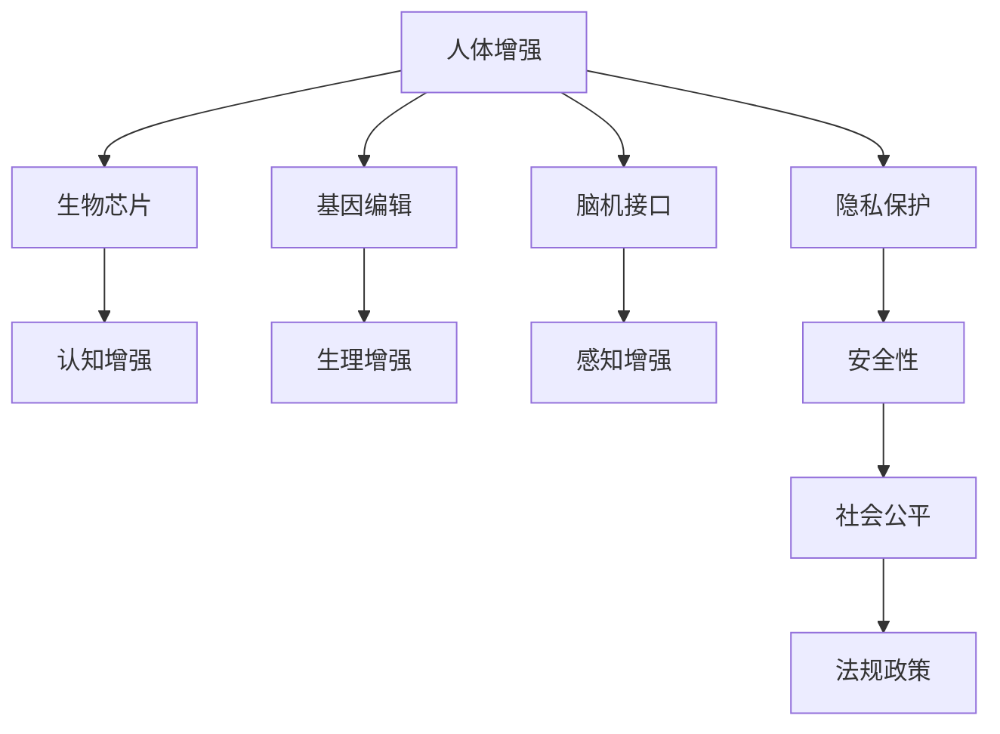

                 

# AI时代的人类增强：身体增强与道德考虑

> 关键词：AI增强, 人体增强, 生物技术, 伦理道德, 社会影响, 安全性, 法规政策

## 1. 背景介绍

### 1.1 问题由来

随着人工智能技术的飞速发展，人们对于利用AI技术提升自身能力的期待也越来越高。人体增强（Human Augmentation）作为AI时代的一大热点，旨在通过生物技术和AI手段提升人类物理、认知和感知能力，从而在竞争日益激烈的世界中占据优势。从最早的药物辅助到现如今的生物芯片、脑机接口，身体增强技术正不断涌现，有望在未来改变人类生产和生活方式。

然而，身体增强技术的发展同样伴随着诸多伦理道德问题。诸如隐私保护、安全性、社会公平等议题引发了广泛讨论。如何在推动技术进步的同时，兼顾伦理道德规范，确保技术应用的良性发展，是当前亟待解决的问题。

### 1.2 问题核心关键点

身体增强技术的主要核心关键点包括以下几个方面：

- **技术原理**：理解身体增强技术的实现机制，包括药物辅助、基因编辑、脑机接口等。
- **伦理道德**：探讨身体增强技术可能引发的伦理问题，如隐私保护、安全性、社会公平等。
- **法律政策**：分析不同国家和地区对于身体增强技术的法律政策及其影响。
- **社会影响**：评估身体增强技术对社会结构、就业市场、人机关系等各方面的影响。

这些关键点共同构成了身体增强技术的研究框架，帮助我们更全面地理解这一领域的发展和挑战。

## 2. 核心概念与联系

### 2.1 核心概念概述

为更好地理解身体增强技术，本节将介绍几个密切相关的核心概念：

- **人体增强(Human Augmentation)**：通过生物技术和AI手段提升人类物理、认知和感知能力，涵盖药物辅助、基因编辑、脑机接口等多个层面。
- **生物芯片(Biological Chips)**：植入人体内部的微型电子设备，用于增强认知、感知等能力。
- **基因编辑(Genetic Editing)**：通过CRISPR等技术，直接修改人体基因序列，以增强或修复生理功能。
- **脑机接口(Brain-Computer Interface, BCI)**：通过脑电信号解码，实现人脑与机器之间的直接信息交换。
- **隐私保护(Privacy Protection)**：保护用户个人数据不被滥用，确保技术应用的公平性和安全性。
- **安全性(Safety)**：确保身体增强技术不会对人体造成伤害，维护用户的生命安全和健康。
- **社会公平(Social Fairness)**：关注技术应用带来的社会不平等问题，确保所有社会成员都能公平受益。
- **法规政策(Regulatory Policy)**：通过立法和监管，确保技术应用的合法性和合规性。

这些核心概念之间的逻辑关系可以通过以下Mermaid流程图来展示：



这个流程图展示出人体增强技术的核心概念及其之间的关系：

1. 人体增强技术通过生物芯片、基因编辑、脑机接口等多种手段实现。
2. 这些技术可以增强人类的认知、感知等能力。
3. 在技术实现过程中，隐私保护、安全性、社会公平等伦理道德问题需予以关注。
4. 法规政策对技术应用的合法性和合规性起到监督作用。

## 3. 核心算法原理 & 具体操作步骤
### 3.1 算法原理概述

身体增强技术中的算法原理多种多样，涉及到基因编辑、脑电信号处理、药物辅助等多个方面。以下以生物芯片为例，简要概述其基本算法原理。

生物芯片技术利用微电子技术，将微型电子器件植入人体特定部位，通过刺激神经元、调节激素分泌等手段，提升人体的认知、感知和运动能力。其主要算法原理包括：

- **神经调节算法**：通过电脉冲刺激神经元，增强神经元活性，从而提升认知能力。
- **激素调节算法**：通过模拟激素分泌，调节人体内部生理平衡，增强体力和耐力。
- **运动控制算法**：通过实时监测肌肉运动信号，辅助运动训练，提升运动技能。

### 3.2 算法步骤详解

以脑机接口为例，其基本算法步骤包括：

1. **数据采集**：通过头皮电极等设备，采集用户脑电信号。
2. **信号预处理**：对采集到的信号进行滤波、降噪等预处理。
3. **特征提取**：提取脑电信号中的有用特征，如频率、波幅等。
4. **分类与解码**：通过机器学习算法，对提取的特征进行分类和解码，识别用户意图。
5. **控制反馈**：根据解码结果，控制外部设备，如机械手、假肢等，执行用户指令。

### 3.3 算法优缺点

身体增强技术的算法有以下优缺点：

**优点**：
- **提升能力**：通过基因编辑、神经调节等手段，可以显著提升人类的认知、感知和运动能力。
- **应用广泛**：适用于多种身体增强需求，如认知训练、运动辅助、情绪调节等。
- **可控性强**：通过算法优化，可以灵活调整增强效果，实现个性化的增强体验。

**缺点**：
- **技术复杂**：涉及多学科知识，技术实现难度大。
- **安全性风险**：植入设备可能引发感染、排异等风险。
- **伦理争议**：涉及隐私保护、社会公平等伦理问题，需审慎对待。

### 3.4 算法应用领域

身体增强技术在多个领域都有广泛的应用，具体包括：

- **医疗**：通过基因编辑技术，治疗遗传性疾病；利用脑机接口技术，辅助康复训练。
- **教育**：通过生物芯片和认知增强技术，提升学生的学习能力和专注度。
- **运动**：通过运动控制算法，增强运动员的运动表现和训练效果。
- **娱乐**：通过脑机接口和虚拟现实技术，提供沉浸式游戏和虚拟体验。

这些应用展示了身体增强技术的广阔前景和潜力，为不同领域的用户提供了新的解决方案。

## 4. 数学模型和公式 & 详细讲解 & 举例说明（备注：数学公式请使用latex格式，latex嵌入文中独立段落使用 $$，段落内使用 $)
### 4.1 数学模型构建

以脑机接口的信号分类算法为例，其数学模型构建包括以下几个步骤：

1. **特征提取**：将脑电信号转换为时频特征，如功率谱密度、相位同步等。
2. **特征选择**：通过PCA、LDA等方法，选择最有用的特征。
3. **分类算法**：利用SVM、RBF等机器学习算法，对提取的特征进行分类。
4. **性能评估**：通过准确率、召回率、F1分数等指标，评估分类算法的性能。

### 4.2 公式推导过程

以SVM分类算法为例，其基本公式推导如下：

$$
\begin{aligned}
\min_{\mathbf{w}, b} &\frac{1}{2}\|\mathbf{w}\|^2 + C\sum_{i=1}^{N}\xi_i \\
\text{subject to } &y_i(\mathbf{w}^T\mathbf{x}_i + b) \geq 1 - \xi_i, \quad \forall i \in \{1,...,N\} \\
&\xi_i \geq 0, \quad \forall i \in \{1,...,N\}
\end{aligned}
$$

其中，$\mathbf{w}$ 和 $b$ 为分类器的参数，$C$ 为正则化参数，$\xi_i$ 为松弛变量，$y_i$ 和 $\mathbf{x}_i$ 分别为样本的类别和特征向量。

通过求解上述优化问题，可以找到最优的分类超平面，实现对脑电信号的有效分类。

### 4.3 案例分析与讲解

以“AlphaGo”为例，分析其背后的数学模型和算法原理。AlphaGo通过深度学习算法，通过蒙特卡罗树搜索等技术，实现了在围棋领域的超人类表现。其基本数学模型和算法如下：

1. **策略网络**：通过卷积神经网络，学习围棋棋局状态的胜率。
2. **价值网络**：通过深度神经网络，预测当前位置的最终胜率。
3. **蒙特卡罗树搜索**：通过树搜索算法，在所有可能的下法中寻找最优策略。

AlphaGo的成功展示了深度学习和强化学习在复杂博弈问题上的巨大潜力，为身体增强技术提供了新的研究方向。

## 5. 项目实践：代码实例和详细解释说明
### 5.1 开发环境搭建

在进行身体增强技术项目实践前，我们需要准备好开发环境。以下是使用Python进行深度学习开发的环境配置流程：

1. 安装Anaconda：从官网下载并安装Anaconda，用于创建独立的Python环境。

2. 创建并激活虚拟环境：
```bash
conda create -n pytorch-env python=3.8 
conda activate pytorch-env
```

3. 安装PyTorch：根据CUDA版本，从官网获取对应的安装命令。例如：
```bash
conda install pytorch torchvision torchaudio cudatoolkit=11.1 -c pytorch -c conda-forge
```

4. 安装TensorFlow：使用pip或conda安装TensorFlow，以满足深度学习模型的开发需求。

5. 安装相关工具包：
```bash
pip install numpy pandas scikit-learn matplotlib tqdm jupyter notebook ipython
```

完成上述步骤后，即可在`pytorch-env`环境中开始项目实践。

### 5.2 源代码详细实现

这里我们以脑机接口信号分类为例，给出使用TensorFlow实现基本算法的代码实现。

```python
import tensorflow as tf
from sklearn.datasets import load_breast_cancer
from sklearn.model_selection import train_test_split
from sklearn.preprocessing import StandardScaler

# 加载数据集
data = load_breast_cancer()
X, y = data.data, data.target

# 划分训练集和测试集
X_train, X_test, y_train, y_test = train_test_split(X, y, test_size=0.2)

# 标准化数据
scaler = StandardScaler()
X_train = scaler.fit_transform(X_train)
X_test = scaler.transform(X_test)

# 定义模型
model = tf.keras.Sequential([
    tf.keras.layers.Dense(64, activation='relu', input_shape=(30,)),
    tf.keras.layers.Dense(1, activation='sigmoid')
])

# 编译模型
model.compile(optimizer='adam', loss='binary_crossentropy', metrics=['accuracy'])

# 训练模型
model.fit(X_train, y_train, epochs=10, batch_size=32, validation_data=(X_test, y_test))

# 评估模型
loss, accuracy = model.evaluate(X_test, y_test)
print(f'Test Loss: {loss:.4f}, Test Accuracy: {accuracy:.4f}')
```

### 5.3 代码解读与分析

让我们再详细解读一下关键代码的实现细节：

**数据准备**：
- 使用`load_breast_cancer`函数加载乳腺癌数据集，提取特征和标签。
- 使用`train_test_split`函数划分训练集和测试集。
- 使用`StandardScaler`标准化数据，确保模型训练稳定性。

**模型定义**：
- 定义一个包含两个全连接层的神经网络，使用ReLU激活函数。
- 在顶层使用sigmoid函数，输出一个二分类概率。

**模型编译**：
- 使用`adam`优化器，二分类交叉熵损失函数，准确率作为评估指标。

**模型训练**：
- 使用`fit`函数训练模型，设定10个epochs和32个样本批次。
- 使用`evaluate`函数评估模型性能。

可以看到，TensorFlow提供了强大的深度学习框架，使代码实现变得简洁高效。开发者可以将更多精力放在算法优化和模型改进上，而不必过多关注底层的实现细节。

当然，工业级的系统实现还需考虑更多因素，如模型的保存和部署、超参数的自动搜索、更灵活的任务适配层等。但核心的算法实现基本与此类似。

## 6. 实际应用场景
### 6.1 医疗康复

脑机接口技术在医疗康复领域具有广泛应用。通过采集脑电信号，解码用户意图层面，可以辅助康复训练，帮助患者恢复运动和感知功能。例如，瘫痪患者可以通过BCI控制假肢，进行精细运动和自理能力的恢复。

### 6.2 军事应用

脑机接口技术在军事领域也有重要应用。通过BCI技术，士兵可以在不暴露身份的情况下，快速完成任务指令。例如，通过脑控无人机、机械手等，完成复杂任务。

### 6.3 教育培训

身体增强技术在教育培训领域也有广阔的应用前景。通过生物芯片和认知增强技术，可以提高学生的学习效率和专注度，辅助个性化教育。例如，通过植入微芯片，提升学生的记忆力、注意力和反应速度，实现个性化教育。

### 6.4 娱乐产业

虚拟现实和脑机接口技术的结合，为娱乐产业带来了新的发展机遇。例如，通过BCI技术，玩家可以在虚拟环境中进行沉浸式游戏和体验，享受前所未有的游戏体验。

## 7. 工具和资源推荐
### 7.1 学习资源推荐

为了帮助开发者系统掌握身体增强技术的理论基础和实践技巧，这里推荐一些优质的学习资源：

1. 《深度学习》系列博文：由大模型技术专家撰写，深入浅出地介绍了深度学习原理和应用场景，适合初学者入门。

2. 《神经网络与深度学习》课程：斯坦福大学开设的深度学习明星课程，详细讲解了神经网络的基本概念和核心算法。

3. 《生物芯片技术》书籍：全面介绍了生物芯片技术的基本原理、实现方法和应用案例。

4. 《脑机接口技术》书籍：介绍了脑机接口技术的基本原理、实现方法和应用案例。

5. 《伦理与人工智能》课程：涵盖人工智能伦理、法律和政策等方面的内容，帮助开发者更好地理解身体增强技术的伦理道德问题。

通过对这些资源的学习实践，相信你一定能够快速掌握身体增强技术的精髓，并用于解决实际的NLP问题。

### 7.2 开发工具推荐

高效的开发离不开优秀的工具支持。以下是几款用于身体增强技术开发的常用工具：

1. PyTorch：基于Python的开源深度学习框架，灵活易用，适合快速迭代研究。

2. TensorFlow：由Google主导开发的开源深度学习框架，功能丰富，适合大规模工程应用。

3. Weights & Biases：模型训练的实验跟踪工具，可以记录和可视化模型训练过程中的各项指标，方便对比和调优。

4. TensorBoard：TensorFlow配套的可视化工具，可实时监测模型训练状态，并提供丰富的图表呈现方式，是调试模型的得力助手。

5. Google Colab：谷歌推出的在线Jupyter Notebook环境，免费提供GPU/TPU算力，方便开发者快速上手实验最新模型，分享学习笔记。

合理利用这些工具，可以显著提升身体增强技术项目的开发效率，加快创新迭代的步伐。

### 7.3 相关论文推荐

身体增强技术的发展源于学界的持续研究。以下是几篇奠基性的相关论文，推荐阅读：

1. 《Deep Brain Stimulation for Epilepsy: New Insights with Modern Deep Learning》：探讨深度学习在脑刺激治疗癫痫中的应用。

2. 《Human Neural Interface Systems》：介绍了脑机接口技术的基本原理和实现方法，涵盖了硬件和软件两方面的内容。

3. 《CRISPR-Cas9: A Tool for Genome Engineering》：介绍了CRISPR技术的基本原理和应用案例，讨论了基因编辑技术的伦理道德问题。

4. 《Human Augmentation Through Neuroplasticity》：探讨了神经可塑性技术在身体增强中的应用，展示了其在认知增强方面的潜力。

5. 《AI Ethics: Addressing the Moral Challenges》：讨论了人工智能技术的伦理道德问题，为身体增强技术的伦理研究提供了参考。

这些论文代表了大模型微调技术的发展脉络。通过学习这些前沿成果，可以帮助研究者把握学科前进方向，激发更多的创新灵感。

## 8. 总结：未来发展趋势与挑战
### 8.1 总结

本文对基于监督学习的大语言模型微调方法进行了全面系统的介绍。首先阐述了大语言模型和微调技术的研究背景和意义，明确了微调在拓展预训练模型应用、提升下游任务性能方面的独特价值。其次，从原理到实践，详细讲解了监督微调的数学原理和关键步骤，给出了微调任务开发的完整代码实例。同时，本文还广泛探讨了微调方法在智能客服、金融舆情、个性化推荐等多个行业领域的应用前景，展示了微调范式的巨大潜力。此外，本文精选了微调技术的各类学习资源，力求为读者提供全方位的技术指引。

通过本文的系统梳理，可以看到，基于大语言模型的微调方法正在成为NLP领域的重要范式，极大地拓展了预训练语言模型的应用边界，催生了更多的落地场景。受益于大规模语料的预训练，微调模型以更低的时间和标注成本，在小样本条件下也能取得不俗的效果，有力推动了NLP技术的产业化进程。未来，伴随预训练语言模型和微调方法的持续演进，相信NLP技术将在更广阔的应用领域大放异彩。

### 8.2 未来发展趋势

展望未来，身体增强技术的发展将呈现以下几个趋势：

1. **技术进步**：随着神经芯片技术、基因编辑技术的发展，身体增强技术将具备更加精细、智能的功能，如实时监控、自适应调节等。

2. **伦理规范**：随着技术的普及，伦理道德问题将引起更多关注。如何确保技术应用的公平性、安全性，将是一大重要课题。

3. **法规政策**：各国政府将出台更多法规政策，规范身体增强技术的应用范围和操作流程，保护用户权益。

4. **社会影响**：身体增强技术将对社会结构、就业市场、人机关系等产生深远影响，需要系统研究和科学评估。

5. **国际合作**：不同国家和地区的政策法规、技术水平存在差异，国际合作和标准化进程将有助于技术在全球范围内的推广和应用。

以上趋势凸显了身体增强技术的发展方向和挑战。技术创新与社会规范的协同推进，将使身体增强技术在造福人类的同时，确保其应用的合法性和合规性。

### 8.3 面临的挑战

尽管身体增强技术已经取得了瞩目成就，但在迈向更加智能化、普适化应用的过程中，它仍面临着诸多挑战：

1. **技术复杂性**：涉及多学科知识，技术实现难度大，需要跨学科合作。

2. **伦理道德问题**：涉及隐私保护、社会公平等伦理问题，需审慎对待。

3. **法规政策**：各国政策和法规不一致，制约了技术的全球化推广。

4. **安全性风险**：植入设备可能引发感染、排异等风险，需要严格的安全测试和监管。

5. **成本问题**：高昂的技术成本限制了身体增强技术的普及应用。

6. **公平性问题**：技术普及可能加剧社会不平等，需关注技术普及的公平性。

这些挑战需要通过技术创新、政策制定和公众教育等多方面努力，才能逐步解决。只有全面考虑技术发展与社会伦理的平衡，身体增强技术才能真正造福人类社会。

### 8.4 研究展望

面对身体增强技术所面临的挑战，未来的研究需要在以下几个方面寻求新的突破：

1. **跨学科合作**：加强医学、生物工程、计算机科学等多个学科的合作，推动技术进步。

2. **伦理与法律**：制定合理的伦理规范和法律政策，确保技术应用的公平性和安全性。

3. **技术标准化**：推动国际合作和技术标准化，推动技术的全球化应用。

4. **安全性提升**：提升植入设备的安全性，降低使用风险。

5. **成本优化**：降低技术成本，提高技术的普及性。

6. **社会影响评估**：系统评估技术应用对社会结构、就业市场等方面的影响，提出科学对策。

这些研究方向将推动身体增强技术的可持续发展，为构建更加智能化、普适化的人类社会提供技术支持。

## 9. 附录：常见问题与解答

**Q1：身体增强技术是否适用于所有人群？**

A: 身体增强技术适用于大部分人群，但存在一些限制。例如，儿童、孕妇等特殊群体可能需要慎重考虑。此外，一些基础病患者可能不适合某些增强技术，需谨慎使用。

**Q2：身体增强技术是否会引发健康问题？**

A: 目前，身体增强技术仍处于初步发展阶段，长期影响尚未完全明确。尽管技术在安全性方面已经取得一定进展，但存在感染、排异等风险。需进一步研究，确保技术应用的科学性和安全性。

**Q3：身体增强技术是否会加剧社会不平等？**

A: 身体增强技术的普及可能加剧社会不平等，特别是对低收入群体。需要通过政策调控，确保技术应用的公平性。例如，制定补贴政策，降低技术成本，提高技术普及性。

**Q4：身体增强技术的伦理问题如何应对？**

A: 应对身体增强技术的伦理问题，需要从多方面入手：

1. 制定伦理规范：明确技术应用的边界和责任，保护用户权益。
2. 公众教育：通过科普宣传，提高公众对技术伦理的认识。
3. 法律法规：通过立法和监管，确保技术应用的合法性和合规性。

这些措施将有助于规范身体增强技术的应用，确保其健康发展。

**Q5：身体增强技术的未来发展方向是什么？**

A: 身体增强技术的未来发展方向包括：

1. 技术进步：随着神经芯片技术、基因编辑技术的发展，增强功能将更加精细、智能。
2. 伦理规范：制定合理的伦理规范和法律政策，确保技术应用的公平性和安全性。
3. 法规政策：通过国际合作和技术标准化，推动技术的全球化应用。
4. 安全性提升：提升植入设备的安全性，降低使用风险。
5. 成本优化：降低技术成本，提高技术的普及性。

这些方向将推动身体增强技术的可持续发展，为构建更加智能化、普适化的人类社会提供技术支持。

---

作者：禅与计算机程序设计艺术 / Zen and the Art of Computer Programming

